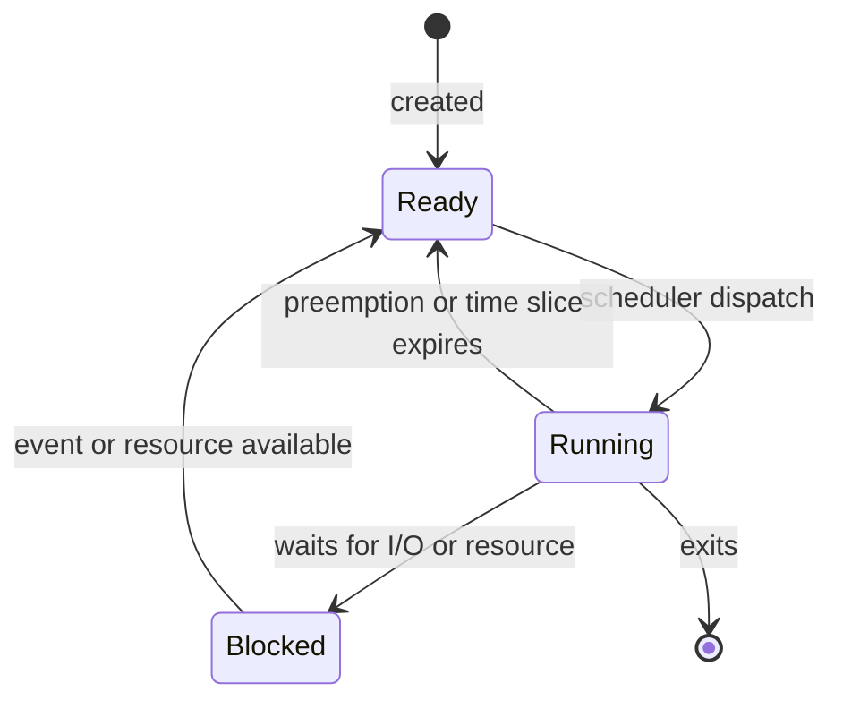

# Modern C++ Oral Exam Summary

This summary condenses all rewritten lessons into oral-exam answers. It includes the 5-minute material as answers, not as copied prompts, and covers the possible oral topics without importing the question list.

## Table of Contents

- [[#Oral Strategy|Oral Strategy]]
- [[#Recent Exam Drill|Recent Exam Drill]]
  - [[#Race Condition, Critical Region, and Mutex|Race Condition, Critical Region, and Mutex]]
  - [[#Passing Function Arguments|Passing Function Arguments]]
  - [[#Weak Pointers|Weak Pointers]]
  - [[#Process State Diagram|Process State Diagram]]
  - [[#Condition Variables|Condition Variables]]
  - [[#Switch Code Snippet|Switch Code Snippet]]
  - [[#Deadlock and Starvation|Deadlock and Starvation]]
  - [[#RAII and Mutex Methods|RAII and Mutex Methods]]
- [[#Types, Declarations, Scope, and Lifetime|Types, Declarations, Scope, and Lifetime]]
- [[#Pointers, Arrays, References, and Move Basics|Pointers, Arrays, References, and Move Basics]]
- [[#Structs, Enumerations, Statements, and Namespaces|Structs, Enumerations, Statements, and Namespaces]]
- [[#Functions and Interfaces|Functions and Interfaces]]
- [[#Classes, Constructors, Copy, Move, and RAII|Classes, Constructors, Copy, Move, and RAII]]
- [[#Memory Management|Memory Management]]
- [[#Derived Classes, Hierarchies, Runtime Polymorphism, and Casts|Derived Classes, Hierarchies, Runtime Polymorphism, and Casts]]
- [[#Operator Overloading|Operator Overloading]]
- [[#Templates and Generic Programming|Templates and Generic Programming]]
- [[#Smart Pointers|Smart Pointers]]
- [[#Standard Library|Standard Library]]
- [[#Build Pipeline, Preprocessor, Compiler, Linker, and Libraries|Build Pipeline, Preprocessor, Compiler, Linker, and Libraries]]
- [[#Socket Programming|Socket Programming]]
- [[#Threads, Lambdas, and Inter-Thread Communication|Threads, Lambdas, and Inter-Thread Communication]]
- [[#High-Priority Oral Focus|High-Priority Oral Focus]]

## Oral Strategy

- Start each answer with the definition, then add the reason, then give one code example.
- For ownership, lifetime, threads, sockets, and inheritance, always state the invariant or responsibility.
- Prefer precise words: declaration, definition, storage duration, lifetime, ownership, slicing, data race, critical region, file descriptor, byte order.
- When code is low-level or corrupted in the slides, explain the intended C++ rule instead of memorizing malformed syntax.

## Recent Exam Drill

This section is the short version for questions that appeared in recent oral sessions. The full explanations remain in the later sections.

### Race Condition, Critical Region, and Mutex

A **race condition** happens when the result of a program depends on the relative timing of operations from two or more threads. In C++, unsynchronized concurrent access to the same memory, with at least one write, can become a **data race** and gives undefined behavior.

```cpp
int a = 0;

void incr() {
    for (int i = 0; i < 100000; ++i) {
        a = a + 1; // load, add, store: not atomic
    }
}
```

`a = a + 1` is not one indivisible operation. Two threads can both read the same old value, both compute the same new value, and one increment is lost.

A **critical region** is the block of code that accesses shared state and must not be executed concurrently by multiple threads.

A **mutex** is a mutual-exclusion object. A thread locks it before entering a critical region and unlocks it after leaving. In C++, prefer RAII lock wrappers instead of manual `lock()`/`unlock()`.

```cpp
#include <mutex>

std::mutex m;
int counter = 0;

void safe_incr() {
    std::lock_guard<std::mutex> lock(m);
    ++counter;
} // lock_guard destructor unlocks m here
```

### Passing Function Arguments

For input-only arguments, choose by cost and mutation rule:

- `std::string`: pass by `const std::string&` because copying may allocate and the function must not modify it.
- `int`: pass by value because it is small and copying is cheap.
- `double`: pass by value for the same reason.

```cpp
void fun(const std::string& s, int i, double d);
```

If the function must keep the string beyond the call, it must copy it or take ownership through another design. A reference is only an alias and does not extend lifetime by itself.

### Weak Pointers

`std::weak_ptr` observes an object owned by `std::shared_ptr` without increasing the reference count. It is used when one object needs a link to another object but must not keep it alive.

Main use: break `shared_ptr` cycles. If two objects own each other with `shared_ptr`, the reference counts never reach zero and memory leaks. Replace at least one direction with `weak_ptr`.

```cpp
#include <memory>

struct Mum;

struct Son {
    std::weak_ptr<Mum> mum;
};

struct Mum {
    std::shared_ptr<Son> son;
};
```

A `weak_ptr` cannot be dereferenced directly. Use `lock()` to obtain a temporary `shared_ptr`; if the object expired, `lock()` returns an empty `shared_ptr`.

```cpp
void use(std::weak_ptr<Son> wp) {
    if (auto sp = wp.lock()) {
        // object is alive during this block
    }
}
```

### Process State Diagram

A **process** is a running program with CPU state, memory, and resources. The operating system scheduler moves processes among states.



- **Ready**: process can run, but CPU is assigned elsewhere.
- **Running**: process is currently using CPU.
- **Blocked**: process cannot run until an event happens, such as input becoming available.

### Condition Variables

A **condition variable** lets a thread sleep until shared-state condition changes. It avoids busy waiting in producer-consumer code.

Correct pattern:

- protect shared data with a mutex;
- use `std::unique_lock`, not `std::lock_guard`, because `wait()` must unlock and relock;
- pass a predicate to handle spurious wakeups;
- modify shared state under mutex;
- notify waiting thread after state changes.

```cpp
#include <condition_variable>
#include <mutex>
#include <queue>

std::queue<int> q;
std::mutex m;
std::condition_variable cv;

void producer() {
    {
        std::unique_lock<std::mutex> lock(m);
        q.push(17);
    }
    cv.notify_one();
}

void consumer() {
    std::unique_lock<std::mutex> lock(m);
    cv.wait(lock, [] {
        return !q.empty();
    });

    int value = q.front();
    q.pop();
    lock.unlock();

    use(value);
}
```

`wait(lock, pred)` checks `pred`. If false, it unlocks the mutex and sleeps. When notified, it wakes, locks the mutex again, re-checks `pred`, then continues.

### Switch Code Snippet

`switch` selects code by integer or enum value. Usually terminate each `case` with `break` or `return`; otherwise execution falls through.

```cpp
enum class Action { print, save, quit };

void handle(Action action) {
    switch (action) {
    case Action::print:
        print();
        break;
    case Action::save:
        save();
        break;
    case Action::quit:
        return;
    }
}
```

For enum switches, leaving out `default` can be useful because the compiler may warn when a new enumerator is not handled.

### Deadlock and Starvation

A **deadlock** happens when threads wait forever because each one needs a resource that cannot become available. Simple example: a thread locks a non-recursive mutex and then calls another function that tries to lock the same mutex.

```cpp
std::mutex m;

void f1() {
    std::lock_guard<std::mutex> lock(m);
}

void f2() {
    std::lock_guard<std::mutex> lock(m);
    f1(); // deadlock: same thread tries to lock m again
}
```

Common prevention rules:

- do not call unknown or locking functions while holding a mutex;
- keep critical regions small;
- acquire multiple mutexes in a fixed order;
- prefer `std::scoped_lock` for multiple mutexes.

```cpp
std::mutex m1;
std::mutex m2;

void safe_transfer() {
    std::scoped_lock lock(m1, m2);
    // access both protected resources
}
```

**Starvation** happens when one thread waits indefinitely because other threads keep getting access first. It is possible even without circular waiting. Reduce risk by holding locks briefly, avoiding long work inside critical regions, avoiding busy waiting, and designing fair producer-consumer notification logic.

### RAII and Mutex Methods

**RAII** means Resource Acquisition Is Initialization. Constructor acquires resource, destructor releases it. This makes cleanup automatic at scope exit, including early return and exceptions.

RAII solves manual cleanup problems for memory, files, sockets, mutexes, and threads.

```cpp
#include <cstdio>

class FileHandle {
    std::FILE* f;
public:
    explicit FileHandle(const char* path)
        : f{std::fopen(path, "r")} {}

    ~FileHandle() {
        if (f) {
            std::fclose(f);
        }
    }
};
```

For memory/resource handles, possible ownership strategies are:

1. prohibit copying with `= delete`;
2. deep-copy the owned resource;
3. transfer ownership with move constructor and move assignment;
4. use reference counting when ownership is genuinely shared.

```cpp
class UniqueHandle {
public:
    UniqueHandle(const UniqueHandle&) = delete;
    UniqueHandle& operator=(const UniqueHandle&) = delete;
    UniqueHandle(UniqueHandle&&) noexcept = default;
    UniqueHandle& operator=(UniqueHandle&&) noexcept = default;
};
```

Mutex RAII methods:

- `std::lock_guard<std::mutex>`: simplest scoped lock;
- `std::unique_lock<std::mutex>`: movable, can unlock/relock, required for condition variables;
- `std::scoped_lock`: locks one or more mutexes with deadlock-avoidance algorithm;
- `std::atomic<T>`: for simple flags/counters when no compound invariant is needed.

```cpp
std::mutex m;
bool ready = false;

void simple() {
    std::lock_guard<std::mutex> lock(m);
    // critical region
}

void with_wait(std::condition_variable& cv) {
    std::unique_lock<std::mutex> lock(m);
    cv.wait(lock, [] { return ready; });
}
```

## Types, Declarations, Scope, and Lifetime

**Types** define what values mean and which operations are valid. Fundamental types are built into C++: `bool`, character types, signed and unsigned integer types, floating-point types, and `void`. User-defined types come from programmers or libraries, for example `std::vector<int>`.

Sizes of many fundamental types are **implementation-defined**. The standard guarantees relative ordering such as `sizeof(char) <= sizeof(short) <= sizeof(int) <= sizeof(long)`, but not exact byte counts. Use `<cstdint>` for portable integer intentions such as `uint32_t`, `int16_t`, and `uint_fast32_t`. Use `size_t` from `<cstddef>` for object sizes.

```cpp
#include <cstdint>
#include <cstddef>

uint32_t exact32 {10};
uint_fast32_t fast_at_least32 {10};
size_t bytes = sizeof(exact32);
```

A **declaration** introduces a name and type. A **definition** provides the storage, function body, or class body needed to use that entity. C++ generally needs one definition for each entity that requires one.

```cpp
int f(int);        // declaration
int f(int x) {     // definition
    return x + 1;
}

extern int g;      // declaration
int g {0};         // definition
```

A declaration has optional specifiers, a base type, a declarator, optional suffixes, and maybe an initializer. Declarator operators include `*`, `&`, `&&`, `[]`, `()`, and suffix return type `->`.

```cpp
static const char* universities[] {"Padova", "Venezia"};
char* a[];      // array of pointers to char
char (*b)[];    // pointer to array of char
```

**Scope** defines where a name can be used. Main scopes are local, class, namespace, global, and statement scope. Names should be declared close to first use and initialized immediately. **Shadowing** happens when an inner declaration hides an outer one.

```cpp
int index = 10;

void f() {
    char index = 'a';          // hides global index
    for (int index = 0; index < 3; ++index) {
        std::cout << index;
    }
}
```

Initialization should be explicit. Brace initialization is often preferred because it prevents narrowing.

```cpp
int a {10};
// int b {0.2};    // error, narrowing
auto it = vec.begin();
```

Avoid `auto` when the deduced type is unclear, and avoid careless `auto x {1}` style because braces can interact with initializer-list deduction.

A C++ **object** is a contiguous region of storage. Object lifetime runs from construction to destruction. Main storage/lifetime categories:

- automatic objects live until scope exit;
- static and global objects live until program termination;
- free-store objects live until `delete`;
- `thread_local` objects live for one thread;
- temporaries usually live until end of full expression.

```cpp
std::cout << std::string("tmp").size() << std::endl;
```

`std::string("tmp")` is a temporary rvalue used for `.size()` and destroyed after the full expression.

An **lvalue** has identity, such as a named variable. An **rvalue** is movable and often temporary.

```cpp
std::vector<int> v1 {1, 2, 3};
auto v2 = make_vector();   // returned temporary initializes v2
auto v3 = v1;              // v1 is an lvalue, copy normally occurs
```

`const` means an object cannot be modified through that name. `constexpr` means a value or function can be evaluated at compile time when inputs are constant expressions.

```cpp
const int runtime_const = get_value();
constexpr int compile_time_const = 42;
```

Bitwise XOR example from the 5-minute material:

```cpp
uint_fast8_t a = 21;   // binary 10101
uint_fast8_t b = 11;   // binary 01011
uint_fast8_t c = a ^ b; // binary 11110, numeric value 30
```

The numeric value of `c` is `30`. If printing a small fast integer type behaves like character output, cast it:

```cpp
std::cout << static_cast<unsigned int>(c) << std::endl;
```

## Pointers, Arrays, References, and Move Basics

A **pointer** stores the address of an object. `&obj` gets an address. `*p` dereferences a pointer.

```cpp
char c = 'a';
char* p = &c;
char c2 = *p;
```

`void*` stores an address without type information. It can be copied, compared, and explicitly cast, but not dereferenced safely until converted to the correct type. `nullptr` is the portable null pointer value.

```cpp
int x {7};
void* pv = &x;
int* pi = static_cast<int*>(pv);
```

A raw pointer may be owning or non-owning, but the type does not say which. This ambiguity is why owning raw pointers should be wrapped in RAII handles or smart pointers.

```cpp
int stack_value {7};
int* non_owner = &stack_value;
int* owner = new int{7};
delete owner;
```

`const` with pointers must be read carefully.

```cpp
const std::string* p1;       // pointer to const string, pointer can change
std::string* const p2 = &s;  // const pointer to mutable string
const std::string* const p3 = &s; // const pointer to const string
```

For `const std::string* s`, the string cannot be modified through `s`, but `s` can point elsewhere. For `std::string* const s`, the pointer address cannot change, but the string can be modified through it.

Arrays are contiguous sequences with no runtime bounds checks and no stored size when passed to functions.

```cpp
int v1[] = {1, 2, 3, 4};
int v2[8] = {1, 2, 3, 4}; // rest become zero
```

Array names often decay to pointers to first element.

```cpp
int v[] = {1, 2, 3, 4};
int* p1 = v;
int* p2 = &v[0];
```

Pointer arithmetic is valid only within an array and one-past-the-end. The one-past pointer can be compared but not dereferenced.

```cpp
for (int* p = v; p != v + 4; ++p) {
    std::cout << *p << std::endl;
}
```

A **reference** is an alias for an existing object. It must be initialized, cannot be null, and cannot be rebound.

```cpp
int var {1};
int& ref {var};
++ref;             // var becomes 2
```

Pointers can represent optional objects with `nullptr`; references normally represent a required object.

An **rvalue reference** binds to a movable temporary. `std::move` does not move by itself; it casts an expression to an rvalue reference so move construction or move assignment can be selected.

```cpp
T tmp {std::move(a)};
a = std::move(b);
b = std::move(tmp);
```

## Structs, Enumerations, Statements, and Namespaces

A `struct` groups heterogeneous data. 
- Struct members are public by default. 
- Structs can be aggregate-initialized, can have constructors, and can enforce invariants when needed.

```cpp
struct Address {
    const char* name;
    int number;
    const char* street;
    char state[2];
};

Address jd {"Jim Dandy", 61, "South St", {'N', 'J'}};
```

Member access uses `.` for objects and references, `->` for pointers.

```cpp
addr.name = "Jim";
ptr->name = "Jim";
```

Struct layout follows member order, but the compiler may insert padding for alignment. Member order can affect object size. Bitfields pack small fields into selected bit widths, useful for low-level packet layouts, but representation and portability must be handled carefully.

```cpp
struct SimpleFlags {
    bool syn : 1;
    bool ack : 1;
    bool fin : 1;
};
```

`enum class` gives scoped, strongly typed named constants. It avoids implicit conversion to `int` and name clashes.

```cpp
enum class TrafficLight { green, yellow, red };
TrafficLight light = TrafficLight::red;
```

Plain `enum` leaks enumerator names into surrounding scope and converts to integer, so `enum class` is usually safer. Explicit enum values support flags.

```cpp
enum class PrinterFlag { acknowledge = 1, paper_empty = 2, busy = 4 };

constexpr PrinterFlag operator|(PrinterFlag a, PrinterFlag b) {
    return static_cast<PrinterFlag>(
        static_cast<int>(a) | static_cast<int>(b));
}
```

A **statement** specifies execution. Declarations are statements, so a variable declaration runs when control reaches it. Use braces with `if` and loops for clarity.

```cpp
if (p) {
    use(*p);
}
```

Conditions can be `bool` or convertible to `bool`. Nonzero integers and non-null pointers are true. `&&` and `||` short-circuit.

```cpp
if (p != nullptr && p->valid()) {
    process(*p);
}
```

The ternary operator is for simple expression selection.

```cpp
int result = ok ? 1 : 0;
```

`switch` selects among integer or enum cases. `break` exits the switch. Missing `break` causes fallthrough, which must be intentional and commented.

```cpp
switch (action) {
case Action::print:
    print(value);
    break;
case Action::save:
    save(value);
    break;
default:
    throw std::runtime_error{"unknown action"};
}
```

Range-for is best for traversing a container. Use references to modify elements.

```cpp
for (int& value : values) {
    ++value;
}
```

`for` is useful for index or iterator control, `while` for condition-driven loops, and `do while` when the body must execute at least once. `break`, `continue`, and `return` change control flow and should be clear.

Namespaces group logically related facilities and prevent name clashes. Use explicit qualification or selective using declarations. Avoid `using namespace std;` in headers.

```cpp
namespace TextLibrary {
    class Line {};
}

TextLibrary::Line line;
using std::string;
```

Argument-dependent lookup can find functions in namespaces associated with argument types, especially non-member operators.

## Functions and Interfaces

Functions name behavior and create reusable program structure. A function declaration gives name, parameter list, and return type. A definition gives the body.

```cpp
int square(int n);

int square(int n) {
    return n * n;
}
```

`void` return means no value is returned. A non-void function exits with `return value`. A function can also exit by falling off a `void` body, throwing, terminating from `noexcept`, or calling a non-returning system function.

Optional function specifiers:

- `inline` permits definitions in headers and suggests call-site expansion;
- `constexpr` permits compile-time evaluation when possible;
- `noexcept` promises no exceptions escape;
- `static` affects linkage in non-member contexts.

Argument passing decides copying, mutation, and ownership:

- pass small cheap values by value;
- pass large read-only values by `const&`;
- pass modifiable required objects by non-const reference only when mutation is clear;
- pass pointers when "no object" is meaningful;
- pass rvalue references for move and forwarding.

Efficient read-only passing for the 5-minute material:

```cpp
void fun(const std::string& s, int i, double d);
```

`std::string` is large enough to avoid copying and is passed by const reference. `int` and `double` are small and passed by value. All are non-modifiable by the function.

Arrays passed to functions decay to pointers, so size is lost.

```cpp
void f(int* p, size_t n);
void g(int (&r)[1000]); // fixed-size array reference
```

`std::initializer_list<T>` accepts homogeneous brace lists. Variadic templates are the type-safe way to accept arbitrary typed arguments. Ellipsis `...` is C-style and not type-safe.

Default arguments must be trailing.

```cpp
int f(int a, int b = 0, char* c = nullptr);
```

Function overloading uses same name with different parameter types. Return type alone does not overload. Resolution prefers exact matches, then promotions, standard conversions, user-defined conversions, and ellipsis.

Preconditions are requirements on inputs. Postconditions are guarantees on outputs or state after execution. The compiler checks types, not semantic rules like positive sizes.

Function pointers store addresses of functions. Modern C++ often prefers lambdas, function objects, and standard algorithms.

```cpp
void error(int);
void (*efct)(int) = error;
efct(10);
```

Macros are textual preprocessor substitutions and are not type-safe. Prefer `constexpr`, constants, functions, and templates. Keep macros mainly for conditional compilation and include guards.

```cpp
#ifndef MY_HEADER_H
#define MY_HEADER_H

// declarations

#endif
```

## Classes, Constructors, Copy, Move, and RAII

A class defines a user-defined type with representation, behavior, invariants, and interface. Public members form the interface. Private members hide representation and protect invariants.
Class invariant: for example, a date must be valid. It cannot represent impossible dates like `32/13/2025`

```cpp
class X {
    int m;
public:
    explicit X(int i = 0) : m{i} {}
    int set(int i) {
        int old = m;
        m = i;
        return old;
    }
};
```

Member functions can be defined inside the class, where they are implicitly inline, or outside with `ClassName::`.

```cpp
class X {
    int m;
public:
    int add(int j);
};

int X::add(int j) {
    return m + j;
}
```

Use `struct` for simple public aggregates. Use `class` when invariants matter. `friend` grants access to private members and should be limited.

Constructors initialize objects and establish invariants. Single-argument constructors should usually be `explicit` to prevent surprising implicit conversions.

```cpp
class Date {
public:
    explicit Date(int day);
};

Date d {15};
// Date d2 = 15; // rejected
```

In-class member initializers avoid duplicated defaults across constructors.

```cpp
class Date {
    int d {22};
    int m {2};
    int y {1992};
};
```

Const member functions promise not to modify logical object state.

```cpp
int getDay() const;
```

Logical constness allows cached internal data to change without changing visible value. Use `mutable` sparingly for caches.

```cpp
class Date {
    mutable std::string cache;
    mutable bool valid {false};
public:
    std::string string_rep() const;
};
```

`this` is a pointer to the current object. Returning `*this` by reference supports chaining.

```cpp
Date& add_year(int n) {
    y += n;
    return *this;
}
```

Static data members belong to the class, not one object. They represent shared state and can create thread-safety issues.

Object lifecycle operations include ordinary constructors, default constructor, copy constructor, move constructor, copy assignment, move assignment, and destructor.

```cpp
class X {
public:
    X();
    X(const X&);
    X(X&&);
    X& operator=(const X&);
    X& operator=(X&&);
    ~X();
};
```

Constructor/destructor order:

- base constructors run first;
- members are constructed in declaration order;
- constructor body runs last;
- destructor body runs first;
- members are destroyed in reverse order;
- base destructor runs last.

RAII means **Resource Acquisition Is Initialization**. Acquire resource in constructor, release in destructor. This makes cleanup automatic during scope exit and exceptions.

```cpp
class Handle {
    int* p;
public:
    explicit Handle(int* pp) : p{pp} {}
    int& operator*() { return *p; }
    ~Handle() { delete p; }
};

void f() {
    Handle h {new int{10}};
    std::cout << *h;
}
```

Initialization forms matter:

```cpp
Work w1 {"Teach", 19};
Work w2 {};
std::vector<int> v1 {77}; // one element 77
std::vector<int> v2 (77); // 77 elements
```

Member initializer lists construct members before the body and are more efficient than default construction followed by assignment.

```cpp
Person::Person(std::string n, std::string a)
    : name{std::move(n)}, address{std::move(a)} {}
```

Delegating constructors reuse one constructor from another.

```cpp
class X {
    int a;
public:
    explicit X(int x) : a{x} {}
    X() : X{22} {}
};
```

Copy must preserve equivalence and, when expected, independence. Default member-wise copy is fine for value members but dangerous for owning pointers.

```cpp
struct S {
    int* p;
};

S x {new int{0}};
S y {x};       // shallow copy, both point to same int
```

Deep copy allocates a new resource.

```cpp
struct S {
    int* p;
    explicit S(int v) : p{new int{v}} {}
    S(const S& other) : p{new int{*other.p}} {}
    ~S() { delete p; }
};
```

Move transfers resources from a source object to a destination. The moved-from object remains valid and destructible, but its previous value is not guaranteed.

```cpp
S(S&& other) noexcept : p{other.p} {
    other.p = nullptr;
}
```

Compiler-generated default operations are good only when member-wise semantics match class meaning. Owning resources usually require the Rule of Three or Rule of Five, or better, use standard RAII members so the Rule of Zero applies.

`= delete` forbids unwanted operations.

```cpp
class UniqueHandle {
public:
    UniqueHandle(const UniqueHandle&) = delete;
    UniqueHandle& operator=(const UniqueHandle&) = delete;
};
```

## Memory Management

C++ program memory has several regions:

- const data area for read-only compile-time data;
- stack for automatic variables and function call state;
- free store or heap for `new` allocations;
- global/static memory for static storage duration objects.

The stack is automatically managed. The free store is manually managed unless wrapped by RAII.

`new` allocates storage, constructs an object, and returns a pointer. `delete` calls the destructor and releases storage. `new[]` must be paired with `delete[]`.

```cpp
int* a {new int{10}};
delete a;

int* arr {new int[4]{1, 2, 3, 4}};
delete[] arr;
```

The **new expression** constructs an object. `operator new()` only allocates raw uninitialized storage. Similarly, `delete` destroys and deallocates; `operator delete()` is lower-level deallocation.

Placement new constructs an object in already allocated storage and requires manual destruction.

```cpp
alignas(std::string) unsigned char buf[sizeof(std::string)];
std::string* p = new (buf) std::string("hi");
std::destroy_at(p);
```

Manual memory management failures:

- memory leak: allocation is never deleted;
- dangling pointer: pointer used after object destruction;
- double deletion: same allocation deleted twice.

```cpp
int* p = new int{10};
if (*p == 10) {
    return;        // leak
}
delete p;
```

```cpp
int* p = new int{10};
delete p;
*p = 5;            // dangling pointer, undefined behavior
```

```cpp
int* p = new int{10};
delete p;
delete p;          // double deletion, undefined behavior
```

RAII is the preferred strategy. A handle object owns a resource and releases it in the destructor. Handles need correct copy and move behavior:

- prohibit copying;
- reference-count shared resources;
- transfer ownership through move;
- deep-copy underlying resource.

Raw resource access may be needed for APIs, but ownership must stay clear. A getter such as `get()` should not imply ownership transfer unless documented.

## Derived Classes, Hierarchies, Runtime Polymorphism, and Casts

Class relationships:

- **part of** uses data members;
- **is-a** or **extends** uses inheritance.

```cpp
class Shape {};
class Square : public Shape {};
class Circle : public Shape {};
```

Public inheritance means substitutability: a derived object can be used through a base pointer or reference.

```cpp
void draw_all(std::vector<Shape*> shapes);
```

C++ inheritance supports:

- implementation inheritance for code reuse;
- interface inheritance for runtime polymorphism.

Construction order in hierarchies:

- base constructor;
- derived members;
- derived constructor body.

Destruction is reverse. If deleting through a base pointer, use a virtual base destructor.

```cpp
struct Base {
    virtual ~Base() = default;
};
struct Derived : Base {
    ~Derived() override = default;
};
```

Slicing occurs when a derived object is copied into a base object by value; derived-specific state is lost.

```cpp
struct Employee {};
struct Manager : Employee { int level; };

void f(Employee e);
Manager m;
f(m);       // slices Manager part
```

Use pointers or references for polymorphism.

Virtual functions select implementation by dynamic object type.

```cpp
struct Employee {
    virtual void print() const;
};

struct Manager : Employee {
    void print() const override {
        Employee::print();
        std::cout << level << std::endl;
    }
    int level {};
};
```

`override` makes the compiler check that a derived function really overrides. `final` prevents further overriding or derivation. A pure virtual function uses `= 0`; any class with at least one pure virtual function is abstract.

```cpp
class Shape {
public:
    virtual void rotate() = 0;
    virtual ~Shape() = default;
};
```

Access control:

- `private` accessible only by class and friends;
- `protected` accessible by class, friends, and derived classes;
- `public` accessible to all.

Protected data is usually risky because derived classes can corrupt base invariants. Protected functions are safer.

Base-class access:

- public inheritance means "is-a";
- private inheritance hides the base interface and reuses implementation;
- protected inheritance allows further derived classes to access inherited interface.

Multiple inheritance can duplicate a common base subobject. Virtual base classes share that base.

```cpp
class D {};
class B : public virtual D {};
class C : public virtual D {};
class A : public B, public C {};
```

Runtime casts:

- upcast: derived to base, normally safe;
- downcast: base to derived, needs care;
- crosscast: across hierarchy branches, needs care.

`dynamic_cast` uses RTTI on polymorphic types. Pointer casts return `nullptr` on failure; reference casts throw `std::bad_cast`.

```cpp
void f(Base* p) {
    if (Derived* d = dynamic_cast<Derived*>(p)) {
        d->specific();
    }
}
```

```cpp
void g(Base& r) {
    try {
        Derived& d = dynamic_cast<Derived&>(r);
        d.specific();
    } catch (const std::bad_cast&) {
        // failed reference cast
    }
}
```

RTTI should be used sparingly. Prefer virtual functions when behavior depends on actual derived type.

```cpp
class Shape {
public:
    virtual void rotate() = 0;
};
```

Other casts:

- `static_cast` for related types and numeric conversions, no runtime check;
- `const_cast` to remove constness only when original object is not truly const;
- `reinterpret_cast` for low-level unrelated bit reinterpretation, most dangerous.

## Operator Overloading

Operator overloading lets user-defined types use expression syntax. Operators should preserve intuitive meaning and must be overloaded explicitly.

```cpp
class Complex {
    double re, im;
public:
    Complex(double r, double i) : re{r}, im{i} {}
    Complex operator+(const Complex& other) const {
        return {re + other.re, im + other.im};
    }
};
```

A binary operator can be a member `a.operator@(b)` or non-member `operator@(a, b)`. A unary operator can be a member `a.operator@()` or non-member `operator@(a)`. Non-member operators are required when the left operand is not under class control.

Cannot overload `::`, `.`, `.*`, `sizeof`, `alignof`, `typeid`, or `?:`. Cannot invent new operator symbols.

`operator<<` is normally a non-member returning `std::ostream&`, enabling chaining.

```cpp
class Y {
    int j {};
    friend std::ostream& operator<<(std::ostream& out, const Y& y);
};

std::ostream& operator<<(std::ostream& out, const Y& y) {
    return out << y.j;
}
```

`operator[]` gives subscript access. `operator()` creates function objects or functors.

```cpp
class CalculateAverageOfPowers {
    float acc {0};
    int n {0};
    float p;
public:
    explicit CalculateAverageOfPowers(float power) : p{power} {}
    void operator()(float x) {
        acc += std::pow(x, p);
        ++n;
    }
    float average() const { return acc / n; }
};
```

Functors are useful with algorithms because they can store state across calls.

## Templates and Generic Programming

Templates express generic code checked at compile time. They provide compile-time polymorphism, unlike runtime polymorphism with virtual functions. Standard Library containers and algorithms rely heavily on templates.

```cpp
template<typename T>
class Vector {
public:
    using value_type = T;
    T& operator[](int i);
};
```

A template specialization is generated when template arguments are known. `Vector<int>` and `Vector<std::string>` are distinct types. Templates have no inherent runtime overhead just because they are templates.

Template definitions usually live in headers because the compiler needs definitions at instantiation time.

```cpp
template<typename T>
T max_value(T a, T b) {
    return b < a ? a : b;
}
```

C++20 concepts express requirements on template parameters, improving diagnostics and constraints.

Class templates can contain member types, member functions, type aliases, friends, and member templates.

```cpp
template<typename T>
class Vector {
public:
    using value_type = T;
    using iterator = VectorIter<T>;
};
```

Member templates support conversion between related template instantiations.

```cpp
template<typename S>
class Complex {
    S re, im;
public:
    template<typename T>
    Complex(const Complex<T>& c) : re{c.real()}, im{c.imag()} {}
};
```

Function template arguments are often deduced.

```cpp
template<typename T1, typename T2>
std::pair<T1, T2> make_pair_like(T1 a, T2 b) {
    return {a, b};
}

auto p = make_pair_like(std::string{"Padova"}, 7.7);
```

When deduction is impossible, explicit template arguments are needed.

```cpp
template<typename T>
T* create();

int* p = create<int>();
```

Variadic templates use parameter packs for type-safe arbitrary argument lists.

```cpp
template<typename T, typename... Args>
void log_all(T value, Args... args) {
    std::cout << value << std::endl;
    if constexpr (sizeof...(args) > 0) {
        log_all(args...);
    }
}
```

## Smart Pointers

Raw pointers make ownership unclear. Smart pointers apply RAII to dynamic objects and live in `<memory>`.

Use `std::unique_ptr` for exclusive ownership. It is lightweight, movable, not copyable.

```cpp
auto up = std::make_unique<std::string>("ciao");
auto up2 = std::move(up);  // ownership transferred
```

Use `unique_ptr` when exactly one owner should delete the object. Passing patterns:

```cpp
void take(std::unique_ptr<T> p);        // takes ownership
void observe(const std::unique_ptr<T>& p); // observes handle
void use(T& obj);                       // uses object, no ownership concern

auto p = std::make_unique<T>();
take(std::move(p));
```

If a function takes `std::unique_ptr<T>` by value, ownership moves into the function and the object may be destroyed there. To return ownership, return the `unique_ptr`.

```cpp
std::unique_ptr<T> process(std::unique_ptr<T> p) {
    // use p
    return p;
}
```

`release()` returns the raw pointer and makes the `unique_ptr` empty, so caller must immediately transfer or delete it. `reset()` destroys the current object and optionally takes a new one.

```cpp
T* raw = p.release();
delete raw;

p.reset(new T{});
p.reset();
```

Use `std::shared_ptr` only when ownership is genuinely shared. It uses reference counting and deletes the object when last owner is gone.

```cpp
auto sp1 = std::make_shared<std::string>("ciao");
auto sp2 = sp1;       // count increases
sp1.reset();          // this owner releases
```

`use_count()` reports current owners but should not drive normal program logic. `get()` returns raw pointer without transferring ownership. Never delete a pointer from `get()`.

Do not create multiple independent smart pointers from the same raw pointer.

```cpp
std::string* raw = new std::string("ciao");
std::shared_ptr<std::string> a(raw);
std::shared_ptr<std::string> b(raw); // wrong, separate control blocks
```

Prefer:

```cpp
auto sp = std::make_shared<std::string>("ciao");
```

Use `std::weak_ptr` to observe an object managed by `shared_ptr` without extending its lifetime. This breaks ownership cycles.

```cpp
struct Son;
struct Mum {
    std::weak_ptr<Son> son;
};
struct Son {
    std::weak_ptr<Mum> mum;
};
```

A `weak_ptr` cannot be dereferenced directly. Use `lock()` to get a temporary `shared_ptr` if the object is still alive.

```cpp
if (auto sp = wp.lock()) {
    sp->use();
}
```

Smart pointer casts preserve shared ownership:

```cpp
std::shared_ptr<Base> pb = std::make_shared<Derived>();
std::shared_ptr<Derived> pd = std::dynamic_pointer_cast<Derived>(pb);
```

Exam ownership rules:

- `unique_ptr`: exclusive ownership, default choice for owning heap object;
- `shared_ptr`: shared ownership, use only when several owners control lifetime;
- `weak_ptr`: non-owning observation of `shared_ptr` object, used for cycles and caches.

## Standard Library

The C++ Standard Library is part of ISO C++. It provides language support, numeric limits, memory management, concurrency, containers, algorithms, math, strings, and I/O. Facilities live in namespace `std` and are declared in headers.

Containers own groups of objects and usually manage resources correctly.

Sequence containers:

- `std::vector<T>`: contiguous, usually default choice;
- `std::deque<T>`: efficient at both ends;
- `std::list<T>`: doubly linked list;
- `std::forward_list<T>`: singly linked list.

```cpp
std::vector<int> v {1, 2, 3, 4};
std::list<int> l {1, 2, 3, 4};
```

Associative containers:

- `std::map<K,V>` and `std::set<K>` are ordered by key;
- `std::multimap` and `std::multiset` allow duplicates;
- `std::unordered_map` and `std::unordered_set` use hashing.

```cpp
std::map<int, std::string> names;
names.insert(std::make_pair(4, "four"));
names[5] = "five";

auto it = names.find(4);
if (it != names.end()) {
    std::cout << it->second;
}
```

Use `find()` for lookup without insertion. `operator[]` inserts a default value when key is absent.

Container adaptors restrict an underlying container:

- `std::stack` is LIFO;
- `std::queue` is FIFO;
- `std::priority_queue` returns highest-priority element.

`std::array<T,N>` is fixed-size and container-like. `std::basic_string` is a specialized string container.

Iterators generalize pointers. `begin()` points to first element. `end()` points one-past-last. Algorithms use half-open ranges `[begin, end)`.

```cpp
for (auto it = v.begin(); it != v.end(); ++it) {
    ++(*it);
}
```

Iterator categories:

- input/output: one-pass;
- forward: forward traversal;
- bidirectional: forward and backward;
- random access: jumps, indexing, relational comparisons.

`std::sort` needs random access iterators, so it works on `vector` but not directly on `list`.

Algorithms in `<algorithm>` operate on iterator ranges. Families include non-modifying algorithms like `find`, `count`, `all_of`; output algorithms like `transform`; modifying algorithms like `copy`, `replace`, `rotate`; and ordering algorithms like `sort`, `binary_search`, `merge`.

```cpp
std::sort(v.begin(), v.end());
auto pos = std::find(v.begin(), v.end(), 10);
std::for_each(v.begin(), v.end(), [](int x) {
    std::cout << x << std::endl;
});
```

`std::string` is `std::basic_string<char>`. It stores characters contiguously and supports size, search, replace, substring, comparison, and conversion operations.

C++ streams are type-safe I/O abstractions:

- `std::cout` normal output;
- `std::cerr` errors;
- `std::clog` logging;
- `std::cin` input;
- `std::ifstream` input file;
- `std::ofstream` output file;
- `std::fstream` both;
- `std::stringstream` string-based stream.

```cpp
std::ofstream fout("test.txt");
if (!fout) {
    throw std::runtime_error{"open failed"};
}
fout << "a line" << std::endl;

std::ifstream fin("test.txt");
std::string line;
while (std::getline(fin, line)) {
    std::cout << line << std::endl;
}
```

Containers store, iterators connect, algorithms compute.

## Build Pipeline, Preprocessor, Compiler, Linker, and Libraries

C++ is compiled to machine code for a specific target such as x86, x64, or ARM. This gives speed but requires building for each platform/toolchain.

Build pipeline:

1. **Preprocessor** expands `#include`, `#define`, and conditional compilation, producing a translation unit.
2. **Compiler** parses and optimizes each translation unit into object files.
3. **Linker** resolves symbols across object files and libraries, producing an executable or library.

Headers are not compiled independently. Their text is included into `.cpp` files.

```cpp
// my-fun.h
#ifndef MY_FUN_H
#define MY_FUN_H
inline int incr(int i) { return i + 1; }
#endif
```

Without include guards, the same header can be included twice in one translation unit and produce redefinition errors.

Macros are textual and syntax-agnostic.

```cpp
#define AREA(a, b) ((a) * (b))
```

Prefer typed C++ constructs.

Compiler errors concern one translation unit: syntax errors, type errors, overload errors, duplicate definitions inside one translation unit. Linker errors concern cross-translation-unit symbol problems: undefined references or multiple definitions across object files.

```text
undefined reference to `incr(int)`
multiple definition of `incr(int)`
```

Optimization levels:

- `-O0`: little optimization, debug-friendly;
- `-O1`: limited optimization;
- `-O2`: high common optimization;
- `-O3`: maximum optimization, harder debugging.

Static libraries archive object files into the executable. Executables become larger but more self-contained. Shared or dynamic libraries are loaded at runtime, can be shared by programs, and allow updating one library without rebuilding every executable when ABI remains compatible.

Thread code on Unix-like systems may need pthread linkage, for example `-pthread` or build-system checks for `pthread_create`.

## Socket Programming

A socket is a Unix/POSIX communication endpoint represented by a **file descriptor**. It supports process-to-process communication. Network layer routes to a host by IP address; transport layer routes to a process/service by port.

Endpoint identity:

```text
<ip_address, port>
```

Use ports above `1024` for lab programs. A server listens on a known address/port. A client connects or sends to that address/port. Client and server are programs, not necessarily different machines.

Main socket types:

- `SOCK_DGRAM`: UDP datagram, connectionless, fast, unreliable, preserves datagram boundaries;
- `SOCK_STREAM`: TCP stream, connected, reliable, two-way byte stream;
- raw sockets: low-level and outside normal course scope.

Buffers must be initialized before use.

```cpp
char buffer[256] = {0};
std::array<char, 256> b {};
```

Use `buffer.data()` with `std::array` when a C API needs raw memory. Avoid heap buffers unless ownership is managed.

Core headers:

```cpp
#include <cstring>
#include <sys/socket.h>
#include <netinet/in.h>
#include <arpa/inet.h>
#include <unistd.h>
#include <signal.h>
```

`socket()` creates a descriptor and returns negative on error.

```cpp
int udp_fd = socket(AF_INET, SOCK_DGRAM, 0);
int tcp_fd = socket(AF_INET, SOCK_STREAM, 0);
if (udp_fd < 0) {
    // error
}
```

Use `sockaddr_in` for IPv4 addresses and initialize it to zero.

```cpp
sockaddr_in addr {};
addr.sin_family = AF_INET;
addr.sin_port = htons(port);
addr.sin_addr.s_addr = htonl(INADDR_ANY);
```

Network byte order is big endian. Use:

- `htons` for ports;
- `htonl` for IPv4 integer addresses;
- `ntohs` and `ntohl` in reverse.

`inet_pton()` converts text IP to binary address. `inet_ntop()` converts back. Older code may use `inet_addr()` and `inet_ntoa()`.

`bind()` associates a local IP/port/interface with a socket. Servers normally bind.

```cpp
int s = socket(AF_INET, SOCK_STREAM, 0);
sockaddr_in local {};
local.sin_family = AF_INET;
local.sin_port = htons(55555);
local.sin_addr.s_addr = htonl(INADDR_ANY);

if (bind(s, reinterpret_cast<sockaddr*>(&local), sizeof(local)) < 0) {
    // error
}
```

`close(fd)` closes the descriptor. `shutdown(fd, SHUT_RD)`, `SHUT_WR`, or `SHUT_RDWR` disables communication direction without immediately just closing the descriptor.

UDP server flow:

1. `socket(AF_INET, SOCK_DGRAM, 0)`;
2. optional `setsockopt(SO_REUSEADDR)`;
3. fill local `sockaddr_in`;
4. `bind()`;
5. `recvfrom()` into buffer and source address;
6. `sendto()` response to source;
7. `close()`.

```cpp
sockaddr_in src {};
socklen_t len = sizeof(src);
int n = recvfrom(s, buffer, sizeof(buffer), 0,
                 reinterpret_cast<sockaddr*>(&src), &len);
if (n >= 0) {
    sendto(s, buffer, n, 0,
           reinterpret_cast<sockaddr*>(&src), len);
}
```

UDP client flow:

1. create UDP socket;
2. fill destination `sockaddr_in` with server IP/port;
3. `sendto()`;
4. `recvfrom()`;
5. `close()`.

TCP server flow:

1. `socket(AF_INET, SOCK_STREAM, 0)`;
2. optional `setsockopt(SO_REUSEADDR)`;
3. `bind()`;
4. `listen(listening_fd, backlog)`;
5. `accept()` returns a new connected socket;
6. `recv()`/`send()` or `read()`/`write()` on connected socket;
7. close connected socket and listening socket.

```cpp
listen(listen_fd, 5);
sockaddr_in client {};
socklen_t len = sizeof(client);
int client_fd = accept(listen_fd,
    reinterpret_cast<sockaddr*>(&client), &len);
```

TCP client flow:

1. create TCP socket;
2. fill server address;
3. `connect()`;
4. `send()`/`recv()`;
5. `close()`.

```cpp
if (connect(s, reinterpret_cast<sockaddr*>(&server),
            sizeof(server)) < 0) {
    // error
}
```

`send()`/`recv()` are socket-specific. `write()`/`read()` work on file descriptors and are equivalent to basic socket use with flag `0`.

TCP is a byte stream: one `send()` does not guarantee one matching `recv()` of same size. Robust code handles partial sends and receives.

Always check return values. Negative means error for many calls. `recv()` returning `0` on TCP means peer performed orderly shutdown.

`SIGPIPE` can occur when writing to a socket whose peer is gone. Default behavior may terminate the process. A server can ignore or handle it.

```cpp
struct sigaction act {};
act.sa_handler = SIG_IGN;
sigaction(SIGPIPE, &act, nullptr);
```

`SO_REUSEADDR` lets a server reuse a port quickly after restart.

```cpp
int option = 1;
setsockopt(s, SOL_SOCKET, SO_REUSEADDR,
           reinterpret_cast<char*>(&option), sizeof(option));
```

Useful lab tools:

- `ip addr` or old `ifconfig` to inspect local IP;
- `ping` to test reachability;
- `nc -l 55555` and `nc host 55555` for TCP tests;
- `nc -lu 55556` and `nc -u host 55556` for UDP tests;
- loopback `127.0.0.1` for local tests.

Threads are useful in socket chat programs because one execution flow can wait for keyboard input while another waits for network input.

## Threads, Lambdas, and Inter-Thread Communication

Parallel programming lets a program perform multiple activities at the same time. A process is a running program with its own address space and resources. A thread is an execution path inside a process.

Threads of the same process:

- share address space and many resources;
- have separate execution flow and stack;
- are lighter than processes;
- can communicate through shared memory;
- can crash or corrupt the whole process if one thread fails badly.

When multiple threads run in parallel, the scheduler may run them truly at the same time on different cores or interleave them quickly on fewer cores. Operations from different threads can overlap in many orders. Shared memory needs synchronization.

`std::thread` starts a task.

```cpp
void incr(int n_times) {
    for (int i = 0; i < n_times; ++i) {
        ++a;
    }
}

std::thread thr(incr, 200);
thr.join();
```

A joinable `std::thread` must be joined or detached before destruction, or the program terminates. `join()` waits for completion and is usually preferred. `detach()` releases control and is risky unless lifetime is designed carefully.

```cpp
if (thr.joinable()) {
    thr.join();
}
```

Use RAII to join threads during scope exit.

```cpp
class JoiningThread {
    std::thread t;
public:
    explicit JoiningThread(std::thread tt) : t{std::move(tt)} {}
    ~JoiningThread() {
        if (t.joinable()) {
            t.join();
        }
    }
};
```

Thread arguments are copied by default. Use `std::ref` to pass a true reference. Use `std::move` to transfer ownership or avoid copying. Use pointers or smart pointers when an object must be shared and lifetime is handled.

```cpp
void incr(int& v) {
    ++v;
}

int v = 1;
std::thread thr(incr, std::ref(v));
thr.join(); // v is 2
```

Member function tasks need an object pointer, reference wrapper, or smart pointer.

```cpp
struct A {
    int a {};
    void incr(int n) {
        for (int i = 0; i < n; ++i) {
            ++a;
        }
    }
};

A item {};
std::thread t(&A::incr, &item, 200);
t.join();
```

Passing `item` by value would run on a copy. Passing `&item` or `std::ref(item)` runs on original object, so lifetime and synchronization matter.

A lambda is an anonymous function object.

```cpp
[capture](parameters) -> return_type {
    body
}
```

Capture rules:

- `[a]`: capture `a` by value;
- `[&a]`: capture `a` by reference;
- `[=]`: capture used variables by value;
- `[&]`: capture used variables by reference;
- `[this]`: capture current object.

Value captures are const inside the lambda unless `mutable` is used. `mutable` changes the lambda's copy, not the original.

```cpp
int a = 0;
std::thread t1([&a] { a = a + 1; });
t1.join(); // a is 1

std::thread t2([](int v) { v = v + 1; }, a);
t2.join(); // a unchanged

std::thread t3([a]() mutable { a = a + 1; });
t3.join(); // original a unchanged
```

Avoid reference captures in detached or long-running threads unless referenced objects outlive the thread.

Shared-memory operations are not necessarily atomic. `a = a + 1` is load, modify, store. Two threads can interleave those steps.

```cpp
int a = 0;
void incr() {
    for (int i = 0; i < 100000; ++i) {
        a = a + 1;
    }
}
```

A **race condition** occurs when result depends on relative ordering of operations from multiple threads. Lost update example: both threads read `10`, both compute `11`, both write `11`; two increments logically happened, final value increased once.

If two or more threads access a critical region without thread-safe mechanism, behavior becomes nondeterministic; data can be lost, invariants can break, containers can be corrupted, and C++ data races produce undefined behavior.

A **critical region** is code that accesses shared state and must execute as if indivisible.

Use a mutex for mutual exclusion.

```cpp
std::mutex m;
int a = 0;

void safe_incr() {
    std::lock_guard<std::mutex> lock(m);
    ++a;
}
```

Manual `lock()`/`unlock()` is risky because early returns or exceptions can skip unlock. RAII locks solve it.

```cpp
std::unique_lock<std::mutex> lock(m);
// shared access
```

`std::lock_guard` is simple and lightweight. `std::unique_lock` is more flexible and required for condition variables.

Starvation occurs when one thread waits indefinitely because others keep acquiring resources first. Deadlock occurs when progress is impossible, for example a thread tries to lock a non-recursive mutex it already owns.

```cpp
std::mutex m;

void f1() {
    std::unique_lock<std::mutex> lk(m);
}

void f2() {
    std::unique_lock<std::mutex> lk(m);
    f1(); // deadlock with same non-recursive mutex
}
```

Busy waiting repeatedly checks a condition and wastes CPU.

```cpp
while (q.empty()) {
    // bad normal application pattern
}
```

Producer-consumer uses one thread producing values and another consuming them from a shared queue. Protect the queue with a mutex and use a condition variable to sleep until data is available.

```cpp
std::queue<int> q;
std::mutex m;
std::condition_variable cv;
std::atomic<bool> done {false};
```

Consumer:

```cpp
std::thread consumer([&] {
    while (true) {
        std::unique_lock<std::mutex> lk(m);
        cv.wait(lk, [&] {
            return !q.empty() || done.load();
        });
        if (q.empty() && done.load()) {
            break;
        }
        int value = q.front();
        q.pop();
        lk.unlock();
        use(value);
    }
});
```

Producer:

```cpp
{
    std::unique_lock<std::mutex> lk(m);
    q.push(17);
}
cv.notify_one();

done.store(true);
cv.notify_all();
consumer.join();
```

`cv.wait(lk, pred)` checks predicate while locked. If predicate is false, it unlocks mutex and blocks. When notified, it wakes, re-locks, re-checks predicate, and returns only when predicate is true. Predicates handle spurious wakeups and shutdown.

Atomics provide interference-free operations for simple flags and counters.

```cpp
std::atomic<int> n {0};
int old = n.exchange(3);
n.store(5);
int value = n.load();
```

Use atomics for simple shared flags or counters. Use mutexes for complex shared structures like queues.

## High-Priority Oral Focus

Memory management answer pattern:

- name memory region and lifetime;
- explain `new`/`delete` responsibility;
- list leak, dangling pointer, double delete;
- finish with RAII and smart pointers.

Derived class answer pattern:

- public inheritance models is-a substitutability;
- base pointers/references can refer to derived objects;
- virtual functions dispatch on dynamic type;
- slicing happens on by-value base copies;
- virtual destructors matter for deletion through base pointer;
- `override`, `final`, and pure virtual functions make hierarchy intent explicit.

Smart pointer answer pattern:

- raw pointer does not express ownership;
- `unique_ptr` for one owner and move transfer;
- `shared_ptr` for shared ownership and reference counting;
- `weak_ptr` for non-owning observation and cycle breaking;
- use `make_unique` and `make_shared`;
- do not create multiple smart pointers from same raw pointer.

Thread answer pattern:

- threads share process memory and execute independently;
- arguments copy by default;
- use `join()` or RAII for lifetime;
- reference sharing needs `std::ref`, pointer, or smart pointer;
- lambdas must be analyzed by capture list;
- shared mutation needs mutex, condition variable, or atomic.

Socket answer pattern:

- socket is file descriptor for endpoint communication;
- IP selects host, port selects process/service;
- UDP uses `SOCK_DGRAM`, `sendto`, `recvfrom`;
- TCP uses `SOCK_STREAM`, `listen`, `accept`, `connect`, `send`, `recv`;
- fill `sockaddr_in`, convert byte order, check returns, close descriptors;
- handle `SIGPIPE` and use `SO_REUSEADDR` when restarting servers.
