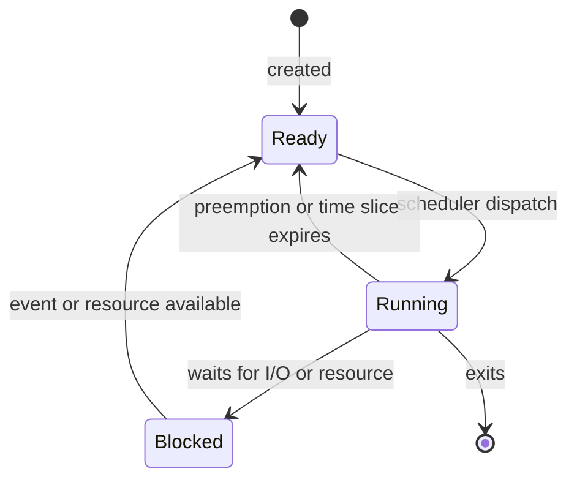

# Modern C++ Oral Exam Summary

- **Goal** → dense oral-review notes for Modern C++ exam.
- **Scope** → rewritten lessons + 5-minute material + recent oral topics.
- **Style** → definition first, then ownership/lifetime, example, caveat.

## Oral Strategy

- **Answer shape** → definition → reason → tiny code/example → caveat.
- **Always state** → ownership, lifetime, invariant, synchronization, responsibility.
- **Use exact words** → declaration, definition, storage duration, lifetime, ownership, slicing, data race, critical region, file descriptor, byte order.
- **Malformed slide code** → explain intended C++ rule, not PDF artifacts.

## Recent Exam Drill

- **Use this section first** → fast answers for recent professor questions.
- **Then expand** → later sections contain same topics in broader context.

### Race Condition, Critical Region, and Mutex

- **Definition** → race condition: program result depends on timing/order of operations from multiple threads.
- **C++ caveat** → unsynchronized concurrent access to same memory + at least one write → data race → undefined behavior.
- **Mechanism** → `a = a + 1` → load → add → store; not atomic.

```cpp
int a = 0;

void incr() {
    for (int i = 0; i < 100000; ++i) {
        a = a + 1;
    }
}
```

- **Critical region** → code accessing shared state that must not run concurrently.
- **Mutex** → mutual-exclusion object; lock before critical region, unlock after.
- **RAII lock** → constructor locks, destructor unlocks.

```cpp
#include <mutex>

std::mutex m;
int counter = 0;

void safe_incr() {
    std::lock_guard<std::mutex> lock(m);
    ++counter;
}
```

- **Caveat** → manual `lock()`/`unlock()` can miss unlock on return/exception → prefer RAII wrappers.

### Passing Function Arguments

| Argument | Pass as | Reason |
| --- | --- | --- |
| `std::string` input-only | `const std::string&` | avoid copy/allocation + forbid mutation |
| `int` input-only | `int` | small, cheap copy |
| `double` input-only | `double` | small, cheap copy |

```cpp
void fun(const std::string& s, int i, double d);
```

- **Caveat** → reference aliases caller object; does not extend lifetime.
- **If function stores value** → copy string or use explicit ownership design.

### Weak Pointers

- **Definition** → `std::weak_ptr` observes object owned by `std::shared_ptr`.
- **Ownership** → does not increase reference count → does not keep object alive.
- **Main use** → break `shared_ptr` cycles.
- **Cycle problem** → two objects owning each other with `shared_ptr` → counts never reach zero → leak.

```cpp
#include <memory>

struct Mum;

struct Son {
    std::weak_ptr<Mum> mum;
};

struct Mum {
    std::shared_ptr<Son> son;
};
```

- **Use** → call `lock()`; result is temporary `shared_ptr` if object still alive.

```cpp
void use(std::weak_ptr<Son> wp) {
    if (auto sp = wp.lock()) {
        // use sp
    }
}
```

- **Caveat** → cannot dereference `weak_ptr` directly.

### Process State Diagram

- **Definition** → process: running program with CPU state, memory, resources.
- **Scheduler role** → moves process among states.



| State | Meaning |
| --- | --- |
| **Ready** | can run, CPU assigned elsewhere |
| **Running** | currently using CPU |
| **Blocked** | waiting for event/resource/input |

### Condition Variables

- **Definition** → condition variable lets thread sleep until shared-state condition changes.
- **Purpose** → producer-consumer without busy waiting.
- **Pattern** → mutex protects data → `unique_lock` waits → predicate handles spurious wakeups → producer changes state → notify.
- **Why `unique_lock`** → `wait()` must unlock while sleeping and relock before continuing.

```cpp
#include <condition_variable>
#include <mutex>
#include <queue>

std::queue<int> q;
std::mutex m;
std::condition_variable cv;

void producer() {
    {
        std::unique_lock<std::mutex> lock(m);
        q.push(17);
    }
    cv.notify_one();
}

void consumer() {
    std::unique_lock<std::mutex> lock(m);
    cv.wait(lock, [] { return !q.empty(); });

    int value = q.front();
    q.pop();
    lock.unlock();
    use(value);
}
```

- **Wait flow** → check predicate → if false unlock + sleep → notify → wake → relock → re-check predicate.
- **Caveat** → always wait with predicate.

### Switch Code Snippet

- **Definition** → `switch` selects branch by integer/enum value.
- **Rule** → terminate `case` with `break` or `return`; otherwise fallthrough.

```cpp
enum class Action { print, save, quit };

void handle(Action action) {
    switch (action) {
    case Action::print:
        print();
        break;
    case Action::save:
        save();
        break;
    case Action::quit:
        return;
    }
}
```

- **Enum caveat** → no `default` can help compiler warn about missing enumerators.

### Deadlock and Starvation

- **Deadlock** → threads wait forever because needed resource cannot become available.
- **Example cause** → same thread locks non-recursive mutex, then calls function that locks same mutex.

```cpp
std::mutex m;

void f1() {
    std::lock_guard<std::mutex> lock(m);
}

void f2() {
    std::lock_guard<std::mutex> lock(m);
    f1();
}
```

- **Prevention** →
  - keep critical regions small;
  - do not call unknown/locking functions while holding mutex;
  - acquire multiple mutexes in fixed order;
  - use `std::scoped_lock` for multiple mutexes.

```cpp
std::mutex m1;
std::mutex m2;

void safe_transfer() {
    std::scoped_lock lock(m1, m2);
}
```

- **Starvation** → thread waits indefinitely because others keep acquiring resource first.
- **Mitigation** → short locks, no long work in critical region, avoid busy waiting, fair notification logic.

### RAII and Mutex Methods

- **Definition** → RAII: Resource Acquisition Is Initialization.
- **Lifecycle** → constructor acquires → object lives → destructor releases.
- **Consequence** → cleanup automatic at scope exit, early return, exceptions.
- **Resources** → memory, files, sockets, mutexes, threads.

```cpp
#include <cstdio>

class FileHandle {
    std::FILE* f;
public:
    explicit FileHandle(const char* path)
        : f{std::fopen(path, "r")} {}

    ~FileHandle() {
        if (f) std::fclose(f);
    }
};
```

| Handle strategy | Meaning |
| --- | --- |
| `= delete` copy | resource cannot be copied |
| deep copy | new resource with same value |
| move | transfer ownership |
| reference count | shared ownership |

```cpp
class UniqueHandle {
public:
    UniqueHandle(const UniqueHandle&) = delete;
    UniqueHandle& operator=(const UniqueHandle&) = delete;
    UniqueHandle(UniqueHandle&&) noexcept = default;
    UniqueHandle& operator=(UniqueHandle&&) noexcept = default;
};
```

| Mutex method | Use |
| --- | --- |
| `std::lock_guard<std::mutex>` | simplest scoped lock |
| `std::unique_lock<std::mutex>` | unlock/relock, movable, condition variables |
| `std::scoped_lock` | one or more mutexes, deadlock avoidance |
| `std::atomic<T>` | simple flags/counters, no compound invariant |

```cpp
std::mutex m;
bool ready = false;

void simple() {
    std::lock_guard<std::mutex> lock(m);
}

void with_wait(std::condition_variable& cv) {
    std::unique_lock<std::mutex> lock(m);
    cv.wait(lock, [] { return ready; });
}
```

## Types, Declarations, Scope, and Lifetime

- **Type** → defines value meaning + valid operations.
- **Fundamental types** → `bool`, char types, signed/unsigned integers, floating types, `void`.
- **User-defined types** → classes, structs, enums, library types such as `std::vector<int>`.
- **Implementation-defined sizes** → standard gives relations, not exact byte counts.
- **Portable sizes** → `<cstdint>`: `uint32_t`, `int16_t`, `uint_fast32_t`; `<cstddef>`: `size_t`.

```cpp
#include <cstdint>
#include <cstddef>

uint32_t exact32 {10};
uint_fast32_t fast32 {10};
size_t bytes = sizeof(exact32);
```

- **Declaration** → introduces name + type.
- **Definition** → provides storage/body/class members needed for use.

```cpp
int f(int);
int f(int x) { return x + 1; }

extern int g;
int g {0};
```

- **Declarator operators** → `*`, `&`, `&&`, `[]`, `()`, `->`.

```cpp
char* a[];
char (*b)[];
```

| Concept | Compact answer |
| --- | --- |
| Scope | where name can be used |
| Local scope | block/function |
| Class scope | members in class |
| Namespace/global scope | names visible after declaration |
| Statement scope | `for`, `if`, `while`, `switch` control |
| Shadowing | inner name hides outer name |

```cpp
int index = 10;

void f() {
    char index = 'a';
    for (int index = 0; index < 3; ++index) {
        std::cout << index;
    }
}
```

- **Initialization** → prefer explicit initialization.
- **Brace initialization** → prevents narrowing.
- **`auto`** → useful when initializer makes type clear; avoid unclear deduction.

```cpp
int a {10};
auto it = vec.begin();
```

| Lifetime category | End |
| --- | --- |
| automatic | scope exit |
| static/global | program termination |
| free store | `delete` |
| `thread_local` | thread end |
| temporary | end of full expression |

```cpp
std::cout << std::string("tmp").size() << std::endl;
```

| Value category | Key idea |
| --- | --- |
| lvalue | has identity, usually named |
| rvalue | movable, often temporary |

- **`const`** → cannot modify through that name.
- **`constexpr`** → can be evaluated at compile time when inputs are constant expressions.
- **5-minute XOR** → `21 ^ 11 = 30`; cast small integer type when stream prints character-like output.

```cpp
uint_fast8_t a = 21;
uint_fast8_t b = 11;
uint_fast8_t c = a ^ b;
std::cout << static_cast<unsigned int>(c) << std::endl;
```

## Pointers, Arrays, References, and Move Basics

- **Pointer** → stores address of object.
- **Operators** → `&obj` address, `*p` dereference.

```cpp
char c = 'a';
char* p = &c;
char c2 = *p;
```

| Tool | Meaning | Caveat |
| --- | --- | --- |
| `void*` | address without type | cannot dereference until correct cast |
| `nullptr` | no object | portable null pointer |
| raw pointer | may own or observe | type does not say ownership |

```cpp
int x {7};
void* pv = &x;
int* pi = static_cast<int*>(pv);
```

| Syntax | Meaning |
| --- | --- |
| `const std::string* p` | pointer to const string; pointer can change |
| `std::string* const p` | const pointer to mutable string |
| `const std::string* const p` | const pointer to const string |

- **Array** → contiguous sequence, no bounds checks, size lost on decay to pointer.

```cpp
int v[] = {1, 2, 3, 4};
int* p1 = v;
int* p2 = &v[0];
```

- **Pointer arithmetic** → valid within array and one-past-end; never dereference one-past.

```cpp
for (int* p = v; p != v + 4; ++p) {
    std::cout << *p << std::endl;
}
```

| Reference kind | Meaning |
| --- | --- |
| lvalue reference | alias existing object |
| rvalue reference | binds movable temporary |

```cpp
int var {1};
int& ref {var};
++ref;
```

- **Reference caveats** → must initialize, cannot be null, cannot rebind.
- **`std::move`** → casts to rvalue reference; actual move occurs only if move constructor/assignment selected.

```cpp
T tmp {std::move(a)};
a = std::move(b);
b = std::move(tmp);
```

## Structs, Enumerations, Statements, and Namespaces

- **`struct`** → public-by-default aggregate of heterogeneous data.
- **Use** → simple data; can still define constructors/invariants.

```cpp
struct Address {
    const char* name;
    int number;
    const char* street;
    char state[2];
};

Address jd {"Jim Dandy", 61, "South St", {'N', 'J'}};
```

| Member access | Syntax |
| --- | --- |
| object/reference | `obj.member` |
| pointer | `ptr->member` |

- **Layout** → member order preserved; padding may be inserted for alignment.
- **Bitfields** → compact low-level fields; representation/portability caveat.

```cpp
struct SimpleFlags {
    bool syn : 1;
    bool ack : 1;
    bool fin : 1;
};
```

| Enum type | Scope | Converts to `int` | Preferred |
| --- | --- | --- | --- |
| `enum class` | scoped | no | yes |
| plain `enum` | leaks names | yes | no |

```cpp
enum class TrafficLight { green, yellow, red };
TrafficLight light = TrafficLight::red;
```

- **Explicit enum values** → useful for flags.

```cpp
enum class PrinterFlag { acknowledge = 1, paper_empty = 2, busy = 4 };

constexpr PrinterFlag operator|(PrinterFlag a, PrinterFlag b) {
    return static_cast<PrinterFlag>(
        static_cast<int>(a) | static_cast<int>(b));
}
```

| Statement | Use |
| --- | --- |
| declaration | introduces object/name, executes when reached |
| `if` | conditional branch |
| ternary `?:` | simple expression choice |
| `switch` | integer/enum cases |
| range-for | traverse range |
| `for` | index/iterator loop |
| `while` | condition-driven loop |
| `do while` | body at least once |
| `break` | exit loop/switch |
| `continue` | next iteration |
| `return` | exit function |

```cpp
if (p != nullptr && p->valid()) {
    process(*p);
}
```

```cpp
switch (action) {
case Action::print:
    print(value);
    break;
case Action::save:
    save(value);
    break;
default:
    throw std::runtime_error{"unknown action"};
}
```

- **Short-circuit** → `&&` / `||` skip second operand when result known.
- **Switch caveat** → missing `break` → fallthrough; comment if intentional.
- **Namespace** → groups related names; prevents clashes.
- **Use** → prefer explicit qualification or selective `using`; no `using namespace std;` in headers.

```cpp
namespace TextLibrary {
    class Line {};
}

TextLibrary::Line line;
using std::string;
```

- **ADL** → function lookup can include namespaces associated with argument types.

## Functions and Interfaces

- **Function declaration** → name + parameters + return type.
- **Function definition** → executable body.

```cpp
int square(int n);

int square(int n) {
    return n * n;
}
```

| Specifier | Meaning |
| --- | --- |
| `inline` | header-friendly definition, possible call-site expansion |
| `constexpr` | compile-time evaluation when possible |
| `noexcept` | no exceptions escape |
| `static` | linkage effect for non-members |

| Passing style | Use |
| --- | --- |
| by value | small cheap values |
| `const&` | large read-only objects |
| non-const `&` | required mutation, clear intent |
| pointer | optional object / `nullptr` meaningful |
| `&&` | move/forwarding |

```cpp
void fun(const std::string& s, int i, double d);
```

- **Arrays** → decay to pointer; pass size or fixed-size reference.

```cpp
void f(int* p, size_t n);
void g(int (&r)[1000]);
```

- **`std::initializer_list<T>`** → homogeneous brace list.
- **Variadic templates** → type-safe arbitrary typed arguments.
- **Ellipsis `...`** → C-style, not type-safe.
- **Default arguments** → trailing only.

```cpp
int f(int a, int b = 0, char* c = nullptr);
```

- **Overloading** → same name, different parameter types; return type alone ignored.
- **Resolution order** → exact → promotions → standard conversions → user-defined conversions → ellipsis.
- **Precondition** → caller-side requirement.
- **Postcondition** → guarantee after return.
- **Function pointer** → address of function; modern C++ often uses lambdas/functors/algorithms.

```cpp
void error(int);
void (*efct)(int) = error;
efct(10);
```

- **Macros** → textual, not type-safe; prefer constants/functions/templates.
- **Include guards** → avoid repeated header body in same translation unit.

```cpp
#ifndef MY_HEADER_H
#define MY_HEADER_H

#endif
```

## Classes, Constructors, Copy, Move, and RAII

- **Class** → user-defined type with representation + behavior + invariant + interface.
- **Public** → supported interface.
- **Private** → representation; protects invariants.

```cpp
class X {
    int m;
public:
    explicit X(int i = 0) : m{i} {}
    int set(int i) {
        int old = m;
        m = i;
        return old;
    }
};
```

- **Member definition** → inside class = implicitly inline; outside uses `ClassName::`.

```cpp
class X {
    int m;
public:
    int add(int j);
};

int X::add(int j) {
    return m + j;
}
```

| Feature | Exam point |
| --- | --- |
| `struct` | public aggregate |
| `class` | invariant-protecting abstraction |
| `friend` | private access exception; weakens encapsulation |
| constructor | initializes object + invariant |
| `explicit` | blocks unwanted implicit conversion |

```cpp
class Date {
public:
    explicit Date(int day);
};

Date d {15};
```

- **In-class initializers** → shared defaults for constructors.

```cpp
class Date {
    int d {22};
    int m {2};
    int y {1992};
};
```

| Constness tool | Meaning |
| --- | --- |
| `const` member function | cannot modify logical object state |
| `mutable` | permits cache update in `const` function |
| `this` | pointer to current object |
| static member | belongs to class; shared state |

```cpp
Date& add_year(int n) {
    y += n;
    return *this;
}
```

| Lifecycle operation | Purpose |
| --- | --- |
| default constructor | create without args |
| copy constructor | initialize from existing object |
| move constructor | take resources from rvalue |
| copy assignment | assign from existing object |
| move assignment | transfer resources to existing object |
| destructor | cleanup |

- **Construction order** → base → members in declaration order → constructor body.
- **Destruction order** → destructor body → members reverse order → base.
- **RAII** → constructor acquires → destructor releases.

```cpp
class Handle {
    int* p;
public:
    explicit Handle(int* pp) : p{pp} {}
    int& operator*() { return *p; }
    ~Handle() { delete p; }
};
```

| Initialization | Meaning/caveat |
| --- | --- |
| `Work w {};` | value/default initialization |
| `std::vector<int> v {77};` | one element `77` |
| `std::vector<int> v (77);` | 77 elements |
| member initializer list | constructs members before body |
| delegating constructor | one constructor calls another |

```cpp
class X {
    int a;
public:
    explicit X(int x) : a{x} {}
    X() : X{22} {}
};
```

- **Copy correctness** → equivalence + independence when expected.
- **Shallow copy danger** → owning pointer copied → shared resource → double delete / broken independence.

```cpp
struct S {
    int* p;
    explicit S(int v) : p{new int{v}} {}
    S(const S& other) : p{new int{*other.p}} {}
    ~S() { delete p; }
};
```

- **Move** → transfer resource; source remains valid/destructible.

```cpp
S(S&& other) noexcept : p{other.p} {
    other.p = nullptr;
}
```

- **Defaults** → fine only when member-wise semantics match type meaning.
- **Rule of Zero** → use RAII members so compiler defaults work.
- **`= delete`** → forbid unwanted operations.

```cpp
class UniqueHandle {
public:
    UniqueHandle(const UniqueHandle&) = delete;
    UniqueHandle& operator=(const UniqueHandle&) = delete;
};
```

## Memory Management

| Region | Lifetime / owner |
| --- | --- |
| const data | read-only program data |
| stack | automatic, scope-managed |
| free store/heap | `new` → `delete` |
| global/static | program lifetime |

- **`new`** → allocate storage + construct object + return pointer.
- **`delete`** → call destructor + release storage.
- **Rule** → `new[]` pairs with `delete[]`.

```cpp
int* p {new int{10}};
delete p;

int* a {new int[4]{1, 2, 3, 4}};
delete[] a;
```

- **New expression vs `operator new()`** → expression constructs object; `operator new()` allocates raw storage.
- **Placement new** → construct object in existing storage; manual destruction needed.

```cpp
alignas(std::string) unsigned char buf[sizeof(std::string)];
std::string* p = new (buf) std::string("hi");
std::destroy_at(p);
```

| Error | Meaning | Consequence |
| --- | --- | --- |
| leak | no `delete` | memory not released |
| dangling pointer | use after destruction | undefined behavior |
| double delete | delete same allocation twice | undefined behavior |

```cpp
int* p = new int{10};
delete p;
*p = 5;
```

- **Preferred strategy** → RAII handle owns resource and releases in destructor.
- **Handle copy choices** → prohibit copy, reference count, transfer ownership, deep copy.
- **Raw access caveat** → getter such as `get()` must not imply ownership transfer.

## Derived Classes, Hierarchies, Runtime Polymorphism, and Casts

| Relationship | C++ representation |
| --- | --- |
| part-of | data member |
| is-a / extends | inheritance |

```cpp
class Shape {};
class Square : public Shape {};
class Circle : public Shape {};
```

- **Public inheritance** → substitutability; derived usable through base pointer/reference.
- **Implementation inheritance** → reuse code.
- **Interface inheritance** → runtime polymorphism.
- **Virtual destructor** → needed when deleting derived object through base pointer.

```cpp
struct Base {
    virtual ~Base() = default;
};
```

- **Slicing** → copy derived object into base object by value → derived part lost.

```cpp
struct Employee {};
struct Manager : Employee { int level; };

void f(Employee e);
Manager m;
f(m);
```

- **Virtual function** → dynamic dispatch by actual object type.

```cpp
struct Employee {
    virtual void print() const;
};

struct Manager : Employee {
    void print() const override;
};
```

| Keyword | Meaning |
| --- | --- |
| `virtual` | can dispatch dynamically |
| `override` | compiler verifies override |
| `final` | blocks further override/derivation |
| `= 0` | pure virtual; class abstract |

```cpp
class Shape {
public:
    virtual void rotate() = 0;
    virtual ~Shape() = default;
};
```

| Access | Meaning |
| --- | --- |
| `private` | class/friends only |
| `protected` | class/friends/derived |
| `public` | anyone |

- **Protected data caveat** → derived classes can corrupt base invariant; prefer protected functions.
- **Base access** → public = is-a; private/protected = implementation reuse/hiding.
- **Multiple inheritance caveat** → duplicated common base; virtual base shares it.

```cpp
class D {};
class B : public virtual D {};
class C : public virtual D {};
class A : public B, public C {};
```

| Cast | Direction / check |
| --- | --- |
| upcast | derived → base, safe when inheritance valid |
| downcast | base → derived, needs care |
| crosscast | across hierarchy branches, needs care |
| `dynamic_cast` pointer | runtime check; failure → `nullptr` |
| `dynamic_cast` reference | runtime check; failure → `std::bad_cast` |

```cpp
void f(Base* p) {
    if (Derived* d = dynamic_cast<Derived*>(p)) {
        d->specific();
    }
}
```

- **RTTI caveat** → use sparingly; prefer virtual functions for behavior.
- **Other casts** → `static_cast` related/no runtime check; `const_cast` removes constness only if object not truly const; `reinterpret_cast` low-level dangerous bit reinterpretation.

## Operator Overloading

- **Definition** → define operators for user-defined types.
- **Rule** → preserve intuitive meaning; each operator must be overloaded explicitly.

```cpp
class Complex {
    double re, im;
public:
    Complex(double r, double i) : re{r}, im{i} {}
    Complex operator+(const Complex& o) const {
        return {re + o.re, im + o.im};
    }
};
```

| Operator form | Function form |
| --- | --- |
| binary member | `a.operator@(b)` |
| binary non-member | `operator@(a, b)` |
| unary member | `a.operator@()` |
| unary non-member | `operator@(a)` |

- **Non-member needed** → left operand not owned by class author.
- **Cannot overload** → `::`, `.`, `.*`, `sizeof`, `alignof`, `typeid`, `?:`.
- **Cannot invent** → new operator symbols.
- **`operator<<`** → usually non-member returning `std::ostream&`.

```cpp
class Y {
    int j {};
    friend std::ostream& operator<<(std::ostream& out, const Y& y);
};

std::ostream& operator<<(std::ostream& out, const Y& y) {
    return out << y.j;
}
```

- **`operator[]`** → subscript access.
- **`operator()`** → callable object / functor.

```cpp
class CalculateAverageOfPowers {
    float acc {0};
    int n {0};
    float p;
public:
    explicit CalculateAverageOfPowers(float power) : p{power} {}
    void operator()(float x) { acc += std::pow(x, p); ++n; }
    float average() const { return acc / n; }
};
```

- **Functor caveat** → object can store state across algorithm calls.

## Templates and Generic Programming

- **Template** → generic code with type/value parameters checked at compile time.
- **Compile-time polymorphism** → contrast with virtual runtime polymorphism.
- **Instantiation** → concrete specialization generated when used.
- **Runtime overhead** → none inherent to templates.

```cpp
template<typename T>
class Vector {
public:
    using value_type = T;
    T& operator[](int i);
};
```

- **Definition placement** → usually headers; compiler needs definitions at instantiation.
- **Concepts** → C++20 constraints on template parameters.
- **Class template members** → data, member functions, aliases, member templates, friends.

```cpp
template<typename T>
T max_value(T a, T b) {
    return b < a ? a : b;
}
```

- **Type aliases** → expose associated types to generic code.

```cpp
template<typename T>
class Vector {
public:
    using value_type = T;
    using iterator = VectorIter<T>;
};
```

- **Member template** → conversion between template instantiations.

```cpp
template<typename S>
class Complex {
    S re, im;
public:
    template<typename T>
    Complex(const Complex<T>& c) : re{c.real()}, im{c.imag()} {}
};
```

- **Function templates** → arguments often deduced.

```cpp
template<typename T1, typename T2>
std::pair<T1, T2> make_pair_like(T1 a, T2 b) {
    return {a, b};
}
```

- **Explicit template args** → needed when deduction impossible.

```cpp
template<typename T>
T* create();

int* p = create<int>();
```

- **Variadic templates** → type-safe arbitrary argument count.

```cpp
template<typename T, typename... Args>
void log_all(T value, Args... args) {
    std::cout << value << std::endl;
    if constexpr (sizeof...(args) > 0) log_all(args...);
}
```

## Smart Pointers

- **Problem** → raw pointers do not express ownership.
- **Header** → `<memory>`.
- **RAII** → destructor releases dynamic object.

| Smart pointer | Ownership | Use |
| --- | --- | --- |
| `std::unique_ptr` | exclusive | default owner |
| `std::shared_ptr` | shared reference-counted | genuine shared lifetime |
| `std::weak_ptr` | non-owning observer | cycles/caches |

```cpp
auto up = std::make_unique<std::string>("ciao");
auto up2 = std::move(up);
```

- **`unique_ptr` passing** →
  - by value → transfers ownership;
  - by `const&` → observes handle;
  - by `T&`/`const T&` → use object, no ownership concern.

```cpp
void take(std::unique_ptr<T> p);
void observe(const std::unique_ptr<T>& p);
void use(T& obj);
```

- **`release()`** → returns raw pointer + empties owner; caller must manage immediately.
- **`reset()`** → destroys current object, optionally takes new one.

```cpp
T* raw = p.release();
delete raw;
p.reset(new T{});
p.reset();
```

- **`shared_ptr`** → copied owners increase count; object destroyed when last owner gone.
- **`use_count()` caveat** → diagnostic, not normal logic driver.
- **`get()` caveat** → raw pointer without ownership transfer; never delete it.

```cpp
auto sp1 = std::make_shared<std::string>("ciao");
auto sp2 = sp1;
```

- **Wrong** → two independent smart pointers from same raw pointer → separate control blocks → double delete.

```cpp
std::string* raw = new std::string("ciao");
std::shared_ptr<std::string> a(raw);
std::shared_ptr<std::string> b(raw);
```

- **Correct** → assign to smart pointer immediately; prefer `make_unique` / `make_shared`.
- **`weak_ptr`** → use `lock()` before access.

```cpp
if (auto sp = wp.lock()) {
    sp->use();
}
```

- **Smart pointer casts** → preserve shared ownership.

```cpp
std::shared_ptr<Base> pb = std::make_shared<Derived>();
auto pd = std::dynamic_pointer_cast<Derived>(pb);
```

## Standard Library

- **Definition** → ISO C++ portable facilities in `std`, declared in headers.
- **Main areas** → language support, numeric limits, memory, concurrency, containers, algorithms, math, strings, I/O.

| Category | Examples |
| --- | --- |
| sequence containers | `vector`, `deque`, `list`, `forward_list` |
| associative containers | `map`, `set`, `multimap`, `multiset` |
| unordered associative | `unordered_map`, `unordered_set` |
| adaptors | `stack`, `queue`, `priority_queue` |
| almost containers | `array`, `basic_string` |

- **Default container** → `std::vector<T>` unless operation pattern says otherwise.

```cpp
std::vector<int> v {1, 2, 3, 4};
std::list<int> l {1, 2, 3, 4};
```

- **Map caveat** → `operator[]` inserts default if key absent; `find()` checks without insertion.

```cpp
std::map<int, std::string> names;
names[5] = "five";

auto it = names.find(4);
if (it != names.end()) {
    std::cout << it->second;
}
```

- **Iterator** → pointer-like object connecting containers and algorithms.
- **Range** → `[begin, end)`; `end()` one-past-last.

```cpp
for (auto it = v.begin(); it != v.end(); ++it) {
    ++(*it);
}
```

| Iterator category | Operations |
| --- | --- |
| input/output | one-pass |
| forward | forward traversal |
| bidirectional | forward/backward |
| random access | jumps/indexing |

- **Algorithm caveat** → requirements depend on iterator category; `std::sort` needs random access.

```cpp
std::sort(v.begin(), v.end());
auto pos = std::find(v.begin(), v.end(), 10);
std::for_each(v.begin(), v.end(), [](int x) {
    std::cout << x << std::endl;
});
```

- **`std::string`** → `std::basic_string<char>`, contiguous character sequence.
- **Streams** → type-safe I/O.

| Stream | Use |
| --- | --- |
| `cout` | normal output |
| `cerr` | errors |
| `clog` | logs |
| `cin` | input |
| `ifstream` | file input |
| `ofstream` | file output |
| `fstream` | input/output file |
| `stringstream` | string I/O |

```cpp
std::ofstream fout("test.txt");
fout << "a line" << std::endl;

std::ifstream fin("test.txt");
std::string line;
while (std::getline(fin, line)) {
    std::cout << line << std::endl;
}
```

- **Core sentence** → containers store → iterators connect → algorithms compute.

## Build Pipeline, Preprocessor, Compiler, Linker, and Libraries

- **C++ build target** → machine code for specific target/toolchain.
- **Pipeline** → preprocessor → compiler → linker.

| Stage | Input → output | Role |
| --- | --- | --- |
| preprocessor | source → translation unit | expands `#include`, `#define`, conditional compilation |
| compiler | translation unit → object file | parses, type-checks, optimizes |
| linker | object files/libs → executable/lib | resolves symbols |

- **Headers** → not compiled alone; text inserted into `.cpp`.
- **Include guard** → prevents repeated header body in same translation unit.

```cpp
#ifndef MY_FUN_H
#define MY_FUN_H
inline int incr(int i) { return i + 1; }
#endif
```

- **Macros** → textual + syntax-agnostic; prefer typed C++ constructs.

```cpp
#define AREA(a, b) ((a) * (b))
```

| Error kind | Scope |
| --- | --- |
| compiler error | one translation unit |
| linker undefined reference | declaration exists, definition missing from linked objects |
| linker multiple definition | same symbol defined in multiple object files |

| Optimization | Meaning |
| --- | --- |
| `-O0` | little optimization, debug-friendly |
| `-O1` | limited optimization |
| `-O2` | high common optimization |
| `-O3` | maximum optimization, harder debugging |

| Library | Meaning |
| --- | --- |
| static | code copied into executable |
| shared/dynamic | loaded at runtime, shareable |

- **Thread linkage** → Unix-like builds may need pthread support, e.g. `-pthread` or build-system check.

## Socket Programming

- **Socket** → POSIX communication endpoint represented by file descriptor.
- **Purpose** → process-to-process communication.
- **Endpoint** → `<ip_address, port>`; IP → host, port → process/service.
- **Client/server** → programs, not necessarily machines.

| Socket type | Protocol | Properties |
| --- | --- | --- |
| `SOCK_DGRAM` | UDP | connectionless, fast, unreliable, datagram boundaries |
| `SOCK_STREAM` | TCP | connected, reliable, two-way byte stream |

- **Buffer rule** → initialize buffers.

```cpp
char buffer[256] = {0};
std::array<char, 256> b {};
```

- **Core headers** → `<cstring>`, `<sys/socket.h>`, `<netinet/in.h>`, `<arpa/inet.h>`, `<unistd.h>`, `<signal.h>`.

```cpp
int udp_fd = socket(AF_INET, SOCK_DGRAM, 0);
int tcp_fd = socket(AF_INET, SOCK_STREAM, 0);
```

- **Address setup** → zero-init `sockaddr_in`, set family/port/address.
- **Byte order** → network big endian; use `htons`, `htonl`, `ntohs`, `ntohl`.

```cpp
sockaddr_in addr {};
addr.sin_family = AF_INET;
addr.sin_port = htons(port);
addr.sin_addr.s_addr = htonl(INADDR_ANY);
```

- **Server bind** → associate local IP/port/interface with socket.

```cpp
int s = socket(AF_INET, SOCK_STREAM, 0);
sockaddr_in local {};
local.sin_family = AF_INET;
local.sin_port = htons(55555);
local.sin_addr.s_addr = htonl(INADDR_ANY);
bind(s, reinterpret_cast<sockaddr*>(&local), sizeof(local));
```

| Flow | Call chain |
| --- | --- |
| UDP server | `socket → setsockopt → bind → recvfrom → sendto → close` |
| UDP client | `socket → destination sockaddr_in → sendto → recvfrom → close` |
| TCP server | `socket → setsockopt → bind → listen → accept → recv/send → close` |
| TCP client | `socket → server sockaddr_in → connect → send/recv → close` |

```cpp
sockaddr_in src {};
socklen_t len = sizeof(src);
int n = recvfrom(s, buffer, sizeof(buffer), 0,
                 reinterpret_cast<sockaddr*>(&src), &len);
if (n >= 0) {
    sendto(s, buffer, n, 0,
           reinterpret_cast<sockaddr*>(&src), len);
}
```

```cpp
listen(listen_fd, 5);
sockaddr_in client {};
socklen_t len = sizeof(client);
int client_fd = accept(listen_fd,
    reinterpret_cast<sockaddr*>(&client), &len);
```

```cpp
connect(s, reinterpret_cast<sockaddr*>(&server), sizeof(server));
```

- **TCP caveat** → byte stream; one `send()` does not imply one same-size `recv()`.
- **Return values** → check negatives; TCP `recv() == 0` means peer orderly shutdown.
- **`SIGPIPE`** → writing to closed/broken peer can terminate process unless ignored/handled.

```cpp
struct sigaction act {};
act.sa_handler = SIG_IGN;
sigaction(SIGPIPE, &act, nullptr);
```

- **`SO_REUSEADDR`** → reuse port quickly after restart.

```cpp
int option = 1;
setsockopt(s, SOL_SOCKET, SO_REUSEADDR,
           reinterpret_cast<char*>(&option), sizeof(option));
```

| Tool | Use |
| --- | --- |
| `ip addr` / `ifconfig` | inspect local IP |
| `ping` | reachability |
| `nc -l 55555` / `nc host 55555` | TCP test |
| `nc -lu 55556` / `nc -u host 55556` | UDP test |
| `127.0.0.1` | local loopback |

- **Thread use in chat** → one flow waits keyboard, one flow waits socket.

## Threads, Lambdas, and Inter-Thread Communication

- **Parallel programming** → multiple activities at same time.
- **Process** → running program with own address space/resources.
- **Thread** → execution path inside process.

| Threads in same process | Consequence |
| --- | --- |
| share memory/resources | easy communication |
| separate execution flow/stack | independent progress |
| lighter than processes | cheaper creation/switch |
| one bad thread can corrupt process | need synchronization |

- **Scheduling** → true parallelism on multiple cores or interleaving on fewer cores.
- **Shared memory caveat** → overlapping operations need synchronization.

```cpp
void incr(int n) {
    for (int i = 0; i < n; ++i) ++a;
}

std::thread thr(incr, 200);
thr.join();
```

- **Thread lifetime** → joinable `std::thread` must be joined or detached before destruction.
- **`join()`** → wait for completion; usually preferred.
- **`detach()`** → release control; lifetime risks.

```cpp
if (thr.joinable()) {
    thr.join();
}
```

- **RAII join** → destructor joins.

```cpp
class JoiningThread {
    std::thread t;
public:
    explicit JoiningThread(std::thread tt) : t{std::move(tt)} {}
    ~JoiningThread() {
        if (t.joinable()) t.join();
    }
};
```

| Thread argument rule | Use |
| --- | --- |
| default | copied |
| `std::ref(v)` | true reference |
| `std::move(v)` | transfer/move into thread |
| pointer/smart pointer | shared object, lifetime must be valid |

```cpp
void incr(int& v) { ++v; }

int v = 1;
std::thread thr(incr, std::ref(v));
thr.join();
```

- **Member function task** → pass member pointer + object pointer/reference/smart pointer.

```cpp
struct A {
    int a {};
    void incr(int n) {
        for (int i = 0; i < n; ++i) ++a;
    }
};

A item {};
std::thread t(&A::incr, &item, 200);
t.join();
```

| Lambda capture | Meaning |
| --- | --- |
| `[a]` | capture value |
| `[&a]` | capture reference |
| `[=]` | capture used variables by value |
| `[&]` | capture used variables by reference |
| `[this]` | capture current object |
| `mutable` | can modify value-capture copy |

```cpp
int a = 0;

std::thread t1([&a] { a = a + 1; });
t1.join();

std::thread t2([](int v) { v = v + 1; }, a);
t2.join();

std::thread t3([a]() mutable { a = a + 1; });
t3.join();
```

- **Result** → `t1` changes original `a`; `t2` and `t3` do not.
- **Capture caveat** → reference capture in detached/long-running thread requires referenced object outlive thread.
- **Race condition** → result depends on thread ordering; `a = a + 1` not atomic.
- **Critical region** → shared-state code needing exclusive access.
- **Mutex** → mutual exclusion for critical region.

```cpp
std::mutex m;
int a = 0;

void safe_incr() {
    std::lock_guard<std::mutex> lock(m);
    ++a;
}
```

| Problem | Meaning | Avoidance |
| --- | --- | --- |
| busy waiting | repeated condition check wastes CPU | condition variable |
| starvation | thread waits indefinitely | short locks/fair design |
| deadlock | no progress possible | lock ordering/scoped locks/small regions |

```cpp
std::mutex m;

void f1() {
    std::unique_lock<std::mutex> lk(m);
}

void f2() {
    std::unique_lock<std::mutex> lk(m);
    f1();
}
```

- **Producer-consumer** → queue + mutex + condition variable + optional atomic exit flag.

```cpp
std::queue<int> q;
std::mutex m;
std::condition_variable cv;
std::atomic<bool> done {false};
```

```cpp
std::thread consumer([&] {
    while (true) {
        std::unique_lock<std::mutex> lk(m);
        cv.wait(lk, [&] { return !q.empty() || done.load(); });
        if (q.empty() && done.load()) break;
        int value = q.front();
        q.pop();
        lk.unlock();
        use(value);
    }
});
```

```cpp
{
    std::unique_lock<std::mutex> lk(m);
    q.push(17);
}
cv.notify_one();

done.store(true);
cv.notify_all();
consumer.join();
```

- **Condition variable flow** → predicate false → unlock + sleep → notify → wake + relock → predicate true → continue.
- **Atomic** → simple flags/counters; mutex still needed for complex structures/invariants.

```cpp
std::atomic<int> n {0};
int old = n.exchange(3);
n.store(5);
int value = n.load();
```

## High-Priority Oral Focus

| Topic | Fast oral path |
| --- | --- |
| Memory management | regions/lifetimes → `new/delete` → leak/dangling/double delete → RAII/smart pointers |
| Derived classes | is-a → base pointer/reference → virtual dispatch → slicing → virtual destructor → `override/final/=0` |
| Smart pointers | raw ownership unclear → `unique_ptr` → `shared_ptr` → `weak_ptr` → `make_*` → no duplicate control blocks |
| Threads | shared memory → copied args → join/RAII → `std::ref`/pointer/smart pointer → lambda captures → synchronization |
| Sockets | file descriptor → IP/port → UDP/TCP call chains → `sockaddr_in`/byte order → check returns/close → `SIGPIPE`/`SO_REUSEADDR` |
