# Similarity Search

*Part 1*

<!-- Slide 1 -->

## Outline

<!-- Slide 2 -->

1. Introduction to similarity search
2. Similarity search in low dimensions
   - kd-trees
   - Curse of dimensionality
3. Similarity search in high dimensions (Part 2)
   - Approximate Near Neighbor (ANN) search
   - Locality Sensitive Hashing (LSH)

## Introduction to similarity search

<!-- Slide 3 -->

### Searching near POIs

<!-- Slide 4 -->

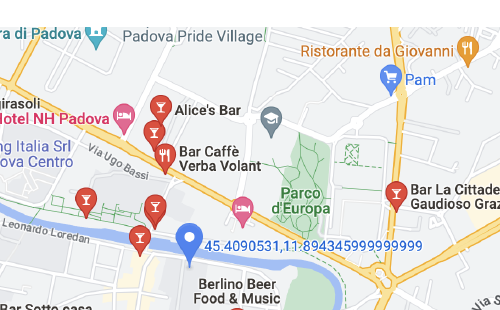

**Data:** Points of interest (POIs) in a map, a distance function, and a threshold $r$.

**Goal:** Find POIs near my current position, for example, those at distance at most $r$.

### Searching similar images

<!-- Slide 5 -->


**Data:** A set of images, a distance function, and a threshold $r$.

**Goal:** Find images similar to a given image, that is, within distance at most $r$.

- Similarity can be computed by embedding images into high-dimensional vectors with a
  machine-learning model and then computing the distance between their vectors, for example,
  Euclidean distance or angular distance.
- A similar problem arises for songs, for example, in Shazam.

### Similarity search

<!-- Slide 6 -->

- The two case studies above are examples of **similarity search**: given a set of objects,
  find items that are similar or near.
- A **distance function** is required to evaluate the similarity of two objects: two objects
  are similar or near if their distance is below a given threshold.
- The main difference between the examples is dimensionality. Points on a map have low
  dimension, since they belong to $\mathbb{R}^2$, whereas images are represented by
  high-dimensional vectors, for example, vectors in $\mathbb{R}^c$ with $c \gg 100$.

### Applications

<!-- Slide 7 -->

Some applications of similarity search are:

- **Information retrieval:** search for similar documents, images, and other objects.
- **Recommendation systems:** provide suggestions based on the behavior of similar users.
- **Entity resolution:** match equal or similar records.
- **Plagiarism detection:** match documents, such as papers or exams, with similar structure.
- **Outlier detection:** assign each element an outlier score based on its distance from its
  $k$-th nearest neighbor.

### $r$-Near Neighbor Search

<!-- Slide 8 -->

For a metric space $(M,d)$, a point $q \in M$, and a distance threshold $r>0$, define the
ball of radius $r$ around $q$ as

$$
B_r(q)=\{p \in M : d(p,q) \leq r\}.
$$

> [!info] Definition - $r$-Near Neighbor Search ($r$-NNS)
> Given a set $P$ of $n$ points from the metric space $(M,d)$, construct a data structure
> that, given a query point $q \in M$ and a distance threshold $r>0$, returns:
>
> - a point $p \in B_r(q) \cap P$, if such a point exists;
> - `null` if $B_r(q) \cap P = \emptyset$.

Observations:

- The query is unknown when the data structure is constructed.
- If $B_r(q) \cap P$ contains multiple points, an arbitrary one is returned.
- The distance function and threshold $r$ depend on the application.

### Example of $r$-NNS

<!-- Slide 9 -->

Here, $M=\mathbb{R}^2$ and $d=\lVert\cdot\rVert$.

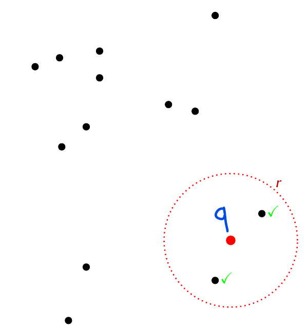

### Other similarity-search problems

<!-- Slide 10 -->

Several variants of similarity search exist:

- **$r$-near neighbor reporting:** given $P$, a query point $q$, and a threshold $r$, return
  all points in $B_r(q) \cap P$.
- **Nearest neighbor search:** given $P$ and a query point $q$, return the point in $P$
  closest to $q$.
- **$k$-nearest neighbor search:** given $P$, a query point $q$, and an integer $k \geq 1$,
  return the $k$ points in $P$ closest to $q$.
- **Similarity join:** given two sets $P$ and $Q$ and a threshold $r$, return all pairs
  $p \in P$ and $q \in Q$ such that $d(p,q) \leq r$.

Searching for the nearest neighbor, or the $k$ nearest neighbors, does not require a threshold
$r$. However, it is usually performed by reducing the problem to instances of $r$-NNS using a
suitable sequence of values of $r$.

### Computational setting

<!-- Slide 11 -->

To introduce the main techniques, consider a sequential setting with these performance
indicators:

- **Construction time:** time required to construct the initial data structure.
- **Space:** number of memory words required to store the data structure.
- **Query time:** time required to execute one query.

For points in $\mathbb{R}^D$, assume that $d(x,y)$ can be computed in $O(D)$ time and that a
point is stored in $O(D)$ space.

For very large inputs, distributed or streaming solutions are often necessary. This remains an
active research area.

### Brute-force solution

<!-- Slide 12 -->

**Construction**

- Store the points of $P$ in a list.

**Query $q$**

- Compute $d(q,p)$ for every $p \in P$. Return the first point $p' \in P$ such that
  $d(q,p') \leq r$, if one exists; otherwise, return `null`.

If $P \subset \mathbb{R}^D$ contains $n$ points, brute force requires:

- $O(n)$ construction time;
- $O(Dn)$ space;
- $O(Dn)$ query time.

> [!warning] Limitation
> Query time is too high.

## Similarity search in low dimensions

<!-- Slide 13 -->

### $r$-NNS and Range Reporting in $\mathbb{R}^D$

<!-- Slide 14 -->

To solve $r$-NNS more efficiently in $\mathbb{R}^D$ under Euclidean distance, use a
**kd-tree**.

- A kd-tree is a binary tree that recursively partitions space into rectangular regions.
- A kd-tree solves a slightly different problem called **Range Reporting**.

> [!info] Definition - Range Reporting (RR)
> Given a set $P \subset \mathbb{R}^D$ of $n$ points, construct a data structure that, given a
> rectangular region $R$, returns all points of $P$ contained in $R$.

A rectangular region

$$
R=[x_{1,1},x_{1,2}] \times \cdots \times [x_{D,1},x_{D,2}]
\subset \mathbb{R}^D
$$

contains all points $p=(p_1,\ldots,p_D)$ such that
$p_i \in [x_{i,1},x_{i,2}]$ for every $i \in \{1,\ldots,D\}$.

### Range Reporting in $\mathbb{R}^2$

<!-- Slide 15 -->

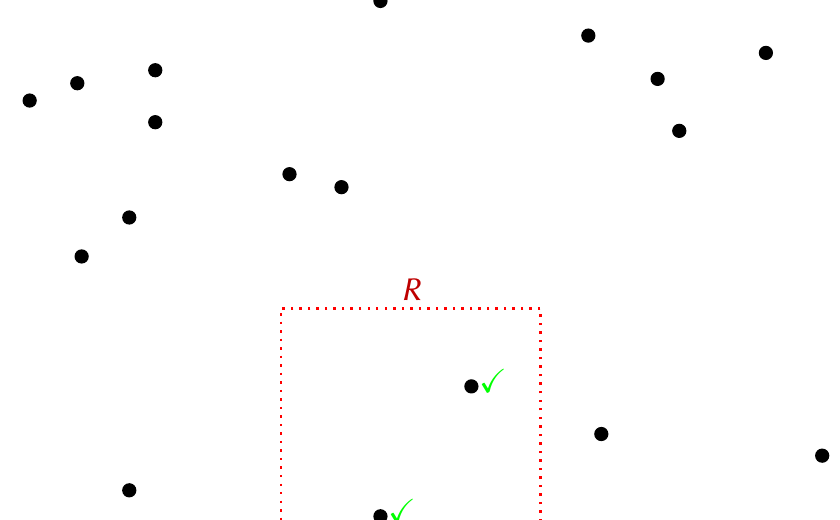

### Range Reporting versus $r$-NNS

<!-- Slide 16 -->

For Range Reporting, the query is a rectangle $R$ and the task is to return all points in
$R \cap P$. For $r$-NNS, the query consists of a point $q$ and distance $r$, and the task is to
return an arbitrary point in $B_r(q) \cap P$, if one exists.

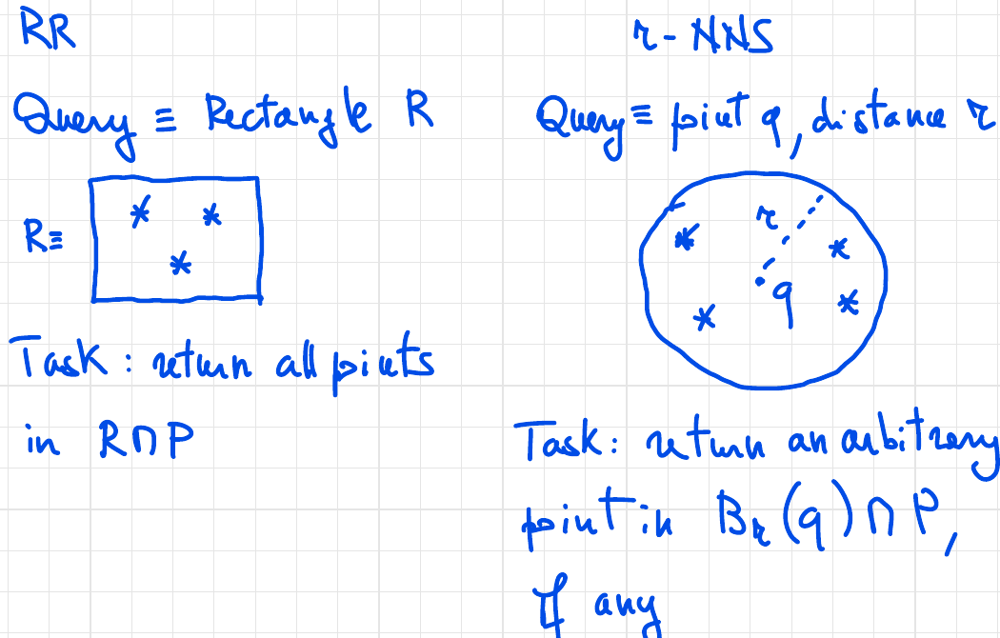

### kd-tree

<!-- Slide 17 -->

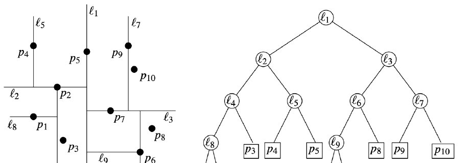

### Definition

<!-- Slide 18 -->

For simplicity, define the kd-tree for $D=2$. The definition extends to $D>2$.

Let $P$ be a set of $n$ points in $\mathbb{R}^2$, and let
$R(P) \subset \mathbb{R}^2$ be a rectangular region containing every point in $P$.

A kd-tree $T$ for $P$ is a binary tree defining a hierarchical decomposition of $R(P)$ into
nested rectangular subregions:

- Each internal node $v$ is associated with a rectangular region $\operatorname{region}(v)$
  and represents the subset $P_v=P \cap \operatorname{region}(v)$.
- For the root $r$, $\operatorname{region}(r)=R(P)$ and $P_r=P$.
- Each external node, or leaf, $v$ is associated with a region containing one point,
  denoted $p_v \in P$; hence, $P_v=\{p_v\}$.

#### Splitting rule

<!-- Slide 19 -->

Each internal node $v$ with $|P_v| \geq 2$ has two children, $u$ and $w$. Their regions are
obtained by splitting $\operatorname{region}(v)$ with a vertical or horizontal line $\ell_v$,
depending on the depth of $v$.

- If $v$ has even depth, $\ell_v$ is vertical at abscissa $x_v$:

$$
\begin{aligned}
\operatorname{region}(u)
    &=\operatorname{region}(v) \cap \mathbb{R}^{2}_{x \leq x_v},\\
\operatorname{region}(w)
    &=\operatorname{region}(v) \cap \mathbb{R}^{2}_{x > x_v}.
\end{aligned}
$$

- If $v$ has odd depth, $\ell_v$ is horizontal at ordinate $y_v$:

$$
\begin{aligned}
\operatorname{region}(u)
    &=\operatorname{region}(v) \cap \mathbb{R}^{2}_{y \leq y_v},\\
\operatorname{region}(w)
    &=\operatorname{region}(v) \cap \mathbb{R}^{2}_{y > y_v}.
\end{aligned}
$$

The line $\ell_v$ splits the points of $P_v$ into two sets, $P_u$ and $P_w$, of sizes
$\lfloor |P_v|/2 \rfloor$ and $\lceil |P_v|/2 \rceil$, respectively. Assume, for
convenience, that no two points have the same abscissa or ordinate.

<!-- Slide 20 -->

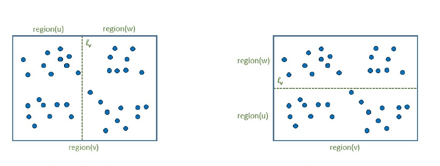

#### Regions determined by ancestors

<!-- Slide 21 -->

For every $v \in T$, $\operatorname{region}(v)$ is defined by the lines stored at the
ancestors of $v$.

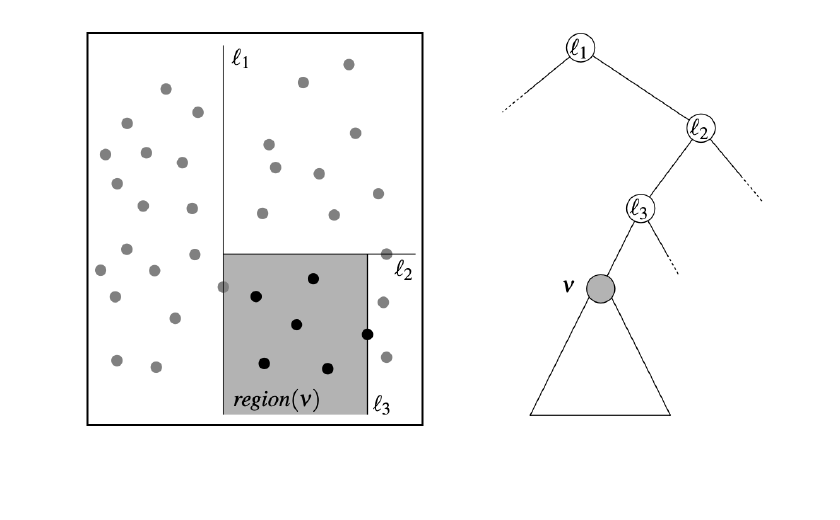

#### Example

<!-- Slides 22-25 -->

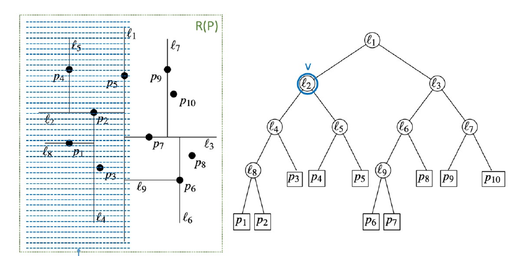

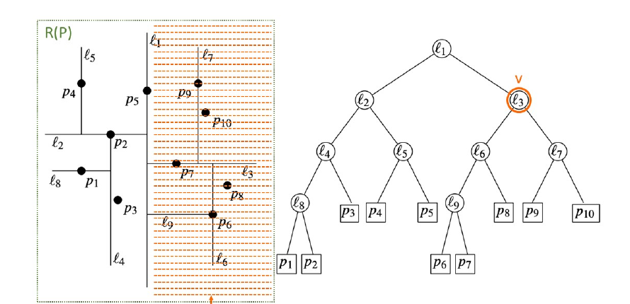

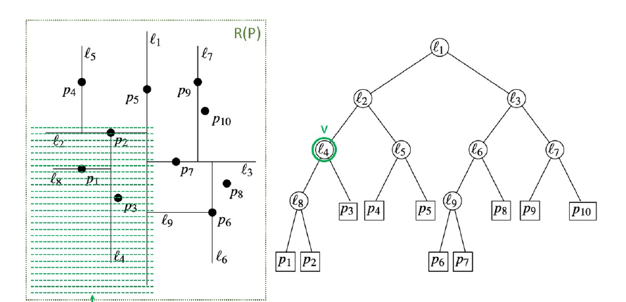

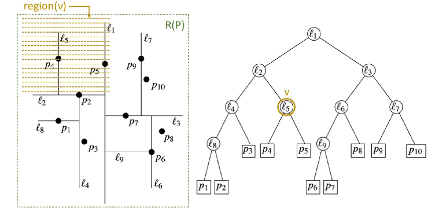

### Storage requirements and construction

<!-- Slide 26 -->

Let $T$ be a kd-tree for a set $P \subset \mathbb{R}^2$ of $n$ points.

**Storage requirements.** A kd-tree $T$ for $P$, with $|P|=n$, can be stored in $O(n)$
space. Specifically:

- Each internal node $v$ stores a representation of $\operatorname{region}(v)$, for which
  four coordinates suffice, and the line $\ell_v$.
- Each external node $v$ stores the point $p_v$.

**Construction.** Given $P$, the tree $T$ can be constructed in $O(n\log n)$ time. Details
are omitted.

### Query

<!-- Slide 27 -->

Given a kd-tree $T$ and a query rectangle $R=[x_1,x_2] \times [y_1,y_2]$, the range-query
algorithm starts at the root and recursively visits all nodes whose regions intersect $R$:

- At a leaf node $v$, return $p_v$ if $p_v \in R$.
- At an internal node $v$, recurse on each child whose associated region intersects $R$.
  If $\operatorname{region}(v) \cap R=\emptyset$, none of the children's regions intersects
  $R$, so return $\emptyset$.

Recursion may proceed on both subtrees.

#### Query algorithm

<!-- Slide 28 -->

```text
SearchKdTree(v, R)            // first invocation: v = root
Input:  A node v in the kd-tree and a rectangle R
Output: Points p in R from the subtree of v

if v is a leaf then
    if p_v is in R then
        out <- {p_v}
    else
        out <- empty set
else
    out <- empty set
    let u and w be the left and right children of v, respectively
    let R_u <- region(u) intersect R
    let R_w <- region(w) intersect R
    if R_u is not empty then
        out <- out union SearchKdTree(u, R_u)
    if R_w is not empty then
        out <- out union SearchKdTree(w, R_w)
return out
```

#### Query example

<!-- Slides 29-30 -->

In the first example, both $p_9$ and $p_{10}$ are returned.

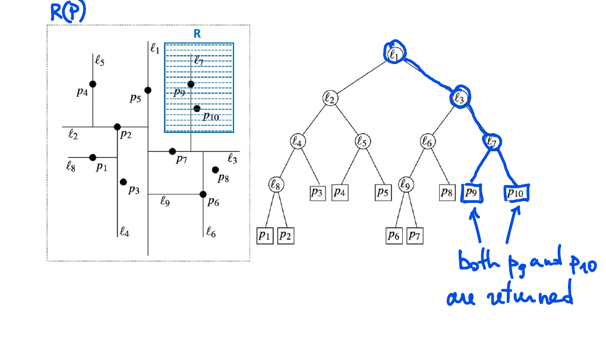

In the second example, black nodes belong to $Q_1(R)$ and red nodes belong to $Q_2(R)$.

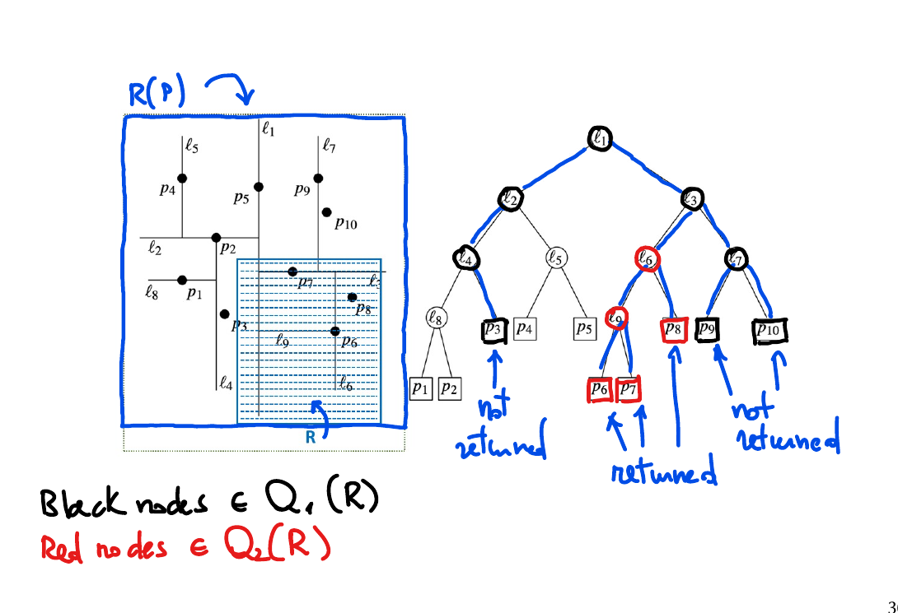

### kd-tree performance in $\mathbb{R}^2$

<!-- Slide 31 -->

> [!info] Theorem
> Range Reporting for a set $P$ of $n$ points in $\mathbb{R}^2$ can be solved using a
> kd-tree $T$ for $P$ with:
>
> - construction time $O(n\log n)$;
> - space $O(n)$;
> - query time $O(\sqrt{n}+k)$, where $k$ is the number of reported points.

#### Proof

<!-- Slide 32 -->

- Construction time and space are as claimed above.
- Query time is proportional to the number of nodes of $T$ visited by `SearchKdTree`. Define

$$
Q_1(R)=\left\{v \in T:
\operatorname{region}(v)\cap R\neq\emptyset
\text{ and }
\operatorname{region}(v)\nsubseteq R
\right\},
$$

$$
Q_2(R)=\left\{v \in T:
\operatorname{region}(v)\cap R\neq\emptyset
\text{ and }
\operatorname{region}(v)\subseteq R
\right\}.
$$

`SearchKdTree` is called only on nodes in $Q_1(R)\cup Q_2(R)$, except possibly for the first
call on the root of $T$.

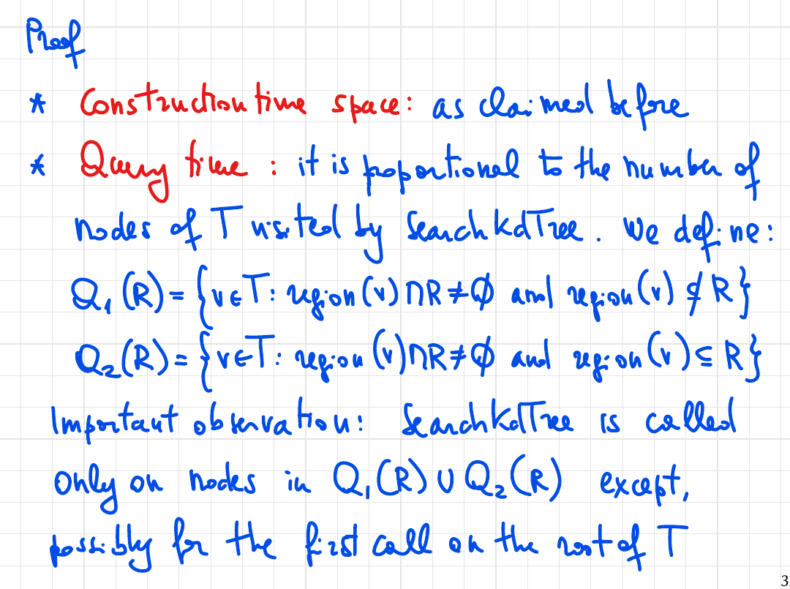

<!-- Slide 33 -->

Each call to `SearchKdTree` performs $O(1)$ operations besides the recursive calls. Therefore,
its running time, which is the query time, is

$$
O\left(1+|Q_1(R)|+|Q_2(R)|\right).
$$

It can be shown that

$$
|Q_1(R)|=O(\sqrt{n})
\qquad\text{and}\qquad
|Q_2(R)|=O(k).
$$

Thus, the running time of `SearchKdTree` is

$$
O(\sqrt{n}+k).
$$

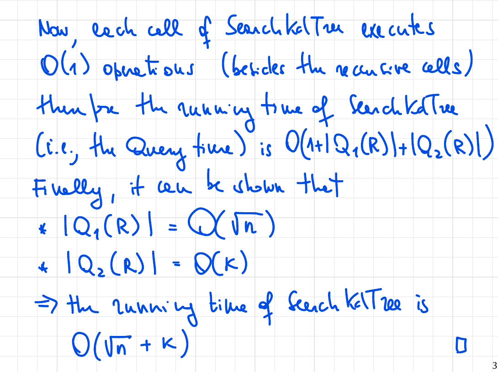

<!-- Slide 34: blank -->

<!-- Slide 35: blank -->

### kd-tree for $r$-NNS

<!-- Slide 36 -->

Let $T$ be a kd-tree for a point set $P \subset \mathbb{R}^2$. An $r$-NNS query centered at
$q \in \mathbb{R}^2$ can be answered as follows:

- Let $R_q$ be the smallest square enclosing the ball $B_r(q)$.

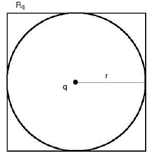

- Compute $S=\operatorname{SearchKdTree}(T.\operatorname{root}(),R_q)$.
- Return a point $p \in S \cap B_r(q)$, if one exists; otherwise, return `null`.

<!-- Slide 37 -->

- This solution works efficiently in practice.
- Let $k_s=|S|$ and $k_q=|S \cap B_r(q)|$:
  - The solution requires $O(\sqrt{n}+k_s)$ time, not $O(\sqrt{n}+k_q)$ time.
  - In some pathological cases, $k_s \gg k_q$.
  - It is unclear how to close this gap theoretically.

### Exercise

<!-- Slide 38 -->

> [!example] Exercise
> Let $P$ be a set of $n$ points in $\mathbb{R}^2$, and let $T$ be a kd-tree for $P$.
> Suppose that each node $v$ of $T$ stores an arbitrary point $p$ associated with one of the
> leaves in the subtree of $v$. Show how to adapt `SearchKdTree` so that, given a query
> rectangle $R$, it returns an arbitrary point $p \in P \cap R$, if one exists, or `null`
> otherwise, in time $O(\sqrt{n})$.

### kd-tree performance in $\mathbb{R}^D$

<!-- Slide 39 -->

The approach generalizes to $D$ dimensions:

- The kd-tree is defined similarly, but each level uses a different coordinate for its binary
  splits in cyclic order: $1,2,\ldots,D,1,2,\ldots$.
- `SearchKdTree` remains unchanged.

> [!info] Theorem
> Range Reporting for a set $P$ of $n$ points in $\mathbb{R}^D$ can be solved using a
> kd-tree $T$ for $P$ with:
>
> - construction time $O(Dn\log n)$;
> - space $O(Dn)$;
> - query time $O(Dn^{1-1/D}+k)$, where $k$ is the number of reported points.

### Curse of dimensionality

<!-- Slide 40 -->

- The query cost of a kd-tree converges to linear-scanning time as $D$ increases.
- A strong conjecture states that exact $r$-NNS cannot be solved in truly sublinear query time
  when $D$ is large, that is, in $O(n^\varepsilon)$ time for a constant $\varepsilon<1$.
