# Similarity Search

*Part 2*

<!-- PDF page 1; slide 1 -->

## Outline

<!-- PDF page 2; slide 2 -->

1. Introduction to similarity search (Part 1)
2. Similarity search in low dimensions (Part 1)
   - kd-trees
   - Curse of dimensionality
3. Similarity search in high dimensions
   - Approximate Near Neighbor (ANN) search
   - Locality Sensitive Hashing (LSH)

## Similarity search in high dimensions

<!-- PDF page 3; slide 3 -->

### $r$-NNS in high dimensions

<!-- PDF page 4; slide 4 -->

- Approximate approaches can tackle the curse of dimensionality.
- Approximation can affect an $r$-NNS solution for query point $q$ and radius $r$ in two ways:
  - The returned point $p$ is at distance greater than $r$ from $q$, producing a **false
    positive**. This is acceptable only if $d(p,q)$ is not much larger than $r$.
  - No $r$-near neighbor is returned even though one exists, producing a **false negative**.
    This should be avoided.

### $(c,r)$-Approximate Near Neighbor Search

<!-- PDF page 5; slide 5 -->

> [!info] Definition - $(c,r)$-Approximate Near Neighbor Search
> Given a set $P$ of $n$ points from a metric space $(M,d)$, construct a data structure that,
> given a query point $q \in M$ and a distance threshold $r>0$, provides the following answer
> for a constant $c \geq 1$:
>
> - If $B_r(q)\cap P$ is nonempty, return a point $p\in P$ such that $d(p,q)\leq cr$.
> - If $B_r(q)\cap P$ is empty, return either `null` or a point $p\in P$ such that
>   $d(p,q)\leq cr$, if one exists.
>
> In the second case, `null` is always acceptable, even when a point within distance $cr$
> exists.

The data structure never returns a point farther than $cr$ from query point $q$.

#### Example with near points

<!-- PDF page 6; slide 6 -->

Points $A$, $B$, $C$, and $D$ are legal outputs because at least one point is within radius
$r$, and all four lie within radius $cr$.

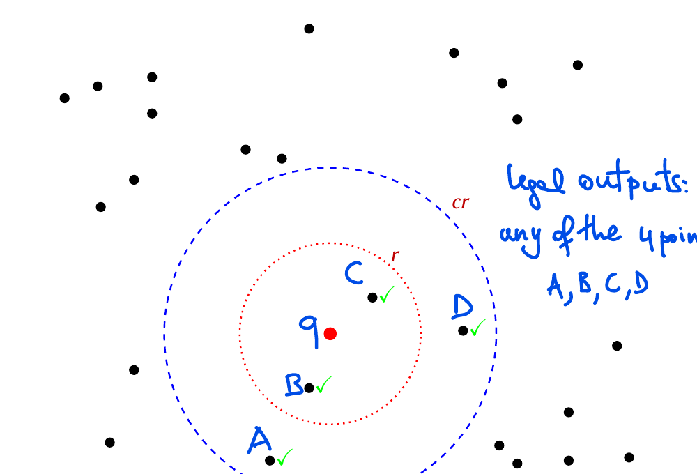

#### Example with no near points

<!-- PDF page 7; slide 7 -->

No point lies within radius $r$. Legal outputs are $A$, $B$, or `null` because $A$ and $B$ lie
within radius $cr$.

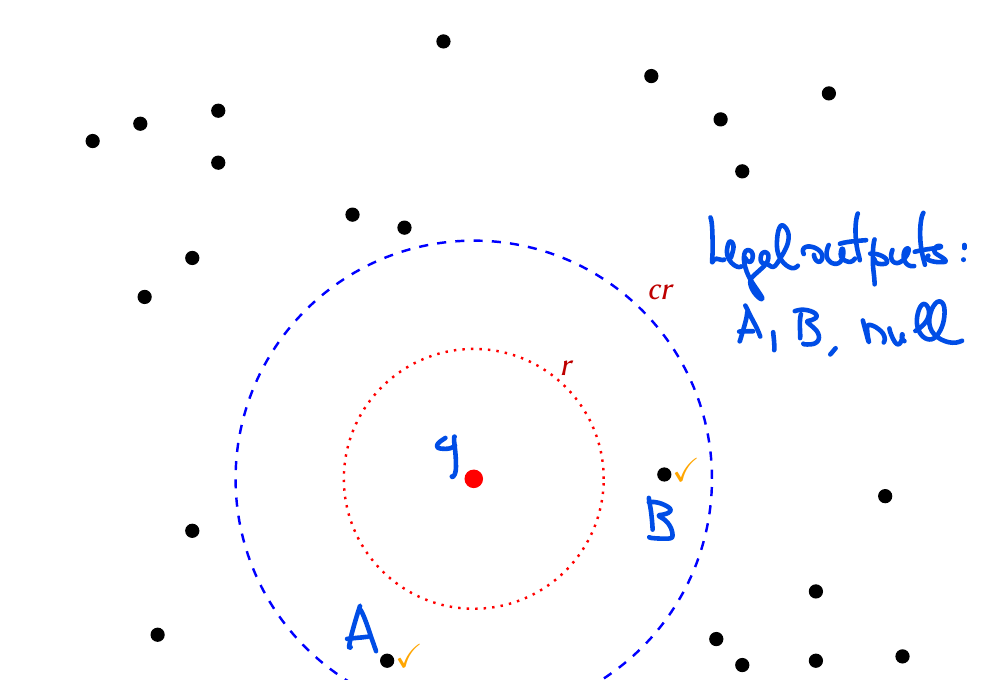

#### Example with only far points

<!-- PDF page 8; slide 8 -->

All points lie outside radius $cr$, so `null` is the only legal output.

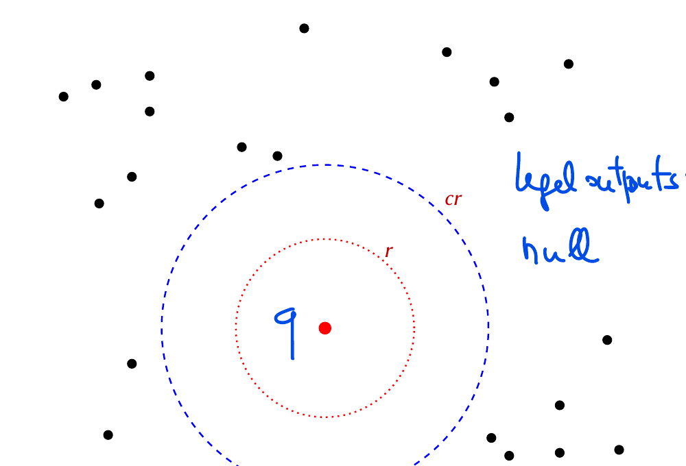

## Locality Sensitive Hashing

### ANNS with Locality Sensitive Hashing

<!-- PDF page 9; slide 9 -->

Locality Sensitive Hashing (LSH), introduced in the late 1990s, provides a solution to
$(c,r)$-ANNS. It is widely used for high-dimensional near-neighbor search in applications such
as recommender systems, duplicate or plagiarism detection, and search engines.

Main ideas:

- A hash function $h$, selected randomly from a suitable family $\mathcal{H}$, partitions the
  entire space into regions.
- The partition ensures that near points are likely to map to the same region, while far points
  are likely to map to different regions.
- Neighbors of query point $q$ are searched for in the region identified by $h(q)$.

Standard hashing aims to minimize collision probability for any pair of elements. LSH instead
makes collision probability positively related to similarity.

### Definition of LSH

<!-- PDF page 10; slide 10 -->

Consider a metric space $(M,d)$ and a family of hash functions

$$
\mathcal{H}=\{h:M\rightarrow S\},
$$

where $S$ is a domain such as the integer range $[0,t]$. For points $p,q\in M$, denote by

$$
\Pr_{h\in\mathcal{H}}[h(p)=h(q)]
$$

the probability that a hash function selected uniformly at random from $\mathcal{H}$ maps $p$
and $q$ to the same value.

> [!info] Definition - $(c,r,p_1,p_2)$-Locality Sensitive Hashing
> Given $c>1$, $r>0$, and $p_1,p_2\in[0,1]$ with $p_1>p_2$, a family $\mathcal{H}$ is
> $(c,r,p_1,p_2)$-locality sensitive if, for every $p,q\in M$:
>
> - if $d(p,q)\leq r$, then $\Pr_{h\in\mathcal{H}}[h(p)=h(q)]\geq p_1$;
> - if $d(p,q)>cr$, then $\Pr_{h\in\mathcal{H}}[h(p)=h(q)]\leq p_2$.

### Comments on LSH

<!-- PDF page 11; slide 11 -->

- Collision probability for points with distance in $(r,cr]$ is unspecified.
- Collision probability between points $p$ and $q$ can usually be expressed as a monotonically
  decreasing function of $d(p,q)$.
- For example, an LSH for points with normalized Hamming distance $d\in[0,1]$ may have the
  following collision-probability curve.

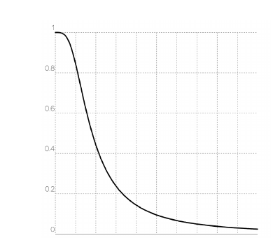

### LSH for $(c,r)$-ANNS

<!-- PDF page 12; slide 12 -->

A $(c,r,p_1,p_2)$-LSH family $\mathcal{H}$ can solve $(c,r)$-ANNS on an input set $P$.

**Construction**

- Select $h$ uniformly at random from $\mathcal{H}$.
- Insert all points of $P$ into a hash table $T$ using $h$.
- Bucket $T[j]$ contains all points with hash value $j$:

$$
T[j]=\{p\in P:h(p)=j\}.
$$

**Query**

- Given $q$, scan $T[h(q)]$ until finding a point $p$ such that $d(p,q)\leq cr$, then return
  it. Return `null` if no such point exists.

Assume that the buckets $T[j]$ are implemented as lists.

### Boolean-vector example

<!-- PDF page 13; slide 13 -->

- Metric space: $M=\{\text{Boolean vectors of length }9\}$.
- Distance function: Hamming distance.
- Input: $P\subset M$, a set of $n=8$ vectors of length $9$.

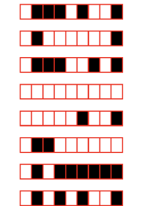

For $0\leq i<j<8$, let $h_{i,j}:M\rightarrow[0,3]$ map a vector $x\in M$ to the integer
whose binary representation is $x[i]x[j]$. Define

$$
\mathcal{H}=\{h_{i,j}:0\leq i<j<8\}.
$$

<!-- PDF page 14; slide 14 -->

Suppose $h_{1,2}\in\mathcal{H}$ is selected. Query $q$ hashes to bucket $3$. The annotated
example distinguishes outputs legal for every $c\geq1$ from additional outputs legal only when
$c\geq2$.

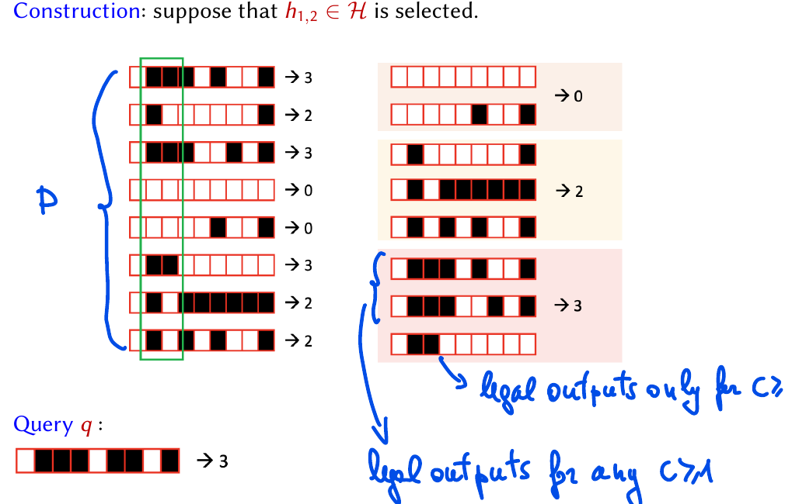

### Expected bucket contents

<!-- PDF page 15; slide 15 -->

For query point $q$, expected contents of $T[h(q)]$ are:

- A near point $p$, with $d(p,q)\leq r$, belongs to $T[h(q)]$ with probability at least $p_1$,
  although it may map to another bucket.
- A far point $p'$, with $d(p',q)>cr$, may belong to $T[h(q)]$, but with probability at most
  $p_2$.

In the worst case, $P$ contains one near point $p$ and $n-1$ far points. Therefore, at most
$np_2$ far points collide with $q$ in expectation.

### Basic LSH performance

<!-- PDF page 16; slide 16 -->

Assume $(M,d)$ has dimensionality $D$, for example $M=\mathbb{R}^D$, and:

- each point requires $O(D)$ words;
- hash values and distances can be computed in $O(D)$ time.

> [!info] Theorem
> Let $P$ contain $n$ points in a $D$-dimensional metric space $(M,d)$, and let
> $\mathcal{H}$ be a $(c,r,p_1,p_2)$-locality-sensitive family. Using the basic approach above,
> a query is answered successfully with probability at least $p_1$. Performance is:
>
> - construction time $O(Dn)$;
> - space $O(Dn)$;
> - expected query time $O(Dnp_2)$.

#### Proof

<!-- PDF page 17; slide 17 -->

**Probabilistic correctness, case 1.** Suppose $B_r(q)\cap P\neq\emptyset$. Any point $p'$
with $d(p',q)\leq cr$ is a legal output. Choose an arbitrary
$p\in B_r(q)\cap P$ and let $h\in\mathcal{H}$ be the selected hash function. Then

$$
\Pr_h[\text{answer is correct}]
\geq \Pr_h[\text{answer}\neq\texttt{null}]
\geq \Pr_h[h(p)=h(q)]
\geq p_1.
$$

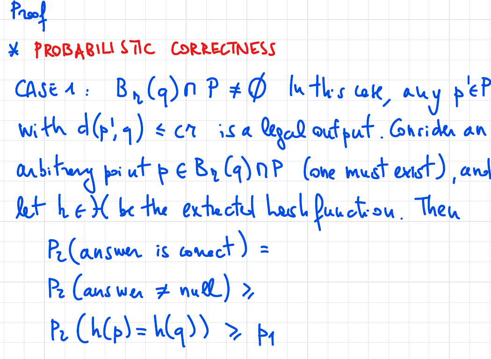

<!-- PDF page 18; slide 18 -->

This follows because $\mathcal{H}$ is $(c,r,p_1,p_2)$-locality sensitive.

**Probabilistic correctness, case 2.** Suppose $B_r(q)\cap P=\emptyset$. Every possible answer,
either a point $p$ with $d(p,q)\leq cr$ or `null`, is correct.

Construction time and space follow directly from storing and hashing all points.

For query time, scanning list $T[h(q)]$ stops as soon as a point $p$ with $d(p,q)\leq cr$ is
found or when the list ends.

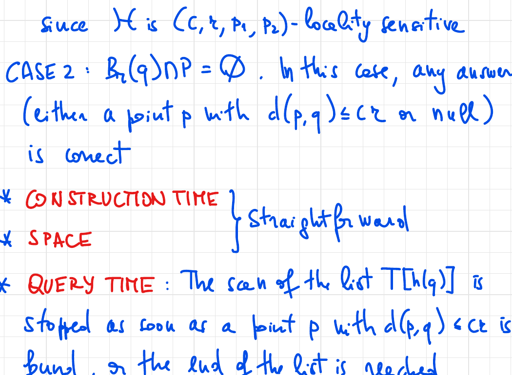

<!-- PDF page 19; slide 19 -->

Query time is $O(Dx)$, where $x$ is the number of far points $p\in P$ satisfying both
$d(p,q)>cr$ and $h(p)=h(q)$. Variable $x$ is random and satisfies

$$
\mathbb{E}[x]\leq np_2,
$$

because every one of the at most $n$ far points collides with $q$ with probability at most
$p_2$. Expected query time is therefore $O(Dnp_2)$.

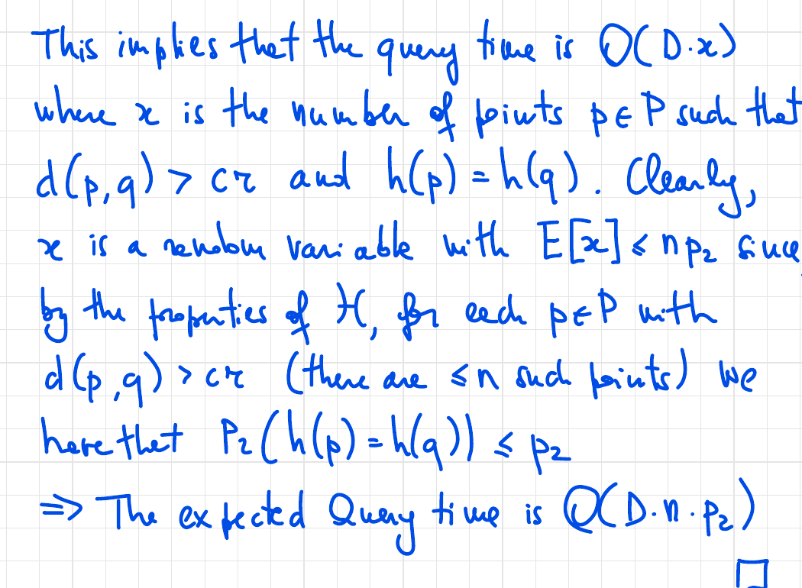

<!-- PDF pages 20-21; slides 20-21: blank -->

## LSH for Hamming and Euclidean distances

<!-- PDF page 22; slide 22 -->

### Hamming distance: bit sampling

<!-- PDF page 23; slide 23 -->

- Metric space: $M=\{\text{Boolean vectors of length }D\}$.
- For $0\leq i<D$, define $h_i:M\rightarrow\{0,1\}$ by $h_i(x)=x[i]$ and let

$$
\mathcal{H}_H=\{h_i:0\leq i<D\}.
$$

For two points $p,q$, collision probability is

$$
\Pr_{h\in\mathcal{H}_H}[h(p)=h(q)]
=1-\frac{d_H(p,q)}{D},
$$

where $d_H$ is Hamming distance. Equivalently, a random hash function collides exactly when
the selected coordinate satisfies $p[i]=q[i]$.

<!-- PDF page 24; slide 24 -->

For any $p,q$:

- If $d_H(p,q)\leq r$, then

$$
\Pr_{h\in\mathcal{H}_H}[h(p)=h(q)]
=1-\frac{d_H(p,q)}{D}
\geq 1-\frac{r}{D}
\stackrel{\mathrm{def}}{=}p_1.
$$

- If $d_H(p,q)>cr$, then

$$
\Pr_{h\in\mathcal{H}_H}[h(p)=h(q)]
=1-\frac{d_H(p,q)}{D}
<1-\frac{cr}{D}
\stackrel{\mathrm{def}}{=}p_2.
$$

Therefore, $\mathcal{H}_H$ is
$(c,r,1-r/D,1-cr/D)$-locality sensitive.

### The $\rho$ factor

<!-- PDF page 25; slide 25 -->

A $(c,r,p_1,p_2)$-locality-sensitive family is effective when $p_1\gg p_2$. Its quality is
typically measured by

$$
\rho
=\frac{\log_2 p_1}{\log_2 p_2}
=\frac{\log_2(1/p_1)}{\log_2(1/p_2)}.
$$

Because $1\geq p_1>p_2>0$, $\rho\in(0,1)$. It decreases as $p_1/p_2$ increases, so smaller
$\rho$ is better.

For bit sampling,

$$
\rho
=\frac{\log_2(1-r/D)}{\log_2(1-cr/D)}
\sim\frac{r/D}{cr/D}
=\frac{1}{c}.
$$

### Euclidean distance: random projection

<!-- PDF page 26; slide 26 -->

- Metric space: $M=\mathbb{R}^D$.
- For fixed $w>0$, $a\in\mathbb{R}^D$, and $b\in[0,w]$, define
  $h_{a,b}:M\rightarrow\mathbb{Z}$ by

$$
h_{a,b}(p)=
\left\lfloor\frac{\langle a,p\rangle+b}{w}\right\rfloor,
$$

where $\langle\cdot,\cdot\rangle$ is the inner product. Define

$$
\mathcal{H}_E(w)
=\{h_{a,b}:a\in\mathbb{R}^D,\ b\in[0,w]\}.
$$

If $a$ is sampled from the normal distribution $\mathcal{N}^D(0,1)$ and $b$ from the uniform
distribution, then $\mathcal{H}_E(w)$ is $(c,r,p_1,p_2)$-locality sensitive with
$\rho=O(1/c)$.

#### Implementation observations

<!-- PDF pages 27-28; slides 27-28 -->

The functions in $\mathcal{H}_E(w)$ map points in $\mathbb{R}^D$ to arbitrary integers. In
practice, after selecting $h_{a,b}$, another hash function maps its nonempty buckets to a small
index range. For query $q$, bucket $T[h_{a,b}(q)]$ is retrieved among buckets mapped to the same
secondary index, then searched for a near neighbor of $q$.

Better locality-sensitive families for Euclidean spaces achieve

$$
\rho\in O(1/c^2).
$$

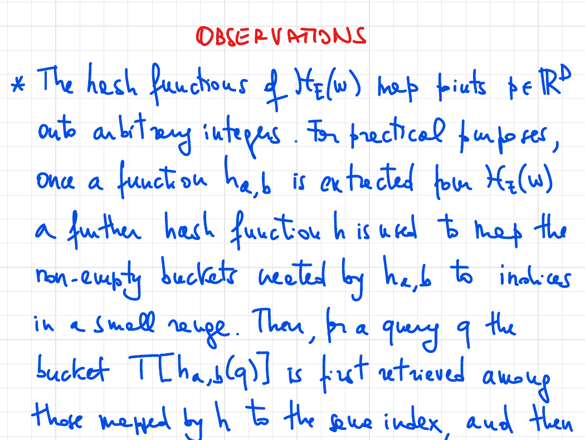

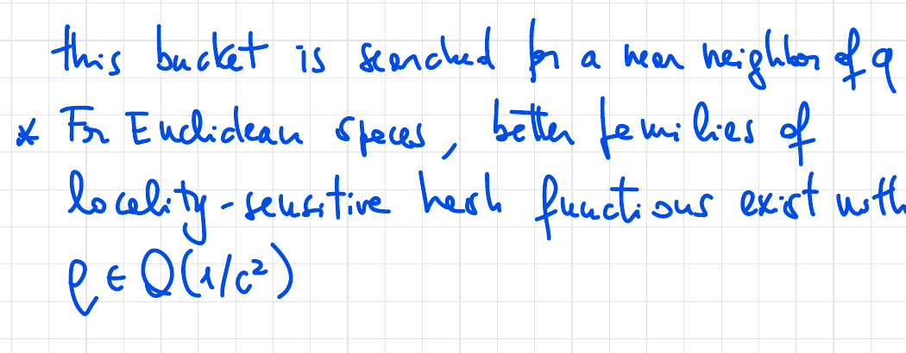

#### Random-projection example

<!-- PDF pages 29-32; animated slide 29 -->

The sequence projects points orthogonally onto direction $a$, partitions the projected line into
intervals of width $w$, and shows query point $q$ in the final frame.

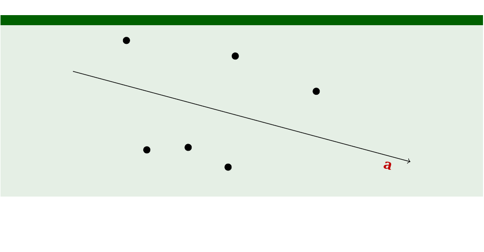

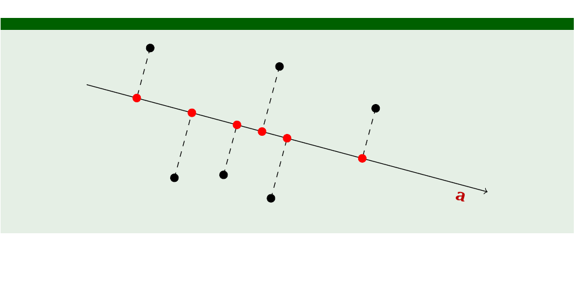

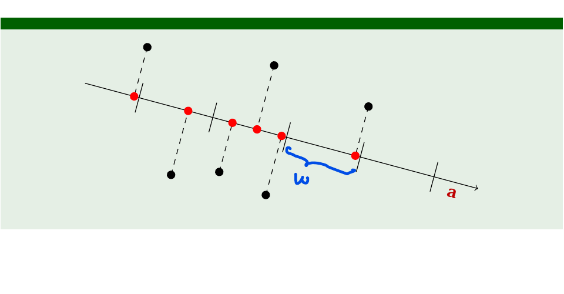

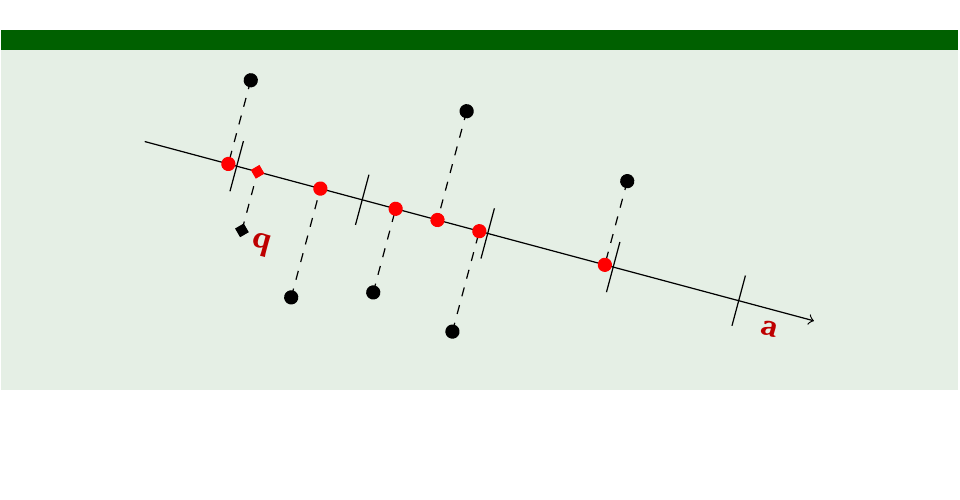

## Improving the data structure

<!-- PDF page 33; slide 30 -->

Ideally, LSH would have $p_1$ close to $1$ and $p_2$ close to $0$, but a family
$\mathcal{H}$ may not provide these guarantees. Two improvements respectively increase the
collision probability of near points and decrease the collision probability of far points.

### Improvement 1: repetition

<!-- PDF page 34; slide 31 -->

Repeat the search $\ell>1$ times using $\ell$ distinct hash tables built from independent hash
functions selected uniformly from a $(c,r,p_1,p_2)$-locality-sensitive family $\mathcal{H}$.
This is the **repetition**, or **OR**, construction.

- Collision probability between a near point $p$ and query $q$ in at least one table increases
  with $\ell$.
- Checking $\ell$ buckets, one per table, increases computational cost.

#### Repetition analysis

<!-- PDF pages 35-36; slides 32-33 -->

Let $p$ satisfy $d(p,q)\leq r$.

- In one table, the probability that $p$ and $q$ occupy different buckets is at most $1-p_1$.
- By independence, the probability that they occupy different buckets in all $\ell$ tables is
  at most $(1-p_1)^\ell$.
- Therefore, the probability of finding $p$ in the same bucket as $q$ in at least one table is

$$
1-(1-p_1)^\ell.
$$

For $\ell>1$, $(1-p_1)^\ell<1-p_1$, so

$$
1-(1-p_1)^\ell>p_1.
$$

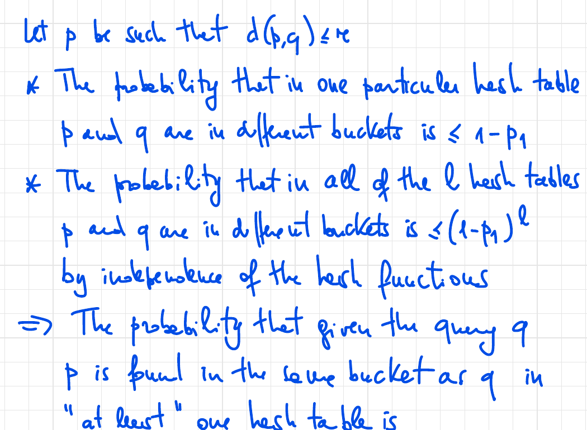

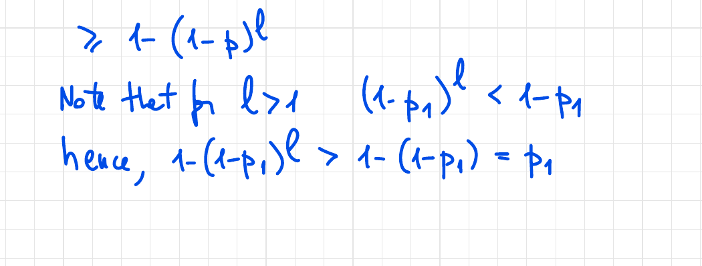

<!-- PDF page 37; slide 34: blank -->

### Improvement 2: concatenation

<!-- PDF page 38; slide 35 -->

Create a family $\mathcal{G}$ by concatenating $k\geq1$ independent hash functions selected
uniformly from $\mathcal{H}$:

$$
\mathcal{G}
=\left\{g\in\mathcal{H}^k:
g(p)=(h_1(p),\ldots,h_k(p)),\ h_i\in\mathcal{H}\right\}.
$$

For random $g\in\mathcal{G}$ and distinct points $p,q$:

- if $d(p,q)\leq r$, then $\Pr[g(p)=g(q)]\geq p_1^k$;
- if $d(p,q)>cr$, then $\Pr[g(p)=g(q)]\leq p_2^k$.

This is the **concatenation**, or **AND**, construction.

<!-- PDF page 39; slide 36 -->

Set

$$
k=\log_{1/p_2}n
=\frac{\log_2 n}{\log_2(1/p_2)}.
$$

Then, for random $g\in\mathcal{G}$ and distinct points $p,q$:

- if $d(p,q)\leq r$, then $\Pr[g(p)=g(q)]\geq p_1^k=1/n^\rho$;
- if $d(p,q)>cr$, then $\Pr[g(p)=g(q)]\leq p_2^k=1/n$.

With this $k$, expected collisions between query $q$ and far points in its bucket are at most
$1$.

<!-- PDF page 40; slide 37 -->

The identity $p_1^k=n^{-\rho}$ follows from

$$
k
=\frac{\log_2 n}{\log_2(1/p_2)}
=\frac{\log_2 n}{\log_2(1/p_1)}
 \frac{\log_2(1/p_1)}{\log_2(1/p_2)}
=\rho\log_{1/p_1}n.
$$

Equivalently, $p_1^{-k}=n^\rho$.

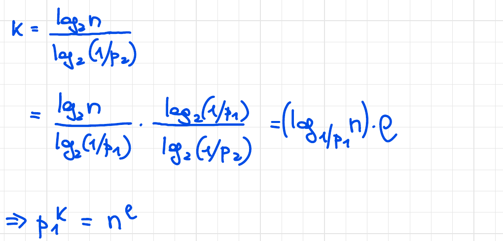

<!-- PDF page 41; slide 38: blank -->

### General LSH schema for $(c,r)$-ANNS

<!-- PDF page 42; slide 39 -->

Combine repetition and concatenation. Let $k$ and $\ell$ be parameters chosen later.

**Construction**

- Construct $\ell$ functions $g_1,\ldots,g_\ell$. Each $g_i$ concatenates $k$ hash functions
  selected randomly and independently from $\mathcal{H}$.
- For every $g_i$, construct a hash table $T_i$ for $P$. Bucket $T_i[j]$ contains all points
  in $P$ with hash value $j$ under $g_i$.

**Query**

- Scan $T_1[g_1(q)],\ldots,T_\ell[g_\ell(q)]$ until finding a $cr$-near point $p$, then
  return it. Return `null` if no such point is found.

#### General-schema example

<!-- PDF pages 43-48; animated slide 40 -->

The animation incrementally creates hash tables $T_1,T_2,T_3,\ldots,T_i,\ldots,T_\ell$ from
independent concatenated functions $g_i=h_{i,1}\circ\cdots\circ h_{i,k}$. The final accumulated
frame is retained below; earlier frames contain subsets of the same diagram.

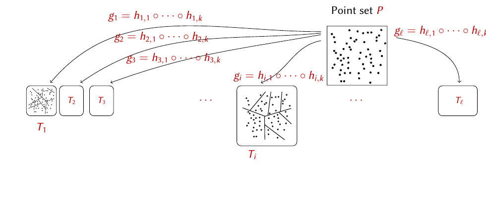

### General-schema performance

<!-- PDF page 49; slide 41 -->

> [!info] Theorem
> Let $P$ contain $n$ points in a metric space $(M,d)$, and let $\mathcal{H}$ be a
> $(c,r,p_1,p_2)$-locality-sensitive family. Fix
>
> $$
> k=\log_{1/p_2}n,
> \qquad
> \ell=2p_1^{-k}=2n^\rho,
> $$
>
> where $\rho=\log_2p_1/\log_2p_2$. A query is answered successfully with probability at
> least $1/2$. Performance is:
>
> - construction time $O\!\left(Dn^{1+\rho}\log_{1/p_2}n\right)$;
> - space $O\!\left(Dn+n^{1+\rho}\log_{1/p_2}n\right)$;
> - expected query time $O\!\left(Dn^\rho\log_{1/p_2}n\right)$.

<!-- PDF pages 50-53; slides 42-45: blank -->

### Hamming distance: concatenated bit sampling

<!-- PDF page 54; slide 46 -->

Concatenating $k$ bit-sampling hashes means selecting $k$ random coordinates. Collision
probabilities become:

- $\Pr[h(p)=h(q)]\geq(1-r/D)^k$ if $d_H(p,q)\leq r$;
- $\Pr[h(p)=h(q)]\leq(1-cr/D)^k$ if $d_H(p,q)\geq cr$.

Concatenation does not change $\rho$.

Bit sampling projects vectors onto a random subset of coordinates. Example:

```text
x       00101001010        y       10101100010
h(x)    011                h(y)    011
```

<!-- PDF page 55; slide 47 -->

Increasing $k$ lowers collision probability more sharply as relative Hamming distance grows.
The plot compares $k=1$ and $k=3$ and marks thresholds $r$ and $cr$.

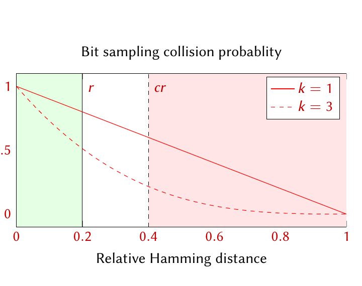

## Exercises

<!-- PDF page 56; slide 48 -->

> [!example] Exercise 1
> Let $P$ be a collection of $n$ documents to store in a data structure that retrieves a
> document similar to a query document $q$. Let $W$ contain $D$ relevant words, and suppose
> similarity depends on the number of words from $W$ shared by two documents, ignoring relative
> frequencies.
>
> 1. Describe a document representation and a data structure for $P$ based on a suitable
>    locality-sensitive family, using one hash function for the data structure.
> 2. Find $c$ and $r$ such that $(c,r)$-ANNS for $P$ is solved correctly with probability at
>    least $1/2$ and expected query time $O(n)$. The trivial exact approach requires $O(Dn)$
>    query time.

<!-- PDF page 57; slide 49 -->

> [!example] Exercise 2
> Let $P$ contain $n$ Boolean vectors of dimension $D$. Store $P$ in a hash table $T$ using a
> random bit-sampling hash $h$ from
> $\mathcal{H}=\{h_i:0\leq i<D\}$. For $h\in\mathcal{H}$, let
> $\operatorname{not}(h(x))$ denote negation of binary value $h(x)$.
>
> 1. Given vectors $p$ and $q$, determine
>    $\Pr_{h\in\mathcal{H}}[h(p)=\operatorname{not}(h(q))]$ as a function of Hamming distance
>    $d_H(p,q)$.
> 2. Given query vector $q$, find an $r$-far vector $p\in P$, meaning $d_H(p,q)\geq r$.
>    Explain how to search efficiently in $T$ and state the method's probabilistic guarantees.

## Summary

<!-- PDF page 58; slide 50 -->

- Similarity search: $r$-NNS and Range Reporting problems.
- kd-trees for similarity search in low dimensions.
- Curse of dimensionality for similarity search.
- The $(c,r)$-ANNS problem.
- LSH for $(c,r)$-ANNS:
  - definition of $(c,r,p_1,p_2)$-locality-sensitive hash functions;
  - solving $(c,r)$-ANNS using locality-sensitive hash families;
  - LSH for Hamming and Euclidean distances using bit sampling and random projection;
  - improving collision probabilities with repetition, concatenation, and their combination.

## References

<!-- PDF page 59; slide 51 -->

- **[LRU14]** J. Leskovec, A. Rajaraman, and J. Ullman. *Mining Massive Datasets*.
  Cambridge University Press, 2014. Section 3.6.
- **[BCKO08]** Mark de Berg, Otfried Cheong, Marc van Kreveld, and Mark Overmars.
  *Computational Geometry: Algorithms and Applications*, 3rd ed. Springer-Verlag, 2008.
  Section 5.2.
- **[AI08]** Alexandr Andoni and Piotr Indyk. "Near-optimal hashing algorithms for approximate
  nearest neighbor in high dimensions." *Communications of the ACM* 51(1), 2008.
