# MAP REDUCE

Why? Growing need to analyze large amounts of data

**Fault-tolerance**: ability of a system to continue functioning properly if a failure happens. It's an essential requirement in most big data systems.

Consider a system with $N$ components $C_1, \dots, C_N$ each failing independently with probability $p$ per unit of time

$$\Pr(3 \text{ C_i that fails at time } t) = 1 - (1-p)^N$$

Let $X$ be the number of time units before next failure, $X$ follows a GEOMETRIC DISTRIBUTION

$$E(X) = \frac{1}{1-(1-p)^N} \xrightarrow{N \to \infty} 1$$

**Map Reduce main features:**

- Moderate-cost platforms
- Simple programming env. inspired by functional programming
- The runtime manages task allocation, data dishibition, fault-tolerance, load-balancing
- Data-centric view, focus on data transformations

**DFS (Distributed Pte System)**

It allows the system to efficiently distribute the workload across multiple nodes
- Files divided into chunks
- Each chunk replicated on different nodes for fault tolerance

---

# MR Computational Model

**Computation → sequence of rounds**

Round → transforms a set of Key-values pairs into another set of Key-value pairs through:

1. **Map Phase**: V input pair separately, the map function produces two intermediate pairs

2. **Shuffle**: intermediate pairs are grouped by Key→VK, a list Lₖ of values is created

3. **Reduce Phase**: VK separately, the reduce function is applied to (K, Lₖ) and produces two output pairs

**REDUCER**: application of the reduce function (K, Lₖ)


**Reduce function applied to key-listOfValues pairs**

**INPUT of the round**

**Map Phase**

**Reduce Phase**

**OUTPUT of the round**

With distributed execution:

**User program**

- fork into a Master P and lots of Executor P

- fork

- Master process

- designs H/R banks and monitors status

**Input File on DFS or master's disk**

**Executor process**

**Executor process**

**Executor process**

**Intermediate data on executors' memories**

**Output File on DFS or master's disk**

---

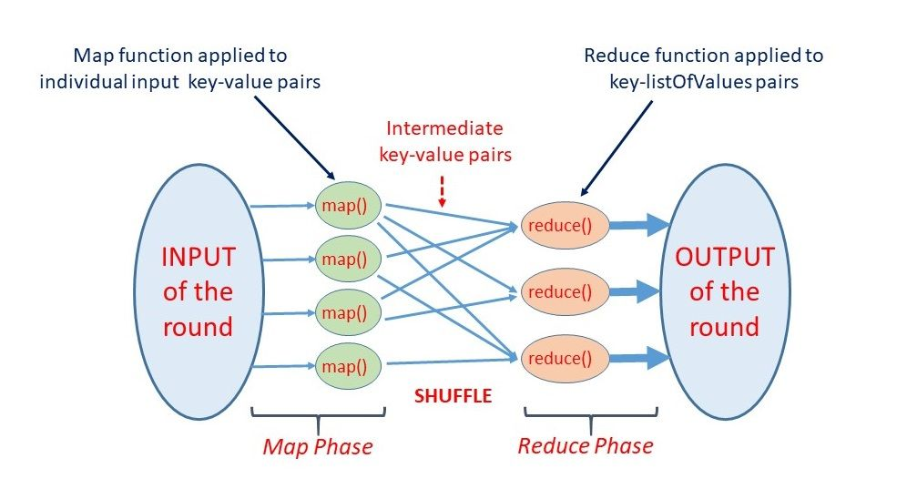

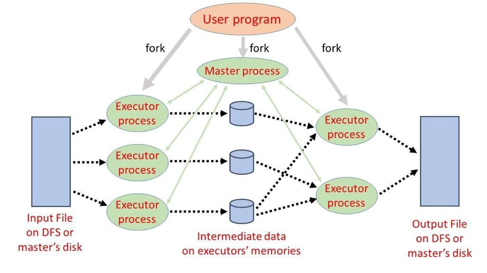

---

Complex computations require multiple rounds; typically the input of round $i$ is the output of round $i-1$

Shared variables can be defined, available to all executors to maintain global infos across rounds

Why use $K-V$?

Keys:
- Addresses to reach objects (independent of where they reside)
- Labels to define groups in reduce phases

Pseudocode

In: description of input as set of $(K, v)$ pairs
Out: description of output as set of $(K, v)$ pairs

Round $i$:
Map phase: desc. of function applied to each pair
Reduce phase: " " " " " " group
(Key, list_of_values)

Round $2, 3 \dots R$: similarly

Key performance indicators

• $R$ (number of rounds): rough estimate of RUNNING_TIME
• $M_2$ (load space): MAX AMOUNT OF MAIN MEMORY
• $M_A$ (aggregate space): MAX AMOUNT OF DISK SPACE occupied by stored data at the beginning/end of a M.R phase
(Total disk space in system)

---

# Design goals for MR

1. **Few Rounds**: $R = O(1) \rightarrow$ low comm/sync cost $\rightarrow$ time eff
2. **Sublinear local space**: $M_c = O(\text{input}^6)$ with $E < 1 \rightarrow$ low main menu usage
3. **Linear aggregate space**: $M_A = O(\text{lastput}) \rightarrow$ low disk usage (little replay)
4. **Low complexity of each map/reduce function** $\rightarrow$ low compit. cost $\rightarrow$ time eff.
5. **Those goals are somewhat conflicting** $\rightarrow$ trade-off must be sought

# Pro/Cons

## Advantages

- **Data-centric view**: focus on data transfer
- **Usability**: programmer relieved from task allocation, data management and fault handling
- **Probability/Adaptability**: apps run on different platforms
- **Cost**: moderate platforms, cloud support

## Disadvantages

- **R only coarsely captures running time**
- **Cause of the last reducer**: slow reducer delays the entire round $\rightarrow$ load must be balanced
- **Not suitable for apps requiring extreme performance or tight coupling with the architecture**

---

# PARTITIONING

Main technique to reduce $M_L$
- splits computation into small tasks, each processing a chunk of data
- moves independence among tasks to exploit parallelism
- may increase number of rounds (variably increases $M_A$)

# Deterministic partitioning

Uses a deterministic hash function based on explicit data features to evenly subdivide the pairs

**Standard technique:** $l$ partitioning with $\text{key} = i \mod l$

**Opt choice:** $l = \sqrt{N} \rightarrow M_L = O(\sqrt{N})$

**Tradeoff:** with $l$ partition and $\text{key} = i \mod l$
$$M_L = O\left(\frac{N}{l} + l\right)$$
setting $l = \sqrt{N} \rightarrow M_L = O(\sqrt{N}), M_A = O(N), R$ increases by $x$

# Random partitioning

Asigns a uniform random key in $[0, l)$ to each intermediate pair. Always applicable

**Analysis:**

Let $m_x = \#$ intermediate pairs in Round $x$ with $\text{key} = x$ and $m = \max_x m_x$ (size of largest partition)

$$R = 2$$

$$M_L:$$
- Round 1, Map phase: $O(x)$
- Round 1, Reduce phase: $O(m)$
- Round 2, Reduce phase: $O(l)$

---

$$= \infty M_l = O(m + l)$$

$$M_A = O(N)$$

**Theorem: Balanced Random partitioning**

Fix $l = \sqrt{N}$. If keys are assigned independently with uniform distribution in $[0, \sqrt{N})$ then with probability at least $u - 1/N^5$:

$$m = O\left(\frac{N}{l}\right) = O(\sqrt{N})$$

Therefore $M_l = O(\sqrt{N})$

**Proof:** more long

---

# CASE STUDIES

## WORD COUNT

**Problem:** count occurrences of each word across $k$ docs

**Input:** $\{(D_i, \text{name}, D_i, \text{words}) : 1 \leq i \leq k\}$ $D_i = (\text{name}, \text{list of val})$

**Output:** $\{(w, c(w)) : w \text{ word}, c(w) = \# \text{tot occurrences}\}$

**Round 1**

- **map function**
- **Map phase:** $D_i \rightarrow \{w, c(w)\} : w \in D_i\}$
- **Logic:** mapper elabora un documento e conta localmente le sue paide
- **Reduce phase:** $(w_i, L_w) \rightarrow (w_i \sum_{i \in L_w} c_i(w))$
- **Reducer samma conteggi local:** $\rightarrow$ **output pair**

**Analysis of Word count**

- $R = 1$
- $M_L: (M_P \ 1 \text{ word} = O(1) \text{ space})$
  - $N_i = \# \text{words in } D_i$
  - $N_{\max} = \max \{N_i : 1 \leq i \leq k\}$
- **Map phase:** $M_L = O(N_{\max})$
- **Reduce phase:** $M_L = O(k)$
  - $\Rightarrow M_L = O(\max \{N_{\max}, k\}) = O(N_{\max} + k)$

- $M_A$:
  - $N_A = \sum_{i=1}^{k} N_i = \text{total number of occurrences of all words aggregated over all documents}$
- $D_i = (\text{name}, \text{list of val})$
- $w \in D_i$
- $c(w) = \# \text{tot occurrences}$
- $w_i \in L_w$
- $\sum_{i \in L_w} c_i(w_i)$
- $O(N_{\max})$
- $O(k)$
- $O(\max \{N_{\max}, k\}) = O(N_{\max} + k)$

---

- Space required by input pairs: O(N)
- Space required by intermediate pairs: O(N)
- Output pairs: O(N)

= D M_A = O(N)

Class count with no partitioning (naive)

Problem: given S of N objects with class labels, count objects per class

Input: Set S of N objects represented by pairs (i, (y_i, o_i))
for o_i ∈ N where y_i is the class of the i-th obj
(o_i)

Output: set of pairs (Y, c(Y)) where Y is a class labeling some obj of S and c(Y) is the number of obj of S labeled with Y

N = known shared value

Map phase: V_i = 0, ..., N-1 (i, (y_i, o_i)) → (Y_i, x)

Reduce phase: V class y

L_x = list of is from intermediate pairs (Y_i = Y, x)
(Y, L_x) → (Y, c(Y) = |L_x|)

Analysis (assume input pairs take O(x) space)

R = x

M_i: Map Reduce: O(x)
Reduce phase: O(size of longest list)
= D M_i = O(N) in the worst case

---

M_A: O(N) since there are O(N) input, intermediate and output pain

Obs: the algorithm does not reach the design goal:
M_L = O(1 input^2)

Class count in 2 rounds with deterministic partition (l=a partition)

ROUND 1

(10). (Action, movie0)
(11). (Action, movie1)
(12). (Comedy, movie2)
(13). (Honor, movie3)
(14). (Animation, movie4)
(15). (Action, movie5)
(16). (Honor, movie6)
(17). (Drama, movie7)
(18). (Honor, movie8)
(19). (Drama, movie9)
(20). (Comedy, movie10)
(21). (Thriller, movie11)
(22). (Comedy, movie12)
(23). (Drama, movie13)
(24). (Drama, movie14)
(25). (Drama, movie15)

Map Phase SHUFFLE Reduce Phase

ROUND 2

Empty Map Phase

(Action, 1) (Action, 1.2) (Action, 3)
(Animation, 1) (Animation, 1.1) (Animation, 2)
(Honor, 1) (Crime, 1) (Crime, 2)
(Crime, 2) (Crime, 1.1) (Crime, 2)
(Comedy, 1) (Thriller, 1) (Thriller, 1)
(Honor, 1) (Drama, 1) (Comedy, 3)
(Drama, 2) (Drama, 2)

Map Phase SHUFFLE Reduce Phase

MP: ∀0 ≤ i < N separately (i, (δ_i, 0)) →
→ (i mod l, δ_i)

RP: ∀0 ≤ i < l separately, let
L_j: list of class ? δ from interm.
pain with key i
(j, L_j) → ξ(δ, c(i, δ)): δ ∈ L_j, c(i, δ)
= # occurrences of δ in L_j?

Round 2

Map phase: empty
Reduce phase: ∀ class δ separately, let
L_j = list of c(i, δ)s from output paint
of Round i, ∀0 ≤ i < l (some may not exist)

(δ, L_j) → (δ, c(δ)) = Σ c(i, δ)
c(i, δ)

Analysis

R = 2

M_L:
Round 1
{ MP : O(l)
{ RP : O(N/l) }

Round 2
{ MP : -
{ RP : O(l)
=> M_L = O(max {N/l, l^2}) = O(N/l + l)

---

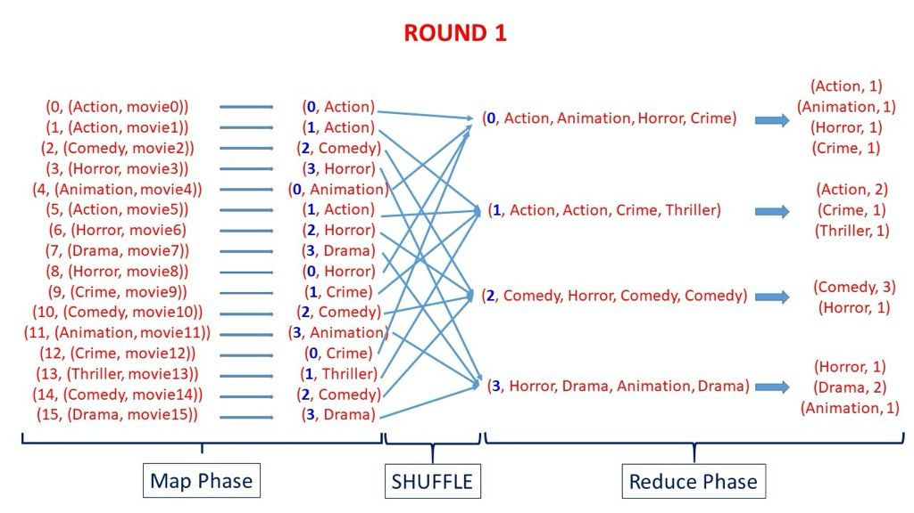

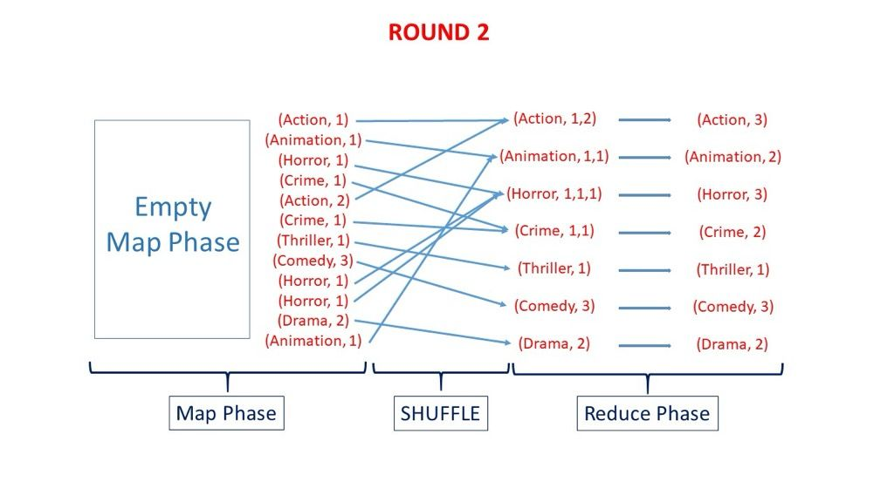

---

By fixing $l = \sqrt{N}$ we get $M_L = O(\sqrt{N})$

$M_A : O(N)$ since there are $O(N)$ input, intermediate and output pairs in each of the 2 rounds, and pairs take $O(x)$ space each

=D THIS SOLUTION MEETS ALL DESIGN GOALS

Class count with 2 rounds with random partition ($l = n$ partitions)

ROUND 1

[Action, movie0] [Action, movie1] [Action, movie2] [Action, movie3] [Action, movie4] [Action, movie5] [Action, movie6] [Action, movie7] [Action, movie8] [Action, movie9] [Action, movie10] [Action, movie11] [Action, movie12] [Action, movie13] [Action, movie14] [Action, movie15] [Action, movie16] [Action, movie17] [Action, movie18] [Action, movie19] [Action, movie20] [Action, movie21] [Action, movie22] [Action, movie23] [Action, movie24] [Action, movie25] [Action, movie26] [Action, movie27] [Action, movie28] [Action, movie29] [Action, movie30] [Action, movie31] [Action, movie32] [Action, movie33] [Action, movie34] [Action, movie35] [Action, movie36] [Action, movie37] [Action, movie38] [Action, movie39] [Action, movie40] [Action, movie41] [Action, movie42] [Action, movie43] [Action, movie44] [Action, movie45] [Action, movie46] [Action, movie47] [Action, movie48] [Action, movie49] [Action, movie50] [Action, movie51] [Action, movie52] [Action, movie53] [Action, movie54] [Action, movie55] [Action, movie56] [Action, movie57] [Action, movie58] [Action, movie59] [Action, movie60] [Action, movie61] [Action, movie62] [Action, movie63] [Action, movie64] [Action, movie65] [Action, movie66] [Action, movie67] [Action, movie68] [Action, movie69] [Action, movie70] [Action, movie71] [Action, movie72] [Action, movie73] [Action, movie74] [Action, movie75] [Action, movie76] [Action, movie77] [Action, movie78] [Action, movie79] [Action, movie80] [Action, movie81] [Action, movie82] [Action, movie83] [Action, movie84] [Action, movie85] [Action, movie86] [Action, movie87] [Action, movie88] [Action, movie89] [Action, movie90] [Action, movie91] [Action, movie92] [Action, movie93] [Action, movie94] [Action, movie95] [Action, movie96] [Action, movie97] [Action, movie98] [Action, movie99] [Action, movie100] [Action, movie101] [Action, movie102] [Action, movie103] [Action, movie104] [Action, movie105] [Action, movie106] [Action, movie107] [Action, movie108] [Action, movie109] [Action, movie110] [Action, movie111] [Action, movie112] [Action, movie113] [Action, movie114] [Action, movie115] [Action, movie116] [Action, movie117] [Action, movie118] [Action, movie119] [Action, movie120] [Action, movie121] [Action, movie122] [Action, movie123] [Action, movie124] [Action, movie125] [Action, movie126] [Action, movie127] [Action, movie128] [Action, movie129] [Action, movie130] [Action, movie131] [Action, movie132] [Action, movie133] [Action, movie134] [Action, movie135] [Action, movie136] [Action, movie137] [Action, movie138] [Action, movie139] [Action, movie140] [Action, movie141] [Action, movie142] [Action, movie143] [Action, movie144] [Action, movie145] [Action, movie146] [Action, movie147] [Action, movie148] [Action, movie149] [Action, movie150] [Action, movie151] [Action, movie152] [Action, movie153] [Action, movie154] [Action, movie155] [Action, movie156] [Action, movie157] [Action, movie158] [Action, movie159] [Action, movie160] [Action, movie161] [Action, movie162] [Action, movie163] [Action, movie164] [Action, movie165] [Action, movie166] [Action, movie167] [Action, movie168] [Action, movie169] [Action, movie170] [Action, movie171] [Action, movie172] [Action, movie173] [Action, movie174] [Action, movie175] [Action, movie176] [Action, movie177] [Action, movie178] [Action, movie179] [Action, movie180] [Action, movie181] [Action, movie182] [Action, movie183] [Action, movie184] [Action, movie185] [Action, movie186] [Action, movie187] [Action, movie188] [Action, movie189] [Action, movie190] [Action, movie191] [Action, movie192] [Action, movie193] [Action, movie194] [Action, movie195] [Action, movie196] [Action, movie197] [Action, movie198] [Action, movie199] [Action, movie200] [Action, movie201] [Action, movie202] [Action, movie203] [Action, movie204] [Action, movie205] [Action, movie206] [Action, movie207] [Action, movie208] [Action, movie209] [Action, movie210] [Action, movie211] [Action, movie212] [Action, movie213] [Action, movie214] [Action, movie215] [Action, movie216] [Action, movie217] [Action, movie218] [Action, movie219] [Action, movie220] [Action, movie221] [Action, movie222] [Action, movie223] [Action, movie224] [Action, movie225] [Action, movie226] [Action, movie227] [Action, movie228] [Action, movie229] [Action, movie230] [Action, movie231] [Action, movie232] [Action, movie233] [Action, movie234] [Action, movie235] [Action, movie236] [Action, movie237] [Action, movie238] [Action, movie239] [Action, movie240] [Action, movie241] [Action, movie242] [Action, movie243] [Action, movie244] [Action, movie245] [Action, movie246] [Action, movie247] [Action, movie248] [Action, movie249] [Action, movie250] [Action, movie251] [Action, movie252] [Action, movie253] [Action, movie254] [Action, movie255] [Action, movie256] [Action, movie257] [Action, movie258] [Action, movie259] [Action, movie260] [Action, movie261] [Action, movie262] [Action, movie263] [Action, movie264] [Action, movie265] [Action, movie266] [Action, movie267] [Action, movie268] [Action, movie269] [Action, movie270] [Action, movie271] [Action, movie272] [Action, movie273] [Action, movie274] [Action, movie275] [Action, movie276] [Action, movie277] [Action, movie278] [Action, movie279] [Action, movie280] [Action, movie281] [Action, movie282] [Action, movie283] [Action, movie284] [Action, movie285] [Action, movie286] [Action, movie287] [Action, movie288] [Action, movie289] [Action, movie290] [Action, movie291] [Action, movie292] [Action, movie293] [Action, movie294] [Action, movie295] [Action, movie296] [Action, movie297] [Action, movie298] [Action, movie299] [Action, movie300] [Action, movie301] [Action, movie302] [Action, movie303] [Action, movie304] [Action, movie305] [Action, movie306] [Action, movie307] [Action, movie308] [Action, movie309] [Action, movie310] [Action, movie311] [Action, movie312] [Action, movie313] [Action, movie314] [Action, movie315] [Action, movie316] [Action, movie317] [Action, movie318] [Action, movie319] [Action, movie320] [Action, movie321] [Action, movie322] [Action, movie323] [Action, movie324] [Action, movie325] [Action, movie326] [Action, movie327] [Action, movie328] [Action, movie329] [Action, movie330] [Action, movie331] [Action, movie332] [Action, movie333] [Action, movie334] [Action, movie335] [Action, movie336] [Action, movie337] [Action, movie338] [Action, movie339] [Action, movie340] [Action, movie341] [Action, movie342] [Action, movie343] [Action, movie344] [Action, movie345] [Action, movie346] [Action, movie347] [Action, movie348] [Action, movie349] [Action, movie350] [Action, movie351] [Action, movie352] [Action, movie353] [Action, movie354] [Action, movie355] [Action, movie356] [Action, movie357] [Action, movie358] [Action, movie359] [Action, movie360] [Action, movie36

---

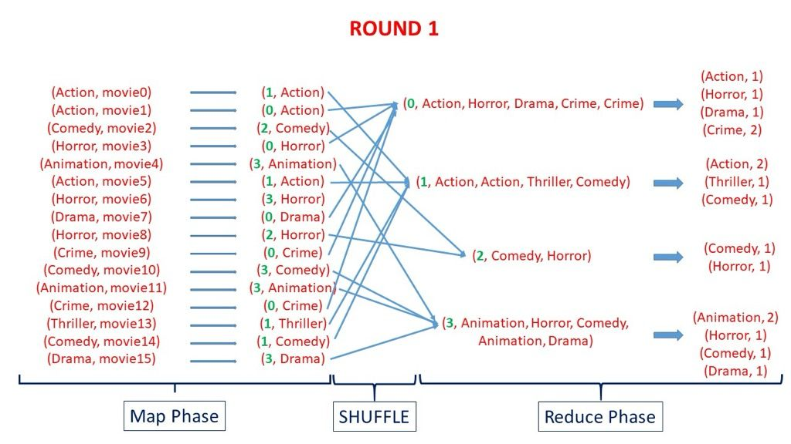

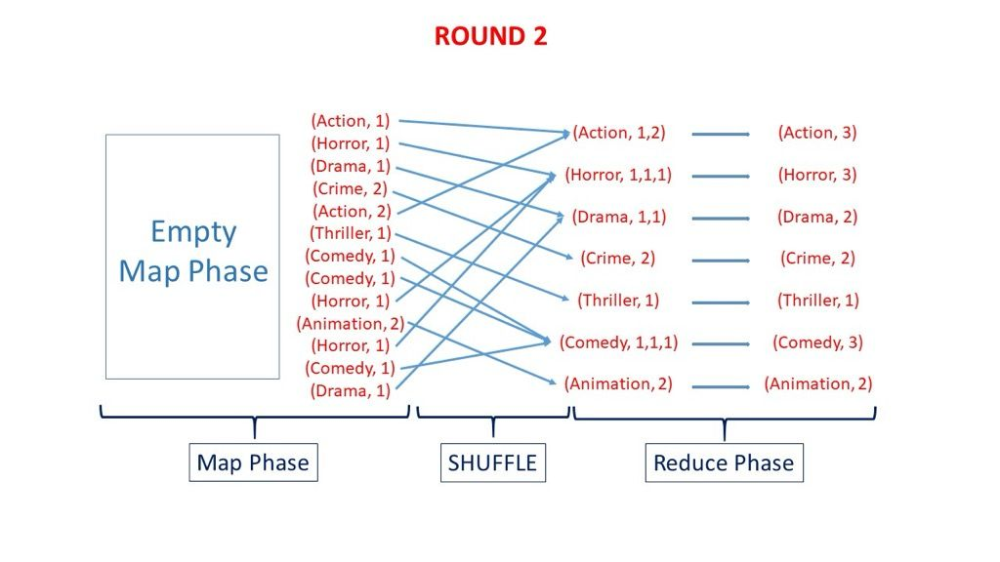

---

R = 2
M<sub>L</sub>:
Round 1
{ Map phase : O(x)
Reduce phase : O(m+1)
Round 2
{ Map Reduce : -
Reduce phase : O(l)

= D M<sub>L</sub> = O(m+l)

M<sub>A</sub>: O(N) same argument as before
Det. partitioning: M<sub>L</sub> = O(N/l + l)
Random partitioning: M<sub>L</sub> = O(m+l)

---

# CLUSTERING AND CORESETS

## METRIC SPACE

A metric d satisfies non-negativity, identity of indiscernibles (no two distinct objects can share the same properties), symmetry and triangle inequality

$$d(x, y) > 0 \quad d(x, y) = d(y, x)$$
$$d(x, y) = 0 \iff x = y \quad d(x, z) \leq d(x, y) + d(y, z)$$

## TRIANGLE INEQUALITY

$$d(x, y) - d(y, z) \leq d(x, z) \leq d(x, y) + d(y, z)$$

If $d(y, z)$ is small $\Rightarrow d(x, y) \geq d(x, z)$ meaning that one of the two points can be discarded in the case.

## DISTANCE FUNCTIONS

### Min Koupeki

Let $X, Y \in \mathbb{R}^n$ with $X = (x_1, \ldots, x_n)$ and $Y = (y_1, y_2, \ldots, y_n)$.

For $r > 0$ the $L_r$-distance between $X$ and $Y$

$$d_{L_r}(X, Y) = \left( \sum_{i=1}^n |x_i - y_i|^2 \right)^{1/r}$$

- $r = 2$ (Euclidean) $\Rightarrow \sqrt{\sum_j (x_j - y_j)^2}$
- $r = 1$ (Manhattan) $\Rightarrow \sum_j |x_j - y_j|$, guid-like env
- $r = \infty$ (Chebyshev distance) $\Rightarrow \max_j |x_j - y_j|$, largest coordinate dist

## Angular distance

Used when points are vectors in $\mathbb{R}^n$

$$d_{\text{angular}}(X, Y) = \arccos \left( \frac{x \cdot y}{\|x\| \cdot \|y\|} \right)$$
$$= \arccos \left( \frac{\sum_{i=1}^n x_i y_i}{\sqrt{\sum_{i=1}^n (x_i)^2} \sqrt{\sum_{i=1}^n (y_i)^2}} \right) \in [0, \pi]$$

---

Example: $X = (4, 2, -1)$ $Y = (2, 4, 1)$
$$d_{\text{angular}}(X, Y) = \arccos \left( \frac{X^2}{2} \right) = \frac{\pi}{3}$$

Minimumk: and Angular: used when an object is characterized by numerical values of its features

Hamming distance: when points are binary vectors over some dimensional space $X, Y \in \{0, 1\}^n$
$$d_{\text{Hamming}} = |X, Y| = \left| \left\{ i | x_i \neq y_i \right\} \right| \rightarrow \text{number of coordinates in which they differ}$$

Example: for $X = (0, 1, 1, 0, 1)$ and $Y = (1, 1, 1, 0, 0)$
$$d_{\text{Hamming}}(X, Y) = 2$$

Jaccard distance: when points are sets. Let $S$ and $T$ be two sets over the same ground set of elements
$$d_{\text{Jaccard}}(S, T) = \frac{1 - |S \cap T|}{|S \cup T|} < \frac{|S \cup T|}{|S \cup T|}$$

Example:
$$d_{\text{Jaccard}}(S, T) = \frac{1 - \frac{6}{18}}{\frac{2}{3}}$$

Hamming and Jaccard: used when an object is characterized by having or not having some features (no multiplicity)

Three central objectives
Let $(M, d)$ be a metric space. The $K$-center/ $K$-means/ $K$-median clustering problems are optimization problems that, given a finite pointset $P \in M$ and an integer $K \leq |P|$, require to return the subset $S \subset P$ of $K$ centers which minimizes the following respective objective functions

• $\Phi_{\text{center}}(P, S) = \max_{\text{rep}} d(x, s)$: $K$-center clustering, controls the worst-served point
• $\Phi_{\text{means}}(P, S) = \sum_{\text{rep}} d(x, s')$: $K$-means clustering, controls squared distance and emphasizes large deviations.

---

• $P_{median}(P, S) = \frac{1}{n_{exp}} d(x, S)$: $K$-median clustering, controls total distance

Why do we require only the centers as output?
Given an instance $(P, K)$ and a set $S$ of $K$ centers (solution) the "best" $K$-clustering of $P$ around the $K$ centers of $S$ is obtained by assigning each point to the cluster associated with the closest center.

Can a suitable partition be recovered from the centers?
The assignment can be computed efficiently both in the sequential and distributed settings.

K-CENTER
Farthest-First Tranversal (FFT) selects $K$-centers for metric $K$-center. Popular 2 approx sequential algorithm, simple, fast implementation.
It repeatedly chooses the point whose distance from its nearest existing center is largest

Input: set $P$ of $N$ points from $(M, d)$ integer $k > 1$
Output: set $S$ of $K$ centers which is a good solution to the $K$-center problem on $P$

$S \leftarrow \{c_i\}$ // $c_i \in P$ arbitrary point
for $i < 2$ to $K$ do
    Find the point $c_i \in P - S$ that maximizes $d(c_i, S)$
    $S \leftarrow S \cup \{c_i\}$
return $S$

Pointset $P$
Before FFT
After FFT → centers selected, induced near center clustering

---

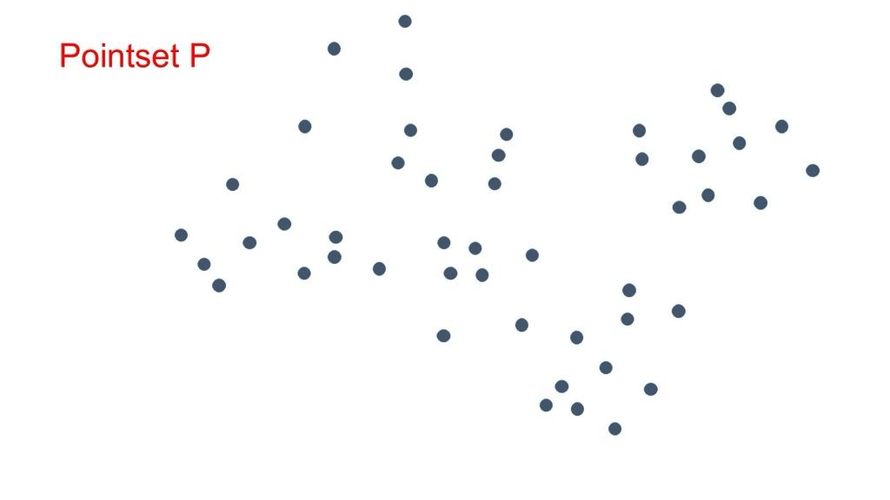

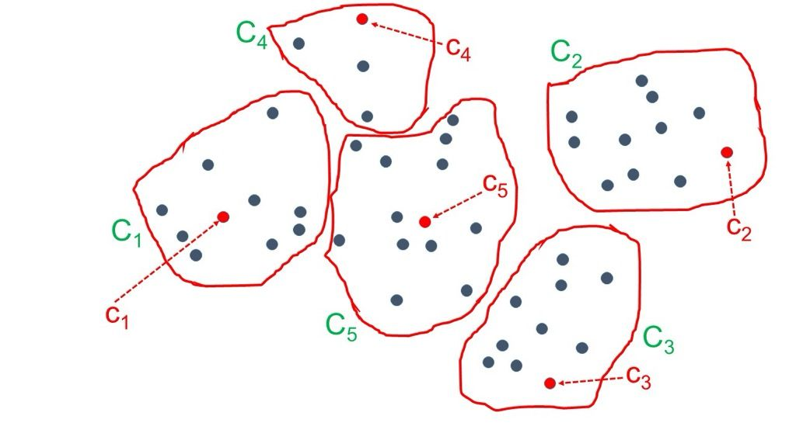

---

[THEOREM] FFT approximation guarantee

For metric K-center FFT returns K center of radius $r \leq 2r^*$ where $r^*$ is the optimal radius

[PROOF]

$S = \{c_1, \ldots, c_u\}$, $c_i = i$-th center selected by FFT

Recall that $\Phi_{u\text{center}}(P, S) = \max_{x \in P} d(x, S)$

Define $q \in P$ as the point s.t. $\Phi_{u\text{center}}(P, S) = d(q, S)$

Consider the set $\{c_1, c_2, \ldots, c_u, c_{u+1} = q\}$ $k+1$ points!

CLAIN $\Phi_{u\text{center}}(P, S) = d(q, S) \leq d(c_i, c_j)$ $\forall 1 \leq i \leq j \leq k+1$

We will prove the claim later on

Now let $S^* = \{c_1^*, c_2^*, \ldots, c_u^*\}$ optimal solution

$\cdot \Phi_{u\text{center}}(P, k) = \Phi_{u\text{center}}(P, S^*) \leq \Phi_{u\text{center}}(P, S)$

$\cdot \forall x \in P d(x, S^*) \leq \Phi_{u\text{center}}(P, k)$

Define $C_t^* = \{x \in P : C_t^* \text{ is the closest center of } S^* \text{ to } x\}$

$\Rightarrow P = C_1^* \cup C_2^* \cup \ldots \cup C_u^* \equiv \text{optimal clustering of } P$

By PIDGEON hole principle, then must exist 2 points of $\{c_1, \ldots, c_u, c_{u+1}\} \text{ which belong to the same cluster } C_t^*$, say $c_2, c_4$ with $a \leq b$

Triangle ineq $\Rightarrow d(c_0, c_6) \leq d(c_0, c_4^*) + d(c_0, c_4^*) \leq 2 \Phi_{u\text{center}}(P, k)$

so $\Rightarrow \forall x \in P \text{ we have that } d(x, S) \leq d(q, S)$

$\leq d(c_0, c_6)$

$\leq 2 \Phi_{u\text{center}}(P, k)$

A coreset is a small problem-specific summary with a mathematical guarantee relating solutions on the summary to solutions on the original input.

It can be a subset of points, weighted representations or another compact structure, depending on the problem.

A composable coreset construction permits partitioning $P$ into $P_1, \ldots, P_k$ computing summaries $T_i$ independently, then solving on $T = U \cap T_i$ with a controlled loss.

This is effective when local parkour fit workers, the union fits the final solver summaries are cheap to compute and their approximation loss is acceptable.

---

# HR-FFT

Let $P$ be a set of $N$ points (N large) from a metric space $(M, d)$ and let $k > 1$ be an integer.

Round 1: partition $P$ into $L$ balanced parts. On each $P_i$ compute $T_i = FFT(P_i, k)$ or retain the entire partition if it has fewer than $k$ points. Emit all representatives with a common key for Round 2.

Round 2: collect $T = U; T_i$, with $|T| \leq kL$ and run $S = FFT(T, k)$

**[THEOREM]** HR-FFT space complexity

The 2-round HR-FFT algorithm can be implemented using local space $M_L = O(\sqrt{nk})$ and aggregate space $M_a = O(N)$.

**Proof**

$M_L = \max\{N/L, kL\}$

A first-round reducer stores at most $O(N/L)$ input points; the final reducer receives at most $kL$ representatives. At most $N$ representatives are emitted because local sets never exceed their input sizes. Hence aggregate space stays linear.

Balancing $N/L = kL$ minimizes the maximum. Multiply geometric storage by $D$ for $D$-coordinate points.

Assuming linear space sequential FFT

$$M_L = O(\max\{N/L, kL\}, M_a = O(N)$$

Balance the two local bottlenecks: $N/L = kL \Rightarrow L \times \sqrt{nk}$ hence $M_L = O(\sqrt{nk})$

Balance the two local bottlenecks: $N/L = kL \Rightarrow L \times \sqrt{nk}$ hence $M_L = O(\sqrt{nk})$$

---

# Analyses of MR-FIT

Let $S$ be the set of $K$ centers returned by running MR-FIT on $P$. Then:

$$\phi_{k\text{center}}(P, S) \leq 4 \cdot \phi_{k\text{center}}^{opt}(P, K)$$

$= D$ MR-FIT is a 4-approx algorithm

**Proof:**

(A) Let $r^*$ be the optimal radius for the full dataset $P$. On each $P$, the selected local centers plus its furthest point form $K+r$ points of $P$. The FFT separation argument and the global optimal clustering give

$$\max_{x \in P} d(x, T_i) \leq 2r^*$$

Therefore, every original point has a proxy in $T$ within $2r^*$

**(B)** Then apply the same separation argument to FFT on $T \subset P$, again comparing against the global optimal clusters.

It gives:

$$\max_{y \in T} d(y, s) \leq 2r^*$$

By combining (A) and (B):

$$\leq 2\phi_{k\text{center}}(P, K) \leq 2\phi_{k\text{center}}(P, K)$$

$$y \leq 2r^* + 2r^* = 4r^*$$

For every $x \in P$, follow its proxy:

$$d(x, S) \leq d(x, c)$$

$$\leq d(x, y) + d(y, c) \leq 2r^* + 2r^* = 4r^*$$
$$\leq 2\phi_{k\text{center}}(P, K) \leq 2\phi_{k\text{center}}(P, K)$$

$$y \leq 2r^* + 2r^* = 4r^*$$
$$\leq 2\phi_{k\text{center}}(P, K) \leq 2\phi_{k\text{center}}(P, K)$$

$$y \leq 2r^* + 2r^* = 4r^*$$

---

# OBSECTATIONS

• FFT provides good corresets $T_i$ hence a good final correset $T = \Delta(P)$ ensures that any point not belonging to $T$ is well represented by some correset point

• HR-PFT can handle very large pointsets $\Delta(P) = \max_{x,y \in P} d(x,y)$

• For any optim problem, no HR algorithm can attain better accuracy than the best sequential algorithm

# K-CENTER AS A CORESET PRIMITIVE

**Diameter** $\Delta(P) = \max_{x,y \in P} d(x,y)$

$$\Delta(P) = \max_{x,y \in P} d(x,y)$$

diameter

$\Rightarrow$ compilation of the exact diameter requires almost quadratic operations $\Rightarrow$ impractical for large $h-d$ pointsets

**[LEMMA]**

For arbitrary $x \in P$, $\Delta_x = \max \{ d(x,y) : y \in P \}$

$\forall x \in P$, $\Delta(P) \in [\Delta_x, 2\Delta_x]$

**Proof**

• $\Delta(P) > \Delta_x$ since $\Delta(P)$ is the max distance over "all" pairs of points, while $\Delta_x$ if the maximum distance over all pairs that include $x$

• $\Delta(P) \le 2\Delta_x$. Let $z, w$ be s.t. $\Delta_x = d(z,w)$. Then, by triangle inequality

$$\Delta(P) = d(z,w) \le d(z,x) + d(z,w) \le 2\Delta_x$$

**Pointset P**
Diameter

---

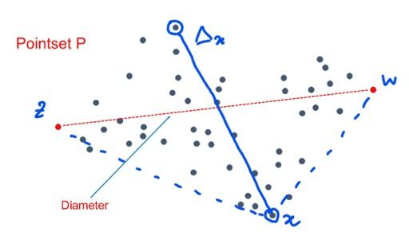

---

# CORESET - BASED DIAMETER APPROX

• Fix suitable $K > 2$
• Extract coreset $T \subset P$ of size $K$ by running a $K$-center clustering algorithm on $P$ and taking the $K$ returned contours as set $T$
• Return $\Delta(T) = \max_{x,y} d(x,y)$ as an approx of $\Delta(P)$

## Can the approach be computed efficiently?

Well if $K = O(4)$, $\Delta(T)$ can be computed
• Sequentially: in $O(N)$ time using FFT
• In Map Reduce: in 2 rounds with local space $M_L = O(\sqrt{N})$ and $M_R = O(N)$ (using MR-FFT)

Is $\Delta(T)$ a good approx. of $\Delta(P)$?

$$T = \{c_1, c_2, \ldots, c_n\}$$
$$q = \text{point of } P \text{ furthest from } T$$
$$\Delta(P) = \text{the diameter of } P$$
Let $c_i = \text{center of } T \text{ closest to } z$
$c_j = \text{center of } T \text{ closest to } w$

$$\Rightarrow \Delta(P) = d(z_i, w)$$
$$\leq d(z_i, c_i) + d(c_i, c_j) + d(c_j, w)$$
$$\leq 2R + d(c_i, c_j)$$
$$\leq 2R + \Delta(T)$$

$$\Rightarrow \Delta(T) \leq \Delta(P) \leq \Delta(T) + 2R$$
$$\Rightarrow \Delta(T) \leq \Delta(P) \leq \Delta(T) + 2R$$
$$\Rightarrow \Delta(T) \leq \Delta(P) \leq \Delta(T) + 2R$$
$$\Rightarrow \Delta(T) \leq \Delta(P) \leq \Delta(T) + 2R$$
$$\Rightarrow \Delta(T) \leq \Delta(P) \leq \Delta(T) + 2R$$
$$\Rightarrow \Delta(T) \leq \Delta(P) \leq \Delta(T) + 2R$$

---

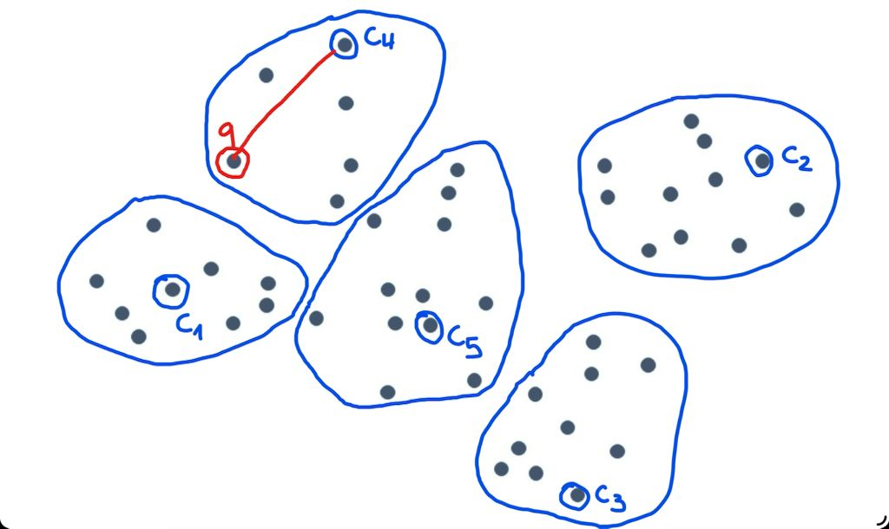

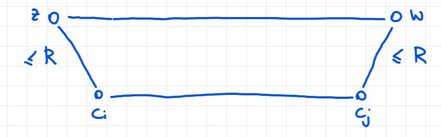

---

# What is Diversity maximization?

For a given dataset, the objective is to determine the most diverse subset of size $K$, for a given small $K$.

Called also max-sum diversity.

Given a set $P$ of points from $(M, d)$ and a positive integer $K < |P|$, return a subset $S$ of $K$ points which maximizes the diversity function

$$\text{div}(S) = \sum_{x,y \in S} d(x,y)$$

Coreset based approach to diversity maximization

For given input $P$, the value of optimal solution is:

$$\text{div}^{\text{opt}}(P, K) = \max_{\substack{S \subseteq P \\ |S| = K}} \text{div}(S)$$

We can extract a good solution from that small coreset as long as $T$ is a good coreset.

**Definition of $(1 + \varepsilon)$-coreset**

To evaluate the quality of a coreset, let $\varepsilon \in (0, 1)$ be an accuracy parameter.

A subset $T \subset P$ is an $(1 + \varepsilon)$-coreset for the diversity maximization problem on $P$ if:

$$\text{div}^{\text{opt}}(T, K) \geq \frac{1}{1 + \varepsilon} \text{div}^{\text{opt}}(P, K)$$

$= 0$ The smaller $\varepsilon$, the better for optimal solution.

**K-MEANS/K-MEDIAN**

Review: let $(M, d)$ be a metric space. The $k$-clustering problems are optimization problems that, given a finite $P \subset M$, and integer $K$, require for return the subs. $S$ of $K$ centers which minimizes the following obj function:
$$\text{div}^{\text{opt}}(T, K) \geq \frac{1}{1 + \varepsilon} \text{div}^{\text{opt}}(P, K)$$
$= 0$ The smaller $\varepsilon$, the better for optimal solution.
The document is structured with headings, paragraphs, bullet lists, and code blocks. The text is clearly readable and organized into logical sections.
The document is structured with headings, paragraphs, bullet lists, and code blocks. The text is clearly readable and organized into logical sections.

---

• K-means:
  $$\Phi_{mean}(P, S) = \sum_{x \in P} (d(x, S))^2$$
• K-median:
  $$\Phi_{median}(P, S) = \sum_{x \in P} d(x, S)$$

K-MEANS +, Lloyd and PAM

K-means is randomized init. Choose the first center uniformly in the unweighted case. Given selected centers $S$, choose the next point with probab.

$$Pr(x \text{ next}) = \frac{d(x, S)^2}{\sum_{y \in P} d(y, S)^2}$$

Point far from existing centers receive more probability.

$$c_1 \leftarrow \text{random point chosen from } P \text{ with uniform probability;}$$
$$S \leftarrow \{c_1\};$$
for $2 \leq i \leq k$ do
  foreach $x \in P - S$ do $\pi(x) \leftarrow (d(x, S))^2 / \sum_{y \in P - S} (d(y, S))^2;$
  $c_1 \leftarrow \text{random point in } P - S \text{ according to distribution } \pi(-);$
  $S \leftarrow S \cup \{c_1\}$
return $S$

Obs. S is a random variable!

Observation: k-means + is a randomized algorithm and it is known that in expectation, the returned solution is an $\alpha$-approximation, with $\alpha = \Theta(\ln k)$.

- It can be used both for K-means / median
- Provides decent solutions, but often useful to refine for better results
- Very easy and efficient implementation
- Can be processed by a distributed platform and K is small.

Lloyd's algorithm alternates nearest-center assignment and replacing each nonempty cluster center by its mean.
Assignment chooses the cheapest current center, and the mean minimizes the sum of squared distances within a fixed cluster.
It can stop at a local optimum and depends on initialization.

PAM, Partitioning Around Medoids is a local search approach with centers chosen among input points. It starts from an

---

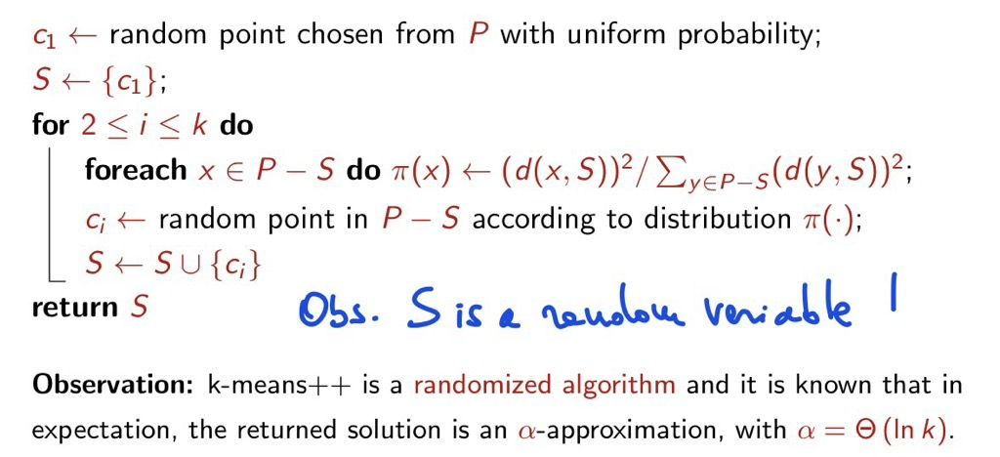

---

arbitrary solution $S$ and progressively improves it by performing the best swap between a point in $S$ and a point in $P-S$ until no improving swap exists

- can be used for $K$-median
- prides good accuracy solutions
- very slow = each interim is $N \cdot K$ possible swaps
- NOT SUITABLE FOR LARGE INPUTS

Cereset-based approaches are essential in this case.

**WEIGHTED K-MEANS and MR-Kmeans**

For weights, $w(x) \ge 0$, minimize

$$\Phi^w(P, S) = \sum_{x \in P} w(x) d(x, S)^2$$

Weights record how much original mass a representative stands for. A covered representing 1000 observations should not contribute the same as one representing $d$.

**Weighted K-means +**

**Input:**

- Set $P$ of $N$ points from $IR^0$
- Integer weight $w(x)$ $\forall x \in P$
- Target number $K$ of clusters

**Output:** set $S$ of $K$ centers in $IR^0$ minimizing

$$\Phi^w(P, S) = \sum_{x \in P} w(x) d(x, S)^2$$

How to adopt known algorithms to handle weights

- $K$-means: change the probability of selecting new centers $c_i$ in iterations $i = 2 \dots$

$$\pi(x) = \frac{d(x, S)^2}{\sum_{y \in P} d(y, S)^2} \rightarrow \frac{w(x) \cdot d(x, S)^2}{\sum_{y \in P} w(y) \cdot d(y, S)^2}$$
$$\pi(x) = \frac{d(x, S)^2}{\sum_{y \in P} d(y, S)^2} \rightarrow \frac{w(x) \cdot d(x, S)^2}{\sum_{y \in P} w(y) \cdot d(y, S)^2}$$

---

Lloyd's algorithm

$$\Phi_{k-means}(P, S) \rightarrow \Phi_{k-means}^{w}(P, S)$$

Centroid for a cluster $C = \{x_1, x_2, \ldots, x_t\}$

$$\frac{1}{t} \sum_{i=1}^{t} x_i \rightarrow \frac{1}{\sum_{i=1}^{t} w(x_i)} \sum_{i=1}^{t} w(x_i) \cdot x_i$$

Obs. for K-median, PAM algorithm can be adapted to handle weights in a similar fashion

MR-Kmeans ($A_1, A_2$): MR for $K$-means which 2 sequential algorithms $A_1$ and $A_2$ for $K$-means s.t.:

• $A_1$ solves the standard variant without weights
• $A_2$ solves the more weighted variant

Input: set $P$ of $N$ points in $IR^0$, integer $k > 1$ sequential $K$-means algo $A_1, A_2$

Output: set $S$ of $K$ centers in $IR^0$ which is good solution to the $K$-means problem on $P$

$R_1$:

• MP: partition $P$ arbitrarily in $l$ subsets of equal size $P_1, P_2, \ldots, P_l$
• RP: for every $i \in [x_1, l]$ separately run $A_1$ on $P_i$ to determine a set $T_i$ of $K$-centers, and define
  - $V \times P$, proxy $C(x)$ as $x$'s closest center in $T_i$
  - $V \times T_i$, the weight $w(y)$ as the number of points of $P_i$ whose proxy is $y$

$R_2$:

• MP: empty
• RP: run, using a single reducer $A_2$ on $T = U_{min}^2 T_i$ to determine a set $S = \{c_1, \ldots, c_n\}$ of $K$ centers, which is then returned as output
---
• Lloyd's algorithm
  $$\Phi_{k-means}(P, S) \rightarrow \Phi_{k-means}^{w}(P, S)$$
• Centroid for a cluster $C = \{x_1, x_2, \ldots, x_t\}$
  $$\frac{1}{t} \sum_{i=1}^{t} x_i \rightarrow \frac{1}{\sum_{i=1}^{t} w(x_i)} \sum_{i=1}^{t} w(x_i) \cdot x_i$$
• Obs. for K-median, PAM algorithm can be adapted to handle weights in a similar fashion

---

# Analysis

**Performance** assume $K = o(N)$ by setting $\ell = \sqrt{N}/k$ it is easy to see that MR-Kmeans ($A_1, A_2$) requires
• $M_L = O(\max \frac{N}{k}, \ell \cdot k^3) = O(\sqrt{N} \cdot k) = o(N)$
• $M_A = O(N)$

**Accuracy** given a pointset $P$, a coreset $T \subset P$ and a proxy function $\tau: P \rightarrow T$, we say that $T$ is a $\gamma$-coreset for $P, k$ and the $K$-means objective if

$$\sum_{p \in P} \left( d(p, \tau(p)) \right)^2 \leq \gamma \cdot \phi_{\text{means}}^{\text{opt}}(P, k)$$

**γ-coreset**

Sum of squared distances from $P-T$ to $T$ (red lines) $\leq \gamma \cdot \phi_{\text{means}}^{\text{opt}}(P, k)$

Essentially, $P$ is a $\gamma$-coreset with small $\gamma$, we know that the error that we make approximating $\Phi_{\text{means}}(P, S)$ with $\Phi_{\text{means}}^w(T, S)$ is small
Set $T$ (green points) computed in a partition $P_i$
$k=4$
$T_i = \{a, b, c, d\}$
$w(a) = 10$ $w(d) = 5$
$w(b) = 6$
$w(c) = 4$

---

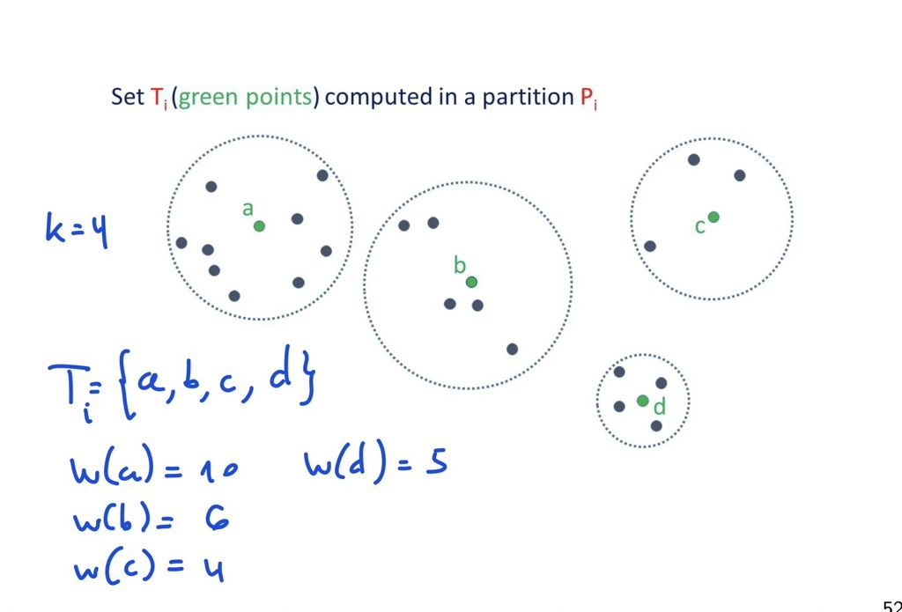

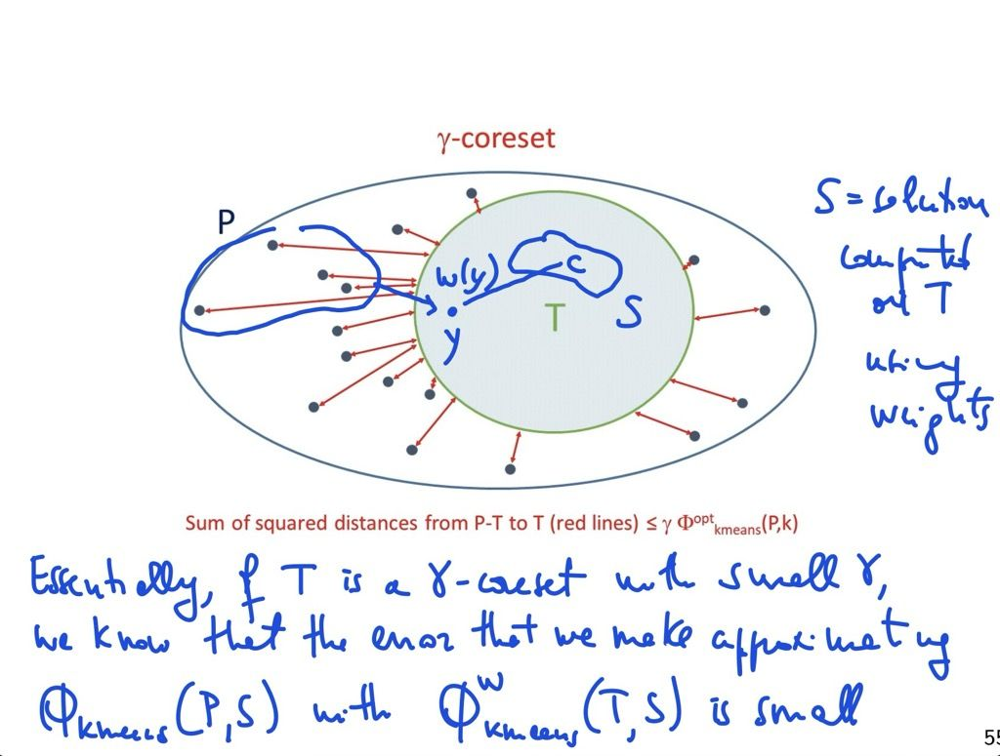

---

[Theorem]

Suppose that:

• $A_1$ is a $\gamma$-approximation alg. for the unweighted $k$-means problem
• $A_2$ is an $\alpha$-approximation alg. for the weighted $k$-means problem

Then

• The cereset $T$ computed in $R_1$ is a $\gamma$-cereset
• The solution $S$ computed in $R_2$ is $s.t.$

$$\Phi_{\text{umeans}}(p, s) = O((1 + \gamma) \cdot a) \cdot \Phi_{\text{opt}}^{\text{umeans}}(p, k)$$

skip, proof

---

# STREAMING FRAMEWORK

**Stream**: sequence $\Sigma = x_1, x_2, \ldots$, whose items arrive one at the time

**Streaming algorithm**: updates compact working state and must answer a query about the prefix seen so far.

Data may be unbounded or too large to store

**Evaluate four resources:**
- **working memory**: ideally sublinear or polylogarithmic in stream length or univariate size
- **number of sequential passes**: ideally one
- **update time per item**: ideally constant or logarithmic
- **query time**: ideally independent of the stream length

**Accuracy must be specified:**
- exact, additive or relative error
- deterministic or probabilistic
- per query or simultaneously for any possible query

**Main tools:**
- **Sampling**: Vieops selected observations $\Rightarrow$ can return original items
- **Sketching**: states randomized linear summaries $\Rightarrow$ can answer queries but cannot enumerate all keys unless candidate keys are maintained separately


---

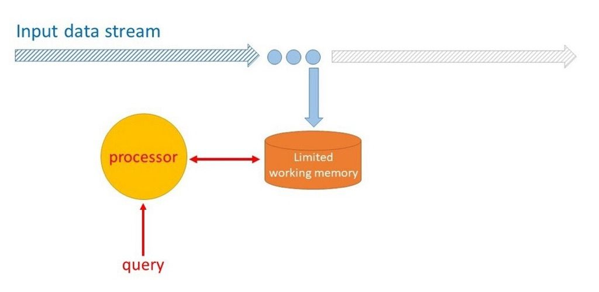

---

# Boyer-Moore Majority vote

Given a stream $\Sigma = x_1, x_2, \ldots, x_n$, an item is a majority if its frequency exceeds n/2

Boyer-Moore maintains candidate `cand` and integer `count`

```python
for each x_t in Σ do
    if count = 0 then {cand ← x_t; count ← 1}
    else {
        if cand = x_t then count ← count + 1
        else count ← count - 1
    }
At the end: return cand
```

One pass: $O(1)$ words and $O(1)$ update/query time

If majority exists, returned candidate is the majority

How it works?

**Example:** $\Sigma = A, A, A, C, C, B, B, A, A$
$$x_1 x_2 x_3 x_4 x_5 x_6 x_7 x_8 x_9$$

| STEP | cand | count |
| :--- | :--- | :--- |
| 0 | null | 0 |
| 1 | A | 1 |
| 2 | A | 2 |
| 3 | A | 3 |
| 4 | A | 2 |
| 5 | A | 1 |
| 6 | A | 0 |
| 7 | B | 1 |
| 8 | B | 0 |
| 9 | A | 1 |

At the end: `return A (true majority)`

Select the candidate, say A.

If you scroll the list, and find other A's, then count it, count-- otherwise.

If count=0, switch to next candidate.

---

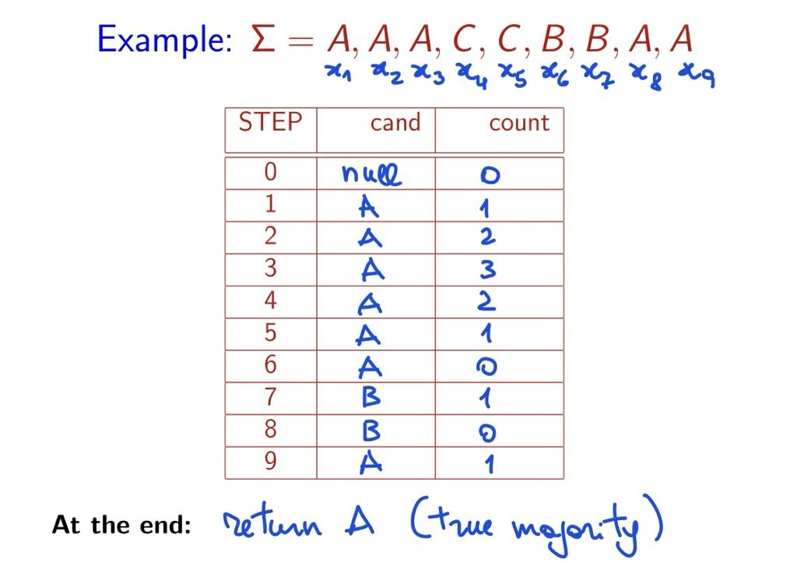

---

[Theorem] Boger-Moore Majority vote concept
If an item occurs more than n/2 times, Boger-Moore returns that item

Proof (concollision invariant)
After processing t items the prefix can be partitioned into count occurrences of cond and (t-count)/2 unequal pairs.
By induction:
• If old count is zero, new item becomes the single unpaired candidate occurrence
• If new item equals candidate, add it to unpaired candidate occurrences
• Otherwise, pair the new item with one previously unpaired candidate occurrence, count falls by one
If majority a existed, but final candidate differed, every occurrence of a would lie inside an unequal pair. Each such pair contains at most one a, so $f_a \le n/2$, concollision

SAMPLING
Def. given a set $X$ of $n$ elements and an integer $1 \le m \le n$, an $m$-sample is a random subset $S \subset X$ of size $m$ s.t. $\forall x \in X$ we have $\Pr(x \in S) = \frac{m}{n}$ (uniform sampling)

Reservoir Sampling
Does not require the final stream length
Store first $m$ records.
For record $x_t$ with $t > m$:
with probability $m/t$:
replace one uniformly random reservoir position by $x_t$

[Theorem] Reservoir Sampling Uniformity
After processing $t \ge m$ records, each record belongs to the size-$m$ reservoir with probability $m/t$

Proof by induction
At $t = m$, inclusion probability is 1. Assume an old record $x_i$ has prob. $m/(t-1)$ before processing $x_t$.

---

It is excited (eliminated) with conditional probability:

$$\Pr(x_t \text{ insisted}) \Pr(x_i \text{ selected}) | x_i \in S_{t+1}) = \frac{m}{t} \frac{1}{w} = \frac{1}{t}$$

Therefore

$$\Pr(x_i \in S_t) = \frac{m}{t-1} \left(1 - \frac{1}{t}\right) = \frac{m}{t}$$

Frequent and Sticky Sampling

For threshold $\phi \in (0, 1)$, an item is frequent when $f_x > \phi m$

There can be at most 1/$\phi$ frequent items.

The $E$-approximate Frequent Items problem requires an output $F$ satisfying

1. every item with $f_x > \phi n$ belongs to $F$;
2. no item with $f_x < (\phi - \epsilon)n$ belongs to $F$

Item in the gray zone between $[(\phi - \epsilon)n, \phi n]$ may be returned or omitted.

$$\phi - \epsilon$$

Tolerated frequencies

Toughest frequencies

Ex.

• $A$: 30 occur $n = 100$
• $B$: 30 $\phi = 0.3$ $E = 0.1$ = do the math
• $C$: 20
Legal outputs: $\{A, B\}$
$\{A, B, C\}$

Neither $D$ and $E$ can be included in the output

Sticky sampling provides a probabilistic solution to the $E-AFI$ problem

For known $n$, sticky sampling sets

$$r = \left[ \frac{\ln(1/s_\phi)}{\epsilon} \right] p = \min \{r/n, 1\}$$

---

It maintains a hash table $S$ of sampled items and lower bound counters:

```python
for each arrival x:
    if x is already stored: counter[x] += 1
    else with probability p: counter[x] = 1
return every stored x with counter[x] >= (phi - epsilon)n
```

[Theorem] Sticky sampling analysis

SS solves the $\mathcal{E}$-AFI problem correctly with prob. at least $\alpha-\delta$ and requires

• working memory of size $O(r) = O(\ln(\frac{1}{s_0}))/\varepsilon$ in expectation
• $\lambda$ pass
• $O(x)$ update time in expect.
• $O(r) = O(\ln(\frac{1}{s_0}))/\varepsilon$ query time in expect.

Proof

* Working memory size: proportional to the number of entries in $S$ (assume each entry is $O(x)$). Now each $x_+$ contributes a new entry to $S$ with prob. $p_+ \leq r/n$
$$x_+ = \begin{cases} 1 & \text{if } x_+ \text{ contributes a new entry to } S \\ 0 & \text{otherwise} \end{cases}$$

at the end of the stream $|S| = \sum_{t=1}^{n} x_+$
$$\Rightarrow E[|S|] = E[\sum_{t=1}^{n} x_+] = \sum_{t=1}^{n} E[x_+] = \sum_{t=1}^{n} p_+ \leq r/n$$
$$\Rightarrow \text{WH size} = O(r)$$

* $\lambda$ pass, $O(x)$ update time: straight forward

* Query time: $O(r)$ in expectation, immediate consequence of the fact that $E[|S|] = O(t)$

* Connectness: prove that prob. is $\alpha-\delta$ the return at satisfies
(A) Output contains all five frequent items
(B) Output contains no item that occurs less than $(\Phi-\varepsilon)n$ times.
(B) $\rightarrow$ immediate by construction
(A) $\rightarrow$ holds with probability $\alpha-\delta$.

---

α = arbitrary frequent item
⇒ Pr(α not returned in output) ≤ Pr(none of the first [εn] occurrences of α are satisfied)
= (1 - κ/n)^{εn} ≤ (1 - κ/n)^{εn}
= (1 - κ/n)^{εn - κ/n - κ/n} = ((1 - 1/nr)^{nr})^{εn} ≤ (1/e)^{εn}

Let α₁, α₂, ..., αₙ be all frequent items we know k ≤ 1/φ
Now, Pr(3 some α; not returned in the output) ≤ δ (after calculation)
⇒ Pr(all frequent items are returned) > 1 - δ

**SKETCHING**

**Sketch:** space-efficient data structure can be used to provide estimates (typically probabilistic) of characteristics of a data stream.

**Frequency Moments:** consider a stream Σ whose elements belongs to a universe U

Let f₀ be the freq. of item u. The k-th freq. moment is:
$$F_n = \sum_{u \in U} f_u^k \quad \forall k > 0 \quad \text{and assuming } 0^\circ = 0$$

**Important cases:**
• F₀ = number of distinct items in Σ
• F₄ = |Σ| = # elements in sequence
• 1 - F₂/|Σ|² = G-min. index of Σ => info on data impurity. Closer to 1 => higher the impurity

**Probabilistic counting**
chooses a uniform b-bit hash h: U → {0, ..., 2ⁿ - 1} where 2ⁿ ≥ lʳ. Also integer R ∈ [0, |log₂ lʳ|] which requires O(log log₂ lʳ) bits

Let tr(:) = number of trailing zeros in binary representation of i
$$12 = (11 \times 0)_2 \Rightarrow tr(12) = 2$$

---

Algorithm:
Initialization at $R < 0$
For each $x_i \in \Sigma$ do $R < \max\{R_i, \text{tr}(h(x_i))\}$
After processing $x_i$, estimates $F_0$ as
$$F_0 = 2^R$$
Repetitions of the same items have the same hash and do not change $R$, which is why the estimator depends on distinct items
For a uniform bit string (101 power of 2)
$$\text{Pr}( \text{tr}(h(x)) > j = 2^{-j} )$$
With $F_0$ distinct items, the expected number reaching level $j$ is $F_0/2^j$ so the largest level lies around $\log_2 F_0$.

[Theorem] For a stream $\Sigma$ of $n$ elements, the probabilistic counting algorithm returns a value $F_0$ such that, for any $c > 2$
$$\text{Pr}( F_0 < F_0/c ) \leq 1/c \text{ and } \text{Pr}( F_0 > cF_0 ) \leq 1/c$$
hence
$$\text{Pr}( F_0/c \leq F_0 \leq cF_0 ) \geq 1-2/c$$
The algorithm requires a working memory of $O(\log|U|)$ bits, 1 pass, $O(\log|U|)$ update/query time per element.

Proof
$$\text{Pr}( F_0 > cF_0 ) = \frac{1}{c}$$
$$\text{Pr}( F_0 > cF_0 ) = \text{Pr}( 2^R > cF_0 ) = \text{Pr}( (R > \log_2(cF_0)))$$
$$\leq F_0 \left( \frac{1}{2} \log_2 cF_0 \right) = 1/c$$
$$\text{Pr}( F_0 < F/c ) \leq 1/c$$
we skip this proof
Algorithm:
Initialization at $R < 0$
For each $x_i \in \Sigma$ do $R < \max\{R_i, \text{tr}(h(x))\}$
we skip this proof```

---

# Working memory: $O(\log |u|)$
- $R$ requires $O(\log \log |u|)$ bits
- $h(x) \in [0, |u|-1] \Rightarrow$ requires $O(\log |u|)$ bits

# Update time: $O(\log |u|)$ to process the binary configuration of $h(x_+)$

# Query time: $O(\log |u|)$ to compute $2^R$

## Count-Min Suercu

$\Rightarrow$ maintains a nonnegative $dxw$ array and independent row hashes $h_j: U \rightarrow \{a, \dots, w-1\}$

**Init:** $C[j, k] = 0$ $\forall o \leq j < d$ and $o \leq k < w$

For each $x_+$ in $\Sigma$ do:
For $0 \leq j \leq d-1$ do $C[j, h_j(x_+)] \leftarrow C[j, h_j(x_+)) + 1$

At end of stream: $\forall u \in U$ its frequency $f_u$ can be estimated as
$$\tilde{f}_u = \min_{0 \leq j \leq d-1} C[j, h_j(u)]$$

**Example:** $n = 15, d = 3, w = 3$
$\Sigma = A, B, C, B, D, A, C, D, A, B, D, C, A, A, B$

| $u, f_u$ | $h_0$ | $h_1$ | $h_2$ |
| :--- | :--- | :--- | :--- |
| A, 5 | 0 | 1 | 1 |
| B, 4 | 1 | 2 | 1 |
| C, 3 | 0 | 0 | 2 |
| D, 3 | 1 | 1 | 2 |

| Array C | $8 = 5A+3C$ | $9 = 4B+3D$ | $0$ |
| :--- | :--- | :--- | :--- |
| $3 = 3C$ | $8 = 6A+3D$ | $4 = 4B$ |
| $0$ | $9 = 6A+4B$ | $6 = 3C+3D$ |

- $f_A = \min\{8, 8, 9\} = 8 > f_A = 5$
- $f_B = \min\{7, 4, 9\} = 4 = f_B$
- $f_C = \min\{8, 3, 6\} = 3 = f_C$
- $f_D = \min\{7, 8, 6\} = 6 > f_D = 3$

---

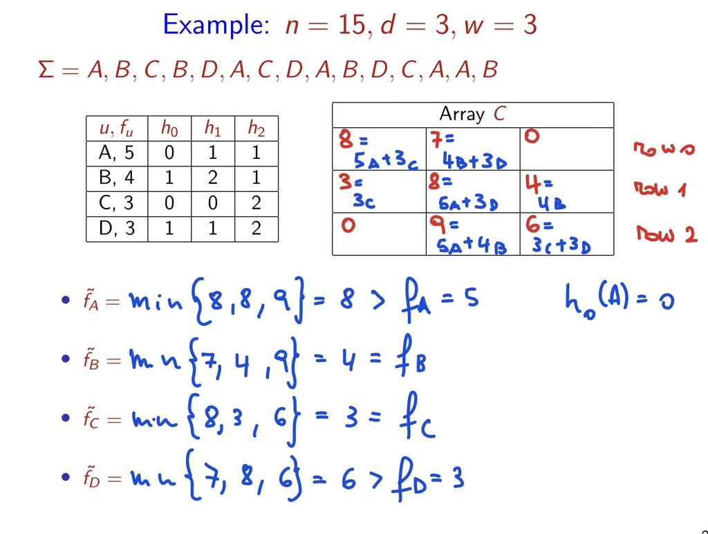

---

Count-min sketch analysis of accuracy.

[Theorem]

Consider a $dxw$ count-min sketch for a sheen $\Sigma$ of length $n$, where $d = \log_2(1/\delta)$ and $w = 2/\varepsilon$, for some $\delta, \varepsilon \in (0, 1)$. The sketch ensures that for any given $u \in U$ occurring in $\Sigma$

$$\tilde{f}_0 - f_0 \leq \varepsilon \cdot n$$

with prob $> 1-\delta$

Proof

Fix an arbitrary item $u \in \Sigma$.

Vow $j$ ($0 \leq j \leq d$) the error in the estimate of $f_0$ provided by row $j$ is $C[j, h_j(u)] - f_0$. Note that $C[j, h_j(u)]$ receives "in expectation" a fraction $w$ of the entire $n$ ($= \text{total num of elements in } \Sigma$).

$$E[C[j, h_j(u)] - f_0] = \ldots = \frac{n}{w} = \frac{n \cdot \varepsilon}{2}$$

We are intercited in $Pr(C[j, h_j(u)] - f_0 > \varepsilon n)$

By Markov's inequality

$$Pr(C[j, h_j(u)] - f_0 > \varepsilon n) = Pr(C[j, h_j(u)] - f_0 > \frac{2 \varepsilon n}{2} \leq \frac{1}{2}$$

Then:

$$Pr[\tilde{f}_0 - f_0 > \varepsilon n] = Pr(\forall 0 \leq j < d \ C[j, h_j(u)] - f_0 > \varepsilon n) = \ldots \leq \left(\frac{1}{2}\right)^{\phi}$$

Since $d = \log_2(1/\delta)$ ($\frac{1}{2})^{\phi} = \delta$

Therefore, $Pr(\tilde{f}_0 - f_0 \leq \varepsilon n) > 1-\delta$
$$\tilde{f}_0 - f_0 \leq \varepsilon \cdot n$$

with prob $> 1-\delta$$

---

# COUNT-SKETCH

- unbiased variant of count-min sketch
- $\forall u \in U$ multiply its contributions to each row by a value $\{-x_i + u\}$ randomly selected, so to cancel out collisions

**Ingredients:**

- $d \times w$ array $C$ of counters ($O(\log n)$ bits each)
- $d$ hash functions: $h_0, h_1, \ldots, h_{d-1}$ with
  $$h_j : U \rightarrow \{0, 1, \ldots, w - 1\} \quad V_j$$
- $d$ hash functions: $g_0, g_1, \ldots, g_{d-1}$ with
  $$g_j : U \rightarrow \{-x_i + u\} \quad V_j$$

```python
update(x, delta):
    for each row j:
        C[j,h_j(x)] += delta*g_j(x)

row_query(u,j):
    return g_j(u)*C[j,h_j(u)]

query(u):
    return median_j row_query(u,j)
```

**Count sketch analysis of accuracy**

**Theorem**

Consider a $d \times w$ count-min sketch for a stream $\Sigma$ of length $n$, where $d = \log_2(1/\delta)$ and $w = 2/\epsilon$, for some $\delta, \epsilon \in (0, 1)$. The sketch ensures that for any given $u \in U$ occurring in $\Sigma$

$$\tilde{f}_u - f_u \leq \epsilon \cdot n,$$

with probability $\geq 1 - \delta$.

**Proof**

Fix $u \in U$ and $j \in [0, d-1]$ arbitrarily. We now show that

$$E[\tilde{f}_u_j] = g_u.$$

Recall that $\tilde{f}_u_j = g_j(u) \cdot C[j, h_j(u)]$.

For every $a \in U$ and $a \neq u$ we define a random ver $Y_a$ which

---

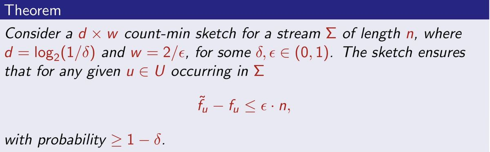

---

represents the contribution of $a$ to $\tilde{f}_{u,j}$.

$$Y_a = \begin{cases} 
f_a & \text{if } h_{j,i}(a) = h_{j,i}(u) \text{ AND } g_{j,i}(a) = g_{j,i}(u) \\
-f_a & \text{if } h_{j,i}(a) = h_{j,i}(u) \text{ AND } g_{j,i}(a) = -g_{j,i}(u) \\
0 & \text{otherwise}
\end{cases}$$

It is easy to see that $f_{u,j} = f_u + \sum_{a \in U} Y_2$

Now observe that

$$\begin{align*}
*Pr(Y_a = f_a) &= \frac{1}{w} \cdot \frac{1}{2} \\
*Pr(Y_a = -f_a) &= \frac{1}{w} \cdot \frac{1}{2} \\
*Pr(Y_a = 0) &= 1 - 1/w
\end{align*}$$

their sum is $1/w$

We have:

$$E[\tilde{f}_{u,j}] = E[f_u] + \sum_{a \in U} Y_a = f_u + E[\sum_{a \in U} f_u] = f_u + \sum_{a \in U} E[Y_a]$$

And $E[Y_a] = \ldots = 0 \implies E[\tilde{f}_{u,j}] = f_u + \sum_{a \in U} f_u$$

Accuracy of $F_2$

Given $d \times w$ count sketch for $\Sigma$, define

$$\tilde{F}_{2,j} = \sum_{k=0}^{w-1} (C[j,k])^2 \text{ for } 0 \leq j \leq d$$

we can derive the following estimate for the true second moment $F_2$.

$$F_2 = \text{median of the } \tilde{F}_{2,j} \text{'s}$$

Theorem

Consider a $d \times w$ count sketch for a stream $\Sigma$ of length $n$, where $d = \log_2(1/\delta)$ and $w = O(1/\epsilon^2)$, for some $\delta, \epsilon \in (0, 1)$. The sketch ensures that for any given $u \in U$ occurring in $\Sigma$:

1. $E[\tilde{f}_{u,j}] = f_u$, for any $j \in [0, d-1]$, i.e., $\tilde{f}_{u,j}$ is an unbiased estimator of $f_u$;
2. With probability $\geq 1 - \delta$,
$$|\tilde{f}_u - f_u| \leq \epsilon \cdot \sqrt{F_2};$$
where $F_2 = \sum_{u \in U}(f_u)^2$ (true second moment).

---

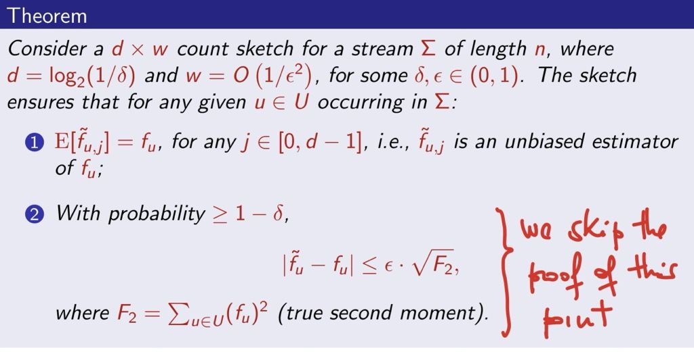

---

# Proof of point $\textcircled{4}$

## BLOOM FILTERS

A bloom filter represents a set $S$ of $m$ elements with an $n$-bit array $A$, initialized to zero, and $K$ independent hashes $h_j: U \rightarrow \{0, \dots, n-1\}$

```python
insert(x): set A[h_j(x)] = 1 for every j
query(x): return PRESENT iff every A[h_j(x)] equals 1
```

## Theorem

Suppose that $n$ is sufficiently large. For any given $x_i$ which does not belong to $S$, the probability that $x_i$ is erroneously claimed to be in $S$ is

$$\Pr(A[h_j(x_i)] = 1 \text{ for each } 0 \leq j < k) \simeq (1 - e^{-km/n})^k$$

This probability is referred to as false positive rate.

## Proof

Assuming that the $h_j$'s are independent and uniform in $[0, n-1]$, after the initialization of $A$ the indexes of $A$ which are set to $i$ can be seen as $k$ independent random variables in $[0, n-1]$. With this observation we can now compute the prob. that $A[l] = 0$, for any $l \in [0, n-1]$

---

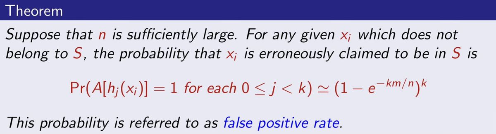

---

$$\Pr[A[l] = 0] = \ldots = \left( \left( 1 - \frac{1}{n} \right) \right)^{\frac{km}{n}} \approx e^{-km/n}$$

Define $p = e^{-km/n}$. We make the simplifying assumption that $A$ contains exactly $p$ in $O'$'s.

Consider an element $x \in E$ s.t. $x \notin S$.

Let $l_j = b_j(x)$ $0 \leq j < k$

Since $l_j$ is uniformly distributed in $[0, n-1]$ we have that:

$$\Pr(A[l_j] = x) = 1 - \frac{pn}{n} = 1 - p$$

There fore

$$\Pr(A[l_0] = A[l_x] = \ldots = A[l_n] = x) = (1 - p)^k$$

$$= (1 - e^{-km/n})^k$$

**Hash functions**

$\Rightarrow$ fundamental ingredients of many data processing tools

A hash function $h$ usually maps the elements of a universe $U$ into hash values represented by the integers in the range $[m] = \{0, 1, \ldots, m-1\}$, for some $1 \leq m \leq |U|$

$\Rightarrow$ normally, consider a **TRULY RANDOM HASH** $\Rightarrow$ regarded as a random variable with uniform distribution over $[m] \times [m]$ (101 times)

$\Rightarrow$ we need hash functions which provide sufficient randomness for the application of interest and are efficient in terms of

• Space: num of bits required by vappr.
• Speed: time to compute hash values.

---

# Definition: k-universality

A family $\mathcal{H}$ of hash functions from $U$ to $[m]$ is said to be $k$-universal if for any $k$ distinct elements $x_1, x_2, \ldots, x_k$ from $U$, we have that for a hash function $h$ extracted from $\mathcal{H}$ uniformly at random

$$\Pr(h(x_1) = h(x_2) = \cdots = h(x_k)) \leq \frac{1}{m^{k-1}}.$$

Moreover, $\mathcal{H}$ is said to be strongly $k$-universal if for any $k$ distinct elements $x_1, x_2, \ldots, x_k$ of $U$, and any $k$ values $y_1, y_2, \ldots, y_k$ from $[m]$, we have that for a hash function $h$ extracted from $\mathcal{H}$ uniformly at random

$$\Pr((h(x_1) = y_1) \land (h(x_2) = y_2) \land \cdots \land (h(x_k) = y_k)) = \frac{1}{m^k}$$

| Need | Method | Central guarantee | Main limitation |
| :--- | :--- | :--- | :--- |
| Majority candidate | Boyer-Moore | Finds majority if one exists | Needs verification to reject false candidate |
| Uniform sample | Reservoir | Every record has inclusion probability $m/t$ | Does not directly ensure all frequent values |
| Approximate frequent-item set | Sticky Sampling | AFI correct with probability $1 - \delta$ | Expected dictionary size; known-$n$ version |
| Distinct-count order of magnitude | Probabilistic Counting | Constant-factor probability bound | One copy is noisy |
| Nonnegative point frequency | Count-Min | One-sided additive error | Biased upward; cannot enumerate keys alone |
| Signed/weighed point frequency | Count Sketch | Unbiased rows; two-sided error | Wider than Count-Min for stated error |
| Second moment | Squared Count-Sketch buckets | Unbiased rows | Use corrected relative error $eF_2$ |
| Approximate membership | Bloom filter | No false negatives; controlled FP | Cannot list set; ordinary deletion unsafe |

---

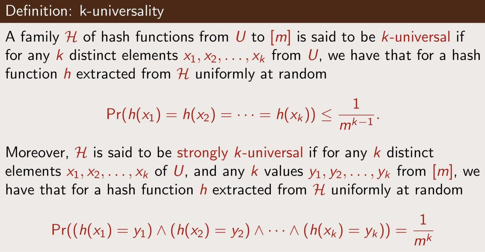

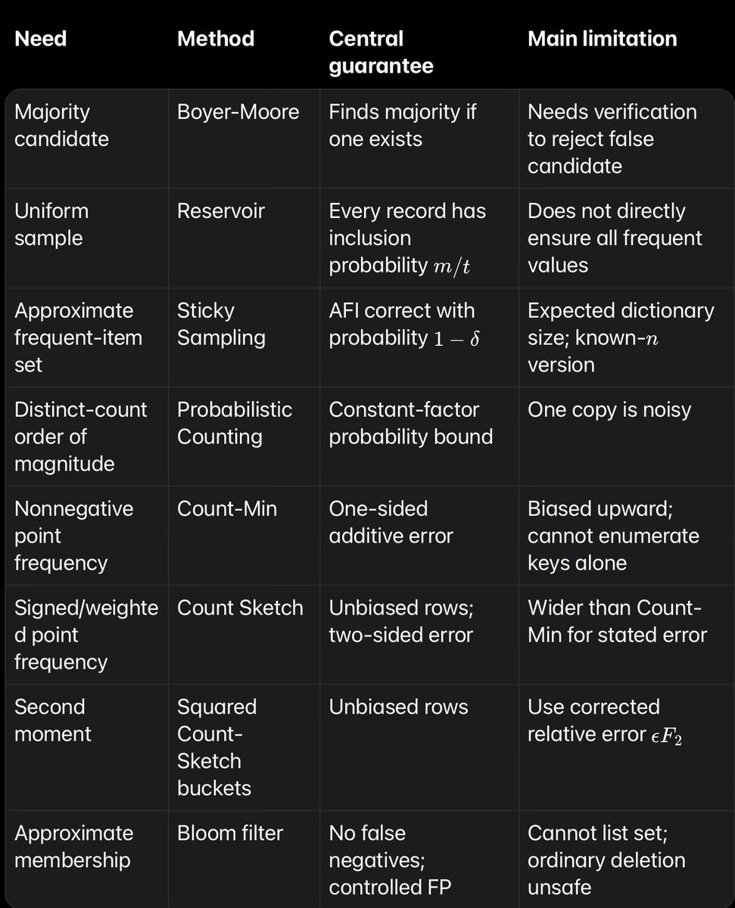

---

# SIMILARITY SEARCH

## INTRODUCTION:

Searching near POIs

- **DATA**: Points of interest (POIs) in a map, a distance function, threshold $r$
- **GOAL**: find POIs near my current position (distance $\leq r$)

In general, given a set of objects, find items that are similar (or near);

A distance function is required to evaluate the similarity of two objects $\Rightarrow$ Similar/near if distance $<$ certain threshold

**Problem definitions - Keep quantifiers exact**

Let $P$ contain $n$ points in metric space $(M,d)$ and define the ball of radius $q$ as

$$B_r(q) = \{ p \in M : d(p,q) \leq r \}$$

**r-Near Neighbor Search (r-NNS):** preprocess $P$. Given a query $q$ and radius $r$, return any $p \in PnB_r(q)$ if the set is nonempty. Return null otherwise.

**Example of r-NNS ($M = \mathbb{R}^2, d = \| \cdot \|$)**

---

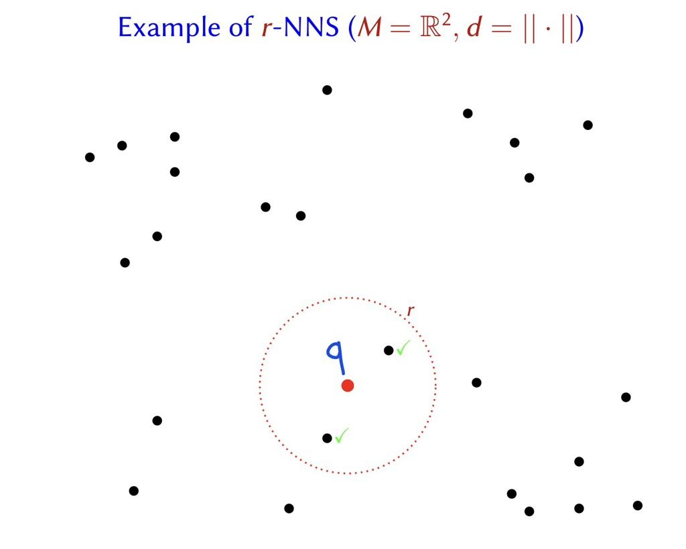

---

Nearest Neighbor Search: given $q$, return a point minimizing $d(p, q)$ over $p \in PnB_r(q)$. It has no radius parameter

Range Reporting: for $P \in IR^0$, given an axis-aligned angle
$R = [a_1, b_1] \times \dots \times [a_0, b_0]$
return all points in $PnR$. RR asks for all points in a rectangle, while $r$-NNS asks for one point in a metric ball

Range Reporting in $\mathbb{R}^2$

Range Reporting vs $r$-NNS

RR
Query $\equiv$ Rectangle $R$
$R = \textcircled{1}$
Task: return all points in $RNP$

$r$-NNS
Query $\equiv$ point $q$, distance $r$
Task: return an arbitrary point in $B_r(q) \cap P$, if any

$(c, r)$-Approximate Near Neighbor Search (ANNS), $c > 1$. Preprocess $P$ sts.
• If $PnB_r(q) \neq \emptyset$, return some $p \in P$ with $d(p, q) \leq cr$;
• If $PnB_r(q) = \emptyset$, either return null or a point within distance $cr$.

The data structure must never return a point farther than $cr$; verify candidates by actual distance.

Brute Face stures $P$ and scans it. In $IR^0$, space is $O(Dn)$ and query time $O(Dn)$. Construction is $OCn$

Kd-tree

A two-dimensional Kd-tree is a balanced binary space-partition tree. Let $P$ be a set of $n$ points in $IR^2$ and let $R(P) \subset IR^2$ be a rectangular region containing all points in $P$.

The Kd-tree defines hierarchical decomposition of $R(P)$ into nested rectangles than subregions:

---

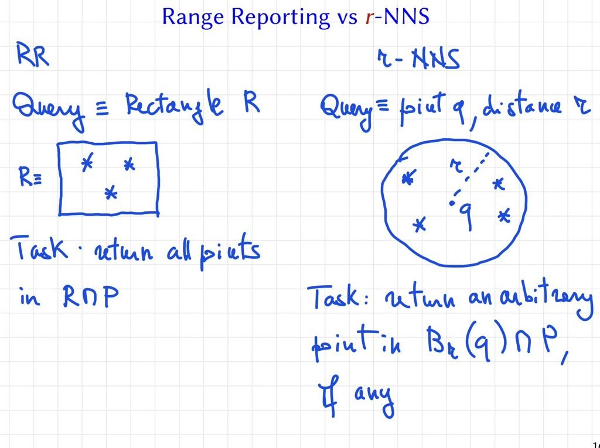

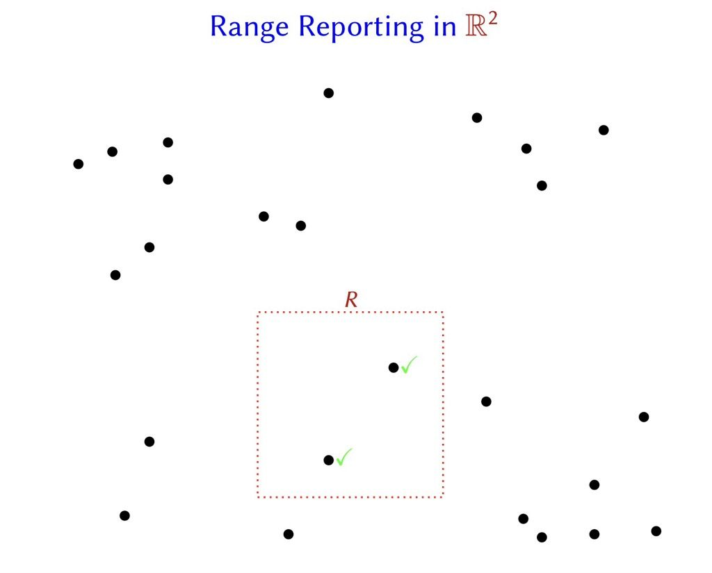

---

each internal node $v$ is associated to a rectangular region denoted as region($v$), and represents the sub-surface of points $P_v = P$

each external node (leaf) $v$ is associated to a region containing a single point, which we denote as $P_v \in P$

= if $v$ is at even depth, split by a vertical line
= if " " " odd " " " " horizontal " " " " " " " " " " " " " " " " " " " " " " " " " " " " " " "

---

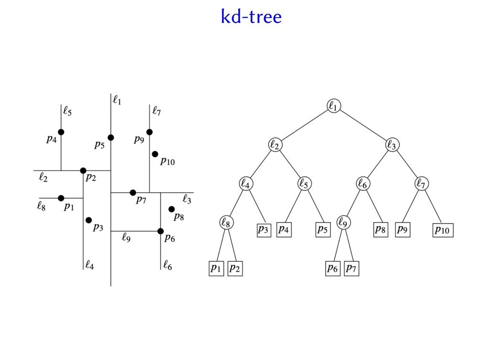

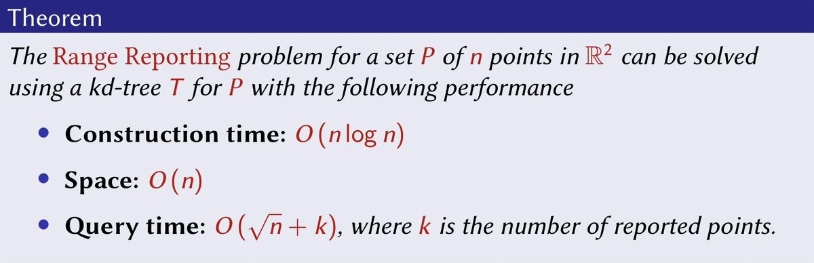

---

$Q_1(R) = \{ v \in T : region(v) \cap R \neq \emptyset \text{ and region}(v) \subseteq R \}$
$Q_2(R) = \{ v \in T : region(v) \cap R \neq \emptyset \text{ and region}(v) \subseteq R \}$

Each call of SearchKdTree executes $O(1)$ operations, so the winning time (i.e. query time) is $O(1 + |Q_1(R)| + |Q_2(R)|)$.

Finally, it can be shown that
• $|Q_1(R)| = O(\sqrt{n})$
• $|Q_2(R)| = O(k)$

= the winning time of SearchKdTree is $O(\sqrt{n} + k)$

(c,r)-ANNS: example with near/no near points

(c,r)-ANNS: example with near points

legal outputs:
any of the 4 points
$A, B, C, D$

legal outputs:
$A, B, \text{null}$

example with only far points

(c,r)-ANNS: example with only far points

legal outputs:
null

---

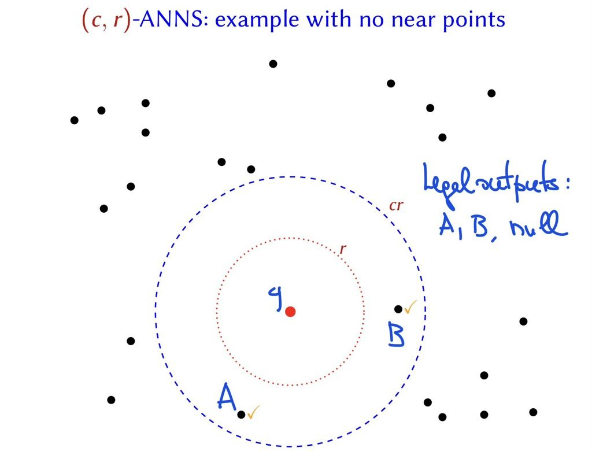

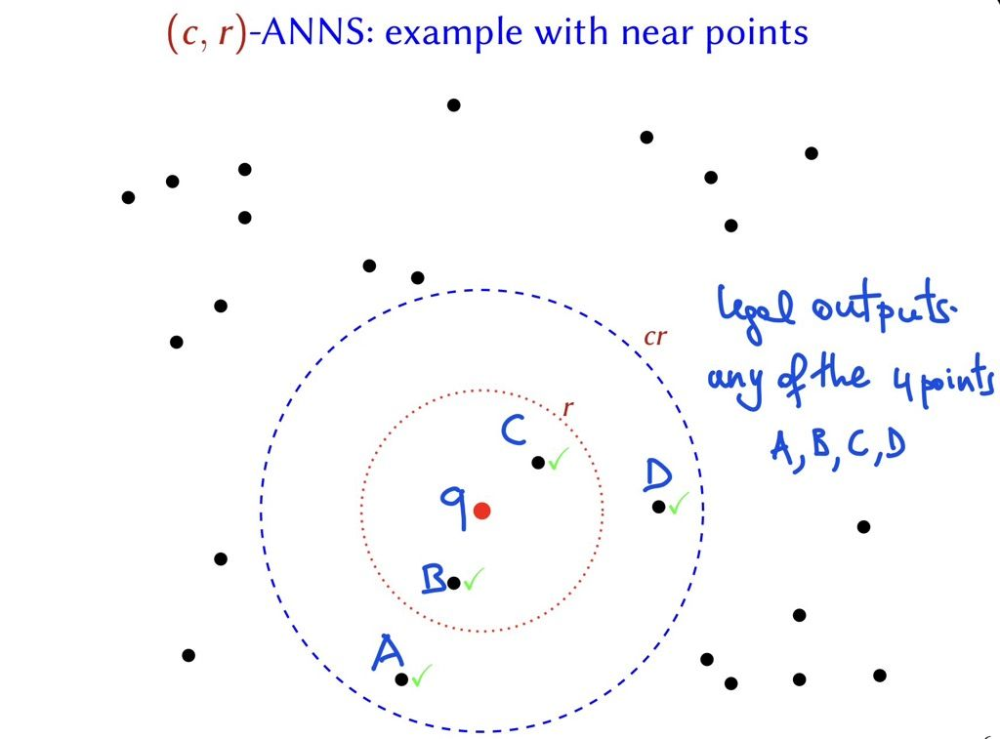

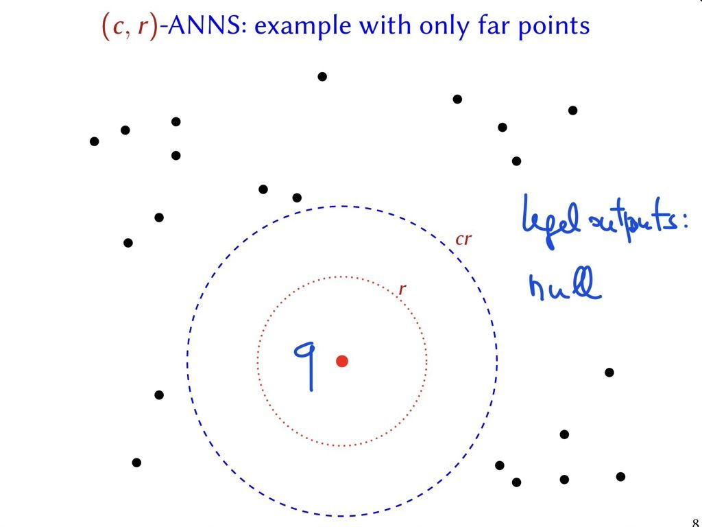

---

Locality-sensitive Hashing
Widely used technique for high-dimensional near-neighbor search in several applications:

- The entire space is partitioned into regions through a hash function $h$ randomly extracted from a suitable family $h$.

- With partitioning:

  (1) Two near points are likely to be mapped by $h$ to the same region

  (2) Two far points are likely to be mapped by $h$ to different regions

- Neighbors of the query point $q$ are searched for in the region identified by $h(q)$

Def a random family $H$ is $(c, r, p_1, p_2)$ - locality sensitive when $p_1 > p_2$, $(p_1, p_2 \in [a, b])$, $c > 1$, $r > 0$ and

$$d(p, q) \leq r \Rightarrow \Pr[h(p) = h(q)] > p_1$$

$$d(p, q) > cr \Rightarrow \Pr[h(p) = h(q)] \leq p_2$$

The family says nothing about the grey zone $(r, cr)$. Hash collisions are candidates, not proof of proximity.

LSH for $(c, r)$-ANNs

Steps:

Construction of the data structure

- Select random $h$ from $H$
- Insert all points of $P$ into a hash table $T$ using function $h$. Let $T[j]$ be the (potentially empty) bucket combining all points in $P$ with hash value $j$

---

# Query

For a given query $q$, scan $T[h(q)]$ until a point $p$ with $d(p, q)$ is found it. If there is no such point, return null.

Assumption: $T[h(q)]$ is implemented as lists.

# Performance

Assume that $(M, d)$ is a space with dimensionality $D$. For some large $D$, and:

- each point of $M$ requires $O(D)$ words to be stored
- high values and distances can be computed in $O(D)$ words to be stored
- ... $O(D)$ times

# Theorem

Let $P$ be a set of $n$ points in a $D$-dimensional metric space $(M, d)$, and let $\mathcal{H}$ be a $(c, r, p_1, p_2)$-locality sensitive family of hash functions. Using $\mathcal{H}$ and the above approach to $(c, r)$-ANNS, a query $q$ is answered successfully with probability $\ge p_1$. Moreover the following performance is obtained:

- **Construction time:** $O(Dn)$
- **Space:** $O(Dn)$
- **Query time:** $O(Dnp_2)$ in expectation.

# Proof

- **Conectness**

CASE 1: $B_r(q) \cap P \neq \emptyset$. Any $p' \in P$ with $d(p', q)$ is a legal output. Consider an arbitrary point $p \in B_r(q) \cap P$ (one must exist), and let $h \in M$ be the entrained hash function.

$$Pr(\text{answer is correct}) = Pr(\text{answer} \neq \text{null}) \Rightarrow Pr(h(p) = h(q)) \Rightarrow p_1$$

since $M$ is $(c, r, p_1, p_2)$-locality sensitive

CASE 2: $B_r(q) \cap P = \emptyset$ in this case, every answer is correct

**Construction and Space** $\Rightarrow$ Straightforward
- Construction time: $O(Dn)$
- Space: $O(Dn)$
- Query time: $O(Dnp_2)$ in expectation.

---

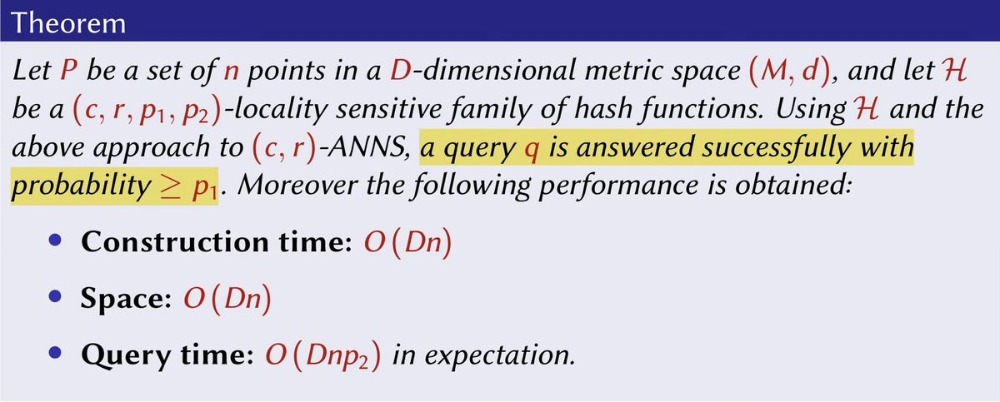

---

Query line: Scan of list $T[h(q)]$ is stopped as seen as a point $p$ with $d(p, q) < cr$ is found or the end of the list is reached.

This implies that the query time is $O(D \cdot x)$ where $x$ is the number of points $p \in P$ s.t. $d(p, q) > cr$ and $h(p) = h(q)$. Clearly $x$ is a r.v. with $E[x] \leq np_2 \Rightarrow \Pr(h(p) = h(q)) \leq p_2 \Rightarrow$ expected query time is $O(D \cdot n \cdot p_2)$.

BIT-SAMPLING FOR HAMMING DISTANCE

For $x \in \{0, 1\}^D$, choose a uniformly and let $h_i(x) = x_i$.

Two vectors differ in exactly $d_H(p, q)$ coordinates, so:

$$\Pr(h_i(p) = h_i(q)) = 1 - \frac{d_H(p, q)}{D}$$

Therefore bit sampling is $(c, r, 1 - \frac{k}{D}, 1 - \frac{qr}{D})$-sensitive.

For any two points $p, q$ we have that:

• If $d_H(p, q) \leq r$, then

$$\Pr_{h \in \mathcal{H}_H}[h(p) = h(q)] = 1 - \frac{d_H(p, q)}{D} \geq 1 - \frac{r}{D} \stackrel{\text{def}}{=} p_1$$

• If $d_H(p, q) > cr$, then

$$\Pr_{h \in \mathcal{H}_H}[h(p) = h(q)] = 1 - \frac{d_H(p, q)}{D} < 1 - \frac{cr}{D} \stackrel{\text{def}}{=} p_2$$

The LSH exponent is:

$$p = \frac{\log_2 p_1}{\log_2 p_2} = \frac{\log(1/p_1)}{\log_2(1/p_2)} \in \{0, 1\}$$

$$= \Delta$$ measures the quality of such family $H$

For bit sampling

$$\frac{r/D}{cr/D} = \frac{1}{c}$$
$$\Pr(h(p) = h(q)) = 1 - \frac{d_H(p, q)}{D}$$

---

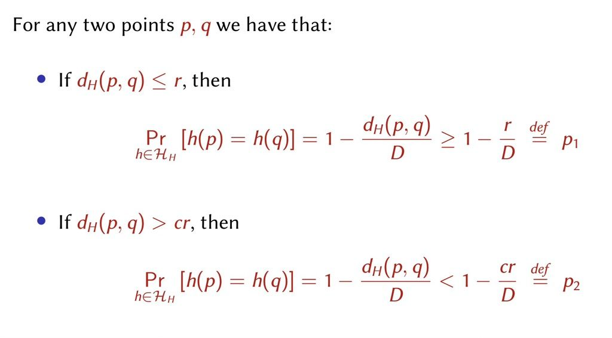

---

Theorem

Let $P$ be a set of $n$ points in a metric space $(M, d)$, and let $\mathcal{H}$ be a $(c, r, p_1, p_2, \cdot)$-locality sensitive family of hash functions. Fix

$$k = \log_{1/p_2} n \quad \text{and}$$
$$\ell = 2p_1^{-k} = 2n^\rho,$$

where $\rho = \log_2 p_1 / \log_2 p_2$. Using the above approach to $(c, r)$-ANNS, a query is answered successfully with probability $\geq 1/2$. Moreover the following performance is obtained:

- **Construction time:** $O\left(Dn^{1+\rho} \log_{1/p_2} n\right)$
- **Space:** $O\left(Dn + n^{1+\rho} \log_{1/p_2} n\right)$
- **Query time:** $O\left(Dn^\rho \log_{1/p_2} n\right)$ in expectation.

---

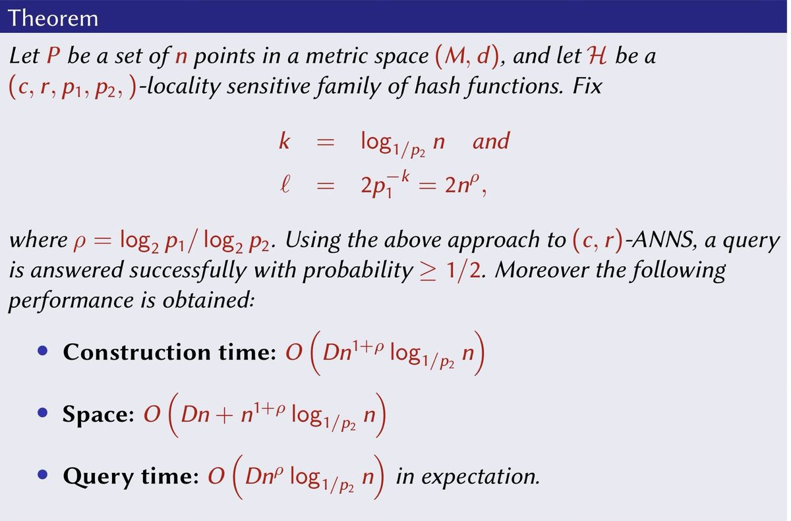
