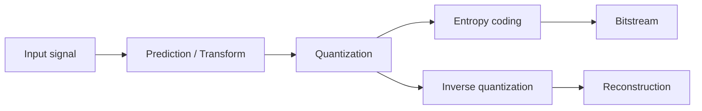

# Summarize Multimedia Notes

## Overview

Create a compact but complete study summary from one Multimedia Communications Markdown source file. The output must help answer open-ended theory exam questions in English.

This skill summarizes; it is not a full rewrite. Preserve conceptual coverage, formulas, definitions, diagrams, examples, and exam-relevant reasoning, but remove duplicated PDF/OCR noise and excessive prose.

## Command

Accept requests such as:

```text
Use $summarize-multimedia-notes on ToSummarize/4. Transform coding(1)/4. Transform coding.md
```

Save output to:

```text
Summaries/<source-base-filename>.md
```

Place copied or generated image assets under:

```text
Summaries/Pics/<source-base-filename>/
```

If the user specifies another output filename, follow it and use the matching image subfolder.

## Workflow

1. Read the entire source Markdown before writing.
2. Inspect nearby images and course visual folders:
   - source sibling folders such as `images/`
   - `Pics/<Topic>/`
   - `Pics/Block Scheme/`
   - `Latex/Block Scheme/<Topic>/`
3. Identify exam-relevant material:
   - definitions and assumptions
   - core models, algorithms, and pipelines
   - theorems, properties, and proofs or proof ideas
   - formulas, variables, units, and interpretations
   - examples, exercises, and numerical results
   - standards, codec tools, tradeoffs, and limitations
   - figures, plots, matrices, transform bases, timelines, and block schemes
4. Write `Summaries/<filename>.md` in English.
5. Copy useful source images into `Summaries/Pics/<filename>/` and update embeds.
6. Add Mermaid block schemes when a pipeline or architecture is important and no suitable image exists.
7. Validate the summary by checking output path, image paths, headings, formulas, and visual references.

## Summary Standard

Write for theory exam preparation:

- Be clear and concise, but do not skip important concepts.
- Prefer synthesis over transcription: group related ideas and remove repetition.
- Keep technical terminology precise: DCT, DFT, DPCM, PCM, VLC, Huffman, arithmetic coding, JPEG, MPEG, HEVC, VVC, PSNR, SSIM, MSE, RD, GOP, motion vector, transform coefficient.
- Explain why each formula or theorem matters for compression, distortion, rate, perception, or implementation.
- Include short worked examples when the source has them or when they clarify a formula.
- Include block schemes for encoder/decoder pipelines, prediction loops, transform coding, entropy coding, adaptive streaming, audio/video coding, or quality-assessment chains.
- Avoid long prose paragraphs. Use focused paragraphs, bullets, tables, and callouts.

## Markdown Format

Use this structure unless the topic requires small adjustments:

```markdown
# <Topic Title>

## Table of Contents

- [[#Core Idea|Core Idea]]
- [[#Key Concepts|Key Concepts]]
- [[#Theory and Formulas|Theory and Formulas]]
- [[#Visual Schemes|Visual Schemes]]
- [[#Examples|Examples]]

## Core Idea

## Key Concepts

## Theory and Formulas

## Visual Schemes

## Examples

```

Formatting rules:

- Use `#` for title, `##` for major sections, `###` for subsections.
- Use **bold** for key terms, definitions, theorem names, and final takeaways.
- Use *italics* for method names, acronym expansions, and emphasis.
- Use `$...$` for inline math and `$$...$$` for display math.
- Use `-` bullets and `1.` ordered steps.
- Use Markdown tables for comparisons, codec features, tradeoffs, and parameter lists.
- Use fenced `mermaid` blocks for block schemes when appropriate.

## Callouts

Use `[!Important]` for definitions, theorems, key properties, and formulas:

```markdown
> [!Important] Rate-distortion tradeoff
> **Statement:** ...
>
> $$
> D = f(R)
> $$
>
> **Meaning:** ...
```

Use `[!Example]` for compact examples:

```markdown
> [!Example] Quantization effect
> **Setup:** ...
> **Result:** ...
> **Takeaway:** ...
```

Use `[!Note]` sparingly for exam warnings, assumptions, or common confusions.

## Image Handling

Prefer real course images over placeholders.

1. Reuse existing image references from the source when valid.
2. Copy selected images into `Summaries/Pics/<summary-name>/`.
3. Rename copied images with stable, descriptive lowercase names, such as `dct-basis.png` or `predictive-coding-loop.png`.
4. Embed images from the summary with Obsidian syntax:

```markdown
![[Pics/<summary-name>/<image-name>.png|500]]
```

5. Add a one-sentence caption below each image explaining its exam relevance.
6. If a source references a missing figure, search related course folders. If no asset exists, insert a clear placeholder and, when useful, add a Mermaid block scheme:

```markdown
> [!Note] Missing visual
> Source references a figure about <concept>, but no image file was found.
```

## Block Schemes

Add block schemes for important processing chains. Keep labels short and technical.

Example:



For feedback-loop codecs, show reconstruction paths, prediction references, motion estimation/compensation, rate control, and entropy coding where relevant.

## Validation

Before finishing:

1. Confirm the summary exists under `Summaries/`.
2. Confirm all embedded images point under `Summaries/Pics/<summary-name>/`.
3. Confirm important formulas from the source are present and syntactically valid.
4. Confirm at least one visual aid exists when the topic has pipelines, diagrams, matrices, plots, or examples.
5. Confirm prose is English and concise enough for study, but not missing major concepts.
