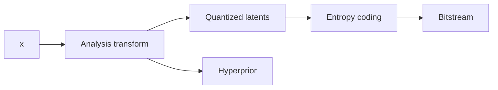
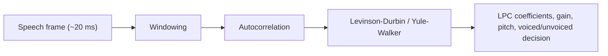

# Multimedia Communications - Alberto Answers (corrected)

## Table of Contents

- [[#Multimedia Representation and Perception|Multimedia Representation and Perception]]
- [[#Compression, Prediction and Lossless Coding|Compression, Prediction and Lossless Coding]]
- [[#Transform Coding and JPEG|Transform Coding and JPEG]]
- [[#Wavelet-Based Image Coding|Wavelet-Based Image Coding]]
- [[#Learned Image Coding|Learned Image Coding]]
- [[#Audio and Speech Coding|Audio and Speech Coding]]
- [[#Quality Evaluation and Quantization|Quality Evaluation and Quantization]]
- [[#Adaptive Streaming|Adaptive Streaming]]
- [[#Motion Estimation and Video Coding|Motion Estimation and Video Coding]]
- [[#Modern Video Coding|Modern Video Coding]]

---

## Multimedia Representation and Perception

> [!question] Domanda 1
> Explain the Contrast Sensitivity Function (CSF): what it is, in which units spatial frequency is measured, where it peaks, and the direct implication for quantization in compression.

The Contrast Sensitivity Function describes how sensitive the human visual system is to luminance contrast as spatial frequency changes. Spatial frequency is measured in cycles per degree of visual angle.

Sensitivity is high at intermediate frequencies and lower at very low and very high frequencies. The usual qualitative curve is band-pass: the eye is less sensitive to very fine high-frequency texture and to very slow luminance variations.

For compression, this justifies frequency-dependent quantization: coefficients corresponding to less visible spatial frequencies can be quantized more coarsely, while visually important frequencies should receive smaller quantization steps.

> [!question] Domanda 2
> Compare cones and rods (number, function, lighting conditions) and explain why the RGB-to-Y conversion weights the green component the most.

Rods are very sensitive to light intensity and dominate vision in low-light conditions, but they do not provide color perception. Cones work in brighter conditions and provide color perception. The three cone classes are sensitive mainly to short, medium and long wavelengths.

The luminance component is a weighted sum of RGB, for example in BT.601:

$$
Y \approx 0.299R + 0.587G + 0.114B
$$

Green receives the largest weight because the human visual system is most sensitive to luminance variations in the green/yellow part of the spectrum. Therefore, preserving green contributes more to perceived brightness detail than preserving blue with the same weight.

> [!question] Domanda 3
> Explain the J:a:b chroma subsampling notation. Compute the data-reduction factor of 4:2:0 vs full RGB and justify why it is perceptually acceptable.

The notation $J:a:b$ describes how many chroma samples are kept relative to $J$ luma samples across two image rows. $J$ is the horizontal luma reference, $a$ is the number of chroma samples in the first row, and $b$ is the number of chroma samples in the second row.

For 4:2:0, luma $Y$ is kept at full resolution, while $Cb$ and $Cr$ are sampled at half horizontal and half vertical resolution. Over a $2\times 2$ block:

- full RGB has $4\times3=12$ component samples;
- YCbCr 4:2:0 has $4Y+1Cb+1Cr=6$ component samples.

So, with the same bit depth, 4:2:0 uses about half the component samples of full RGB. This is perceptually acceptable because the eye is much more sensitive to luminance detail than to chrominance detail.

> [!question] Domanda 4
> Draw the Basic Tools for Compression scheme (Transform -> Prediction -> Quantization -> Entropy Coding) and indicate which stage is the only lossy one and why.

A generic compression chain combines decorrelation, approximation and lossless coding:

![[Pasted image 20260624205627.png]]

> [!draw] Practice Drawing: Basic Tools for Compression

Prediction and transform reduce redundancy or concentrate energy. Entropy coding is lossless: it only assigns shorter codes to more probable symbols.

Quantization is the only lossy step because many input values are mapped to the same reconstruction value. This reduces rate, but the original value cannot be recovered exactly.

---

## Compression, Prediction and Lossless Coding

> [!question] Domanda 5
> Principles of image compression. Discuss the criteria for evaluating a compression algorithm: rate, quality, [Bonus: robustness, delay, complexity].

Compression reduces the number of bits needed to represent multimedia data by exploiting:

- **Statistical redundancy:** neighboring samples, blocks or frames are correlated.
- **Spatial / temporal redundancy:** images and videos contain repeated structures across space and time.
- **Psychovisual redundancy:** distortions not perceived by the human visual system can be coarsely quantized.

Compression can be:

- **Lossless:** perfect reconstruction, bit-exact output, lower compression ratio.
- **Lossy:** decoded signal differs from the original but is perceptually close, higher compression ratio.

Rate measures coded size:

$$
R_{\text{image}} = \frac{B_{\text{out}}}{NM} \quad [\text{bpp}]
$$

$$
R_{\text{stream}} = \frac{B_{\text{out}}}{T} \quad [\text{bit/s}]
$$

Compression ratio is:

$$
\text{CR} = \frac{B_{\text{in}}}{B_{\text{out}}}
$$

Quality is usually evaluated by distortion measures:

$$
D(f,\hat{f}) = \frac{1}{NM}\|f-\hat{f}\|^2
$$

$$
\text{PSNR}(f,\hat{f}) = 10\log_{10}\left(\frac{V^2}{D(f,\hat{f})}\right)
$$

For perceptual weighting:

$$
D_W(f,\hat{f}) = \frac{1}{NM}\|h \star (f-\hat{f})\|^2
$$

$$
\text{WPSNR}(f,\hat{f}) = 10\log_{10}\left(\frac{V^2}{D_W(f,\hat{f})}\right)
$$

Other objective metrics are **SSIM** and **LPIPS**. The main design tensions are: higher quality usually requires higher rate; robustness, lower delay and lower complexity are often in conflict.

> [!question] Domanda 6
> A zero-mean Gaussian random signal has an autocorrelation function:
>
> $$
> r_X(n-m)=E[X(n)X(m)] = \sigma^2\rho^{|n-m|}
> $$
>
> - Consider the predictor $V(n)=X(n-1)$. For which values is the prediction gain positive?
> - Optimal linear predictor is $V(n)=-\sum_{i=1}^{P} a_i x_{n-i}$, with $a=-R_X^{-1}r$, $R_X(i,j)=r_X(i-j)$, $r=[r_X(1)\cdots r_X(P)]^T$. Find optimal linear predictor of order $P=1$ and compute prediction gain, compare then with previous case.
> - Compute the optimal predictor of order 2. Compare with the previous cases.

Let:

$$
r_X(n-m)=\mathbb{E}[X(n)X(m)] = \sigma^2\rho^{|n-m|}
$$

For the predictor $V(n)=X(n-1)$:

$$
\sigma_y^2 = \mathbb{E}[(X(n)-X(n-1))^2] = 2\sigma^2(1-\rho)
$$

$$
G_P = 10\log_{10}\left(\frac{\sigma^2}{\sigma_y^2}\right)
=10\log_{10}\left(\frac{1}{2(1-\rho)}\right)
$$

The gain is positive iff:

$$
\rho > \frac{1}{2}
$$

For the optimal linear predictor:

$$
V(n) = -\sum_{i=1}^{P} a_i x(n-i)
$$

with:

$$
\vec{a}^{\,opt} = -R_X^{-1}\vec{r}
$$

For $P=1$:

$$
a_1^{opt}=-\rho \quad \Rightarrow \quad V(n)=\rho X(n-1)
$$

$$
\sigma_y^2=\sigma^2(1-\rho^2)
$$

$$
G_P = 10\log_{10}\left(\frac{1}{1-\rho^2}\right)
$$

For $P=2$, the autocorrelation matrix is:

$$
R_X = \sigma^2
\begin{bmatrix}
1 & \rho \\
\rho & 1
\end{bmatrix},
\quad
\vec{r} = \sigma^2
\begin{bmatrix}
\rho \\
\rho^2
\end{bmatrix}
$$

and:

$$
\vec{a}^{\,opt} =
\begin{bmatrix}
-\rho \\
0
\end{bmatrix}
$$

Thus the second tap gives no extra gain for an AR(1) source.

> [!question] Domanda 7
> Draw and comment on the schemes of predictive quantization (encoder and decoder).

![[Block Scheme Exam/Predictive quantization - open loop.png]]

> [!draw] Practice Drawing: Open-loop Predictive Quantization

The open-loop scheme shows the basic predictive quantization idea: the predictor output $v(n)$ is subtracted from the current sample, only the residual $y(n)$ is quantized, and the prediction is added back after quantization. It is useful to understand DPCM-style coding, but it is not safe as a complete codec because the encoder and decoder may base prediction on different past samples.

Open-loop prediction is wrong because the encoder predicts from original samples while the decoder predicts from reconstructed samples. This mismatch causes **drift**.

Correct predictive quantization uses a closed reconstruction loop at the encoder:

![[Block Scheme Exam/Predictive quantization - correct closed loop.png]]

> [!draw] Practice Drawing: Closed-loop Predictive Quantization

The encoder and decoder feed the predictor with the same reconstructed samples:

$$
y(n)=x(n)-v(n)
$$

$$
\hat{x}(n)=\hat{y}(n)+v(n)
$$

The prediction is useful only if the residual variance is smaller than the original variance.

> [!question] Domanda 8
> Discuss the principles of lossless coding.

Lossless coding maps source symbols into bitstrings and reconstructs the original sequence exactly.

Alphabet and code:

$$
\mathcal{X}=\{x_1,\dots,x_M\}
$$

$$
\mathcal{C}: \mathcal{X}\rightarrow \{0,1\}^*
$$

Fixed-length coding assigns the same number of bits to every symbol:

$$
R=\lceil\log_2 M\rceil
$$

Variable-length coding assigns shorter codewords to more probable symbols. Average length is:

$$
\bar{L} = \sum_i p_i l_i
$$

Prefix codes are instantaneously decodable: no codeword is prefix of another codeword.

McMillan theorem: the best uniquely decodable code has same performance as the best prefix code, so it is enough to focus on prefix codes.

Kraft inequality:

$$
\sum_i 2^{-l_i} \le 1
\iff
\text{there exists a prefix code with lengths } \{l_i\}
$$

Entropy is the theoretical lossless lower bound:

$$
H(X)=-\sum_i p_i \log_2 p_i
$$

Shannon theorem:

$$
H(X) \le \bar{L} < H(X)+1
$$

> [!question] Domanda 9
> Consider a source that emits the symbols A, B, C, D, E, and F. The probabilities of these symbols are given in the following table:
>
> $$
> p_A=0.3,\ p_B=0.1,\ p_C=0.05,\ p_D=0.18,\ p_E=0.15,\ p_F=0.22
> $$
>
> - Describe the Huffman Algorithm.
> - Compute Huffman code for this distribution.
> - Compare the average length of the Huffman code with the distribution entropy.

Huffman coding repeatedly merges the two least probable symbols. One valid optimal code is:

| Symbol | Probability | Code | Length |
|---|---:|---:|---:|
| A | 0.30 | 10 | 2 |
| B | 0.10 | 1111 | 4 |
| C | 0.05 | 1110 | 4 |
| D | 0.18 | 00 | 2 |
| E | 0.15 | 110 | 3 |
| F | 0.22 | 01 | 2 |

Average length:

$$
\bar{L}=0.30\cdot2+0.10\cdot4+0.05\cdot4+0.18\cdot2+0.15\cdot3+0.22\cdot2 = 2.45
$$

Entropy:

$$
H(X)=-\sum_i p_i\log_2 p_i \approx 2.406 \text{ bit/symbol}
$$

The Huffman code is close to entropy:

$$
\bar{L}-H(X) \approx 0.044 \text{ bit/symbol}
$$

> [!question] Domanda 10
> Why arithmetic encoder is preferred over Huffman for high-performance lossless coding?

Huffman coding has integer-length codewords and therefore suffers from a non-dyadic probability penalty. Block Huffman can reduce this penalty, but its alphabet grows as $M^K$ for blocks of length $K$.

Arithmetic coding encodes the whole sequence as one interval in $[0,1)$ and has linear complexity in sequence length. Its rate satisfies:

$$
\mathcal{L} < H(X) + \frac{2}{n}
\xrightarrow[n\to\infty]{}
H(X)
$$

It is also well suited to adaptive and context-based probability models.

> [!question] Domanda 11
> (LLCod) Explain the difference between Fixed-Length Coding (FLC) and Variable-Length Coding (VLC), and describe why VLC is theoretically superior for non-equiprobable sources.

FLC assigns all symbols the same codeword length. It is simple and instant to parse, but inefficient for non-equiprobable sources.

VLC uses different lengths. If symbols are non-equiprobable, more probable symbols get shorter codewords and the average length decreases:

$$
\bar{L} = \sum_i p_i l_i
$$

VLC is theoretically superior when source probabilities are not uniform.

> [!question] Domanda 12
> (LLCod) Discuss the importance of the prefix condition in Variable-Length Coding and how it relates to the concept of instantaneous decodability.

The prefix condition requires that no codeword is the prefix of another. This lets the decoder identify each symbol as soon as the codeword ends, without look-ahead.

Kraft inequality gives the condition for such lengths:

$$
\sum_i 2^{-l_i}\le 1
$$

Equality means the prefix tree is complete.

> [!question] Domanda 13
> (LLCod) What are the two distinct mechanisms by which “block coding” improves the efficiency of lossless compression?

Block coding improves lossless compression in two ways:

1. For sources with memory, block entropy satisfies:

$$
H(X^K) \le \sum_{i=1}^{K}H(X_i)
$$

so dependencies are exploited.

2. For memoryless non-dyadic distributions, integer-length overhead is spread over $K$ symbols:

$$
\frac{H(X^K)}{K} \le \frac{L^*}{K} < \frac{H(X^K)}{K} + \frac{1}{K}
$$

As $K$ grows, the overhead per symbol tends to zero.

> [!question] Domanda 14
> (LLCod) Provide a synthetic comparison between the main lossless coding techniques (Exp-Golomb, Huffman, Arithmetic, Dictionary, Neural) in terms of complexity and Latency, and provide a typical use case for each of them.

| Method | Efficiency | Complexity | Latency | Typical use |
|---|---:|---:|---:|---|
| Exp-Golomb | Good for small integers | Very low | Very low | Syntax elements, motion-vector residuals |
| Huffman | Good, optimal among symbol prefix codes | Low / medium | Very low | JPEG, DEFLATE-style coding |
| Arithmetic | Very high, close to entropy | High | Medium | CABAC, context-adaptive coding |
| Dictionary (LZ/LZW) | Universal for repeated patterns | Medium | Low / medium | Text, GIF, ZIP-like systems |
| Neural lossless | Potentially very high | Very high | High | Research / high-resolution image models |

> [!question] Domanda 15
> (LLCod) Describe the principle of the Huffman coding. For the following probability distribution, compute the optimal lossless code, and compare its average length to the source’s entropy:
>
> $$
> p_A=0.35,\ p_B=0.1,\ p_C=0.07,\ p_D=0.08,\ p_E=0.12,\ p_F=0.28
> $$

One valid optimal Huffman code is:

| Symbol | Probability | Code | Length |
|---|---:|---:|---:|
| A | 0.35 | 00 | 2 |
| B | 0.10 | 100 | 3 |
| C | 0.07 | 101 | 3 |
| D | 0.08 | 110 | 3 |
| E | 0.12 | 111 | 3 |
| F | 0.28 | 01 | 2 |

Only codeword labels may vary; the relevant result is the set of lengths:

$$
l_A=l_F=2,\quad l_B=l_C=l_D=l_E=3
$$

Average length:

$$
\bar{L}=0.35\cdot2+0.28\cdot2+(0.10+0.07+0.08+0.12)\cdot3=2.37
$$

Entropy:

$$
H(X)\approx 2.304 \text{ bit/symbol}
$$

Overhead:

$$
\bar{L}-H(X)\approx 0.066 \text{ bit/symbol}
$$

> [!question] Domanda 16
> (LLCod) Which of the following statements best describes the behavior of the Shannon entropy $H(X)$ for a binary random variable with probability $p$?

For $X\sim\text{Bernoulli}(p)$:

$$
H(X)=-p\log_2 p -(1-p)\log_2(1-p)
$$

The entropy is $0$ for $p=0$ or $p=1$, and maximum at $p=\frac{1}{2}$:

$$
H\left(\frac{1}{2}\right)=1 \text{ bit}
$$

> [!question] Domanda 17
> (LLCod) Why is Lempel-Ziv (e.g., LZW) considered a “universal” coding algorithm?

Lempel-Ziv methods do not require prior knowledge of the source probability distribution. Encoder and decoder build the same dictionary adaptively from the observed sequence. For stationary ergodic sources, dictionary coding is asymptotically optimal.

---

## Transform Coding and JPEG

> [!question] Domanda 18
> Why the geometric mean of the variances of a random vector is key information to evaluate the rate-distortion performance of a quantizer?

With high-resolution quantization and optimal bit allocation, the distortion after transform coding is proportional to the geometric mean of transformed coefficient variances:

$$
D^\star = c_{GM}\sigma_{GM}^2 2^{-2\bar{R}}
$$

Orthogonal transforms preserve total energy, hence preserve the arithmetic mean of variances:

$$
\sigma_{AM,Y}^2 = \sigma_{AM,X}^2
$$

but they can change the distribution of variances. A good transform makes few coefficients high-energy and many coefficients low-energy, reducing $\sigma_{GM}^2$. Since:

$$
\sigma_{GM}^2 \le \sigma_{AM}^2
$$

smaller geometric mean means lower distortion at the same rate.

Coding gain is:

$$
G_T = \frac{D_{\text{PCM}}}{D_Y}
=\frac{\sigma_{AM,Y}^2}{\sigma_{GM,Y}^2}
$$

and in dB:

$$
G_{T,dB}=10\log_{10}G_T
$$

> [!question] Domanda 19
> Write the resource allocation problem for transform coding. Derive the Huang-Schulteiss formula.

For a vector with components $k=0,\dots,M-1$, high-resolution distortion is:

$$
D = \frac{1}{M}\sum_{k=0}^{M-1} c_k\sigma_k^2 2^{-2R_k}
$$

subject to:

$$
\sum_{k=0}^{M-1} R_k \le R_{\text{tot}}
$$

Lagrangian:

$$
J(\vec{R},\lambda)=
\frac{1}{M}\sum_{k=0}^{M-1} c_k\sigma_k^2 2^{-2R_k}
+\lambda\left(\sum_{k=0}^{M-1}R_k-R_{\text{tot}}\right)
$$

Set:

$$
\frac{\partial J}{\partial R_k}=0
$$

This gives:

$$
R_k^\star = \frac{R_{\text{tot}}}{M}
+\frac{1}{2}\log_2\left(
\frac{c_k\sigma_k^2}{c_{GM}\sigma_{GM}^2}
\right)
$$

where:

$$
c_{GM}=\sqrt[M]{\prod_{k=0}^{M-1} c_k},
\quad
\sigma_{GM}^2=\sqrt[M]{\prod_{k=0}^{M-1}\sigma_k^2}
$$

Components above the geometric mean receive more bits; components below it receive fewer bits.

> [!question] Domanda 20
> Explain why the KLT is the optimal linear transform for decorrelation and why the DCT is used in practice instead.

The Karhunen-Loeve Transform is built from the eigenvectors of the signal covariance matrix. In that basis, transform coefficients are decorrelated and energy compaction is optimal among linear orthogonal transforms for the given source statistics.

If $R_X$ is the covariance matrix and $u_i$ are its eigenvectors, then:

$$
T_{KLT} = [u_1\ u_2\ \cdots\ u_M]^T
$$

The problem is that KLT depends on the actual statistics of the image or block. The encoder would need to estimate the covariance, compute the transform and signal it to the decoder.

The DCT is used in practice because it is fixed, separable, fast, has no side information cost and approximates the KLT well for locally correlated image blocks.

> [!question] Domanda 21
> Describe the principles of the JPEG standard.

JPEG is a lossy still-image coding standard based on block DCT, quantization and entropy coding. The standard mainly defines the decodable bitstream and decoder behavior, while encoder choices remain flexible.

Baseline JPEG chain:


Quantization:

$$
\tilde{C}_{ij}=\text{round}\left(\frac{C_{ij}}{q_{ij}}\right)
$$

The quantization table assigns different steps to DCT frequencies: smaller steps for visually important low frequencies, larger steps for high frequencies.

Quality factor scaling:

$$
S_F =
\begin{cases}
\frac{5000}{Q} & 1 \le Q \le 50\\
200-2Q & 50 < Q \le 99\\
1 & Q=100
\end{cases}
$$

The actual quantization table is scaled approximately as:

$$
q \leftarrow \frac{S_F}{100}q^\star
$$

JPEG metadata formats:

- **JFIF:** interoperability metadata such as density, resolution and thumbnails.
- **EXIF:** camera metadata such as date/time, GPS and camera settings.

> [!question] Domanda 22
> (TC&JPEG) Draw the scheme and describe the functional blocks of a JPEG encoder.

![[Block Scheme Exam/JPEG encoder.png]]

> [!draw] Practice Drawing: JPEG Encoder

The DCT compacts energy; quantization creates losses; zig-zag scan groups zeros; entropy coding is lossless.

> [!question] Domanda 23
> (TC&JPEG) Describe the problem of “frequency leakage” in the Discrete Fourier Transform (DFT) when applied to signal compression and how the Discrete Cosine Transform (DCT) addresses it.

DFT assumes the finite signal is periodic. If the first and last samples do not match, periodization creates discontinuities. These discontinuities spread energy into high frequencies: this is frequency leakage.

DCT reduces leakage by using a symmetric extension of the signal before transforming it. The mirror boundary makes the periodic continuation smoother and improves energy compaction for images.

> [!question] Domanda 24
> (TC&JPEG) Explain the entropy coding process for AC coefficients in the JPEG standard and the significance of the “End of Block” (EOB) symbol.

After zig-zag scan, AC coefficients are represented by pairs:

$$
(r,k)
$$

where:

- $r$ is the run of preceding zeros.
- $k$ is the category of the non-zero coefficient amplitude.

Special symbols:

$$
(15,0) = \text{ZRL, run of 16 zeros}
$$

$$
(0,0) = \text{EOB, End Of Block}
$$

EOB means all remaining coefficients in the block are zero.

> [!question] Domanda 25
> (TC&JPEG) Describe the JPEG lossless coding process applied to the following table of quantized DCT coefficients:
>
> $$
> \begin{bmatrix}
> 10 & 3 & 0 & 0 & 0 & 0 & 0 & 0 \\
> -2 & 1 & 0 & 1 & 0 & 0 & 0 & 0 \\
> 1 & 0 & 0 & 0 & 0 & 0 & 0 & 0 \\
> 0 & 4 & 0 & 0 & 0 & 0 & 0 & 0 \\
> 0 & 0 & 0 & 0 & 0 & 0 & 0 & 0 \\
> 0 & 0 & 0 & 0 & 0 & 0 & 0 & 0 \\
> 0 & 0 & 0 & 0 & 0 & 0 & 0 & 0 \\
> 0 & 0 & 0 & 0 & 0 & 0 & 0 & 0
> \end{bmatrix}
> $$

Given the displayed coefficient matrix, treat missing positions as zero-padded to an $8\times 8$ block. The DC coefficient is:

$$
DC_n=10
$$

JPEG encodes the DC difference:

$$
\Delta DC = DC_n-DC_{n-1}
$$

If this is the first block and $DC_{n-1}=0$:

$$
\Delta DC=10
$$

The non-zero AC values in zig-zag order are:

$$
3,\ -2,\ 1,\ 1,\ 4,\ 1
$$

Run/category representation:

| AC value | Zero run | Category |
|---:|---:|---:|
| 3 | 0 | 2 |
| -2 | 0 | 2 |
| 1 | 0 | 1 |
| 1 | 0 | 1 |
| 4 | 6 | 3 |
| 1 | 1 | 1 |
| EOB | 0 | 0 |

No ZRL symbol is needed because there is no run longer than 15 zeros before a non-zero coefficient.

> [!question] Domanda 26
> (TC&JPEG) What is the primary purpose of an orthogonal transform in the context of the transform coding paradigm?

The primary purpose of an orthogonal transform in transform coding is **sparsification / energy compaction**. It concentrates information into fewer coefficients while preserving energy and squared error:

$$
T^{-1}=T^T,\quad \|TX\|^2=\|X\|^2
$$

> [!question] Domanda 27
> (TC&JPEG) In the context of JPEG compression, what is the role of the quantization table?

The quantization table defines the quantization step for each DCT coefficient. It controls rate-quality tradeoff and reflects visual sensitivity: low-frequency coefficients usually receive smaller steps than high-frequency coefficients.

> [!question] Domanda 28
> (TC&JPEG) Which statement regarding the relationship between the Arithmetic Mean (AM) and Geometric Mean (GM) of variances in transform coding is correct?

Orthogonal transforms preserve energy, hence they preserve the arithmetic mean of coefficient variances. They do not necessarily preserve the geometric mean. Transform coding tries to reduce the GM while keeping the AM fixed, because optimal distortion depends on the GM.

---

## Wavelet-Based Image Coding

> [!question] Domanda 29
> State the time-frequency uncertainty principle ($\Delta t \cdot \Delta f \geq 1/4\pi$), explain why it imposes a trade-off, and how wavelets address it with adaptive multiresolution (short windows at high frequencies, long at low frequencies).

The uncertainty principle says that time/space localization and frequency localization cannot both be arbitrarily precise:

$$
\Delta t \cdot \Delta f \geq \frac{1}{4\pi}
$$

A short analysis window gives good localization in time or space, but poor frequency resolution. A long window gives good frequency resolution, but poor localization.

Wavelets address this by using multiresolution analysis: short basis functions for high frequencies and long basis functions for low frequencies. This is well matched to images, where edges and discontinuities need spatial localization while smooth trends are better represented at coarse scales.

> [!question] Domanda 30
> Compare STFT (rigid tiling) and DWT (adaptive tiling) of the time-frequency plane, linking them to the trends vs anomalies image model.

The Short-Time Fourier Transform uses a fixed window size. Therefore the time-frequency plane is tiled rigidly: all frequencies are analyzed with the same resolution.

The Discrete Wavelet Transform uses analysis filter banks and downsampling to split the signal into low-frequency approximations and high-frequency detail subbands. Repeating the decomposition creates a multiresolution representation.

This matches the trends/anomalies model: smooth trends are represented by coarse low-frequency components, while local anomalies such as edges are represented by high-frequency detail components with better localization.

> [!question] Domanda 31
> (TC&JPEG) What is a primary advantage of the hierarchical (multiresolution) decomposition offered by the Wavelet Transform in JPEG2000?

Wavelet decomposition gives progressive and multiresolution coding: low-resolution approximations are decoded first, then detail subbands refine quality and resolution.

> [!question] Domanda 32
> (TC&JPEG) Compare the block-based DCT approach used in JPEG with the wavelet-based decomposition used in JPEG2000, specifically in terms of how they handle the image signal and the resulting artifacts.
>
> (TC&JPEG) Which of the following is a key reason why JPEG2000 is generally more efficient than JPEG?

JPEG uses independent $8\times 8$ block DCT. It is simple and efficient, but at low bitrate it creates **blocking artifacts** at block boundaries.

JPEG2000 uses DWT over large tiles / the whole image. It provides multiresolution representation, embedded bitplane coding and precise rate control. At low bitrate it tends to produce ringing or blurring near edges rather than blocking artifacts.

JPEG2000 is more efficient mainly because of:

- wavelet multiresolution decomposition,
- embedded bitstream truncation,
- independent code blocks,
- better scalability by quality and resolution,
- no fixed $8\times 8$ block boundaries.

> [!question] Domanda 33
> Describe the JPEG2000 architecture (Tier 1: DWT 9/7 or 5/3 -> fine quantization -> arithmetic coding of codeblocks per bitplane; Tier 2: EBCOT). Where does the lossy operation actually happen?

JPEG2000 is a wavelet-based still-image standard designed for scalability, precise rate control, region-of-interest access and lossy-to-lossless operation.

Tier 1 performs the main coding of wavelet coefficients:


The irreversible 9/7 DWT is used for lossy coding, while the reversible 5/3 DWT supports lossless coding. Coefficients are split into codeblocks and coded bitplane by bitplane.

Tier 2 is EBCOT packaging and rate control. It organizes coded passes into layers, packets and progression orders, and selects truncation points to meet the target bitrate.

The actual lossy operation is quantization and, in embedded coding, truncating coded bitplanes/passes to satisfy the rate constraint.

> [!question] Domanda 34
> Compare JPEG and JPEG2000 on channel-error robustness (codeblock independence, contained vs catastrophic propagation, resynchronization markers).

JPEG entropy coding is sequential. A bit error can desynchronize the Huffman stream and corrupt following coefficients until the next restart marker or resynchronization point. Artifacts can therefore propagate across a scan segment.

JPEG2000 codes relatively independent codeblocks and organizes the stream into packets/layers. A damaged portion tends to affect a limited codeblock, subband or quality layer instead of the whole image.

So JPEG2000 is generally more robust to localized channel errors, while JPEG can suffer more catastrophic propagation unless restart markers are used frequently.

---

## Learned Image Coding

> [!question] Domanda 35
> (TC&JPEG) Explain the fundamental shift in Rate-Distortion (R-D) optimization from classical codecs (e.g., JPEG) to neural compression methods.

Classical codecs optimize over handcrafted tools: fixed transforms, prediction modes, block partitions and quantization steps. Mode choice is often combinatorial:

$$
J = D + \lambda R
$$

Neural compression learns analysis transform, synthesis transform and entropy model by minimizing a differentiable loss:

$$
\mathcal{L}=D(x,\hat{x})+\lambda R(\hat{y})
$$

The transform is learned from data instead of fixed in the standard.

> [!question] Domanda 36
> JPEG-AI: goals (beat VVC-Intra by about 50%), backbone (hierarchical VAE with hyperprior), dual-use human/machine support, and complexity profiles (Dec0/Dec1/Dec2, kMAC/px). Cite pros/cons vs classical codecs (R-D vs computational cost, determinism, hallucinations).

JPEG-AI targets learned still-image coding for both human viewing and machine consumption. The goal is substantially better rate-distortion performance than classical intra codecs, especially at low bitrate.

The typical backbone is a hierarchical variational autoencoder:



The hyperprior transmits side information about local latent statistics, such as scales or probabilities. Although it costs bits, it improves entropy modeling and can reduce the total rate.

JPEG-AI also defines decoder complexity profiles, such as Dec0, Dec1 and Dec2, to trade coding efficiency against computational cost measured in operations per pixel.

Main advantages:

- better R-D efficiency, especially at low bitrate;
- nonlinear transforms learned from data;
- possible support for both human and machine tasks.

Main drawbacks:

- high computational and energy cost;
- harder deterministic reproducibility across platforms;
- risk of perceptually plausible but inaccurate reconstructed details.

> [!question] Domanda 37
> (TC&JPEG) What is the primary purpose of adding Additive Uniform Noise during the training phase of a neural codec?

Quantization is non-differentiable and has zero gradient almost everywhere. During training, additive uniform noise:

$$
u \sim \mathcal{U}\left(-\frac{1}{2},\frac{1}{2}\right)
$$

is used as a continuous relaxation of rounding, allowing gradient-based optimization.

> [!question] Domanda 38
> (TC&JPEG) Why do Convolutional Neural Networks (CNNs) outperform Multi-Layer Perceptrons (MLPs) when applied to image compression?

MLPs flatten images and ignore spatial locality, causing many parameters and poor inductive bias. CNNs exploit local correlations, translation structure and shared filters, making them much more efficient for images.

---

## Audio and Speech Coding

> [!question] Domanda 39
> Explain masking in the auditory system: define frequency masking and temporal masking (pre/post-masking) with their time-scale orders of magnitude.

Auditory masking means that a strong sound can make weaker sounds inaudible. Perceptual audio codecs exploit this by spending fewer bits where quantization noise is hidden below the masking threshold.

Frequency masking is simultaneous masking: a strong component at frequency $f_0$ raises the hearing threshold around nearby frequencies, mostly within the same critical band.

Temporal masking happens around the time of a masker:

- pre-masking hides sounds shortly before the masker, typically for a few milliseconds;
- post-masking hides sounds after the masker, often up to about $100$-$200$ ms depending on level and content.

> [!question] Domanda 40
> What is the critical band and how does it relate to the audibility condition of a set of sinusoids close in frequency?

A critical band is a frequency interval processed roughly by the same auditory filter in the cochlea. Its bandwidth increases with center frequency.

When several sinusoids are close in frequency, they interact inside the same critical band. Even if each component is individually weak, their combined power can become audible if it exceeds the local hearing threshold. A simplified condition is:

$$
\sum_i g_i^2 > S_0(f_n)
$$

where $g_i^2$ are the sinusoid powers and $S_0(f_n)$ is the absolute hearing threshold near frequency $f_n$.

> [!question] Domanda 41
> (A&S Comp.) Explain the difference between Source-Based (Parametric) coding and Sink-Based (Perceptual) coding.

**Source-based / parametric coding** models how the signal is produced. Speech codecs use a source-filter model of vocal folds plus vocal tract. Goal: intelligibility and low latency at very low bitrate.

**Sink-based / perceptual coding** models how the listener perceives sound. Audio codecs exploit auditory masking and critical bands. Goal: transparent quality by removing inaudible information.

> [!question] Domanda 42
> (A&S Comp.) Describe the “Analysis-by-Synthesis” (AbS) loop used in CELP (Code Excited Linear Prediction) codecs and why it represents an improvement over simple LPC-10.

LPC-10 uses a simplified excitation model: impulse train for voiced speech and noise for unvoiced speech. This can sound synthetic.

CELP improves LPC using **Analysis-by-Synthesis**. The encoder contains a local decoder loop:


The transmitted data are codebook index and gains. The perceptual weighting filter is:

$$
W(z)=\frac{A(z)}{A(z/\gamma)},\quad 0<\gamma<1
$$

CELP is better because it searches excitation vectors in closed loop and minimizes perceptually weighted reconstruction error.

> [!question] Domanda 43
> (A&S Comp.) What is the role of the psychoacoustic masking model in perceptual audio coding, and how is it used to allocate bits?

The psychoacoustic model estimates a frequency-dependent masking threshold. Quantization noise can be hidden below that threshold.

Typical encoder blocks:

```text
audio -> windowing/MDCT -> quantization -> entropy coding
      -> spectral estimation -> psychoacoustic model -> bit allocation
```

The model allocates more bits where the ear is sensitive and fewer bits where masking hides distortion.

> [!question] Domanda 44
> (A&S Comp.) Describe the principles of the LPC10 speech coding scheme.

LPC models each short speech frame as an excitation passed through an all-pole vocal-tract filter. The encoder sends filter parameters, gain and excitation information.

Analysis:

![[Block Scheme Exam/Linear predictive coding - analysis.png]]

> [!draw] Practice Drawing: Linear Predictive Coding (LPC) Encoder

This LPC analysis scheme estimates speech-model parameters frame by frame. Windowing isolates a short quasi-stationary segment, autocorrelation provides statistics plus voiced/unvoiced and pitch-period information, and Levinson-Durbin solves the linear prediction equations to obtain the LPC coefficients $\{a_i\}$ and gain $G$.



Prediction model:

$$
\hat{x}(n)=-\sum_{i=1}^{P}a_i x(n-i)
$$

Residual:

$$
y(n)=x(n)-\hat{x}(n)=\sum_{i=0}^{P}a_i x(n-i),\quad a_0=1
$$

Voiced frames use pitch-period excitation; unvoiced frames use noise-like excitation. LPC-10 is low bitrate, but less natural than CELP because its excitation model is too rigid.

> [!question] Domanda 45
> (A&S Comp.) Draw the scheme and describe the operation of the functional blocks of an MP3 encoder.

MP3 is a perceptual audio codec. Its encoder can be summarized as:

![[Pasted image 20260624185047.png]]

> [!draw] Practice Drawing: MP3 Encoder

The psychoacoustic model is encoder-side only. The decoder performs inverse quantization and inverse transform.

> [!question] Domanda 46
> (A&S Comp.) Why are Line Spectrum Frequencies (LSF) preferred over direct quantization of LPC coefficients ($a_i$)?

Direct LPC coefficient quantization can easily create unstable synthesis filters. Line Spectrum Frequencies represent the LPC filter through roots on the unit circle. Stability can be checked and enforced by preserving interlacing/order:

$$
0<\omega_1^{(P)}<\omega_1^{(Q)}<\omega_2^{(P)}<\cdots<\pi
$$

If quantization disturbs the order, the decoder can restore a valid ordering, making stable reconstruction easier.

> [!question] Domanda 47
> (A&S Comp.) Regarding the Opus audio codec, what is the primary technical advantage of its hybrid design?

Opus combines:

- **SILK:** LPC-based, efficient for speech and low bitrates.
- **CELT:** MDCT-based, efficient for music/general audio and low delay.

The key advantage is seamless adaptation across speech, music, bitrate and latency constraints, which is useful for WebRTC and real-time communication.

> [!question] Domanda 48
> (A&S Comp.) Which of the following best describes current research trends in the future of multimedia audio coding?

Main trends:

- neural speech and audio codecs at very low bitrates,
- perceptual and QoE-driven quality metrics,
- spatial/immersive audio,
- robust real-time coding under latency constraints,
- quality assessment for generated or enhanced audio.

---

## Quality Evaluation and Quantization

> [!question] Domanda 49
> Compare MSE/PSNR, SSIM and LPIPS: what each measures, pros/cons, and why two images with the same MSE can have very different perceived quality.

MSE measures average squared pixel error:

$$
\text{MSE}=\frac{1}{NM}\sum_{i,j}(x_{ij}-\hat{x}_{ij})^2
$$

PSNR is the logarithmic form of MSE:

$$
\text{PSNR}=10\log_{10}\left(\frac{MAX^2}{\text{MSE}}\right)
$$

They are simple and reproducible, but weak perceptually because they ignore structure, masking and semantics.

SSIM compares local luminance, contrast and structure, so it usually correlates better with perceived visual quality than MSE/PSNR. LPIPS compares deep feature activations and can capture perceptual similarity better for texture and semantic distortions, but it is more expensive and model-dependent.

Two images can have the same MSE but very different perceived quality because the error can be distributed differently: noise in textured regions may be barely visible, while structured errors around edges can be very annoying.

> [!question] Domanda 50
> (MMQuEv) Explain the difference between subjective and objective quality evaluation in multimedia systems and why both are necessary.

Subjective evaluation asks human observers to rate perceived quality. It is the perceptual ground truth, but it is slow, expensive and statistically variable.

Objective evaluation computes metrics automatically from signals. It is fast and repeatable, but may correlate imperfectly with human perception.

Both are necessary: subjective tests validate perception; objective metrics enable optimization and large-scale monitoring.

> [!question] Domanda 51
> (MMQuEv) What are the key stages involved in designing a subjective quality test according to standardized guidelines?

A standardized subjective test must define:

- dataset and content selection,
- display/audio equipment,
- viewing/listening conditions,
- test methodology (ACR, DSIS, pairwise comparison, etc.),
- participant screening,
- score processing and outlier handling.

Controlled factors include viewing distance, display brightness/contrast, room illumination, audio setup and test duration.

> [!question] Domanda 52
> (MMQuEv) Describe the main categories of objective quality metrics based on the availability of the original “reference” signal.
>
> (MMQuEv) Which of the following best describes the “Full-Reference” (FR) objective quality assessment approach?

- **Full Reference (FR):** original and degraded signals are both available. Examples: MSE, PSNR, SSIM, VMAF.
- **Reduced Reference (RR):** only compact features from the original are available.
- **No Reference (NR):** only the degraded signal is available. Examples: BRISQUE, NIQE, PIQE.

For FR PSNR on luminance:

$$
\text{MSE}_Y(t)=\frac{1}{NM}\sum_{n,m}[I(n,m,1,t)-\hat{I}(n,m,1,t)]^2
$$

$$
\text{PSNR}_Y(t)=10\log_{10}\left(\frac{255^2}{\text{MSE}_Y(t)}\right)
$$

> [!question] Domanda 53
> (MMQuEv) In the context of subjective testing, what is the main purpose of a “screening” phase for participants?

Screening checks that participants can correctly perceive the stimuli. It removes invalid observers, e.g. people with uncorrected visual issues, color-vision problems or inconsistent scoring behavior.

> [!question] Domanda 54
> (MMQuEv) Why is statistical analysis a critical component of subjective quality evaluation?

Human scores vary. Statistical analysis computes mean opinion score, variance, confidence intervals and outlier detection. It ensures results are reliable and comparable.

Mean Opinion Score:

$$
\text{MOS}=\frac{1}{N}\sum_{i=1}^{N}x_i
$$

Standard error:

$$
SE=\frac{s}{\sqrt{N}}
$$

> [!question] Domanda 55
> (S&P Qnt) Explain the difference between a “mid-tread” and a “mid-rise” quantizer in the context of uniform quantization for signed data.

For signed uniform quantization:

- **Mid-tread:** zero is a reconstruction level. Small values around zero are mapped to zero.
- **Mid-rise:** zero is a decision threshold. Values around zero are mapped to positive or negative non-zero levels.

Mid-tread is preferred for residuals because many small values become exactly zero:

$$
Q(x)=\Delta\cdot\text{round}\left(\frac{x}{\Delta}\right)
$$

> > [!draw] Draw Mid-tread Quantizer
> 
> > [!draw] Draw Mid-rise Quantizer

> [!question] Domanda 56
> (S&P Qnt) Define the concept of a “deadzone” in a quantizer and explain why it is frequently employed in lossy compression systems.

A deadzone quantizer enlarges the interval mapped to zero:

$$
Q(x)=0 \quad \text{for small } |x|
$$

It is useful in lossy compression because prediction and transform residuals often contain many small coefficients. Mapping them to zero improves entropy coding efficiency.

> > [!draw] Draw Deadzone Quantizer

> [!question] Domanda 57
> (S&P Qnt) Why is scalar quantization alone often considered insufficient for effective compression of non-sparse data?

Scalar quantization processes one sample at a time. If the signal is not sparse, many samples remain significant and entropy coding has little to exploit.

Better compression needs:

- prediction, to reduce residual variance;
- transform coding, to compact energy;
- vector/block coding, to exploit dependencies;
- entropy coding, to exploit non-uniform symbol probabilities.

> [!question] Domanda 58
> (S&P Qnt) What is the condition for a predictive quantization system to be effective, and how is the “coding gain” defined?

Predictive quantization is effective when the residual variance is smaller than the original signal variance:

$$
\sigma_y^2 < \sigma_x^2
$$

with:

$$
y(n)=x(n)-v(n)
$$

Prediction gain is:

$$
G_P=10\log_{10}\left(\frac{\sigma_x^2}{\sigma_y^2}\right)
$$

It is positive when the predictor reduces variance.

> [!question] Domanda 59
> (S&P Qnt) Draw the scheme of a linear predictive quantization scheme, and motivate the structure, with particular attention to the use of a decoding loop at the encoder side.

The predictor must use reconstructed past samples on both encoder and decoder sides:

$$
v(n)=\mathcal{P}(\hat{x}(n-1),\hat{x}(n-2),\dots)
$$

Then:

$$
y(n)=x(n)-v(n)
$$

$$
\hat{x}(n)=\hat{y}(n)+v(n)
$$

The encoder includes the same reconstruction loop as the decoder, preventing drift.

> [!question] Domanda 60
> (S&P Qnt) What is the primary purpose of the predictor in a predictive quantization system?
>
> (S&P Qnt) In a predictive quantization system, if the prediction $v(n)$ is nearly equal to $x(n)$, what happens to the variance of the signal $y(n)$ being sent to the quantizer?

The predictor exploits correlation among neighboring samples. If $v(n)$ is close to $x(n)$, then:

$$
y(n)=x(n)-v(n)\approx 0
$$

so:

$$
\sigma_y^2 \ll \sigma_x^2
$$

The quantizer then encodes a lower-energy residual.

> [!question] Domanda 61
> (S&P Qnt) When selecting a linear predictor of order $P$ for a random process, how does the prediction error variance typically behave as the order increases?

For a linear predictor:

$$
v(n)=-\sum_{i=1}^{P}a_i x(n-i)
$$

$$
y(n)=\sum_{i=0}^{P}a_i x(n-i),\quad a_0=1
$$

Increasing $P$ cannot worsen the optimal error variance in theory, because the old solution remains available. In practice, large $P$ increases complexity, side information and estimation error; gains eventually become negligible.

> [!question] Domanda 62
> Explain the screening effect: why does the prediction gain saturate as the linear predictor order $P$ increases?

As predictor order $P$ increases, the optimal prediction error variance cannot increase in theory, because the lower-order solution remains available. However, the gain usually saturates.

The reason is the screening effect: nearby samples already explain most of the correlation with the current sample. Once the closest neighbors are included, farther samples add little independent information because their correlation is mostly mediated by the nearer samples.

Therefore, increasing $P$ gives diminishing returns while increasing complexity and estimation sensitivity.

> [!question] Domanda 63
> (S&P Qnt) In high-resolution uniform quantization, what is the approximate relationship between the SNR and the bit rate ($R$)?

For high-resolution uniform quantization:

$$
D \approx \frac{A^2}{12}2^{-2R}
$$

Therefore:

$$
\text{SNR}
=10\log_{10}\left(\frac{\sigma_X^2}{D}\right)
=10\log_{10}\left(\frac{\sigma_X^2}{\frac{A^2}{12}2^{-2R}}\right)
$$

Using $\gamma^2=\frac{A^2}{4\sigma_X^2}$:

$$
\text{SNR}\approx 6.02R - 10\log_{10}\left(\frac{\gamma^2}{3}\right)
$$

Rule of thumb: each extra bit/sample gives about $6$ dB SNR improvement.

---

## Adaptive Streaming

> [!question] Domanda 64
> Compare QoS and QoE: what they measure and how they correlate. Which network factors impact streaming QoE?

Quality of Service (QoS) describes technical service or network metrics, such as throughput, latency, jitter and packet loss.

Quality of Experience (QoE) describes the user-perceived quality of the multimedia service. It depends on media quality, startup delay, stalls, quality switches, device, context and expectations.

QoS and QoE are correlated but not linearly. For example, packet loss may be invisible if the buffer hides it, while a short throughput drop can severely hurt QoE if it causes rebuffering.

> [!question] Domanda 65
> (AdapStrm) Describe the fundamental architectural differences between a “Push-based” streaming system (e.g., RTP/UDP) and a “Pull-based” system (e.g., DASH).

**Push-based streaming** (RTP/UDP/WebRTC-style):

- server sends packets according to its timing,
- low latency,
- needs real-time transport/control mechanisms,
- often used for conferencing/live interactive media.

**Pull-based streaming** (DASH/HLS over HTTP):

- client requests segments,
- works with HTTP/CDNs/caches,
- client selects bitrate based on throughput and buffer,
- higher delay but scalable and robust for VoD/streaming.

> [!question] Domanda 66
> (AdapStrm) Analyze the role of the client-side buffer in the context of stability and Quality of Experience (QoE).

The buffer stores already downloaded media in seconds. It absorbs throughput variation and jitter. Larger buffer improves stability but increases startup delay and latency.

QoE depends on:

- initial startup time,
- rebuffering events,
- duration of stalls,
- segment quality,
- quality switches.

> [!question] Domanda 67
> (AdapStrm) Define “Switching Penalty” and discuss its impact on perceived video quality.

Switching penalty is the QoE loss caused by visible changes in quality between consecutive segments. A common score model is:

$$
J(n)=\lambda_1K_n-\lambda_2|K_n-K_{n-1}|-\phi(\Delta_n)
$$

where:

- $K_n$ is segment quality,
- $|K_n-K_{n-1}|$ penalizes switching,
- $\phi(\Delta_n)$ penalizes rebuffering.

Frequent quality oscillations can be worse than stable slightly lower quality.

> > [!draw] Draw Switching Penalty / QoE vs Quality Curve

> [!question] Domanda 68
> (AdapStrm) Explain the evolution of the playout buffer level $B(t)$ using a mathematical model. In your explanation, describe the dynamics of the “playback” (draining) phase and the “rebufferization” (stalling) phase.

Buffer level $B(t)$ is measured in playback seconds:

$$
B(t)=L\cdot T_s
$$

where $L$ is number of stored segments and $T_s$ is segment duration.

For coding rate $R_c$ and throughput $S$:

$$
\frac{dB}{dt}=
\begin{cases}
\frac{S}{R_c}-1 & \text{during playback}\\
\frac{S}{R_c} & \text{during rebuffering}
\end{cases}
$$

During playback, the buffer drains at one playback second per real second. During rebuffering, playout stops, so there is no output drain. Stable playback requires, on average:

$$
S>R_c
$$

> [!question] Domanda 69
> (AdapStrm) What is the primary motivation for using HTTP-based protocols for video streaming?

HTTP streaming is stateless, CDN-friendly, firewall-friendly and easy to deploy at scale. DASH/HLS can use standard web infrastructure and let the client adapt representation quality.

> [!question] Domanda 70
> (AdapStrm) What is the consequence of an ABR algorithm that systematically overestimates the available bandwidth?

If ABR overestimates throughput, it requests segments with too high a bitrate. Download time grows, the buffer empties, and rebuffering/stalling occurs.

> [!question] Domanda 71
> (AdapStrm) Which metric is a direct indicator of streaming QoE from the end-user’s perspective?

Direct QoE indicators are startup delay, rebuffering duration/frequency, quality level and quality switches. For users, uninterrupted stable playback is usually more important than low-level network metrics.

> [!question] Domanda 72
> (AdapStrm) At what stage in the session lifecycle does a DASH client process the Media Presentation Description (MPD)?

The client processes the MPD at session start, before downloading media segments. The MPD lists periods, adaptation sets, representations, codecs, bitrates, resolutions and segment URLs.

> [!question] Domanda 73
> Explain how an ABR (Adaptive Bitrate) algorithm works: rate-based vs buffer-based logic, and the risk of overestimating available bandwidth.

An ABR algorithm is the client-side rule that selects the bitrate representation for the next media segment. Its goal is to maximize QoE by balancing quality, stability and stall avoidance.

Rate-based ABR estimates recent throughput and chooses a representation below the available bandwidth, often with a safety margin.

Buffer-based ABR uses buffer occupancy: if the buffer is low it chooses conservative bitrates, while if the buffer is high it can request higher quality.

If available bandwidth is overestimated, the client requests segments that are too large. Download time increases, the buffer drains and playback can stall.

---

## Motion Estimation and Video Coding

> [!question] Domanda 74
> Motion estimation: give the principles of the block matching approach. Give at least one cost function. [Bonus]. Discuss the regularization issue.

Block matching splits a frame into blocks $B_{p,q}$ and searches a reference frame for the most similar block inside a search window.

The best displacement is:

$$
(\hat{i},\hat{j})=\arg\min_{(i,j)\in W}J(i,j)
$$

SSD:

$$
J_{\text{SSD}}(i,j)=
\sum_{(n,m)\in B_{p,q}}
[f(n,m,k)-f(n-i,m-j,h)]^2
$$

SAD:

$$
J_{\text{SAD}}(i,j)=
\sum_{(n,m)\in B_{p,q}}
|f(n,m,k)-f(n-i,m-j,h)|
$$

Regularized cost:

$$
J_{\text{REG}}(i,j)=
\|\vec{f}_k(B_{p,q})-\vec{f}_h(B_{p-i,q-j})\|_p^p
+\lambda R(i,j)
$$

Regularization penalizes expensive or irregular motion vectors and balances prediction quality with motion-vector coding rate.

> [!question] Domanda 75
> Discuss the advantages and the disadvantages of Intra, Predictive, and Bidirectional images in a GOP for video coding.

| Frame type | Prediction | Advantages | Disadvantages |
|---|---|---|---|
| I | Intra only | Random access, error reset, no ME | High rate, lower compression |
| P | From previous anchor frames | Good compression, moderate delay | ME/MC complexity, error propagation |
| B | From past and future frames | Best compression | Highest complexity, structural delay, not ideal for low latency |

GOP structure controls compression efficiency, delay, random access interval and error propagation.

> [!question] Domanda 76
> (ME) Describe the difference between “motion field” and “optical flow”.

**Motion field** is the projection of actual 3D scene motion onto the image plane.

**Optical flow** is the apparent motion of brightness patterns in the image. They often coincide, but not always, because illumination changes, occlusions and texture ambiguities can break the relation.

> [!question] Domanda 77
> (ME) Explain the Horn and Schunck algorithm’s core principle for dense optical flow estimation.

The optical flow constraint is:

$$
u f_x + v f_y + f_t = 0
$$

Horn-Schunck estimates dense flow by minimizing data attachment plus smoothness:

$$
J=
\iint_{\mathcal{R}}(u f_x+v f_y+f_t)^2\,dxdy
+\lambda\iint_{\mathcal{R}}(\|\nabla u\|^2+\|\nabla v\|^2)\,dxdy
$$

The first term enforces brightness consistency; the second term regularizes the flow field so neighboring vectors vary smoothly.

> [!question] Domanda 78
> (ME) Discuss the Rate-Distortion trade-off when selecting block sizes in motion estimation.

Motion estimation can use:

$$
J(v)=d(B_k^{(p)},B_h^{(p+v)})+\lambda_{ME}R(v)
$$

Large blocks:

- fewer motion vectors,
- lower side information and complexity,
- worse fit near object boundaries.

Small blocks:

- better prediction and lower distortion,
- more motion vectors and partition bits,
- higher complexity.

> [!question] Domanda 79
> (ME) Which of the following is a disadvantage of using the Sum of Squared Differences (SSD) as a matching criterion?

SSD squares errors, so outliers dominate the cost. Illumination changes, noise or occlusions can produce irregular motion vectors. SAD is often more robust and cheaper.

> [!question] Domanda 80
> (ME) What is the main benefit of the Hexagon Search strategy compared to Full Search?

Full search tests all candidate vectors and is optimal within the window, but expensive. Hexagon search tests a small hexagonal pattern iteratively and greatly reduces candidate evaluations. It is faster but not guaranteed globally optimal.

> [!question] Domanda 81
> (ME) What does an affine motion model allow that a pure translational model does not?

Translation uses only a constant displacement. Affine motion can also represent rotation, zoom and shear:

$$
\vec{v}(p)=\vec{b}+Bp
=
\begin{bmatrix}b_1\\b_2\end{bmatrix}
+
\begin{bmatrix}b_3&b_4\\b_5&b_6\end{bmatrix}p
$$

If $B=0$, it reduces to pure translation / block matching.

> [!question] Domanda 82
> Draw the block diagram of a hybrid video encoder (motion estimation/compensation + DCT + quantization + entropy coding + reconstruction loop with frame buffer). Explain why the encoder contains an internal decoder.

A hybrid video encoder codes the prediction residual, not usually the whole frame:

![[Block Scheme Exam/Hybrid video encoder.png]]

> [!draw] Practice Drawing: Hybrid Video Encoder

This scheme combines inter/intra prediction with JPEG-like residual coding. Mode decision selects the predictor, transform and quantization encode the residual, lossless coding creates the bitstream, and the inverse quantization/inverse transform path reconstructs the same block that will be stored in the frame buffer for later motion compensation.

The encoder contains an internal decoder because future predictions must be built from exactly the same reconstructed frames available at the decoder. If the encoder predicted from original frames while the decoder predicted from reconstructed frames, their references would diverge and drift would propagate through the video.

> [!question] Domanda 83
> (VCP) Why is the temporal prediction error usually more efficient to encode than the original video signal?

![[Block Scheme Exam/Video coding principles.png]]

> [!draw] Practice Drawing: Video Coding Principles

This high-level video coding scheme separates temporal compression from spatial compression. Temporal compression exploits similarity between frames and produces motion information, while spatial compression removes redundancy inside the prediction residual; the buffer then regulates the coded stream rate.

Neighboring video frames are highly correlated. Motion-compensated prediction estimates the current block from reference frames, then encodes only:

$$
e=x-x_p
$$

The residual is usually lower-energy and more sparse than the original frame, so transform quantization and entropy coding are more efficient.

> [!question] Domanda 84
> (VCP) Describe the function of the “Mode Selection” step in a hybrid video encoder.

Mode selection chooses the coding mode that minimizes rate-distortion cost:

$$
J = D+\lambda R
$$

For blocks:

$$
D=\sum_{k=1}^{K}D_k(i_k,Q),
\quad
R=\sum_{k=1}^{K}R_k(i_k,Q)
$$

$$
J(\vec{i},Q,\lambda)=D(\vec{i},Q)+\lambda R(\vec{i},Q)
$$

The encoder usually performs suboptimal block-wise minimization:

$$
i_k^\star=\arg\min_{i_k}J_k(i_k,Q,\lambda)
$$

Typical empirical choices:

$$
\text{MPEG-2: } \lambda=aQ^2+b
$$

$$
\text{H.264: } \lambda=c\cdot2^{dQ+e},
\quad
\lambda_{ME}=\sqrt{\lambda}
$$

> [!question] Domanda 85
> (VCP) How does the “Channel Buffer” controller manage the trade-off between target rate and video quality?

The channel buffer controls the quantization step to meet target rate:

- if buffer occupancy is too high, increase quantization step to reduce rate;
- if buffer occupancy is too low, decrease quantization step to improve quality.

This avoids overflow/underflow while keeping quality as high as possible.

> [!question] Domanda 86
> (VCP) What is the primary role of an “I-frame” in a GOP structure?

An I-frame is intra-coded and independently decodable. It provides random access, starts a GOP and limits temporal error propagation.

> [!question] Domanda 87
> (VCP) In the context of motion vector coding, why is a Median Predictor (MVP) used?

Neighboring motion vectors are correlated. The median predictor estimates the current vector from adjacent blocks, then the encoder sends only the motion-vector difference:

$$
\text{MVD} = \text{MV} - \text{MVP}
$$

This difference is usually small and cheaper to encode.

> [!question] Domanda 88
> (VCP) What happens in the decoder when it receives an “Inter-coded” block?

![[Block Scheme Exam/Hybrid video decoder.png]]

> [!draw] Practice Drawing: Hybrid Video Decoder

The hybrid decoder reverses only the normative part of the encoder. Entropy decoding recovers mode information, motion vectors and quantized residuals; inverse quantization and inverse transform reconstruct the residual; intra prediction or motion compensation builds the predictor, which is added to the residual and stored in the frame buffer.

The decoder reads side information: mode, reference index and motion vector. It fetches the predictor from the decoded frame buffer, decodes the residual, then reconstructs:

$$
\hat{x}=\text{prediction}+\hat{e}
$$

---

## Modern Video Coding

> [!question] Domanda 89
> (ModernVC) What is the specific scope of video compression standards like H.266/VVC?

Video coding standards define bitstream syntax and normative decoder behavior. They do not prescribe the full encoder implementation. VVC targets much higher compression efficiency than HEVC, especially for high-resolution, HDR, 360-degree and immersive video, at the cost of much higher complexity.

> [!question] Domanda 90
> (ModernVC) Explain the advantage of the “Coding Tree Unit” (CTU) structure introduced in HEVC/VVC.

Coding Tree Units replace fixed macroblocks with flexible recursive partitioning. Large homogeneous regions can use large blocks, while detailed regions can be split into smaller blocks. This improves rate-distortion efficiency.

HEVC uses quadtree partitioning. VVC extends this with multi-type trees, including binary and ternary splits.

> [!question] Domanda 91
> (ModernVC) What are the roles of VCL and NAL in modern video standards?

- **VCL (Video Coding Layer):** contains compressed video data such as slices, prediction, residuals and coding syntax.
- **NAL (Network Abstraction Layer):** wraps VCL and non-VCL data into NAL units for transport/storage. It separates codec syntax from packetization.

Examples of non-VCL NAL units: SPS, PPS and SEI.

> [!question] Domanda 92
> (ModernVC) What is the main purpose of the CABAC entropy coder in modern standards?

CABAC means **Context-Adaptive Binary Arithmetic Coding**. It binarizes syntax elements and arithmetic-codes them with probabilities adapted to local context. It improves compression efficiency over simpler VLC/CAVLC while remaining lossless.

> [!question] Domanda 93
> (ModernVC) Why are “Tiles” considered “hardware-friendly” in VVC and HEVC?

Tiles split a frame into independently decodable rectangular regions. They restrict dependencies across boundaries, enabling parallel encoding/decoding on multiple CPU/GPU cores with lower synchronization cost.

> [!question] Domanda 94
> (ModernVC) What is the function of an “In-Loop Filter” like the Adaptive Loop Filter (ALF)?

In-loop filters are applied inside the reconstruction loop before frames are stored as references. This prevents artifacts from being propagated by motion compensation.

H.264 uses deblocking. HEVC adds SAO. VVC adds ALF and other tools.

ALF (Adaptive Loop Filter) reduces reconstruction artifacts such as ringing and residual distortion by applying adaptive filtering to reconstructed samples before reference storage.

> [!question] Domanda 95
> Describe the intra-coding modes in H.264. [Optional] Discuss also the Intra modes in H.265.

Intra prediction exploits spatial redundancy from already reconstructed neighboring samples in the same frame.

- **H.264/AVC:** 9 modes for $4\times4$ blocks: 8 directional + DC. For $16\times16$ luma blocks, 4 modes.
- **H.265/HEVC:** 35 modes: 33 directional + DC + Planar.
- **H.266/VVC:** 65 directional modes plus wide-angle variants for non-square blocks.

Most Probable Mode (MPM) lists reduce signaling cost by predicting likely modes from neighboring blocks.

> [!question] Domanda 96
> Describe the principle of the deblocking in-loop filter of H.264.

At low bitrate, block transform and quantization create visible discontinuities at block boundaries. H.264 applies a normative in-loop deblocking filter on edges between $4\times4$ blocks.

Filtering strength depends on:

- coding mode,
- motion vectors,
- reference frames,
- quantization parameter,
- local boundary conditions.

It is in-loop because filtered reconstructed frames are used as future references; this avoids propagating blocking artifacts.
