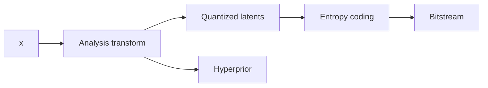
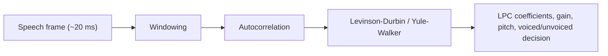

# Multimedia Communications - Study Notes

## Table of Contents

- [[#Multimedia Representation and Perception|Multimedia Representation and Perception]]
- [[#Compression, Prediction and Lossless Coding|Compression, Prediction and Lossless Coding]]
- [[#Transform Coding and JPEG|Transform Coding and JPEG]]
- [[#Wavelet-Based Image Coding|Wavelet-Based Image Coding]]
- [[#Learned Image Coding|Learned Image Coding]]
- [[#Audio and Speech Coding|Audio and Speech Coding]]
- [[#Quality Evaluation and Quantization|Quality Evaluation and Quantization]]
- [[#Adaptive Streaming|Adaptive Streaming]]
- [[#Motion Estimation and Video Coding|Motion Estimation and Video Coding]]
- [[#Modern Video Coding|Modern Video Coding]]

---

## Multimedia Representation and Perception

> [!question] Domanda 1
> Explain the Contrast Sensitivity Function (CSF): what it is, in which units spatial frequency is measured, where it peaks, and the direct implication for quantization in compression.

- **CSF**: HVS sensitivity to luminance contrast as spatial frequency changes.
- Unit: **cycles per degree** of visual angle.
- Shape: band-pass → low sensitivity at very low and very high frequencies; peak at intermediate frequencies.
- Compression consequence → frequency-dependent quantization:
  - visually important frequencies → smaller steps;
  - less visible frequencies → coarser steps.

> [!question] Domanda 2
> Compare cones and rods (number, function, lighting conditions) and explain why the RGB-to-Y conversion weights the green component the most.

- **Rods**: high light sensitivity, low-light vision, no color.
- **Cones**: color vision, brighter conditions, short/medium/long wavelength classes.
- Luminance example:

$$
Y \approx 0.299R + 0.587G + 0.114B
$$

- Green coefficient largest → HVS most sensitive to green/yellow luminance detail.

> [!question] Domanda 3
> Explain the J:a:b chroma subsampling notation. Compute the data-reduction factor of 4:2:0 vs full RGB and justify why it is perceptually acceptable.

- $J:a:b$ → chroma samples kept relative to $J$ luma samples over two rows.
- 4:2:0 → full-resolution $Y$, half horizontal and half vertical $Cb,Cr$.
- Over $2\times2$ pixels:
  - RGB: $4\times3=12$ component samples;
  - YCbCr 4:2:0: $4Y+1Cb+1Cr=6$ component samples.
- Reduction → about $1/2$ of full RGB component samples.
- Perceptual reason → eye is more sensitive to luminance detail than chrominance detail.

> [!question] Domanda 4
> Draw the Basic Tools for Compression scheme (Transform -> Prediction -> Quantization -> Entropy Coding) and indicate which stage is the only lossy one and why.

![[Pasted image 20260624205523.png]]

> [!draw] Practice Drawing: Basic Tools for Compression

- Prediction / transform → decorrelate signal or compact energy.
- Entropy coding → lossless; shorter codes for more probable symbols.
- **Quantization** → only lossy stage: many input values map to same reconstruction value → exact original cannot be recovered.

---

## Compression, Prediction and Lossless Coding

> [!question] Domanda 5
> Principles of image compression. Discuss the criteria for evaluating a compression algorithm: rate, quality, [Bonus: robustness, delay, complexity].

- Compression exploits:
  - **statistical redundancy** → correlated samples/blocks/frames;
  - **spatial / temporal redundancy** → repeated structures;
  - **psychovisual redundancy** → imperceptible distortion.
- Types:
  - **lossless** → exact reconstruction, lower compression;
  - **lossy** → approximate but perceptually close reconstruction, higher compression.
- Rate:

$$
R_{\text{image}} = \frac{B_{\text{out}}}{NM} \quad [\text{bpp}]
$$

$$
R_{\text{stream}} = \frac{B_{\text{out}}}{T} \quad [\text{bit/s}]
$$

- Compression ratio:

$$
\text{CR} = \frac{B_{\text{in}}}{B_{\text{out}}}
$$

- Distortion / quality:

$$
D(f,\hat{f}) = \frac{1}{NM}\|f-\hat{f}\|^2
$$

$$
\text{PSNR}(f,\hat{f}) = 10\log_{10}\left(\frac{V^2}{D(f,\hat{f})}\right)
$$

- Perceptual weighting:

$$
D_W(f,\hat{f}) = \frac{1}{NM}\|h \star (f-\hat{f})\|^2
$$

$$
\text{WPSNR}(f,\hat{f}) = 10\log_{10}\left(\frac{V^2}{D_W(f,\hat{f})}\right)
$$

- Tradeoffs → rate, quality, robustness, delay, complexity; also SSIM, LPIPS.

> [!question] Domanda 6
> A zero-mean Gaussian random signal has an autocorrelation function:
>
> $$
> r_X(n-m)=E[X(n)X(m)] = \sigma^2\rho^{|n-m|}
> $$
>
> - Consider the predictor $V(n)=X(n-1)$. For which values is the prediction gain positive?
> - Optimal linear predictor is $V(n)=-\sum_{i=1}^{P} a_i x_{n-i}$, with $a=-R_X^{-1}r$, $R_X(i,j)=r_X(i-j)$, $r=[r_X(1)\cdots r_X(P)]^T$. Find optimal linear predictor of order $P=1$ and compute prediction gain, compare then with previous case.
> - Compute the optimal predictor of order 2. Compare with the previous cases.

Given:

$$
r_X(n-m)=\mathbb{E}[X(n)X(m)] = \sigma^2\rho^{|n-m|}
$$

- Predictor $V(n)=X(n-1)$:

$$
\sigma_y^2 = \mathbb{E}[(X(n)-X(n-1))^2] = 2\sigma^2(1-\rho)
$$

$$
G_P = 10\log_{10}\left(\frac{1}{2(1-\rho)}\right)
$$

- Positive gain iff:

$$
\rho > \frac{1}{2}
$$

- Optimal linear predictor:

$$
V(n) = -\sum_{i=1}^{P} a_i x(n-i), \quad \vec{a}^{\,opt} = -R_X^{-1}\vec{r}
$$

- For $P=1$:

$$
a_1^{opt}=-\rho \quad \Rightarrow \quad V(n)=\rho X(n-1)
$$

$$
\sigma_y^2=\sigma^2(1-\rho^2), \quad
G_P = 10\log_{10}\left(\frac{1}{1-\rho^2}\right)
$$

- For $P=2$:

$$
R_X = \sigma^2
\begin{bmatrix}
1 & \rho \\
\rho & 1
\end{bmatrix},
\quad
\vec{r} = \sigma^2
\begin{bmatrix}
\rho \\
\rho^2
\end{bmatrix}
$$

$$
\vec{a}^{\,opt} =
\begin{bmatrix}
-\rho \\
0
\end{bmatrix}
$$

- Result → second tap gives no extra gain for AR(1) source.

> [!question] Domanda 7
> Draw and comment on the schemes of predictive quantization (encoder and decoder).

![[Block Scheme Exam/Predictive quantization - open loop.png]]

> [!draw] Practice Drawing: Open-loop Predictive Quantization

- **Open-loop predictive quantization**:
  - subtract predictor $v(n)$ from $x(n)$ → residual $y(n)$;
  - quantize residual → $\hat y(n)$;
  - add $v(n)$ back → reconstruction $\hat x(n)$.
- Problem → encoder predicts from original samples, decoder from reconstructed samples → **drift**.

![[Block Scheme Exam/Predictive quantization - correct closed loop.png]]

> [!draw] Practice Drawing: Closed-loop Predictive Quantization

- **Closed-loop encoder** → encoder contains same reconstruction loop as decoder.
- Predictor input matches both sides:

$$
y(n)=x(n)-v(n), \quad \hat{x}(n)=\hat{y}(n)+v(n)
$$

- Useful iff residual variance is smaller than original variance.

> [!question] Domanda 8
> Discuss the principles of lossless coding.

- **Lossless coding** → maps symbols to bitstrings; reconstructs original sequence exactly.
- Alphabet/code:

$$
\mathcal{X}=\{x_1,\dots,x_M\}, \quad
\mathcal{C}: \mathcal{X}\rightarrow \{0,1\}^*
$$

- Fixed-length coding:

$$
R=\lceil\log_2 M\rceil
$$

- VLC → probable symbols get shorter codewords:

$$
\bar{L} = \sum_i p_i l_i
$$

- **Prefix code** → no codeword is prefix of another → instantaneous decoding.
- **McMillan theorem** → best uniquely decodable code has same performance as best prefix code.
- **Kraft inequality**:

$$
\sum_i 2^{-l_i} \le 1
\iff
\text{prefix code exists with lengths } \{l_i\}
$$

- Entropy lower bound:

$$
H(X)=-\sum_i p_i \log_2 p_i
$$

- Shannon:

$$
H(X) \le \bar{L} < H(X)+1
$$

> [!question] Domanda 9
> Consider a source that emits the symbols A, B, C, D, E, and F. The probabilities of these symbols are given in the following table:
>
> $$
> p_A=0.3,\ p_B=0.1,\ p_C=0.05,\ p_D=0.18,\ p_E=0.15,\ p_F=0.22
> $$
>
> - Describe the Huffman Algorithm.
> - Compute Huffman code for this distribution.
> - Compare the average length of the Huffman code with the distribution entropy.

- **Huffman algorithm** → repeatedly merge two least probable symbols.
- One optimal code:
  - A, $p=0.30$ → `10`, length 2
  - B, $p=0.10$ → `1111`, length 4
  - C, $p=0.05$ → `1110`, length 4
  - D, $p=0.18$ → `00`, length 2
  - E, $p=0.15$ → `110`, length 3
  - F, $p=0.22$ → `01`, length 2

$$
\bar{L}=0.30\cdot2+0.10\cdot4+0.05\cdot4+0.18\cdot2+0.15\cdot3+0.22\cdot2 = 2.45
$$

$$
H(X)=-\sum_i p_i\log_2 p_i \approx 2.406 \text{ bit/symbol}
$$

- Overhead → $\bar{L}-H(X)\approx0.044$ bit/symbol.

> [!question] Domanda 10
> Why arithmetic encoder is preferred over Huffman for high-performance lossless coding?

- Huffman → integer codeword lengths → penalty for non-dyadic probabilities.
- Block Huffman reduces penalty, but alphabet grows as $M^K$.
- Arithmetic coding → encodes whole sequence as interval in $[0,1)$.
- Rate:

$$
\mathcal{L} < H(X) + \frac{2}{n}
\xrightarrow[n\to\infty]{}
H(X)
$$

- Also suited to adaptive/context probability models.

> [!question] Domanda 11
> (LLCod) Explain the difference between Fixed-Length Coding (FLC) and Variable-Length Coding (VLC), and describe why VLC is theoretically superior for non-equiprobable sources.

- **FLC** → same codeword length for every symbol; simple, instant parsing, inefficient if probabilities non-uniform.
- **VLC** → different lengths; probable symbols shorter.

$$
\bar{L} = \sum_i p_i l_i
$$

- Superiority condition → non-equiprobable source.

> [!question] Domanda 12
> (LLCod) Discuss the importance of the prefix condition in Variable-Length Coding and how it relates to the concept of instantaneous decodability.

- **Prefix condition** → no codeword is prefix of another.
- Consequence → decoder identifies symbol as soon as codeword ends; no look-ahead.
- Kraft:

$$
\sum_i 2^{-l_i}\le 1
$$

- Equality → complete prefix tree.

> [!question] Domanda 13
> (LLCod) What are the two distinct mechanisms by which “block coding” improves the efficiency of lossless compression?

1. Sources with memory:

$$
H(X^K) \le \sum_{i=1}^{K}H(X_i)
$$

→ dependencies exploited.

2. Memoryless non-dyadic sources:

$$
\frac{H(X^K)}{K} \le \frac{L^*}{K} < \frac{H(X^K)}{K} + \frac{1}{K}
$$

→ integer-length overhead spread over $K$ symbols; overhead/symbol → $0$.

> [!question] Domanda 14
> (LLCod) Provide a synthetic comparison between the main lossless coding techniques (Exp-Golomb, Huffman, Arithmetic, Dictionary, Neural) in terms of complexity and Latency, and provide a typical use case for each of them.

- **Exp-Golomb**: good for small integers; very low complexity/latency → syntax elements, motion-vector residuals.
- **Huffman**: optimal among symbol prefix codes; low/medium complexity, very low latency → JPEG, DEFLATE-style coding.
- **Arithmetic**: near entropy; high complexity, medium latency → CABAC, context-adaptive coding.
- **Dictionary (LZ/LZW)**: universal for repeated patterns; medium complexity, low/medium latency → text, GIF, ZIP-like systems.
- **Neural lossless**: potentially very high efficiency; very high complexity/latency → research, high-resolution image models.

> [!question] Domanda 15
> (LLCod) Describe the principle of the Huffman coding. For the following probability distribution, compute the optimal lossless code, and compare its average length to the source’s entropy:
>
> $$
> p_A=0.35,\ p_B=0.1,\ p_C=0.07,\ p_D=0.08,\ p_E=0.12,\ p_F=0.28
> $$

- One optimal Huffman code:
  - A, $p=0.35$ → `00`, length 2
  - B, $p=0.10$ → `100`, length 3
  - C, $p=0.07$ → `101`, length 3
  - D, $p=0.08$ → `110`, length 3
  - E, $p=0.12$ → `111`, length 3
  - F, $p=0.28$ → `01`, length 2
- Relevant lengths:

$$
l_A=l_F=2,\quad l_B=l_C=l_D=l_E=3
$$

$$
\bar{L}=0.35\cdot2+0.28\cdot2+(0.10+0.07+0.08+0.12)\cdot3=2.37
$$

$$
H(X)\approx 2.304 \text{ bit/symbol}
$$

- Overhead → $\bar{L}-H(X)\approx0.066$ bit/symbol.

> [!question] Domanda 16
> (LLCod) Which of the following statements best describes the behavior of the Shannon entropy $H(X)$ for a binary random variable with probability $p$?

For $X\sim\text{Bernoulli}(p)$:

$$
H(X)=-p\log_2 p -(1-p)\log_2(1-p)
$$

- $H(X)=0$ for $p=0$ or $p=1$.
- Maximum at $p=\frac12$:

$$
H\left(\frac{1}{2}\right)=1 \text{ bit}
$$

> [!question] Domanda 17
> (LLCod) Why is Lempel-Ziv (e.g., LZW) considered a “universal” coding algorithm?

- No prior source probability distribution needed.
- Encoder and decoder build same dictionary adaptively from observed sequence.
- Stationary ergodic sources → asymptotically optimal.

---

## Transform Coding and JPEG

> [!question] Domanda 18
> Why the geometric mean of the variances of a random vector is key information to evaluate the rate-distortion performance of a quantizer?

- High-resolution transform coding with optimal bit allocation:

$$
D^\star = c_{GM}\sigma_{GM}^2 2^{-2\bar{R}}
$$

- Orthogonal transforms preserve total energy → preserve arithmetic mean:

$$
\sigma_{AM,Y}^2 = \sigma_{AM,X}^2
$$

- Transform can change variance distribution.
- Good transform → few high-energy coefficients, many low-energy coefficients → lower $\sigma_{GM}^2$.

$$
\sigma_{GM}^2 \le \sigma_{AM}^2
$$

- Lower geometric mean → lower distortion at same rate.

$$
G_T = \frac{D_{\text{PCM}}}{D_Y}
=\frac{\sigma_{AM,Y}^2}{\sigma_{GM,Y}^2}
$$

$$
G_{T,dB}=10\log_{10}G_T
$$

> [!question] Domanda 19
> Write the resource allocation problem for transform coding. Derive the Huang-Schulteiss formula.

- High-resolution distortion:

$$
D = \frac{1}{M}\sum_{k=0}^{M-1} c_k\sigma_k^2 2^{-2R_k}
$$

- Rate constraint:

$$
\sum_{k=0}^{M-1} R_k \le R_{\text{tot}}
$$

- Lagrangian:

$$
J(\vec{R},\lambda)=
\frac{1}{M}\sum_{k=0}^{M-1} c_k\sigma_k^2 2^{-2R_k}
+\lambda\left(\sum_{k=0}^{M-1}R_k-R_{\text{tot}}\right)
$$

- Set $\frac{\partial J}{\partial R_k}=0$ → Huang-Schultheiss:

$$
R_k^\star = \frac{R_{\text{tot}}}{M}
+\frac{1}{2}\log_2\left(
\frac{c_k\sigma_k^2}{c_{GM}\sigma_{GM}^2}
\right)
$$

$$
c_{GM}=\sqrt[M]{\prod_{k=0}^{M-1} c_k},
\quad
\sigma_{GM}^2=\sqrt[M]{\prod_{k=0}^{M-1}\sigma_k^2}
$$

- Above geometric mean → more bits.
- Below geometric mean → fewer bits.

> [!question] Domanda 20
> Explain why the KLT is the optimal linear transform for decorrelation and why the DCT is used in practice instead.

- **KLT** → eigenvectors of signal covariance matrix.
- In KLT basis → coefficients decorrelated; optimal energy compaction among linear orthogonal transforms for given statistics.

$$
T_{KLT} = [u_1\ u_2\ \cdots\ u_M]^T
$$

- Problem → KLT depends on actual image/block statistics; encoder must estimate covariance, compute transform, signal it.
- **DCT** used because fixed, separable, fast, no side information, good KLT approximation for locally correlated image blocks.

> [!question] Domanda 21
> Describe the principles of the JPEG standard.

- **JPEG** → lossy still-image codec based on block DCT, quantization, entropy coding.
- Standard mainly defines decodable bitstream and decoder behavior; encoder choices flexible.

- Quantization:

$$
\tilde{C}_{ij}=\text{round}\left(\frac{C_{ij}}{q_{ij}}\right)
$$

- Quantization table → smaller steps for important low frequencies, larger steps for high frequencies.
- Quality factor:

$$
S_F =
\begin{cases}
\frac{5000}{Q} & 1 \le Q \le 50\\
200-2Q & 50 < Q \le 99\\
1 & Q=100
\end{cases}
$$

$$
q \leftarrow \frac{S_F}{100}q^\star
$$

- Metadata:
  - **JFIF** → density, resolution, thumbnails;
  - **EXIF** → date/time, GPS, camera settings.

> [!question] Domanda 22
> (TC&JPEG) Draw the scheme and describe the functional blocks of a JPEG encoder.

![[Block Scheme Exam/JPEG encoder.png]]

> [!draw] Practice Drawing: JPEG Encoder

- DCT → energy compaction.
- Quantization → lossy coefficient reduction.
- Zig-zag scan → groups zeros.
- Entropy coding → lossless compression.

> [!question] Domanda 23
> (TC&JPEG) Describe the problem of “frequency leakage” in the Discrete Fourier Transform (DFT) when applied to signal compression and how the Discrete Cosine Transform (DCT) addresses it.

- DFT assumes finite signal is periodic.
- Boundary mismatch → artificial discontinuities → energy spread to high frequencies = **frequency leakage**.
- DCT uses symmetric extension → smoother periodic continuation → better energy compaction for images.

> [!question] Domanda 24
> (TC&JPEG) Explain the entropy coding process for AC coefficients in the JPEG standard and the significance of the “End of Block” (EOB) symbol.

- After zig-zag scan, AC coefficients → pairs:

$$
(r,k)
$$

- $r$ → run of preceding zeros.
- $k$ → category of non-zero amplitude.
- Special symbols:

$$
(15,0) = \text{ZRL, run of 16 zeros}
$$

$$
(0,0) = \text{EOB, End Of Block}
$$

- **EOB** → all remaining block coefficients are zero.

> [!question] Domanda 25
> (TC&JPEG) Describe the JPEG lossless coding process applied to the following table of quantized DCT coefficients:
>
> $$
> \begin{bmatrix}
> 10 & 3 & 0 & 0 & 0 & 0 & 0 & 0 \\
> -2 & 1 & 0 & 1 & 0 & 0 & 0 & 0 \\
> 1 & 0 & 0 & 0 & 0 & 0 & 0 & 0 \\
> 0 & 4 & 0 & 0 & 0 & 0 & 0 & 0 \\
> 0 & 0 & 0 & 0 & 0 & 0 & 0 & 0 \\
> 0 & 0 & 0 & 0 & 0 & 0 & 0 & 0 \\
> 0 & 0 & 0 & 0 & 0 & 0 & 0 & 0 \\
> 0 & 0 & 0 & 0 & 0 & 0 & 0 & 0
> \end{bmatrix}
> $$

- Treat missing positions as zero-padded $8\times8$ block.
- DC:

$$
DC_n=10
$$

- JPEG sends DC difference:

$$
\Delta DC = DC_n-DC_{n-1}
$$

- First block with $DC_{n-1}=0$ → $\Delta DC=10$.
- Non-zero AC in zig-zag order:

$$
3,\ -2,\ 1,\ 1,\ 4,\ 1
$$

- Run/category:
  - $3$ → run 0, category 2
  - $-2$ → run 0, category 2
  - $1$ → run 0, category 1
  - $1$ → run 0, category 1
  - $4$ → run 6, category 3
  - $1$ → run 1, category 1
  - EOB → run 0, category 0
- No ZRL → no run longer than 15 zeros before non-zero coefficient.

> [!question] Domanda 26
> (TC&JPEG) What is the primary purpose of an orthogonal transform in the context of the transform coding paradigm?

- Primary purpose → **sparsification / energy compaction**.
- Orthogonal transform preserves energy and squared error:

$$
T^{-1}=T^T,\quad \|TX\|^2=\|X\|^2
$$

> [!question] Domanda 27
> (TC&JPEG) In the context of JPEG compression, what is the role of the quantization table?

- **Quantization table** → quantization step for each DCT coefficient.
- Controls rate-quality tradeoff.
- Reflects visual sensitivity:
  - low frequencies → smaller steps;
  - high frequencies → larger steps.

> [!question] Domanda 28
> (TC&JPEG) Which statement regarding the relationship between the Arithmetic Mean (AM) and Geometric Mean (GM) of variances in transform coding is correct?

- Orthogonal transforms preserve energy → preserve arithmetic mean of coefficient variances.
- They do not necessarily preserve geometric mean.
- Transform coding goal → reduce GM while AM stays fixed, because optimal distortion depends on GM.

---

## Wavelet-Based Image Coding

> [!question] Domanda 29
> State the time-frequency uncertainty principle ($\Delta t \cdot \Delta f \geq 1/4\pi$), explain why it imposes a trade-off, and how wavelets address it with adaptive multiresolution (short windows at high frequencies, long at low frequencies).

$$
\Delta t \cdot \Delta f \geq \frac{1}{4\pi}
$$

- Short window → good time/space localization, poor frequency resolution.
- Long window → good frequency resolution, poor localization.
- Wavelets → multiresolution:
  - high frequencies → short basis functions;
  - low frequencies → long basis functions.
- Image match → edges need localization; smooth trends need coarse-scale representation.

> [!question] Domanda 30
> Compare STFT (rigid tiling) and DWT (adaptive tiling) of the time-frequency plane, linking them to the trends vs anomalies image model.

- **STFT** → fixed window size → rigid time-frequency tiling; same resolution for all frequencies.
- **DWT** → filter banks + downsampling → low-frequency approximations + high-frequency detail subbands.
- Repeated DWT → multiresolution representation.
- Image model:
  - smooth trends → coarse low-frequency components;
  - anomalies/edges → high-frequency localized details.

> [!question] Domanda 31
> (TC&JPEG) What is a primary advantage of the hierarchical (multiresolution) decomposition offered by the Wavelet Transform in JPEG2000?

- Wavelet decomposition → progressive and multiresolution coding.
- Low-resolution approximation decoded first → detail subbands refine quality and resolution.

> [!question] Domanda 32
> (TC&JPEG) Compare the block-based DCT approach used in JPEG with the wavelet-based decomposition used in JPEG2000, specifically in terms of how they handle the image signal and the resulting artifacts.
>
> (TC&JPEG) Which of the following is a key reason why JPEG2000 is generally more efficient than JPEG?

- **JPEG**:
  - independent $8\times8$ block DCT;
  - simple and efficient;
  - low bitrate → **blocking artifacts**.
- **JPEG2000**:
  - DWT over large tiles / whole image;
  - multiresolution representation;
  - embedded bitplane coding and precise rate control;
  - low bitrate → ringing/blurring near edges, not blocking.
- Efficiency reasons:
  - wavelet multiresolution decomposition;
  - embedded bitstream truncation;
  - independent codeblocks;
  - quality/resolution scalability;
  - no fixed $8\times8$ boundaries.

> [!question] Domanda 33
> Describe the JPEG2000 architecture (Tier 1: DWT 9/7 or 5/3 -> fine quantization -> arithmetic coding of codeblocks per bitplane; Tier 2: EBCOT). Where does the lossy operation actually happen?

- **JPEG2000** → wavelet still-image codec for scalability, rate control, ROI, lossy/lossless.
- Tier 1:

- 9/7 DWT → irreversible, lossy.
- 5/3 DWT → reversible, lossless.
- Coefficients → codeblocks → coded bitplane by bitplane.
- Tier 2 / EBCOT → layers, packets, progression orders, truncation points.
- Lossy operations → quantization and embedded bitplane/pass truncation.

> [!question] Domanda 34
> Compare JPEG and JPEG2000 on channel-error robustness (codeblock independence, contained vs catastrophic propagation, resynchronization markers).

- **JPEG**:
  - sequential entropy coding;
  - bit error can desynchronize Huffman stream;
  - corruption propagates until restart/resynchronization marker.
- **JPEG2000**:
  - relatively independent codeblocks;
  - stream organized into packets/layers;
  - damage tends to remain local to codeblock/subband/quality layer.
- Result → JPEG2000 more robust to localized channel errors.

---

## Learned Image Coding

> [!question] Domanda 35
> (TC&JPEG) Explain the fundamental shift in Rate-Distortion (R-D) optimization from classical codecs (e.g., JPEG) to neural compression methods.

- Classical codecs → optimize handcrafted tools:
  - fixed transforms;
  - prediction modes;
  - block partitions;
  - quantization steps.

$$
J = D + \lambda R
$$

- Neural compression → learns analysis transform, synthesis transform, entropy model.

$$
\mathcal{L}=D(x,\hat{x})+\lambda R(\hat{y})
$$

- Main shift → data-learned transform instead of fixed standard tools.

> [!question] Domanda 36
> JPEG-AI: goals (beat VVC-Intra by about 50%), backbone (hierarchical VAE with hyperprior), dual-use human/machine support, and complexity profiles (Dec0/Dec1/Dec2, kMAC/px). Cite pros/cons vs classical codecs (R-D vs computational cost, determinism, hallucinations).

- **JPEG-AI** → learned still-image coding for human viewing and machine consumption.
- Goal → beat classical intra codecs, target about **50% gain vs VVC-Intra** in favorable settings; notes also report about **27% saving at 0.5 bpp**.
- Backbone:

- Hyperprior → side information about latent statistics (scales/probabilities); costs bits but improves entropy modeling.
- Backbone class → hierarchical **VAE** with hyperprior; nonlinear analysis/synthesis transforms learned end-to-end.
- Dual use → support both **human viewing** and **machine consumption**.
- Decoder profiles, complexity in **kMAC/px**:
  - **Dec0** → about 8 kMAC/px;
  - **Dec1** → about 23 kMAC/px;
  - **Dec2** → about 214 kMAC/px.
- Pros:
  - better R-D efficiency;
  - nonlinear transforms learned from data;
  - possible human/machine task support.
- Cons:
  - high computational/energy cost;
  - harder deterministic reproducibility;
  - risk of plausible but inaccurate reconstructed details.

> [!question] Domanda 37
> (TC&JPEG) What is the primary purpose of adding Additive Uniform Noise during the training phase of a neural codec?

- Quantization → non-differentiable, zero gradient almost everywhere.
- Training relaxation → additive uniform noise:

$$
u \sim \mathcal{U}\left(-\frac{1}{2},\frac{1}{2}\right)
$$

- Effect → approximates rounding with continuous operation → gradient-based optimization possible.

> [!question] Domanda 38
> (TC&JPEG) Why do Convolutional Neural Networks (CNNs) outperform Multi-Layer Perceptrons (MLPs) when applied to image compression?

- MLPs → flatten images, ignore spatial locality, many parameters, weak image bias.
- CNNs → exploit local correlations, translation structure, shared filters.
- Result → more efficient image compression models.

---

## Audio and Speech Coding

> [!question] Domanda 39
> Explain masking in the auditory system: define frequency masking and temporal masking (pre/post-masking) with their time-scale orders of magnitude.

- **Auditory masking** → strong sound makes weaker sound inaudible.
- Codec use → hide quantization noise below masking threshold.
- **Frequency masking** → simultaneous masking; strong component at $f_0$ raises threshold around nearby frequencies, mostly same critical band.
- **Temporal masking**:
  - pre-masking → few ms before masker;
  - post-masking → up to about $100$-$200$ ms after masker, depending on level/content.

> [!question] Domanda 40
> What is the critical band and how does it relate to the audibility condition of a set of sinusoids close in frequency?

- **Critical band** → frequency interval processed roughly by same cochlear auditory filter.
- Bandwidth increases with center frequency.
- Close sinusoids interact inside same band.
- Audibility condition:

$$
\sum_i g_i^2 > S_0(f_n)
$$

- $g_i^2$ → sinusoid powers.
- $S_0(f_n)$ → absolute hearing threshold near frequency $f_n$.

> [!question] Domanda 41
> (A&S Comp.) Explain the difference between Source-Based (Parametric) coding and Sink-Based (Perceptual) coding.

- **Source-based / parametric coding** → models signal production.
  - Speech → source-filter model of vocal folds + vocal tract.
  - Goal → intelligibility and low latency at very low bitrate.
- **Sink-based / perceptual coding** → models listener perception.
  - Audio codecs → auditory masking + critical bands.
  - Goal → transparent quality by removing inaudible information.

> [!question] Domanda 42
> (A&S Comp.) Describe the “Analysis-by-Synthesis” (AbS) loop used in CELP (Code Excited Linear Prediction) codecs and why it represents an improvement over simple LPC-10.

- LPC-10 → simplified excitation: impulse train for voiced, noise for unvoiced → synthetic sound.
- CELP → **Analysis-by-Synthesis** closed-loop search:

- Bit allocation:
  - sensitive bands → more bits;
  - masked bands → fewer bits.

> [!question] Domanda 44
> (A&S Comp.) Describe the principles of the LPC10 speech coding scheme.

- **LPC** → short speech frame modeled as excitation through all-pole vocal-tract filter.
- Encoder sends → filter parameters, gain, excitation information.

![[Block Scheme Exam/Linear predictive coding - analysis.png]]

> [!draw] Practice Drawing: Linear Predictive Coding (LPC) Encoder

- Analysis:

- Prediction model:

$$
\hat{x}(n)=-\sum_{i=1}^{P}a_i x(n-i)
$$

- Residual:

$$
y(n)=x(n)-\hat{x}(n)=\sum_{i=0}^{P}a_i x(n-i),\quad a_0=1
$$

- Voiced frames → pitch-period excitation.
- Unvoiced frames → noise-like excitation.
- LPC-10 → low bitrate, less natural than CELP because excitation is rigid.

> [!question] Domanda 45
> (A&S Comp.) Draw the scheme and describe the operation of the functional blocks of an MP3 encoder.

- **MP3** → perceptual audio codec.

![[Pasted image 20260624185047.png]]

> [!draw] Practice Drawing: MP3 Encoder

- Main encoder chain:

![[Pasted image 20260624213214.png]]

> [!draw] Practice Drawing: MP3 Encoder main chain

- Functional blocks:
  - framing/windowing + transform/filterbank → convert time signal into spectral components;
  - psychoacoustic model → estimate masking threshold from signal spectrum;
  - bit allocation → spend more bits where ear is sensitive, fewer where noise is masked;
  - quantization → lossy stage on spectral coefficients;
  - entropy coding → final lossless compression stage.
- Psychoacoustic model → encoder-side only; not needed at decoder.
- Decoder → entropy decoding, inverse quantization, inverse transform / synthesis filterbank.

> [!question] Domanda 46
> (A&S Comp.) Why are Line Spectrum Frequencies (LSF) preferred over direct quantization of LPC coefficients ($a_i$)?

- Direct LPC coefficient quantization → can create unstable synthesis filters.
- **LSF** → represent LPC filter through roots on unit circle.
- Stability condition easier to enforce by preserving interlacing/order:

$$
0<\omega_1^{(P)}<\omega_1^{(Q)}<\omega_2^{(P)}<\cdots<\pi
$$

- If quantization disturbs order → decoder can restore valid ordering.

> [!question] Domanda 47
> (A&S Comp.) Regarding the Opus audio codec, what is the primary technical advantage of its hybrid design?

- **Opus** combines:
  - **SILK** → LPC-based, efficient for speech and low bitrates;
  - **CELT** → MDCT-based, efficient for music/general audio and low delay.
- Advantage → seamless adaptation across speech/music, bitrate, latency; useful for WebRTC.

> [!question] Domanda 48
> (A&S Comp.) Which of the following best describes current research trends in the future of multimedia audio coding?

- Neural speech/audio codecs at very low bitrates.
- Perceptual and QoE-driven quality metrics.
- Spatial/immersive audio.
- Robust real-time coding under latency constraints.
- Quality assessment for generated/enhanced audio.

---

## Quality Evaluation and Quantization

> [!question] Domanda 49
> Compare MSE/PSNR, SSIM and LPIPS: what each measures, pros/cons, and why two images with the same MSE can have very different perceived quality.

- **MSE** → average squared pixel error:

$$
\text{MSE}=\frac{1}{NM}\sum_{i,j}(x_{ij}-\hat{x}_{ij})^2
$$

- **PSNR** → logarithmic MSE:

$$
\text{PSNR}=10\log_{10}\left(\frac{MAX^2}{\text{MSE}}\right)
$$

- MSE/PSNR → simple and reproducible, but weak perceptually; ignore structure, masking, semantics.
- **SSIM** → compares local luminance, contrast, structure.
- **LPIPS** → compares deep features; better for perceptual/semantic distortions, but expensive and model-dependent.
- Same MSE can look different → error distribution matters: texture noise less visible; edge/structure error more annoying.

> [!question] Domanda 50
> (MMQuEv) Explain the difference between subjective and objective quality evaluation in multimedia systems and why both are necessary.

- **Subjective evaluation** → human observers rate perceived quality.
  - Ground truth for perception.
  - Slow, expensive, statistically variable.
- **Objective evaluation** → automatic signal/feature metric.
  - Fast, repeatable, scalable.
  - May correlate imperfectly with human perception.
- Need both → subjective validates perception; objective enables optimization and monitoring.

> [!question] Domanda 51
> (MMQuEv) What are the key stages involved in designing a subjective quality test according to standardized guidelines?

- Define:
  - dataset/content selection;
  - display/audio equipment;
  - viewing/listening conditions;
  - methodology: ACR, DSIS, pairwise comparison, etc.;
  - participant screening;
  - score processing/outlier handling.
- Control factors → viewing distance, brightness/contrast, room illumination, audio setup, test duration.

> [!question] Domanda 52
> (MMQuEv) Describe the main categories of objective quality metrics based on the availability of the original “reference” signal.
>
> (MMQuEv) Which of the following best describes the “Full-Reference” (FR) objective quality assessment approach?

- **Full Reference (FR)** → original and degraded signals available; examples: MSE, PSNR, SSIM, VMAF.
- **Reduced Reference (RR)** → only compact original features available.
- **No Reference (NR)** → only degraded signal available; examples: BRISQUE, NIQE, PIQE.
- FR luminance PSNR:

$$
\text{MSE}_Y(t)=\frac{1}{NM}\sum_{n,m}[I(n,m,1,t)-\hat{I}(n,m,1,t)]^2
$$

$$
\text{PSNR}_Y(t)=10\log_{10}\left(\frac{255^2}{\text{MSE}_Y(t)}\right)
$$

> [!question] Domanda 53
> (MMQuEv) In the context of subjective testing, what is the main purpose of a “screening” phase for participants?

- **Screening** → checks participants can correctly perceive stimuli.
- Removes invalid observers: uncorrected visual issues, color-vision problems, inconsistent scoring behavior.

> [!question] Domanda 54
> (MMQuEv) Why is statistical analysis a critical component of subjective quality evaluation?

- Human scores vary → need reliability measures.
- Statistical analysis → MOS, variance, confidence intervals, outlier detection.
- MOS:

$$
\text{MOS}=\frac{1}{N}\sum_{i=1}^{N}x_i
$$

- Standard error:

$$
SE=\frac{s}{\sqrt{N}}
$$

> [!question] Domanda 55
> (S&P Qnt) Explain the difference between a “mid-tread” and a “mid-rise” quantizer in the context of uniform quantization for signed data.

- **Mid-tread** → zero is reconstruction level; small values around zero map to zero.
- **Mid-rise** → zero is decision threshold; values around zero map to positive/negative non-zero levels.
- Residuals prefer mid-tread → many small values become exactly zero:

$$
Q(x)=\Delta\cdot\text{round}\left(\frac{x}{\Delta}\right)
$$

> > [!draw] Draw Mid-tread Quantizer
> 
> > [!draw] Draw Mid-rise Quantizer

> [!question] Domanda 56
> (S&P Qnt) Define the concept of a “deadzone” in a quantizer and explain why it is frequently employed in lossy compression systems.

- **Deadzone quantizer** → enlarged interval mapped to zero:

$$
Q(x)=0 \quad \text{for small } |x|
$$

- Useful in lossy compression → prediction/transform residuals often have many small coefficients.
- Consequence → more zeros → better entropy coding.

> > [!draw] Draw Deadzone Quantizer

> [!question] Domanda 57
> (S&P Qnt) Why is scalar quantization alone often considered insufficient for effective compression of non-sparse data?

- Scalar quantization → one sample at a time.
- Non-sparse signal → many significant samples remain → entropy coding has little to exploit.
- Better compression needs:
  - prediction → reduce residual variance;
  - transform coding → compact energy;
  - vector/block coding → exploit dependencies;
  - entropy coding → exploit non-uniform probabilities.

> [!question] Domanda 58
> (S&P Qnt) What is the condition for a predictive quantization system to be effective, and how is the “coding gain” defined?

- Effective condition:

$$
\sigma_y^2 < \sigma_x^2
$$

with:

$$
y(n)=x(n)-v(n)
$$

- Prediction gain:

$$
G_P=10\log_{10}\left(\frac{\sigma_x^2}{\sigma_y^2}\right)
$$

- Positive when predictor reduces variance.

> [!question] Domanda 59
> (S&P Qnt) Draw the scheme of a linear predictive quantization scheme, and motivate the structure, with particular attention to the use of a decoding loop at the encoder side.

- Predictor must use reconstructed past samples on encoder and decoder:

$$
v(n)=\mathcal{P}(\hat{x}(n-1),\hat{x}(n-2),\dots)
$$

$$
y(n)=x(n)-v(n)
$$

$$
\hat{x}(n)=\hat{y}(n)+v(n)
$$

- Encoder includes same reconstruction loop as decoder → prevents drift.

> [!question] Domanda 60
> (S&P Qnt) What is the primary purpose of the predictor in a predictive quantization system?
>
> (S&P Qnt) In a predictive quantization system, if the prediction $v(n)$ is nearly equal to $x(n)$, what happens to the variance of the signal $y(n)$ being sent to the quantizer?

- Predictor → exploits correlation among neighboring samples.
- If $v(n)\approx x(n)$:

$$
y(n)=x(n)-v(n)\approx 0
$$

$$
\sigma_y^2 \ll \sigma_x^2
$$

- Quantizer encodes lower-energy residual.

> [!question] Domanda 61
> (S&P Qnt) When selecting a linear predictor of order $P$ for a random process, how does the prediction error variance typically behave as the order increases?

- Linear predictor:

$$
v(n)=-\sum_{i=1}^{P}a_i x(n-i)
$$

$$
y(n)=\sum_{i=0}^{P}a_i x(n-i),\quad a_0=1
$$

- Increasing $P$ cannot worsen optimal error variance in theory → old solution still available.
- Practice → larger $P$ increases complexity, side information, estimation error; gains eventually negligible.

> [!question] Domanda 62
> Explain the screening effect: why does the prediction gain saturate as the linear predictor order $P$ increases?

- Increasing $P$ → optimal prediction error variance cannot increase in theory.
- Gain usually saturates due to **screening effect**.
- Nearby samples already explain most correlation with current sample.
- Farther samples add little independent information because correlation is mostly mediated by nearer samples.
- Result → diminishing returns plus higher complexity/estimation sensitivity.

> [!question] Domanda 63
> (S&P Qnt) In high-resolution uniform quantization, what is the approximate relationship between the SNR and the bit rate ($R$)?

- High-resolution uniform quantization:

$$
D \approx \frac{A^2}{12}2^{-2R}
$$

$$
\text{SNR}
=10\log_{10}\left(\frac{\sigma_X^2}{D}\right)
=10\log_{10}\left(\frac{\sigma_X^2}{\frac{A^2}{12}2^{-2R}}\right)
$$

- With $\gamma^2=\frac{A^2}{4\sigma_X^2}$:

$$
\text{SNR}\approx 6.02R - 10\log_{10}\left(\frac{\gamma^2}{3}\right)
$$

- Rule → each extra bit/sample gives about $6$ dB SNR improvement.

---

## Adaptive Streaming

> [!question] Domanda 64
> Compare QoS and QoE: what they measure and how they correlate. Which network factors impact streaming QoE?

- **QoS** → technical service/network metrics: throughput, latency, jitter, packet loss.
- **QoE** → user-perceived service quality: media quality, startup delay, stalls, quality switches, device, context, expectations.
- Correlation → not linear.
  - Packet loss may be hidden by buffer.
  - Short throughput drop may cause rebuffering → large QoE loss.

> [!question] Domanda 65
> (AdapStrm) Describe the fundamental architectural differences between a “Push-based” streaming system (e.g., RTP/UDP) and a “Pull-based” system (e.g., DASH).

- **Push-based streaming** (RTP/UDP/WebRTC-style):
  - server sends packets according to timing;
  - low latency;
  - needs real-time transport/control;
  - typical use → conferencing/live interactive media.
- **Pull-based streaming** (DASH/HLS over HTTP):
  - client requests segments;
  - works with HTTP/CDNs/caches;
  - client selects bitrate from throughput/buffer;
  - higher delay, scalable/robust for VoD/streaming.

> [!question] Domanda 66
> (AdapStrm) Analyze the role of the client-side buffer in the context of stability and Quality of Experience (QoE).

- Buffer → stores downloaded media in seconds.
- Function → absorbs throughput variation and jitter.
- Larger buffer → more stability, but higher startup delay/latency.
- QoE depends on startup time, stalls, stall duration, segment quality, quality switches.

> [!question] Domanda 67
> (AdapStrm) Define “Switching Penalty” and discuss its impact on perceived video quality.

- **Switching penalty** → QoE loss from visible quality changes between segments.

$$
J(n)=\lambda_1K_n-\lambda_2|K_n-K_{n-1}|-\phi(\Delta_n)
$$

- $K_n$ → segment quality.
- $|K_n-K_{n-1}|$ → switching penalty.
- $\phi(\Delta_n)$ → rebuffering penalty.
- Frequent oscillations can be worse than stable slightly lower quality.

> > [!draw] Draw Switching Penalty / QoE vs Quality Curve

> [!question] Domanda 68
> (AdapStrm) Explain the evolution of the playout buffer level $B(t)$ using a mathematical model. In your explanation, describe the dynamics of the “playback” (draining) phase and the “rebufferization” (stalling) phase.

- Buffer level in playback seconds:

$$
B(t)=L\cdot T_s
$$

- $L$ → stored segments; $T_s$ → segment duration.
- Coding rate $R_c$, throughput $S$:

$$
\frac{dB}{dt}=
\begin{cases}
\frac{S}{R_c}-1 & \text{during playback}\\
\frac{S}{R_c} & \text{during rebuffering}
\end{cases}
$$

- Playback → buffer receives data but drains at one playback second per real second.
- Rebuffering → playout stops; no output drain.
- Stable playback average:

$$
S>R_c
$$

> [!question] Domanda 69
> (AdapStrm) What is the primary motivation for using HTTP-based protocols for video streaming?

- HTTP streaming → stateless, CDN-friendly, firewall-friendly, easy to deploy at scale.
- DASH/HLS → use web infrastructure; client adapts representation quality.

> [!question] Domanda 70
> (AdapStrm) What is the consequence of an ABR algorithm that systematically overestimates the available bandwidth?

- ABR overestimates throughput → requests too high bitrate.
- Segment download time grows → buffer empties → rebuffering/stalling.

> [!question] Domanda 71
> (AdapStrm) Which metric is a direct indicator of streaming QoE from the end-user’s perspective?

- Direct QoE indicators → startup delay, rebuffering duration/frequency, quality level, quality switches.
- User perspective → uninterrupted stable playback often more important than low-level network metrics.

> [!question] Domanda 72
> (AdapStrm) At what stage in the session lifecycle does a DASH client process the Media Presentation Description (MPD)?

- Client processes **MPD** at session start, before media segment download.
- MPD lists periods, adaptation sets, representations, codecs, bitrates, resolutions, segment URLs.

> [!question] Domanda 73
> Explain how an ABR (Adaptive Bitrate) algorithm works: rate-based vs buffer-based logic, and the risk of overestimating available bandwidth.

- **ABR** → client-side rule selecting bitrate representation for next segment.
- Goal → maximize QoE: quality + stability, avoid stalls.
- Rate-based:
  - estimate recent throughput;
  - choose representation below available bandwidth, often with safety margin.
- Buffer-based:
  - low buffer → conservative bitrate;
  - high buffer → higher quality.
- Overestimated bandwidth → segments too large → long downloads → buffer drain → stalls.

---

## Motion Estimation and Video Coding

> [!question] Domanda 74
> Motion estimation: give the principles of the block matching approach. Give at least one cost function. [Bonus]. Discuss the regularization issue.

- **Block matching** → split frame into blocks $B_{p,q}$; search similar block in reference frame window.
- Best displacement:

$$
(\hat{i},\hat{j})=\arg\min_{(i,j)\in W}J(i,j)
$$

- SSD:

$$
J_{\text{SSD}}(i,j)=
\sum_{(n,m)\in B_{p,q}}
[f(n,m,k)-f(n-i,m-j,h)]^2
$$

- SAD:

$$
J_{\text{SAD}}(i,j)=
\sum_{(n,m)\in B_{p,q}}
|f(n,m,k)-f(n-i,m-j,h)|
$$

- Regularized:

$$
J_{\text{REG}}(i,j)=
\|\vec{f}_k(B_{p,q})-\vec{f}_h(B_{p-i,q-j})\|_p^p
+\lambda R(i,j)
$$

- Regularization → penalizes expensive/irregular motion vectors; balances prediction quality with motion-vector coding rate.

> [!question] Domanda 75
> Discuss the advantages and the disadvantages of Intra, Predictive, and Bidirectional images in a GOP for video coding.

- **I images**:
  - intra only;
  - advantages → random access, error reset, no motion estimation;
  - disadvantages → high rate, lower compression.
- **P images**:
  - predicted from previous anchor frames;
  - advantages → good compression, moderate delay;
  - disadvantages → ME/MC complexity, error propagation.
- **B images**:
  - predicted from past and future frames;
  - advantages → best compression;
  - disadvantages → highest complexity, structural delay, not ideal for low latency.
- GOP structure controls compression efficiency, delay, random access interval, error propagation.

> [!question] Domanda 76
> (ME) Describe the difference between “motion field” and “optical flow”.

- **Motion field** → projection of actual 3D scene motion onto image plane.
- **Optical flow** → apparent motion of brightness patterns.
- They often coincide, but can differ due to illumination changes, occlusions, texture ambiguities.

> [!question] Domanda 77
> (ME) Explain the Horn and Schunck algorithm’s core principle for dense optical flow estimation.

- Optical flow constraint:

$$
u f_x + v f_y + f_t = 0
$$

- Horn-Schunck objective:

$$
J=
\iint_{\mathcal{R}}(u f_x+v f_y+f_t)^2\,dxdy
+\lambda\iint_{\mathcal{R}}(\|\nabla u\|^2+\|\nabla v\|^2)\,dxdy
$$

- First term → brightness consistency.
- Second term → smooth dense flow field.

> [!question] Domanda 78
> (ME) Discuss the Rate-Distortion trade-off when selecting block sizes in motion estimation.

$$
J(v)=d(B_k^{(p)},B_h^{(p+v)})+\lambda_{ME}R(v)
$$

- Large blocks:
  - fewer motion vectors;
  - lower side information and complexity;
  - worse fit near object boundaries.
- Small blocks:
  - better prediction and lower distortion;
  - more motion vectors and partition bits;
  - higher complexity.

> [!question] Domanda 79
> (ME) Which of the following is a disadvantage of using the Sum of Squared Differences (SSD) as a matching criterion?

- SSD squares errors → outliers dominate cost.
- Illumination changes, noise, occlusions → irregular motion vectors.
- SAD → often more robust and cheaper.

> [!question] Domanda 80
> (ME) What is the main benefit of the Hexagon Search strategy compared to Full Search?

- Full search → tests all candidates; optimal within window, expensive.
- Hexagon search → tests small hexagonal pattern iteratively; far fewer evaluations.
- Benefit → faster search.
- Cost → no guaranteed global optimum.

> [!question] Domanda 81
> (ME) What does an affine motion model allow that a pure translational model does not?

- Translation → constant displacement only.
- Affine motion → rotation, zoom, shear:

$$
\vec{v}(p)=\vec{b}+Bp
=
\begin{bmatrix}b_1\\b_2\end{bmatrix}
+
\begin{bmatrix}b_3&b_4\\b_5&b_6\end{bmatrix}p
$$

- If $B=0$ → pure translation / block matching.

> [!question] Domanda 82
> Draw the block diagram of a hybrid video encoder (motion estimation/compensation + DCT + quantization + entropy coding + reconstruction loop with frame buffer). Explain why the encoder contains an internal decoder.

- Hybrid video encoder → codes prediction residual, usually not whole frame.

![[Block Scheme Exam/Hybrid video encoder.png]]

> [!draw] Practice Drawing: Hybrid Video Encoder

- Mode decision → selects intra/inter predictor.
- Transform + quantization → residual coding.
- Lossless coding → bitstream.
- Inverse quantization + inverse transform → reconstructed residual.
- Reconstructed block → frame buffer for later motion compensation.
- Internal decoder needed → future predictions must use same reconstructed frames as decoder; otherwise drift propagates.

> [!question] Domanda 83
> (VCP) Why is the temporal prediction error usually more efficient to encode than the original video signal?

![[Block Scheme Exam/Video coding principles.png]]

> [!draw] Practice Drawing: Video Coding Principles

- Video frames → highly correlated.
- Motion-compensated prediction estimates current block from reference frames.
- Encode only residual:

$$
e=x-x_p
$$

- Residual → lower energy and more sparse than original frame.
- Consequence → transform quantization and entropy coding more efficient.

> [!question] Domanda 84
> (VCP) Describe the function of the “Mode Selection” step in a hybrid video encoder.

- Mode selection → choose coding mode minimizing R-D cost:

$$
J = D+\lambda R
$$

- For blocks:

$$
D=\sum_{k=1}^{K}D_k(i_k,Q),
\quad
R=\sum_{k=1}^{K}R_k(i_k,Q)
$$

$$
J(\vec{i},Q,\lambda)=D(\vec{i},Q)+\lambda R(\vec{i},Q)
$$

- Block-wise suboptimal minimization:

$$
i_k^\star=\arg\min_{i_k}J_k(i_k,Q,\lambda)
$$

- Empirical choices:

$$
\text{MPEG-2: } \lambda=aQ^2+b
$$

$$
\text{H.264: } \lambda=c\cdot2^{dQ+e},
\quad
\lambda_{ME}=\sqrt{\lambda}
$$

> [!question] Domanda 85
> (VCP) How does the “Channel Buffer” controller manage the trade-off between target rate and video quality?

- Channel buffer → controls quantization step to meet target rate.
- Buffer occupancy high → increase quantization step → reduce rate, lower quality.
- Buffer occupancy low → decrease quantization step → improve quality, higher rate.
- Goal → avoid overflow/underflow while keeping quality high.

> [!question] Domanda 86
> (VCP) What is the primary role of an “I-frame” in a GOP structure?

- **I-frame** → intra-coded and independently decodable.
- Roles → random access, GOP start, temporal error-propagation limit.

> [!question] Domanda 87
> (VCP) In the context of motion vector coding, why is a Median Predictor (MVP) used?

- Neighboring motion vectors → correlated.
- Median predictor estimates current vector from adjacent blocks.
- Encoder sends only difference:

$$
\text{MVD} = \text{MV} - \text{MVP}
$$

- MVD usually small → cheaper to encode.

> [!question] Domanda 88
> (VCP) What happens in the decoder when it receives an “Inter-coded” block?

![[Block Scheme Exam/Hybrid video decoder.png]]

> [!draw] Practice Drawing: Hybrid Video Decoder

- Decoder reads side information → mode, reference index, motion vector.
- Entropy decoding → residual and side information.
- Inverse quantization + inverse transform → reconstructed residual.
- Motion compensation / intra prediction → predictor.
- Reconstruction:

$$
\hat{x}=\text{prediction}+\hat{e}
$$

- Output stored in frame buffer.

---

## Modern Video Coding

> [!question] Domanda 89
> (ModernVC) What is the specific scope of video compression standards like H.266/VVC?

- Standards define:
  - bitstream syntax;
  - normative decoder behavior.
- They do not prescribe full encoder implementation.
- VVC → higher compression efficiency than HEVC, especially high-resolution/HDR/360/immersive video; cost → much higher complexity.

> [!question] Domanda 90
> (ModernVC) Explain the advantage of the “Coding Tree Unit” (CTU) structure introduced in HEVC/VVC.

- **CTU** → replaces fixed macroblocks with flexible recursive partitioning.
- Large homogeneous regions → large blocks.
- Detailed regions → smaller blocks.
- Result → improved R-D efficiency.
- HEVC → quadtree partitioning.
- VVC → multi-type trees, including binary and ternary splits.

> [!question] Domanda 91
> (ModernVC) What are the roles of VCL and NAL in modern video standards?

- **VCL (Video Coding Layer)** → compressed video data: slices, prediction, residuals, coding syntax.
- **NAL (Network Abstraction Layer)** → wraps VCL/non-VCL data into NAL units for transport/storage.
- Purpose → separates codec syntax from packetization.
- Non-VCL examples → SPS, PPS, SEI.

> [!question] Domanda 92
> (ModernVC) What is the main purpose of the CABAC entropy coder in modern standards?

- **CABAC** = Context-Adaptive Binary Arithmetic Coding.
- Workflow → binarize syntax elements, adapt probabilities to local context, arithmetic-code bins.
- Purpose → lossless entropy coding with better compression than VLC/CAVLC.
- Cost → higher complexity.

> [!question] Domanda 93
> (ModernVC) Why are “Tiles” considered “hardware-friendly” in VVC and HEVC?

- Tiles → independently decodable rectangular frame regions.
- Restrict dependencies across tile boundaries.
- Enable parallel encoding/decoding on CPU/GPU cores.
- Result → lower synchronization cost.

> [!question] Domanda 94
> (ModernVC) What is the function of an “In-Loop Filter” like the Adaptive Loop Filter (ALF)?

- In-loop filters → applied inside reconstruction loop before frames are stored as references.
- Purpose → reduce artifacts before motion compensation reuses frames.
- Evolution:
  - H.264 → deblocking;
  - HEVC → SAO;
  - VVC → ALF and other tools.
- **ALF** → adaptive filtering of reconstructed samples; reduces ringing/residual distortion.

> [!question] Domanda 95
> Describe the intra-coding modes in H.264. [Optional] Discuss also the Intra modes in H.265.

- Intra prediction → exploits already reconstructed neighboring samples in same frame.
- H.264/AVC:
  - $4\times4$ blocks → 9 modes: 8 directional + DC;
  - $16\times16$ luma blocks → 4 modes.
- H.265/HEVC → 35 modes: 33 directional + DC + Planar.
- H.266/VVC → 65 directional modes + wide-angle variants for non-square blocks.
- MPM lists → predict likely mode from neighboring blocks → reduce signaling cost.

> [!question] Domanda 96
> Describe the principle of the deblocking in-loop filter of H.264.

- Low bitrate block transform + quantization → visible block-boundary discontinuities.
- H.264 → normative in-loop deblocking filter on edges between $4\times4$ blocks.
- Filtering strength depends on:
  - coding mode;
  - motion vectors;
  - reference frames;
  - quantization parameter;
  - local boundary conditions.
- In-loop reason → filtered reconstructed frames become future references → avoids propagating blocking artifacts.
