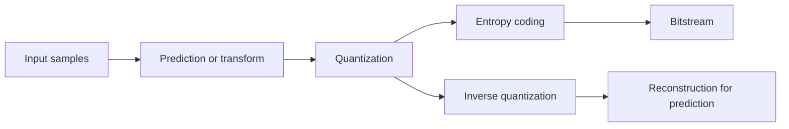
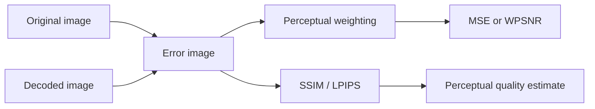

# Introduction to Multimedia Compression

## Table of Contents

- [[#Core Idea|Core Idea]]
- [[#Key Concepts|Key Concepts]]
- [[#Theory and Formulas|Theory and Formulas]]
- [[#Visual Schemes|Visual Schemes]]
- [[#Examples|Examples]]

## Core Idea

Multimedia compression is needed because raw image, video, and audio data rates are far above practical storage and transmission limits. Effective codecs reduce rate by exploiting:

- **Statistical redundancy**: correlation between nearby samples or frames.
- **Perceptual redundancy**: details humans cannot see or hear well.
- **Semantic redundancy**: task-irrelevant content, especially when the receiver is a machine.

Compression is always a design tradeoff among **rate**, **quality**, **complexity**, **delay**, and **robustness**.

> [!Important] Main compression principle
> A codec should spend bits where errors are visible or useful, and remove information that is predictable, imperceptible, or irrelevant to the final task.

## Key Concepts

### Multimedia Representation

| Signal | Discrete representation | Key dependency |
| :--- | :--- | :--- |
| Gray image | $N \times M$ samples $f_{n,m}$ | Spatial correlation |
| Color image | Three components, usually RGB or YCbCr | Luma/chroma sensitivity |
| Video | Sequence of color images over time | Spatial and temporal correlation |
| Audio | Time signal or frequency components | Hearing threshold and masking |

For an image scanned in raster order:

$$
k = (n-1)M + m, \qquad f_{n,m} = f_k
$$

For digital video:

$$
I : (n,m,T,c) \rightarrow x \in \{0,1,\ldots,2^b-1\}
$$

where $(n,m)$ is position, $T$ is frame index, $c$ is color component, and $b$ is bit depth.

### Human Visual System

- **Cones**: 6-7 million, concentrated near the fovea, responsible for color and high spatial resolution under good illumination.
- **Rods**: 75-150 million, more sensitive in low light, mainly detect intensity with lower resolution.
- Perceived brightness is approximately **logarithmic** with physical intensity.
- The eye adapts to illumination, so it cannot use the full physical dynamic range at once.

![[Pics/1. Introduction to Multimedia Compression/hvs-receptors.png|500]]

Retinal receptors explain why compression can treat brightness, color, and fine details differently.

> [!Important] Contrast Sensitivity Function (CSF)
> The **CSF** gives sensitivity to luminance changes as a function of spatial frequency.
>
> $$
> \text{sensitivity} = \frac{1}{\text{minimum detectable contrast}}
> $$
>
> Sensitivity is highest around **2-5 cycles/degree** and lower at very low and very high spatial frequencies.
>
> **Compression meaning:** high-frequency errors are often less visible, so high-frequency transform coefficients can be quantized more coarsely.

### Color Perception and Color Spaces

Visible light lies roughly between **400 nm and 700 nm**. Cone sensitivities are uneven:

- Red-sensitive cones: about **65%**, peak near 575 nm.
- Green-sensitive cones: about **33%**, peak near 535 nm.
- Blue-sensitive cones: about **2%**, peak near 445 nm.

Color perception is **tristimulus**: a color corresponds to the 3D response vector of the three cone classes.

| Space | Components | Compression relevance |
| :--- | :--- | :--- |
| **RGB** | Red, Green, Blue | Device-oriented; three full-resolution channels |
| **HSV** | Hue, Saturation, Value | Perceptual description of color |
| **YCbCr** | Luminance Y, chrominance Cb/Cr | Separates brightness from color; enables chroma subsampling |

> [!Important] ITU-R BT.601 RGB to YCbCr
> $$
> \begin{bmatrix}
> Y\\
> Cb\\
> Cr
> \end{bmatrix}
> =
> \begin{bmatrix}
> 0.299 & 0.587 & 0.114\\
> -0.1687 & -0.3313 & 0.5\\
> 0.5 & -0.4187 & -0.0813
> \end{bmatrix}
> \begin{bmatrix}
> R\\
> G\\
> B
> \end{bmatrix}
> +
> \begin{bmatrix}
> 0\\
> 128\\
> 128
> \end{bmatrix}
> $$
>
> The luminance weights follow visual sensitivity: green contributes most, blue least. The $+128$ offset centers chroma components in the 8-bit range.

### Sound Perception

Audio coding uses a psychoacoustical model. A pure tone

$$
x(t)=a\sin(2\pi f_1 t)
$$

has power

$$
\sigma^2 = \frac{a^2}{2}
$$

and excites several nerve fibers, not only one.

For auditory filter $k$:

$$
H_k(f)=A_k(f)e^{j\phi_k(f)}
$$

The response to tone $f_1$ is:

$$
y_k(t)=aA_k(f_1)\sin(2\pi f_1t+\phi_k(f_1))
$$

The **spreading function** is:

$$
S_E(k)=A_k^2(f_1)
$$

> [!Important] Hearing threshold
> $S_a(f)$ is the minimum power for a tone at frequency $f$ to be audible. It is lowest around **1-4 kHz**, where human hearing is most sensitive.
>
> **Compression meaning:** components below the threshold can be discarded or hidden under quantization noise.

> [!Important] Critical band
> Sinusoids close in frequency are integrated by hearing. For $N$ sinusoids near $f_1$:
>
> $$
> \sum_i \sigma_i^2 > S_a(f_1)
> $$
>
> The frequency interval where this energy integration holds is the **critical band**.

### Chroma Subsampling

Notation $J:a:b$ describes chroma samples relative to a luma reference block:

- $J$: horizontal luma reference size, usually 4.
- $a$: chroma samples in the first line.
- $b$: chroma samples in the second line.

| Scheme | Horizontal chroma resolution | Vertical chroma resolution | Use |
| :--- | :--- | :--- | :--- |
| **4:4:4** | Full | Full | High quality, no chroma reduction |
| **4:2:2** | Half | Full | Professional video |
| **4:2:0** | Half | Half | Most common image/video coding format |
| **4:1:1** | Quarter | Full | Older video systems |

For **YCbCr 4:2:0**, Y is full resolution, Cb and Cr are half resolution horizontally and vertically:

$$
\frac{4+1+1}{4+4+4}=\frac{6}{12}=0.5
$$

This gives **50% data reduction** compared with full RGB/YUV 4:4:4 before any transform or entropy coding.

### Compression Tools

| Tool | Role | Lossy? |
| :--- | :--- | :--- |
| **Transform** | Concentrates energy in few coefficients, e.g. DCT, wavelets, neural transforms | No by itself |
| **Prediction** | Removes spatial or temporal redundancy | No by itself |
| **Quantization** | Maps values to fewer levels; reduces precision | **Yes** |
| **Entropy coding** | Removes residual statistical redundancy, e.g. VLC, arithmetic coding | No |

> [!Important] Quantization is the lossy step
> In classical codecs, transform, prediction, and entropy coding can be reversible. The irreversible rate reduction comes from **quantization**.

### Lossless vs. Lossy Compression

| Property | Lossless | Lossy |
| :--- | :--- | :--- |
| Reconstruction | Exact | Approximate |
| Exploits | Statistical redundancy | Statistical + perceptual redundancy |
| Main tool | Entropy coding, reversible prediction/transform | Quantization plus perceptual modeling |
| Typical image ratio | $T \leq 3$ | $T \approx 5$ or higher |
| Typical video ratio | Limited | $T \approx 20$ or higher |

### Machine-Centric Multimedia

Not all multimedia is consumed by humans. Cameras in surveillance, IoT, industry, and robotics often feed algorithms.

| Receiver | Priority | Compression goal |
| :--- | :--- | :--- |
| Human | Perceptual quality | Hide distortion below HVS/HAS limits |
| Machine | Task accuracy | Preserve semantic features needed by model |

**Task-oriented communication** can discard visually important but task-irrelevant information if the downstream algorithm still performs well.

## Theory and Formulas

### Quantization and Bit Depth

If a scalar sample is represented with $L$ levels:

$$
b = \log_2 L
$$

where $b$ is bits per sample. Standard 8-bit components have:

- $L=256$ gray levels.
- RGB: $256^3 \approx 16$ million colors.
- 24 bpp for full RGB.

HDR content may use 32-64 bits per channel.

### Rate and Compression Ratio

> [!Important] Compression ratio
> $$
> T = \frac{B_{\text{in}}}{B_{\text{out}}}
>   = \frac{R_{\text{in}}}{R_{\text{out}}}
> $$
>
> $T$ measures how many times the coded representation is smaller than the original.

Coding rate:

$$
R_{\text{image}} = \frac{B_{\text{out}}}{NM} \quad [\text{bpp}]
$$

$$
R_{\text{audio/video}} = \frac{B_{\text{out}}}{T} \quad [\text{bps}]
$$

Typical values:

| Application | Typical compression ratio |
| :--- | :--- |
| Lossless image coding | $T \leq 3$ |
| Lossy image coding | $T \approx 5$ to much higher |
| Lossy video coding | $T \approx 20$ to much higher |

### Objective Quality Metrics

Let $f$ be the original image and $\tilde{f}$ the decoded image. The error image is:

$$
\mathcal{E}(f,\tilde{f}) = f-\tilde{f}
$$

> [!Important] MSE and PSNR
> $$
> \mathcal{D}(f,\tilde{f}) =
> \frac{1}{NM}\|\mathcal{E}\|^2 =
> \frac{1}{NM}\sum_{n,m}\mathcal{E}_{n,m}^2
> $$
>
> $$
> \text{PSNR}(f,\tilde{f}) =
> 10\log_{10}\left(\frac{255^2}{\mathcal{D}(f,\tilde{f})}\right)
> \quad [\text{dB}]
> $$
>
> **Meaning:** MSE/PSNR are simple and analytically useful, but they do not model perception.

Weighted PSNR introduces a filter $h$ that weights errors according to perceptual sensitivity:

$$
\mathcal{D}_W = \frac{1}{NM}\|h * \mathcal{E}\|^2
$$

$$
\text{WPSNR}(f,\tilde{f}) =
10\log_{10}\left(\frac{255^2}{\mathcal{D}_W}\right)
$$

### SSIM

> [!Important] Structural Similarity Index
> For image blocks $x$ and $y$:
>
> $$
> \text{SSIM}(x,y)=
> \frac{(2\mu_x\mu_y+C_1)(2\sigma_{xy}+C_2)}
> {(\mu_x^2+\mu_y^2+C_1)(\sigma_x^2+\sigma_y^2+C_2)}
> $$
>
> SSIM combines:
>
> $$
> l(x,y)=\frac{2\mu_x\mu_y+C_1}{\mu_x^2+\mu_y^2+C_1}
> $$
>
> $$
> c(x,y)=\frac{2\sigma_x\sigma_y+C_2}{\sigma_x^2+\sigma_y^2+C_2}
> $$
>
> $$
> s(x,y)=\frac{\sigma_{xy}+C_3}{\sigma_x\sigma_y+C_3}
> $$
>
> Image SSIM is the average over blocks. Range is $[0,1]$, with 1 meaning identical.

### Learned Perceptual Metrics

**LPIPS** (*Learned Perceptual Image Patch Similarity*) compares images in a neural feature space, often using pre-trained VGG or ViT features. It is useful when pixel metrics fail, especially for highly compressed, generated, or neural-coded images.

### Subjective Quality

Subjective tests with human observers are the reference for perceived quality, but they are expensive and statistically demanding. Objective metrics are proxies:

- **PSNR**: easy, pixel-based.
- **SSIM**: structure-aware.
- **LPIPS**: learned perceptual feature distance.

### Complexity, Delay, and Robustness

Beyond rate and quality, codecs must balance:

- **Complexity**: real-time feasibility, hardware cost, power consumption.
- **Delay**: especially encoder delay; often depends on coding order and look-ahead.
- **Robustness**: sensitivity of compressed bitstreams to channel loss or packet errors.

| Goal | Typical conflict |
| :--- | :--- |
| Higher quality | Higher rate or complexity |
| Lower rate | Lower quality or higher delay |
| Lower delay | Less look-ahead, weaker compression |
| Higher robustness | More redundancy or lower compression efficiency |

## Visual Schemes

### Visual and Auditory Perception

![[Pics/1. Introduction to Multimedia Compression/contrast-sensitivity-function.png|500]]

CSF shows why compression can quantize frequencies differently: mid spatial frequencies are most visible, while very low and very high frequencies can tolerate larger errors.

![[Pics/1. Introduction to Multimedia Compression/hearing-threshold.png|500]]

The hearing threshold identifies inaudible components that can be removed or used to hide quantization noise.

![[Pics/1. Introduction to Multimedia Compression/critical-band.png|400]]

Critical bands explain why nearby tones interact and why audio coders group frequency components.

![[Pics/1. Introduction to Multimedia Compression/frequency-masking.png|500]]

Frequency masking allows a strong tone to hide weaker tones nearby in frequency.

![[Pics/1. Introduction to Multimedia Compression/temporal-masking.png|500]]

Temporal masking permits distortion shortly before and after a strong sound, especially after the masker.

### Color and Chroma Sampling

![[Pics/1. Introduction to Multimedia Compression/chroma-subsampling.png|600]]

Chroma subsampling reduces color resolution because humans are more sensitive to luminance than chrominance.

### Compression Pipeline

![[Pics/1. Introduction to Multimedia Compression/compression-tools.png|500]]

This block scheme summarizes the main codec tools: prediction/transform reduce redundancy, quantization reduces rate, and entropy coding packs symbols efficiently.

### Quality Assessment Chain

![[Pics/1. Introduction to Multimedia Compression/weighted-psnr.png|500]]

Weighted PSNR filters the error before measuring energy, so distortions are penalized according to perceptual visibility.

### Video Perception

![[Pics/1. Introduction to Multimedia Compression/spatio-temporal-csf.png|500]]

Video perception depends on spatial and temporal frequencies; scene changes create masking and can temporarily hide distortion.

## Examples

> [!Example] Uncompressed HD DVB data rate
> **Setup:** one luma component $1920 \times 1080$, two chroma components $960 \times 540$, 8 bits/sample, 50 fps.
>
> $$
> R = (1920\cdot1080 + 2\cdot960\cdot540)\cdot8\cdot50
> \approx 1.24\ \text{Gbps}
> $$
>
> A 2-hour movie needs about **1.12 TB** uncompressed.
>
> **Takeaway:** raw video is too large; compression is not optional.

> [!Example] 4:2:0 data reduction
> Full 4:4:4 stores 4 Y samples, 4 Cb samples, and 4 Cr samples in a reference area. 4:2:0 stores 4 Y samples, 1 Cb sample, and 1 Cr sample:
>
> $$
> \frac{4+1+1}{4+4+4} = 0.5
> $$
>
> **Takeaway:** chroma subsampling alone halves the raw color data.

> [!Example] Same MSE, different perception
> Source examples compare several distortions with similar or equal MSE.
>
> | Error type | MSE | SSIM |
> | :--- | :--- | :--- |
> | Distributed white noise, $\sigma=4$ | 16 | 0.906 |
> | Concentrated on $100\times100$ pixels | 16 | 0.972 |
> | Concentrated on contours | 16 | 0.987 |
> | Noise on high spatial frequencies | 16 | 0.882 |
> | Chroma subsampling | 21.27 | - |
>
> **Takeaway:** MSE alone is misleading because it ignores where and how errors appear.

> [!Example] Codec comparison at about 50 KB
> The source compares codecs on the same image target size.
>
> | Codec | Year | Size (Bytes) | Ratio | PSNR |
> | :--- | :--- | :--- | :--- | :--- |
> | Original | - | 6,220,800 | 1.0:1 | - |
> | PNG | 1996 | 2,923,960 | 2.1:1 | - |
> | 4:2:0 only | - | 3,110,400 | 2.0:1 | 43.05 dB |
> | JPEG | 1991 | 49,795 | 124.9:1 | 26.89 dB |
> | JPEG 2000 | - | 50,943 | 122.1:1 | 29.82 dB |
> | WebP | 2010 | 42,676 | 145.8:1 | 30.88 dB |
> | AVIF | 2019 | 48,745 | 127.6:1 | 32.45 dB |
>
> **Takeaway:** at similar size, newer codecs can provide better objective quality.

