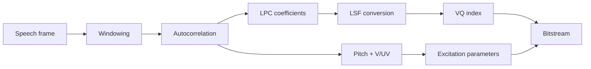
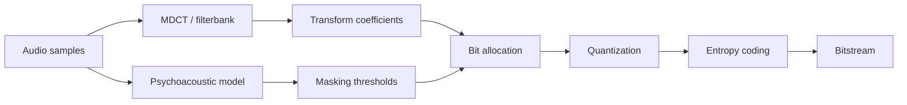

# Audio Coding

## Table of Contents

- [[#Core Idea|Core Idea]]
- [[#Key Concepts|Key Concepts]]
- [[#Theory and Formulas|Theory and Formulas]]
- [[#Visual Schemes|Visual Schemes]]
- [[#Examples|Examples]]

## Core Idea

**Audio coding** compresses speech and general audio by exploiting both signal redundancy and human perception.

Two main paradigms:

- **Source-based coding**: model how sound is produced. Best for speech, where vocal tract physics gives strong structure. Main tools: LPC, CELP, ACELP.
- **Sink-based coding**: model what listener cannot hear. Best for music/general audio. Main tools: psychoacoustic masking, MDCT, adaptive bit allocation.

> [!Important] Redundancy vs. irrelevancy
> Speech coding mainly removes **statistical redundancy** through prediction and source modeling. Perceptual audio coding mainly removes **irrelevant information** hidden by auditory masking.

Modern codecs such as **Opus**, **EVS**, and **USAC** are hybrid: they switch or blend speech-oriented and music-oriented tools.

## Key Concepts

### Speech vs. Music

Audio signals are locally stationary, but stationarity time varies:

| Signal | Typical behavior | Coding implication |
| :--- | :--- | :--- |
| speech | quasi-stationary around 20 ms | LPC/CELP frame analysis works well |
| tonal music | can be stable for hundreds of ms | long transform windows improve frequency resolution |
| transients | can change in 2-5 ms | short windows avoid pre-echo |
| complex game/effects audio | noise-like and mixed | parametric speech models fail |

> [!Important] Window-length compromise
> Long windows give good frequency resolution for stable tones. Short windows localize attacks and reduce pre-echo around transients.

### Empirical Signal Structure

Voiced speech has strong correlation between consecutive samples and harmonic spectral structure.

![[Pics/10. Audio Coding/voiced-speech-correlation.png|420]]

Consecutive voiced-speech samples align near a diagonal: strong time-domain redundancy supports prediction.

![[Pics/10. Audio Coding/vowel-spectrogram.png|500]]

Vowel spectrogram: horizontal harmonics and formants justify source-filter speech modeling.

Music can be less predictable in time domain, especially with beats and transients.

![[Pics/10. Audio Coding/music-amplitude-histogram.png|420]]

Music amplitudes can still be sparse, but structure is not tied to a single vocal-tract model.

### Source-Filter Model

Speech production:

- lungs provide air pressure;
- vocal folds generate excitation;
- vocal tract filters excitation through resonances.

Frequency-domain model:

$$
S(f)=E(f)H(f)
$$

where $E(f)$ is excitation spectrum and $H(f)$ is vocal-tract transfer function.

![[Pics/10. Audio Coding/source-filter-model.png|520]]

Source-filter model separates excitation from resonant vocal-tract envelope.

### Voiced and Unvoiced Speech

| Type | Excitation | Signal | Codec parameter |
| :--- | :--- | :--- | :--- |
| voiced | periodic glottal pulses | harmonic, pitch period $T_0$ | pitch and gain |
| unvoiced | turbulent noise | stochastic, noise-like | noise excitation and gain |

Encoder must decide voiced/unvoiced per frame because synthesis excitation differs.

## Theory and Formulas

### Linear Predictive Coding

LPC estimates current sample from past $P$ samples:

$$
\hat{x}(n)=-\sum_{i=1}^{P}a_i x(n-i)
$$

Residual:

$$
y(n)=x(n)-\hat{x}(n)=\sum_{i=0}^{P}a_i x(n-i),
\qquad a_0=1
$$

Prediction-error filter:

$$
A(z)=\sum_{i=0}^{P}a_i z^{-i}
$$

> [!Important] LPC whitening filter
> LPC removes vocal-tract spectral envelope. If prediction is good, residual $y(n)$ becomes white-noise-like for unvoiced frames or impulse-train-like for voiced frames.

Optimal LPC coefficients minimize residual variance. Yule-Walker system:

$$
\mathbf{R}_x\mathbf{a}=-\mathbf{r}_x
$$

$\mathbf{R}_x$ is Toeplitz, so Levinson-Durbin solves it in $\mathcal{O}(P^2)$.

### LPC Analysis

LPC encoder extracts, usually every 20 ms:

- LP coefficients $\{a_i\}$: vocal-tract spectral envelope;
- gain $G$: residual energy;
- voiced/unvoiced decision;
- pitch period $T_0$ for voiced speech.

![[Pics/10. Audio Coding/lpc-analysis-process.png|420]]

Autocorrelation supports filter estimation, pitch detection, voiced/unvoiced decision, and gain extraction.

Short-time autocorrelation:

$$
R_x(k)=\sum_{n=0}^{N-1-k}x_w(n)x_w(n+k),
\qquad k=0,\ldots,K
$$

Small lags estimate LPC coefficients; larger lags reveal pitch peaks.

### LPC Synthesis

Analysis:

$$
Y(z)=A(z)X(z)
$$

Synthesis:

$$
X(z)=A^{-1}(z)Y(z)
$$

Time-domain decoder recurrence:

$$
x(n)=y(n)-\sum_{i=1}^{P}a_i x(n-i)
$$

The synthesis filter $1/A(z)$ is all-pole IIR. Its stability is critical.

### LPC Coefficient Quantization and LSF

Direct scalar quantization of $a_i$ is dangerous:

- coefficients have wide dynamic range;
- small quantization errors can move poles outside unit circle;
- unstable synthesis filter causes severe distortion.

**Line Spectrum Frequencies (LSF)** solve this by mapping $A(z)$ to auxiliary polynomials:

$$
P(z)=A(z)+z^{-(P+1)}A(z^{-1})
$$

$$
Q(z)=A(z)-z^{-(P+1)}A(z^{-1})
$$

Properties:

- roots of $P(z)$ and $Q(z)$ lie on unit circle;
- roots can be represented by angles $\omega_i \in [0,\pi]$;
- filter stability is equivalent to strict interlacing:

$$
0<\omega_1^{(P)}<\omega_1^{(Q)}<\omega_2^{(P)}<\omega_2^{(Q)}<\cdots<\pi
$$

> [!Important] LSF coding advantage
> LSFs make LPC quantization safer: decoder can detect and repair order violations by restoring interlacing, preserving filter stability.

Reconstruction:

$$
A(z)=\frac{P(z)+Q(z)}{2}
$$

![[Pics/10. Audio Coding/lsf-formants.png|600]]

Close LSF root pairs correspond to formants, so LSFs encode vocal-tract resonances in stable frequency coordinates.

### Vector Quantization

Instead of quantizing each LSF independently, speech coders quantize full LSF vector:

$$
\boldsymbol{\omega}=[\omega_1,\ldots,\omega_P]
$$

Encoder searches a trained shared codebook and sends only index.

> [!Important] VQ for speech
> Vocal tracts can take only physically plausible shapes, so LSF components are correlated. Vector quantization exploits this structure better than scalar quantization.

### LPC-10 Bitrate

LPC-10 uses 54 bits per 22.5 ms frame:

$$
R=\frac{54}{0.0225}=2400\text{ bps}
$$

| Parameter | Voiced bits | Unvoiced bits |
| :--- | ---: | ---: |
| LPC coefficients | 41, order $P=10$ | 20, order $P=4$ |
| pitch period $T_0$ | 7 | 0 |
| gain $G$ | 5 | 5 |
| sync | 1 | 1 |
| error protection | 0 | 28 |
| total | 54 | 54 |

Voiced frames spend bits on spectral detail and pitch. Unvoiced frames need fewer model bits and can spend more on protection.

### CELP

LPC-10 sounds poor because excitation is too simple. **CELP** (*Code Excited Linear Prediction*) improves excitation through:

- vector codebook excitation;
- analysis-by-synthesis search;
- closed-loop selection of vector index and gain.

![[Pics/10. Audio Coding/celp-analysis-by-synthesis.png|560]]

CELP encoder tests candidate excitations through synthesis filter and selects best perceptual match.

### Perceptual Weighting in CELP

CELP minimizes perceptually weighted error, not raw waveform error:

$$
W(z)=\frac{A(z)}{A(z/\gamma)},
\qquad 0<\gamma<1
$$

Pole shifting broadens formants and shapes error so noise is hidden under speech energy peaks.

![[Pics/10. Audio Coding/celp-perceptual-weighting.png|520]]

Weighting de-emphasizes error near formants and emphasizes error in spectral valleys.

### CELP Excitation

Adaptive codebook models pitch by reusing past excitation:

$$
y_{\text{adapt}}(n)=y(n-Q)
$$

Long-term predictor:

$$
B(z)=g_p z^{-Q}
$$

Total excitation:

$$
y(n)=g_p y_{\text{adapt}}(n)+g_{c1}v_1(n)+g_{c2}v_2(n)
$$

Adaptive term captures voiced periodicity; fixed-codebook innovation captures new/noise-like content.

![[Pics/10. Audio Coding/g729-celp-architecture.png|620]]

G.729 combines adaptive codebook, fixed codebook, gains, perceptual weighting, and synthesis filtering.

### G.729 Bitrate

G.729 uses 80 bits per 10 ms frame:

$$
R=\frac{80}{0.010}=8000\text{ bps}
$$

| Parameter | Update rate | Bits |
| :--- | :--- | ---: |
| LSF coefficients | 10 ms | 18 |
| adaptive codebook index | 5 ms, twice | 14 |
| fixed codebook index | 5 ms, twice | 26 |
| codebook gains | 5 ms, twice | 14 |
| parity/sync | 10 ms | 8 |

### AMR-WB and EVS

**AMR-WB** extends narrowband telephony to HD Voice:

- bandwidth: 50-7000 Hz;
- 9 bitrates from 6.6 to 23.85 kbps;
- ACELP evolution with larger dictionaries.

![[Pics/10. Audio Coding/amr-wb-frequency-response.png|500]]

Wideband speech preserves presence and fricatives missing in narrowband telephony.

**EVS** for VoLTE/5G:

- supports NB to full-band, up to 20 kHz;
- bitrate range about 5.9-128 kbps;
- hybrid ACELP for speech and MDCT for music;
- robust jitter buffer, frame erasure concealment, DTX, comfort noise;
- AMR-WB IO mode for backward compatibility.

### Psychoacoustic Coding

Perceptual coders remove inaudible components.

**Absolute threshold of hearing** $S_a(f)$: minimum audible power varies with frequency; human ear most sensitive around 1-4 kHz.

![[Pics/10. Audio Coding/absolute-threshold-hearing.png|560]]

Anything below threshold can be discarded without perceived loss.

**Critical bands**: cochlea behaves like overlapping bandpass filters; within one band, listener perceives total energy more than individual sinusoids.

![[Pics/10. Audio Coding/critical-bands.png|500]]

AAC approximates critical bands with scale-factor bands.

**Frequency masking**: strong masker raises audibility threshold near its frequency.

$$
S_Q(f)<\Phi(f)
$$

Quantization noise below masking threshold $\Phi(f)$ is inaudible.

![[Pics/10. Audio Coding/frequency-masking.png|560]]

Masking is asymmetric and generally stronger above masker frequency.

**Temporal masking**:

- pre-masking: about 2-5 ms before loud onset;
- post-masking: about 100-200 ms after loud sound.

![[Pics/10. Audio Coding/temporal-masking.png|500]]

Temporal masking motivates window switching and pre-echo control.

### MDCT

**MDCT** maps overlapped time samples to frequency coefficients.

Key properties:

- 50% overlap;
- TDAC (*Time Domain Aliasing Cancellation*);
- critical sampling.

If input window has:

$$
N=2M
$$

samples, MDCT outputs:

$$
M
$$

coefficients.

> [!Important] MDCT critical sampling
> Overlap avoids blocking artifacts, but output coefficient count equals new time samples. No data expansion occurs.

### Perceptual Audio Coder

Encoder tasks:

1. frequency transform;
2. psychoacoustic analysis;
3. bit allocation;
4. quantization;
5. Huffman/arithmetic coding.

![[Pics/10. Audio Coding/perceptual-audio-encoder.png|620]]

Encoder uses auditory model to allocate bits where quantization noise would be audible.

![[Pics/10. Audio Coding/perceptual-audio-decoder.png|540]]

Decoder is simpler: inverse quantization and inverse frequency transform reconstruct signal.

### Signal-to-Mask Ratio

For band $k$:

$$
SMR_k[\text{dB}]=S_k[\text{dB}]-\Phi_k[\text{dB}]
$$

Transparency condition:

$$
SNR_k>SMR_k
$$

This means quantization noise remains below masking threshold.

### MP3 vs. AAC

| Feature | MP3 | AAC |
| :--- | :--- | :--- |
| standard | MPEG-1 Audio Layer 3 | MPEG-2/4 Advanced Audio Coding |
| transform | hybrid polyphase + MDCT | pure MDCT |
| bands | 32 uniform subbands | 51 critical-band-like SFBs |
| resolution | limited/fixed | flexible up to 1024 bins |
| quantization | simpler | non-linear power law $X^{3/4}$ |
| entropy coding | static Huffman tables | 12 dynamic Huffman table choices |
| typical transparency | around 192 kbps | around 128 kbps |

> [!Important] AAC advantage
> AAC has finer control of quantization noise through scale-factor bands, so it can keep noise below masking threshold with fewer bits than MP3.

### HE-AAC, USAC, Opus, Neural Codecs

**HE-AAC** adds:

- SBR (*Spectral Band Replication*) for high-frequency reconstruction;
- Parametric Stereo.

**USAC** switches between speech and music tools, combining AMR-WB-like and HE-AAC-like behavior.

**Opus** combines:

- **SILK**: LPC-derived speech coder, good around 8-12 kbps;
- **CELT**: MDCT-derived audio coder, good for music/high rates;
- hybrid mode around 16-32 kbps.

Opus can change bitrate, bandwidth, and mode on the fly, with frames as small as 5 ms, making it suitable for WebRTC.

**Neural codecs** such as Lyra and EnCodec encode audio into learned latent variables and use generative decoders. They target very low rates, around 3-6 kbps, but may reconstruct plausible rather than sample-faithful audio.

### Spatial Audio

| Approach | Representation | Use |
| :--- | :--- | :--- |
| channel-based | fixed speaker channels, e.g. 5.1 | classic cinema / TV |
| object-based | mono object plus XYZ metadata | MPEG-H, Dolby Atmos |
| scene-based | full sound field, ambisonics | VR/AR and 360 video |

MPEG-H supports interactive objects, dialogue enhancement, and binaural rendering through HRTF.

### Quality Assessment

Waveform SNR is weak for lossy audio because:

- masked noise can be inaudible even with low SNR;
- phase shifts can increase sample error without audible degradation.

Subjective tests:

| Test | Role |
| :--- | :--- |
| MOS | listeners rate 1-5, toll quality around 4+ |
| MUSHRA | multiple samples against hidden reference and anchors |
| ABX | double-blind transparency test |

Objective metrics:

- **POLQA**: ITU-T P.863, speech/telecom MOS prediction;
- **ViSQOL**: spectrogram similarity, robust for VoIP and neural codecs.

## Visual Schemes

### Speech Coding Pipeline

Speech coders transmit vocal-tract model plus compact excitation parameters.

### CELP Analysis-by-Synthesis

CELP encoder searches excitation that sounds closest after synthesis and perceptual weighting.

### Perceptual Audio Coding

Perceptual coder shapes quantization noise under masking threshold.

## Examples

### Speech Codec Progression

| Codec | Paradigm | Bitrate | Main idea |
| :--- | :--- | :--- | :--- |
| LPC-10 | source model | 2.4 kbps | filter + simple excitation |
| G.729 | CELP | 8 kbps | analysis-by-synthesis codebooks |
| AMR-WB | ACELP wideband | 6.6-23.85 kbps | HD Voice bandwidth |
| EVS | hybrid ACELP/MDCT | 5.9-128 kbps | speech + music + IP robustness |

### Perceptual Codec Progression

| Codec | Main tool | Typical use |
| :--- | :--- | :--- |
| MP3 | hybrid filterbank, SMR allocation | legacy music/storage |
| AAC | pure MDCT, SFBs, improved Huffman | streaming/storage |
| HE-AAC | AAC + SBR | low-bitrate music |
| Opus | SILK + CELT | low-latency internet audio |
| Neural codecs | learned latents + generative synthesis | ultra-low-rate fallback |

### G.729 Rate Calculation

Given 80 bits every 10 ms:

$$
R=\frac{80}{0.010}=8000\text{ bit/s}=8\text{ kbps}
$$

> [!Example] Exam takeaway
> Frame duration and bit allocation directly determine codec bitrate. Always convert frame duration to seconds before computing $R$.

### Why SNR Fails for Audio

Two signals can have large waveform error and still sound identical if:

- error is below masking threshold;
- phase differs but perceived spectral content is unchanged.

Audio codec evaluation therefore relies on MOS, MUSHRA, ABX, POLQA, and ViSQOL rather than plain SNR.

### Final Exam Table

| Concept | Must remember |
| :--- | :--- |
| source coding | model signal generator, best for speech |
| sink coding | model listener, best for music |
| LPC | predict sample from past values, code residual/excitation |
| Yule-Walker | estimates optimal LP coefficients |
| LSF | stable quantization representation for LPC filters |
| CELP | codebook excitation plus analysis-by-synthesis |
| perceptual weighting | hides CELP error around formants |
| MDCT | overlapped, critically sampled transform |
| masking | lets encoder place noise where inaudible |
| SMR | band-wise headroom for quantization noise |
| MP3/AAC | perceptual transform coders; AAC more flexible |
| Opus/EVS | hybrid speech/music, network-aware codecs |
| neural codecs | learned low-rate latent representations |
| quality metrics | perceptual tests and models beat SNR |

> [!Important] Main takeaway
> Audio coding chooses model according to content: speech needs source models and low delay; music needs perceptual transform coding; modern communication needs hybrid adaptive codecs.
