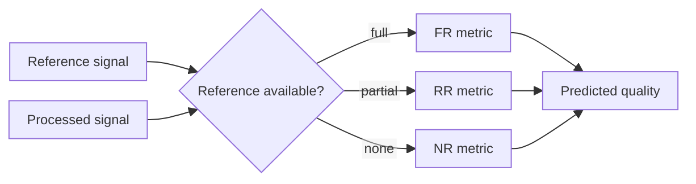

# Quality Assessment and Quality of Experience for Multimedia Services

## Table of Contents

- [[#Core Idea|Core Idea]]
- [[#Key Concepts|Key Concepts]]
- [[#Theory and Formulas|Theory and Formulas]]
- [[#Visual Schemes|Visual Schemes]]
- [[#Examples|Examples]]

## Core Idea

**Quality assessment** assigns a quantitative grade to a multimedia stimulus as perceived by human observers. In multimedia services, this grade is needed because quality is the **benefit** in the tradeoff against rate, latency, complexity, memory, and energy.

> [!Important] Quality assessment
> **Statement:** quality assessment maps one or more multimedia signals to a number describing perceived quality.
>
> **Meaning:** if humans produce the number, the method is subjective. If an algorithm produces it, the method is objective. Subjective evaluation remains ground truth.

**QoS** (*Quality of Service*) describes measurable system/network properties: bitrate, delay, jitter, loss, resolution, frame rate. **QoE** (*Quality of Experience*) describes final user perception, including content, display, context, expectations, and interaction.

![[Pics/11. Quality Assessment and Quality of Experience for Multimedia Services/rate-quality-tradeoff.png|500]]

Rate-quality curves show why quality assessment is necessary: codec/service choices must compare quality gain against bitrate cost.

## Key Concepts

### Assessment Taxonomy

![[Pics/11. Quality Assessment and Quality of Experience for Multimedia Services/quality-assessment-taxonomy.png|650]]

Quality assessment splits into subjective and objective families.

| Family | Method | Reference availability | Typical use |
| :--- | :--- | :--- | :--- |
| subjective | ACR / MOS | none shown directly | fast large-scale scoring |
| subjective | ACR-HR | hidden reference | large compression tests |
| subjective | DSIS | visible reference | fidelity/degradation tests |
| subjective | Pairwise comparison | relative A/B | fine ranking |
| objective | Full-reference | complete original | codec evaluation |
| objective | Reduced-reference | features from original | network monitoring |
| objective | No-reference | no original | streaming analytics, UGC |

### Subjective Testing

Subjective testing directly measures human opinion, but must control:

- lab illumination and display;
- viewing distance;
- monitor characteristics;
- observer acuity and color vision;
- content selection;
- stimulus order;
- training and fatigue;
- score processing and outlier handling.

> [!Important] Subjective assessment
> Subjective experiments are expensive and slow, but they are the gold standard because objective metrics are only useful when they correlate with human perception.

### Stimulus Selection: SI and TI

Video test sets should span content diversity. **Spatial Information (SI)** measures spatial detail; **Temporal Information (TI)** measures temporal activity.

![[Pics/11. Quality Assessment and Quality of Experience for Multimedia Services/spatial-information-pipeline.png|620]]

SI uses Sobel edge energy and keeps maximum activity across time.

![[Pics/11. Quality Assessment and Quality of Experience for Multimedia Services/temporal-information-pipeline.png|560]]

TI uses frame differences and keeps maximum temporal activity.

### Subjective Methodologies

| Method | Procedure | Strength | Weakness |
| :--- | :--- | :--- | :--- |
| **ACR** | rate one stimulus independently | fast, natural usage | no direct fidelity test |
| **ACR-HR** | ACR with hidden reference | removes scene/reference bias | less sensitive than direct comparison |
| **DSIS** | show reference then impaired | strong fidelity test | longer sessions |
| **PC** | choose better of two | highest discrimination | grows slowly with many items |

![[Pics/11. Quality Assessment and Quality of Experience for Multimedia Services/dsis-timing.png|560]]

DSIS explicitly compares reference and impaired stimulus, so it is well suited for transmission fidelity.

![[Pics/11. Quality Assessment and Quality of Experience for Multimedia Services/subjective-method-selection.png|500]]

Method choice depends on required accuracy, reference availability, and test scale.

### Objective Metric Types

| Type | Input | Accuracy | Main problem |
| :--- | :--- | :--- | :--- |
| **FR** | reference + processed signal | highest | reference often unavailable |
| **RR** | partial reference features + processed signal | medium | needs side information |
| **NR** | processed signal only | hardest / evolving | must separate content from artifacts |

![[Pics/11. Quality Assessment and Quality of Experience for Multimedia Services/full-reference-metric.png|560]]

FR metrics compare original and processed signals directly.

![[Pics/11. Quality Assessment and Quality of Experience for Multimedia Services/reduced-reference-metric.png|560]]

RR metrics transmit only selected reference features.

![[Pics/11. Quality Assessment and Quality of Experience for Multimedia Services/no-reference-metric.png|560]]

NR metrics estimate quality from received content alone.

## Theory and Formulas

### Spatial Information

For each frame $F_n$, apply Sobel filtering and compute spatial standard deviation:

$$
SI=\max_{time}\{\sigma_{space}[Sobel(F_n)]\}
$$

High $SI$ means many edges/textures. Low $SI$ means smooth content.

### Temporal Information

Frame difference:

$$
M_n(i,j)=F_n(i,j)-F_{n-1}(i,j)
$$

Temporal Information:

$$
TI=\max_{time}\{\sigma_{space}[M_n(i,j)]\}
$$

High $TI$ means strong motion or temporal changes.

### MOS

If $N$ observers give scores $x_i$:

$$
MOS=\frac{1}{N}\sum_{i=1}^{N}x_i
$$

> [!Important] MOS limitation
> MOS estimates average perceived quality. It does not describe observer disagreement or statistical confidence.

![[Pics/11. Quality Assessment and Quality of Experience for Multimedia Services/mos-histogram.png|560]]

Subjective scores are random variables; MOS is estimated from their distribution.

### Variability, Standard Error, Confidence

Standard deviation:

$$
s=\sqrt{\frac{1}{N}\sum_{i=1}^{N}(x_i-m)^2}
$$

Standard error:

$$
SE=\frac{s}{\sqrt{N}}
$$

Approximate 95% confidence interval around MOS:

$$
ci=[-1.96SE,\;1.96SE]
$$

![[Pics/11. Quality Assessment and Quality of Experience for Multimedia Services/standard-error-sampling.png|520]]

More observers reduce uncertainty of MOS estimate, not intrinsic disagreement.

> [!Important] Standard error
> $s$ measures spread among observers. $SE$ measures uncertainty of mean estimate. Increasing $N$ decreases $SE$ but does not force observers to agree.

### Human Visual System Effects

Objective metrics should consider visual perception:

- local contrast matters;
- same luminance can look different on different backgrounds;
- edges can create overshoot/undershoot perception;
- motion and geometry illusions show that perception is not pixel-wise.

![[Pics/11. Quality Assessment and Quality of Experience for Multimedia Services/mach-band-effect.png|320]]

Mach bands show perceived brightness overshoot near intensity transitions.

![[Pics/11. Quality Assessment and Quality of Experience for Multimedia Services/simultaneous-contrast.png|520]]

Simultaneous contrast: identical gray patches appear different depending on background.

### MSE and PSNR

For luminance component at frame $t$:

$$
MSE_Y(t)=\frac{1}{NM}\sum_{n,m}
\left(I(n,m,1,t)-\hat{I}(n,m,1,t)\right)^2
$$

PSNR:

$$
PSNR_Y(t)=10\log_{10}\frac{255^2}{MSE_Y(t)}
\approx 48\text{dB}-10\log_{10}MSE_Y(t)
$$

Typical interpretation:

| PSNR | Quality |
| :--- | :--- |
| $>45$ dB | excellent |
| 40-45 dB | very good |
| 30-40 dB | good to very good |
| $<30$ dB | usually poor |

Weighted YCbCr PSNR:

$$
PSNR_{YCbCr}(t)=
\frac{3}{4}PSNR_Y(t)
+\frac{1}{8}PSNR_{Cb}(t)
+\frac{1}{8}PSNR_{Cr}(t)
$$

Video sequence average:

$$
PSNR_Y=\frac{1}{T}\sum_{t=1}^{T}PSNR_Y(t)
$$

![[Pics/11. Quality Assessment and Quality of Experience for Multimedia Services/psnr-frame-plot.png|500]]

Per-frame PSNR varies across I/P/B frames, so sequence averages hide temporal behavior.

### Bjontegaard Metrics

Rate-distortion curves are compared with:

- **BD-Rate**: average bitrate difference at same quality, in percent;
- **BD-PSNR**: average PSNR difference at same bitrate, in dB.

Typical procedure:

1. measure 4 or 5 RD points per codec;
2. fit polynomial, often in $t=\log R$;
3. integrate curve difference on common interval;
4. divide by interval length.

![[Pics/11. Quality Assessment and Quality of Experience for Multimedia Services/bjontegaard-area.png|520]]

Bjontegaard area summarizes full RD-curve difference into one number.

### Why PSNR Is Not Enough

PSNR treats all pixel errors equally. It ignores:

- masking;
- structure and edges;
- temporal sensitivity;
- artifact type;
- viewing conditions.

![[Pics/11. Quality Assessment and Quality of Experience for Multimedia Services/similar-psnr-different-quality.png|560]]

Different distortions can have similar PSNR but very different perceived quality.

> [!Important] PSNR limitation
> Similar PSNR does not imply similar QoE. Blur, blocking, ringing, frame drops, and motion judder can have different annoyance at same pixel-error level.

### SSIM

**SSIM** (*Structural Similarity Index*) is full-reference and compares luminance, contrast, and structure:

$$
SSIM(x,y)=[l(x,y)]^\alpha[c(x,y)]^\beta[s(x,y)]^\gamma
$$

Range:

| SSIM | Meaning |
| :--- | :--- |
| 1.0 | identical |
| $>0.95$ | very high |
| 0.8-0.9 | noticeable degradation |

Components:

- $l(x,y)$: luminance similarity, related to light adaptation;
- $c(x,y)$: contrast similarity, related to contrast masking;
- $s(x,y)$: structure similarity.

SSIM better follows HVS than PSNR, but remains limited for video temporal perception and complex artifacts.

### VMAF

**VMAF** (*Video Multi-Method Assessment Fusion*) is full-reference video metric from Netflix.

It fuses:

- VIF/detail preservation;
- DLM/structural information;
- temporal information;
- learned mapping from subjective data;
- spatial and temporal pooling.

Values run from 0 to 100. Around 90+ often indicates good perceptual quality; 93 is common target.

![[Pics/11. Quality Assessment and Quality of Experience for Multimedia Services/vmaf-pipeline.png|620]]

VMAF combines perceptual features and learned fusion to predict subjective quality.

### AI-Based Metrics

Modern metrics use deep networks and subjective datasets:

- **LPIPS**: perceptual feature distance;
- **DISTS**: deep image structure/texture similarity;
- learned NR models such as CLIP-IQA-like approaches.

AI metrics can model complex artifacts and generated media, but depend strongly on training data and validation.

### Reduced-Reference Metrics

RR metrics transmit selected reference features:

- edge statistics;
- frequency features;
- texture descriptors;
- motion descriptors.

Use cases: IPTV monitoring, adaptive streaming, network QoE monitoring.

Limitation: less accurate than FR and requires side information.

### No-Reference Metrics

NR metrics infer quality without original signal. Examples:

| Metric | Main idea |
| :--- | :--- |
| BRISQUE | natural scene statistics |
| NIQE | deviation from natural image statistics |
| PIQE | block-wise distortion estimation |
| Deep NR | learned perceptual prediction |

NR is essential for social media, user-generated content, mobile capture, surveillance, and streaming analytics. It is hardest because metric must distinguish real scene properties from distortions.

## Visual Schemes

### Subjective Quality Experiment

Subjective tests require controlled environment, controlled stimuli, and statistical score processing.

### Objective Metric Pipeline

Reference availability determines objective metric family.

### QoE Optimization Loop

Systems should optimize user-perceived QoE, not only raw QoS or PSNR.

## Examples

### Subjective Method Choice

| Goal | Recommended method |
| :--- | :--- |
| fast large-scale testing | ACR |
| remove reference-scene bias | ACR-HR |
| fidelity to source | DSIS |
| rank near-equivalent versions | Pairwise comparison |
| uncontrolled large panel | crowdsourcing with strict filtering |

### SI/TI Content Interpretation

| Content | SI | TI | Meaning |
| :--- | :--- | :--- | :--- |
| football | medium | high | motion-dominated |
| anime | medium | low | edges but little motion |
| nature documentary | high | medium | texture/detail-heavy |
| video call | low | low | smooth and static |

### Objective Metrics Summary

| Metric | Type | Strength | Weakness |
| :--- | :--- | :--- | :--- |
| MSE | FR | simple, differentiable | perceptually weak |
| PSNR | FR | standard codec comparison | ignores HVS/artifact type |
| BD-Rate | RD comparison | summarizes curves | depends on fitted points/range |
| SSIM | FR | structure-aware | limited temporal modeling |
| VMAF | FR video | strong practical QoE predictor | trained/validated on datasets |
| BRISQUE/NIQE/PIQE | NR | no reference needed | lower reliability |
| AI metrics | FR/RR/NR | complex perceptual modeling | training-data dependence |

### Final Exam Table

| Concept | Must remember |
| :--- | :--- |
| QoE | final perceived user quality |
| QoS | measurable system/network conditions |
| subjective assessment | gold standard, slow and costly |
| objective assessment | scalable prediction of subjective quality |
| MOS | average opinion score |
| SE | uncertainty of MOS estimate, $s/\sqrt{N}$ |
| CI | reliability interval for estimated MOS |
| SI/TI | content descriptors for spatial/temporal complexity |
| ACR/ACR-HR/DSIS/PC | subjective methodologies with different tradeoffs |
| MSE/PSNR | simple fidelity metrics |
| BD-Rate/BD-PSNR | RD-curve comparison metrics |
| SSIM | luminance, contrast, structure |
| VMAF | learned fusion of video quality features |
| FR/RR/NR | objective metric families based on reference availability |

> [!Important] Main takeaway
> Multimedia quality is ultimately human perception. PSNR and QoS are useful engineering signals, but codec and service decisions should be validated against subjective QoE or objective metrics trained to predict it.
