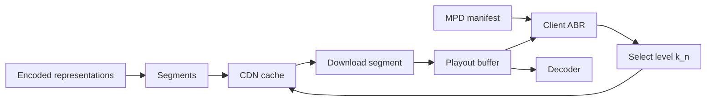
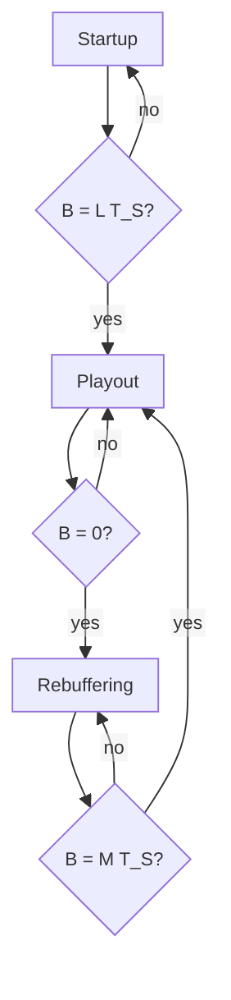
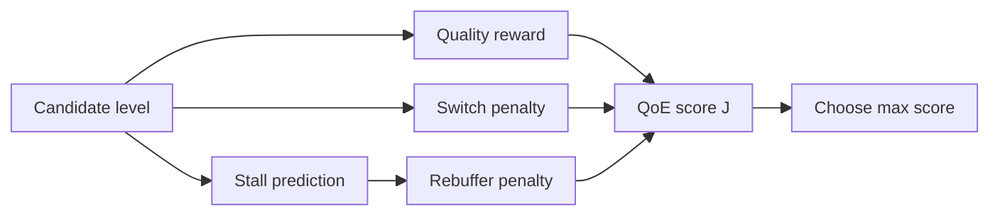

# Adaptive Streaming

## Table of Contents

- [[#Core Idea|Core Idea]]
- [[#Key Concepts|Key Concepts]]
- [[#Theory and Formulas|Theory and Formulas]]
- [[#Visual Schemes|Visual Schemes]]
- [[#Examples|Examples]]

## Core Idea

**Adaptive streaming** delivers video to heterogeneous users by changing requested quality over time. The client chooses which encoded segment representation to download according to network throughput, buffer state, and QoE tradeoffs.

Main motivation:

- compressed video has variable frame sizes;
- users have different and time-varying capacities;
- a single fixed coding rate causes either stalls or wasted capacity;
- HTTP/CDN infrastructure scales better than per-user real-time server adaptation.

> [!Important] Coding-rate constraint
> Continuous playout requires selected coding rate to fit user capacity:
>
> $$
> R_C \leq C_k
> $$
>
> If $R_C>C_k$, packets accumulate, delay grows, losses happen, and playback may freeze.

![[Pics/12. Adaptive_streaming/compressed-frame-size-variability.png|500]]

Compressed video rate is not constant at frame level: I frames are much larger than P/B frames, and stability appears only over GOP-scale averages.

## Key Concepts

### Service Classes

| Service | Examples | Main need | Delay tolerance |
| :--- | :--- | :--- | :--- |
| bulk transfer | photos, messages | integrity | seconds |
| VoD | Netflix, YouTube | continuity | startup delay acceptable |
| live streaming | Twitch, DAZN | recency and scale | seconds |
| real-time interactive | Zoom, Teams | low latency | below 150 ms |
| cloud gaming / VR | GeForce Now, VR | interaction | below 50 ms |

### One-to-Many Heterogeneity

One server may serve millions of users with different:

- network paths and capacities;
- wireless dynamics;
- memory, battery, decoding hardware;
- screens and target resolutions.

![[Pics/12. Adaptive_streaming/one-to-many-heterogeneity.png|520]]

Different users should not receive one common rate: low-capacity users stall, high-capacity users are underused.

### Push vs. Pull Multimedia Stacks

| Paradigm | Control | Stack | Use |
| :--- | :--- | :--- | :--- |
| **real-time push** | server pushes immediately | UDP/RTP/RTCP/WebRTC | calls, gaming |
| **adaptive pull** | client requests next object | HTTP/DASH/HLS over QUIC/HTTP/3 | VoD, live broadcast |

![[Pics/12. Adaptive_streaming/push-vs-pull-stacks.png|560]]

Push optimizes latency. Pull optimizes scalability, caching, and QoE through client-side choices.

### Network-Friendly Video

Compressed video is fragile: packet losses can desynchronize entropy decoding and temporal prediction. **MANEs** (*Media Aware Network Elements*) can inspect NAL headers and drop less important units under congestion.

![[Pics/12. Adaptive_streaming/mane-smart-dropping.png|560]]

MANE can drop non-reference B data while protecting SPS/PPS/IDR and key references.

### Scalable Video Coding

**SVC** encodes once and decodes many qualities:

- **Base Layer (BL)**: essential stream, low rate $R_B$;
- **Enhancement Layers (EL)**: progressively improve quality, resolution, or frame rate.

Base layer condition:

$$
R_B \leq \min_k C(k)
$$

![[Pics/12. Adaptive_streaming/svc-layer-hierarchy.png|500]]

Enhancement layers depend on lower layers, so they are useless without base layer.

![[Pics/12. Adaptive_streaming/svc-quality-spatial-scalability.png|500]]

Quality/spatial scalability codes residual information on top of reconstructed lower layer.

In conferencing, SVC works with an SFU:

![[Pics/12. Adaptive_streaming/svc-selective-forwarding.png|600]]

SFU forwards all layers to high-capacity users and only base layer to low-capacity users.

Why SVC is poor for web-scale streaming:

- 10%-25% overhead versus single-layer streams;
- layer dependencies are hard to cache as independent HTTP objects;
- many MANEs would be needed at Internet scale;
- hardware SVC support is weak on mass-market devices.

### HTTP, QUIC, and CDNs

HTTP works well for streaming because it:

- uses ports 80/443, passing firewalls/NATs;
- lets servers stay stateless;
- maps video chunks to cacheable CDN objects.

![[Pics/12. Adaptive_streaming/http-cdn-chunk-request.png|620]]

HTTP chunk request can be served by CDN edge cache, reducing origin load and latency.

Classic TCP limitation: **Head-of-Line (HOL) blocking**. If one packet is lost, later received bytes cannot be delivered to application until missing data is retransmitted.

![[Pics/12. Adaptive_streaming/tcp-head-of-line-blocking.png|460]]

TCP reliability can freeze application delivery and drain video buffer.

HTTP/3 uses **QUIC** over UDP:

- independent streams avoid cross-stream HOL blocking;
- 0-RTT handshake lowers startup delay;
- connection IDs support Wi-Fi/5G migration.

![[Pics/12. Adaptive_streaming/quic-stream-isolation.png|500]]

QUIC loss in one stream pauses only that stream, not all media/control streams.

CDNs place edge nodes close to users:

![[Pics/12. Adaptive_streaming/cdn-architecture.png|600]]

CDNs reduce propagation delay and origin load through edge caching and request routing.

## Theory and Formulas

### DASH Architecture

**MPEG-DASH** (*Dynamic Adaptive Streaming over HTTP*) splits video into segments and encodes each segment at multiple representations.

Segment $n$ has duration $T_S$. Level $k$ has:

- coding rate $R_C(k)$;
- resolution $Res_k$;
- frame rate $F_k$.

![[Pics/12. Adaptive_streaming/dash-segments-representations.png|560]]

Client downloads one representation for each segment; switching is possible at segment boundaries.

### MPD Manifest

The **Media Presentation Description (MPD)** is XML metadata describing available media:

- **Period**: temporal interval, e.g. content and ads;
- **AdaptationSet**: media type/track, e.g. video, English audio;
- **Representation**: quality level, e.g. 1080p 5 Mbps;
- **Segment**: URL or byte-range of each chunk.

![[Pics/12. Adaptive_streaming/mpd-manifest-hierarchy.png|620]]

Client reads MPD before choosing representations.

### Segment Generation Rules

Bitrate adaptation can happen only at segment boundaries. Therefore:

- each segment starts with closed GOP and IDR;
- open GOP with CRA is forbidden across segment boundary;
- no frame in segment $N+1$ can reference segment $N$;
- all representations must align in time and share IDR timestamps.

![[Pics/12. Adaptive_streaming/aligned-segment-boundaries.png|600]]

Cross-representation alignment lets client switch quality without breaking decoding.

Segment duration tradeoff:

| $T_S$ | Advantage | Disadvantage |
| :--- | :--- | :--- |
| short, 1-2 s | fast adaptation, lower stall risk | more IDR overhead, lower compression efficiency |
| long, 6-10 s | better compression efficiency | slower reaction, higher latency |

### Low-Latency DASH/CMAF

Traditional DASH publishes a segment only after full segment encoding. **CMAF** divides a segment into 200-500 ms chunks. HTTP chunked transfer can send each chunk before the parent segment is complete.

![[Pics/12. Adaptive_streaming/low-latency-cmaf-chunks.png|600]]

Low-latency DASH/CMAF targets about 1-3 s glass-to-glass latency while keeping HTTP/CDN infrastructure.

### Throughput

Instantaneous application-layer throughput:

$$
S(t)=\frac{dD(t)}{dt}\leq R
$$

where $D(t)$ is cumulative successfully received data and $R$ is physical link bitrate.

Average throughput over window $T$:

$$
\bar{S}=\frac{1}{T}\int_0^T S(t)\,dt=\frac{D(T)}{T}
$$

ABR usually uses smoothed throughput estimates, not raw instantaneous samples.

### Delay and Jitter

End-to-end delay:

$$
d_{e2e}=\sum_k d_{\text{proc}}(k)+d_{\text{queue}}(k)+d_{\text{tx}}(k)+d_{\text{prop}}(k)
$$

Transmission delay:

$$
d_{\text{tx}}(k)=\frac{L}{R}
$$

Propagation delay:

$$
d_{\text{prop}}(k)=\frac{d}{s}
$$

Increasing link rate reduces transmission delay, but not propagation distance or congestion queues.

![[Pics/12. Adaptive_streaming/jitter-delay-distribution.png|460]]

Jitter is delay variability; playout buffer must absorb delay peaks, not only average delay.

### Playout Buffer Model

Buffer $B(t)$ is measured in seconds of downloaded but unplayed video.

Playback starts after initial reservoir:

$$
B(t)=L T_S
$$

Buffer starvation:

$$
B(t)=0
$$

After stall, playback resumes when:

$$
B(t)=M T_S
$$

Usually $L\geq M$: users tolerate startup delay more than mid-playback stalls.

### Fluid Dynamics

Buffer equation:

$$
\frac{dB}{dt}=f_{\text{in}}-f_{\text{out}}
$$

If throughput is $S$ and selected coding rate is $R_C$, received playable seconds per real second are:

$$
f_{\text{in}}=\frac{S}{R_C}
$$

Output flow:

- during playback: $f_{\text{out}}=1$;
- during rebuffering: $f_{\text{out}}=0$.

> [!Important] Playout buffer equation
> $$
> \frac{dB}{dt}=
> \begin{cases}
> \dfrac{S}{R_C}-1 & \text{if playout}\\
> \dfrac{S}{R_C} & \text{if rebuffering}
> \end{cases}
> $$
>
> Buffer grows if download is faster than consumption, shrinks if $R_C>S$, and fills during rebuffering.

![[Pics/12. Adaptive_streaming/buffer-starvation-timeline.png|620]]

Throughput drop can make buffer hit zero, causing rebuffering.

Download time for segment $n$ at level $k$:

$$
T_D(n,k)=\frac{T_S R_C(k)}{S_n}
$$

Initial buffering time:

$$
T_{IB}=L T_S
$$

### QoE for Streaming

QoE depends on:

1. per-segment quality;
2. rebuffering count and duration;
3. quality switching amplitude/frequency;
4. initial startup time.

Segment quality can be modeled as:

$$
Q(n)=f(R(k_n))
$$

or simplified as:

$$
Q(n)=R(k_n)
$$

or:

$$
Q(n)=k_n
$$

Rebuffering event duration for segment $n$:

$$
\Delta_n=0
$$

if no stall.

Rebuffering penalty:

$$
\phi(\Delta)=
\begin{cases}
0 & \text{if } \Delta=0\\
a\Delta+b & \text{if } \Delta>0
\end{cases}
$$

where $a$ is small and $b$ is large.

![[Pics/12. Adaptive_streaming/rebuffering-penalty.png|420]]

Any stall causes large QoE drop; longer stalls add smaller extra penalty.

Segment-level QoE:

$$
J(n)=\lambda_1 k_n-\lambda_2|k_n-k_{n-1}|-\phi(\Delta_n)
$$

Sequence-level QoE:

$$
J=\sum_{n=1}^{N}J(n)-\lambda_3T_{ST}
$$

> [!Important] QoE tradeoff
> Higher level improves quality, switching decreases stability, stalls are heavily penalized, startup delay is penalized but usually less than mid-playback stalls.

### ABR Strategies

Client-side **Adaptive Bitrate (ABR)** chooses next segment level.

| Strategy | Input | Behavior | Examples |
| :--- | :--- | :--- | :--- |
| throughput-based | estimated $\hat{S}$ | choose rate downloadable in time | PANDA, FESTIVE, SQUAD |
| buffer-based | $B(t)$ | high buffer increases quality, low buffer lowers quality | BBA, BOLA |
| hybrid | throughput + buffer | combines prediction and safety | ELASTIC, MPC, ABMA+, DYNAMIC |

ABR logic is not standardized. Different clients can be aggressive or conservative.

### Example ABR Decision

Given previous level $k_{n-1}$, current buffer $B_0$, throughput estimate $\hat{S}$, and candidate level $\ell$ with rate $R(\ell)$:

$$
\beta=\frac{\hat{S}}{R(\ell)}-1
$$

If $\beta\geq 0$, buffer does not drain during download:

$$
\Delta=0
$$

If $\beta<0$, buffer reaches zero at:

$$
t_0=\frac{B_0}{1-\frac{\hat{S}}{R}}
=\frac{R B_0}{R-\hat{S}}
$$

If $t_0>T_S$, no stall. If $t_0<T_S$, remaining segment time is:

$$
T_R=T_S-\frac{R B_0}{R-\hat{S}}
$$

Stall duration:

$$
\Delta=\frac{(T_R+M T_S)R}{\hat{S}}
$$

Then evaluate:

$$
J=\lambda_1 \ell-\lambda_2|\ell-k_{n-1}|-\phi(\Delta)
$$

and select best $\ell$.

Limits:

- assumes constant throughput;
- ignores intra-frame bitrate peaks;
- has no safety threshold unless explicitly added;
- client has partial view of network state.

## Visual Schemes

### DASH Pull Pipeline

Client-driven loop: MPD describes options, ABR chooses next representation, buffer feedback affects future choices.

### Buffer State Machine

Startup threshold and post-stall refill threshold control delay/stall tradeoff.

### ABR Objective

ABR optimizes perceived experience, not only maximum bitrate.

## Examples

### Buffer Parameter Tradeoff

Simulations in source use throughput:

- $S_1=3$ Mbps for 0-10 s;
- $S_2=1$ Mbps for 10-40 s;
- $S_3=3$ Mbps after 40 s;
- $R_C=2.5$ Mbps.

| Parameters | Result | Takeaway |
| :--- | :--- | :--- |
| $T_S=0.5$, $L=2$, $M=1$ | 12 stalls, 15 s total | fast start, frequent short stalls |
| $T_S=0.5$, $L=10$, $M=1$ | 10 stalls, 11.95 s | larger startup buffer helps |
| $T_S=0.5$, $L=10$, $M=5$ | 2 stalls, 12.5 s | fewer but longer stalls |
| $T_S=2$, $L=10$, $M=5$ | 0 stalls | big reserve avoids stalls but raises latency |

### Exercise 1 Result

Given:

- $T_S=1$ s;
- $R_C(1)=0.5$ Mbps;
- $S_1=0.4$ Mbps for $0<t<T$;
- $S_2=0.5$ Mbps for $t>T$;
- fixed $q(n)=1$.

During startup before $T$:

$$
B'=S_1/R_C=0.8
$$

During playout before $T$:

$$
B'=S_1/R_C-1=-0.2
$$

If startup ends at $t_{ST}<T$:

$$
B(t)=t_{ST}-0.2t
$$

Zero time:

$$
t^*=5t_{ST}
$$

No stall before throughput recovers if:

$$
T<5t_{ST}
$$

Minimum:

$$
t_{ST}=\frac{T}{5}
$$

### Exercise 2: Max Quality Causes Periodic Stalls

Throughput profile:

![[Pics/12. Adaptive_streaming/exercise-throughput-profile.png|500]]

For $q(n)=3$ always, $R_C=2$ Mbps. Startup downloads first two segments:

$$
N_b=2+2=4\text{ Mbits}
$$

First 2 s download 3 Mbits, next 1 s downloads 0.1 Mbits, remaining 0.9 Mbits take:

$$
\frac{0.9}{1.8}=0.5\text{ s}
$$

Startup time:

$$
t_{ST}=3.5\text{ s}
$$

After startup, $S_3=1.8<R_C=2$, so:

$$
B'=\frac{1.8}{2}-1=-0.1
$$

Starting from $B=2$, buffer empties after 20 s and first stall occurs at:

$$
23.5\text{ s}
$$

After each stall, playback resumes with $M=1$ loaded segment, i.e. $1$ s of buffer. Since the buffer drains with slope $-0.1$, it empties again after 10 s of playback.

The stall duration is:

$$
\Delta=\frac{2}{1.8}=\frac{10}{9}\text{ s}
$$

so the rebuffering period is:

$$
T_{\text{rebuff}}=10+\frac{10}{9}=11.\overline{1}\text{ s}
$$

![[Pics/12. Adaptive_streaming/exercise-periodic-rebuffering.png|450]]

Max quality produces periodic rebuffering because throughput stays below chosen rate.

### Exercise 2: Periodic Quality Reduction

Strategy:

$$
q(n)=
\begin{cases}
3 & \text{if } n\bmod 5\neq 3\\
2 & \text{if } n\bmod 5=3
\end{cases}
$$

![[Pics/12. Adaptive_streaming/exercise-periodic-quality-pattern.png|500]]

Level 2 every fifth segment fills buffer enough to compensate four level-3 segments.

Comparing no-stall strategies:

$$
J_1\approx N\left(\frac{14}{5}\lambda_1-\frac{2}{5}\lambda_2\right)-\lambda_3T_1
$$

Constant level 2:

$$
J_2=2N\lambda_1-\lambda_3T_2
$$

For large $N$:

$$
J_1-J_2\approx N\left(\frac{4}{5}\lambda_1-\frac{2}{5}\lambda_2\right)
$$

Periodic switching wins iff:

$$
\lambda_1>\frac{\lambda_2}{2}
$$

> [!Example] ABR insight
> Higher quality is not automatically better. Strategy quality depends on subjective weights: quality reward $\lambda_1$, switching annoyance $\lambda_2$, stall penalty $\phi$, and startup penalty $\lambda_3$.

### Final Exam Table

| Concept | Must remember |
| :--- | :--- |
| fixed $R_C$ | causes cliff effect or leveling effect |
| WebRTC/RTP/UDP | low-latency push for real-time |
| DASH/HLS over HTTP | scalable pull for streaming |
| SVC | base/enhancement layers; good for conferencing, bad for CDN-scale |
| HTTP/CDN | stateless cacheable chunks |
| TCP HOL | lost packet blocks later bytes |
| QUIC | stream isolation, 0-RTT, connection migration |
| MPD | manifest describing periods, adaptation sets, representations, segments |
| closed GOP | needed for segment boundary switching |
| CMAF chunks | low-latency sub-segment delivery |
| throughput | application-layer received data rate |
| jitter | delay variance requiring buffer |
| buffer $B(t)$ | seconds of video ready for playout |
| starvation | $B(t)=0$, playback freezes |
| ABR | client chooses next segment representation |
| QoE metric | quality reward minus switching/stall/startup penalties |

> [!Important] Main takeaway
> Adaptive streaming shifts intelligence to the client: HTTP/CDN infrastructure serves static segment objects, while ABR uses throughput and buffer state to balance quality, stability, startup delay, and rebuffering.
