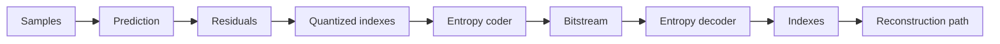
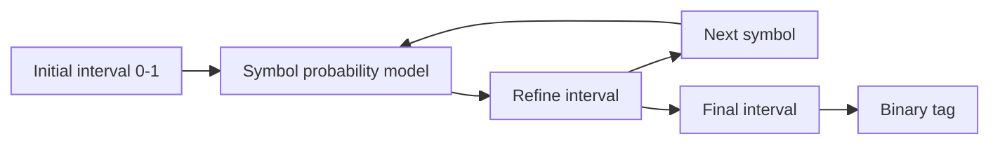
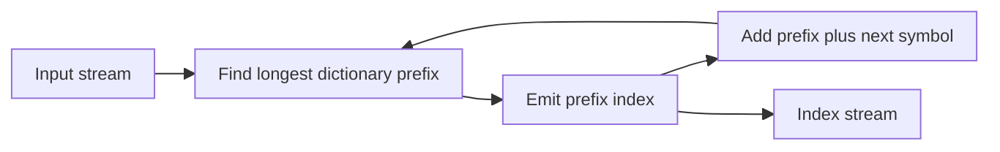

# Lossless Coding

## Table of Contents

- [[#Core Idea|Core Idea]]
- [[#Key Concepts|Key Concepts]]
- [[#Theory and Formulas|Theory and Formulas]]
- [[#Visual Schemes|Visual Schemes]]
- [[#Examples|Examples]]

## Core Idea

**Lossless coding** maps a sequence of discrete symbols to a bitstream that can be decoded exactly. In multimedia compression it usually comes after prediction, transform, or quantization, and it removes remaining **statistical redundancy** without adding distortion.

Typical pipeline:

1. **Prediction** reduces sample correlation and produces residuals.
2. **Quantization** may map residuals to discrete indexes in lossy systems.
3. **Lossless coding** maps indexes to compact bits.

> [!Important] Lossless coding limit
> No lossless code can beat source entropy on average. Good entropy coders try to make average length $\mathcal{L}$ approach entropy $H$ or entropy rate $\mathcal{H}$.

## Key Concepts

### Codes and Decodability

Let the alphabet be:

$$
\mathcal{X}=\{x_1,x_2,\ldots,x_M\}
$$

A code is:

$$
C:x_i\in\mathcal{X}\rightarrow c_i\in\{0,1\}^*
$$

where $c_i$ is a finite binary string and $\ell_i$ is its length.

| Code type | Meaning | Practical effect |
| :--- | :--- | :--- |
| **Fixed-length coding (FLC)** | all symbols use same length $\lceil\log_2 M\rceil$ | simple, robust, ignores probabilities |
| **Variable-length coding (VLC)** | probable symbols use shorter codewords | compresses non-uniform sources |
| **Prefix / instantaneous code** | no codeword is prefix of another | decodes symbol-by-symbol |
| **Uniquely decodable code** | any finite bitstream has one symbol sequence | may require lookahead |

FLC rate:

$$
R_{\mathrm{FLC}}=\lceil\log_2 M\rceil
$$

VLC average length:

$$
\mathcal{L}=\sum_i p_i\ell_i
$$

### Information and Entropy

**Self-information** of symbol $x_i$:

$$
I(x_i)=-\log_2 p_i
$$

Rare symbols carry more information; certain symbols carry zero information.

> [!Important] Source entropy
> $$
> H(X)=-\sum_i p_i\log_2 p_i
> $$
>
> Entropy is the average uncertainty of $X$ and the fundamental lower bound for average lossless code length.

For a binary source with $P(1)=p$:

$$
H(X)=-p\log_2p-(1-p)\log_2(1-p)
$$

Entropy is maximum at $p=0.5$, where $H=1$ bit/symbol.

### Joint and Conditional Entropy

Joint entropy:

$$
H(X,Y)=-\sum_{i,j}p_{i,j}\log_2p_{i,j}
$$

Conditional entropy:

$$
H(X|Y)=\sum_jp_jH(X|Y=y_j)
$$

Chain rule:

$$
H(X,Y)=H(Y)+H(X|Y)=H(X)+H(Y|X)
$$

Important consequences:

- If $X$ and $Y$ are independent, $H(X|Y)=H(X)$.
- If $X$ is determined by $Y$, $H(X|Y)=0$.
- Conditioning cannot increase entropy:

$$
H(X|Y)\leq H(X)
$$

### Maximum Entropy

For an $M$-symbol alphabet, entropy is maximized by the uniform distribution:

$$
p_i^*=\frac{1}{M}
$$

and:

$$
H_{\max}=\log_2M
$$

**Meaning for compression:** non-uniformity is compressible; uniform sources are hardest to compress losslessly.

### Kraft and Prefix Codes

> [!Important] Kraft inequality
> A prefix code with lengths $\ell_1,\ldots,\ell_M$ exists if and only if:
>
> $$
> \sum_{i=1}^{M}2^{-\ell_i}\leq1
> $$
>
> If equality holds, the code tree is complete.

McMillan's theorem says uniquely decodable codes cannot outperform instantaneous prefix codes in average length. Therefore, optimal lossless coding can focus on prefix codes.

### Shannon Source Coding Theorem

The ideal relaxed code length is:

$$
\ell_i^*=-\log_2p_i
$$

and the corresponding average length is:

$$
\mathcal{L}^*=\sum_ip_i\ell_i^*=H(X)
$$

> [!Important] Source coding theorem
> Any lossless code satisfies:
>
> $$
> \mathcal{L}^*\geq H(X)
> $$
>
> Equality is possible only when all symbol probabilities are dyadic:
>
> $$
> p_i=2^{-k_i}
> $$
>
> With integer lengths $\ell_i=\lceil-\log_2p_i\rceil$:
>
> $$
> H(X)\leq\mathcal{L}<H(X)+1
> $$

### Huffman Coding

**Huffman coding** is optimal among prefix codes for a known probability table and a fixed symbol alphabet.

Algorithm:

1. Create one leaf per symbol with weight $p_i$.
2. Merge the two lowest-weight nodes.
3. Repeat until one root remains.
4. Assign `0` and `1` to branches.
5. Codewords are root-to-leaf paths.

Strengths:

- Optimal for single-symbol prefix coding.
- Simple and fast.
- Used inside many formats and standards.

Limits:

- One-symbol Huffman cannot code below 1 bit/symbol for a binary alphabet.
- Code lengths are integer, so non-dyadic probabilities create overhead.
- Block Huffman improves efficiency but alphabet size grows as $M^K$.

### Block Coding

Instead of coding single symbols, code blocks:

$$
X^K=(X_1,\ldots,X_K)
$$

Block entropy obeys:

$$
H(X_1,\ldots,X_K)\leq\sum_{i=1}^{K}H(X_i)
$$

Huffman bound for a block:

$$
\mathcal{L}<H(X^K)+1
$$

Per original symbol:

$$
\mathcal{L}_S<\frac{H(X^K)}{K}+\frac{1}{K}
$$

**Meaning:** the Huffman overhead is spread over $K$ symbols, but probability estimation and codebook size become expensive.

### Arithmetic Coding

**Arithmetic coding** encodes an entire sequence as a subinterval of $[0,1)$. Each symbol narrows the current interval according to its probability.

For a sequence $x^n$:

$$
P(x^n)=\prod_{i=1}^{n}p(x_i)
$$

The required number of bits is close to:

$$
-\log_2P(x^n)
$$

Average per-symbol length:

$$
\mathcal{L}<H(X)+\frac{2}{n}
$$

So:

$$
\mathcal{L}\rightarrow H(X)
$$

as $n\rightarrow\infty$.

Arithmetic coding solves the main Huffman problems:

- Works efficiently even when entropy is below 1 bit/symbol.
- Avoids exponential block-code alphabets.
- Handles adaptive and context-dependent probabilities.

### Context-Based and Adaptive Coding

**Adaptive coding** updates probabilities during encoding and decoding using the same rule on both sides.

**Context coding** estimates:

$$
P(X_n| \text{past context})
$$

instead of a single unconditional $P(X_n)$. If context captures the significant past, conditional entropy drops:

$$
H(X_n|\text{context}) < H(X_n)
$$

For alphabet size $M$ and context length $N_S$:

$$
N_C=M^{N_S}
$$

possible contexts exist. Too many contexts cause sparse training data; too few miss dependencies.

### Exponential-Golomb Coding

**Exp-Golomb** is a universal integer code. It needs no probability table and is useful for metadata and sparse residuals.

Unsigned code for $n\geq0$:

1. If $n=0$, code is `1`.
2. If $n\geq1$, write $n+1$ in binary with $b=\lfloor\log_2(n+1)\rfloor+1$ bits.
3. Prefix it with $b-1$ zeros.

Signed mapping:

$$
m(n)=
\begin{cases}
2n-1 & n>0\\
-2n & n\leq0
\end{cases}
$$

Then encode $m$ as unsigned.

### Dictionary Coding and LZW

Dictionary coding learns repeated patterns from the sequence itself. **LZW** initializes the dictionary with one-symbol entries, then adds longer patterns as they are encountered.

Encoding idea:

1. Find longest prefix $W$ already in dictionary.
2. If $W+K$ is new, output index of $W$.
3. Add $W+K$ to dictionary.
4. Continue from $K$.

Decoder builds the same dictionary because updates are deterministic. Dictionary does not need to be transmitted.

> [!Important] Dictionary asymptotic optimality
> For stationary ergodic sources, dictionary-based coding is asymptotically optimal:
>
> $$
> L_n\xrightarrow{n\to\infty}\mathcal{H}(X)
> $$

### Standards and Practical Codecs

| Standard / codec | Main tools | Best use |
| :--- | :--- | :--- |
| **JBIG-1** | context arithmetic coding | bi-level images, progressive coding |
| **JBIG-2** | segmentation, symbol dictionaries, arithmetic coding | text/halftone documents, PDF |
| **JPEG-LS** | MED prediction, context modeling, Golomb-Rice | natural photos, medical images |
| **PNG** | prediction, LZ77/Deflate, Huffman | graphics, icons, text-heavy images |

JPEG-LS **MED predictor** uses causal neighbors:

| C | B |
|---|---|
| A | X |

$$
\hat{x}=
\begin{cases}
\min(A,B) & C\geq\max(A,B)\\
\max(A,B) & C\leq\min(A,B)\\
A+B-C & \text{otherwise}
\end{cases}
$$

This avoids overshoot around sharp edges.

### Neural Lossless Coding

Neural lossless coding uses a neural network to estimate a probability model $Q$ for arithmetic coding.

Training minimizes cross-entropy:

$$
H(P,Q)=H(P)+D_{KL}(P\parallel Q)
$$

where:

- $H(P)$ is the irreducible source entropy.
- $D_{KL}(P\parallel Q)$ is redundancy from model mismatch.

Autoregressive models use:

$$
P(x_1,\ldots,x_n)=\prod_{i=1}^{n}P(x_i|x_1,\ldots,x_{i-1})
$$

They can model long-range dependencies, but decoding may require one model evaluation per pixel.

Neural predictive coding replaces a linear predictor with:

$$
\hat{x}_i=f_{NN}(\text{local context})
$$

and codes residuals. For `house.pgm`, source reports:

- 2D linear predictor residual entropy: **2.830 bpp**.
- MLP predictor residual entropy: **2.704 bpp**.

Total rate must include model cost:

$$
R_{\text{total}}=R_{\text{residuals}}+\frac{L_{\text{model}}}{N}
$$

Limitations:

- high decoding complexity,
- hardware requirements,
- generalization gap,
- bit-exact determinism issues.

## Theory and Formulas

### Entropy Bound and Optimal Lengths

Given probabilities $p_i$, ideal lengths solve:

$$
\min_{\ell_i}\sum_ip_i\ell_i
\quad\text{s.t.}\quad
\sum_i2^{-\ell_i}=1
$$

Using a Lagrangian:

$$
J(\ell)=\sum_ip_i\ell_i+\lambda\left(\sum_i2^{-\ell_i}-1\right)
$$

Relaxing integer constraints:

$$
\ell_i^*=-\log_2p_i
$$

and:

$$
\mathcal{L}^*=H(X)
$$

This explains why optimal entropy coding assigns short codewords to probable symbols and long codewords to rare symbols.

### Kraft Tree Interpretation

In a binary tree of maximum depth $L_{\max}$, a codeword of length $\ell_i$ blocks:

$$
2^{L_{\max}-\ell_i}
$$

leaves. Prefix codewords block disjoint leaf sets, therefore:

$$
\sum_i2^{L_{\max}-\ell_i}\leq2^{L_{\max}}
$$

Dividing by $2^{L_{\max}}$ gives Kraft:

$$
\sum_i2^{-\ell_i}\leq1
$$

### Conditioning and Context Coding

For sources with memory:

$$
\mathcal{H}=\lim_{n\to\infty}H(X_n|X_{n-1},\ldots,X_1)
$$

Context coding approximates this entropy rate by conditioning on a finite significant past.

For a binary image with previous pixel as context:

$$
H(X|\square)=0.322,\qquad H(X|\blacksquare)=0.918
$$

Weighted average:

$$
H(X|Y)=0.406\ \text{bpp}
$$

This is below single-pixel entropy $H(X)=0.586$ bpp because neighboring pixels are correlated.

### Huffman vs. Arithmetic Overhead

Huffman on single symbols:

$$
H(X)\leq\mathcal{L}<H(X)+1
$$

Huffman on $K$-symbol blocks:

$$
\frac{\mathcal{L}}{K}<\frac{H(X^K)}{K}+\frac{1}{K}
$$

Arithmetic coding on length-$n$ sequences:

$$
\mathcal{L}<H(X)+\frac{2}{n}
$$

Arithmetic coding therefore approaches entropy without exponential block alphabets.

### House Image Result

For `house.pgm`, original bit depth is 8 bpp and direct entropy is:

$$
H=7.056\ \text{bpp}
$$

| Coding input | Entropy | Huffman | Exp-Golomb | ZIP |
| :--- | :--- | :--- | :--- | :--- |
| Direct pixels | 7.06 | 7.08 | 11.32 | 4.00 |
| 1D residuals | 3.31 | 3.38 | 3.43 | 3.23 |
| 2D residuals | 2.83 | 2.89 | 2.94 | 3.14 |

Main result:

$$
7.06\ \text{bpp}\rightarrow2.83\ \text{bpp}
$$

through 2D prediction before entropy coding.

## Visual Schemes

### Entropy Coding Pipeline

![[Pics/3. Lossless coding/entropy-coding-pipeline.png|650]]

Lossless coding sits after prediction and quantization/index generation, where it removes statistical redundancy from symbol indexes.



### Entropy and Prefix Codes

![[Pics/3. Lossless coding/binary-entropy-curve.png|500]]

Binary entropy is maximum at equal probabilities and decreases when one symbol becomes predictable.

![[Pics/3. Lossless coding/kraft-tree-proof.png|600]]

Kraft inequality follows from prefix codewords occupying disjoint subtrees in a binary tree.

![[Pics/3. Lossless coding/huffman-tree-example.png|450]]

Huffman coding builds a prefix tree by repeatedly merging the least probable symbols.

### Huffman and Predictive Coding

![[Pics/3. Lossless coding/binary-image-huffman-example.png|500]]

Single-symbol Huffman on a binary image cannot go below 1 bpp even when entropy is below 1 bpp.

![[Pics/3. Lossless coding/predictive-huffman-gain.png|650]]

Predictive quantization plus Huffman coding improves rate-distortion performance by exploiting residual probability imbalance.

### Arithmetic Coding

![[Pics/3. Lossless coding/arithmetic-coding-interval.png|650]]

Arithmetic coding refines an interval for the whole sequence, making it behave like efficient high-order block coding.



### LZW Dictionary Coding

![[Pics/3. Lossless coding/lzw-encoding-example.png|650]]

LZW encoding emits dictionary indexes while adding newly observed repeated patterns.

![[Pics/3. Lossless coding/lzw-decoding-example.png|650]]

LZW decoding reconstructs the same dictionary deterministically, so the dictionary is not transmitted.



### Prediction Results on House Image

![[Pics/3. Lossless coding/house-direct-coding.png|650]]

Direct pixel coding remains close to 7 bpp entropy; dictionary coding can help because repeated byte patterns exist.

![[Pics/3. Lossless coding/house-1d-prediction.png|450]]

1D DPCM prediction sharply reduces residual entropy compared with direct pixel coding.

![[Pics/3. Lossless coding/house-2d-prediction.png|450]]

2D adaptive prediction reduces entropy further by exploiting vertical and horizontal image structure.

## Examples

> [!Example] Code decodability
> | Symbol | Code 1 | Code 2 | Code 3 | Code 4 |
> | :--- | :--- | :--- | :--- | :--- |
> | A | `0` | `0` | `0` | `0` |
> | B | `0` | `1` | `10` | `01` |
> | C | `1` | `00` | `110` | `011` |
> | D | `10` | `11` | `111` | `0111` |
>
> **Takeaway:** Code 3 is prefix and instantaneously decodable. Code 4 is decodable with delay. Codes 1 and 2 are not uniquely decodable.

> [!Example] French text entropy
> Alphabet size $M=26$.
>
> $$
> R_{\mathrm{FLC}}=\lceil\log_2 26\rceil=5\ \text{bits/symbol}
> $$
>
> Source entropy:
>
> $$
> H=3.999\ \text{bits/symbol}
> $$
>
> Any VLC satisfies $\mathcal{L}\geq3.999$. Huffman gives about $4.041$ bits/symbol, so compression ratio is about $5/4.041=1.238$.

> [!Example] Huffman on six symbols
> | Symbol | Probability | Codeword | Length |
> | :--- | :--- | :--- | :--- |
> | A | 0.40 | `0` | 1 |
> | B | 0.20 | `100` | 3 |
> | C | 0.15 | `101` | 3 |
> | D | 0.15 | `110` | 3 |
> | E | 0.05 | `1110` | 4 |
> | F | 0.05 | `1111` | 4 |
>
> Average length:
>
> $$
> \mathcal{L}=2.3\ \text{bits/symbol}
> $$
>
> Entropy:
>
> $$
> H\approx2.2464\ \text{bits/symbol}
> $$
>
> Huffman is close to the entropy bound.

> [!Example] Binary image and Huffman block coding
> For a black-white image:
>
> $$
> P(\square)=86.7\%,\qquad P(\blacksquare)=13.3\%
> $$
>
> Single-pixel entropy:
>
> $$
> H(X)=0.586\ \text{bpp}
> $$
>
> Single-symbol Huffman still needs:
>
> $$
> \mathcal{L}=1\ \text{bpp}
> $$
>
> because a binary alphabet needs at least one bit per symbol.
>
> Two-pixel block coding gives:
>
> $$
> H([X_1X_2])/2=0.511\ \text{bpp},\qquad
> \mathcal{L}_S=0.65\ \text{bpp}
> $$
>
> Four-pixel block coding gives:
>
> $$
> H([X_1X_2X_3X_4])/4=0.383\ \text{bpp},\qquad
> \mathcal{L}_S=0.433\ \text{bpp}
> $$
>
> **Takeaway:** larger blocks move Huffman closer to entropy but increase alphabet complexity.

> [!Example] Arithmetic coding for sequence ACFD
> Probabilities: A=0.4, B=0.2, C=0.15, D=0.15, E=0.05, F=0.05.
>
> Interval refinement:
>
> | Step | Symbol | Interval |
> | :--- | :--- | :--- |
> | start | - | $[0,1)$ |
> | 1 | A | $[0,0.4)$ |
> | 2 | C | $[0.24,0.30)$ |
> | 3 | F | $[0.297,0.30)$ |
> | 4 | D | $[0.29925,0.2997)$ |
>
> Any binary number inside final interval identifies the whole sequence.

> [!Example] Exp-Golomb codes
> | $n$ | $n+1$ binary | unsigned Exp-Golomb |
> | :--- | :--- | :--- |
> | 0 | `1` | `1` |
> | 1 | `10` | `010` |
> | 2 | `11` | `011` |
> | 3 | `100` | `00100` |
> | 7 | `1000` | `0001000` |
>
> **Takeaway:** efficient for small non-negative integers and simple to decode.

> [!Example] LZW binary sequence
> Input starts:
>
> ```text
> 0 0 0 1 0 0 0 0 0 0 1 0 ...
> ```
>
> Initial dictionary:
>
> | Code | Pattern |
> | :--- | :--- |
> | `0` | `0` |
> | `1` | `1` |
>
> New entries include `00`, `001`, `10`, `000`, and longer repeated patterns. Emitted values are dictionary indexes, not final raw bits.
>
> **Takeaway:** repeated patterns become single indexes; decoder reconstructs the same dictionary.

> [!Example] JPEG-LS vs PNG
> | Codec | Core method | Best source |
> | :--- | :--- | :--- |
> | JPEG-LS | prediction + context + Golomb-Rice | natural/medical images |
> | PNG | LZ77/Deflate + Huffman | graphics, icons, text |
>
> **Takeaway:** both are lossless, but their models target different source statistics.

> [!Example] Neural model cost
> Small MLP with about 100 weights at 32 bits each:
>
> $$
> L_{\text{model}}=3200\ \text{bits}
> $$
>
> For a $512\times512$ image and residual rate $2.704$ bpp:
>
> $$
> R=2.704+\frac{3200}{512^2}\approx2.716\ \text{bpp}
> $$
>
> **Takeaway:** neural coding must account for model transmission unless the model is shared.

> [!Example] Method selection
> | Source characteristic | Recommended method | Reason |
> | :--- | :--- | :--- |
> | Memoryless | Huffman or arithmetic | matches entropy bound |
> | Stationary with memory | context arithmetic | exploits conditional probabilities |
> | Locally stationary | adaptive arithmetic | tracks changing statistics |
> | Repeating strings | dictionary coding | learns recurring patterns |
> | Complex long-range dependencies | neural models | learns nonlinear probability models |
>
> **Rule of thumb:** Huffman/Exp-Golomb for speed, arithmetic/context for high compression, dictionary for universal files, neural models for best compression when complexity is acceptable.
