# Transform Coding

## Table of Contents

- [[#Core Idea|Core Idea]]
- [[#Key Concepts|Key Concepts]]
- [[#Theory and Formulas|Theory and Formulas]]
- [[#Visual Schemes|Visual Schemes]]
- [[#Examples|Examples]]

## Core Idea

**Transform coding** improves compression by converting correlated samples into coefficients with very unequal importance. Important coefficients receive more bits; negligible coefficients receive few bits or become zero.

Scalar quantization of natural signals is weak because samples are correlated and often have similar variance. Transform coding applies a reversible orthogonal transform $Y=TX$ so that:

- most energy is concentrated in few coefficients,
- coefficient variances become diverse,
- high-variance coefficients get more bits,
- low-variance coefficients can be heavily quantized.

> [!Important] Transform coding principle
> Compression gain does not come from losing information in the transform. It comes from making coefficient variances uneven, then allocating quantization bits where they matter.

## Key Concepts

### Block Coding and Rate Allocation

Consider a block:

$$
X=[X_1,X_2,\ldots,X_M]^T
$$

For component $k$:

- $\sigma_k^2=\mathrm{Var}(X_k)$,
- $c_k$ is the shape factor,
- $R_k$ is the rate assigned to component $k$.

With optimal scalar quantization per component:

$$
D_k=c_k\sigma_k^2 2^{-2R_k}
$$

Global MSE per component:

$$
\mathcal{D}
=\frac{1}{M}\mathbb{E}\|X-Q(X)\|^2
=\frac{1}{M}\sum_{k=0}^{M-1}c_k\sigma_k^2 2^{-2R_k}
$$

Rate allocation problem:

$$
\min_R \mathcal{D}(R)
\quad\text{s.t.}\quad
\sum_{k=0}^{M-1}R_k\leq R_{\text{Tot}}
$$

### Huang-Schulteiss Formula

> [!Important] Optimal bit allocation
> $$
> R_k^*
> =
> \frac{R_{\text{Tot}}}{M}
> +
> \frac{1}{2}\log_2
> \left(
> \frac{c_k\sigma_k^2}
> {c_{\text{GM}}\sigma_{\text{GM}}^2}
> \right)
> $$
>
> where:
>
> $$
> c_{\text{GM}}=\left(\prod_k c_k\right)^{1/M},
> \qquad
> \sigma_{\text{GM}}^2=\left(\prod_k\sigma_k^2\right)^{1/M}
> $$
>
> More variance means more bits. At optimum, active components have equal distortion.

Optimal distortion:

$$
\mathcal{D}^*
=c_{\text{GM}}\sigma_{\text{GM}}^2 2^{-2\bar{R}},
\qquad
\bar{R}=\frac{R_{\text{Tot}}}{M}
$$

For Gaussian variables, $c_k=c_N$:

$$
R_k^*=\bar{R}+\frac{1}{2}\log_2\frac{\sigma_k^2}{\sigma_{\text{GM}}^2}
$$

If all components are identically distributed:

$$
R_k^*=\bar{R},
\qquad
\mathcal{D}=c_X\sigma_X^2 2^{-2\bar{R}}
$$

so block coding alone gives no gain. Gain requires **variance diversity**.

### Orthogonal Transforms

An orthogonal transform satisfies:

$$
T^{-1}=T^T
$$

Forward and inverse:

$$
Y=TX,\qquad X=T^TY
$$

Orthogonal transforms preserve Euclidean norm:

$$
\|TX\|^2=X^T(T^TT)X=\|X\|^2
$$

> [!Important] Distortion preservation
> $$
> \mathcal{D}_Y
> =
> \frac{1}{M}\mathbb{E}\|Y-\hat{Y}\|^2
> =
> \frac{1}{M}\mathbb{E}\|T(X-\hat{X})\|^2
> =
> \mathcal{D}_X
> $$
>
> Therefore, quantization distortion can be analyzed in transform domain without changing MSE.

### Coding Gain

For i.d. Gaussian samples, direct PCM gives:

$$
D_{\text{PCM}}=c_N\sigma_X^2 2^{-2\bar{R}}
$$

After orthogonal transform and optimal allocation:

$$
\mathcal{D}_T=c_N\sigma_{\text{GM},Y}^2 2^{-2\bar{R}}
$$

Orthogonal transforms preserve average variance:

$$
\sigma_{\text{AM},Y}^2
=
\frac{1}{M}\mathbb{E}\|Y\|^2
=
\frac{1}{M}\mathbb{E}\|X\|^2
=\sigma_X^2
$$

> [!Important] Coding gain
> $$
> G_T
> =
> \frac{D_{\text{PCM}}}{\mathcal{D}_T}
> =
> \frac{\sigma_{\text{AM},Y}^2}
> {\sigma_{\text{GM},Y}^2}
> \geq 1
> $$
>
> Since arithmetic mean is at least geometric mean, gain increases when transform coefficients have very unequal variances.

### Practical Rate Allocation

The HS formula can produce negative or fractional rates. Practical schemes:

| Method | Idea | Use |
| :--- | :--- | :--- |
| **Modified HS** | remove negative-rate components, recompute, floor, distribute residual bits | continuous optimum adapted to integer rates |
| **Greedy** | start at zero bits, repeatedly add one bit to component with largest current distortion | same result, simpler for small total rate |

Greedy update after adding one bit:

$$
D_k \leftarrow \frac{D_k}{4}
$$

because:

$$
2^{-2(R_k+1)}=\frac{1}{4}2^{-2R_k}
$$

### KLT

Let $X$ be zero-mean with covariance/correlation matrix:

$$
R_X=\mathbb{E}[XX^T]
$$

> [!Important] Karhunen-Loeve Transform
> $T_{\text{KLT}}$ is the orthonormal matrix whose rows are eigenvectors of $R_X$:
>
> $$
> T_{\text{KLT}}=[u_1\ u_2\ \cdots\ u_M]^T,
> \qquad
> Y=T_{\text{KLT}}X
> $$
>
> It decorrelates coefficients:
>
> $$
> \mathbb{E}[Y_iY_j]=\lambda_i\delta_{ij}
> $$
>
> It gives best energy compaction among orthogonal transforms and maximizes coding gain for Gaussian sources.

KLT limitations:

- data-dependent basis,
- expensive eigenvector computation,
- transform matrix must be known at decoder,
- stationarity assumptions may fail for images.

For strongly correlated AR(1)-like sources, fixed frequency transforms such as DCT approach KLT performance with far lower cost.

### DFT

1D orthonormal DFT:

$$
y[k]
=
\frac{1}{\sqrt{M}}\sum_{n=1}^{M}x[n]e^{-j\frac{2\pi}{M}kn},
\qquad
k=1,\ldots,M
$$

DFT matrix:

$$
(T_{\text{DFT}})_{k,n}
=
\frac{1}{\sqrt{M}}W_M^{kn},
\qquad
W_M=e^{-j2\pi/M}
$$

2D separable transform:

$$
Y=TXT^T
$$

2D basis functions:

$$
B_{k,\ell}(n,m)
=
\frac{1}{N}e^{j\frac{2\pi}{N}(kn+\ell m)}
$$

DFT is not used directly in image compression because it implicitly periodizes blocks. If block boundaries do not match, artificial jumps appear, causing **spectral leakage** and too many high-frequency coefficients.

### DCT

DCT solves DFT leakage by using symmetric extension before periodization. This removes boundary discontinuities and produces real coefficients.

> [!Important] DCT matrix
> $$
> (T_{\text{DCT}})_{k,n}
> =
> \begin{cases}
> \frac{1}{\sqrt{M}} & k=0\\
> \sqrt{\frac{2}{M}}
> \cos\frac{(2n+1)k\pi}{2M} & k>0
> \end{cases}
> $$
>
> for $k,n=0,\ldots,M-1$.
>
> DCT gives real coefficients, avoids negative frequencies, reduces leakage, and is the standard transform for compression.

2D DCT is separable:

$$
Y=TXT^T
$$

In image blocks:

- top-left coefficient is **DC**,
- other coefficients are **AC** spatial frequencies,
- energy usually decays toward bottom-right,
- smooth blocks become very sparse,
- textured or edge blocks keep more coefficients.

### JPEG Overview

Baseline JPEG is a block-based DCT image codec. Standard decoder is specified; encoders can choose implementation details.

Pipeline:

1. RGB to YCbCr color conversion.
2. Optional chroma subsampling.
3. Split each component into $8x8$ blocks.
4. Subtract 128 from samples.
5. Apply 2D DCT.
6. Quantize DCT coefficients.
7. Entropy-code DC and AC coefficients.

### JPEG Quantization

Per coefficient:

$$
\tilde{c}_{i,j}
=
\mathrm{round}\left(\frac{c_{i,j}}{q_{i,j}}\right)
$$

De-quantization:

$$
\hat{c}_{i,j}=\tilde{c}_{i,j}q_{i,j}
$$

Luminance standard table:

$$
q^*=
\begin{pmatrix}
16&11&10&16&24&40&51&61\\
12&12&14&19&26&58&60&55\\
14&13&16&24&40&57&69&56\\
14&17&22&29&51&87&81&61\\
18&22&37&56&68&109&103&77\\
24&35&55&64&81&104&111&90\\
49&63&78&87&101&121&120&100\\
72&92&95&98&112&100&103&99
\end{pmatrix}
$$

Values grow toward high frequencies, so high-frequency coefficients are quantized more coarsely.

Quality factor scaling:

$$
S_F=
\begin{cases}
5000/Q & 1\leq Q\leq50\\
200-2Q & 50<Q\leq99\\
1 & Q=100
\end{cases}
\qquad
q=\frac{S_F}{100}q^*
$$

### JPEG Entropy Coding

After quantization, most high-frequency coefficients are zero.

1. **Zig-zag scan** orders coefficients from low to high spatial frequency.
2. **DC coefficient** is coded by DPCM:

$$
DC_P=DC_n-DC_{n-1}
$$

3. **AC coefficients** are coded by run-length plus category/amplitude.

DC category:

$$
k=\lceil\log_2(|DC_P|+1)\rceil
$$

AC symbols:

- run-length = number of zeros before next non-zero coefficient,
- category = amplitude magnitude class,
- amplitude = signed value bits.

Special AC symbols:

| Symbol | Meaning |
| :--- | :--- |
| $(15,0)$ | zero-run, 16 consecutive zeros |
| $(0,0)$ | end of block |

### JPEG File Structure

JPEG bitstream hierarchy:

```text
Frame
|-- Frame header
`-- Scan
    |-- Scan header
    `-- Segment
        |-- Segment header
        `-- 8x8 blocks
```

JFIF stores basic interchange metadata. Exif stores camera-oriented metadata such as exposure, ISO, GPS, date, thumbnail.

## Theory and Formulas

### HS Derivation Sketch

Lagrangian:

$$
J(R,\lambda)
=
\frac{1}{M}\sum_{k=0}^{M-1}c_k\sigma_k^2 2^{-2R_k}
+
\lambda\left(\sum_{k=0}^{M-1}R_k-R_{\text{Tot}}\right)
$$

Stationarity:

$$
\frac{\partial J}{\partial R_k}=0
$$

gives:

$$
2^{-2R_k^*}
=
\frac{M\lambda}{2\ln2}
\frac{1}{c_k\sigma_k^2}
$$

Therefore:

$$
R_k^*
=
\lambda'
+
\frac{1}{2}\log_2(c_k\sigma_k^2)
$$

The constraint $\sum_kR_k^*=R_{\text{Tot}}$ determines:

$$
\lambda'
=
\bar{R}
-
\frac{1}{2}\log_2(c_{\text{GM}}\sigma_{\text{GM}}^2)
$$

### AM-GM and Coding Gain

For non-negative variances:

$$
\sigma_{\text{GM}}^2
=
\left(\prod_k\sigma_k^2\right)^{1/M}
\leq
\frac{1}{M}\sum_k\sigma_k^2
=
\sigma_{\text{AM}}^2
$$

Equality holds only if all variances are equal. Therefore a transform improves coding only when it makes coefficient variances unequal.

### Toy Rotation Example

For two highly correlated variables, independent scalar quantization wastes bits because the joint PDF lies on a thin diagonal region.

Use a 45-degree orthogonal rotation:

$$
\begin{bmatrix}
Y_1\\Y_2
\end{bmatrix}
=
\frac{1}{\sqrt{2}}
\begin{bmatrix}
1&-1\\
1&1
\end{bmatrix}
\begin{bmatrix}
X_1\\X_2
\end{bmatrix}
$$

After transform:

$$
\sigma_{Y_1}^2=\frac{\Delta_1^2}{12}=2\sigma^2,
\qquad
\sigma_{Y_2}^2=\frac{\Delta_2^2}{12}\ll\sigma^2
$$

So $Y_2$ can be ignored or heavily quantized, while most bits go to $Y_1$.

### KLT Energy Compaction

For any $N<M$ and any other orthogonal transform $Z=TX$:

$$
\sum_{i=1}^{N}\mathbb{E}[Y_i^2]
\geq
\sum_{i=1}^{N}\mathbb{E}[Z_i^2]
$$

In multispectral imaging example:

| KLT band | Energy |
| :--- | :--- |
| 1 | 86.37% |
| 2 | 7.65% |
| 3 | 4.16% |
| 4 | 1.67% |
| 5 | 0.12% |
| 6 | 0.03% |

First KLT band carries most energy; later bands can be quantized aggressively.

### JPEG Rate-Distortion Notes

JPEG's quality factor controls quantization but not exact bitrate. Bitrate depends on:

- image content,
- DCT coefficient sparsity,
- quantization table,
- DC differences,
- AC run lengths,
- Huffman tables.

This is why JPEG has weak direct rate control compared with modern codecs.

## Visual Schemes

### Transform Sparsification

![[Pics/4. Transform coding/dft-sparsification.png|550]]

A pure tone is dense in sample domain but sparse in Fourier domain, showing why transforms can help compression.

![[Pics/4. Transform coding/correlated-variables-before-transform.png|420]]

Correlated variables have an elongated joint density; independent scalar quantization does not exploit this geometry.

![[Pics/4. Transform coding/correlated-variables-after-transform.png|420]]

A rotation aligns the axes with high and low variance directions, making bit allocation effective.

### KLT, DFT, and DCT

![[Pics/4. Transform coding/klt-decorrelation.png|650]]

KLT aligns the coordinate system with covariance eigenvectors, decorrelating coefficients and compacting energy.

![[Pics/4. Transform coding/dft-natural-image-spectrum.png|600]]

Natural-image DFT magnitude concentrates near low frequencies but shows leakage from implicit periodic boundaries.

![[Pics/4. Transform coding/dct-symmetric-extension.png|650]]

DCT mirrors the block before periodization, avoiding boundary jumps and reducing spectral leakage.

![[Pics/4. Transform coding/dct-coefficient-energy.png|500]]

2D-DCT concentrates most natural-image block energy in top-left low-frequency coefficients.

![[Pics/4. Transform coding/dct-basis-functions.png|500]]

Each $8x8$ DCT coefficient measures similarity to one cosine basis pattern.

### JPEG Pipeline

![[Pics/4. Transform coding/jpeg-pipeline.png|650]]

JPEG combines color conversion, chroma subsampling, block DCT, quantization, and entropy coding.

```mermaid
%%{init: {"flowchart": {"useMaxWidth": true, "htmlLabels": false, "nodeSpacing": 18, "rankSpacing": 28, "padding": 8}, "themeVariables": {"fontSize": "12px"}}}%%
flowchart LR
    A[RGB image] --> B[YCbCr]
    B --> C[Chroma subsampling]
    C --> D[8x8 blocks]
    D --> E[Subtract 128]
    E --> F[2D DCT]
    F --> G[Quantization]
    G --> H[Zig-zag scan]
    H --> I[DC DPCM / AC RLE]
    I --> J[Huffman coding]
    J --> K[JPEG bitstream]
```



![[Pics/4. Transform coding/jpeg-dct-block-coefficients.png|650]]

JPEG blocks usually have large low-frequency DCT coefficients and many near-zero high-frequency coefficients.

![[Pics/4. Transform coding/jpeg-zigzag-scan.png|420]]

Zig-zag scan converts a sparse 2D coefficient matrix into a 1D sequence with zeros clustered near the end.

![[Pics/4. Transform coding/jpeg-file-structure.png|650]]

JPEG files store frame, scan, segment, table, and block information needed by the decoder.

### JPEG Artifacts

![[Pics/4. Transform coding/jpeg-quality-high.png|330]]

High-quality JPEG preserves visual detail at higher bitrate.

![[Pics/4. Transform coding/jpeg-quality-low.png|330]]

Lower bitrate makes blocking and ringing artifacts visible.

![[Pics/4. Transform coding/jpeg-quality-very-low.png|330]]

Very low bitrate strongly reveals $8x8$ block structure and loss of high frequencies.

## Examples

> [!Example] Modified HS allocation
> **Data:** $\sigma_1^2=1000$, $\sigma_2^2=100$, $\sigma_3^2=50$, $\sigma_4^2=1$, $R_{\text{Tot}}=10$.
>
> HS gives a negative rate for component 4, so it is removed and rates are recomputed over active components.
>
> Final integer allocation:
>
> $$
> R=[5,3,2,0]
> $$
>
> Distortions:
>
> $$
> D_1=1000\cdot2^{-10}\approx0.98
> $$
>
> $$
> D_2=100\cdot2^{-6}\approx1.56
> $$
>
> $$
> D_3=50\cdot2^{-4}\approx3.13,\qquad D_4=1
> $$
>
> Total distortion is about $6.67$.

> [!Example] Greedy allocation
> Same data, start with $R_k=0$ and $D_k=\sigma_k^2$.
>
> At each iteration, add one bit to the component with largest current $D_k$ and divide that $D_k$ by 4.
>
> After 10 bits, greedy gives the same allocation:
>
> $$
> R=[5,3,2,0]
> $$

> [!Example] Transform coding vs. scalar quantization
> Without transform, scalar quantization of two correlated variables gives:
>
> $$
> D=2\sigma^2 2^{-2R}
> $$
>
> After rotation, nearly all energy is in $Y_1$ and $Y_2$ has negligible variance. Quantizing only $Y_1$ gives much lower distortion at the same average rate.
>
> | Total bits per pair | Average rate | Distortion after transform |
> | :--- | :--- | :--- |
> | 0 | 0 | $2\sigma^2$ |
> | 1 | 0.5 bpS | $\sigma^2/2$ |
> | 2 | 1 bpS | $\sigma^2/8$ |
> | 3 | 1.5 bpS | $\sigma^2/32$ |

> [!Example] JPEG centering and DCT
> Before DCT, JPEG subtracts 128 from each 8-bit sample so values are centered near zero.
>
> Example source block values around 91-184 become approximately -37 to +56 after centering. The DCT then produces 64 coefficients, often with most energy concentrated in low-frequency positions.

> [!Example] JPEG quantization
> Quantization divides each DCT coefficient by its table entry and rounds:
>
> $$
> \tilde{c}_{i,j}=\mathrm{round}(c_{i,j}/q_{i,j})
> $$
>
> Example quantized block has only a few non-zero coefficients:
>
> ```text
> -2  17   3   1   0   0   0   0
>  3   4   0  -1   0   0   0   0
>  0   0  -1   0   0   0   0   0
>  0   0  -1  -1   0   0   0   0
> ```
>
> After de-quantization and inverse DCT, source example has **MSE = 24.05** and **PSNR = 34.32 dB**.

> [!Example] JPEG DC coding
> If:
>
> $$
> DC_P=-5
> $$
>
> then:
>
> $$
> k=\lceil\log_2(|-5|+1)\rceil=3
> $$
>
> Category code for $k=3$ is `100`. Magnitude $5$ is `101`; negative amplitude flips bits to `010`.
>
> Final DC code:
>
> ```text
> 100010
> ```

> [!Example] JPEG AC coding
> AC coding uses tuples:
>
> $$
> (\text{run-length},\text{category},\text{amplitude})
> $$
>
> A long tail of zero coefficients can be ended with EOB `(0,0)`. Runs of 16 zeros use ZR `(15,0)`.
>
> In the source example, the final entropy-coded block has 66 bits for 64 pixels:
>
> $$
> 66/64\approx1.03\ \text{bpp}
> $$

> [!Example] JPEG quality levels
> | Quality | Rate | PSNR | Visual effect |
> | :--- | :--- | :--- | :--- |
> | High | 1.02 bpp | 33.92 dB | almost identical |
> | Medium-high | 0.75 bpp | 33.45 dB | minor artifacts |
> | Medium | 0.50 bpp | 32.70 dB | slight blocking |
> | Low | 0.31 bpp | 31.31 dB | visible blocking |
> | Very low | 0.21 bpp | 29.50 dB | strong blocking and ringing |
>
> **Takeaway:** JPEG quality factor controls quantization strength, but exact rate is hard to predict from the factor alone.
