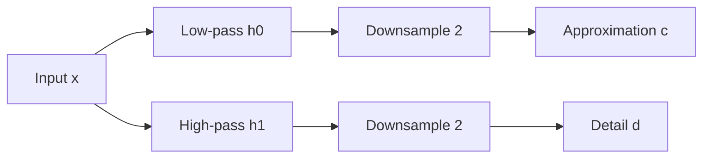
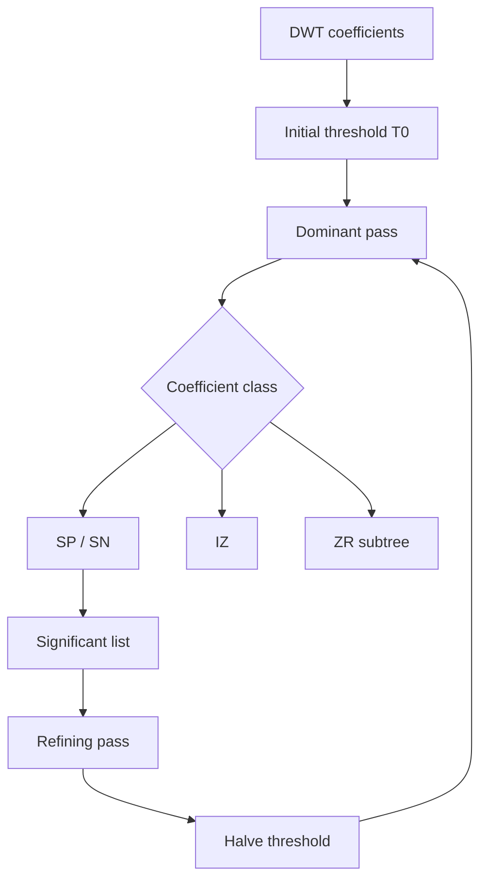
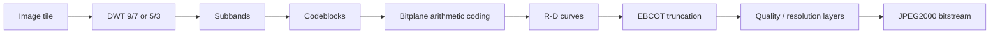

# Wavelet Analysis

## Table of Contents

- [[#Core Idea|Core Idea]]
- [[#Key Concepts|Key Concepts]]
- [[#Theory and Formulas|Theory and Formulas]]
- [[#Visual Schemes|Visual Schemes]]
- [[#Examples|Examples]]

## Core Idea

**Wavelet analysis** represents signals with basis functions that change scale and position. Unlike DFT or block-DCT, wavelets use **adaptive multiresolution**:

- low frequencies use long windows and good frequency resolution,
- high frequencies use short windows and good spatial/time resolution,
- smooth trends are separated from sharp anomalies such as edges.

For image compression, this gives sparse coefficients without $8x8$ block boundaries. JPEG2000 uses wavelet transforms, bitplane coding, arithmetic coding, and optimized truncation to provide quality scalability, resolution scalability, ROI coding, exact bitrate control, and lossy-to-lossless coding.

> [!Important] Main wavelet compression idea
> Images are modeled as smooth trends plus localized anomalies. Wavelets represent trends in low-pass subbands and edges in sparse high-pass subbands, making coefficient coding efficient.

## Key Concepts

### Linear Transform by Projection

All transforms used in image coding project the signal onto basis functions:

$$
x(t)=\sum_k c_k\phi_k(t)
$$

with:

$$
c_k=\langle x(t),\phi_k(t)\rangle
=
\int_{-\infty}^{+\infty}x(t)\phi_k^*(t)\,dt
$$

Large $|c_k|$ means the signal strongly resembles basis function $k$. Compression works when most coefficients are small.

### Time-Frequency Uncertainty

For a windowed sinusoid:

$$
x[n]=\cos(\omega_0 n)\operatorname{rect}_N[n]
$$

window length controls localization:

| Window | Time localization | Frequency resolution |
| :--- | :--- | :--- |
| short | excellent | poor |
| medium | good | medium |
| long | poor | good |
| very long | very poor | excellent |

> [!Important] Time-frequency uncertainty
> $$
> \Delta t\cdot\Delta f\geq\frac{1}{4\pi}
> $$
>
> The area of the time-frequency uncertainty cell is fixed. A transform can change the cell shape, but cannot make both time and frequency resolution arbitrarily good.

### STFT vs. Wavelets

**STFT / block DCT** use a fixed window for all frequencies. This creates rigid tiling of the time-frequency plane.

**Wavelets** adapt the window:

| Frequency | Wavelet window | Captures |
| :--- | :--- | :--- |
| high | short | edges, impulses, anomalies |
| low | long | trends, smooth texture |

Wavelet basis from a mother wavelet:

$$
\psi_{a,b}(t)
=
\frac{1}{\sqrt{a}}\psi\left(\frac{t-b}{a}\right)
$$

where $a$ controls scale and $b$ controls position.

- Large $a$: stretched wavelet, lower frequency, better frequency resolution.
- Small $a$: compressed wavelet, higher frequency, better time/spatial resolution.

### Image Model

Images contain:

| Component | Signal behavior | Frequency | Spatial precision needed |
| :--- | :--- | :--- | :--- |
| **Trend** | slow variation | low | rough |
| **Anomaly** | abrupt variation | high | fine |

Wavelets split image rows/blocks into approximation plus details:

- approximation: low-resolution trend,
- detail: high-frequency anomalies, often sparse.

### 1D Filter Bank

Wavelet transform is implemented by analysis filters plus downsampling.

Analysis:

$$
x[k]\xrightarrow{h_0}\tilde{c}[k]\xrightarrow{\downarrow2}c[k]
$$

$$
x[k]\xrightarrow{h_1}\tilde{d}[k]\xrightarrow{\downarrow2}d[k]
$$

- $h_0$: low-pass analysis filter, approximation coefficients.
- $h_1$: high-pass analysis filter, detail coefficients.
- Downsampling keeps one sample every two.

Synthesis:

$$
c[k]\xrightarrow{\uparrow2}\hat{c}[k]\xrightarrow{f_0}\bar{x}[k]
$$

$$
d[k]\xrightarrow{\uparrow2}\hat{d}[k]\xrightarrow{f_1}\bar{x}[k]
$$

Interpolation:

$$
\hat{c}[k]=
\begin{cases}
c[k/2] & k\ \text{even}\\
0 & k\ \text{odd}
\end{cases}
$$

### Perfect Reconstruction

A useful wavelet filter bank should allow perfect reconstruction (possibly with delay) after analysis and synthesis.

In $z$ domain:

$$
\tilde{C}(z)=H_0(z)X(z)
$$

Decimation:

$$
C(z)=\frac{1}{2}
\left[
\tilde{C}(z^{1/2})+\tilde{C}(-z^{1/2})
\right]
$$

Interpolation:

$$
\hat{C}(z)=C(z^2)
$$

Output:

$$
\tilde{X}(z)
=
\frac{1}{2}[F_0(z)H_0(z)+F_1(z)H_1(z)]X(z)
+
\frac{1}{2}[F_0(z)H_0(-z)+F_1(z)H_1(-z)]X(-z)
$$

> [!Important] Perfect reconstruction conditions
> **No distortion:**
>
> $$
> T(z)=H_0(z)F_0(z)+H_1(z)F_1(z)=2z^{-\ell}
> $$
>
> **Aliasing cancellation:**
>
> $$
> A(z)=H_0(-z)F_0(z)+H_1(-z)F_1(z)=0
> $$
>
> Together:
>
> $$
> \tilde{X}(z)=z^{-\ell}X(z)
> $$
>
> so the output is the input delayed by $\ell$ samples.

### Orthogonality and Biorthogonality

Orthogonal filter banks conserve energy:

$$
\sum_{k=-\infty}^{+\infty}x_k^2
=
\sum_{k=-\infty}^{+\infty}c_k^2
+
\sum_{k=-\infty}^{+\infty}d_k^2
$$

**Compression meaning:** reconstruction error equals quantization error in coefficient domain.

Biorthogonal filters are not strictly energy preserving, but they can be symmetric and close to orthogonal. In image compression, symmetry is often more important because it avoids boundary artifacts.

### Vanishing Moments

> [!Important] Vanishing moments
> A wavelet/filter with $p$ vanishing moments has zero high-pass response to polynomials of degree $<p$.
>
> It needs at least $2p$ taps.
>
> Smooth image regions become nearly zero in detail subbands, increasing sparsity.

### Border Problem

Wavelet theory assumes infinite signals, but images have finite support. Linear convolution with an $M$-tap filter expands an $N$-sample signal to $N+M-1$ samples.

Possible extensions:

| Method | Benefit | Problem |
| :--- | :--- | :--- |
| zero padding | simple | coefficient expansion and boundary artifacts |
| periodization | same number of coefficients | artificial boundary jumps |
| symmetrization | removes jumps | doubles period unless filters are symmetric |

> [!Important] Symmetry constraint
> The only FIR filter that is both orthogonal and symmetric, apart from trivial cases, is the Haar filter.
>
> Image compression therefore prefers **biorthogonal symmetric filters** such as CDF 9/7 and CDF 5/3.

### Haar and CDF Filters

Haar filters:

$$
h_0=[1\ 1],\qquad h_1=[1\ -1]
$$

$$
f_0=[1\ 1],\qquad f_1=[-1\ 1]
$$

Properties:

- symmetric,
- orthogonal,
- one vanishing moment,
- only piecewise-constant approximation.

CDF filters:

| Filter | Vanishing moments | Taps | Use |
| :--- | :--- | :--- | :--- |
| **CDF 9/7** | 4 | 9/7 | JPEG2000 lossy, best R-D |
| **CDF 5/3** | 2 | 5/3 | JPEG2000 lossless, integer exact reconstruction |

If analysis has $p$ vanishing moments and synthesis has $\tilde{p}$, the filter needs at least:

$$
p+\tilde{p}-1
$$

taps.

### 1D and 2D Multiresolution

In 1D multiresolution, the filter bank is recursively applied only to the low-pass approximation $c_j$.

In 2D, apply 1D filters separably:

1. filter rows,
2. filter columns,
3. downsample each direction.

One level creates four subbands:

| Subband | Filtering | Content |
| :--- | :--- | :--- |
| **LL** | LP rows + LP columns | low-resolution approximation |
| **HL** | HP rows + LP columns | vertical details |
| **LH** | LP rows + HP columns | horizontal details |
| **HH** | HP rows + HP columns | diagonal details |

Recursive decomposition applies again to LL.

Optimal number of levels for images: **4 to 6**. More levels give diminishing returns because LL becomes too small and less well modeled as smooth trend.

### EZW

**Embedded Zerotrees of Wavelet coefficients (EZW)** is a progressive wavelet coder:

- sends largest coefficients first,
- uses bitplane thresholds,
- exploits inter-scale correlation,
- produces quality scalability,
- can be lossy-to-lossless with integer DWT and all bitplanes.

> [!Important] Zerotree principle
> If a wavelet coefficient is insignificant below threshold $T$, its descendants at finer scales in the same orientation are likely insignificant too.
>
> A whole insignificant subtree can be coded with one **ZR** symbol.

EZW symbols:

| Symbol | Meaning |
| :--- | :--- |
| **SP** | significant positive, $c\geq T$ |
| **SN** | significant negative, $c\leq -T$ |
| **IZ** | isolated zero: insignificant but has significant descendant |
| **ZR** | zerotree root: insignificant and all descendants insignificant |

Thresholds:

$$
T_k=2^{n-k},
\qquad
n=\left\lfloor\log_2\max|c|\right\rfloor
$$

Each pass halves the threshold:

$$
T_{k+1}=\frac{T_k}{2}
$$

Dominant pass finds newly significant coefficients; refining pass sends the next bitplane of already significant coefficients.

### JPEG2000

JPEG2000 addresses JPEG limitations:

| JPEG issue | JPEG2000 response |
| :--- | :--- |
| poor quality below 0.25 bpp | wavelet transform |
| blocking artifacts | global/tiled DWT instead of $8x8$ DCT |
| weak scalability | quality + resolution scalability |
| no random access | tiling and codeblock independence |
| imprecise rate control | EBCOT optimized truncation |
| no native lossy-to-lossless path | 5/3 integer DWT and scalable bitstream |

JPEG2000 structure:

- **Tier 1:** DWT, fine quantization if lossy, arithmetic coding of codeblocks by bitplane.
- **Tier 2:** EBCOT organizes coded blocks into layers and truncates bitstreams optimally.

Lossy JPEG2000 uses CDF 9/7. Lossless JPEG2000 uses integer CDF 5/3.

### EBCOT

**EBCOT** means *Embedded Block Coding with Optimized Truncation*.

Workflow:

1. split each DWT subband into codeblocks, e.g. $64x64$,
2. independently arithmetic-code each codeblock by bitplanes,
3. compute R-D curve for each codeblock,
4. choose truncation points to satisfy target rate.

Optimization:

$$
\min\sum_i D_i
\quad\text{s.t.}\quad
\sum_i R_i\leq R_{\text{tot}}
$$

Lagrangian:

$$
J=\sum_i(D_i+\lambda R_i)-\lambda R_{\text{tot}}
$$

> [!Important] EBCOT optimal truncation
> For each codeblock:
>
> $$
> \frac{\partial J_i}{\partial R_i}
> =
> \frac{\partial D_i}{\partial R_i}+\lambda=0
> $$
>
> At optimum:
>
> $$
> \frac{\partial D_i}{\partial R_i}=-\lambda
> $$
>
> All selected codeblock truncation points have the same R-D slope.

Multiple $\lambda$ values give multiple quality layers.

### Error Robustness

Compressed streams are fragile because:

- predictive coding propagates errors,
- variable-length coding loses synchronization,
- header errors can corrupt complete files.

JPEG2000 improves robustness through codeblock independence and bitstream organization.

| Feature | JPEG | JPEG2000 |
| :--- | :--- | :--- |
| entropy stream | more global | independent codeblocks |
| error propagation | severe | localized |
| transform artifacts | blocking | no blocking |
| rate/resolution layers | limited | built in |

## Theory and Formulas

### Wavelet Scaling and Fourier Interpretation

Mother wavelet:

$$
\psi_{a,b}(t)
=
\frac{1}{\sqrt{a}}\psi\left(\frac{t-b}{a}\right)
$$

Fourier scaling:

$$
\mathcal{F}\{x(t/a)\}=|a|X(af)
$$

Thus large $a$ stretches the wavelet in time and compresses its frequency support. Small $a$ does the opposite.

### Perfect Reconstruction Matrix Form

PR conditions can be written as:

$$
\begin{bmatrix}
H_0(z) & H_1(z)\\
H_0(-z) & H_1(-z)
\end{bmatrix}
\begin{bmatrix}
F_0(z)\\
F_1(z)
\end{bmatrix}
=
\begin{bmatrix}
2z^{-\ell}\\
0
\end{bmatrix}
$$

The modulation matrix must be invertible on the unit circle:

$$
\Delta(z)
=
H_0(z)H_1(-z)-H_1(z)H_0(-z)
\neq0,
\qquad |z|=1
$$

### EZW Zerotree Saving

If a zerotree root starts at scale $n$ and has depth to $N$, one symbol can replace:

$$
1+4+4^2+\cdots+4^{N-n}
$$

individual insignificance symbols in 2D.

### JPEG2000 Exact Rate Control

EBCOT can hit a target bitrate with very small error because each codeblock bitstream has many candidate truncation points:

- early truncation: low rate, high distortion,
- later truncation: high rate, low distortion,
- layers collect truncation segments in increasing quality order.

## Visual Schemes

### Time-Frequency Resolution

![[Pics/5. Wavelet analysis/time-frequency-short-window.png|600]]

Short windows localize time well but blur frequency.

![[Pics/5. Wavelet analysis/time-frequency-long-window.png|600]]

Long windows localize frequency well but blur time.

![[Pics/5. Wavelet analysis/stft-rigid-tiling.png|420]]

STFT and block-DCT use fixed tiles, so all frequencies receive the same resolution tradeoff.

![[Pics/5. Wavelet analysis/wavelet-adaptive-tiling.png|420]]

Wavelets use narrow high-frequency tiles and wide low-frequency tiles.

### Trends and Anomalies

![[Pics/5. Wavelet analysis/image-original-row.png|420]]

An image row contains both smooth trends and sharp localized changes.

![[Pics/5. Wavelet analysis/image-anomalies.png|420]]

High-pass wavelet details isolate anomalies such as edges and contours.

![[Pics/5. Wavelet analysis/trend-detail-model.png|600]]

Approximation stores the trend; detail stores deviations from the trend.

### Filter Bank and Multiresolution



![[Pics/5. Wavelet analysis/one-dimensional-mra.png|600]]

1D multiresolution recursively decomposes the low-pass approximation.

![[Pics/5. Wavelet analysis/multilevel-decomposition.png|600]]

Analysis filter banks generate approximation and detail streams across scales.

![[Pics/5. Wavelet analysis/multilevel-reconstruction.png|600]]

Synthesis filter banks invert the decomposition from coarse scale back to the original signal.

### 2D DWT

![[Pics/5. Wavelet analysis/two-dimensional-dwt-subbands.png|650]]

One 2D DWT level produces LL, HL, LH, and HH subbands.

![[Pics/5. Wavelet analysis/synthetic-square.png|380]]

Synthetic square image is simple but has sharp edges.

![[Pics/5. Wavelet analysis/synthetic-square-dwt.png|650]]

DWT places smooth content in LL and edges/corners in detail subbands.

### EZW and JPEG2000 Schemes





> [!Note] Missing visual
> Source uses placeholders for EBCOT codeblocks, R-D truncation, JPEG/JPEG2000 comparison, and error-robustness figures. Mermaid schemes above cover the processing logic.

## Examples

> [!Example] Trends vs anomalies
> **Setup:** an image row has smooth regions plus edges.
>
> **Wavelet effect:** low-pass branch captures slowly varying intensity; high-pass branch activates mostly at edges.
>
> **Takeaway:** smooth areas generate few detail coefficients, so they compress well.

> [!Example] Haar transform intuition
> For a pair $(x_0,x_1)$, Haar approximation and detail are proportional to:
>
> $$
> c=x_0+x_1,\qquad d=x_0-x_1
> $$
>
> If the pair is smooth, $x_0\approx x_1$, so $d\approx0$.
>
> **Takeaway:** Haar is simple edge/detail extraction, but only has one vanishing moment.

> [!Example] 2D DWT subbands
> **LL:** blurred low-resolution image.
>
> **HL:** responds to vertical details.
>
> **LH:** responds to horizontal details.
>
> **HH:** responds to diagonal details.
>
> **Takeaway:** DWT separates image geometry by scale and orientation.

> [!Example] EZW encoding on a 4x4 coefficient matrix
> Coefficients:
>
> $$
> \begin{bmatrix}
> 26 & 6 & -13 & 10\\
> -7 & 3 & 6 & 4\\
> 4 & -3 & 3 & -3\\
> 2 & -2 & -2 & 0
> \end{bmatrix}
> $$
>
> Initial threshold:
>
> $$
> T=16
> $$
>
> Since $26\geq16$, first coefficient is **SP**. Coefficients below threshold whose descendants are also below threshold become **ZR**.
>
> First dominant pass:
>
> ```text
> SP ZR ZR ZR
> ```
>
> Refining sends next bit of already significant coefficients.
>
> **Takeaway:** EZW sends coarse significance first, then progressively refines.

> [!Example] EZW decoding estimate
> If a coefficient becomes significant positive at threshold $T=16$, decoder knows:
>
> $$
> 16\leq c<32
> $$
>
> Initial estimate is midpoint:
>
> $$
> \hat{c}=24
> $$
>
> Refining bits shrink the uncertainty interval by factor 2 at each pass.

> [!Example] JPEG2000 vs JPEG at low rate
> | Rate | JPEG | JPEG2000 |
> | :--- | :--- | :--- |
> | 1.0 bpp | good | good |
> | 0.5 bpp | visible blocking | clean |
> | 0.3 bpp | strong blocking | slight blur |
> | 0.2 bpp | very poor | acceptable |
> | 0.1 bpp | often unusable | usable |
>
> **Takeaway:** wavelet coding degrades by blur/ringing rather than block artifacts.

> [!Example] Error robustness
> At bit error probability $p_E=10^{-3}$, JPEG can suffer catastrophic visual degradation because entropy decoding can desynchronize and errors propagate.
>
> JPEG2000 confines much damage to independent codeblocks, so degradation is more local and graceful.

> [!Example] Method comparison
> | Technique | Transform | Coding | Scalability | Lossless path | Blocking |
> | :--- | :--- | :--- | :--- | :--- | :--- |
> | JPEG | $8x8$ DCT | Huffman/arithmetic | no | no | yes |
> | EZW | DWT | symbols + arithmetic | quality | yes with integer DWT | no |
> | JPEG2000 | DWT 9/7 or 5/3 | EBCOT arithmetic | quality, resolution, ROI | yes with 5/3 | no |
