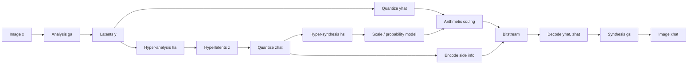
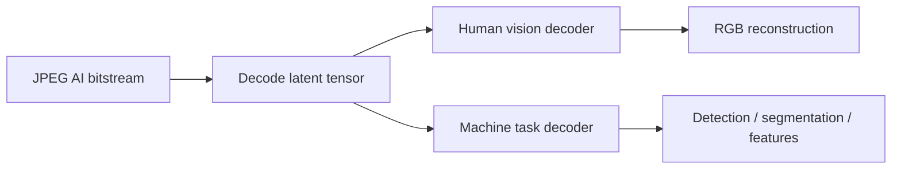

# Learned Image Compression

## Table of Contents

- [[#Core Idea|Core Idea]]
- [[#Key Concepts|Key Concepts]]
- [[#Theory and Formulas|Theory and Formulas]]
- [[#Visual Schemes|Visual Schemes]]
- [[#Examples|Examples]]

## Core Idea

**Learned Image Compression (LIC)**, also called **Neural Image Compression (NIC)**, replaces hand-designed codec blocks with neural networks trained end-to-end on image data.

Classical codecs use fixed linear transforms:

- JPEG: block DCT,
- JPEG 2000: DWT,
- handcrafted quantization and entropy models.

Learned codecs use neural networks:

- **analysis transform** $g_a$: maps image to latent tensor,
- **quantization**: maps latents to discrete values,
- **entropy model**: predicts bit cost of latents,
- **synthesis transform** $g_s$: reconstructs the image.

> [!Important] Main paradigm shift
> Learned compression is non-linear transform coding. The transform, probability model, and reconstruction behavior are optimized from data for a rate-distortion objective instead of being manually specified.

## Key Concepts

### Classical vs. Learned Transform Coding

General transform-coding structure remains:

$$
x \xrightarrow{\text{analysis}} z=g_a(x)
\xrightarrow{\text{quantization}} \hat{z}=Q(z)
\xrightarrow{\text{synthesis}} \hat{x}=g_s(\hat{z})
$$

In classical codecs, $g_a$ and $g_s$ are fixed transforms such as DCT or DWT. In learned compression, $g_a$ and $g_s$ are trained CNNs.

| Aspect | Classical | Learned |
| :--- | :--- | :--- |
| Transform | fixed linear basis | learned non-linear mapping |
| Adaptivity | parameters only | weights learned from data |
| Coefficients | transform coefficients | latent variables / latent tensor |
| Optimization | discrete tool selection | gradient descent |
| Entropy model | fixed or handcrafted | learned prior/hyperprior |

### KLT as Linear Limit

KLT is optimal among linear transforms for Gaussian data, because it decorrelates components. Neural codecs generalize this:

| KLT | Neural codec |
| :--- | :--- |
| linear | non-linear |
| optimal mainly for Gaussian sources | handles complex natural-image distributions |
| data-dependent but expensive | CNNs process large images with shared weights |
| decorrelates second-order statistics | learns high-order features: edges, textures, semantics |

> [!Important] Non-linear KLT view
> LIC can be interpreted as a non-linear KLT optimized for rate-distortion, where the basis/functions are learned instead of fixed.

### Rate-Distortion Objective

Learned codecs are trained by minimizing a Lagrangian:

$$
\mathcal{L}=D(x,\hat{x})+\lambda R(\hat{z})
$$

or equivalently:

$$
\mathcal{L}=R(\hat{z})+\lambda D(x,\hat{x})
$$

The meaning of "large $\lambda$" depends on which form is used:

- in $D+\lambda R$, large $\lambda$ penalizes rate more strongly;
- in $R+\lambda D$, large $\lambda$ penalizes distortion more strongly.

Training several models with different $\lambda$ values gives different points on the rate-distortion curve, similar in role to quality factors.

### Artificial Neuron and MLP

Neuron:

$$
y=f(w^Tx+b)=f(w_1x_1+\cdots+w_nx_n+b)
$$

where $f$ is a non-linear activation.

Common activations:

| Activation | Formula | Role |
| :--- | :--- | :--- |
| ReLU | $f(z)=\max(0,z)$ | sparse non-linearity |
| Sigmoid | $f(z)=1/(1+e^{-z})$ | maps to $(0,1)$ |
| Tanh | $f(z)=\tanh(z)$ | maps to $(-1,1)$ |
| GDN | normalized response | compression-specific |

MLP with one hidden layer:

$$
h=f(W_1x+b_1)
$$

$$
y=g(W_2h+b_2)
$$

Non-linear activations matter because without them a deep stack collapses to one linear transform.

### Gradient Descent and Backpropagation

Neural training updates parameters $\theta$ by:

$$
\theta_{t+1}=\theta_t-\eta\nabla_\theta\mathcal{L}(\theta_t)
$$

where $\eta$ is the learning rate.

Backpropagation applies the chain rule from output to input to compute gradients for every weight. This makes end-to-end codec training possible.

### Why MLPs Fail on Images

Flattening an image loses spatial structure. A $256x256$ image gives:

$$
256\cdot256=65536
$$

input values. Connecting it to 1000 hidden neurons requires:

$$
65,536,000
$$

weights in one layer.

Problems:

- no translation invariance,
- parameter explosion,
- overfitting,
- no explicit locality,
- computationally impractical.

### CNNs for Learned Compression

CNNs solve image scalability using:

| Feature | Compression meaning |
| :--- | :--- |
| local connectivity | nearby pixels treated together |
| weight sharing | same detector reused everywhere |
| strided convolution | learned downsampling in encoder |
| multiple channels | many parallel learned features |
| transposed convolution | learned upsampling in decoder |

A convolution applies a small kernel, e.g. $3x3$, to every local patch. A stride $s>1$ reduces spatial resolution and compacts information.

Typical neural codec latent tensor:

$$
H\times W \rightarrow \frac{H}{16}\times\frac{W}{16}\times C
$$

after four stride-2 stages. Source notes JPEG AI-like examples with:

- 160 channels for luminance,
- 96 channels for chrominance.

### GDN

> [!Important] Generalized Divisive Normalization
> $$
> w_i=
> \frac{v_i}
> {\sqrt{\beta_i+\sum_j\gamma_{ij}v_j^2}}
> $$
>
> $\beta_i$ and $\gamma_{ij}$ are learned parameters.

GDN is useful because it:

- performs local feature normalization,
- mimics lateral inhibition and visual masking,
- reduces correlation,
- makes latent distributions easier to model for entropy coding.

### Autoencoder Codec

Learned image codecs are autoencoders:

1. **Analysis transform**:

$$
y=g_a(x)
$$

2. **Bottleneck**:

$$
\hat{y}=Q(y)
$$

3. **Entropy coding** of $\hat{y}$.
4. **Synthesis transform**:

$$
\hat{x}=g_s(\hat{y})
$$

The bottleneck is where compression happens.

### VAE Interpretation

Modern neural codecs can be interpreted as rate-distortion VAEs.

> [!Important] VAE rate-distortion objective
> $$
> \mathcal{L}
> =
> D_{KL}[q(\hat{y}|x)\|p(\hat{y})]
> +
> \lambda\mathbb{E}[\rho(x,\hat{x})]
> $$
>
> The KL term corresponds to rate, and the reconstruction term corresponds to distortion.

Interpretation:

- $q(\hat{y}|x)$: distribution induced by encoder and quantization.
- $p(\hat{y})$: entropy model expected by arithmetic coder.
- $\rho(x,\hat{x})$: distortion metric, e.g. MSE, MS-SSIM, perceptual loss.
- $\lambda$: rate-distortion tradeoff parameter.

### Quantization Training Problem

Hard rounding is non-differentiable:

$$
\hat{z}=Q(z)=\mathrm{round}(z)
$$

Its derivative is zero almost everywhere, so backpropagation cannot train the encoder through it.

Common training solution:

$$
\hat{z}\approx z+u,
\qquad
u\sim\mathcal{U}(-0.5,0.5)
$$

During inference:

$$
\hat{z}=\mathrm{round}(z)
$$

Additive uniform noise is a differentiable proxy and matches high-resolution quantization-noise theory.

Alternative approaches:

- **STE**: pretend quantizer derivative is 1.
- **Soft quantization**: smooth approximation during training, hard rounding at test time.

### Hyperprior

Basic latent priors assume fixed statistics, but real latent tensors have spatially varying variance. Hyperprior models transmit compact side information to predict local latent distributions.

Hyperprior mechanism:

$$
x\xrightarrow{g_a}y\xrightarrow{Q}\hat{y}\xrightarrow{g_s}\hat{x}
$$

$$
y\xrightarrow{h_a}z\xrightarrow{Q}\hat{z}\xrightarrow{h_s}\sigma
$$

Conditional model:

$$
p(\hat{y}|\hat{z})=\mathcal{N}(\mu,\sigma^2)
$$

Total rate includes:

$$
R_{\text{total}}=R(\hat{y})+R(\hat{z})
$$

The hyperprior overhead is useful when the rate saved by a better model for $\hat{y}$ exceeds the rate spent on $\hat{z}$.

### JPEG AI

Source notes describe **JPEG AI** as an international learned-image-coding standard built on deep learning. Its goals:

- outperform HEVC/VVC intra coding in image compression efficiency,
- support both human and machine tasks,
- use hierarchical VAE-like neural codecs,
- provide complexity profiles for different hardware.

Key ideas:

- deep CNN analysis/synthesis transforms,
- hyperprior side information,
- quantization proxy during training,
- latent tensors with many channels,
- one bitstream usable by human reconstruction or machine task decoders.

Complexity profiles in source:

| Profile | Complexity | Target |
| :--- | :--- | :--- |
| Dec0 | 8 kMAC/px | low-end CPUs |
| Dec1 | 23 kMAC/px | real-time mid-range smartphones |
| Dec2 | 214 kMAC/px | high-end GPU / maximum quality |

### Current Limitations

| Limitation | Why it matters |
| :--- | :--- |
| high complexity | many kMAC/px, high energy cost |
| hardware dependence | GPU/NPU often needed |
| determinism | floating-point differences can cause drift |
| out-of-distribution risk | unusual images may be poorly reconstructed |
| hallucination | neural decoder may synthesize plausible but false details |

### Future Directions

- **Generative compression:** GAN/diffusion decoders synthesize realistic textures at very low rates.
- **Coding for machines:** transmit latents directly to detection/segmentation systems.
- **Hardware-algorithm co-design:** neural codecs designed with NPUs and mobile accelerators.

## Theory and Formulas

### Classical-to-Neural Architecture

Classical transform coding:

$$
x\rightarrow T(x)\rightarrow Q(T(x))\rightarrow \text{entropy coding}
$$

Learned transform coding:

$$
x\rightarrow g_a(x)=y\rightarrow Q(y)=\hat{y}
\rightarrow \text{entropy coding}
\rightarrow g_s(\hat{y})=\hat{x}
$$

The learned transform is non-linear, data-driven, and optimized jointly with the entropy model.

### Latent Tensor Size

If an input image has shape $H\times W$, and the encoder uses four stride-2 stages:

$$
H\times W
\rightarrow
\frac{H}{2}\times\frac{W}{2}
\rightarrow
\frac{H}{4}\times\frac{W}{4}
\rightarrow
\frac{H}{8}\times\frac{W}{8}
\rightarrow
\frac{H}{16}\times\frac{W}{16}
$$

With $C$ channels:

$$
y\in\mathbb{R}^{H/16\times W/16\times C}
$$

Spatial size shrinks, but channel count increases to preserve multiple learned features.

### Entropy Model and Arithmetic Coding

If entropy model assigns probability $p_{\hat{y}}(\hat{y}_i)$ to each quantized latent symbol, rate estimate is:

$$
R(\hat{y})\approx
-\sum_i \log_2 p_{\hat{y}}(\hat{y}_i)
$$

Better probability models reduce arithmetic-coding length.

With hyperprior:

$$
R(\hat{y}|\hat{z})
\approx
-\sum_i\log_2 p(\hat{y}_i|\hat{z})
$$

Total:

$$
R_{\text{total}}
=
R(\hat{z})+R(\hat{y}|\hat{z})
$$

### Additive Noise Approximation

Uniform scalar quantization with unit step has error approximately:

$$
e\sim\mathcal{U}(-0.5,0.5)
$$

So during training:

$$
\tilde{y}=y+u,\qquad u\sim\mathcal{U}(-0.5,0.5)
$$

approximates:

$$
\hat{y}=\mathrm{round}(y)
$$

while preserving gradient flow.

### GDN Interpretation

GDN divides each feature by local energy:

$$
w_i=\frac{v_i}{\sqrt{\beta_i+\sum_j\gamma_{ij}v_j^2}}
$$

If neighboring channels are strong, $w_i$ is suppressed. This resembles perceptual masking and helps produce latents with simpler distributions.

## Visual Schemes

### Neural Network Basics

![[Pics/6. Learned Image Compression/artificial-neuron.png|650]]

Artificial neuron computes weighted sum, adds bias, and applies non-linear activation.

![[Pics/6. Learned Image Compression/mlp-architecture.png|500]]

MLP connects all neurons between layers; useful conceptually but inefficient for images.

![[Pics/6. Learned Image Compression/image-flattening-problem.png|500]]

Flattening image pixels destroys spatial topology and causes parameter explosion.

### CNN Features

![[Pics/6. Learned Image Compression/convolution-receptive-field.png|600]]

Convolution applies the same local kernel at all positions, reusing learned pattern detectors.

![[Pics/6. Learned Image Compression/strided-convolution.png|600]]

Strided convolution downsamples spatial dimensions and compacts information.

![[Pics/6. Learned Image Compression/parallel-feature-channels.png|600]]

Multiple kernels create multiple feature maps, forming a 3D latent representation.

### Autoencoder Codec

```mermaid
flowchart LR
    A[Input image x] --> B[Analysis transform ga]
    B --> C[Latent tensor y]
    C --> D[Quantization Q]
    D --> E[Quantized latents yhat]
    E --> F[Entropy coding]
    F --> G[Bitstream]
    G --> H[Entropy decoding]
    H --> E2[Quantized latents yhat]
    E2 --> I[Synthesis transform gs]
    I --> J[Reconstructed image xhat]
```

### Hyperprior Codec

### JPEG AI Dual Use

> [!Note] Missing visual
> Source has real figures for neural-network/CNN basics, but not for autoencoder, hyperprior, or dual-use JPEG AI architecture. Mermaid schemes above summarize those architectures.

## Examples

> [!Example] MLP parameter explosion
> A $256x256$ image has:
>
> $$
> 256\cdot256=65536
> $$
>
> input values. A fully connected layer with 1000 neurons needs:
>
> $$
> 65536\cdot1000=65,536,000
> $$
>
> weights, before biases.
>
> **Takeaway:** CNNs are needed because they reuse local filters instead of connecting every pixel to every neuron.

> [!Example] Latent tensor dimensions
> With four stride-2 convolution layers:
>
> $$
> H\times W\rightarrow H/16\times W/16
> $$
>
> If $C=160$ channels, the encoder produces:
>
> $$
> y\in\mathbb{R}^{H/16\times W/16\times160}
> $$
>
> **Takeaway:** spatial resolution shrinks, but many channels store learned features.

> [!Example] Training vs. inference quantization
> During training:
>
> $$
> \tilde{y}=y+u,\qquad u\sim\mathcal{U}(-0.5,0.5)
> $$
>
> During inference:
>
> $$
> \hat{y}=\mathrm{round}(y)
> $$
>
> **Takeaway:** additive noise makes training differentiable while approximating quantization noise.

> [!Example] Hyperprior rate tradeoff
> Sending hyperlatents $\hat{z}$ costs bits, but improves probability estimates for $\hat{y}$.
>
> Useful condition:
>
> $$
> R(\hat{z})+R(\hat{y}|\hat{z}) < R(\hat{y})
> $$
>
> **Takeaway:** side information is worth sending only when it saves more latent bits than it costs.

> [!Example] Complexity profiles
> | Profile | Complexity | Interpretation |
> | :--- | :--- | :--- |
> | Dec0 | 8 kMAC/px | lightweight decoder |
> | Dec1 | 23 kMAC/px | phone-class real-time target |
> | Dec2 | 214 kMAC/px | high-quality high-compute decoder |
>
> **Takeaway:** same bitstream can be decoded with different compute/quality profiles.

> [!Example] Classical vs. learned codec
> | Aspect | JPEG / JPEG 2000 | Learned / JPEG AI |
> | :--- | :--- | :--- |
> | Transform | DCT / DWT | CNN + GDN |
> | Basis | hand-crafted | learned from data |
> | Optimization | module-wise | end-to-end |
> | Entropy model | Huffman/arithmetic tables | learned prior/hyperprior |
> | Artifacts | blocking or blur | possible hallucination |
> | Complexity | low | high |
>
> **Takeaway:** learned codecs win rate-distortion performance, but cost much more computation and must manage determinism.
