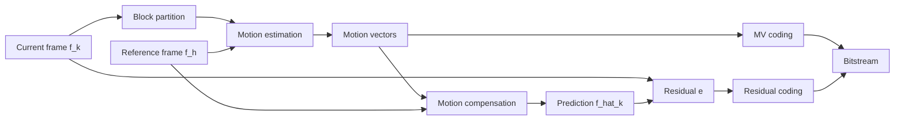
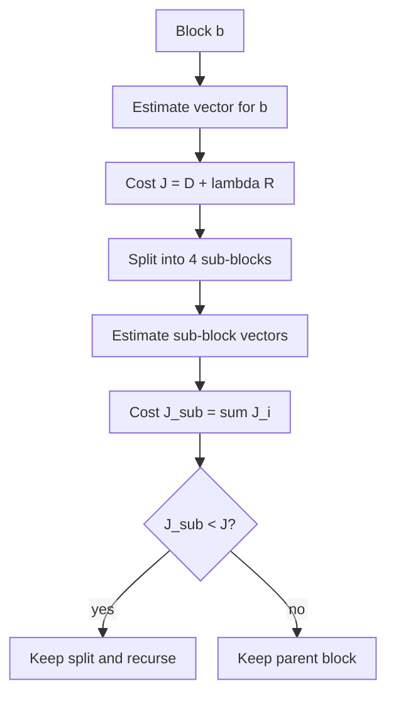

# Motion Estimation

## Table of Contents

- [[#Core Idea|Core Idea]]
- [[#Key Concepts|Key Concepts]]
- [[#Theory and Formulas|Theory and Formulas]]
- [[#Visual Schemes|Visual Schemes]]
- [[#Examples|Examples]]

## Core Idea

**Motion Estimation (ME)** extracts displacement information between video frames. In Multimedia Communications its main role is **temporal prediction**: if a region in the current frame can be predicted from a reference frame, the codec stores a **motion vector** and a smaller residual instead of coding the full frame independently.

The course focuses on **apparent motion**, also called **optical flow**, not on physical 3D motion. Apparent motion is the 2D displacement of image brightness patterns:

$$
\mathbf{v}(n,m)=
\begin{bmatrix}
u(n,m)\\
v(n,m)
\end{bmatrix}
$$

where $u$ and $v$ are horizontal and vertical pixel displacements.

> [!Important] Physical motion vs. apparent motion
> Physical motion is object movement in 3D space. Apparent motion is movement observed in the image plane. They can differ: a uniformly colored rotating object may have physical motion but no visible optical flow, while a moving light source may create apparent motion without object displacement.

![[Pics/7. Motion Estimation/apparent-vs-physical-motion.png|500]]

The figure shows why optical flow is an image-domain concept: visible intensity patterns, not real object mechanics, determine the estimated motion.

## Key Concepts

### Families of Motion Estimation Methods

| Family | Output | Model | Typical use |
| :--- | :--- | :--- | :--- |
| **Variational / gradient-based** | dense field, one vector per pixel | smooth optical flow | vision analysis, foundational theory |
| **Block matching** | one vector per block | piecewise-constant translation | video compression standards |
| **Parametric** | global or regional field | closed-form model, e.g. affine | camera/object motion models |
| **Deep learning** | dense learned flow | CNN / recurrent correspondence model | optical-flow benchmarks, analysis tasks |

### Motion-Compensated Prediction

Given a current frame $f_k$ and a reference frame $f_h$, the motion-compensated prediction is:

$$
\tilde{f}_k(n,m)=
f_h\left(n+u_{h\to k}(n,m),\;m+v_{h\to k}(n,m)\right)
$$

The prediction residual is:

$$
e(n,m)=f_k(n,m)-\tilde{f}_k(n,m)
$$

In compression, good ME should reduce residual energy while keeping the motion-vector field cheap to encode.

### How to Evaluate a Motion Field

| Criterion | Formula / measure | Meaning |
| :--- | :--- | :--- |
| **Prediction quality** | $\mathcal{E}=\frac{1}{NM}\sum e^2(n,m)$ | residual MSE after compensation |
| **PSNR** | $10\log_{10}\frac{255^2}{\mathcal{E}}$ | quality of the predicted frame |
| **MV coding cost** | entropy or coded bits of $(u,v)$ | bit cost of the motion field |
| **Complexity** | blocks $\times$ candidates $\times$ cost evaluation | implementation cost |

> [!Important] Compression tradeoff
> The best geometric match is not always the best coding decision. A slightly worse prediction can be preferable if its motion vector is much cheaper to transmit.

## Theory and Formulas

### Variational Optical Flow

Gradient-based methods assume **brightness constancy**:

$$
f_k(n,m)=f_h(n-u,\;m-v)
$$

For small motion, Taylor expansion gives the optical-flow constraint:

$$
\nabla f \cdot \mathbf{v}+f_t=0
$$

or equivalently:

$$
f_xu+f_yv+f_t=0
$$

> [!Important] Aperture problem
> The optical-flow equation gives one scalar equation for two unknowns $(u,v)$. Locally, an edge reveals only the motion component normal to the edge. Additional constraints are needed to estimate a full vector.

### Horn and Schunck

*Horn and Schunck* adds a smoothness prior to the optical-flow equation. It estimates $u$ and $v$ by minimizing:

$$
E(u,v)=
\iint_{\mathcal{R}}
\left[
\left(\nabla f \cdot \mathbf{v}+f_t\right)^2
+\lambda^2
\left(
|\nabla u|^2+|\nabla v|^2
\right)
\right]dn\,dm
$$

The first term enforces brightness constancy. The second term penalizes rapid spatial changes in the velocity field.

> [!Important] Role of $\lambda$
> Small $\lambda$ follows the data more closely and can be noisy. Large $\lambda$ enforces smoother flow but can blur motion boundaries.

The iterative update used in the slides is:

$$
u^{k+1}=\bar{u}^{k}
-f_x
\frac{f_x\bar{u}^{k}+f_y\bar{v}^{k}+f_t}
{\lambda^2+f_x^2+f_y^2}
$$

$$
v^{k+1}=\bar{v}^{k}
-f_y
\frac{f_x\bar{u}^{k}+f_y\bar{v}^{k}+f_t}
{\lambda^2+f_x^2+f_y^2}
$$

where $\bar{u}^{k}$ and $\bar{v}^{k}$ are local averages.

![[Pics/7. Motion Estimation/optical-flow-input-frame.png|360]]

Input video frame used to illustrate dense optical-flow estimation.

![[Pics/7. Motion Estimation/horn-schunck-dense-flow.png|360]]

Dense optical flow estimated over the frame. The method gives one vector per pixel but tends to smooth across object boundaries.

### Block Matching

**Block matching (BM)** divides the current frame into blocks and assigns one translation vector to each block. For a block $B_{p,q}$ and search window $\mathcal{W}$:

$$
(\hat{i},\hat{j})=
\arg\min_{(i,j)\in\mathcal{W}}
d\left[
\mathbf{f}_k(B_{p,q}),
\mathbf{f}_h(B_{p-i,q-j})
\right]
$$

All pixels inside the block share the same vector:

$$
\forall(n,m)\in B_{p,q}:\quad
\mathbf{v}(n,m)=(\hat{i},\hat{j})
$$

**Forward motion** uses a previous reference frame ($h=k-1$). **Backward motion** uses a future reference frame ($h=k+1$).

![[Pics/7. Motion Estimation/block-matching-reference-current.png|500]]

Block matching searches in a reference frame for the block that best predicts the current block.

### SAD and SSD

The general norm-based matching cost is:

$$
J_p(i,j)=
\sum_{(n,m)\in B_{p,q}}
\left|
f(n,m,k)-f(n-i,m-j,h)
\right|^p
$$

Two important cases:

| Cost | Formula | Properties |
| :--- | :--- | :--- |
| **SAD** | $\sum |f_k-f_h|$ | robust to outliers, simpler, often more regular MVF |
| **SSD** | $\sum (f_k-f_h)^2$ | directly minimizes squared residual energy, but more outlier-sensitive |

![[Pics/7. Motion Estimation/sad-vs-ssd-motion-vectors.png|500]]

SAD can give a more regular motion-vector field, while SSD may slightly improve PSNR because it matches the MSE objective.

### Regularized Motion Estimation

Motion vectors can be regularized by penalizing vectors that differ from neighboring vectors:

$$
J_{\text{REG}}(i,j)=
\left\|
\mathbf{f}_k(B_{p,q})-\mathbf{f}_h(B_{p-i,q-j})
\right\|_p^p
+\lambda R(i,j)
$$

Modern codecs use a rate-distortion form:

$$
J(v)=D(v)+\lambda_{ME}R(v)
$$

where $D(v)$ is prediction distortion and $R(v)$ is the number of bits needed to encode the vector.

![[Pics/7. Motion Estimation/regularized-motion-vectors.png|500]]

Regularization reduces MVF entropy by preferring smoother vectors, at the cost of a small prediction-quality loss.

### Block Size Tradeoff

| Block size | Complexity | MV coding cost | Prediction error |
| :--- | :--- | :--- | :--- |
| larger blocks | lower | lower | higher |
| smaller blocks | higher | higher | lower |

Large blocks are efficient but cannot model detailed object boundaries. Small blocks are flexible but produce more vectors and higher overhead.

### Search Strategies

For a full search window:

$$
\mathcal{W}=\{-A,\ldots,A\}\times\{-B,\ldots,B\}
$$

If $A=B=7$, full search tests:

$$
(2A+1)^2=15^2=225
$$

candidates per block.

| Strategy | Main idea | Typical tests in source example | Risk |
| :--- | :--- | :--- | :--- |
| **Full Search** | test every candidate | 225 | high cost |
| **Three Step Search** | decreasing step size | about 25 | local minima |
| **Diamond Search** | large diamond, then small diamond | about 23 | local minima |
| **Hexagon Search** | large hexagon, then small hexagon | about 17 | local minima |
| **TZSearch** | predictors plus adaptive search | variable | more complex control |

![[Pics/7. Motion Estimation/diamond-search-pattern.png|500]]

Diamond Search uses a large pattern to move across the cost surface and a small pattern for final refinement.

![[Pics/7. Motion Estimation/hexagon-search-pattern.png|500]]

Hexagon Search reduces new tests per iteration and is used in H.264/AVC-style fast ME.

### Subpixel Precision

Motion is not limited to integer pixels. Codecs usually refine integer vectors at half-pixel and quarter-pixel precision.

For bilinear interpolation:

$$
f(n+a,m+b)=
(1-a)(1-b)x
+a(1-b)y
+(1-a)bz
+abw
$$

where $x,y,z,w$ are the four neighboring integer samples.

![[Pics/7. Motion Estimation/subpixel-motion-grid.png|500]]

Subpixel vectors improve prediction quality but require interpolation filters and extra search steps.

### Variable Block Size

Variable-size BM splits a block only when the rate-distortion cost improves:

1. Estimate the best vector for the current block and compute $J(v)=D+\lambda R$.
2. Split the block into four sub-blocks.
3. Estimate each sub-block and compute $J_{\text{sub}}=\sum_i J_i$.
4. Keep the split only if $J_{\text{sub}}<J(v)$.
5. Recurse until no gain or the minimum block size is reached.

This is the practical solution used by modern standards: flat regions keep large blocks, while object boundaries use smaller partitions.

### Parametric Motion Models

Parametric ME represents the entire MVF with a small number of parameters.

**Translation:**

$$
\mathbf{v}(\mathbf{p})=
\begin{bmatrix}
b_1\\
b_2
\end{bmatrix}
$$

**Affine model:**

$$
\mathbf{v}(\mathbf{p})=
\mathbf{b}+\mathbf{B}\mathbf{p}
=
\begin{bmatrix}
b_1\\
b_2
\end{bmatrix}
+
\begin{bmatrix}
b_3 & b_4\\
b_5 & b_6
\end{bmatrix}
\mathbf{p}
$$

The affine model has six parameters and can represent translation, zoom, rotation, shear, and their combinations.

![[Pics/7. Motion Estimation/affine-motion-field-translation.png|360]]

Pure translation gives a constant vector field.

![[Pics/7. Motion Estimation/affine-motion-field-zoom.png|360]]

Zoom and related affine effects are represented by a position-dependent field.

Parameter estimation can be:

- **indirect**: estimate a dense flow first, then fit parameters by least squares;
- **direct**: estimate parameters by minimizing the optical-flow residual or a SAD/SSD prediction error directly.

For an affine model, direct optical-flow fitting uses:

$$
\pi^*=
\arg\min_\pi
\sum_{(n,m)\in\mathcal{R}}
\left[
u_\pi(n,m)f_x+v_\pi(n,m)f_y+f_t
\right]^2
$$

### Deep Learning Methods

Deep learning treats optical flow as a learned correspondence problem. Training can be supervised with synthetic ground truth or unsupervised with photometric reconstruction losses.

| Model | Year | Main contribution | Limitation |
| :--- | :--- | :--- | :--- |
| **FlowNet** | 2015 | first end-to-end CNN for dense optical flow | weak on fine details and small displacements |
| **FlowNet 2.0** | 2017 | stacked networks and small-displacement module | large memory footprint |
| **PWC-Net** | 2018 | pyramids, warping, cost volume | coarse-to-fine detail loss |
| **RAFT** | 2020 | all-pairs correlation and recurrent GRU updates | high memory cost |

![[Pics/7. Motion Estimation/flownet-architecture.png|500]]

FlowNet introduced end-to-end CNN optical flow, including variants with simple concatenation and explicit feature correlation.

![[Pics/7. Motion Estimation/flownet2-stacked-architecture.png|500]]

FlowNet 2.0 improves accuracy by stacking networks and specializing modules for different displacement regimes.

> [!Important] Compression vs. analysis
> Learned dense flow dominates many analysis benchmarks. Block matching remains central in video compression because it is simple, controllable, standardizable, and naturally tied to rate-distortion optimization.

## Visual Schemes

### Motion-Compensated Coding Loop

The loop shows why ME is a codec tool: it creates a predictor, then only vectors and residual information must be transmitted.

### Method Overview

![[Pics/7. Motion Estimation/motion-estimation-methods-overview.png|600]]

The overview connects the main ME families: optical flow, block matching, parametric models, and learned methods.

### Variable Block-Size Decision

This decision balances lower residual distortion against the extra rate required by more vectors and partition syntax.

## Examples

### SAD vs. SSD on Flower Garden

| Criterion | MV rate | Prediction PSNR | Interpretation |
| :--- | :--- | :--- | :--- |
| SSD | 2143 bits | 22.46 dB | best MSE-oriented prediction |
| SAD | 2103 bits | 22.30 dB | slightly lower PSNR, lower MV cost |

> [!Example] Exam takeaway
> SSD optimizes squared error directly, so it can improve PSNR. SAD is often preferred in practice because it is cheaper, more robust to outliers, and can produce a more regular vector field.

### Regularized SSD

| Method | MV rate | Prediction PSNR | Effect |
| :--- | :--- | :--- | :--- |
| SSD | 2143 bits | 22.46 dB | no MV regularization |
| Regularized SSD | 2008 bits | 22.35 dB | lower MV rate with small PSNR loss |

Rate reduction:

$$
\frac{2143-2008}{2143}\approx 6.3\%
$$

The example shows the principle behind rate-distortion ME: a small distortion increase can be accepted if it saves enough motion-vector bits.

### Search Complexity Example

For $A=B=7$, full search tests $225$ candidates. Fast search methods in the source example need about:

| Method | Tests | Approximate saving |
| :--- | :--- | :--- |
| 2D-log / Three Step | 25 | 89% fewer |
| Diamond Search | 23 | 90% fewer |
| Hexagon Search | 17 | 92% fewer |

Fast methods are efficient because natural-video cost surfaces are often locally well behaved, but they do not guarantee the global minimum.

### Final Comparison

| Method | Strength | Weakness |
| :--- | :--- | :--- |
| Horn-Schunck | dense, convex, elegant theory | over-smooths boundaries |
| Full-search BM | global optimum in search window | expensive |
| Fast BM | very low complexity | possible local minima |
| Variable-size BM | good codec tradeoff | partition overhead and control complexity |
| Affine ME | compact global/regional field | needs suitable region/model |
| FlowNet / PWC-Net / RAFT | accurate dense flow for analysis | training data, memory, generalization |

> [!Important] What to remember
> Motion estimation is a rate-distortion problem in video coding, not only a geometric matching problem. The best codec decision balances residual energy, motion-vector rate, search complexity, block partitioning, and interpolation precision.
