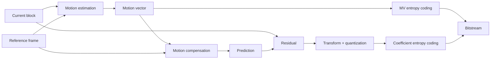
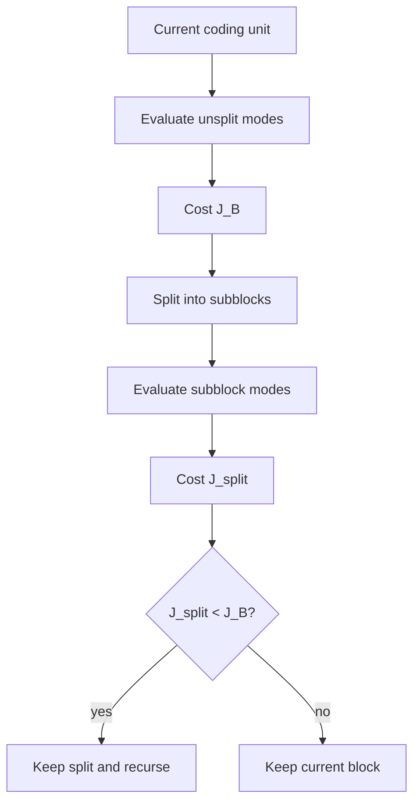
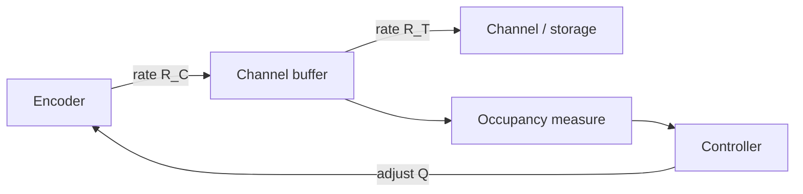

# Video Coding Principles

## Table of Contents

- [[#Core Idea|Core Idea]]
- [[#Key Concepts|Key Concepts]]
- [[#Theory and Formulas|Theory and Formulas]]
- [[#Visual Schemes|Visual Schemes]]
- [[#Examples|Examples]]

## Core Idea

**Video coding** compresses image sequences by exploiting two redundancies:

- **spatial redundancy**: neighboring pixels inside one frame are correlated;
- **temporal redundancy**: neighboring frames are similar over time.

Spatial redundancy is handled with image-coding tools such as transform, quantization, and entropy coding. Temporal redundancy is handled with **prediction**: encode a residual instead of encoding each frame independently.

> [!Important] Temporal prediction principle
> **Statement:** predict current frame/block from information available to decoder, then code prediction error plus side information.
>
> $$
> \text{coded data} = \text{prediction parameters} + \text{residual}
> $$
>
> **Meaning:** compression improves when residual is sparser and cheaper to encode than original signal.

![[Pics/8. Video Coding Principles/general-video-coder.png|560]]

General video coder: temporal compression removes inter-frame redundancy, spatial compression removes intra-frame redundancy, buffer/rate control adapts bitstream production.

## Key Concepts

### Predictive Video Coding

Simple temporal prediction reuses previous reconstructed frame:

$$
\hat{f}_{n,m,k}=\hat{f}_{n,m,k-1}
$$

This is **DPCM** in video form. It sends no motion parameter, but fails when objects or camera move.

![[Pics/8. Video Coding Principles/dpcm-prediction-loop.png|500]]

DPCM-like loop: current image is predicted from previous reconstructed image; quantized error enters frame buffer for future prediction.

### Motion Estimation and Motion Compensation

**Motion Estimation (ME)** finds displacement vectors. **Motion Compensation (MC)** uses those vectors to build predictor.

For block $B_k^{(\mathbf{p})}$ in current frame and reference block $B_h^{(\mathbf{p}+\mathbf{v})}$:

$$
J(\mathbf{v})=
d\left(B_k^{(\mathbf{p})},B_h^{(\mathbf{p}+\mathbf{v})}\right)
+\lambda_{\text{ME}}r(\mathbf{v})
$$

$$
\mathbf{v}^*(\mathbf{p})=\arg\min_{\mathbf{v}}J(\mathbf{v})
$$

where $d$ measures prediction error and $r(\mathbf{v})$ approximates vector coding cost.

![[Pics/8. Video Coding Principles/motion-estimation-example.png|600]]

ME searches for a displaced reference block whose content best matches current block.

### Motion-Vector Field Coding

Motion vectors have two components, usually $v_x$ and $v_y$. They are spatially structured because nearby blocks often follow same object or camera motion.

![[Pics/8. Video Coding Principles/motion-vector-components.png|560]]

Motion-vector components show scene-dependent structure; this correlation can be compressed.

Raw motion vectors are not sparse enough. Coding them directly wastes rate. Better solution: predict each vector from neighbors and entropy-code only difference.

$$
MVD = MV_{\text{actual}} - MVP
$$

Common predictor:

$$
MVP=\operatorname{median}(\mathbf{v}_A,\mathbf{v}_B,\mathbf{v}_C)
$$

where $A$ is left, $B$ is top, and $C$ is top-right.

![[Pics/8. Video Coding Principles/mv-median-predictor.png|320]]

Median MVP is robust near motion boundaries and reduces vector residual entropy.

### Intra, Inter, and Direct Modes

Video codecs work block by block. Each block chooses a **coding mode**:

| Mode | Prediction source | Main payload |
| :--- | :--- | :--- |
| **Intra** | current frame only | transform-coded block or intra residual |
| **Inter** | decoded reference frame(s) | motion vectors plus temporal residual |
| **Direct** | inferred motion | little side information, often higher distortion |
| **Lossless** | no quantization loss | high rate |

Mode choice is not standardized; bitstream syntax and decoder behavior are standardized.

### Frame Types and GOP

A **Group of Pictures (GOP)** defines frame dependencies:

- **I frame**: intra-coded, independent;
- **P frame**: predicted from previous anchor/reference frame;
- **B frame**: predicted from previous and/or future reference frames.

![[Pics/8. Video Coding Principles/gop-structure.png|560]]

GOP controls prediction dependencies, random access, compression efficiency, delay, and error propagation.

![[Pics/8. Video Coding Principles/b-frame-prediction.png|560]]

B frames can use forward, backward, or bidirectional prediction, improving compression but increasing delay and complexity.

### Hybrid Video Codec

Practical standards use **hybrid video coding**:

1. choose prediction mode and block partition;
2. predict block with intra or inter tools;
3. transform prediction residual;
4. quantize transform coefficients;
5. entropy-code coefficients and side information;
6. reconstruct block inside encoder and store it for future prediction.

> [!Important] Encoder reconstruction loop
> Encoder must predict from reconstructed data, not original data, because decoder only has reconstructed reference frames. This avoids encoder-decoder drift.

![[Pics/8. Video Coding Principles/hybrid-video-encoder.png|650]]

Hybrid encoder includes transform coding, ME/MC, intra prediction, entropy coding, channel buffer, and internal decoder loop.

![[Pics/8. Video Coding Principles/hybrid-video-decoder.png|520]]

Decoder is subset of encoder: it decodes side information and residuals, reconstructs blocks, and updates frame buffer.

### Video Encoding Standards

Standardized hybrid codecs share the same core architecture; generations differ mainly in degrees of freedom. Licensing also drives adoption:

| Standard | Note |
| :--- | :--- |
| **MPEG-1/2/4** | among the first standards, since 1988 |
| **H.264/AVC** | royalty-free |
| **H.265/HEVC** | partly patented |
| **H.266/VVC** | patented |
| **AV1, VP8, VP9** | royalty-free (Alliance for Open Media, AOM) |

**MPEG-1** is the first generation. It introduced the MP3 audio format (MPEG-1 Audio Layer III) and targets low-rate digital video:

| Parameter | MPEG-1 limit |
| :--- | :--- |
| coding rate | up to about $1.86$ Mbps |
| max resolution | about $720\times576$ at 30 fps |
| audio bitrate | 128 to 320 kbps |

Standards from MPEG-2 onward (H.264/HEVC/VVC, AV1) are detailed in [[#Modern Video Compression Standards]].

## Theory and Formulas

### Motion Compensation and Residual

Once ME selects best vector, MC prediction is:

$$
\hat{I}_k(\mathbf{p}) =
I_h\left(\mathbf{p}+\mathbf{v}^*(\mathbf{p})\right)
$$

For one block:

$$
E(\mathbf{p}) =
B_k^{(\mathbf{p})}
-B_h^{(\mathbf{p}+\mathbf{v}^*)}
$$

Decoder reconstructs inter-coded block as:

$$
B_k^{(\mathbf{p})} =
E(\mathbf{p})
+B_h^{(\mathbf{p}+\mathbf{v}^*)}
$$

![[Pics/8. Video Coding Principles/motion-compensation-example.png|560]]

Motion-compensated image plus residual: residual is sparse except where prediction fails, e.g. occlusions and new areas.

### Entropy of Motion Vectors

For a discrete vector-component distribution:

$$
H=-\sum_i p_i\log_2 p_i
$$

Entropy gives theoretical lower bound for lossless coding. If histogram support is wide, raw MV coding remains expensive even with good entropy coding.

![[Pics/8. Video Coding Principles/raw-mv-entropy.png|360]]

Raw MV histograms are not sharply concentrated around zero, so direct Exp-Golomb coding performs poorly.

After MVP prediction, MVD histogram is more concentrated:

![[Pics/8. Video Coding Principles/mvd-prediction-error.png|560]]

Prediction error has lower entropy than raw vector field, so entropy coding needs fewer bits.

### Motion Estimation Design Parameters

| Parameter | Options | Tradeoff |
| :--- | :--- | :--- |
| block size / shape | fixed or variable | small blocks improve prediction but increase rate and complexity |
| cost function | SAD, SSD, regularized | SSD favors PSNR; SAD is simpler and robust; regularization reduces vector rate |
| search strategy | full, hex, TZSearch | full search best in window; fast search much cheaper |
| motion model | translation, affine | translation is simple; affine can improve RD but costs more |

### GOP and Coding Order

B frames can depend on future anchor frames. Therefore **display order** and **coding/decoding order** may differ.

![[Pics/8. Video Coding Principles/frame-coding-order.png|560]]

Future references must be decoded before B frames that depend on them, creating delay.

I, P, and B frames have different rate and quality behavior:

![[Pics/8. Video Coding Principles/frame-rate-psnr.png|560]]

Typical adjusted rates: I frames are about $3$ to $5$ times larger than P frames and $10$ to $20$ times larger than B frames.

### Rate-Distortion Mode Selection

For fixed quantization step $Q$, choose coding mode $i_k$ for each block $k$.

Total distortion and rate:

$$
D=\sum_{k=1}^{K}D_k(i_k,Q)
\qquad
R=\sum_{k=1}^{K}R_k(i_k,Q)
$$

Lagrangian objective:

$$
J(\mathbf{i},Q,\lambda)=
\sum_{k=1}^{K}D_k(i_k,Q)
+\lambda\sum_{k=1}^{K}R_k(i_k,Q)
$$

Because global minimization is too expensive, encoders use block-wise mode decision:

$$
J_k(i_k,Q,\lambda)=D_k(i_k,Q)+\lambda R_k(i_k,Q)
$$

> [!Important] RDO objective
> **Statement:** choose mode with minimum $D+\lambda R$.
>
> **Meaning:** $\lambda$ controls quality-rate tradeoff. Large $\lambda$ penalizes rate more; small $\lambda$ favors lower distortion.

Empirical codec relations:

| Codec | Example relation |
| :--- | :--- |
| MPEG-2 | $\lambda=aQ^2+b$ |
| H.264 | $\lambda=c\cdot 2^{dQ+e}$ |

Motion-estimation multiplier often follows:

$$
\lambda_{\text{ME}}=\sqrt{\lambda}
$$

### RD Plane Slope

From $J=D+\lambda R$:

$$
D=-\lambda R+J
$$

For fixed $\lambda$, equal-cost candidates lie on lines with slope $-\lambda$.

![[Pics/8. Video Coding Principles/rd-mode-points.png|460]]

Each coding mode and partition gives different rate-distortion point.

![[Pics/8. Video Coding Principles/rd-slope-selection.png|460]]

RDO chooses point first touched by line with slope $-\lambda$ when line moves toward convex hull of candidates.

### Block Partition

Variable block-size coding treats splitting as another mode:

$$
J_{\text{split}}=\sum_i J_{\text{subblock}_i}
$$

Recursive decision:

1. compute current block cost $J_B$;
2. split into subblocks;
3. compute $J_{\text{split}}$;
4. split if $J_{\text{split}}<J_B$;
5. recurse until minimum block size or no gain.

This avoids exhaustive partition search but is suboptimal.

### Rate Control

Quantization step controls produced coding rate $R_C$, but actual rate depends on content. Target rate $R_T$ comes from channel/storage constraints.

Buffer feedback rules:

- if $R_C>R_T$, buffer occupancy grows; above $\gamma_{\text{high}}$, increase $Q$ to reduce rate;
- if $R_C<R_T$, buffer occupancy falls; below $\gamma_{\text{low}}$, decrease $Q$ to increase rate.

> [!Important] Rate control
> **Statement:** channel buffer drives quantization adaptation so produced stream rate tracks target transmission/storage rate.
>
> **Meaning:** rate control trades visual quality against buffer overflow/underflow safety.

## Visual Schemes

### Motion-Compensated Inter Coding

Encoder sends vector side information plus coded residual, not predicted pixels.

### Hybrid Codec Concept Map

![[Pics/8. Video Coding Principles/hybrid-video-concept-map.png|650]]

Concept map links GOP, temporal prediction, spatial transform coding, motion estimation, entropy coding, and rate control.

### Block Partition Decision

Partition selection is RD optimization over block geometry.

### Rate-Control Feedback

Increasing $Q$ lowers produced rate and quality; decreasing $Q$ raises rate and quality.

## Examples

### Raw Motion-Vector Coding

For *Flower* sequence, direct raw MV coding gives:

| Algorithm | Total bits | bits/vector | bits/pixel |
| :--- | ---: | ---: | ---: |
| Exp-Golomb | 3048 | 7.697 | 0.0301 |
| Huffman | 1582 | 3.995 | 0.0156 |
| Arithmetic | 1570 | 3.965 | 0.0155 |

> [!Example] Why Exp-Golomb fails here
> Exp-Golomb is efficient when values concentrate near zero. Raw MV components have broad support, so Huffman/arithmetic coding are much better.

### Predictive MV Coding Gain

After median MVP and MVD coding:

| Algorithm | No prediction bits | With prediction bits | Reduction |
| :--- | ---: | ---: | ---: |
| Exp-Golomb | 3048 | 1526 | 49.9% |
| Huffman | 1582 | 1211 | 23.5% |
| Arithmetic | 1570 | 1199 | 23.6% |

Best result in source example: **prediction + arithmetic coding**, $1199$ bits, $3.03$ bits/vector.

### Frame-Type Tradeoffs

| Frame type | Prediction | Rate | Complexity | Role |
| :--- | :--- | :--- | :--- | :--- |
| I | none | highest | low | random access, error reset |
| P | previous anchor | medium | high | efficient forward prediction |
| B | previous and future references | lowest | very high | best compression, adds delay |

I frames should keep high quality because prediction errors can propagate through GOP.

### Mode-Selection Interpretation

For one block, possible modes produce several $(R,D)$ points: Direct, Inter16, Inter8, Intra, Lossless. Encoder chooses minimum:

$$
J_k=D_k+\lambda R_k
$$

- high $\lambda$: save bits, choose low-rate modes such as Direct;
- low $\lambda$: preserve quality, choose lower-distortion modes such as fine Inter partitions or Lossless.

### Final Exam Summary

| Concept | Must remember |
| :--- | :--- |
| temporal prediction | code residual instead of full frame |
| ME | find vector minimizing $d+\lambda_{\text{ME}}r$ |
| MC | copy reference block indicated by vector |
| MVD | code vector residual after spatial prediction |
| GOP | controls dependencies, delay, access, compression |
| I/P/B | increasing prediction efficiency and complexity from I to B |
| hybrid codec | prediction + transform/quantization + entropy coding + reconstruction loop |
| RDO | choose mode/partition minimizing $D+\lambda R$ |
| rate control | adapt $Q$ from buffer occupancy |
| standardization | decoder and bitstream standardized; encoder decisions not standardized |

> [!Important] Main takeaway
> Video coding is joint optimization of prediction quality, residual sparsity, side-information rate, computational cost, and buffer constraints.
