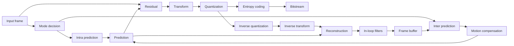
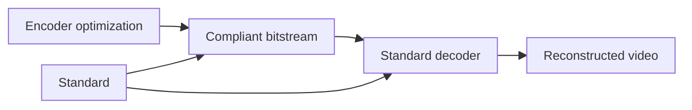
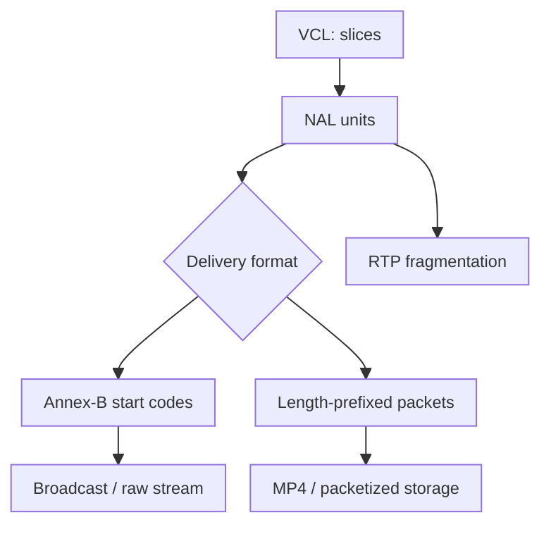

# Modern Video Compression Standards

## Table of Contents

- [[#Core Idea|Core Idea]]
- [[#Key Concepts|Key Concepts]]
- [[#Theory and Formulas|Theory and Formulas]]
- [[#Visual Schemes|Visual Schemes]]
- [[#Examples|Examples]]

## Core Idea

Modern video standards from MPEG-1 to H.266/VVC keep the same **hybrid video coding** paradigm:

- predict current block from spatial or temporal neighbors;
- code only prediction residual;
- transform and quantize residual;
- entropy-code coefficients and side information;
- reconstruct frame inside encoder to keep decoder and encoder synchronized.

> [!Important] Universal hybrid paradigm
> **Statement:** modern video standards share prediction, residual coding, transform, quantization, entropy coding, in-loop reconstruction, and reference-frame buffering.
>
> **Meaning:** codec generations mainly differ in how much freedom they give to partitioning, prediction, transforms, filters, and transport syntax.

![[Pics/9. Modern Video Compression Standards/universal-hybrid-encoder.png|650]]

Universal hybrid encoder: mode decision chooses Intra or Inter prediction, residual is transform-coded, and decoded reconstruction re-enters frame buffer to prevent drift.

## Key Concepts

### What Standards Define

Video standards do **not** standardize full encoder optimization. They standardize:

- bitstream syntax;
- decoder behavior;
- conformance rules.

Encoder choices such as motion search, rate control, partition pruning, and perceptual tuning remain open.

![[Pics/9. Modern Video Compression Standards/standard-scope-decoder.png|600]]

Standard scope: decoder and bitstream are fixed; encoder implementation is competitive design space.

> [!Important] Interoperability
> Any compliant decoder must produce same reconstruction from same valid bitstream. Encoders may differ in RDO search, heuristics, machine-learning pruning, and hardware scheduling.

### Historical Evolution

Generations improve compression by increasing degrees of freedom:

| Standard | Main design step | Cost |
| :--- | :--- | :--- |
| **MPEG-2** | basic hybrid coding | low complexity, weak compression |
| **H.264/AVC** | macroblocks, strong ME, CABAC/CAVLC | much better efficiency |
| **H.265/HEVC** | CTUs, quad-tree, larger transforms, SAO | higher encoder complexity |
| **H.266/VVC** | QT+MTT, affine tools, MTS, ALF | very high complexity |
| **AV1** | royalty-free web codec, superblocks, strong filters | high complexity, broad web focus |

![[Pics/9. Modern Video Compression Standards/codec-evolution-timeline.png|500]]

Codec evolution trades lower bitrate for much larger encoder search space.

> [!Important] Golden rule
> New codec generations often target roughly half bitrate for same perceptual quality, but encoder complexity can increase by about $10x$.

### Source 2026 Adoption Scenarios

Course notes frame codec adoption as ecosystem-driven:

| Ecosystem | Typical codecs | Main reason |
| :--- | :--- | :--- |
| real-time / legacy | H.264/AVC | universal hardware, low latency |
| broadcast / mobile | HEVC, H.264 | mature 4K hardware support |
| web streaming | AV1, H.264, HEVC | AV1 royalty-free appeal, H.264 compatibility |
| next-gen 8K / VR | VVC, AV1 | maximum compression, higher complexity |

Adoption depends on licensing, decoder hardware, battery cost, latency, and platform support, not only compression efficiency.

### Core Standard Tools

| Layer | Tool | Purpose |
| :--- | :--- | :--- |
| partitioning | MB, CTU, superblock, QT, MTT | adapt block geometry to content |
| prediction | Intra, Inter, Merge, affine | remove spatial/temporal redundancy |
| residual coding | DCT/DST/MTS transforms | compact residual energy |
| quantization | QP-controlled scalar quantization | rate-distortion control |
| entropy coding | CABAC / arithmetic coding | lossless syntax compression |
| filtering | deblocking, SAO, ALF, CDEF | avoid artifacts in reference frames |
| transport | VCL/NAL, NALUs, OBUs | map compressed video to networks/files |
| parallelism | slices, tiles, WPP | error containment and hardware speed |

## Theory and Formulas

### Rate-Distortion Optimization

For each coding decision:

$$
J=D+\lambda R
$$

where $D$ is distortion, $R$ is rate, and $\lambda$ controls quality-rate balance.

> [!Important] RDO
> Encoder should not select lowest distortion or lowest rate alone. It selects option minimizing weighted cost $D+\lambda R$.

Block splitting is also a mode decision:

$$
J_{\text{split}}=\sum_i J_{\text{subblock}_i}
$$

Split if:

$$
J_{\text{split}}<J_B
$$

This principle drives modern partition trees.

### Space Partitioning Evolution

#### H.264/AVC: Macroblocks

H.264 uses $16 \times 16$ **macroblocks**. Variable block-size partitioning supports:

- $16 \times 16$;
- $16 \times 8$;
- $8 \times 16$;
- $8 \times 8$, with sub-partitions down to $4 \times 4$.

Limitation: $16 \times 16$ maximum is inefficient for HD/4K smooth regions, where larger areas could be predicted with fewer bits.

#### H.265/HEVC: CTU and Quad-Tree

HEVC replaces macroblocks with **Coding Tree Units (CTUs)** up to $64 \times 64$. CTU splits recursively into square **Coding Units (CUs)** through quad-tree partitioning.

![[Pics/9. Modern Video Compression Standards/hevc-ctu-quadtree.png|500]]

HEVC quad-tree supports large blocks for smooth areas and small blocks around detail or object boundaries.

HEVC separates:

- **CU**: coding decision unit;
- **PU**: prediction unit;
- **TU**: transform unit.

#### H.266/VVC: QT + MTT

VVC expands CTUs up to $128 \times 128$ and introduces **Multi-Type Tree (MTT)**:

- quad-tree split;
- binary horizontal/vertical split;
- ternary horizontal/vertical split with $1:2:1$ ratio.

![[Pics/9. Modern Video Compression Standards/vvc-qt-mtt-partitioning.png|500]]

QT+MTT gives rectangular blocks, useful for object edges and directional textures, but increases RDO search complexity.

#### AV1: Superblock Partitioning

AV1 uses up to $128 \times 128$ **superblocks** and 10-way partitioning, including elongated $4:1$ and $1:4$ patterns.

![[Pics/9. Modern Video Compression Standards/av1-superblock-partitioning.png|500]]

AV1 partitioning gives high geometric freedom, especially for web-streaming efficiency.

### RDO Search Burden

Modern partitioning forms huge decision trees. Reference encoders often use DFS:

1. test parent block;
2. test splits;
3. evaluate Intra/Inter modes inside each node;
4. reconstruct blocks in causal order;
5. compare child cost against parent cost.

Search is partly sequential because top/left reconstructed pixels are needed for prediction.

Production encoders prune using:

- texture variance and gradients;
- temporal correlation from co-located blocks;
- early termination;
- learned split classifiers such as LightGBM or small CNNs.

### Intra Prediction

**Intra prediction** uses already decoded top and left neighbors to predict current block.

![[Pics/9. Modern Video Compression Standards/intra-prediction-neighbors.png|420]]

Spatial prediction is causal: only already reconstructed neighboring samples can be used.

Mode evolution:

| Standard | Intra modes |
| :--- | :--- |
| H.264/AVC | 4 modes for $16 \times 16$, 9 modes for $4 \times 4$ |
| H.265/HEVC | 35 modes: 33 directions plus DC and Planar |
| H.266/VVC | 65+ directional modes plus wide-angle modes |

Mode freedom grows with signaling bits:

$$
P \propto 2^B
$$

![[Pics/9. Modern Video Compression Standards/intra-prediction-directional-example.png|420]]

Directional modes improve texture prediction but require more signaling.

![[Pics/9. Modern Video Compression Standards/intra-small-block-combinatorics.png|420]]

For many small blocks, Intra-mode combinations explode; practical encoders search sequentially and prune.

### Most Probable Mode

If VVC exposes 67 Intra modes, naive signaling needs around 7 bits per block. For tiny $4 \times 4$ blocks this can erase prediction gains.

**Most Probable Mode (MPM)** solves this:

- build candidate list from top and left Intra modes;
- if selected mode is likely, send short index;
- HEVC uses 3 MPM candidates;
- VVC uses 6 MPM candidates.

### Inter Prediction

Inter prediction uses ME/MC and reference frames in the **Decoded Picture Buffer (DPB)**.

Modern tools:

- multiple reference frames;
- one P-list or two B-lists;
- generalized B-slices;
- weighted averaging of predictors;
- fractional-pel motion compensation.

![[Pics/9. Modern Video Compression Standards/multiple-reference-frames.png|520]]

Multiple reference frames let encoder choose best temporal predictor, not only nearest frame.

Sub-pixel precision:

| Codec family | Motion precision |
| :--- | :--- |
| H.264/HEVC/VVC | quarter-pel, $1/4$ pixel |
| AV1 | eighth-pel, $1/8$ pixel |

### Motion-Vector Prediction and Merge

Motion vectors must also be coded efficiently.

| Tool | Idea |
| :--- | :--- |
| H.264 Skip/Direct | use median of spatial neighbors; if correct, send no MV |
| HEVC/VVC Merge | build candidate list from spatial and temporal candidates; send index |

Merge mode shares both motion vector and reference index. It replaces raw MV transmission with small candidate index.

### Beyond Translational Motion

Modern codecs model more than 2D translation:

- **affine motion**: rotation, zoom, shear with 4 or 6 parameters;
- **compound prediction**: AV1 can combine Inter and Intra prediction in same block.

![[Pics/9. Modern Video Compression Standards/av1-affine-prediction.png|520]]

Affine prediction captures motion that a single translational vector cannot model well.

### Transforms

Residual transform evolution:

| Standard | Transform design |
| :--- | :--- |
| H.264/AVC | $4 \times 4$ integer DCT approximation |
| H.265/HEVC | transforms up to $32 \times 32$, DST for $4 \times 4$ Intra |
| H.266/VVC | Multiple Transform Selection, non-square transforms |

Integer transforms keep encoder/decoder synchronized and avoid mismatch from floating-point precision.

### Quantization and CABAC

Quantization is main lossy step. In H.264/HEVC:

- QP increase by 6 doubles quantization step size;
- QP increase by 1 changes rate by about $12.5\%$ empirically.

> [!Important] QP
> Higher QP means coarser quantization, lower bitrate, and higher distortion. QP is primary rate-control knob.

Modern standards rely on **CABAC**:

- binarizes syntax elements;
- adapts probabilities from spatial context;
- gives about 5%-15% rate reduction over older VLC/CAVLC.

### In-Loop Filters

Independent block transform and quantization create **blocking artifacts** at low bitrate.

![[Pics/9. Modern Video Compression Standards/blocking-artifacts.png|560]]

If artifacts enter DPB, future motion compensation uses damaged references. Therefore filters must be inside reconstruction loop and normative.

Filter evolution:

| Codec | Filters |
| :--- | :--- |
| H.264/AVC | deblocking on $4 \times 4$ edges |
| H.265/HEVC | lighter deblocking on $8 \times 8$ grid plus SAO |
| H.266/VVC | deblocking, SAO, ALF, LMCS |
| AV1 | CDEF, loop restoration, film grain synthesis |

### Slices

Slices divide pictures to contain errors and allow parallel work. At new slice:

- Intra prediction does not cross boundary;
- CABAC context is reset;
- decoder can resynchronize more easily.

![[Pics/9. Modern Video Compression Standards/slices-error-containment.png|500]]

Slices trade compression efficiency for robustness and parallelism.

### VCL, NAL, NALU, OBU

Starting from H.264, standards separate compression from transport:

- **VCL** (*Video Coding Layer*): prediction, transforms, RDO, slices;
- **NAL** (*Network Abstraction Layer*): encapsulation and metadata for transport/storage.

![[Pics/9. Modern Video Compression Standards/vcl-nal-layering.png|420]]

VCL produces compressed slices; NAL packages them for RTP/IP, MP4, MPEG-2 TS, or raw streams.

NALU types:

| Unit | Meaning |
| :--- | :--- |
| VCL NALU | compressed slice data: modes, MVs, coefficients |
| SPS | Sequence Parameter Set: sequence-level parameters |
| PPS | Picture Parameter Set: per-picture options |
| SEI | extra metadata: HDR, subtitles, user data |
| AUD | optional Access Unit Delimiter |

**Access Unit (AU)**: all NALUs needed to decode one frame.

![[Pics/9. Modern Video Compression Standards/nalu-access-unit.png|560]]

AU is frame-level decoding group; NALUs are syntax/transport units inside it.

AV1 uses **OBUs** (*Open Bitstream Units*) instead of MPEG-style NALUs.

### Annex-B vs Packetized Format

**Annex-B byte-stream** inserts start code before each NALU:

```text
0x00000001
```

It works for continuous streams but requires byte scanning and emulation prevention.

![[Pics/9. Modern Video Compression Standards/annex-b-byte-stream.png|560]]

Annex-B is good for raw `.264` and MPEG-TS style continuous delivery.

**Packetized length-prefixed** format writes a length field before each NALU. Parser can jump in $O(1)$, but if container boundaries are damaged, resynchronization is harder.

![[Pics/9. Modern Video Compression Standards/packetized-length-prefixed.png|560]]

Packetized format is software-friendly and common in MP4-like containers.

HEVC/VVC keep both formats and expand NALU header to 2 bytes for Temporal ID and Layer ID. AV1 drops Annex-B start codes and uses length-prefixed OBUs.

### Network-Friendly Operations

NAL structure lets intermediate nodes inspect stream without decoding:

- MANE can drop non-reference B frames under congestion;
- sensitive SPS/PPS can receive stronger protection, such as CRC;
- RTP can fragment large NALUs into Fragmentation Units and reassemble them.

![[Pics/9. Modern Video Compression Standards/nal-network-inspection.png|560]]

NAL headers allow network-aware pruning, protection, and packet fragmentation.

### Random Access

Random access points define where decoding may restart cleanly.

![[Pics/9. Modern Video Compression Standards/random-access-idr-cra-bla.png|600]]

| RAP type | Meaning | Use |
| :--- | :--- | :--- |
| **IDR** | clears DPB; future frames cannot reference before IDR | clean restart, scene cuts |
| **CRA** | Intra picture; leading RASL frames may reference past in normal playback | efficient seeking in HEVC+ |
| **BLA** | like CRA but signals broken past references | splicing, ad insertion, transcoding |

CRA improves compression compared with frequent IDR because normal playback can keep useful past references.

### Tiles and WPP

**Tiles** group CTUs into independent rectangular regions:

- self-contained prediction constraints;
- parallel encoding/decoding;
- useful for viewport-adaptive 360-degree video.

![[Pics/9. Modern Video Compression Standards/tiles-parallelism.png|520]]

Tiles enable independent rectangular processing regions.

![[Pics/9. Modern Video Compression Standards/tiles-360-video.png|520]]

360-degree streaming sends high quality only for viewport tiles and low quality elsewhere.

> [!Important] Tile bandwidth saving
> Tile-based adaptive 360-degree streaming can reduce bandwidth by about 50%-60% without degrading perceived viewport quality.

**Wavefront Parallel Processing (WPP)** starts CTU row encoding after two CTUs of previous row are ready.

![[Pics/9. Modern Video Compression Standards/wavefront-parallel-processing.png|520]]

WPP preserves spatial prediction contexts while enabling row-level multicore parallelism.

## Visual Schemes

### Modern Hybrid Encoder Loop



Internal decoder loop makes encoder use same references as decoder.

### Standard Abstraction



Standards constrain bitstream and decoder, not full encoder search algorithm.

### Transport Mapping



NAL separates compression syntax from delivery syntax.

## Examples

### UVG HoneyBee Comparison

Source sequence: 1080p, 120 fps, target 2.0 Mbps.

| Codec | Actual rate | PSNR | Encoding time |
| :--- | ---: | ---: | ---: |
| MPEG-2 | 7.06 Mbps | 36.58 dB | 2.18 s |
| H.264 | 2.00 Mbps | 40.51 dB | 17.06 s |
| HEVC | 1.98 Mbps | 41.69 dB | 109.45 s |
| AV1 | 1.80 Mbps | 43.47 dB | 158.66 s |
| VVC | 1.98 Mbps | 43.81 dB | 105.08 s |

> [!Example] Takeaway
> MPEG-2 cannot meet target bitrate on this sequence. H.264 reaches target. HEVC, AV1, and VVC give higher PSNR but require far larger encoding time.

### UVG Bosphorus Comparison

Source sequence: 1080p, 120 fps, VBV target 2.0 Mbps.

| Codec | Actual rate | PSNR | Encoding time |
| :--- | ---: | ---: | ---: |
| MPEG-2 | 8.47 Mbps | 36.14 dB | 2.45 s |
| H.264 | 2.03 Mbps | 35.58 dB | 19.20 s |
| HEVC | 1.97 Mbps | 38.82 dB | 143.83 s |
| AV1 | 1.98 Mbps | 40.69 dB | 147.13 s |
| VVC | 1.96 Mbps | 41.00 dB | 139.08 s |

> [!Note] Missing visual
> Source references HoneyBee and Bosphorus visual codec-comparison figures, but no corresponding image asset was present in available course image folders. Metric tables preserve exam-relevant comparison.

### Partition Evolution Summary

| Codec | Largest unit | Partition style | Main tradeoff |
| :--- | :--- | :--- | :--- |
| H.264/AVC | $16 \times 16$ macroblock | fixed VBS shapes | simple, limited for HD/UHD |
| HEVC | $64 \times 64$ CTU | quad-tree | good UHD adaptation |
| VVC | $128 \times 128$ CTU | QT + binary/ternary MTT | best flexibility, high search cost |
| AV1 | $128 \times 128$ superblock | 10-way split | flexible royalty-free web codec |

### Final Exam Table

| Concept | Must remember |
| :--- | :--- |
| hybrid paradigm | same core architecture from MPEG-1 to VVC |
| standard scope | bitstream + decoder standardized, encoder free |
| RDO | every mode/partition decided by $J=D+\lambda R$ |
| complexity growth | more freedom improves compression but expands search tree |
| Intra evolution | directions grow from H.264 to HEVC to VVC |
| MPM | predicts Intra mode to reduce signaling |
| Inter evolution | multiple references, merge mode, fractional ME, affine motion |
| transform evolution | larger/flexible transforms and MTS for residuals |
| QP | main lossy rate-control knob; +6 QP doubles step size |
| CABAC | adaptive arithmetic coding for syntax elements |
| in-loop filters | protect future references from blocking/ringing |
| VCL/NAL | compression separated from transport |
| Annex-B | start-code byte stream for continuous delivery |
| packetized format | length-prefixed NALUs for containers |
| AV1 OBU | AV1 replaces NALUs with length-prefixed OBUs |
| IDR/CRA/BLA | random access and stream splicing tools |
| tiles | independent regions for parallelism and 360 streaming |
| WPP | row-level CTU parallelism with two-CTU offset |

> [!Important] Main takeaway
> Modern standards improve compression by adding controlled freedom. Encoder must spend computation to search partitions, modes, vectors, transforms, filters, and syntax choices, while decoder remains standardized and deterministic.
