# Multimedia Communications - complete notes

## Lectures

1. [[#Introduction to multimedia compression]]
2. [[#Scalar and predictive quantization]]
3. [[#Lossless coding]]
4. [[#Transform coding]]
5. [[#Wavelet analysis]]
6. [[#Learned image compression]]
7. [[#Motion estimation]]
8. [[#Video coding principles]]
9. [[#Modern video compression standards]]
10. [[#Audio coding]]
11. [[#Quality assessment and quality of experience for multimedia services]]
12. [[#Adaptive streaming]]

---

# Introduction to multimedia compression

## Contents

- [[#Core idea|Core idea]]
- [[#Main concepts|Main concepts]]
- [[#Theory and formulas|Theory and formulas]]
- [[#Visual schemes|Visual schemes]]
- [[#Examples|Examples]]

## Core idea

Multimedia compression is needed because raw image, video, and audio data rates are far above practical storage and transmission limits. Effective codecs reduce rate by exploiting:

- **Statistical redundancy**: correlation between nearby samples or frames.
- **Perceptual redundancy**: details humans cannot see or hear well.
- **Semantic redundancy**: task-irrelevant content, especially when the receiver is a machine.

Compression is always a design tradeoff among **rate**, **quality**, **complexity**, **delay**, and **robustness**.

> [!Important] Main compression principle
> A codec should spend bits where errors are visible or useful, and remove information that is predictable, imperceptible, or irrelevant to the final task.

## Main concepts

### Multimedia representation

- **Gray image**
    - Discrete representation: $N \times M$ samples $f_{n,m}$
    - Main dependency: spatial correlation
- **Color image**
    - Discrete representation: three components, usually RGB or YCbCr
    - Main dependency: luma/chroma sensitivity
- **Video**
    - Discrete representation: sequence of color images over time
    - Main dependency: spatial and temporal correlation
- **Audio**
    - Discrete representation: time signal or frequency components
    - Main dependency: hearing threshold and masking

For an image scanned in raster order:

$$
k = (n-1)M + m, \qquad f_{n,m} = f_k
$$

For digital video:

$$
I : (n,m,T,c) \rightarrow x \in \{0,1,\ldots,2^b-1\}
$$

where $(n,m)$ is position, $T$ is frame index, $c$ is color component, and $b$ is bit depth.

### Human visual system

- **Cones**: 6-7 million, concentrated near the fovea, responsible for color and high spatial resolution under good illumination.
- **Rods**: 75-150 million, more sensitive in low light, mainly detect intensity with lower resolution.
- Perceived brightness is approximately **logarithmic** with physical intensity.
- The eye adapts to illumination, so it cannot use the full physical dynamic range at once.

![[Pics/1. Introduction to Multimedia Compression/hvs-receptors.png|500]]

Retinal receptors explain why compression can treat brightness, color, and fine details differently.

> [!Important] Contrast Sensitivity Function (CSF)
> The **CSF** gives sensitivity to luminance changes as a function of spatial frequency.
>
> $$
> \text{sensitivity} = \frac{1}{\text{minimum detectable contrast}}
> $$
>
> Sensitivity is highest around **2-5 cycles/degree** and lower at very low and very high spatial frequencies.
>
> Compression meaning: high-frequency errors are often less visible, so high-frequency transform coefficients can be quantized more coarsely.

### Color perception and color spaces

Visible light lies roughly between **400 nm and 700 nm**. Cone sensitivities are uneven:

- Red-sensitive cones: about **65%**, peak near 575 nm.
- Green-sensitive cones: about **33%**, peak near 535 nm.
- Blue-sensitive cones: about **2%**, peak near 445 nm.

Color perception is **tristimulus**: a color corresponds to the 3D response vector of the three cone classes.

- **RGB**: Components: Red, Green, Blue; Compression relevance: Device-oriented; three full-resolution channels.
- **HSV**: Components: Hue, Saturation, Value; Compression relevance: Perceptual description of color.
- **YCbCr**: Components: Luminance Y, chrominance Cb/Cr; Compression relevance: Separates brightness from color; enables chroma subsampling.

> [!Important] ITU-R BT.601 RGB to YCbCr
> $$
> \begin{bmatrix}
> Y\\
> Cb\\
> Cr
> \end{bmatrix}
> =
> \begin{bmatrix}
> 0.299 & 0.587 & 0.114\\
> -0.1687 & -0.3313 & 0.5\\
> 0.5 & -0.4187 & -0.0813
> \end{bmatrix}
> \begin{bmatrix}
> R\\
> G\\
> B
> \end{bmatrix}
> +
> \begin{bmatrix}
> 0\\
> 128\\
> 128
> \end{bmatrix}
> $$
>
> The luminance weights follow visual sensitivity: green contributes most, blue least. The $+128$ offset centers chroma components in the 8-bit range.

### Sound perception

Audio coding uses a psychoacoustical model. A pure tone

$$
x(t)=a\sin(2\pi f_1 t)
$$

has power

$$
\sigma^2 = \frac{a^2}{2}
$$

and excites several nerve fibers instead of a single one.

For auditory filter $k$:

$$
H_k(f)=A_k(f)e^{j\phi_k(f)}
$$

The response to tone $f_1$ is:

$$
y_k(t)=aA_k(f_1)\sin(2\pi f_1t+\phi_k(f_1))
$$

The **spreading function** is:

$$
S_E(k)=A_k^2(f_1)
$$

> [!Important] Hearing threshold
> $S_a(f)$ is the minimum power for a tone at frequency $f$ to be audible. It is lowest around **1-4 kHz**, where human hearing is most sensitive.
>
> Compression meaning: components below the threshold can be discarded or hidden under quantization noise.

> [!Important] Critical band
> Sinusoids close in frequency are integrated by hearing. For $N$ sinusoids near $f_1$:
>
> $$
> \sum_i \sigma_i^2 > S_a(f_1)
> $$
>
> The frequency interval where this energy integration holds is the **critical band**.

### Chroma subsampling

Notation $J:a:b$ describes chroma samples relative to a luma reference block:

- $J$: horizontal luma reference size, usually 4.
- $a$: chroma samples in the first line.
- $b$: chroma samples in the second line.

- **4:4:4**: Horizontal chroma resolution: Full; Vertical chroma resolution: Full; Use: High quality, no chroma reduction.
- **4:2:2**: Horizontal chroma resolution: Half; Vertical chroma resolution: Full; Use: Professional video.
- **4:2:0**: Horizontal chroma resolution: Half; Vertical chroma resolution: Half; Use: Most common image/video coding format.
- **4:1:1**: Horizontal chroma resolution: Quarter; Vertical chroma resolution: Full; Use: Older video systems.

For **YCbCr 4:2:0**, Y is full resolution, Cb and Cr are half resolution horizontally and vertically:

$$
\frac{4+1+1}{4+4+4}=\frac{6}{12}=0.5
$$

This gives **50% data reduction** compared with full RGB/YUV 4:4:4 before any transform or entropy coding.

### Compression tools

- **Transform**
  - Role: concentrates energy in few coefficients, e.g. DCT, wavelets, neural transforms
  - Lossy: no by itself

- **Prediction**
  - Role: removes spatial or temporal redundancy
  - Lossy: no by itself

- **Quantization**
  - Role: maps values to fewer levels; reduces precision
  - Lossy: **yes**

- **Entropy coding**
  - Role: removes residual statistical redundancy, e.g. VLC, arithmetic coding
  - Lossy: no

In classical codecs, transform, prediction, and entropy coding can be reversible. The irreversible rate reduction comes from **quantization**.

### Lossless vs. lossy compression

- **Reconstruction**
  - Exact
  - Approximate

- **Exploits**
  - Exact: statistical redundancy
  - Approximate: statistical + perceptual redundancy

- **Main tool**
  - Exact: entropy coding, reversible prediction/transform
  - Approximate: quantization plus perceptual modeling

- **Typical image ratio**
  - Exact: $T \leq 3$
  - Approximate: $T \approx 5$ or higher

- **Typical video ratio**
  - Exact: limited
  - Approximate: $T \approx 20$ or higher

### Machine-centric multimedia

Not all multimedia is consumed by humans. Cameras in surveillance, IoT, industry, and robotics often feed algorithms.

For a **human receiver**, the priority is **perceptual quality**, so the compression goal is to hide distortion below the limits of the human visual or auditory system, HVS/HAS.
For a **machine receiver**, the priority is **task accuracy**, so compression should preserve the semantic features needed by the model.

**Task-oriented communication** can discard visually important but task-irrelevant information if the downstream algorithm still performs well.

## Theory and formulas

### Quantization and bit depth

If a scalar sample is represented with $L$ levels:

$$
b = \log_2 L
$$

where $b$ is bits per sample. Standard 8-bit components have:

- $L=256$ gray levels.
- RGB: $256^3 \approx 16$ million colors.
- 24 bpp for full RGB.

HDR content may use 32-64 bits per channel.

### Rate and compression ratio

> [!Important] Compression ratio
> $$
> T = \frac{B_{\text{in}}}{B_{\text{out}}}
>   = \frac{R_{\text{in}}}{R_{\text{out}}}
> $$
>
> $T$ measures how many times the coded representation is smaller than the original.
>
> Coding rate:
>
> $$
> R_{\text{image}} = \frac{B_{\text{out}}}{NM} \quad [\text{bpp}]
> $$
>
> $$
> R_{\text{audio/video}} = \frac{B_{\text{out}}}{T} \quad [\text{bps}]
> $$
>
> Typical values:
>
> - **Lossless image coding**: Typical compression ratio: $T \leq 3$.
> - **Lossy image coding**: Typical compression ratio: $T \approx 5$ to much higher.
> - **Lossy video coding**: Typical compression ratio: $T \approx 20$ to much higher.

### Objective quality metrics

Let $f$ be the original image and $\tilde{f}$ the decoded image. The error image is:

$$
\mathcal{E}(f,\tilde{f}) = f-\tilde{f}
$$

> [!Important] MSE and PSNR
> $$
> \mathcal{D}(f,\tilde{f}) =
> \frac{1}{NM}\|\mathcal{E}\|^2 =
> \frac{1}{NM}\sum_{n,m}\mathcal{E}_{n,m}^2
> $$
>
> $$
> \text{PSNR}(f,\tilde{f}) =
> 10\log_{10}\left(\frac{255^2}{\mathcal{D}(f,\tilde{f})}\right)
> \quad [\text{dB}]
> $$
>
> **Meaning:** MSE/PSNR are simple and analytically useful, but they do not model perception.

Weighted PSNR introduces a filter $h$ that weights errors according to perceptual sensitivity:

$$
\mathcal{D}_W = \frac{1}{NM}\|h * \mathcal{E}\|^2
$$

$$
\text{WPSNR}(f,\tilde{f}) =
10\log_{10}\left(\frac{255^2}{\mathcal{D}_W}\right)
$$

### SSIM

> [!Important] Structural Similarity Index
> For image blocks $x$ and $y$:
>
> $$
> \text{SSIM}(x,y)=
> \frac{(2\mu_x\mu_y+C_1)(2\sigma_{xy}+C_2)}
> {(\mu_x^2+\mu_y^2+C_1)(\sigma_x^2+\sigma_y^2+C_2)}
> $$
>
> SSIM combines:
>
> $$
> l(x,y)=\frac{2\mu_x\mu_y+C_1}{\mu_x^2+\mu_y^2+C_1}
> $$
>
> $$
> c(x,y)=\frac{2\sigma_x\sigma_y+C_2}{\sigma_x^2+\sigma_y^2+C_2}
> $$
>
> $$
> s(x,y)=\frac{\sigma_{xy}+C_3}{\sigma_x\sigma_y+C_3}
> $$
>
> Image SSIM is the average over blocks. Range is $[0,1]$, with 1 meaning identical.

### Learned perceptual metrics

**LPIPS** (*Learned Perceptual Image Patch Similarity*) compares images in a neural feature space, often using pre-trained VGG or ViT features. It is useful when pixel metrics fail, especially for highly compressed, generated, or neural-coded images.

### Subjective quality

Subjective tests with human observers are the reference for perceived quality, but they are expensive and statistically demanding. Objective metrics are proxies:

- **PSNR**: easy, pixel-based.
- **SSIM**: structure-aware.
- **LPIPS**: learned perceptual feature distance.

### Complexity, delay, and robustness

Beyond rate and quality, codecs must balance:

- **Complexity**: real-time feasibility, hardware cost, power consumption.
- **Delay**: especially encoder delay; often depends on coding order and look-ahead.
- **Robustness**: sensitivity of compressed bitstreams to channel loss or packet errors.

- **Higher quality**: Typical conflict: Higher rate or complexity.
- **Lower rate**: Typical conflict: Lower quality or higher delay.
- **Lower delay**: Typical conflict: Less look-ahead, weaker compression.
- **Higher robustness**: Typical conflict: More redundancy or lower compression efficiency.

## Visual schemes

### Visual and auditory perception

![[Pics/1. Introduction to Multimedia Compression/contrast-sensitivity-function.png|500]]

CSF shows why compression can quantize frequencies differently: mid spatial frequencies are most visible, while very low and very high frequencies can tolerate larger errors.

![[Pics/1. Introduction to Multimedia Compression/hearing-threshold.png|500]]

The hearing threshold identifies inaudible components that can be removed or used to hide quantization noise.

![[Pics/1. Introduction to Multimedia Compression/critical-band.png|400]]

Critical bands explain why nearby tones interact and why audio coders group frequency components.

![[Pics/1. Introduction to Multimedia Compression/frequency-masking.png|500]]

Frequency masking allows a strong tone to hide weaker tones nearby in frequency.

![[Pics/1. Introduction to Multimedia Compression/temporal-masking.png|500]]

Temporal masking permits distortion shortly before and after a strong sound, especially after the masker.

### Color and chroma sampling

![[Pics/1. Introduction to Multimedia Compression/chroma-subsampling.png|600]]

Chroma subsampling reduces color resolution because humans are more sensitive to luminance than chrominance.

### Compression pipeline

![[Pics/1. Introduction to Multimedia Compression/compression-tools.png|500]]

This block scheme summarizes the main codec tools: prediction/transform reduce redundancy, quantization reduces rate, and entropy coding packs symbols efficiently.

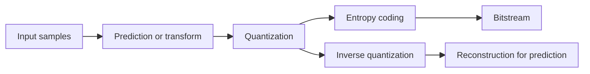

### Quality assessment chain

![[Pics/1. Introduction to Multimedia Compression/weighted-psnr.png|500]]

Weighted PSNR filters the error before measuring energy, so distortions are penalized according to perceptual visibility.

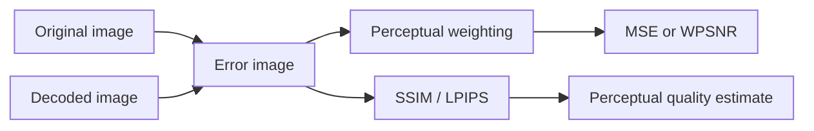

### Video perception

![[Pics/1. Introduction to Multimedia Compression/spatio-temporal-csf.png|500]]

Video perception depends on spatial and temporal frequencies; scene changes create masking and can temporarily hide distortion.

## Examples

> [!Example] Uncompressed HD DVB data rate
> Setup: one luma component $1920 \times 1080$, two chroma components $960 \times 540$, 8 bits/sample, 50 fps.
>
> $$
> R = (1920\cdot1080 + 2\cdot960\cdot540)\cdot8\cdot50
> \approx 1.24\ \text{Gbps}
> $$
>
> A 2-hour movie needs about **1.12 TB** uncompressed.
>
> Takeaway: raw video is too large; compression is not optional.

> [!Example] 4:2:0 data reduction
> Full 4:4:4 stores 4 Y samples, 4 Cb samples, and 4 Cr samples in a reference area. 4:2:0 stores 4 Y samples, 1 Cb sample, and 1 Cr sample:
>
> $$
> \frac{4+1+1}{4+4+4} = 0.5
> $$
>
> Takeaway: chroma subsampling alone halves the raw color data.

> [!Example] Same MSE, different perception
> Source examples compare several distortions with similar or equal MSE.
>
> | Error type | MSE | SSIM |
> | :--- | :--- | :--- |
> | Distributed white noise, $\sigma=4$ | 16 | 0.906 |
> | Concentrated on $100\times100$ pixels | 16 | 0.972 |
> | Concentrated on contours | 16 | 0.987 |
> | Noise on high spatial frequencies | 16 | 0.882 |
> | Chroma subsampling | 21.27 | - |
>
> Takeaway: MSE alone is misleading because it ignores where and how errors appear.

> [!Example] Codec comparison at about 50 KB
> The source compares codecs on the same image target size.
>
> | Codec | Year | Size (Bytes) | Ratio | PSNR |
> | :--- | :--- | :--- | :--- | :--- |
> | Original | - | 6,220,800 | 1.0:1 | - |
> | PNG | 1996 | 2,923,960 | 2.1:1 | - |
> | 4:2:0 only | - | 3,110,400 | 2.0:1 | 43.05 dB |
> | JPEG | 1991 | 49,795 | 124.9:1 | 26.89 dB |
> | JPEG 2000 | - | 50,943 | 122.1:1 | 29.82 dB |
> | WebP | 2010 | 42,676 | 145.8:1 | 30.88 dB |
> | AVIF | 2019 | 48,745 | 127.6:1 | 32.45 dB |
>
> Takeaway: at similar size, newer codecs can provide better objective quality.

---

# Scalar and predictive quantization

## Contents

- [[#Core idea|Core idea]]
- [[#Main concepts|Main concepts]]
- [[#Theory and formulas|Theory and formulas]]
- [[#Visual schemes|Visual schemes]]
- [[#Examples|Examples]]

## Core idea

**Quantization** maps a continuous or high-precision signal to a finite set of reconstruction values. It is the main irreversible step in lossy compression: it reduces rate, but introduces distortion.

Scalar quantization alone is weak for natural images and audio because it treats each sample independently. **Predictive quantization** first removes predictable content, then quantizes the prediction error. If the prediction error has much lower variance and is entropy-coded, the rate-distortion gain is large.

> [!Important] Central message
> Quantization controls distortion; prediction reduces variance before quantization; entropy coding converts sparse prediction errors into real bitrate savings.

## Main concepts

### Scalar quantizer model

A scalar quantizer $Q$ is defined by:

- **Thresholds**:

$$
-\infty=t^0<t^1<\cdots<t^{L-1}<t^L=+\infty
$$

- **Quantization regions**:

$$
\Theta^i=[t^{i-1},t^i), \qquad i=1,\ldots,L
$$

- **Reconstruction levels**:

$$
\hat{x}^1,\hat{x}^2,\ldots,\hat{x}^L
$$

Mapping rule:

$$
x\in\Theta^i \Rightarrow Q(x)=\hat{x}^i
$$

Main quantities:

- **Quantization error**: Formula: $e=X-Q(X)=X-\tilde{X}$; Meaning: sample error.
- **Distortion**: Formula: $D=\sigma_Q^2=\mathbb{E}[(X-Q(X))^2]$; Meaning: MSE due to quantization.
- **Rate**: Formula: $R=\log_2 L$; Meaning: fixed-length bits/sample.
- **SNR**: Formula: $10\log_{10}(\sigma_X^2/\sigma_Q^2)$; Meaning: signal quality in dB.

### Uniform quantization

**Uniform quantization (UQ)** uses equal-width cells inside dynamic range $[-A/2,A/2]$:

$$
\Delta=\frac{A}{L}=A2^{-R}
$$

Reconstruction levels are cell centers:

$$
\hat{x}^i=-\frac{A}{2}+\left(i-\frac{1}{2}\right)\Delta
$$

For a midrise quantizer:

$$
Q(x)=\Delta\left\lfloor\frac{x}{\Delta}+\frac{1}{2}\right\rfloor
$$

with saturation at $\pm A/2$.

- **Midtread**: Number of levels: odd; Zero reconstruction level: yes; Typical property: dead-zone around zero.
- **Midrise**: Number of levels: even; Zero reconstruction level: no; Typical property: common for signed fixed-rate quantization.

### Dead-zone

A **midtread** quantizer keeps zero as a reconstruction level, so the central cell around zero behaves as a **dead-zone**: any sample with small magnitude falls inside it and maps exactly to zero. A **dead-zone quantizer** widens this zero region by a factor $\tau$, so even more low-amplitude samples collapse to zero.

Index (forward) and reconstruction (inverse), extending the midtread zero region:

$$
i=
\begin{cases}
\operatorname{sign}(x)\left\lfloor\dfrac{|x|+\frac{\tau\Delta}{2}}{\Delta}\right\rfloor & |x|\geq\tau\\
0 & \text{otherwise}
\end{cases}
\qquad
\hat{x}=
\begin{cases}
\operatorname{sign}(i)\,\Delta\left(|i|+\dfrac{1-\tau}{2}\right) & |x|\geq\tau\\
0 & \text{otherwise}
\end{cases}
$$

Parameter $\tau$ controls the dead-zone width: larger $\tau$ sends more samples to zero.

> [!Important] Why dead-zone helps lossy compression
> Natural signals are not sparse in their original domain, but become sparse after **prediction** or **linear transform**. A signal is sparse when most elements are zero or near zero. Setting near-zero values to zero adds little distortion, so the dead-zone produces many zero indexes. Sparse zero-heavy output is then cheap to entropy-code, which is where the real rate saving comes from.


This connects to the [[#Predictive scalar quantization|predictive]] and entropy-coding sections: a midrise quantizer maps even small fluctuations to a non-zero level, while a midtread dead-zone suppresses them, favoring sparsity.

### Granular noise vs. overload noise

- **Granular noise**: input lies inside dynamic range, so $|e|\leq\Delta/2$.
- **Overload noise**: input exceeds dynamic range, so clipping creates potentially large error.

Design tension:

- Smaller $\Delta$ gives lower granular noise but requires either more levels or narrower dynamic range.
- Smaller dynamic range increases clipping risk.
- Larger dynamic range avoids clipping but wastes levels and increases $\Delta$ for fixed $R$.

### Rate-distortion behavior

For a uniform random variable and UQ:

$$
D=\sigma_X^2 2^{-2R}
$$

so every extra bit reduces distortion by about a factor 4 and increases SNR by about **6 dB**.

For generic sources at high resolution:

$$
D=K_X\sigma_X^2 2^{-2R}
$$

where $K_X$ depends on dynamic-range loading.

For high-resolution optimal scalar quantization:

$$
D=c_X\sigma_X^2 2^{-2R}
$$

where $c_X$ depends only on source PDF shape.

### Optimal scalar quantization

Uniform quantizers are not always optimal. **Non-uniform scalar quantizers** allocate smaller cells where the input PDF is dense and larger cells where samples are rare.

The finite-rate optimum is found numerically with **Lloyd-Max**:

1. Given reconstruction levels, choose thresholds by nearest neighbor.
2. Given thresholds, choose reconstruction levels as centroids.
3. Repeat until distortion stops decreasing.

This is the scalar case of the same alternating idea behind *k-means*.

### Predictive scalar quantization

Scalar quantization ignores correlation. Predictive quantization uses past samples to predict the current one:

$$
y(n)=x(n)-v(n)
$$

where $v(n)$ is the prediction. If prediction is good, $\sigma_Y^2\ll\sigma_X^2$, so quantizing $y(n)$ is easier than quantizing $x(n)$ directly.

> [!Important] Sparse residual idea
> Natural images and audio are not sparse in their sample domain, but prediction can make residuals sparse. Sparse residuals produce many zero or near-zero quantizer indexes, which entropy coding can compress well.

### Drift problem

In predictive coding, encoder and decoder must predict from the **same reconstructed past samples**. If the encoder predicts from original samples but the decoder predicts from reconstructed samples, their predictors diverge and reconstruction drifts.

Correct predictive quantization is therefore **closed-loop**:

- Encoder quantizes the residual.
- Encoder reconstructs locally.
- Encoder and decoder both update prediction buffers with reconstructed samples $\tilde{x}$.

### Entropy coding impact

Using $R=\log_2 L$ assumes fixed-length indexes and hides the advantage of predictive quantization. Prediction errors are concentrated near zero, so variable-length or arithmetic coding assigns short codes to frequent zero indexes and longer codes to rare large errors.

Without entropy coding, predictive quantization may look disappointing. With entropy coding, it can provide large gains.

## Theory and formulas

### UQ of a uniform random variable

Let:

$$
X\sim\mathcal{U}\left(-\frac{A}{2},\frac{A}{2}\right)
$$

Then:

$$
f_X(x)=\frac{1}{A}, \qquad \sigma_X^2=\frac{A^2}{12}
$$

For UQ with $L$ cells:

$$
\sigma_Q^2
=\mathbb{E}[(X-\tilde{X})^2]
=\frac{1}{A}\sum_{i=1}^{L}\int_{\hat{x}^i-\Delta/2}^{\hat{x}^i+\Delta/2}(u-\hat{x}^i)^2\,du
$$

Each cell contributes $\Delta^3/12$, so:

$$
D=\sigma_Q^2=\frac{1}{A}L\frac{\Delta^3}{12}
=\frac{\Delta^2}{12}
$$

Since $\Delta=A/L=A2^{-R}$:

$$
D=\frac{A^2}{12L^2}
=\sigma_X^2 2^{-2R}
$$

> [!Important] 6 dB per bit rule
> $$
> \mathrm{SNR}
> =10\log_{10}\frac{\sigma_X^2}{\sigma_X^2 2^{-2R}}
> =10\log_{10}(2^{2R})
> \approx 6R \quad [\mathrm{dB}]
> $$
>
> Each additional bit/sample improves SNR by about 6 dB under uniform high-resolution assumptions.

### High-resolution UQ for a generic source

High resolution means $L\to+\infty$ and each quantization cell is small. Locally, $p_X(x)$ is approximately constant, so the quantization error behaves like:

$$
e\sim\mathcal{U}\left(-\frac{\Delta}{2},\frac{\Delta}{2}\right)
$$

Thus:

$$
D=\frac{\Delta^2}{12}
=\frac{A^2}{12}2^{-2R}
=K_X\sigma_X^2 2^{-2R}
$$

with load factor:

$$
\gamma^2=\frac{A^2/4}{\sigma_X^2}, \qquad K_X=\frac{\gamma^2}{3}
$$

So:

$$
\mathrm{SNR}\approx 6R-10\log_{10}\frac{\gamma^2}{3}
$$

Meaning: poor dynamic-range loading costs SNR.

### High-resolution optimal scalar quantizer

For a generic PDF and fixed rate:

$$
\sigma_Q^2=c_X\sigma_X^2 2^{-2R}
$$

where $U=X/\sigma_X$ and:

$$
c_X=\frac{1}{12}\left[\int_{\mathbb{R}}p_U^{1/3}(t)\,dt\right]^3
$$

- **Uniform**: Shape factor $c_X$: $1$; Meaning: best case for UQ.
- **Gaussian**: Shape factor $c_X$: $\frac{\sqrt{3}}{2}\pi\approx2.72$; Meaning: heavier tails increase distortion.

### Lloyd-Max conditions

> [!Important] Lloyd-Max necessary conditions
> Nearest-neighbor thresholds:
>
> $$
> k=\arg\min_n |x-\hat{x}^n| \Rightarrow Q(x)=\hat{x}^k
> $$
>
> $$
> t^i=\frac{\hat{x}^i+\hat{x}^{i+1}}{2}
> $$
>
> Centroid reconstruction levels:
>
> $$
> \hat{x}^i=
> \frac{\int_{t^{i-1}}^{t^i}u\,p_X(u)\,du}
> {\int_{t^{i-1}}^{t^i}p_X(u)\,du}
> =\mathbb{E}[X\mid X\in\Theta^i]
> $$
>
> Distortion never increases at each iteration, but convergence to the global optimum is not guaranteed.


For a training set $\mathcal{X}=\{u_1,\ldots,u_M\}$, replace integrals with cluster assignments:

$$
W_k^i=\{u_m\in\mathcal{X}: \|u_m-\hat{x}_k^i\|\leq\|u_m-\hat{x}_k^j\|,\forall j\neq i\}
$$

$$
\hat{x}_{k+1}^i=\frac{1}{|W_k^i|}\sum_{u_m\in W_k^i}u_m
$$

### Prediction gain

Quantizing the prediction error:

$$
y(n)=x(n)-v(n)
$$

reconstructs:

$$
\hat{x}(n)=v(n)+\hat{y}(n)
$$

Prediction-error quantization error equals final reconstruction error:

$$
q(n)=y(n)-\hat{y}(n)
=[x(n)-v(n)]-[\hat{x}(n)-v(n)]
=x(n)-\hat{x}(n)
$$

Total SNR decomposes into prediction gain plus quantization gain:

$$
\mathrm{SNR}_P
=10\log_{10}\frac{\sigma_X^2}{D}
=
\underbrace{10\log_{10}\frac{\sigma_X^2}{\sigma_Y^2}}_{G_P}
+
\underbrace{10\log_{10}\frac{\sigma_Y^2}{D}}_{G_Q}
$$

> [!Important] Positive prediction gain
> Prediction helps if and only if:
>
> $$
> \sigma_Y^2<\sigma_X^2
> $$
>
> Equivalently, $G_P>0$.

### Linear prediction and Wiener-Hopf solution

Order-$P$ linear predictor:

$$
v(n)=-\sum_{i=1}^{P}a_i x_{n-i}
$$

Prediction error:

$$
y(n)=x(n)-v(n)=\sum_{i=0}^{P}a_i x_{n-i}, \qquad a_0=1
$$

Prediction-error variance:

$$
\sigma_Y^2=\sigma_X^2+2\underline{r}^{T}\underline{a}
+\underline{a}^{T}R_X\underline{a}
$$

where:

$$
\underline{r}=[r_X(1),\ldots,r_X(P)]^T
$$

$$
(R_X)_{ij}=r_X(|i-j|), \qquad r_X(k)=\mathbb{E}[X(n)X(n-k)]
$$

> [!Important] Optimal predictor
> $$
> \frac{\partial\sigma_Y^2}{\partial\underline{a}}
> =2\underline{r}+2R_X\underline{a}=0
> $$
>
> $$
> \underline{a}^{\mathrm{opt}}=-R_X^{-1}\underline{r}
> $$
>
> $$
> \sigma_{Y,\mathrm{opt}}^2=\sigma_X^2+\underline{r}^{T}\underline{a}^{\mathrm{opt}}
> $$


Autocorrelation can be estimated from data:

$$
\hat{r}_X(k)=\frac{1}{N}\sum_{n=0}^{N-1-k}X(n)X(n+k)
$$

### Local adaptation and side information

Natural images are non-stationary. Local prediction filters can track local textures better, but filter coefficients must be transmitted as side information.

For block size $M\times M$, filter order $N$, and $B$ bits/coefficient:

$$
R_{\text{overhead}}=\frac{NB}{M^2}
$$

Small blocks adapt well but have high overhead. Large blocks reduce overhead but adapt poorly.

## Visual schemes

### Scalar quantizer structure

![[Pics/2. Scalar and Predictive Quantization/scalar-quantizer-model.png|450]]

Scalar quantization partitions the real line into regions and maps each region to one reconstruction level.

![[Pics/2. Scalar and Predictive Quantization/midtread-quantizer.png|380]]

Midtread quantizer with odd $L$: zero is a reconstruction level.

![[Pics/2. Scalar and Predictive Quantization/midrise-quantizer.png|380]]

Midrise quantizer with even $L$: zero is a threshold, not a reconstruction level.

### Rate-distortion and visual artifacts

![[Pics/2. Scalar and Predictive Quantization/grayscale-quantization-levels.png|600]]

Coarse scalar quantization creates visible banding and false contours, especially at low bit depth.

![[Pics/2. Scalar and Predictive Quantization/rate-distortion-curve.png|600]]

Rate-distortion curves show the expected reduction of distortion as bit rate increases.

### Predictive coding schemes

![[Pics/2. Scalar and Predictive Quantization/open-loop-predictive-coding.png|600]]

Open-loop prediction quantizes the prediction error, but can drift if encoder and decoder predictors use different past samples.

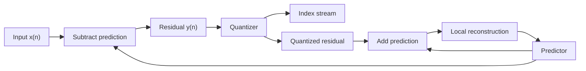

![[Pics/2. Scalar and Predictive Quantization/prediction-residual-image.png|600]]

Prediction removes much of the local image structure, leaving a lower-variance residual.

![[Pics/2. Scalar and Predictive Quantization/predictor-order-effect.png|600]]

Higher predictor order improves residual whitening, but gains quickly saturate because near neighbors already explain most correlation.

### Drift and correct closed loop

![[Pics/2. Scalar and Predictive Quantization/predictive-coding-drift.png|650]]

Wrong scheme: encoder predicts from original samples, decoder predicts from reconstructed samples, so mismatch accumulates as drift.

![[Pics/2. Scalar and Predictive Quantization/predictive-coding-closed-loop.png|650]]

Correct scheme: encoder and decoder both predict from reconstructed samples, keeping state synchronized.

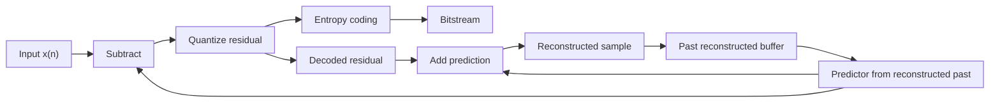

### Entropy coding gain

![[Pics/2. Scalar and Predictive Quantization/prediction-error-index-distribution.png|600]]

Prediction errors produce many zero indexes, making fixed-length rate estimates too pessimistic.

![[Pics/2. Scalar and Predictive Quantization/predictive-quantization-entropy-gain.png|650]]

Predictive quantization becomes strongly effective when its sparse indexes are entropy-coded.

## Examples

> [!Example] Image quantization at low rates
> RGB peppers example:
>
> | Rate | PSNR | Compression ratio |
> | :--- | :--- | :--- |
> | 8 bpp | 29.26 dB | 2.667 |
> | 6 bpp | 27.83 dB | 4.000 |
> | 3 bpp | 25.75 dB | 8.000 |
>
> Takeaway: lower bit depth reduces rate, but creates banding and false contours.

> [!Example] Grayscale image quantization
> | Quantization levels | Bits/pixel | Compression ratio | Y-PSNR |
> | :--- | :--- | :--- | :--- |
> | 256 | 8 | 1.000 | $\infty$ |
> | 64 | 6 | 1.333 | 46.51 dB |
> | 16 | 4 | 2.000 | 34.47 dB |
> | 8 | 3 | 2.667 | 29.06 dB |
> | 4 | 2 | 4.000 | 22.85 dB |
> | 2 | 1 | 8.000 | 17.42 dB |
>
> Takeaway: rate reduction is smooth numerically, but visual quality drops sharply at low levels.

> [!Example] Audio quantization
> | Bit depth | Perceptual quality |
> | :--- | :--- |
> | 8 bits | slight hissing or granular noise |
> | 4 bits | strong fidelity loss and prominent noise |
> | 2 bits | very strong noise; speech may remain intelligible, music is badly damaged |
>
> Takeaway: scalar quantization noise is more tolerable for some signals than others, but very low bit depth destroys quality.

> [!Example] Prediction gain for AR(1)
> Signal:
>
> $$
> X(n)\sim\mathcal{N}(0,\sigma^2), \qquad
> \mathbb{E}[X(n)X(m)]=\sigma^2\rho^{|n-m|}
> $$
>
> Predictor: $V(n)=X(n-1)$.
>
> Prediction error variance:
>
> $$
> \sigma_Y^2
> =\mathbb{E}[(X(n)-X(n-1))^2]
> =2\sigma^2(1-\rho)
> $$
>
> Prediction gain:
>
> $$
> G_P=10\log_{10}\frac{\sigma^2}{2(1-\rho)\sigma^2}
> =10\log_{10}\frac{1}{2(1-\rho)}
> $$
>
> Positive gain condition:
>
> $$
> G_P>0 \Leftrightarrow \rho>\frac{1}{2}
> $$
>
> For $\rho=0.9$, $G_P\approx7$ dB.

> [!Example] 2D image predictor
> Predictor for grayscale image:
>
> $$
> \tilde{f}_{n,m}=a f_{n-1,m}+b f_{n,m-1}
> $$
>
> | $a$ | $b$ | $\sigma_E^2$ | Meaning |
> | :--- | :--- | :--- | :--- |
> | 0 | 0 | 2902.7 | no prediction |
> | 1/2 | 1/2 | 78.7 | simple neighbor average |
> | 0.449 | 0.546 | 78.4 | optimal predictor |
>
> Takeaway: a simple local predictor reduces variance by more than 37 times; optimization adds only small improvement.

> [!Example] Drift with wrong prediction loop
> Encoder predicts from original past values, decoder predicts from reconstructed past values.
>
> | Step | Original | Encoder prediction | Encoder error | Quantized error | Decoder prediction | Reconstruction |
> | :--- | :--- | :--- | :--- | :--- | :--- | :--- |
> | 1 | 10 | - | - | 9 | - | 9 |
> | 2 | 11 | 10 | 1 | 0 | 9 | 9 |
> | 3 | 12 | 11 | 1 | 0 | 9 | 9 |
> | 4 | 13 | 12 | 1 | 0 | 9 | 9 |
> | 5 | 14 | 13 | 1 | 0 | 9 | 9 |
> | 6 | 18 | 14 | 4 | 3 | 9 | 12 |
>
> Takeaway: decoder stays behind because it cannot reproduce encoder predictions.

> [!Example] No drift with closed-loop prediction
> Encoder and decoder both predict from reconstructed past values.
>
> | Step | Original | Encoder prediction | Encoder error | Quantized error | Decoder prediction | Reconstruction |
> | :--- | :--- | :--- | :--- | :--- | :--- | :--- |
> | 1 | 10 | - | - | 9 | - | 9 |
> | 2 | 11 | 9 | 2 | 3 | 9 | 12 |
> | 3 | 12 | 12 | 0 | 0 | 12 | 12 |
> | 4 | 13 | 12 | 1 | 0 | 12 | 12 |
> | 5 | 14 | 12 | 2 | 3 | 12 | 15 |
> | 6 | 18 | 15 | 3 | 3 | 15 | 18 |
> | 7 | 21 | 18 | 3 | 3 | 18 | 21 |
> | 8 | 18 | 21 | -3 | -3 | 21 | 18 |
>
> Takeaway: shared reconstructed state keeps encoder and decoder synchronized.

> [!Example] Entropy coding gain
> With $L=19$ quantization levels, about **84%** of prediction-error indexes are zero, and less than **1%** fall outside $(-3,3)$.
>
> Result from source: predictive quantization plus entropy coding gives about **+20 dB PSNR at 1 bpp** versus direct UQ, or about **86% rate reduction** at 30 dB.
>
> Takeaway: prediction creates sparsity; entropy coding turns sparsity into bitrate reduction.

---

# Lossless coding

## Contents

- [[#Core idea|Core idea]]
- [[#Main concepts|Main concepts]]
- [[#Theory and formulas|Theory and formulas]]
- [[#Visual schemes|Visual schemes]]
- [[#Examples|Examples]]

## Core idea

**Lossless coding** maps a sequence of discrete symbols to a bitstream that can be decoded exactly. In multimedia compression it usually comes after prediction, transform, or quantization, and it removes remaining **statistical redundancy** without adding distortion.

Typical pipeline:

1. **Prediction** reduces sample correlation and produces residuals.
2. **Quantization** may map residuals to discrete indexes in lossy systems.
3. **Lossless coding** maps indexes to compact bits.

> [!Important] Lossless coding limit
> No lossless code can beat source entropy on average. Good entropy coders try to make average length $\mathcal{L}$ approach entropy $H$ or entropy rate $\mathcal{H}$.

## Main concepts

### Codes and decodability

Let the alphabet be:

$$
\mathcal{X}=\{x_1,x_2,\ldots,x_M\}
$$

A code is:

$$
C:x_i\in\mathcal{X}\rightarrow c_i\in\{0,1\}^*
$$

where $c_i$ is a finite binary string and $\ell_i$ is its length.

- **Fixed-length coding (FLC)**: Meaning: all symbols use same length $\lceil\log_2 M\rceil$; Practical effect: simple, robust, ignores probabilities.
- **Variable-length coding (VLC)**: Meaning: probable symbols use shorter codewords; Practical effect: compresses non-uniform sources.
- **Prefix / instantaneous code**: Meaning: no codeword is prefix of another; Practical effect: decodes symbol-by-symbol.
- **Uniquely decodable code**: Meaning: any finite bitstream has one symbol sequence; Practical effect: may require lookahead.

FLC rate:

$$
R_{\mathrm{FLC}}=\lceil\log_2 M\rceil
$$

VLC average length:

$$
\mathcal{L}=\sum_i p_i\ell_i
$$

### Information and entropy

**Self-information** of symbol $x_i$:

$$
I(x_i)=-\log_2 p_i
$$

Rare symbols carry more information; certain symbols carry zero information.

> [!Important] Source entropy
> $$
> H(X)=-\sum_i p_i\log_2 p_i
> $$
>
> Entropy is the average uncertainty of $X$ and the fundamental lower bound for average lossless code length.
>
> For a binary source with $P(1)=p$:
>
> $$
> H(X)=-p\log_2p-(1-p)\log_2(1-p)
> $$
>
> Entropy is maximum at $p=0.5$, where $H=1$ bit/symbol.

### Joint and conditional entropy

Joint entropy:

$$
H(X,Y)=-\sum_{i,j}p_{i,j}\log_2p_{i,j}
$$

Conditional entropy:

$$
H(X|Y)=\sum_jp_jH(X|Y=y_j)
$$

Chain rule:

$$
H(X,Y)=H(Y)+H(X|Y)=H(X)+H(Y|X)
$$

Important consequences:

- If $X$ and $Y$ are independent, $H(X|Y)=H(X)$.
- If $X$ is determined by $Y$, $H(X|Y)=0$.
- Conditioning cannot increase entropy:

$$
H(X|Y)\leq H(X)
$$

### Maximum entropy

For an $M$-symbol alphabet, entropy is maximized by the uniform distribution:

$$
p_i^*=\frac{1}{M}
$$

and:

$$
H_{\max}=\log_2M
$$

Meaning for compression: non-uniformity is compressible; uniform sources are hardest to compress losslessly.

### Kraft and prefix codes

> [!Important] Kraft inequality
> A prefix code with lengths $\ell_1,\ldots,\ell_M$ exists if and only if:
>
> $$
> \sum_{i=1}^{M}2^{-\ell_i}\leq1
> $$
>
> If equality holds, the code tree is complete.
>
> McMillan's theorem says uniquely decodable codes cannot outperform instantaneous prefix codes in average length. Therefore, optimal lossless coding can focus on prefix codes.

### Shannon source coding theorem

The ideal relaxed code length is:

$$
\ell_i^*=-\log_2p_i
$$

and the corresponding average length is:

$$
\mathcal{L}^*=\sum_ip_i\ell_i^*=H(X)
$$

> [!Important] Source coding theorem
> Any lossless code satisfies:
>
> $$
> \mathcal{L}^*\geq H(X)
> $$
>
> Equality is possible only when all symbol probabilities are dyadic:
>
> $$
> p_i=2^{-k_i}
> $$
>
> With integer lengths $\ell_i=\lceil-\log_2p_i\rceil$:
>
> $$
> H(X)\leq\mathcal{L}<H(X)+1
> $$

### Huffman coding

**Huffman coding** is optimal among prefix codes for a known probability table and a fixed symbol alphabet.

Algorithm:

1. Create one leaf per symbol with weight $p_i$.
2. Merge the two lowest-weight nodes.
3. Repeat until one root remains.
4. Assign `0` and `1` to branches.
5. Codewords are root-to-leaf paths.

Strengths:

- Optimal for single-symbol prefix coding.
- Simple and fast.
- Used inside many formats and standards.

Limits:

- One-symbol Huffman cannot code below 1 bit/symbol for a binary alphabet.
- Code lengths are integer, so non-dyadic probabilities create overhead.
- Block Huffman improves efficiency but alphabet size grows as $M^K$.

### Block coding

Instead of coding single symbols, code blocks:

$$
X^K=(X_1,\ldots,X_K)
$$

Block entropy obeys:

$$
H(X_1,\ldots,X_K)\leq\sum_{i=1}^{K}H(X_i)
$$

Huffman bound for a block:

$$
\mathcal{L}<H(X^K)+1
$$

Per original symbol:

$$
\mathcal{L}_S<\frac{H(X^K)}{K}+\frac{1}{K}
$$

Meaning: the Huffman overhead is spread over $K$ symbols, but probability estimation and codebook size become expensive.

### Arithmetic coding

**Arithmetic coding** encodes an entire sequence as a subinterval of $[0,1)$. Each symbol narrows the current interval according to its probability.

For a sequence $x^n$:

$$
P(x^n)=\prod_{i=1}^{n}p(x_i)
$$

The required number of bits is close to:

$$
-\log_2P(x^n)
$$

Average per-symbol length:

$$
\mathcal{L}<H(X)+\frac{2}{n}
$$

So:

$$
\mathcal{L}\rightarrow H(X)
$$

as $n\rightarrow\infty$.

Arithmetic coding solves the main Huffman problems:

- Works efficiently even when entropy is below 1 bit/symbol.
- Avoids exponential block-code alphabets.
- Handles adaptive and context-dependent probabilities.

### Context-based and adaptive coding

**Adaptive coding** updates probabilities during encoding and decoding using the same rule on both sides.

**Context coding** estimates:

$$
P(X_n| \text{past context})
$$

instead of a single unconditional $P(X_n)$. If context captures the significant past, conditional entropy drops:

$$
H(X_n|\text{context}) < H(X_n)
$$

For alphabet size $M$ and context length $N_S$:

$$
N_C=M^{N_S}
$$

possible contexts exist. Too many contexts cause sparse training data; too few miss dependencies.

### Exponential-Golomb coding

**Exp-Golomb** is a universal integer code. It needs no probability table and is useful for metadata and sparse residuals.

Unsigned code for $n\geq0$:

1. If $n=0$, code is `1`.
2. If $n\geq1$, write $n+1$ in binary with $b=\lfloor\log_2(n+1)\rfloor+1$ bits.
3. Prefix it with $b-1$ zeros.

Signed mapping:

$$
m(n)=
\begin{cases}
2n-1 & n>0\\
-2n & n\leq0
\end{cases}
$$

Then encode $m$ as unsigned.

### Dictionary coding and LZW

Dictionary coding learns repeated patterns from the sequence itself. **LZW** initializes the dictionary with one-symbol entries, then adds longer patterns as they are encountered.

Encoding idea:

1. Find longest prefix $W$ already in dictionary.
2. If $W+K$ is new, output index of $W$.
3. Add $W+K$ to dictionary.
4. Continue from $K$.

Decoder builds the same dictionary because updates are deterministic. Dictionary does not need to be transmitted.

> [!Important] Dictionary asymptotic optimality
> For stationary ergodic sources, dictionary-based coding is asymptotically optimal:
>
> $$
> L_n\xrightarrow{n\to\infty}\mathcal{H}(X)
> $$

### Standards and practical codecs

- **JBIG-1**: Main tools: context arithmetic coding; Best use: bi-level images, progressive coding.
- **JBIG-2**: Main tools: segmentation, symbol dictionaries, arithmetic coding; Best use: text/halftone documents, PDF.
- **JPEG-LS**: Main tools: MED prediction, context modeling, Golomb-Rice; Best use: natural photos, medical images.
- **PNG**: Main tools: prediction, LZ77/Deflate, Huffman; Best use: graphics, icons, text-heavy images.

JPEG-LS **MED predictor** uses causal neighbors:

| C | B |
|---|---|
| A | X |

$$
\hat{x}=
\begin{cases}
\min(A,B) & C\geq\max(A,B)\\
\max(A,B) & C\leq\min(A,B)\\
A+B-C & \text{otherwise}
\end{cases}
$$

This avoids overshoot around sharp edges.

### Neural lossless coding

Neural lossless coding uses a neural network to estimate a probability model $Q$ for arithmetic coding.

Training minimizes cross-entropy:

$$
H(P,Q)=H(P)+D_{KL}(P\parallel Q)
$$

where:

- $H(P)$ is the irreducible source entropy.
- $D_{KL}(P\parallel Q)$ is redundancy from model mismatch.

Autoregressive models use:

$$
P(x_1,\ldots,x_n)=\prod_{i=1}^{n}P(x_i|x_1,\ldots,x_{i-1})
$$

They can model long-range dependencies, but decoding may require one model evaluation per pixel.

Neural predictive coding replaces a linear predictor with:

$$
\hat{x}_i=f_{NN}(\text{local context})
$$

and codes residuals. For `house.pgm`, source reports:

- 2D linear predictor residual entropy: **2.830 bpp**.
- MLP predictor residual entropy: **2.704 bpp**.

Total rate must include model cost:

$$
R_{\text{total}}=R_{\text{residuals}}+\frac{L_{\text{model}}}{N}
$$

Limitations:

- high decoding complexity,
- hardware requirements,
- generalization gap,
- bit-exact determinism issues.

## Theory and formulas

### Entropy bound and optimal lengths

Given probabilities $p_i$, ideal lengths solve:

$$
\min_{\ell_i}\sum_ip_i\ell_i
\quad\text{s.t.}\quad
\sum_i2^{-\ell_i}=1
$$

Using a Lagrangian:

$$
J(\ell)=\sum_ip_i\ell_i+\lambda\left(\sum_i2^{-\ell_i}-1\right)
$$

Relaxing integer constraints:

$$
\ell_i^*=-\log_2p_i
$$

and:

$$
\mathcal{L}^*=H(X)
$$

This explains why optimal entropy coding assigns short codewords to probable symbols and long codewords to rare symbols.

### Kraft tree interpretation

In a binary tree of maximum depth $L_{\max}$, a codeword of length $\ell_i$ blocks:

$$
2^{L_{\max}-\ell_i}
$$

leaves. Prefix codewords block disjoint leaf sets, therefore:

$$
\sum_i2^{L_{\max}-\ell_i}\leq2^{L_{\max}}
$$

Dividing by $2^{L_{\max}}$ gives Kraft:

$$
\sum_i2^{-\ell_i}\leq1
$$

### Conditioning and context coding

For sources with memory:

$$
\mathcal{H}=\lim_{n\to\infty}H(X_n|X_{n-1},\ldots,X_1)
$$

Context coding approximates this entropy rate by conditioning on a finite significant past.

For a binary image with previous pixel as context:

$$
H(X|\square)=0.322,\qquad H(X|\blacksquare)=0.918
$$

Weighted average:

$$
H(X|Y)=0.406\ \text{bpp}
$$

This is below single-pixel entropy $H(X)=0.586$ bpp because neighboring pixels are correlated.

### Huffman vs. arithmetic overhead

Huffman on single symbols:

$$
H(X)\leq\mathcal{L}<H(X)+1
$$

Huffman on $K$-symbol blocks:

$$
\frac{\mathcal{L}}{K}<\frac{H(X^K)}{K}+\frac{1}{K}
$$

Arithmetic coding on length-$n$ sequences:

$$
\mathcal{L}<H(X)+\frac{2}{n}
$$

Arithmetic coding therefore approaches entropy without exponential block alphabets.

### House image result

For `house.pgm`, original bit depth is 8 bpp and direct entropy is:

$$
H=7.056\ \text{bpp}
$$

| Coding input | Entropy | Huffman | Exp-Golomb | ZIP |
| :--- | :--- | :--- | :--- | :--- |
| Direct pixels | 7.06 | 7.08 | 11.32 | 4.00 |
| 1D residuals | 3.31 | 3.38 | 3.43 | 3.23 |
| 2D residuals | 2.83 | 2.89 | 2.94 | 3.14 |

Main result:

$$
7.06\ \text{bpp}\rightarrow2.83\ \text{bpp}
$$

through 2D prediction before entropy coding.

## Visual schemes

### Entropy coding pipeline

![[Pics/3. Lossless coding/entropy-coding-pipeline.png|650]]

Lossless coding sits after prediction and quantization/index generation, where it removes statistical redundancy from symbol indexes.


### Entropy and prefix codes

![[Pics/3. Lossless coding/binary-entropy-curve.png|500]]

Binary entropy is maximum at equal probabilities and decreases when one symbol becomes predictable.

![[Pics/3. Lossless coding/kraft-tree-proof.png|600]]

Kraft inequality follows from prefix codewords occupying disjoint subtrees in a binary tree.

![[Pics/3. Lossless coding/huffman-tree-example.png|450]]

Huffman coding builds a prefix tree by repeatedly merging the least probable symbols.

### Huffman and predictive coding

![[Pics/3. Lossless coding/binary-image-huffman-example.png|500]]

Single-symbol Huffman on a binary image cannot go below 1 bpp even when entropy is below 1 bpp.

![[Pics/3. Lossless coding/predictive-huffman-gain.png|650]]

Predictive quantization plus Huffman coding improves rate-distortion performance by exploiting residual probability imbalance.

### Arithmetic coding

![[Pics/3. Lossless coding/arithmetic-coding-interval.png|650]]

Arithmetic coding refines an interval for the whole sequence, making it behave like efficient high-order block coding.

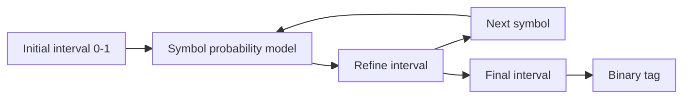

### LZW dictionary coding

![[Pics/3. Lossless coding/lzw-encoding-example.png|650]]

LZW encoding emits dictionary indexes while adding newly observed repeated patterns.

![[Pics/3. Lossless coding/lzw-decoding-example.png|650]]

LZW decoding reconstructs the same dictionary deterministically, so the dictionary is not transmitted.

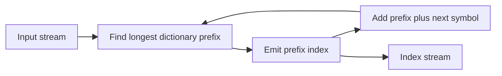

### Prediction results on house image

![[Pics/3. Lossless coding/house-direct-coding.png|650]]

Direct pixel coding remains close to 7 bpp entropy; dictionary coding can help because repeated byte patterns exist.

![[Pics/3. Lossless coding/house-1d-prediction.png|450]]

1D DPCM prediction sharply reduces residual entropy compared with direct pixel coding.

![[Pics/3. Lossless coding/house-2d-prediction.png|450]]

2D adaptive prediction reduces entropy further by exploiting vertical and horizontal image structure.

## Examples

> [!Example] Code decodability
> | Symbol | Code 1 | Code 2 | Code 3 | Code 4 |
> | :--- | :--- | :--- | :--- | :--- |
> | A | `0` | `0` | `0` | `0` |
> | B | `0` | `1` | `10` | `01` |
> | C | `1` | `00` | `110` | `011` |
> | D | `10` | `11` | `111` | `0111` |
>
> Takeaway: Code 3 is prefix and instantaneously decodable. Code 4 is decodable with delay. Codes 1 and 2 are not uniquely decodable.

> [!Example] French text entropy
> Alphabet size $M=26$.
>
> $$
> R_{\mathrm{FLC}}=\lceil\log_2 26\rceil=5\ \text{bits/symbol}
> $$
>
> Source entropy:
>
> $$
> H=3.999\ \text{bits/symbol}
> $$
>
> Any VLC satisfies $\mathcal{L}\geq3.999$. Huffman gives about $4.041$ bits/symbol, so compression ratio is about $5/4.041=1.238$.

> [!Example] Huffman on six symbols
> | Symbol | Probability | Codeword | Length |
> | :--- | :--- | :--- | :--- |
> | A | 0.40 | `0` | 1 |
> | B | 0.20 | `100` | 3 |
> | C | 0.15 | `101` | 3 |
> | D | 0.15 | `110` | 3 |
> | E | 0.05 | `1110` | 4 |
> | F | 0.05 | `1111` | 4 |
>
> Average length:
>
> $$
> \mathcal{L}=2.3\ \text{bits/symbol}
> $$
>
> Entropy:
>
> $$
> H\approx2.2464\ \text{bits/symbol}
> $$
>
> Huffman is close to the entropy bound.

> [!Example] Binary image and Huffman block coding
> For a black-white image:
>
> $$
> P(\square)=86.7\%,\qquad P(\blacksquare)=13.3\%
> $$
>
> Single-pixel entropy:
>
> $$
> H(X)=0.586\ \text{bpp}
> $$
>
> Single-symbol Huffman still needs:
>
> $$
> \mathcal{L}=1\ \text{bpp}
> $$
>
> because a binary alphabet needs at least one bit per symbol.
>
> Two-pixel block coding gives:
>
> $$
> H([X_1X_2])/2=0.511\ \text{bpp},\qquad
> \mathcal{L}_S=0.65\ \text{bpp}
> $$
>
> Four-pixel block coding gives:
>
> $$
> H([X_1X_2X_3X_4])/4=0.383\ \text{bpp},\qquad
> \mathcal{L}_S=0.433\ \text{bpp}
> $$
>
> Takeaway: larger blocks move Huffman closer to entropy but increase alphabet complexity.

> [!Example] Arithmetic coding for sequence ACFD
> Probabilities: A=0.4, B=0.2, C=0.15, D=0.15, E=0.05, F=0.05.
>
> Interval refinement:
>
> | Step | Symbol | Interval |
> | :--- | :--- | :--- |
> | start | - | $[0,1)$ |
> | 1 | A | $[0,0.4)$ |
> | 2 | C | $[0.24,0.30)$ |
> | 3 | F | $[0.297,0.30)$ |
> | 4 | D | $[0.29925,0.2997)$ |
>
> Any binary number inside final interval identifies the whole sequence.

> [!Example] Exp-Golomb codes
> | $n$ | $n+1$ binary | unsigned Exp-Golomb |
> | :--- | :--- | :--- |
> | 0 | `1` | `1` |
> | 1 | `10` | `010` |
> | 2 | `11` | `011` |
> | 3 | `100` | `00100` |
> | 7 | `1000` | `0001000` |
>
> Takeaway: efficient for small non-negative integers and simple to decode.

> [!Example] LZW binary sequence
> Input starts:
>
> ```text
> 0 0 0 1 0 0 0 0 0 0 1 0 ...
> ```
>
> Initial dictionary:
>
> | Code | Pattern |
> | :--- | :--- |
> | `0` | `0` |
> | `1` | `1` |
>
> New entries include `00`, `001`, `10`, `000`, and longer repeated patterns. Emitted values are dictionary indexes, not final raw bits.
>
> Takeaway: repeated patterns become single indexes; decoder reconstructs the same dictionary.

> [!Example] JPEG-LS vs PNG
> - **JPEG-LS**: Core method: prediction + context + Golomb-Rice; Best source: natural/medical images.
> - **PNG**: Core method: LZ77/Deflate + Huffman; Best source: graphics, icons, text.
>
> Takeaway: both are lossless, but their models target different source statistics.

> [!Example] Neural model cost
> Small MLP with about 100 weights at 32 bits each:
>
> $$
> L_{\text{model}}=3200\ \text{bits}
> $$
>
> For a $512\times512$ image and residual rate $2.704$ bpp:
>
> $$
> R=2.704+\frac{3200}{512^2}\approx2.716\ \text{bpp}
> $$
>
> Takeaway: neural coding must account for model transmission unless the model is shared.

> [!Example] Method selection
> - **Memoryless**: Recommended method: Huffman or arithmetic; Reason: matches entropy bound.
> - **Stationary with memory**: Recommended method: context arithmetic; Reason: exploits conditional probabilities.
> - **Locally stationary**: Recommended method: adaptive arithmetic; Reason: tracks changing statistics.
> - **Repeating strings**: Recommended method: dictionary coding; Reason: learns recurring patterns.
> - **Complex long-range dependencies**: Recommended method: neural models; Reason: learns nonlinear probability models.
>
> Rule of thumb: Huffman/Exp-Golomb for speed, arithmetic/context for high compression, dictionary for universal files, neural models for best compression when complexity is acceptable.

---

# Transform coding

## Contents

- [[#Core idea|Core idea]]
- [[#Main concepts|Main concepts]]
- [[#Theory and formulas|Theory and formulas]]
- [[#Visual schemes|Visual schemes]]
- [[#Examples|Examples]]

## Core idea

**Transform coding** improves compression by converting correlated samples into coefficients with very unequal importance. Important coefficients receive more bits; negligible coefficients receive few bits or become zero.

Scalar quantization of natural signals is weak because samples are correlated and often have similar variance. Transform coding applies a reversible orthogonal transform $Y=TX$ so that:

- most energy is concentrated in few coefficients,
- coefficient variances become diverse,
- high-variance coefficients get more bits,
- low-variance coefficients can be heavily quantized.

> [!Important] Transform coding principle
> Compression gain does not come from losing information in the transform. It comes from making coefficient variances uneven, then allocating quantization bits where they matter.

## Main concepts

### Block coding and rate allocation

Consider a block:

$$
X=[X_1,X_2,\ldots,X_M]^T
$$

For component $k$:

- $\sigma_k^2=\mathrm{Var}(X_k)$,
- $c_k$ is the shape factor,
- $R_k$ is the rate assigned to component $k$.

With optimal scalar quantization per component:

$$
D_k=c_k\sigma_k^2 2^{-2R_k}
$$

Global MSE per component:

$$
\mathcal{D}
=\frac{1}{M}\mathbb{E}\|X-Q(X)\|^2
=\frac{1}{M}\sum_{k=0}^{M-1}c_k\sigma_k^2 2^{-2R_k}
$$

Rate allocation problem:

$$
\min_R \mathcal{D}(R)
\quad\text{s.t.}\quad
\sum_{k=0}^{M-1}R_k\leq R_{\text{Tot}}
$$

### Huang-Schulteiss formula

> [!Important] Optimal bit allocation
> $$
> R_k^*
> =
> \frac{R_{\text{Tot}}}{M}
> +
> \frac{1}{2}\log_2
> \left(
> \frac{c_k\sigma_k^2}
> {c_{\text{GM}}\sigma_{\text{GM}}^2}
> \right)
> $$
>
> where:
>
> $$
> c_{\text{GM}}=\left(\prod_k c_k\right)^{1/M},
> \qquad
> \sigma_{\text{GM}}^2=\left(\prod_k\sigma_k^2\right)^{1/M}
> $$
>
> More variance means more bits. At optimum, active components have equal distortion.
>
> Optimal distortion:
>
> $$
> \mathcal{D}^*
> =c_{\text{GM}}\sigma_{\text{GM}}^2 2^{-2\bar{R}},
> \qquad
> \bar{R}=\frac{R_{\text{Tot}}}{M}
> $$
>
> For Gaussian variables, $c_k=c_N$:
>
> $$
> R_k^*=\bar{R}+\frac{1}{2}\log_2\frac{\sigma_k^2}{\sigma_{\text{GM}}^2}
> $$
>
> If all components are identically distributed:
>
> $$
> R_k^*=\bar{R},
> \qquad
> \mathcal{D}=c_X\sigma_X^2 2^{-2\bar{R}}
> $$
>
> so block coding alone gives no gain. Gain requires **variance diversity**.

### Orthogonal transforms

An orthogonal transform satisfies:

$$
T^{-1}=T^T
$$

Forward and inverse:

$$
Y=TX,\qquad X=T^TY
$$

Orthogonal transforms preserve Euclidean norm:

$$
\|TX\|^2=X^T(T^TT)X=\|X\|^2
$$

> [!Important] Distortion preservation
> $$
> \mathcal{D}_Y
> =
> \frac{1}{M}\mathbb{E}\|Y-\hat{Y}\|^2
> =
> \frac{1}{M}\mathbb{E}\|T(X-\hat{X})\|^2
> =
> \mathcal{D}_X
> $$
>
> Therefore, quantization distortion can be analyzed in transform domain without changing MSE.

### Coding gain

For i.d. Gaussian samples, direct PCM gives:

$$
D_{\text{PCM}}=c_N\sigma_X^2 2^{-2\bar{R}}
$$

After orthogonal transform and optimal allocation:

$$
\mathcal{D}_T=c_N\sigma_{\text{GM},Y}^2 2^{-2\bar{R}}
$$

Orthogonal transforms preserve average variance:

$$
\sigma_{\text{AM},Y}^2
=
\frac{1}{M}\mathbb{E}\|Y\|^2
=
\frac{1}{M}\mathbb{E}\|X\|^2
=\sigma_X^2
$$

> [!Important] Coding gain
> $$
> G_T
> =
> \frac{D_{\text{PCM}}}{\mathcal{D}_T}
> =
> \frac{\sigma_{\text{AM},Y}^2}
> {\sigma_{\text{GM},Y}^2}
> \geq 1
> $$
>
> Since arithmetic mean is at least geometric mean, gain increases when transform coefficients have very unequal variances.

### Practical rate allocation

The HS formula can produce negative or fractional rates. Practical schemes:

- **Modified HS**: Idea: remove negative-rate components, recompute, floor, distribute residual bits; Use: continuous optimum adapted to integer rates.
- **Greedy**: Idea: start at zero bits, repeatedly add one bit to component with largest current distortion; Use: same result, simpler for small total rate.

Greedy update after adding one bit:

$$
D_k \leftarrow \frac{D_k}{4}
$$

because:

$$
2^{-2(R_k+1)}=\frac{1}{4}2^{-2R_k}
$$

### KLT

Let $X$ be zero-mean with covariance/correlation matrix:

$$
R_X=\mathbb{E}[XX^T]
$$

> [!Important] Karhunen-Loeve Transform
> $T_{\text{KLT}}$ is the orthonormal matrix whose rows are eigenvectors of $R_X$:
>
> $$
> T_{\text{KLT}}=[u_1\ u_2\ \cdots\ u_M]^T,
> \qquad
> Y=T_{\text{KLT}}X
> $$
>
> It decorrelates coefficients:
>
> $$
> \mathbb{E}[Y_iY_j]=\lambda_i\delta_{ij}
> $$
>
> It gives best energy compaction among orthogonal transforms and maximizes coding gain for Gaussian sources.


KLT limitations:

- data-dependent basis,
- expensive eigenvector computation,
- transform matrix must be known at decoder,
- stationarity assumptions may fail for images.

For strongly correlated AR(1)-like sources, fixed frequency transforms such as DCT approach KLT performance with far lower cost.

### DFT

1D orthonormal DFT:

$$
y[k]
=
\frac{1}{\sqrt{M}}\sum_{n=1}^{M}x[n]e^{-j\frac{2\pi}{M}kn},
\qquad
k=1,\ldots,M
$$

DFT matrix:

$$
(T_{\text{DFT}})_{k,n}
=
\frac{1}{\sqrt{M}}W_M^{kn},
\qquad
W_M=e^{-j2\pi/M}
$$

2D separable transform:

$$
Y=TXT^T
$$

2D basis functions:

$$
B_{k,\ell}(n,m)
=
\frac{1}{N}e^{j\frac{2\pi}{N}(kn+\ell m)}
$$

DFT is not used directly in image compression because it implicitly periodizes blocks. If block boundaries do not match, artificial jumps appear, causing **spectral leakage** and too many high-frequency coefficients.

### DCT

DCT solves DFT leakage by using symmetric extension before periodization. This removes boundary discontinuities and produces real coefficients.

> [!Important] DCT matrix
> $$
> (T_{\text{DCT}})_{k,n}
> =
> \begin{cases}
> \frac{1}{\sqrt{M}} & k=0\\
> \sqrt{\frac{2}{M}}
> \cos\frac{(2n+1)k\pi}{2M} & k>0
> \end{cases}
> $$
>
> for $k,n=0,\ldots,M-1$.
>
> DCT gives real coefficients, avoids negative frequencies, reduces leakage, and is the standard transform for compression.


2D DCT is separable:

$$
Y=TXT^T
$$

In image blocks:

- top-left coefficient is **DC**,
- other coefficients are **AC** spatial frequencies,
- energy usually decays toward bottom-right,
- smooth blocks become very sparse,
- textured or edge blocks keep more coefficients.

### JPEG overview

Baseline JPEG is a block-based DCT image codec. Standard decoder is specified; encoders can choose implementation details.

Pipeline:

1. RGB to YCbCr color conversion.
2. Optional chroma subsampling.
3. Split each component into $8x8$ blocks.
4. Subtract 128 from samples.
5. Apply 2D DCT.
6. Quantize DCT coefficients.
7. Entropy-code DC and AC coefficients.

### JPEG quantization

Per coefficient:

$$
\tilde{c}_{i,j}
=
\mathrm{round}\left(\frac{c_{i,j}}{q_{i,j}}\right)
$$

De-quantization:

$$
\hat{c}_{i,j}=\tilde{c}_{i,j}q_{i,j}
$$

Luminance standard table:

$$
q^*=
\begin{pmatrix}
16&11&10&16&24&40&51&61\\
12&12&14&19&26&58&60&55\\
14&13&16&24&40&57&69&56\\
14&17&22&29&51&87&81&61\\
18&22&37&56&68&109&103&77\\
24&35&55&64&81&104&111&90\\
49&63&78&87&101&121&120&100\\
72&92&95&98&112&100&103&99
\end{pmatrix}
$$

Values grow toward high frequencies, so high-frequency coefficients are quantized more coarsely.

Quality factor scaling:

$$
S_F=
\begin{cases}
5000/Q & 1\leq Q\leq50\\
200-2Q & 50<Q\leq99\\
1 & Q=100
\end{cases}
\qquad
q=\frac{S_F}{100}q^*
$$

### JPEG entropy coding

After quantization, most high-frequency coefficients are zero.

1. **Zig-zag scan** orders coefficients from low to high spatial frequency.
2. **DC coefficient** is coded by DPCM:

$$
DC_P=DC_n-DC_{n-1}
$$

3. **AC coefficients** are coded by run-length plus category/amplitude.

DC category:

$$
k=\lceil\log_2(|DC_P|+1)\rceil
$$

AC symbols:

- run-length = number of zeros before next non-zero coefficient,
- category = amplitude magnitude class,
- amplitude = signed value bits.

Special AC symbols:

- $(15,0)$: Meaning: zero-run, 16 consecutive zeros.
- $(0,0)$: Meaning: end of block.

### JPEG file structure

JPEG bitstream hierarchy:

```text
Frame
|-- Frame header
`-- Scan
    |-- Scan header
    `-- Segment
        |-- Segment header
        `-- 8x8 blocks
```

JFIF stores basic interchange metadata. Exif stores camera-oriented metadata such as exposure, ISO, GPS, date, thumbnail.

## Theory and formulas

### HS derivation sketch

Lagrangian:

$$
J(R,\lambda)
=
\frac{1}{M}\sum_{k=0}^{M-1}c_k\sigma_k^2 2^{-2R_k}
+
\lambda\left(\sum_{k=0}^{M-1}R_k-R_{\text{Tot}}\right)
$$

Stationarity:

$$
\frac{\partial J}{\partial R_k}=0
$$

gives:

$$
2^{-2R_k^*}
=
\frac{M\lambda}{2\ln2}
\frac{1}{c_k\sigma_k^2}
$$

Therefore:

$$
R_k^*
=
\lambda'
+
\frac{1}{2}\log_2(c_k\sigma_k^2)
$$

The constraint $\sum_kR_k^*=R_{\text{Tot}}$ determines:

$$
\lambda'
=
\bar{R}
-
\frac{1}{2}\log_2(c_{\text{GM}}\sigma_{\text{GM}}^2)
$$

### AM-GM and coding gain

For non-negative variances:

$$
\sigma_{\text{GM}}^2
=
\left(\prod_k\sigma_k^2\right)^{1/M}
\leq
\frac{1}{M}\sum_k\sigma_k^2
=
\sigma_{\text{AM}}^2
$$

Equality holds only if all variances are equal. Therefore a transform improves coding only when it makes coefficient variances unequal.

### Toy rotation example

For two highly correlated variables, independent scalar quantization wastes bits because the joint PDF lies on a thin diagonal region.

Use a 45-degree orthogonal rotation:

$$
\begin{bmatrix}
Y_1\\Y_2
\end{bmatrix}
=
\frac{1}{\sqrt{2}}
\begin{bmatrix}
1&-1\\
1&1
\end{bmatrix}
\begin{bmatrix}
X_1\\X_2
\end{bmatrix}
$$

After transform:

$$
\sigma_{Y_1}^2=\frac{\Delta_1^2}{12}=2\sigma^2,
\qquad
\sigma_{Y_2}^2=\frac{\Delta_2^2}{12}\ll\sigma^2
$$

So $Y_2$ can be ignored or heavily quantized, while most bits go to $Y_1$.

### KLT energy compaction

For any $N<M$ and any other orthogonal transform $Z=TX$:

$$
\sum_{i=1}^{N}\mathbb{E}[Y_i^2]
\geq
\sum_{i=1}^{N}\mathbb{E}[Z_i^2]
$$

In multispectral imaging example:

| KLT band | Energy |
| :--- | :--- |
| 1 | 86.37% |
| 2 | 7.65% |
| 3 | 4.16% |
| 4 | 1.67% |
| 5 | 0.12% |
| 6 | 0.03% |

First KLT band carries most energy; later bands can be quantized aggressively.

### JPEG rate-distortion notes

JPEG's quality factor controls quantization but not exact bitrate. Bitrate depends on:

- image content,
- DCT coefficient sparsity,
- quantization table,
- DC differences,
- AC run lengths,
- Huffman tables.

This is why JPEG has weak direct rate control compared with modern codecs.

## Visual schemes

### Transform sparsification

![[Pics/4. Transform coding/dft-sparsification.png|550]]

A pure tone is dense in sample domain but sparse in Fourier domain, showing why transforms can help compression.

![[Pics/4. Transform coding/correlated-variables-before-transform.png|420]]

Correlated variables have an elongated joint density; independent scalar quantization does not exploit this geometry.

![[Pics/4. Transform coding/correlated-variables-after-transform.png|420]]

A rotation aligns the axes with high and low variance directions, making bit allocation effective.

### KLT, DFT, and DCT

![[Pics/4. Transform coding/klt-decorrelation.png|650]]

KLT aligns the coordinate system with covariance eigenvectors, decorrelating coefficients and compacting energy.

![[Pics/4. Transform coding/dft-natural-image-spectrum.png|600]]

Natural-image DFT magnitude concentrates near low frequencies but shows leakage from implicit periodic boundaries.

![[Pics/4. Transform coding/dct-symmetric-extension.png|650]]

DCT mirrors the block before periodization, avoiding boundary jumps and reducing spectral leakage.

![[Pics/4. Transform coding/dct-coefficient-energy.png|500]]

2D-DCT concentrates most natural-image block energy in top-left low-frequency coefficients.

![[Pics/4. Transform coding/dct-basis-functions.png|500]]

Each $8x8$ DCT coefficient measures similarity to one cosine basis pattern.

### JPEG pipeline

![[Pics/4. Transform coding/jpeg-pipeline.png|650]]

JPEG combines color conversion, chroma subsampling, block DCT, quantization, and entropy coding.


![[Pics/4. Transform coding/jpeg-dct-block-coefficients.png|650]]

JPEG blocks usually have large low-frequency DCT coefficients and many near-zero high-frequency coefficients.

![[Pics/4. Transform coding/jpeg-zigzag-scan.png|420]]

Zig-zag scan converts a sparse 2D coefficient matrix into a 1D sequence with zeros clustered near the end.

![[Pics/4. Transform coding/jpeg-file-structure.png|650]]

JPEG files store frame, scan, segment, table, and block information needed by the decoder.

### JPEG artifacts

![[Pics/4. Transform coding/jpeg-quality-high.png|330]]

High-quality JPEG preserves visual detail at higher bitrate.

![[Pics/4. Transform coding/jpeg-quality-low.png|330]]

Lower bitrate makes blocking and ringing artifacts visible.

![[Pics/4. Transform coding/jpeg-quality-very-low.png|330]]

Very low bitrate strongly reveals $8x8$ block structure and loss of high frequencies.

## Examples

> [!Example] Modified HS allocation
> Data: $\sigma_1^2=1000$, $\sigma_2^2=100$, $\sigma_3^2=50$, $\sigma_4^2=1$, $R_{\text{Tot}}=10$.
>
> HS gives a negative rate for component 4, so it is removed and rates are recomputed over active components.
>
> Final integer allocation:
>
> $$
> R=[5,3,2,0]
> $$
>
> Distortions:
>
> $$
> D_1=1000\cdot2^{-10}\approx0.98
> $$
>
> $$
> D_2=100\cdot2^{-6}\approx1.56
> $$
>
> $$
> D_3=50\cdot2^{-4}\approx3.13,\qquad D_4=1
> $$
>
> Total distortion is about $6.67$.

> [!Example] Greedy allocation
> Same data, start with $R_k=0$ and $D_k=\sigma_k^2$.
>
> At each iteration, add one bit to the component with largest current $D_k$ and divide that $D_k$ by 4.
>
> After 10 bits, greedy gives the same allocation:
>
> $$
> R=[5,3,2,0]
> $$

> [!Example] Transform coding vs. scalar quantization
> Without transform, scalar quantization of two correlated variables gives:
>
> $$
> D=2\sigma^2 2^{-2R}
> $$
>
> After rotation, nearly all energy is in $Y_1$ and $Y_2$ has negligible variance. Quantizing only $Y_1$ gives much lower distortion at the same average rate.
>
> | Total bits per pair | Average rate | Distortion after transform |
> | :--- | :--- | :--- |
> | 0 | 0 | $2\sigma^2$ |
> | 1 | 0.5 bpS | $\sigma^2/2$ |
> | 2 | 1 bpS | $\sigma^2/8$ |
> | 3 | 1.5 bpS | $\sigma^2/32$ |

> [!Example] JPEG centering and DCT
> Before DCT, JPEG subtracts 128 from each 8-bit sample so values are centered near zero.
>
> Example source block values around 91-184 become approximately -37 to +56 after centering. The DCT then produces 64 coefficients, often with most energy concentrated in low-frequency positions.

> [!Example] JPEG quantization
> Quantization divides each DCT coefficient by its table entry and rounds:
>
> $$
> \tilde{c}_{i,j}=\mathrm{round}(c_{i,j}/q_{i,j})
> $$
>
> Example quantized block has only a few non-zero coefficients:
>
> ```text
> -2  17   3   1   0   0   0   0
>  3   4   0  -1   0   0   0   0
>  0   0  -1   0   0   0   0   0
>  0   0  -1  -1   0   0   0   0
> ```
>
> After de-quantization and inverse DCT, source example has **MSE = 24.05** and **PSNR = 34.32 dB**.

> [!Example] JPEG DC coding
> If:
>
> $$
> DC_P=-5
> $$
>
> then:
>
> $$
> k=\lceil\log_2(|-5|+1)\rceil=3
> $$
>
> Category code for $k=3$ is `100`. Magnitude $5$ is `101`; negative amplitude flips bits to `010`.
>
> Final DC code:
>
> ```text
> 100010
> ```

> [!Example] JPEG AC coding
> AC coding uses tuples:
>
> $$
> (\text{run-length},\text{category},\text{amplitude})
> $$
>
> A long tail of zero coefficients can be ended with EOB `(0,0)`. Runs of 16 zeros use ZR `(15,0)`.
>
> In the source example, the final entropy-coded block has 66 bits for 64 pixels:
>
> $$
> 66/64\approx1.03\ \text{bpp}
> $$

> [!Example] JPEG quality levels
> | Quality | Rate | PSNR | Visual effect |
> | :--- | :--- | :--- | :--- |
> | High | 1.02 bpp | 33.92 dB | almost identical |
> | Medium-high | 0.75 bpp | 33.45 dB | minor artifacts |
> | Medium | 0.50 bpp | 32.70 dB | slight blocking |
> | Low | 0.31 bpp | 31.31 dB | visible blocking |
> | Very low | 0.21 bpp | 29.50 dB | strong blocking and ringing |
>
> Takeaway: JPEG quality factor controls quantization strength, but exact rate is hard to predict from the factor alone.

---

# Wavelet analysis

## Contents

- [[#Core idea|Core idea]]
- [[#Main concepts|Main concepts]]
- [[#Theory and formulas|Theory and formulas]]
- [[#Visual schemes|Visual schemes]]
- [[#Examples|Examples]]

## Core idea

**Wavelet analysis** represents signals with basis functions that change scale and position. Unlike DFT or block-DCT, wavelets use **adaptive multiresolution**:

- low frequencies use long windows and good frequency resolution,
- high frequencies use short windows and good spatial/time resolution,
- smooth trends are separated from sharp anomalies such as edges.

For image compression, this gives sparse coefficients without $8x8$ block boundaries. JPEG2000 uses wavelet transforms, bitplane coding, arithmetic coding, and optimized truncation to provide quality scalability, resolution scalability, ROI coding, exact bitrate control, and lossy-to-lossless coding.

> [!Important] Main wavelet compression idea
> Images are modeled as smooth trends plus localized anomalies. Wavelets represent trends in low-pass subbands and edges in sparse high-pass subbands, making coefficient coding efficient.

## Main concepts

### Linear transform by projection

All transforms used in image coding project the signal onto basis functions:

$$
x(t)=\sum_k c_k\phi_k(t)
$$

with:

$$
c_k=\langle x(t),\phi_k(t)\rangle
=
\int_{-\infty}^{+\infty}x(t)\phi_k^*(t)\,dt
$$

Large $|c_k|$ means the signal strongly resembles basis function $k$. Compression works when most coefficients are small.

### Time-frequency uncertainty

For a windowed sinusoid:

$$
x[n]=\cos(\omega_0 n)\operatorname{rect}_N[n]
$$

window length controls localization:

- **short**: Time localization: excellent; Frequency resolution: poor.
- **medium**: Time localization: good; Frequency resolution: medium.
- **long**: Time localization: poor; Frequency resolution: good.
- **very long**: Time localization: very poor; Frequency resolution: excellent.

> [!Important] Time-frequency uncertainty
> $$
> \Delta t\cdot\Delta f\geq\frac{1}{4\pi}
> $$
>
> The area of the time-frequency uncertainty cell is fixed. A transform can change the cell shape, but cannot make both time and frequency resolution arbitrarily good.

### STFT vs. wavelets

**STFT / block DCT** use a fixed window for all frequencies. This creates rigid tiling of the time-frequency plane.

**Wavelets** adapt the window:

- **high**: Wavelet window: short; Captures: edges, impulses, anomalies.
- **low**: Wavelet window: long; Captures: trends, smooth texture.

Wavelet basis from a mother wavelet:

$$
\psi_{a,b}(t)
=
\frac{1}{\sqrt{a}}\psi\left(\frac{t-b}{a}\right)
$$

where $a$ controls scale and $b$ controls position.

- Large $a$: stretched wavelet, lower frequency, better frequency resolution.
- Small $a$: compressed wavelet, higher frequency, better time/spatial resolution.

### Image model

Images contain:

- **Trend**: Signal behavior: slow variation; Frequency: low; Spatial precision needed: rough.
- **Anomaly**: Signal behavior: abrupt variation; Frequency: high; Spatial precision needed: fine.

Wavelets split image rows/blocks into approximation plus details:

- approximation: low-resolution trend,
- detail: high-frequency anomalies, often sparse.

### 1D filter bank

Wavelet transform is implemented by analysis filters plus downsampling.

Analysis:

$$
x[k]\xrightarrow{h_0}\tilde{c}[k]\xrightarrow{\downarrow2}c[k]
$$

$$
x[k]\xrightarrow{h_1}\tilde{d}[k]\xrightarrow{\downarrow2}d[k]
$$

- $h_0$: low-pass analysis filter, approximation coefficients.
- $h_1$: high-pass analysis filter, detail coefficients.
- Downsampling keeps one sample every two.

Synthesis:

$$
c[k]\xrightarrow{\uparrow2}\hat{c}[k]\xrightarrow{f_0}\bar{x}[k]
$$

$$
d[k]\xrightarrow{\uparrow2}\hat{d}[k]\xrightarrow{f_1}\bar{x}[k]
$$

Interpolation:

$$
\hat{c}[k]=
\begin{cases}
c[k/2] & k\ \text{even}\\
0 & k\ \text{odd}
\end{cases}
$$

### Perfect reconstruction

A useful wavelet filter bank should allow perfect reconstruction (possibly with delay) after analysis and synthesis.

In $z$ domain:

$$
\tilde{C}(z)=H_0(z)X(z)
$$

Decimation:

$$
C(z)=\frac{1}{2}
\left[
\tilde{C}(z^{1/2})+\tilde{C}(-z^{1/2})
\right]
$$

Interpolation:

$$
\hat{C}(z)=C(z^2)
$$

Output:

$$
\tilde{X}(z)
=
\frac{1}{2}[F_0(z)H_0(z)+F_1(z)H_1(z)]X(z)
+
\frac{1}{2}[F_0(z)H_0(-z)+F_1(z)H_1(-z)]X(-z)
$$

> [!Important] Perfect reconstruction conditions
> No distortion:
>
> $$
> T(z)=H_0(z)F_0(z)+H_1(z)F_1(z)=2z^{-\ell}
> $$
>
> Aliasing cancellation:
>
> $$
> A(z)=H_0(-z)F_0(z)+H_1(-z)F_1(z)=0
> $$
>
> Together:
>
> $$
> \tilde{X}(z)=z^{-\ell}X(z)
> $$
>
> so the output is the input delayed by $\ell$ samples.

### Orthogonality and biorthogonality

Orthogonal filter banks conserve energy:

$$
\sum_{k=-\infty}^{+\infty}x_k^2
=
\sum_{k=-\infty}^{+\infty}c_k^2
+
\sum_{k=-\infty}^{+\infty}d_k^2
$$

Compression meaning: reconstruction error equals quantization error in coefficient domain.

Biorthogonal filters are not strictly energy preserving, but they can be symmetric and close to orthogonal. In image compression, symmetry is often more important because it avoids boundary artifacts.

### Vanishing moments

> [!Important] Vanishing moments
> A wavelet/filter with $p$ vanishing moments has zero high-pass response to polynomials of degree $<p$.
>
> It needs at least $2p$ taps.
>
> Smooth image regions become nearly zero in detail subbands, increasing sparsity.

### Border problem

Wavelet theory assumes infinite signals, but images have finite support. Linear convolution with an $M$-tap filter expands an $N$-sample signal to $N+M-1$ samples.

Possible extensions:

- **zero padding**: Benefit: simple; Problem: coefficient expansion and boundary artifacts.
- **periodization**: Benefit: same number of coefficients; Problem: artificial boundary jumps.
- **symmetrization**: Benefit: removes jumps; Problem: doubles period unless filters are symmetric.

> [!Important] Symmetry constraint
> The only FIR filter that is both orthogonal and symmetric, apart from trivial cases, is the Haar filter.
>
> Image compression therefore prefers **biorthogonal symmetric filters** such as CDF 9/7 and CDF 5/3.

### Haar and CDF filters

Haar filters:

$$
h_0=[1\ 1],\qquad h_1=[1\ -1]
$$

$$
f_0=[1\ 1],\qquad f_1=[-1\ 1]
$$

Properties:

- symmetric,
- orthogonal,
- one vanishing moment,
- only piecewise-constant approximation.

CDF filters:

- **CDF 9/7**: Vanishing moments: 4; Taps: 9/7; Use: JPEG2000 lossy, best R-D.
- **CDF 5/3**: Vanishing moments: 2; Taps: 5/3; Use: JPEG2000 lossless, integer exact reconstruction.

If analysis has $p$ vanishing moments and synthesis has $\tilde{p}$, the filter needs at least:

$$
p+\tilde{p}-1
$$

taps.

### 1D and 2D multiresolution

In 1D multiresolution, the filter bank is recursively applied only to the low-pass approximation $c_j$.

In 2D, apply 1D filters separably:

1. filter rows,
2. filter columns,
3. downsample each direction.

One level creates four subbands:

- **LL**: Filtering: LP rows + LP columns; Content: low-resolution approximation.
- **HL**: Filtering: HP rows + LP columns; Content: vertical details.
- **LH**: Filtering: LP rows + HP columns; Content: horizontal details.
- **HH**: Filtering: HP rows + HP columns; Content: diagonal details.

Recursive decomposition applies again to LL.

Optimal number of levels for images: **4 to 6**. More levels give diminishing returns because LL becomes too small and less well modeled as smooth trend.

### EZW

**Embedded Zerotrees of Wavelet coefficients (EZW)** is a progressive wavelet coder:

- sends largest coefficients first,
- uses bitplane thresholds,
- exploits inter-scale correlation,
- produces quality scalability,
- can be lossy-to-lossless with integer DWT and all bitplanes.

> [!Important] Zerotree principle
> If a wavelet coefficient is insignificant below threshold $T$, its descendants at finer scales in the same orientation are likely insignificant too.
>
> A whole insignificant subtree can be coded with one **ZR** symbol.
>
> EZW symbols:
>
> - **SP**: **Meaning:** significant positive, $c\geq T$.
> - **SN**: **Meaning:** significant negative, $c\leq -T$.
> - **IZ**: **Meaning:** isolated zero: insignificant but has significant descendant.
> - **ZR**: **Meaning:** zerotree root: insignificant and all descendants insignificant.
>
> Thresholds:
>
> $$
> T_k=2^{n-k},
> \qquad
> n=\left\lfloor\log_2\max|c|\right\rfloor
> $$
>
> Each pass halves the threshold:
>
> $$
> T_{k+1}=\frac{T_k}{2}
> $$
>
> Dominant pass finds newly significant coefficients; refining pass sends the next bitplane of already significant coefficients.

### JPEG2000

JPEG2000 addresses JPEG limitations:

- **poor quality below 0.25 bpp**: JPEG2000 response: wavelet transform.
- **blocking artifacts**: JPEG2000 response: global/tiled DWT instead of $8x8$ DCT.
- **weak scalability**: JPEG2000 response: quality + resolution scalability.
- **no random access**: JPEG2000 response: tiling and codeblock independence.
- **imprecise rate control**: JPEG2000 response: EBCOT optimized truncation.
- **no native lossy-to-lossless path**: JPEG2000 response: 5/3 integer DWT and scalable bitstream.

JPEG2000 structure:

- Tier 1: DWT, fine quantization if lossy, arithmetic coding of codeblocks by bitplane.
- Tier 2: EBCOT organizes coded blocks into layers and truncates bitstreams optimally.

Lossy JPEG2000 uses CDF 9/7. Lossless JPEG2000 uses integer CDF 5/3.

### EBCOT

**EBCOT** means *Embedded Block Coding with Optimized Truncation*.

Workflow:

1. split each DWT subband into codeblocks, e.g. $64x64$,
2. independently arithmetic-code each codeblock by bitplanes,
3. compute R-D curve for each codeblock,
4. choose truncation points to satisfy target rate.

Optimization:

$$
\min\sum_i D_i
\quad\text{s.t.}\quad
\sum_i R_i\leq R_{\text{tot}}
$$

Lagrangian:

$$
J=\sum_i(D_i+\lambda R_i)-\lambda R_{\text{tot}}
$$

> [!Important] EBCOT optimal truncation
> For each codeblock:
>
> $$
> \frac{\partial J_i}{\partial R_i}
> =
> \frac{\partial D_i}{\partial R_i}+\lambda=0
> $$
>
> At optimum:
>
> $$
> \frac{\partial D_i}{\partial R_i}=-\lambda
> $$
>
> All selected codeblock truncation points have the same R-D slope.


Multiple $\lambda$ values give multiple quality layers.

### Error robustness

Compressed streams are fragile because:

- predictive coding propagates errors,
- variable-length coding loses synchronization,
- header errors can corrupt complete files.

JPEG2000 improves robustness through codeblock independence and bitstream organization.

- **entropy stream**: JPEG: more global; JPEG2000: independent codeblocks.
- **error propagation**: JPEG: severe; JPEG2000: localized.
- **transform artifacts**: JPEG: blocking; JPEG2000: no blocking.
- **rate/resolution layers**: JPEG: limited; JPEG2000: built in.

## Theory and formulas

### Wavelet scaling and fourier interpretation

Mother wavelet:

$$
\psi_{a,b}(t)
=
\frac{1}{\sqrt{a}}\psi\left(\frac{t-b}{a}\right)
$$

Fourier scaling:

$$
\mathcal{F}\{x(t/a)\}=|a|X(af)
$$

Thus large $a$ stretches the wavelet in time and compresses its frequency support. Small $a$ does the opposite.

### Perfect reconstruction matrix form

PR conditions can be written as:

$$
\begin{bmatrix}
H_0(z) & H_1(z)\\
H_0(-z) & H_1(-z)
\end{bmatrix}
\begin{bmatrix}
F_0(z)\\
F_1(z)
\end{bmatrix}
=
\begin{bmatrix}
2z^{-\ell}\\
0
\end{bmatrix}
$$

The modulation matrix must be invertible on the unit circle:

$$
\Delta(z)
=
H_0(z)H_1(-z)-H_1(z)H_0(-z)
\neq0,
\qquad |z|=1
$$

### EZW zerotree saving

If a zerotree root starts at scale $n$ and has depth to $N$, one symbol can replace:

$$
1+4+4^2+\cdots+4^{N-n}
$$

individual insignificance symbols in 2D.

### JPEG2000 exact rate control

EBCOT can hit a target bitrate with very small error because each codeblock bitstream has many candidate truncation points:

- early truncation: low rate, high distortion,
- later truncation: high rate, low distortion,
- layers collect truncation segments in increasing quality order.

## Visual schemes

### Time-frequency resolution

![[Pics/5. Wavelet analysis/time-frequency-short-window.png|600]]

Short windows localize time well but blur frequency.

![[Pics/5. Wavelet analysis/time-frequency-long-window.png|600]]

Long windows localize frequency well but blur time.

![[Pics/5. Wavelet analysis/stft-rigid-tiling.png|420]]

STFT and block-DCT use fixed tiles, so all frequencies receive the same resolution tradeoff.

![[Pics/5. Wavelet analysis/wavelet-adaptive-tiling.png|420]]

Wavelets use narrow high-frequency tiles and wide low-frequency tiles.

### Trends and anomalies

![[Pics/5. Wavelet analysis/image-original-row.png|420]]

An image row contains both smooth trends and sharp localized changes.

![[Pics/5. Wavelet analysis/image-anomalies.png|420]]

High-pass wavelet details isolate anomalies such as edges and contours.

![[Pics/5. Wavelet analysis/trend-detail-model.png|600]]

Approximation stores the trend; detail stores deviations from the trend.

### Filter bank and multiresolution

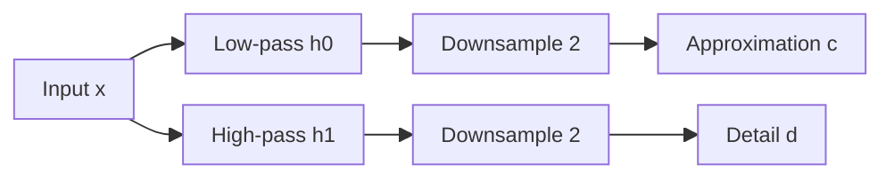

![[Pics/5. Wavelet analysis/one-dimensional-mra.png|600]]

1D multiresolution recursively decomposes the low-pass approximation.

![[Pics/5. Wavelet analysis/multilevel-decomposition.png|600]]

Analysis filter banks generate approximation and detail streams across scales.

![[Pics/5. Wavelet analysis/multilevel-reconstruction.png|600]]

Synthesis filter banks invert the decomposition from coarse scale back to the original signal.

### 2D DWT

![[Pics/5. Wavelet analysis/two-dimensional-dwt-subbands.png|650]]

One 2D DWT level produces LL, HL, LH, and HH subbands.

![[Pics/5. Wavelet analysis/synthetic-square.png|380]]

Synthetic square image is simple but has sharp edges.

![[Pics/5. Wavelet analysis/synthetic-square-dwt.png|650]]

DWT places smooth content in LL and edges/corners in detail subbands.

### EZW and JPEG2000 schemes

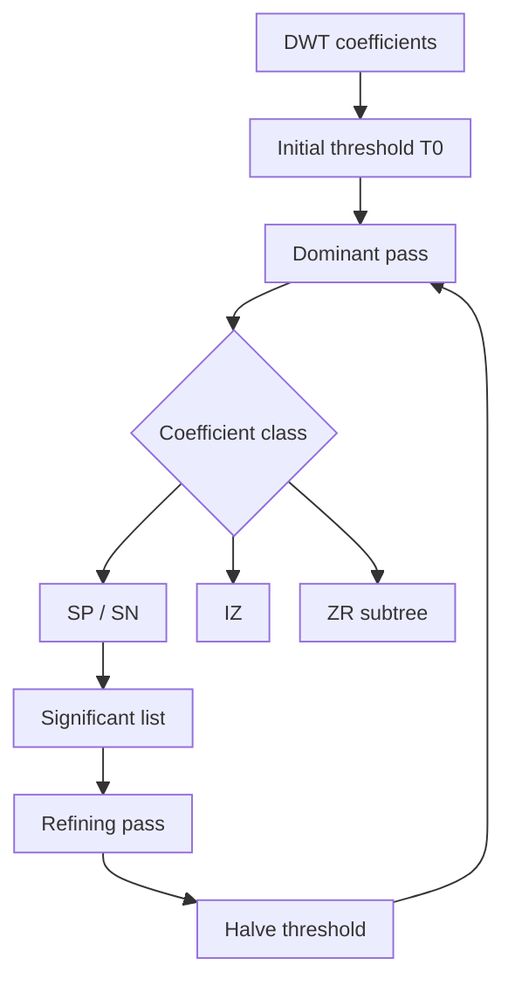


> [!Note] Missing visual
> Source uses placeholders for EBCOT codeblocks, R-D truncation, JPEG/JPEG2000 comparison, and error-robustness figures. Mermaid schemes above cover the processing logic.

## Examples

> [!Example] Trends vs anomalies
> Setup: an image row has smooth regions plus edges.
>
> Wavelet effect: low-pass branch captures slowly varying intensity; high-pass branch activates mostly at edges.
>
> Takeaway: smooth areas generate few detail coefficients, so they compress well.

> [!Example] Haar transform intuition
> For a pair $(x_0,x_1)$, Haar approximation and detail are proportional to:
>
> $$
> c=x_0+x_1,\qquad d=x_0-x_1
> $$
>
> If the pair is smooth, $x_0\approx x_1$, so $d\approx0$.
>
> Takeaway: Haar is simple edge/detail extraction, but only has one vanishing moment.

> [!Example] 2D DWT subbands
> LL: blurred low-resolution image.
>
> HL: responds to vertical details.
>
> LH: responds to horizontal details.
>
> HH: responds to diagonal details.
>
> Takeaway: DWT separates image geometry by scale and orientation.

> [!Example] EZW encoding on a 4x4 coefficient matrix
> Coefficients:
>
> $$
> \begin{bmatrix}
> 26 & 6 & -13 & 10\\
> -7 & 3 & 6 & 4\\
> 4 & -3 & 3 & -3\\
> 2 & -2 & -2 & 0
> \end{bmatrix}
> $$
>
> Initial threshold:
>
> $$
> T=16
> $$
>
> Since $26\geq16$, first coefficient is **SP**. Coefficients below threshold whose descendants are also below threshold become **ZR**.
>
> First dominant pass:
>
> ```text
> SP ZR ZR ZR
> ```
>
> Refining sends next bit of already significant coefficients.
>
> Takeaway: EZW sends coarse significance first, then progressively refines.

> [!Example] EZW decoding estimate
> If a coefficient becomes significant positive at threshold $T=16$, decoder knows:
>
> $$
> 16\leq c<32
> $$
>
> Initial estimate is midpoint:
>
> $$
> \hat{c}=24
> $$
>
> Refining bits shrink the uncertainty interval by factor 2 at each pass.

> [!Example] JPEG2000 vs JPEG at low rate
> | Rate | JPEG | JPEG2000 |
> | :--- | :--- | :--- |
> | 1.0 bpp | good | good |
> | 0.5 bpp | visible blocking | clean |
> | 0.3 bpp | strong blocking | slight blur |
> | 0.2 bpp | very poor | acceptable |
> | 0.1 bpp | often unusable | usable |
>
> Takeaway: wavelet coding degrades by blur/ringing rather than block artifacts.

> [!Example] Error robustness
> At bit error probability $p_E=10^{-3}$, JPEG can suffer catastrophic visual degradation because entropy decoding can desynchronize and errors propagate.
>
> JPEG2000 confines much damage to independent codeblocks, so degradation is more local and graceful.

> [!Example] Method comparison
> - **JPEG**: Transform: $8x8$ DCT; Coding: Huffman/arithmetic; Scalability: no; Lossless path: no; Blocking: yes.
> - **EZW**: Transform: DWT; Coding: symbols + arithmetic; Scalability: quality; Lossless path: yes with integer DWT; Blocking: no.
> - **JPEG2000**: Transform: DWT 9/7 or 5/3; Coding: EBCOT arithmetic; Scalability: quality, resolution, ROI; Lossless path: yes with 5/3; Blocking: no.

---

# Learned image compression

## Contents

- [[#Core idea|Core idea]]
- [[#Main concepts|Main concepts]]
- [[#Theory and formulas|Theory and formulas]]
- [[#Visual schemes|Visual schemes]]
- [[#Examples|Examples]]

## Core idea

**Learned Image Compression (LIC)**, also called **Neural Image Compression (NIC)**, replaces hand-designed codec blocks with neural networks trained end-to-end on image data.

Classical codecs use fixed linear transforms:

- JPEG: block DCT,
- JPEG 2000: DWT,
- handcrafted quantization and entropy models.

Learned codecs use neural networks:

- **analysis transform** $g_a$: maps image to latent tensor,
- **quantization**: maps latents to discrete values,
- **entropy model**: predicts bit cost of latents,
- **synthesis transform** $g_s$: reconstructs the image.

> [!Important] Main paradigm shift
> Learned compression is non-linear transform coding. The transform, probability model, and reconstruction behavior are optimized from data for a rate-distortion objective instead of being manually specified.

## Main concepts

### Classical vs. learned transform coding

General transform-coding structure remains:

$$
x \xrightarrow{\text{analysis}} z=g_a(x)
\xrightarrow{\text{quantization}} \hat{z}=Q(z)
\xrightarrow{\text{synthesis}} \hat{x}=g_s(\hat{z})
$$

In classical codecs, $g_a$ and $g_s$ are fixed transforms such as DCT or DWT. In learned compression, $g_a$ and $g_s$ are trained CNNs.

- **Transform**: Classical: fixed linear basis; Learned: learned non-linear mapping.
- **Adaptivity**: Classical: parameters only; Learned: weights learned from data.
- **Coefficients**: Classical: transform coefficients; Learned: latent variables / latent tensor.
- **Optimization**: Classical: discrete tool selection; Learned: gradient descent.
- **Entropy model**: Classical: fixed or handcrafted; Learned: learned prior/hyperprior.

### KLT as linear limit

KLT is optimal among linear transforms for Gaussian data, because it decorrelates components. Neural codecs generalize this:

- **linear**: Neural codec: non-linear.
- **optimal mainly for Gaussian sources**: Neural codec: handles complex natural-image distributions.
- **data-dependent but expensive**: Neural codec: CNNs process large images with shared weights.
- **decorrelates second-order statistics**: Neural codec: learns high-order features: edges, textures, semantics.

> [!Important] Non-linear KLT view
> LIC can be interpreted as a non-linear KLT optimized for rate-distortion, where the basis/functions are learned instead of fixed.

### Rate-distortion objective

Learned codecs are trained by minimizing a Lagrangian:

$$
\mathcal{L}=D(x,\hat{x})+\lambda R(\hat{z})
$$

or equivalently:

$$
\mathcal{L}=R(\hat{z})+\lambda D(x,\hat{x})
$$

The meaning of "large $\lambda$" depends on which form is used:

- in $D+\lambda R$, large $\lambda$ penalizes rate more strongly;
- in $R+\lambda D$, large $\lambda$ penalizes distortion more strongly.

Training several models with different $\lambda$ values gives different points on the rate-distortion curve, similar in role to quality factors.

### Artificial neuron and MLP

Neuron:

$$
y=f(w^Tx+b)=f(w_1x_1+\cdots+w_nx_n+b)
$$

where $f$ is a non-linear activation.

Common activations:

- **ReLU**: Formula: $f(z)=\max(0,z)$; Role: sparse non-linearity.
- **Sigmoid**: Formula: $f(z)=1/(1+e^{-z})$; Role: maps to $(0,1)$.
- **Tanh**: Formula: $f(z)=\tanh(z)$; Role: maps to $(-1,1)$.
- **GDN**: Formula: normalized response; Role: compression-specific.

MLP with one hidden layer:

$$
h=f(W_1x+b_1)
$$

$$
y=g(W_2h+b_2)
$$

Non-linear activations matter because without them a deep stack collapses to one linear transform.

### Gradient descent and backpropagation

Neural training updates parameters $\theta$ by:

$$
\theta_{t+1}=\theta_t-\eta\nabla_\theta\mathcal{L}(\theta_t)
$$

where $\eta$ is the learning rate.

Backpropagation applies the chain rule from output to input to compute gradients for every weight. This makes end-to-end codec training possible.

### Why MLPs fail on images

Flattening an image loses spatial structure. A $256x256$ image gives:

$$
256\cdot256=65536
$$

input values. Connecting it to 1000 hidden neurons requires:

$$
65,536,000
$$

weights in one layer.

Problems:

- no translation invariance,
- parameter explosion,
- overfitting,
- no explicit locality,
- computationally impractical.

### CNNs for learned compression

CNNs solve image scalability using:

- **local connectivity**: Compression meaning: nearby pixels treated together.
- **weight sharing**: Compression meaning: same detector reused everywhere.
- **strided convolution**: Compression meaning: learned downsampling in encoder.
- **multiple channels**: Compression meaning: many parallel learned features.
- **transposed convolution**: Compression meaning: learned upsampling in decoder.

A convolution applies a small kernel, e.g. $3x3$, to every local patch. A stride $s>1$ reduces spatial resolution and compacts information.

Typical neural codec latent tensor:

$$
H\times W \rightarrow \frac{H}{16}\times\frac{W}{16}\times C
$$

after four stride-2 stages. Source notes JPEG AI-like examples with:

- 160 channels for luminance,
- 96 channels for chrominance.

### GDN

> [!Important] Generalized Divisive Normalization
> $$
> w_i=
> \frac{v_i}
> {\sqrt{\beta_i+\sum_j\gamma_{ij}v_j^2}}
> $$
>
> $\beta_i$ and $\gamma_{ij}$ are learned parameters.


GDN is useful because it:

- performs local feature normalization,
- mimics lateral inhibition and visual masking,
- reduces correlation,
- makes latent distributions easier to model for entropy coding.

### Autoencoder codec

Learned image codecs are autoencoders:

1. **Analysis transform**:

$$
y=g_a(x)
$$

2. **Bottleneck**:

$$
\hat{y}=Q(y)
$$

3. **Entropy coding** of $\hat{y}$.
4. **Synthesis transform**:

$$
\hat{x}=g_s(\hat{y})
$$

The bottleneck is where compression happens.

### VAE interpretation

Modern neural codecs can be interpreted as rate-distortion VAEs.

> [!Important] VAE rate-distortion objective
> $$
> \mathcal{L}
> =
> D_{KL}[q(\hat{y}|x)\|p(\hat{y})]
> +
> \lambda\mathbb{E}[\rho(x,\hat{x})]
> $$
>
> The KL term corresponds to rate, and the reconstruction term corresponds to distortion.
>
> Interpretation:
>
> - $q(\hat{y}|x)$: distribution induced by encoder and quantization.
> - $p(\hat{y})$: entropy model expected by arithmetic coder.
> - $\rho(x,\hat{x})$: distortion metric, e.g. MSE, MS-SSIM, perceptual loss.
> - $\lambda$: rate-distortion tradeoff parameter.

### Quantization training problem

Hard rounding is non-differentiable:

$$
\hat{z}=Q(z)=\mathrm{round}(z)
$$

Its derivative is zero almost everywhere, so backpropagation cannot train the encoder through it.

Common training solution:

$$
\hat{z}\approx z+u,
\qquad
u\sim\mathcal{U}(-0.5,0.5)
$$

During inference:

$$
\hat{z}=\mathrm{round}(z)
$$

Additive uniform noise is a differentiable proxy and matches high-resolution quantization-noise theory.

Alternative approaches:

- **STE**: pretend quantizer derivative is 1.
- **Soft quantization**: smooth approximation during training, hard rounding at test time.

### Hyperprior

Basic latent priors assume fixed statistics, but real latent tensors have spatially varying variance. Hyperprior models transmit compact side information to predict local latent distributions.

Hyperprior mechanism:

$$
x\xrightarrow{g_a}y\xrightarrow{Q}\hat{y}\xrightarrow{g_s}\hat{x}
$$

$$
y\xrightarrow{h_a}z\xrightarrow{Q}\hat{z}\xrightarrow{h_s}\sigma
$$

Conditional model:

$$
p(\hat{y}|\hat{z})=\mathcal{N}(\mu,\sigma^2)
$$

Total rate includes:

$$
R_{\text{total}}=R(\hat{y})+R(\hat{z})
$$

The hyperprior overhead is useful when the rate saved by a better model for $\hat{y}$ exceeds the rate spent on $\hat{z}$.

### JPEG AI

Source notes describe **JPEG AI** as an international learned-image-coding standard built on deep learning. Its goals:

- outperform HEVC/VVC intra coding in image compression efficiency,
- support both human and machine tasks,
- use hierarchical VAE-like neural codecs,
- provide complexity profiles for different hardware.

Main ideas:

- deep CNN analysis/synthesis transforms,
- hyperprior side information,
- quantization proxy during training,
- latent tensors with many channels,
- one bitstream usable by human reconstruction or machine task decoders.

Complexity profiles in source:

- **Dec0**: Complexity: 8 kMAC/px; Target: low-end CPUs.
- **Dec1**: Complexity: 23 kMAC/px; Target: real-time mid-range smartphones.
- **Dec2**: Complexity: 214 kMAC/px; Target: high-end GPU / maximum quality.

### Current limitations

- **high complexity**: Why it matters: many kMAC/px, high energy cost.
- **hardware dependence**: Why it matters: GPU/NPU often needed.
- **determinism**: Why it matters: floating-point differences can cause drift.
- **out-of-distribution risk**: Why it matters: unusual images may be poorly reconstructed.
- **hallucination**: Why it matters: neural decoder may synthesize plausible but false details.

### Future directions

- Generative compression: GAN/diffusion decoders synthesize realistic textures at very low rates.
- Coding for machines: transmit latents directly to detection/segmentation systems.
- Hardware-algorithm co-design: neural codecs designed with NPUs and mobile accelerators.

## Theory and formulas

### Classical-to-neural architecture

Classical transform coding:

$$
x\rightarrow T(x)\rightarrow Q(T(x))\rightarrow \text{entropy coding}
$$

Learned transform coding:

$$
x\rightarrow g_a(x)=y\rightarrow Q(y)=\hat{y}
\rightarrow \text{entropy coding}
\rightarrow g_s(\hat{y})=\hat{x}
$$

The learned transform is non-linear, data-driven, and optimized jointly with the entropy model.

### Latent tensor size

If an input image has shape $H\times W$, and the encoder uses four stride-2 stages:

$$
H\times W
\rightarrow
\frac{H}{2}\times\frac{W}{2}
\rightarrow
\frac{H}{4}\times\frac{W}{4}
\rightarrow
\frac{H}{8}\times\frac{W}{8}
\rightarrow
\frac{H}{16}\times\frac{W}{16}
$$

With $C$ channels:

$$
y\in\mathbb{R}^{H/16\times W/16\times C}
$$

Spatial size shrinks, but channel count increases to preserve multiple learned features.

### Entropy model and arithmetic coding

If entropy model assigns probability $p_{\hat{y}}(\hat{y}_i)$ to each quantized latent symbol, rate estimate is:

$$
R(\hat{y})\approx
-\sum_i \log_2 p_{\hat{y}}(\hat{y}_i)
$$

Better probability models reduce arithmetic-coding length.

With hyperprior:

$$
R(\hat{y}|\hat{z})
\approx
-\sum_i\log_2 p(\hat{y}_i|\hat{z})
$$

Total:

$$
R_{\text{total}}
=
R(\hat{z})+R(\hat{y}|\hat{z})
$$

### Additive noise approximation

Uniform scalar quantization with unit step has error approximately:

$$
e\sim\mathcal{U}(-0.5,0.5)
$$

So during training:

$$
\tilde{y}=y+u,\qquad u\sim\mathcal{U}(-0.5,0.5)
$$

approximates:

$$
\hat{y}=\mathrm{round}(y)
$$

while preserving gradient flow.

### GDN interpretation

GDN divides each feature by local energy:

$$
w_i=\frac{v_i}{\sqrt{\beta_i+\sum_j\gamma_{ij}v_j^2}}
$$

If neighboring channels are strong, $w_i$ is suppressed. This resembles perceptual masking and helps produce latents with simpler distributions.

## Visual schemes

### Neural network basics

![[Pics/6. Learned Image Compression/artificial-neuron.png|650]]

Artificial neuron computes weighted sum, adds bias, and applies non-linear activation.

![[Pics/6. Learned Image Compression/mlp-architecture.png|500]]

MLP connects all neurons between layers; useful conceptually but inefficient for images.

![[Pics/6. Learned Image Compression/image-flattening-problem.png|500]]

Flattening image pixels destroys spatial topology and causes parameter explosion.

### CNN features

![[Pics/6. Learned Image Compression/convolution-receptive-field.png|600]]

Convolution applies the same local kernel at all positions, reusing learned pattern detectors.

![[Pics/6. Learned Image Compression/strided-convolution.png|600]]

Strided convolution downsamples spatial dimensions and compacts information.

![[Pics/6. Learned Image Compression/parallel-feature-channels.png|600]]

Multiple kernels create multiple feature maps, forming a 3D latent representation.

### Autoencoder codec


### Hyperprior codec

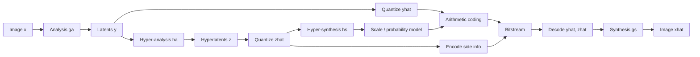

### JPEG AI dual use

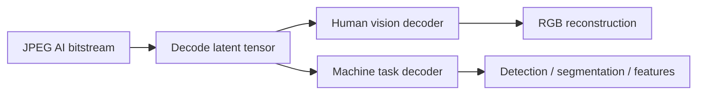

> [!Note] Missing visual
> Source has real figures for neural-network/CNN basics, but not for autoencoder, hyperprior, or dual-use JPEG AI architecture. Mermaid schemes above summarize those architectures.

## Examples

> [!Example] MLP parameter explosion
> A $256x256$ image has:
>
> $$
> 256\cdot256=65536
> $$
>
> input values. A fully connected layer with 1000 neurons needs:
>
> $$
> 65536\cdot1000=65,536,000
> $$
>
> weights, before biases.
>
> Takeaway: CNNs are needed because they reuse local filters instead of connecting every pixel to every neuron.

> [!Example] Latent tensor dimensions
> With four stride-2 convolution layers:
>
> $$
> H\times W\rightarrow H/16\times W/16
> $$
>
> If $C=160$ channels, the encoder produces:
>
> $$
> y\in\mathbb{R}^{H/16\times W/16\times160}
> $$
>
> Takeaway: spatial resolution shrinks, but many channels store learned features.

> [!Example] Training vs. inference quantization
> During training:
>
> $$
> \tilde{y}=y+u,\qquad u\sim\mathcal{U}(-0.5,0.5)
> $$
>
> During inference:
>
> $$
> \hat{y}=\mathrm{round}(y)
> $$
>
> Takeaway: additive noise makes training differentiable while approximating quantization noise.

> [!Example] Hyperprior rate tradeoff
> Sending hyperlatents $\hat{z}$ costs bits, but improves probability estimates for $\hat{y}$.
>
> Useful condition:
>
> $$
> R(\hat{z})+R(\hat{y}|\hat{z}) < R(\hat{y})
> $$
>
> Takeaway: side information is worth sending only when it saves more latent bits than it costs.

> [!Example] Complexity profiles
> - **Dec0**: Complexity: 8 kMAC/px; Interpretation: lightweight decoder.
> - **Dec1**: Complexity: 23 kMAC/px; Interpretation: phone-class real-time target.
> - **Dec2**: Complexity: 214 kMAC/px; Interpretation: high-quality high-compute decoder.
>
> Takeaway: same bitstream can be decoded with different compute/quality profiles.

> [!Example] Classical vs. learned codec
> - **Transform**: JPEG / JPEG 2000: DCT / DWT; Learned / JPEG AI: CNN + GDN.
> - **Basis**: JPEG / JPEG 2000: hand-crafted; Learned / JPEG AI: learned from data.
> - **Optimization**: JPEG / JPEG 2000: module-wise; Learned / JPEG AI: end-to-end.
> - **Entropy model**: JPEG / JPEG 2000: Huffman/arithmetic tables; Learned / JPEG AI: learned prior/hyperprior.
> - **Artifacts**: JPEG / JPEG 2000: blocking or blur; Learned / JPEG AI: possible hallucination.
> - **Complexity**: JPEG / JPEG 2000: low; Learned / JPEG AI: high.
>
> Takeaway: learned codecs win rate-distortion performance, but cost much more computation and must manage determinism.

---

# Motion estimation

## Contents

- [[#Core idea|Core idea]]
- [[#Main concepts|Main concepts]]
- [[#Theory and formulas|Theory and formulas]]
- [[#Visual schemes|Visual schemes]]
- [[#Examples|Examples]]

## Core idea

**Motion Estimation (ME)** extracts displacement information between video frames. In Multimedia Communications its main role is **temporal prediction**: if a region in the current frame can be predicted from a reference frame, the codec stores a **motion vector** and a smaller residual instead of coding the full frame independently.

The course focuses on **apparent motion**, also called **optical flow**, not on physical 3D motion. Apparent motion is the 2D displacement of image brightness patterns:

$$
\mathbf{v}(n,m)=
\begin{bmatrix}
u(n,m)\\
v(n,m)
\end{bmatrix}
$$

where $u$ and $v$ are horizontal and vertical pixel displacements.

> [!Important] Physical motion vs. apparent motion
> Physical motion is object movement in 3D space. Apparent motion is movement observed in the image plane. They can differ: a uniformly colored rotating object may have physical motion but no visible optical flow, while a moving light source may create apparent motion without object displacement.

![[Pics/7. Motion Estimation/apparent-vs-physical-motion.png|500]]

The figure shows why optical flow is an image-domain concept: visible intensity patterns, not real object mechanics, determine the estimated motion.

## Main concepts

### Families of motion estimation methods

- **Variational / gradient-based**: Output: dense field, one vector per pixel; Model: smooth optical flow; Typical use: vision analysis, foundational theory.
- **Block matching**: Output: one vector per block; Model: piecewise-constant translation; Typical use: video compression standards.
- **Parametric**: Output: global or regional field; Model: closed-form model, e.g. affine; Typical use: camera/object motion models.
- **Deep learning**: Output: dense learned flow; Model: CNN / recurrent correspondence model; Typical use: optical-flow benchmarks, analysis tasks.

### Motion-compensated prediction

Given a current frame $f_k$ and a reference frame $f_h$, the motion-compensated prediction is:

$$
\tilde{f}_k(n,m)=
f_h\left(n+u_{h\to k}(n,m),\;m+v_{h\to k}(n,m)\right)
$$

The prediction residual is:

$$
e(n,m)=f_k(n,m)-\tilde{f}_k(n,m)
$$

In compression, good ME should reduce residual energy while keeping the motion-vector field cheap to encode.

### How to evaluate a motion field

- **Prediction quality**: Formula / measure: $\mathcal{E}=\frac{1}{NM}\sum e^2(n,m)$; Meaning: residual MSE after compensation.
- **PSNR**: Formula / measure: $10\log_{10}\frac{255^2}{\mathcal{E}}$; Meaning: quality of the predicted frame.
- **MV coding cost**: Formula / measure: entropy or coded bits of $(u,v)$; Meaning: bit cost of the motion field.
- **Complexity**: Formula / measure: blocks $\times$ candidates $\times$ cost evaluation; Meaning: implementation cost.

> [!Important] Compression tradeoff
> The best geometric match is not always the best coding decision. A slightly worse prediction can be preferable if its motion vector is much cheaper to transmit.

## Theory and formulas

### Variational optical flow

Gradient-based methods assume **brightness constancy**:

$$
f_k(n,m)=f_h(n-u,\;m-v)
$$

For small motion, Taylor expansion gives the optical-flow constraint:

$$
\nabla f \cdot \mathbf{v}+f_t=0
$$

or equivalently:

$$
f_xu+f_yv+f_t=0
$$

> [!Important] Aperture problem
> The optical-flow equation gives one scalar equation for two unknowns $(u,v)$. Locally, an edge reveals only the motion component normal to the edge. Additional constraints are needed to estimate a full vector.

### Horn and Schunck

*Horn and Schunck* adds a smoothness prior to the optical-flow equation. It estimates $u$ and $v$ by minimizing:

$$
E(u,v)=
\iint_{\mathcal{R}}
\left[
\left(\nabla f \cdot \mathbf{v}+f_t\right)^2
+\lambda^2
\left(
|\nabla u|^2+|\nabla v|^2
\right)
\right]dn\,dm
$$

The first term enforces brightness constancy. The second term penalizes rapid spatial changes in the velocity field.

> [!Important] Role of $\lambda$
> Small $\lambda$ follows the data more closely and can be noisy. Large $\lambda$ enforces smoother flow but can blur motion boundaries.
>
> The iterative update used in the slides is:
>
> $$
> u^{k+1}=\bar{u}^{k}
> -f_x
> \frac{f_x\bar{u}^{k}+f_y\bar{v}^{k}+f_t}
> {\lambda^2+f_x^2+f_y^2}
> $$
>
> $$
> v^{k+1}=\bar{v}^{k}
> -f_y
> \frac{f_x\bar{u}^{k}+f_y\bar{v}^{k}+f_t}
> {\lambda^2+f_x^2+f_y^2}
> $$
>
> where $\bar{u}^{k}$ and $\bar{v}^{k}$ are local averages.

![[Pics/7. Motion Estimation/optical-flow-input-frame.png|360]]

Input video frame used to illustrate dense optical-flow estimation.

![[Pics/7. Motion Estimation/horn-schunck-dense-flow.png|360]]

Dense optical flow estimated over the frame. The method gives one vector per pixel but tends to smooth across object boundaries.

### Block matching

**Block matching (BM)** divides the current frame into blocks and assigns one translation vector to each block. For a block $B_{p,q}$ and search window $\mathcal{W}$:

$$
(\hat{i},\hat{j})=
\arg\min_{(i,j)\in\mathcal{W}}
d\left[
\mathbf{f}_k(B_{p,q}),
\mathbf{f}_h(B_{p-i,q-j})
\right]
$$

All pixels inside the block share the same vector:

$$
\forall(n,m)\in B_{p,q}:\quad
\mathbf{v}(n,m)=(\hat{i},\hat{j})
$$

**Forward motion** uses a previous reference frame ($h=k-1$). **Backward motion** uses a future reference frame ($h=k+1$).

![[Pics/7. Motion Estimation/block-matching-reference-current.png|500]]

Block matching searches in a reference frame for the block that best predicts the current block.

### SAD and SSD

The general norm-based matching cost is:

$$
J_p(i,j)=
\sum_{(n,m)\in B_{p,q}}
\left|
f(n,m,k)-f(n-i,m-j,h)
\right|^p
$$

Two important cases:

- **SAD**: Formula: $\sum |f_k-f_h|$; Properties: robust to outliers, simpler, often more regular MVF.
- **SSD**: Formula: $\sum (f_k-f_h)^2$; Properties: directly minimizes squared residual energy, but more outlier-sensitive.

![[Pics/7. Motion Estimation/sad-vs-ssd-motion-vectors.png|500]]

SAD can give a more regular motion-vector field, while SSD may slightly improve PSNR because it matches the MSE objective.

### Regularized motion estimation

Motion vectors can be regularized by penalizing vectors that differ from neighboring vectors:

$$
J_{\text{REG}}(i,j)=
\left\|
\mathbf{f}_k(B_{p,q})-\mathbf{f}_h(B_{p-i,q-j})
\right\|_p^p
+\lambda R(i,j)
$$

Modern codecs use a rate-distortion form:

$$
J(v)=D(v)+\lambda_{ME}R(v)
$$

where $D(v)$ is prediction distortion and $R(v)$ is the number of bits needed to encode the vector.

![[Pics/7. Motion Estimation/regularized-motion-vectors.png|500]]

Regularization reduces MVF entropy by preferring smoother vectors, at the cost of a small prediction-quality loss.

### Block size tradeoff

- **larger blocks**: Complexity: lower; MV coding cost: lower; Prediction error: higher.
- **smaller blocks**: Complexity: higher; MV coding cost: higher; Prediction error: lower.

Large blocks are efficient but cannot model detailed object boundaries. Small blocks are flexible but produce more vectors and higher overhead.

### Search strategies

For a full search window:

$$
\mathcal{W}=\{-A,\ldots,A\}\times\{-B,\ldots,B\}
$$

If $A=B=7$, full search tests:

$$
(2A+1)^2=15^2=225
$$

candidates per block.

| Strategy | Main idea | Typical tests in source example | Risk |
| :--- | :--- | :--- | :--- |
| **Full Search** | test every candidate | 225 | high cost |
| **Three Step Search** | decreasing step size | about 25 | local minima |
| **Diamond Search** | large diamond, then small diamond | about 23 | local minima |
| **Hexagon Search** | large hexagon, then small hexagon | about 17 | local minima |
| **TZSearch** | predictors plus adaptive search | variable | more complex control |

![[Pics/7. Motion Estimation/diamond-search-pattern.png|500]]

Diamond Search uses a large pattern to move across the cost surface and a small pattern for final refinement.

![[Pics/7. Motion Estimation/hexagon-search-pattern.png|500]]

Hexagon Search reduces new tests per iteration and is used in H.264/AVC-style fast ME.

### Subpixel precision

Motion is not limited to integer pixels. Codecs usually refine integer vectors at half-pixel and quarter-pixel precision.

For bilinear interpolation:

$$
f(n+a,m+b)=
(1-a)(1-b)x
+a(1-b)y
+(1-a)bz
+abw
$$

where $x,y,z,w$ are the four neighboring integer samples.

![[Pics/7. Motion Estimation/subpixel-motion-grid.png|500]]

Subpixel vectors improve prediction quality but require interpolation filters and extra search steps.

### Variable block size

Variable-size BM splits a block only when the rate-distortion cost improves:

1. Estimate the best vector for the current block and compute $J(v)=D+\lambda R$.
2. Split the block into four sub-blocks.
3. Estimate each sub-block and compute $J_{\text{sub}}=\sum_i J_i$.
4. Keep the split only if $J_{\text{sub}}<J(v)$.
5. Recurse until no gain or the minimum block size is reached.

This is the practical solution used by modern standards: flat regions keep large blocks, while object boundaries use smaller partitions.

### Parametric motion models

Parametric ME represents the entire MVF with a small number of parameters.

Translation:

$$
\mathbf{v}(\mathbf{p})=
\begin{bmatrix}
b_1\\
b_2
\end{bmatrix}
$$

Affine model:

$$
\mathbf{v}(\mathbf{p})=
\mathbf{b}+\mathbf{B}\mathbf{p}
=
\begin{bmatrix}
b_1\\
b_2
\end{bmatrix}
+
\begin{bmatrix}
b_3 & b_4\\
b_5 & b_6
\end{bmatrix}
\mathbf{p}
$$

The affine model has six parameters and can represent translation, zoom, rotation, shear, and their combinations.

![[Pics/7. Motion Estimation/affine-motion-field-translation.png|360]]

Pure translation gives a constant vector field.

![[Pics/7. Motion Estimation/affine-motion-field-zoom.png|360]]

Zoom and related affine effects are represented by a position-dependent field.

Parameter estimation can be:

- **indirect**: estimate a dense flow first, then fit parameters by least squares;
- **direct**: estimate parameters by minimizing the optical-flow residual or a SAD/SSD prediction error directly.

For an affine model, direct optical-flow fitting uses:

$$
\pi^*=
\arg\min_\pi
\sum_{(n,m)\in\mathcal{R}}
\left[
u_\pi(n,m)f_x+v_\pi(n,m)f_y+f_t
\right]^2
$$

### Deep learning methods

Deep learning treats optical flow as a learned correspondence problem. Training can be supervised with synthetic ground truth or unsupervised with photometric reconstruction losses.

- **FlowNet**: Year: 2015; Main contribution: first end-to-end CNN for dense optical flow; Limitation: weak on fine details and small displacements.
- **FlowNet 2.0**: Year: 2017; Main contribution: stacked networks and small-displacement module; Limitation: large memory footprint.
- **PWC-Net**: Year: 2018; Main contribution: pyramids, warping, cost volume; Limitation: coarse-to-fine detail loss.
- **RAFT**: Year: 2020; Main contribution: all-pairs correlation and recurrent GRU updates; Limitation: high memory cost.

![[Pics/7. Motion Estimation/flownet-architecture.png|500]]

FlowNet introduced end-to-end CNN optical flow, including variants with simple concatenation and explicit feature correlation.

![[Pics/7. Motion Estimation/flownet2-stacked-architecture.png|500]]

FlowNet 2.0 improves accuracy by stacking networks and specializing modules for different displacement regimes.

> [!Important] Compression vs. analysis
> Learned dense flow dominates many analysis benchmarks. Block matching remains central in video compression because it is simple, controllable, standardizable, and naturally tied to rate-distortion optimization.

## Visual schemes

### Motion-compensated coding loop

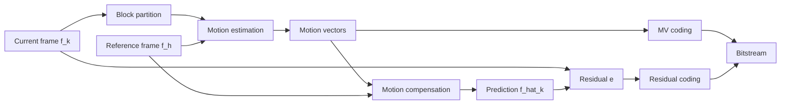

The loop shows why ME is a codec tool: it creates a predictor, then only vectors and residual information must be transmitted.

### Method overview

![[Pics/7. Motion Estimation/motion-estimation-methods-overview.png|600]]

The overview connects the main ME families: optical flow, block matching, parametric models, and learned methods.

### Variable block-size decision

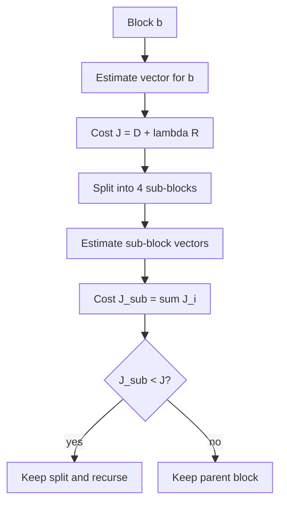

This decision balances lower residual distortion against the extra rate required by more vectors and partition syntax.

## Examples

### SAD vs. SSD on Flower Garden

| Criterion | MV rate | Prediction PSNR | Interpretation |
| :--- | :--- | :--- | :--- |
| SSD | 2143 bits | 22.46 dB | best MSE-oriented prediction |
| SAD | 2103 bits | 22.30 dB | slightly lower PSNR, lower MV cost |

> [!Example] Exam takeaway
> SSD optimizes squared error directly, so it can improve PSNR. SAD is often preferred in practice because it is cheaper, more robust to outliers, and can produce a more regular vector field.

### Regularized SSD

| Method | MV rate | Prediction PSNR | Effect |
| :--- | :--- | :--- | :--- |
| SSD | 2143 bits | 22.46 dB | no MV regularization |
| Regularized SSD | 2008 bits | 22.35 dB | lower MV rate with small PSNR loss |

Rate reduction:

$$
\frac{2143-2008}{2143}\approx 6.3\%
$$

The example shows the principle behind rate-distortion ME: a small distortion increase can be accepted if it saves enough motion-vector bits.

### Search complexity example

For $A=B=7$, full search tests $225$ candidates. Fast search methods in the source example need about:

| Method | Tests | Approximate saving |
| :--- | :--- | :--- |
| 2D-log / Three Step | 25 | 89% fewer |
| Diamond Search | 23 | 90% fewer |
| Hexagon Search | 17 | 92% fewer |

Fast methods are efficient because natural-video cost surfaces are often locally well behaved, but they do not guarantee the global minimum.

### Final comparison

- **Horn-Schunck**: Strength: dense, convex, elegant theory; Weakness: over-smooths boundaries.
- **Full-search BM**: Strength: global optimum in search window; Weakness: expensive.
- **Fast BM**: Strength: very low complexity; Weakness: possible local minima.
- **Variable-size BM**: Strength: good codec tradeoff; Weakness: partition overhead and control complexity.
- **Affine ME**: Strength: compact global/regional field; Weakness: needs suitable region/model.
- **FlowNet / PWC-Net / RAFT**: Strength: accurate dense flow for analysis; Weakness: training data, memory, generalization.

> [!Important] What to remember
> Motion estimation in video coding is a rate-distortion problem. A good codec decision balances residual energy, motion-vector rate, search complexity, block partitioning, and interpolation precision.

---

# Video coding principles

## Contents

- [[#Core idea|Core idea]]
- [[#Main concepts|Main concepts]]
- [[#Theory and formulas|Theory and formulas]]
- [[#Visual schemes|Visual schemes]]
- [[#Examples|Examples]]

## Core idea

**Video coding** compresses image sequences by exploiting two redundancies:

- **spatial redundancy**: neighboring pixels inside one frame are correlated;
- **temporal redundancy**: neighboring frames are similar over time.

Spatial redundancy is handled with image-coding tools such as transform, quantization, and entropy coding. Temporal redundancy is handled with **prediction**: encode a residual instead of encoding each frame independently.

> [!Important] Temporal prediction principle
> Statement: predict current frame/block from information available to decoder, then code prediction error plus side information.
>
> $$
> \text{coded data} = \text{prediction parameters} + \text{residual}
> $$
>
> Meaning: compression improves when residual is sparser and cheaper to encode than original signal.

![[Pics/8. Video Coding Principles/general-video-coder.png|560]]

General video coder: temporal compression removes inter-frame redundancy, spatial compression removes intra-frame redundancy, buffer/rate control adapts bitstream production.

## Main concepts

### Predictive video coding

Simple temporal prediction reuses previous reconstructed frame:

$$
\hat{f}_{n,m,k}=\hat{f}_{n,m,k-1}
$$

This is **DPCM** in video form. It sends no motion parameter, but fails when objects or camera move.

![[Pics/8. Video Coding Principles/dpcm-prediction-loop.png|500]]

DPCM-like loop: current image is predicted from previous reconstructed image; quantized error enters frame buffer for future prediction.

### Motion estimation and motion compensation

**Motion Estimation (ME)** finds displacement vectors. **Motion Compensation (MC)** uses those vectors to build predictor.

For block $B_k^{(\mathbf{p})}$ in current frame and reference block $B_h^{(\mathbf{p}+\mathbf{v})}$:

$$
J(\mathbf{v})=
d\left(B_k^{(\mathbf{p})},B_h^{(\mathbf{p}+\mathbf{v})}\right)
+\lambda_{\text{ME}}r(\mathbf{v})
$$

$$
\mathbf{v}^*(\mathbf{p})=\arg\min_{\mathbf{v}}J(\mathbf{v})
$$

where $d$ measures prediction error and $r(\mathbf{v})$ approximates vector coding cost.

![[Pics/8. Video Coding Principles/motion-estimation-example.png|600]]

ME searches for a displaced reference block whose content best matches current block.

### Motion-vector field coding

Motion vectors have two components, usually $v_x$ and $v_y$. They are spatially structured because nearby blocks often follow same object or camera motion.

![[Pics/8. Video Coding Principles/motion-vector-components.png|560]]

Motion-vector components show scene-dependent structure; this correlation can be compressed.

Raw motion vectors are not sparse enough. Coding them directly wastes rate. Better solution: predict each vector from neighbors and entropy-code only difference.

$$
MVD = MV_{\text{actual}} - MVP
$$

Common predictor:

$$
MVP=\operatorname{median}(\mathbf{v}_A,\mathbf{v}_B,\mathbf{v}_C)
$$

where $A$ is left, $B$ is top, and $C$ is top-right.

![[Pics/8. Video Coding Principles/mv-median-predictor.png|320]]

Median MVP is robust near motion boundaries and reduces vector residual entropy.

### Intra, inter, and direct modes

Video codecs work block by block. Each block chooses a **coding mode**:

- **Intra**: Prediction source: current frame only; Main payload: transform-coded block or intra residual.
- **Inter**: Prediction source: decoded reference frame(s); Main payload: motion vectors plus temporal residual.
- **Direct**: Prediction source: inferred motion; Main payload: little side information, often higher distortion.
- **Lossless**: Prediction source: no quantization loss; Main payload: high rate.

Mode choice is not standardized; bitstream syntax and decoder behavior are standardized.

### Frame types and GOP

A **Group of Pictures (GOP)** defines frame dependencies:

- **I frame**: intra-coded, independent;
- **P frame**: predicted from previous anchor/reference frame;
- **B frame**: predicted from previous and/or future reference frames.

![[Pics/8. Video Coding Principles/gop-structure.png|560]]

GOP controls prediction dependencies, random access, compression efficiency, delay, and error propagation.

![[Pics/8. Video Coding Principles/b-frame-prediction.png|560]]

B frames can use forward, backward, or bidirectional prediction, improving compression but increasing delay and complexity.

### Hybrid video codec

Practical standards use **hybrid video coding**:

1. choose prediction mode and block partition;
2. predict block with intra or inter tools;
3. transform prediction residual;
4. quantize transform coefficients;
5. entropy-code coefficients and side information;
6. reconstruct block inside encoder and store it for future prediction.

> [!Important] Encoder reconstruction loop
> Encoder must predict from reconstructed data, not original data, because decoder only has reconstructed reference frames. This avoids encoder-decoder drift.

![[Pics/8. Video Coding Principles/hybrid-video-encoder.png|650]]

Hybrid encoder includes transform coding, ME/MC, intra prediction, entropy coding, channel buffer, and internal decoder loop.

![[Pics/8. Video Coding Principles/hybrid-video-decoder.png|520]]

Decoder is subset of encoder: it decodes side information and residuals, reconstructs blocks, and updates frame buffer.

### Video encoding standards

Standardized hybrid codecs share the same core architecture; generations differ mainly in degrees of freedom. Licensing also drives adoption:

- **MPEG-1/2/4**: Note: among the first standards, since 1988.
- **H.264/AVC**: Note: royalty-free.
- **H.265/HEVC**: Note: partly patented.
- **H.266/VVC**: Note: patented.
- **AV1, VP8, VP9**: Note: royalty-free (Alliance for Open Media, AOM)

**MPEG-1** is the first generation. It introduced the MP3 audio format (MPEG-1 Audio Layer III) and targets low-rate digital video:

| Parameter | MPEG-1 limit |
| :--- | :--- |
| coding rate | up to about $1.86$ Mbps |
| max resolution | about $720\times576$ at 30 fps |
| audio bitrate | 128 to 320 kbps |

Standards from MPEG-2 onward (H.264/HEVC/VVC, AV1) are detailed in [[#Modern video compression standards]].

## Theory and formulas

### Motion compensation and residual

Once ME selects best vector, MC prediction is:

$$
\hat{I}_k(\mathbf{p}) =
I_h\left(\mathbf{p}+\mathbf{v}^*(\mathbf{p})\right)
$$

For one block:

$$
E(\mathbf{p}) =
B_k^{(\mathbf{p})}
-B_h^{(\mathbf{p}+\mathbf{v}^*)}
$$

Decoder reconstructs inter-coded block as:

$$
B_k^{(\mathbf{p})} =
E(\mathbf{p})
+B_h^{(\mathbf{p}+\mathbf{v}^*)}
$$

![[Pics/8. Video Coding Principles/motion-compensation-example.png|560]]

Motion-compensated image plus residual: residual is sparse except where prediction fails, e.g. occlusions and new areas.

### Entropy of motion vectors

For a discrete vector-component distribution:

$$
H=-\sum_i p_i\log_2 p_i
$$

Entropy gives theoretical lower bound for lossless coding. If histogram support is wide, raw MV coding remains expensive even with good entropy coding.

![[Pics/8. Video Coding Principles/raw-mv-entropy.png|360]]

Raw MV histograms are not sharply concentrated around zero, so direct Exp-Golomb coding performs poorly.

After MVP prediction, MVD histogram is more concentrated:

![[Pics/8. Video Coding Principles/mvd-prediction-error.png|560]]

Prediction error has lower entropy than raw vector field, so entropy coding needs fewer bits.

### Motion estimation design parameters

- **block size / shape**: Options: fixed or variable; Tradeoff: small blocks improve prediction but increase rate and complexity.
- **cost function**: Options: SAD, SSD, regularized; Tradeoff: SSD favors PSNR; SAD is simpler and robust; regularization reduces vector rate.
- **search strategy**: Options: full, hex, TZSearch; Tradeoff: full search best in window; fast search much cheaper.
- **motion model**: Options: translation, affine; Tradeoff: translation is simple; affine can improve RD but costs more.

### GOP and coding order

B frames can depend on future anchor frames. Therefore **display order** and **coding/decoding order** may differ.

![[Pics/8. Video Coding Principles/frame-coding-order.png|560]]

Future references must be decoded before B frames that depend on them, creating delay.

I, P, and B frames have different rate and quality behavior:

![[Pics/8. Video Coding Principles/frame-rate-psnr.png|560]]

Typical adjusted rates: I frames are about $3$ to $5$ times larger than P frames and $10$ to $20$ times larger than B frames.

### Rate-distortion mode selection

For fixed quantization step $Q$, choose coding mode $i_k$ for each block $k$.

Total distortion and rate:

$$
D=\sum_{k=1}^{K}D_k(i_k,Q)
\qquad
R=\sum_{k=1}^{K}R_k(i_k,Q)
$$

Lagrangian objective:

$$
J(\mathbf{i},Q,\lambda)=
\sum_{k=1}^{K}D_k(i_k,Q)
+\lambda\sum_{k=1}^{K}R_k(i_k,Q)
$$

Because global minimization is too expensive, encoders use block-wise mode decision:

$$
J_k(i_k,Q,\lambda)=D_k(i_k,Q)+\lambda R_k(i_k,Q)
$$

> [!Important] RDO objective
> **Statement:** choose mode with minimum $D+\lambda R$.
>
> **Meaning:** $\lambda$ controls quality-rate tradeoff. Large $\lambda$ penalizes rate more; small $\lambda$ favors lower distortion.

Empirical codec relations:

- **MPEG-2**: Example relation: $\lambda=aQ^2+b$.
- **H.264**: Example relation: $\lambda=c\cdot 2^{dQ+e}$.

Motion-estimation multiplier often follows:

$$
\lambda_{\text{ME}}=\sqrt{\lambda}
$$

### RD plane slope

From $J=D+\lambda R$:

$$
D=-\lambda R+J
$$

For fixed $\lambda$, equal-cost candidates lie on lines with slope $-\lambda$.

![[Pics/8. Video Coding Principles/rd-mode-points.png|460]]

Each coding mode and partition gives different rate-distortion point.

![[Pics/8. Video Coding Principles/rd-slope-selection.png|460]]

RDO chooses point first touched by line with slope $-\lambda$ when line moves toward convex hull of candidates.

### Block partition

Variable block-size coding treats splitting as another mode:

$$
J_{\text{split}}=\sum_i J_{\text{subblock}_i}
$$

Recursive decision:

1. compute current block cost $J_B$;
2. split into subblocks;
3. compute $J_{\text{split}}$;
4. split if $J_{\text{split}}<J_B$;
5. recurse until minimum block size or no gain.

This avoids exhaustive partition search but is suboptimal.

### Rate control

Quantization step controls produced coding rate $R_C$, but actual rate depends on content. Target rate $R_T$ comes from channel/storage constraints.

Buffer feedback rules:

- if $R_C>R_T$, buffer occupancy grows; above $\gamma_{\text{high}}$, increase $Q$ to reduce rate;
- if $R_C<R_T$, buffer occupancy falls; below $\gamma_{\text{low}}$, decrease $Q$ to increase rate.

> [!Important] Rate control
> **Statement:** channel buffer drives quantization adaptation so produced stream rate tracks target transmission/storage rate.
>
> **Meaning:** rate control trades visual quality against buffer overflow/underflow safety.

## Visual schemes

### Motion-compensated inter coding

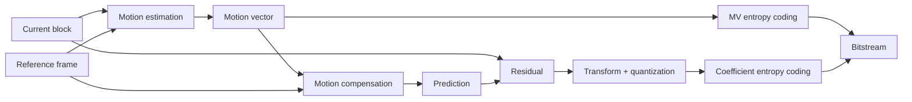

Encoder sends vector side information plus coded residual, not predicted pixels.

### Hybrid codec concept map

![[Pics/8. Video Coding Principles/hybrid-video-concept-map.png|650]]

Concept map links GOP, temporal prediction, spatial transform coding, motion estimation, entropy coding, and rate control.

### Block partition decision

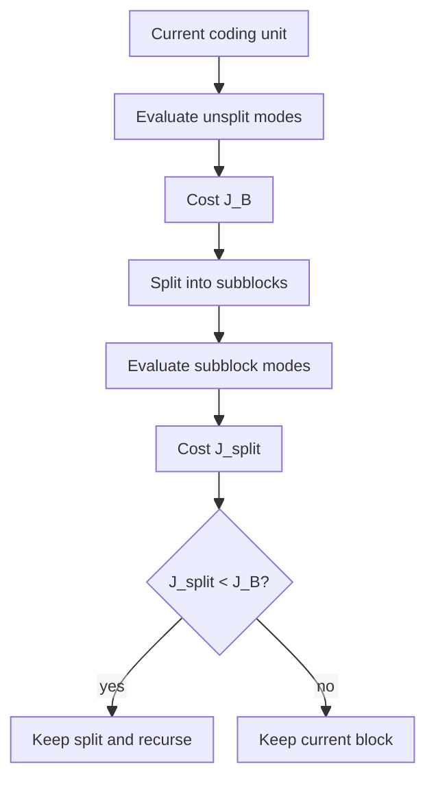

Partition selection is RD optimization over block geometry.

### Rate-control feedback

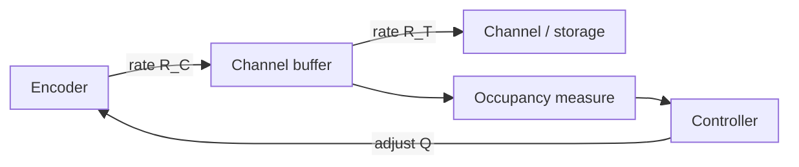

Increasing $Q$ lowers produced rate and quality; decreasing $Q$ raises rate and quality.

## Examples

### Raw motion-vector coding

For *Flower* sequence, direct raw MV coding gives:

| Algorithm | Total bits | bits/vector | bits/pixel |
| :--- | ---: | ---: | ---: |
| Exp-Golomb | 3048 | 7.697 | 0.0301 |
| Huffman | 1582 | 3.995 | 0.0156 |
| Arithmetic | 1570 | 3.965 | 0.0155 |

> [!Example] Why Exp-Golomb fails here
> Exp-Golomb is efficient when values concentrate near zero. Raw MV components have broad support, so Huffman/arithmetic coding are much better.

### Predictive MV coding gain

After median MVP and MVD coding:

| Algorithm | No prediction bits | With prediction bits | Reduction |
| :--- | ---: | ---: | ---: |
| Exp-Golomb | 3048 | 1526 | 49.9% |
| Huffman | 1582 | 1211 | 23.5% |
| Arithmetic | 1570 | 1199 | 23.6% |

Best result in source example: **prediction + arithmetic coding**, $1199$ bits, $3.03$ bits/vector.

### Frame-type tradeoffs

- **I**: Prediction: none; Rate: highest; Complexity: low; Role: random access, error reset.
- **P**: Prediction: previous anchor; Rate: medium; Complexity: high; Role: efficient forward prediction.
- **B**: Prediction: previous and future references; Rate: lowest; Complexity: very high; Role: best compression, adds delay.

I frames should keep high quality because prediction errors can propagate through GOP.

### Mode-selection interpretation

For one block, possible modes produce several $(R,D)$ points: Direct, Inter16, Inter8, Intra, Lossless. Encoder chooses minimum:

$$
J_k=D_k+\lambda R_k
$$

- high $\lambda$: save bits, choose low-rate modes such as Direct;
- low $\lambda$: preserve quality, choose lower-distortion modes such as fine Inter partitions or Lossless.

### Final exam checklist

- **temporal prediction**: code residual instead of full frame.
- **ME**: find vector minimizing $d+\lambda_{\text{ME}}r$.
- **MC**: copy reference block indicated by vector.
- **MVD**: code vector residual after spatial prediction.
- **GOP**: controls dependencies, delay, access, compression.
- **I/P/B**: increasing prediction efficiency and complexity from I to B.
- **hybrid codec**: prediction + transform/quantization + entropy coding + reconstruction loop.
- **RDO**: choose mode/partition minimizing $D+\lambda R$.
- **rate control**: adapt $Q$ from buffer occupancy.
- **standardization**: decoder and bitstream standardized; encoder decisions not standardized.

> [!Important] Main takeaway
> Video coding is joint optimization of prediction quality, residual sparsity, side-information rate, computational cost, and buffer constraints.

---

# Modern video compression standards

## Contents

- [[#Core idea|Core idea]]
- [[#Main concepts|Main concepts]]
- [[#Theory and formulas|Theory and formulas]]
- [[#Visual schemes|Visual schemes]]
- [[#Examples|Examples]]

## Core idea

Modern video standards from MPEG-1 to H.266/VVC keep the same **hybrid video coding** paradigm:

- predict current block from spatial or temporal neighbors;
- code only prediction residual;
- transform and quantize residual;
- entropy-code coefficients and side information;
- reconstruct frame inside encoder to keep decoder and encoder synchronized.

> [!Important] Universal hybrid paradigm
> Statement: modern video standards share prediction, residual coding, transform, quantization, entropy coding, in-loop reconstruction, and reference-frame buffering.
>
> Meaning: codec generations mainly differ in how much freedom they give to partitioning, prediction, transforms, filters, and transport syntax.

![[Pics/9. Modern Video Compression Standards/universal-hybrid-encoder.png|650]]

Universal hybrid encoder: mode decision chooses Intra or Inter prediction, residual is transform-coded, and decoded reconstruction re-enters frame buffer to prevent drift.

## Main concepts

### What standards define

Video standards do **not** standardize full encoder optimization. They standardize:

- bitstream syntax;
- decoder behavior;
- conformance rules.

Encoder choices such as motion search, rate control, partition pruning, and perceptual tuning remain open.

![[Pics/9. Modern Video Compression Standards/standard-scope-decoder.png|600]]

Standard scope: decoder and bitstream are fixed; encoder implementation is competitive design space.

> [!Important] Interoperability
> Any compliant decoder must produce same reconstruction from same valid bitstream. Encoders may differ in RDO search, heuristics, machine-learning pruning, and hardware scheduling.

### Historical evolution

Generations improve compression by increasing degrees of freedom:

- **MPEG-2**: Main design step: basic hybrid coding; Cost: low complexity, weak compression.
- **H.264/AVC**: Main design step: macroblocks, strong ME, CABAC/CAVLC; Cost: much better efficiency.
- **H.265/HEVC**: Main design step: CTUs, quad-tree, larger transforms, SAO; Cost: higher encoder complexity.
- **H.266/VVC**: Main design step: QT+MTT, affine tools, MTS, ALF; Cost: very high complexity.
- **AV1**: Main design step: royalty-free web codec, superblocks, strong filters; Cost: high complexity, broad web focus.

![[Pics/9. Modern Video Compression Standards/codec-evolution-timeline.png|500]]

Codec evolution trades lower bitrate for much larger encoder search space.

> [!Important] Golden rule
> New codec generations often target roughly half bitrate for same perceptual quality, but encoder complexity can increase by about $10x$.

### Source 2026 adoption scenarios

Course notes frame codec adoption as ecosystem-driven:

- **real-time / legacy**: Typical codecs: H.264/AVC; Main reason: universal hardware, low latency.
- **broadcast / mobile**: Typical codecs: HEVC, H.264; Main reason: mature 4K hardware support.
- **web streaming**: Typical codecs: AV1, H.264, HEVC; Main reason: AV1 royalty-free appeal, H.264 compatibility.
- **next-gen 8K / VR**: Typical codecs: VVC, AV1; Main reason: maximum compression, higher complexity.

Adoption depends on compression efficiency, licensing, decoder hardware, battery cost, latency, and platform support.

### Core standard tools

- **partitioning**: Tool: MB, CTU, superblock, QT, MTT; Purpose: adapt block geometry to content.
- **prediction**: Tool: Intra, Inter, Merge, affine; Purpose: remove spatial/temporal redundancy.
- **residual coding**: Tool: DCT/DST/MTS transforms; Purpose: compact residual energy.
- **quantization**: Tool: QP-controlled scalar quantization; Purpose: rate-distortion control.
- **entropy coding**: Tool: CABAC / arithmetic coding; Purpose: lossless syntax compression.
- **filtering**: Tool: deblocking, SAO, ALF, CDEF; Purpose: avoid artifacts in reference frames.
- **transport**: Tool: VCL/NAL, NALUs, OBUs; Purpose: map compressed video to networks/files.
- **parallelism**: Tool: slices, tiles, WPP; Purpose: error containment and hardware speed.

## Theory and formulas

### Rate-distortion optimization

For each coding decision:

$$
J=D+\lambda R
$$

where $D$ is distortion, $R$ is rate, and $\lambda$ controls quality-rate balance.

> [!Important] RDO
> Encoder should not select lowest distortion or lowest rate alone. It selects option minimizing weighted cost $D+\lambda R$.
>
> Block splitting is also a mode decision:
>
> $$
> J_{\text{split}}=\sum_i J_{\text{subblock}_i}
> $$
>
> Split if:
>
> $$
> J_{\text{split}}<J_B
> $$
>
> This principle drives modern partition trees.

### Space partitioning evolution

#### H.264/AVC: macroblocks

H.264 uses $16 \times 16$ **macroblocks**. Variable block-size partitioning supports:

- $16 \times 16$;
- $16 \times 8$;
- $8 \times 16$;
- $8 \times 8$, with sub-partitions down to $4 \times 4$.

Limitation: $16 \times 16$ maximum is inefficient for HD/4K smooth regions, where larger areas could be predicted with fewer bits.

#### H.265/HEVC: CTU and quad-tree

HEVC replaces macroblocks with **Coding Tree Units (CTUs)** up to $64 \times 64$. CTU splits recursively into square **Coding Units (CUs)** through quad-tree partitioning.

![[Pics/9. Modern Video Compression Standards/hevc-ctu-quadtree.png|500]]

HEVC quad-tree supports large blocks for smooth areas and small blocks around detail or object boundaries.

HEVC separates:

- **CU**: coding decision unit;
- **PU**: prediction unit;
- **TU**: transform unit.

#### H.266/VVC: QT + MTT

VVC expands CTUs up to $128 \times 128$ and introduces **Multi-Type Tree (MTT)**:

- quad-tree split;
- binary horizontal/vertical split;
- ternary horizontal/vertical split with $1:2:1$ ratio.

![[Pics/9. Modern Video Compression Standards/vvc-qt-mtt-partitioning.png|500]]

QT+MTT gives rectangular blocks, useful for object edges and directional textures, but increases RDO search complexity.

#### AV1: superblock partitioning

AV1 uses up to $128 \times 128$ **superblocks** and 10-way partitioning, including elongated $4:1$ and $1:4$ patterns.

![[Pics/9. Modern Video Compression Standards/av1-superblock-partitioning.png|500]]

AV1 partitioning gives high geometric freedom, especially for web-streaming efficiency.

### RDO search burden

Modern partitioning forms huge decision trees. Reference encoders often use DFS:

1. test parent block;
2. test splits;
3. evaluate Intra/Inter modes inside each node;
4. reconstruct blocks in causal order;
5. compare child cost against parent cost.

Search is partly sequential because top/left reconstructed pixels are needed for prediction.

Production encoders prune using:

- texture variance and gradients;
- temporal correlation from co-located blocks;
- early termination;
- learned split classifiers such as LightGBM or small CNNs.

### Intra prediction

**Intra prediction** uses already decoded top and left neighbors to predict current block.

![[Pics/9. Modern Video Compression Standards/intra-prediction-neighbors.png|420]]

Spatial prediction is causal: only already reconstructed neighboring samples can be used.

Mode evolution:

| Standard | Intra modes |
| :--- | :--- |
| H.264/AVC | 4 modes for $16 \times 16$, 9 modes for $4 \times 4$ |
| H.265/HEVC | 35 modes: 33 directions plus DC and Planar |
| H.266/VVC | 65+ directional modes plus wide-angle modes |

Mode freedom grows with signaling bits:

$$
P \propto 2^B
$$

![[Pics/9. Modern Video Compression Standards/intra-prediction-directional-example.png|420]]

Directional modes improve texture prediction but require more signaling.

![[Pics/9. Modern Video Compression Standards/intra-small-block-combinatorics.png|420]]

For many small blocks, Intra-mode combinations explode; practical encoders search sequentially and prune.

### Most probable mode

If VVC exposes 67 Intra modes, naive signaling needs around 7 bits per block. For tiny $4 \times 4$ blocks this can erase prediction gains.

**Most Probable Mode (MPM)** solves this:

- build candidate list from top and left Intra modes;
- if selected mode is likely, send short index;
- HEVC uses 3 MPM candidates;
- VVC uses 6 MPM candidates.

### Inter prediction

Inter prediction uses ME/MC and reference frames in the **Decoded Picture Buffer (DPB)**.

Modern tools:

- multiple reference frames;
- one P-list or two B-lists;
- generalized B-slices;
- weighted averaging of predictors;
- fractional-pel motion compensation.

![[Pics/9. Modern Video Compression Standards/multiple-reference-frames.png|520]]

Multiple reference frames let the encoder choose the best temporal predictor, including frames that are not nearest in time.

Sub-pixel precision:

- **H.264/HEVC/VVC**: Motion precision: quarter-pel, $1/4$ pixel.
- **AV1**: Motion precision: eighth-pel, $1/8$ pixel.

### Motion-vector prediction and merge

Motion vectors must also be coded efficiently.

- **H.264 Skip/Direct**: Idea: use median of spatial neighbors; if correct, send no MV.
- **HEVC/VVC Merge**: Idea: build candidate list from spatial and temporal candidates; send index.

Merge mode shares both motion vector and reference index. It replaces raw MV transmission with small candidate index.

### Beyond translational motion

Modern codecs model more than 2D translation:

- **affine motion**: rotation, zoom, shear with 4 or 6 parameters;
- **compound prediction**: AV1 can combine Inter and Intra prediction in same block.

![[Pics/9. Modern Video Compression Standards/av1-affine-prediction.png|520]]

Affine prediction captures motion that a single translational vector cannot model well.

### Transforms

Residual transform evolution:

- **H.264/AVC**: Transform design: $4 \times 4$ integer DCT approximation.
- **H.265/HEVC**: Transform design: transforms up to $32 \times 32$, DST for $4 \times 4$ Intra.
- **H.266/VVC**: Transform design: Multiple Transform Selection, non-square transforms.

Integer transforms keep encoder/decoder synchronized and avoid mismatch from floating-point precision.

### Quantization and CABAC

Quantization is main lossy step. In H.264/HEVC:

- QP increase by 6 doubles quantization step size;
- QP increase by 1 changes rate by about $12.5\%$ empirically.

> [!Important] QP
> Higher QP means coarser quantization, lower bitrate, and higher distortion. QP is primary rate-control knob.
>
> Modern standards rely on **CABAC**:
>
> - binarizes syntax elements;
> - adapts probabilities from spatial context;
> - gives about 5%-15% rate reduction over older VLC/CAVLC.

### In-loop filters

Independent block transform and quantization create **blocking artifacts** at low bitrate.

![[Pics/9. Modern Video Compression Standards/blocking-artifacts.png|560]]

If artifacts enter DPB, future motion compensation uses damaged references. Therefore filters must be inside reconstruction loop and normative.

Filter evolution:

- **H.264/AVC**: Filters: deblocking on $4 \times 4$ edges.
- **H.265/HEVC**: Filters: lighter deblocking on $8 \times 8$ grid plus SAO.
- **H.266/VVC**: Filters: deblocking, SAO, ALF, LMCS.
- **AV1**: Filters: CDEF, loop restoration, film grain synthesis.

### Slices

Slices divide pictures to contain errors and allow parallel work. At new slice:

- Intra prediction does not cross boundary;
- CABAC context is reset;
- decoder can resynchronize more easily.

![[Pics/9. Modern Video Compression Standards/slices-error-containment.png|500]]

Slices trade compression efficiency for robustness and parallelism.

### VCL, NAL, NALU, OBU

Starting from H.264, standards separate compression from transport:

- **VCL** (*Video Coding Layer*): prediction, transforms, RDO, slices;
- **NAL** (*Network Abstraction Layer*): encapsulation and metadata for transport/storage.

![[Pics/9. Modern Video Compression Standards/vcl-nal-layering.png|420]]

VCL produces compressed slices; NAL packages them for RTP/IP, MP4, MPEG-2 TS, or raw streams.

NALU types:

- **VCL NALU**: Meaning: compressed slice data: modes, MVs, coefficients.
- **SPS**: Meaning: Sequence Parameter Set: sequence-level parameters.
- **PPS**: Meaning: Picture Parameter Set: per-picture options.
- **SEI**: Meaning: extra metadata: HDR, subtitles, user data.
- **AUD**: Meaning: optional Access Unit Delimiter.

**Access Unit (AU)**: all NALUs needed to decode one frame.

![[Pics/9. Modern Video Compression Standards/nalu-access-unit.png|560]]

AU is frame-level decoding group; NALUs are syntax/transport units inside it.

AV1 uses **OBUs** (*Open Bitstream Units*) instead of MPEG-style NALUs.

### Annex-B vs packetized format

**Annex-B byte-stream** inserts start code before each NALU:

```text
0x00000001
```

It works for continuous streams but requires byte scanning and emulation prevention.

![[Pics/9. Modern Video Compression Standards/annex-b-byte-stream.png|560]]

Annex-B is good for raw `.264` and MPEG-TS style continuous delivery.

**Packetized length-prefixed** format writes a length field before each NALU. Parser can jump in $O(1)$, but if container boundaries are damaged, resynchronization is harder.

![[Pics/9. Modern Video Compression Standards/packetized-length-prefixed.png|560]]

Packetized format is software-friendly and common in MP4-like containers.

HEVC/VVC keep both formats and expand NALU header to 2 bytes for Temporal ID and Layer ID. AV1 drops Annex-B start codes and uses length-prefixed OBUs.

### Network-friendly operations

NAL structure lets intermediate nodes inspect stream without decoding:

- MANE can drop non-reference B frames under congestion;
- sensitive SPS/PPS can receive stronger protection, such as CRC;
- RTP can fragment large NALUs into Fragmentation Units and reassemble them.

![[Pics/9. Modern Video Compression Standards/nal-network-inspection.png|560]]

NAL headers allow network-aware pruning, protection, and packet fragmentation.

### Random access

Random access points define where decoding may restart cleanly.

![[Pics/9. Modern Video Compression Standards/random-access-idr-cra-bla.png|600]]

- **IDR**: Meaning: clears DPB; future frames cannot reference before IDR; Use: clean restart, scene cuts.
- **CRA**: Meaning: Intra picture; leading RASL frames may reference past in normal playback; Use: efficient seeking in HEVC+.
- **BLA**: Meaning: like CRA but signals broken past references; Use: splicing, ad insertion, transcoding.

CRA improves compression compared with frequent IDR because normal playback can keep useful past references.

### Tiles and WPP

**Tiles** group CTUs into independent rectangular regions:

- self-contained prediction constraints;
- parallel encoding/decoding;
- useful for viewport-adaptive 360-degree video.

![[Pics/9. Modern Video Compression Standards/tiles-parallelism.png|520]]

Tiles enable independent rectangular processing regions.

![[Pics/9. Modern Video Compression Standards/tiles-360-video.png|520]]

360-degree streaming sends high quality only for viewport tiles and low quality elsewhere.

> [!Important] Tile bandwidth saving
> Tile-based adaptive 360-degree streaming can reduce bandwidth by about 50%-60% without degrading perceived viewport quality.
>
> **Wavefront Parallel Processing (WPP)** starts CTU row encoding after two CTUs of previous row are ready.

![[Pics/9. Modern Video Compression Standards/wavefront-parallel-processing.png|520]]

WPP preserves spatial prediction contexts while enabling row-level multicore parallelism.

## Visual schemes

### Modern hybrid encoder loop

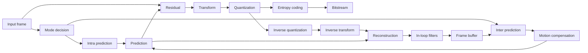

Internal decoder loop makes encoder use same references as decoder.

### Standard abstraction

```mermaid
%%{init: {"flowchart": {"useMaxWidth": true, "htmlLabels": false, "nodeSpacing": 18, "rankSpacing": 28, "padding": 8}, "themeVariables": {"fontSize": "12px"}}}%%
flowchart LR
    A["Encoder optimization"] --> B["Compliant bitstream"]
    B --> C["Standard decoder"]
    C --> D["Reconstructed video"]
    E["Standard"] --> B
    E --> C
```

Standards constrain bitstream and decoder, not full encoder search algorithm.

### Transport mapping

```mermaid
%%{init: {"flowchart": {"useMaxWidth": true, "htmlLabels": false, "nodeSpacing": 18, "rankSpacing": 28, "padding": 8}, "themeVariables": {"fontSize": "12px"}}}%%
flowchart TD
    A["VCL: slices"] --> B["NAL units"]
    B --> C{"Delivery format"}
    C --> D["Annex-B start codes"]
    C --> E["Length-prefixed packets"]
    D --> F["Broadcast / raw stream"]
    E --> G["MP4 / packetized storage"]
    B --> H["RTP fragmentation"]
```

NAL separates compression syntax from delivery syntax.

## Examples

### UVG HoneyBee comparison

Source sequence: 1080p, 120 fps, target 2.0 Mbps.

| Codec | Actual rate | PSNR | Encoding time |
| :--- | ---: | ---: | ---: |
| MPEG-2 | 7.06 Mbps | 36.58 dB | 2.18 s |
| H.264 | 2.00 Mbps | 40.51 dB | 17.06 s |
| HEVC | 1.98 Mbps | 41.69 dB | 109.45 s |
| AV1 | 1.80 Mbps | 43.47 dB | 158.66 s |
| VVC | 1.98 Mbps | 43.81 dB | 105.08 s |

> [!Example] Takeaway
> MPEG-2 cannot meet target bitrate on this sequence. H.264 reaches target. HEVC, AV1, and VVC give higher PSNR but require far larger encoding time.

### UVG Bosphorus comparison

Source sequence: 1080p, 120 fps, VBV target 2.0 Mbps.

| Codec | Actual rate | PSNR | Encoding time |
| :--- | ---: | ---: | ---: |
| MPEG-2 | 8.47 Mbps | 36.14 dB | 2.45 s |
| H.264 | 2.03 Mbps | 35.58 dB | 19.20 s |
| HEVC | 1.97 Mbps | 38.82 dB | 143.83 s |
| AV1 | 1.98 Mbps | 40.69 dB | 147.13 s |
| VVC | 1.96 Mbps | 41.00 dB | 139.08 s |

> [!Note] Missing visual
> Source references HoneyBee and Bosphorus visual codec-comparison figures, but no corresponding image asset was present in available course image folders. Metric tables preserve exam-relevant comparison.

### Partition evolution summary

| Codec | Largest unit | Partition style | Main tradeoff |
| :--- | :--- | :--- | :--- |
| H.264/AVC | $16 \times 16$ macroblock | fixed VBS shapes | simple, limited for HD/UHD |
| HEVC | $64 \times 64$ CTU | quad-tree | good UHD adaptation |
| VVC | $128 \times 128$ CTU | QT + binary/ternary MTT | best flexibility, high search cost |
| AV1 | $128 \times 128$ superblock | 10-way split | flexible royalty-free web codec |

### Final exam checklist

- **hybrid paradigm**: same core architecture from MPEG-1 to VVC.
- **standard scope**: bitstream + decoder standardized, encoder free.
- **RDO**: every mode/partition decided by $J=D+\lambda R$.
- **complexity growth**: more freedom improves compression but expands search tree.
- **Intra evolution**: directions grow from H.264 to HEVC to VVC.
- **MPM**: predicts Intra mode to reduce signaling.
- **Inter evolution**: multiple references, merge mode, fractional ME, affine motion.
- **transform evolution**: larger/flexible transforms and MTS for residuals.
- **QP**: main lossy rate-control knob; +6 QP doubles step size.
- **CABAC**: adaptive arithmetic coding for syntax elements.
- **in-loop filters**: protect future references from blocking/ringing.
- **VCL/NAL**: compression separated from transport.
- **Annex-B**: start-code byte stream for continuous delivery.
- **packetized format**: length-prefixed NALUs for containers.
- **AV1 OBU**: AV1 replaces NALUs with length-prefixed OBUs.
- **IDR/CRA/BLA**: random access and stream splicing tools.
- **tiles**: independent regions for parallelism and 360 streaming.
- **WPP**: row-level CTU parallelism with two-CTU offset.

> [!Important] Main takeaway
> Modern standards improve compression by adding controlled freedom. Encoder must spend computation to search partitions, modes, vectors, transforms, filters, and syntax choices, while decoder remains standardized and deterministic.

---

# Audio coding

## Contents

- [[#Core idea|Core idea]]
- [[#Main concepts|Main concepts]]
- [[#Theory and formulas|Theory and formulas]]
- [[#Visual schemes|Visual schemes]]
- [[#Examples|Examples]]

## Core idea

**Audio coding** compresses speech and general audio by exploiting both signal redundancy and human perception.

Two main paradigms:

- **Source-based coding**: model how sound is produced. Best for speech, where vocal tract physics gives strong structure. Main tools: LPC, CELP, ACELP.
- **Sink-based coding**: model what listener cannot hear. Best for music/general audio. Main tools: psychoacoustic masking, MDCT, adaptive bit allocation.

> [!Important] Redundancy vs. irrelevancy
> Speech coding mainly removes **statistical redundancy** through prediction and source modeling. Perceptual audio coding mainly removes **irrelevant information** hidden by auditory masking.

Modern codecs such as **Opus**, **EVS**, and **USAC** are hybrid: they switch or blend speech-oriented and music-oriented tools.

## Main concepts

### Speech vs. music

Audio signals are locally stationary, but stationarity time varies:

- **speech**: Typical behavior: quasi-stationary around 20 ms; Coding implication: LPC/CELP frame analysis works well.
- **tonal music**: Typical behavior: can be stable for hundreds of ms; Coding implication: long transform windows improve frequency resolution.
- **transients**: Typical behavior: can change in 2-5 ms; Coding implication: short windows avoid pre-echo.
- **complex game/effects audio**: Typical behavior: noise-like and mixed; Coding implication: parametric speech models fail.

> [!Important] Window-length compromise
> Long windows give good frequency resolution for stable tones. Short windows localize attacks and reduce pre-echo around transients.

### Empirical signal structure

Voiced speech has strong correlation between consecutive samples and harmonic spectral structure.

![[Pics/10. Audio Coding/voiced-speech-correlation.png|420]]

Consecutive voiced-speech samples align near a diagonal: strong time-domain redundancy supports prediction.

![[Pics/10. Audio Coding/vowel-spectrogram.png|500]]

Vowel spectrogram: horizontal harmonics and formants justify source-filter speech modeling.

Music can be less predictable in time domain, especially with beats and transients.

![[Pics/10. Audio Coding/music-amplitude-histogram.png|420]]

Music amplitudes can still be sparse, but structure is not tied to a single vocal-tract model.

### Source-filter model

Speech production:

- lungs provide air pressure;
- vocal folds generate excitation;
- vocal tract filters excitation through resonances.

Frequency-domain model:

$$
S(f)=E(f)H(f)
$$

where $E(f)$ is excitation spectrum and $H(f)$ is vocal-tract transfer function.

![[Pics/10. Audio Coding/source-filter-model.png|520]]

Source-filter model separates excitation from resonant vocal-tract envelope.

### Voiced and unvoiced speech

- **voiced**: Excitation: periodic glottal pulses; Signal: harmonic, pitch period $T_0$; Codec parameter: pitch and gain.
- **unvoiced**: Excitation: turbulent noise; Signal: stochastic, noise-like; Codec parameter: noise excitation and gain.

Encoder must decide voiced/unvoiced per frame because synthesis excitation differs.

## Theory and formulas

### Linear predictive coding

LPC estimates current sample from past $P$ samples:

$$
\hat{x}(n)=-\sum_{i=1}^{P}a_i x(n-i)
$$

Residual:

$$
y(n)=x(n)-\hat{x}(n)=\sum_{i=0}^{P}a_i x(n-i),
\qquad a_0=1
$$

Prediction-error filter:

$$
A(z)=\sum_{i=0}^{P}a_i z^{-i}
$$

> [!Important] LPC whitening filter
> LPC removes vocal-tract spectral envelope. If prediction is good, residual $y(n)$ becomes white-noise-like for unvoiced frames or impulse-train-like for voiced frames.


Optimal LPC coefficients minimize residual variance. Yule-Walker system:

$$
\mathbf{R}_x\mathbf{a}=-\mathbf{r}_x
$$

$\mathbf{R}_x$ is Toeplitz, so Levinson-Durbin solves it in $\mathcal{O}(P^2)$.

### LPC analysis

LPC encoder extracts, usually every 20 ms:

- LP coefficients $\{a_i\}$: vocal-tract spectral envelope;
- gain $G$: residual energy;
- voiced/unvoiced decision;
- pitch period $T_0$ for voiced speech.

![[Pics/10. Audio Coding/lpc-analysis-process.png|420]]

Autocorrelation supports filter estimation, pitch detection, voiced/unvoiced decision, and gain extraction.

Short-time autocorrelation:

$$
R_x(k)=\sum_{n=0}^{N-1-k}x_w(n)x_w(n+k),
\qquad k=0,\ldots,K
$$

Small lags estimate LPC coefficients; larger lags reveal pitch peaks.

### LPC synthesis

Analysis:

$$
Y(z)=A(z)X(z)
$$

Synthesis:

$$
X(z)=A^{-1}(z)Y(z)
$$

Time-domain decoder recurrence:

$$
x(n)=y(n)-\sum_{i=1}^{P}a_i x(n-i)
$$

The synthesis filter $1/A(z)$ is all-pole IIR. Its stability is critical.

### LPC coefficient quantization and LSF

Direct scalar quantization of $a_i$ is dangerous:

- coefficients have wide dynamic range;
- small quantization errors can move poles outside unit circle;
- unstable synthesis filter causes severe distortion.

**Line Spectrum Frequencies (LSF)** solve this by mapping $A(z)$ to auxiliary polynomials:

$$
P(z)=A(z)+z^{-(P+1)}A(z^{-1})
$$

$$
Q(z)=A(z)-z^{-(P+1)}A(z^{-1})
$$

Properties:

- roots of $P(z)$ and $Q(z)$ lie on unit circle;
- roots can be represented by angles $\omega_i \in [0,\pi]$;
- filter stability is equivalent to strict interlacing:

$$
0<\omega_1^{(P)}<\omega_1^{(Q)}<\omega_2^{(P)}<\omega_2^{(Q)}<\cdots<\pi
$$

> [!Important] LSF coding advantage
> LSFs make LPC quantization safer: decoder can detect and repair order violations by restoring interlacing, preserving filter stability.


Reconstruction:

$$
A(z)=\frac{P(z)+Q(z)}{2}
$$

![[Pics/10. Audio Coding/lsf-formants.png|600]]

Close LSF root pairs correspond to formants, so LSFs encode vocal-tract resonances in stable frequency coordinates.

### Vector quantization

Instead of quantizing each LSF independently, speech coders quantize full LSF vector:

$$
\boldsymbol{\omega}=[\omega_1,\ldots,\omega_P]
$$

Encoder searches a trained shared codebook and sends only index.

> [!Important] VQ for speech
> Vocal tracts can take only physically plausible shapes, so LSF components are correlated. Vector quantization exploits this structure better than scalar quantization.

### LPC-10 bitrate

LPC-10 uses 54 bits per 22.5 ms frame:

$$
R=\frac{54}{0.0225}=2400\text{ bps}
$$

| Parameter | Voiced bits | Unvoiced bits |
| :--- | ---: | ---: |
| LPC coefficients | 41, order $P=10$ | 20, order $P=4$ |
| pitch period $T_0$ | 7 | 0 |
| gain $G$ | 5 | 5 |
| sync | 1 | 1 |
| error protection | 0 | 28 |
| total | 54 | 54 |

Voiced frames spend bits on spectral detail and pitch. Unvoiced frames need fewer model bits and can spend more on protection.

### CELP

LPC-10 sounds poor because excitation is too simple. **CELP** (*Code Excited Linear Prediction*) improves excitation through:

- vector codebook excitation;
- analysis-by-synthesis search;
- closed-loop selection of vector index and gain.

![[Pics/10. Audio Coding/celp-analysis-by-synthesis.png|560]]

CELP encoder tests candidate excitations through synthesis filter and selects best perceptual match.

### Perceptual weighting in CELP

CELP minimizes perceptually weighted error, not raw waveform error:

$$
W(z)=\frac{A(z)}{A(z/\gamma)},
\qquad 0<\gamma<1
$$

Pole shifting broadens formants and shapes error so noise is hidden under speech energy peaks.

![[Pics/10. Audio Coding/celp-perceptual-weighting.png|520]]

Weighting de-emphasizes error near formants and emphasizes error in spectral valleys.

### CELP excitation

Adaptive codebook models pitch by reusing past excitation:

$$
y_{\text{adapt}}(n)=y(n-Q)
$$

Long-term predictor:

$$
B(z)=g_p z^{-Q}
$$

Total excitation:

$$
y(n)=g_p y_{\text{adapt}}(n)+g_{c1}v_1(n)+g_{c2}v_2(n)
$$

Adaptive term captures voiced periodicity; fixed-codebook innovation captures new/noise-like content.

![[Pics/10. Audio Coding/g729-celp-architecture.png|620]]

G.729 combines adaptive codebook, fixed codebook, gains, perceptual weighting, and synthesis filtering.

### G.729 bitrate

G.729 uses 80 bits per 10 ms frame:

$$
R=\frac{80}{0.010}=8000\text{ bps}
$$

| Parameter | Update rate | Bits |
| :--- | :--- | ---: |
| LSF coefficients | 10 ms | 18 |
| adaptive codebook index | 5 ms, twice | 14 |
| fixed codebook index | 5 ms, twice | 26 |
| codebook gains | 5 ms, twice | 14 |
| parity/sync | 10 ms | 8 |

### AMR-WB and EVS

**AMR-WB** extends narrowband telephony to HD Voice:

- bandwidth: 50-7000 Hz;
- 9 bitrates from 6.6 to 23.85 kbps;
- ACELP evolution with larger dictionaries.

![[Pics/10. Audio Coding/amr-wb-frequency-response.png|500]]

Wideband speech preserves presence and fricatives missing in narrowband telephony.

**EVS** for VoLTE/5G:

- supports NB to full-band, up to 20 kHz;
- bitrate range about 5.9-128 kbps;
- hybrid ACELP for speech and MDCT for music;
- robust jitter buffer, frame erasure concealment, DTX, comfort noise;
- AMR-WB IO mode for backward compatibility.

### Psychoacoustic coding

Perceptual coders remove inaudible components.

**Absolute threshold of hearing** $S_a(f)$: minimum audible power varies with frequency; human ear most sensitive around 1-4 kHz.

![[Pics/10. Audio Coding/absolute-threshold-hearing.png|560]]

Anything below threshold can be discarded without perceived loss.

**Critical bands**: cochlea behaves like overlapping bandpass filters; within one band, listener perceives total energy more than individual sinusoids.

![[Pics/10. Audio Coding/critical-bands.png|500]]

AAC approximates critical bands with scale-factor bands.

**Frequency masking**: strong masker raises audibility threshold near its frequency.

$$
S_Q(f)<\Phi(f)
$$

Quantization noise below masking threshold $\Phi(f)$ is inaudible.

![[Pics/10. Audio Coding/frequency-masking.png|560]]

Masking is asymmetric and generally stronger above masker frequency.

**Temporal masking**:

- pre-masking: about 2-5 ms before loud onset;
- post-masking: about 100-200 ms after loud sound.

![[Pics/10. Audio Coding/temporal-masking.png|500]]

Temporal masking motivates window switching and pre-echo control.

### MDCT

**MDCT** maps overlapped time samples to frequency coefficients.

Main properties:

- 50% overlap;
- TDAC (*Time Domain Aliasing Cancellation*);
- critical sampling.

If input window has:

$$
N=2M
$$

samples, MDCT outputs:

$$
M
$$

coefficients.

> [!Important] MDCT critical sampling
> Overlap avoids blocking artifacts, but output coefficient count equals new time samples. No data expansion occurs.

### Perceptual audio coder

Encoder tasks:

1. frequency transform;
2. psychoacoustic analysis;
3. bit allocation;
4. quantization;
5. Huffman/arithmetic coding.

![[Pics/10. Audio Coding/perceptual-audio-encoder.png|620]]

Encoder uses auditory model to allocate bits where quantization noise would be audible.

![[Pics/10. Audio Coding/perceptual-audio-decoder.png|540]]

Decoder is simpler: inverse quantization and inverse frequency transform reconstruct signal.

### Signal-to-mask ratio

For band $k$:

$$
SMR_k[\text{dB}]=S_k[\text{dB}]-\Phi_k[\text{dB}]
$$

Transparency condition:

$$
SNR_k>SMR_k
$$

This means quantization noise remains below masking threshold.

### MP3 vs. AAC

- **standard**: MP3: MPEG-1 Audio Layer 3; AAC: MPEG-2/4 Advanced Audio Coding.
- **transform**: MP3: hybrid polyphase + MDCT; AAC: pure MDCT.
- **bands**: MP3: 32 uniform subbands; AAC: 51 critical-band-like SFBs.
- **resolution**: MP3: limited/fixed; AAC: flexible up to 1024 bins.
- **quantization**: MP3: simpler; AAC: non-linear power law $X^{3/4}$.
- **entropy coding**: MP3: static Huffman tables; AAC: 12 dynamic Huffman table choices.
- **typical transparency**: MP3: around 192 kbps; AAC: around 128 kbps.

> [!Important] AAC advantage
> AAC has finer control of quantization noise through scale-factor bands, so it can keep noise below masking threshold with fewer bits than MP3.

### HE-AAC, USAC, Opus, neural codecs

**HE-AAC** adds:

- SBR (*Spectral Band Replication*) for high-frequency reconstruction;
- Parametric Stereo.

**USAC** switches between speech and music tools, combining AMR-WB-like and HE-AAC-like behavior.

**Opus** combines:

- **SILK**: LPC-derived speech coder, good around 8-12 kbps;
- **CELT**: MDCT-derived audio coder, good for music/high rates;
- hybrid mode around 16-32 kbps.

Opus can change bitrate, bandwidth, and mode on the fly, with frames as small as 5 ms, making it suitable for WebRTC.

**Neural codecs** such as Lyra and EnCodec encode audio into learned latent variables and use generative decoders. They target very low rates, around 3-6 kbps, but may reconstruct plausible rather than sample-faithful audio.

### Spatial audio

- **channel-based**: Representation: fixed speaker channels, e.g. 5.1; Use: classic cinema / TV.
- **object-based**: Representation: mono object plus XYZ metadata; Use: MPEG-H, Dolby Atmos.
- **scene-based**: Representation: full sound field, ambisonics; Use: VR/AR and 360 video.

MPEG-H supports interactive objects, dialogue enhancement, and binaural rendering through HRTF.

### Quality assessment

Waveform SNR is weak for lossy audio because:

- masked noise can be inaudible even with low SNR;
- phase shifts can increase sample error without audible degradation.

Subjective tests:

- **MOS**: Role: listeners rate 1-5, toll quality around 4+.
- **MUSHRA**: Role: multiple samples against hidden reference and anchors.
- **ABX**: Role: double-blind transparency test.

Objective metrics:

- **POLQA**: ITU-T P.863, speech/telecom MOS prediction;
- **ViSQOL**: spectrogram similarity, robust for VoIP and neural codecs.

## Visual schemes

### Speech coding pipeline

```mermaid
%%{init: {"flowchart": {"useMaxWidth": true, "htmlLabels": false, "nodeSpacing": 18, "rankSpacing": 28, "padding": 8}, "themeVariables": {"fontSize": "12px"}}}%%
flowchart LR
    A["Speech frame"] --> B["Windowing"]
    B --> C["Autocorrelation"]
    C --> D["LPC coefficients"]
    C --> E["Pitch + V/UV"]
    D --> F["LSF conversion"]
    F --> G["VQ index"]
    E --> H["Excitation parameters"]
    G --> I["Bitstream"]
    H --> I
```

Speech coders transmit vocal-tract model plus compact excitation parameters.

### CELP analysis-by-synthesis

```mermaid
%%{init: {"flowchart": {"useMaxWidth": true, "htmlLabels": false, "nodeSpacing": 18, "rankSpacing": 28, "padding": 8}, "themeVariables": {"fontSize": "12px"}}}%%
flowchart LR
    A["Original speech"] --> B["Perceptual weighting"]
    C["Candidate excitation"] --> D["Synthesis filter"]
    D --> E["Weighted synthesized speech"]
    B --> F["Weighted error"]
    E --> F
    F --> G["Minimize error"]
    G --> H["Codebook index + gains"]
```

CELP encoder searches excitation that sounds closest after synthesis and perceptual weighting.

### Perceptual audio coding

```mermaid
%%{init: {"flowchart": {"useMaxWidth": true, "htmlLabels": false, "nodeSpacing": 18, "rankSpacing": 28, "padding": 8}, "themeVariables": {"fontSize": "12px"}}}%%
flowchart LR
    A["Audio samples"] --> B["MDCT / filterbank"]
    A --> C["Psychoacoustic model"]
    B --> D["Transform coefficients"]
    C --> E["Masking thresholds"]
    D --> F["Bit allocation"]
    E --> F
    F --> G["Quantization"]
    G --> H["Entropy coding"]
    H --> I["Bitstream"]
```

Perceptual coder shapes quantization noise under masking threshold.

## Examples

### Speech codec progression

| Codec | Paradigm | Bitrate | Main idea |
| :--- | :--- | :--- | :--- |
| LPC-10 | source model | 2.4 kbps | filter + simple excitation |
| G.729 | CELP | 8 kbps | analysis-by-synthesis codebooks |
| AMR-WB | ACELP wideband | 6.6-23.85 kbps | HD Voice bandwidth |
| EVS | hybrid ACELP/MDCT | 5.9-128 kbps | speech + music + IP robustness |

### Perceptual codec progression

- **MP3**: Main tool: hybrid filterbank, SMR allocation; Typical use: legacy music/storage.
- **AAC**: Main tool: pure MDCT, SFBs, improved Huffman; Typical use: streaming/storage.
- **HE-AAC**: Main tool: AAC + SBR; Typical use: low-bitrate music.
- **Opus**: Main tool: SILK + CELT; Typical use: low-latency internet audio.
- **Neural codecs**: Main tool: learned latents + generative synthesis; Typical use: ultra-low-rate fallback.

### G.729 rate calculation

Given 80 bits every 10 ms:

$$
R=\frac{80}{0.010}=8000\text{ bit/s}=8\text{ kbps}
$$

> [!Example] Exam takeaway
> Frame duration and bit allocation directly determine codec bitrate. Always convert frame duration to seconds before computing $R$.

### Why SNR fails for audio

Two signals can have large waveform error and still sound identical if:

- error is below masking threshold;
- phase differs but perceived spectral content is unchanged.

Audio codec evaluation therefore relies on MOS, MUSHRA, ABX, POLQA, and ViSQOL rather than plain SNR.

### Final exam checklist

- **source coding**: model signal generator, best for speech.
- **sink coding**: model listener, best for music.
- **LPC**: predict sample from past values, code residual/excitation.
- **Yule-Walker**: estimates optimal LP coefficients.
- **LSF**: stable quantization representation for LPC filters.
- **CELP**: codebook excitation plus analysis-by-synthesis.
- **perceptual weighting**: hides CELP error around formants.
- **MDCT**: overlapped, critically sampled transform.
- **masking**: lets encoder place noise where inaudible.
- **SMR**: band-wise headroom for quantization noise.
- **MP3/AAC**: perceptual transform coders; AAC more flexible.
- **Opus/EVS**: hybrid speech/music, network-aware codecs.
- **neural codecs**: learned low-rate latent representations.
- **quality metrics**: perceptual tests and models beat SNR.

> [!Important] Main takeaway
> Audio coding chooses model according to content: speech needs source models and low delay; music needs perceptual transform coding; modern communication needs hybrid adaptive codecs.

---

# Quality assessment and quality of experience for multimedia services

## Contents

- [[#Core idea|Core idea]]
- [[#Main concepts|Main concepts]]
- [[#Theory and formulas|Theory and formulas]]
- [[#Visual schemes|Visual schemes]]
- [[#Examples|Examples]]

## Core idea

**Quality assessment** assigns a quantitative grade to a multimedia stimulus as perceived by human observers. In multimedia services, this grade is needed because quality is the **benefit** in the tradeoff against rate, latency, complexity, memory, and energy.

> [!Important] Quality assessment
> Statement: quality assessment maps one or more multimedia signals to a number describing perceived quality.
>
> Meaning: if humans produce the number, the method is subjective. If an algorithm produces it, the method is objective. Subjective evaluation remains ground truth.

**QoS** (*Quality of Service*) describes measurable system/network properties: bitrate, delay, jitter, loss, resolution, frame rate. **QoE** (*Quality of Experience*) describes final user perception, including content, display, context, expectations, and interaction.

![[Pics/11. Quality Assessment and Quality of Experience for Multimedia Services/rate-quality-tradeoff.png|500]]

Rate-quality curves show why quality assessment is necessary: codec/service choices must compare quality gain against bitrate cost.

## Main concepts

### Assessment taxonomy

![[Pics/11. Quality Assessment and Quality of Experience for Multimedia Services/quality-assessment-taxonomy.png|650]]

Quality assessment splits into subjective and objective families.

- **subjective**: Method: ACR / MOS; Reference availability: none shown directly; Typical use: fast large-scale scoring.
- **subjective**: Method: ACR-HR; Reference availability: hidden reference; Typical use: large compression tests.
- **subjective**: Method: DSIS; Reference availability: visible reference; Typical use: fidelity/degradation tests.
- **subjective**: Method: Pairwise comparison; Reference availability: relative A/B; Typical use: fine ranking.
- **objective**: Method: Full-reference; Reference availability: complete original; Typical use: codec evaluation.
- **objective**: Method: Reduced-reference; Reference availability: features from original; Typical use: network monitoring.
- **objective**: Method: No-reference; Reference availability: no original; Typical use: streaming analytics, UGC.

### Subjective testing

Subjective testing directly measures human opinion, but must control:

- lab illumination and display;
- viewing distance;
- monitor characteristics;
- observer acuity and color vision;
- content selection;
- stimulus order;
- training and fatigue;
- score processing and outlier handling.

> [!Important] Subjective assessment
> Subjective experiments are expensive and slow, but they are the gold standard because objective metrics are only useful when they correlate with human perception.

### Stimulus selection: SI and TI

Video test sets should span content diversity. **Spatial Information (SI)** measures spatial detail; **Temporal Information (TI)** measures temporal activity.

![[Pics/11. Quality Assessment and Quality of Experience for Multimedia Services/spatial-information-pipeline.png|620]]

SI uses Sobel edge energy and keeps maximum activity across time.

![[Pics/11. Quality Assessment and Quality of Experience for Multimedia Services/temporal-information-pipeline.png|560]]

TI uses frame differences and keeps maximum temporal activity.

### Subjective methodologies

- **ACR**: Procedure: rate one stimulus independently; Strength: fast, natural usage; Weakness: no direct fidelity test.
- **ACR-HR**: Procedure: ACR with hidden reference; Strength: removes scene/reference bias; Weakness: less sensitive than direct comparison.
- **DSIS**: Procedure: show reference then impaired; Strength: strong fidelity test; Weakness: longer sessions.
- **PC**: Procedure: choose better of two; Strength: highest discrimination; Weakness: grows slowly with many items.

![[Pics/11. Quality Assessment and Quality of Experience for Multimedia Services/dsis-timing.png|560]]

DSIS explicitly compares reference and impaired stimulus, so it is well suited for transmission fidelity.

![[Pics/11. Quality Assessment and Quality of Experience for Multimedia Services/subjective-method-selection.png|500]]

Method choice depends on required accuracy, reference availability, and test scale.

### Objective metric types

- **FR**: Input: reference + processed signal; Accuracy: highest; Main problem: reference often unavailable.
- **RR**: Input: partial reference features + processed signal; Accuracy: medium; Main problem: needs side information.
- **NR**: Input: processed signal only; Accuracy: hardest / evolving; Main problem: must separate content from artifacts.

![[Pics/11. Quality Assessment and Quality of Experience for Multimedia Services/full-reference-metric.png|560]]

FR metrics compare original and processed signals directly.

![[Pics/11. Quality Assessment and Quality of Experience for Multimedia Services/reduced-reference-metric.png|560]]

RR metrics transmit only selected reference features.

![[Pics/11. Quality Assessment and Quality of Experience for Multimedia Services/no-reference-metric.png|560]]

NR metrics estimate quality from received content alone.

## Theory and formulas

### Spatial information

For each frame $F_n$, apply Sobel filtering and compute spatial standard deviation:

$$
SI=\max_{time}\{\sigma_{space}[Sobel(F_n)]\}
$$

High $SI$ means many edges/textures. Low $SI$ means smooth content.

### Temporal information

Frame difference:

$$
M_n(i,j)=F_n(i,j)-F_{n-1}(i,j)
$$

Temporal Information:

$$
TI=\max_{time}\{\sigma_{space}[M_n(i,j)]\}
$$

High $TI$ means strong motion or temporal changes.

### MOS

If $N$ observers give scores $x_i$:

$$
MOS=\frac{1}{N}\sum_{i=1}^{N}x_i
$$

> [!Important] MOS limitation
> MOS estimates average perceived quality. It does not describe observer disagreement or statistical confidence.

![[Pics/11. Quality Assessment and Quality of Experience for Multimedia Services/mos-histogram.png|560]]

Subjective scores are random variables; MOS is estimated from their distribution.

### Variability, standard error, confidence

Standard deviation:

$$
s=\sqrt{\frac{1}{N}\sum_{i=1}^{N}(x_i-m)^2}
$$

Standard error:

$$
SE=\frac{s}{\sqrt{N}}
$$

Approximate 95% confidence interval around MOS:

$$
ci=[-1.96SE,\;1.96SE]
$$

![[Pics/11. Quality Assessment and Quality of Experience for Multimedia Services/standard-error-sampling.png|520]]

More observers reduce uncertainty of MOS estimate, not intrinsic disagreement.

> [!Important] Standard error
> $s$ measures spread among observers. $SE$ measures uncertainty of mean estimate. Increasing $N$ decreases $SE$ but does not force observers to agree.

### Human visual system effects

Objective metrics should consider visual perception:

- local contrast matters;
- same luminance can look different on different backgrounds;
- edges can create overshoot/undershoot perception;
- motion and geometry illusions show that perception is not pixel-wise.

![[Pics/11. Quality Assessment and Quality of Experience for Multimedia Services/mach-band-effect.png|320]]

Mach bands show perceived brightness overshoot near intensity transitions.

![[Pics/11. Quality Assessment and Quality of Experience for Multimedia Services/simultaneous-contrast.png|520]]

Simultaneous contrast: identical gray patches appear different depending on background.

### MSE and PSNR

For luminance component at frame $t$:

$$
MSE_Y(t)=\frac{1}{NM}\sum_{n,m}
\left(I(n,m,1,t)-\hat{I}(n,m,1,t)\right)^2
$$

PSNR:

$$
PSNR_Y(t)=10\log_{10}\frac{255^2}{MSE_Y(t)}
\approx 48\text{dB}-10\log_{10}MSE_Y(t)
$$

Typical interpretation:

| PSNR | Quality |
| :--- | :--- |
| $>45$ dB | excellent |
| 40-45 dB | very good |
| 30-40 dB | good to very good |
| $<30$ dB | usually poor |

Weighted YCbCr PSNR:

$$
PSNR_{YCbCr}(t)=
\frac{3}{4}PSNR_Y(t)
+\frac{1}{8}PSNR_{Cb}(t)
+\frac{1}{8}PSNR_{Cr}(t)
$$

Video sequence average:

$$
PSNR_Y=\frac{1}{T}\sum_{t=1}^{T}PSNR_Y(t)
$$

![[Pics/11. Quality Assessment and Quality of Experience for Multimedia Services/psnr-frame-plot.png|500]]

Per-frame PSNR varies across I/P/B frames, so sequence averages hide temporal behavior.

### Bjontegaard metrics

Rate-distortion curves are compared with:

- **BD-Rate**: average bitrate difference at same quality, in percent;
- **BD-PSNR**: average PSNR difference at same bitrate, in dB.

Typical procedure:

1. measure 4 or 5 RD points per codec;
2. fit polynomial, often in $t=\log R$;
3. integrate curve difference on common interval;
4. divide by interval length.

![[Pics/11. Quality Assessment and Quality of Experience for Multimedia Services/bjontegaard-area.png|520]]

Bjontegaard area summarizes full RD-curve difference into one number.

### Why PSNR is not enough

PSNR treats all pixel errors equally. It ignores:

- masking;
- structure and edges;
- temporal sensitivity;
- artifact type;
- viewing conditions.

![[Pics/11. Quality Assessment and Quality of Experience for Multimedia Services/similar-psnr-different-quality.png|560]]

Different distortions can have similar PSNR but very different perceived quality.

> [!Important] PSNR limitation
> Similar PSNR does not imply similar QoE. Blur, blocking, ringing, frame drops, and motion judder can have different annoyance at same pixel-error level.

### SSIM

**SSIM** (*Structural Similarity Index*) is full-reference and compares luminance, contrast, and structure:

$$
SSIM(x,y)=[l(x,y)]^\alpha[c(x,y)]^\beta[s(x,y)]^\gamma
$$

Range:

| SSIM | Meaning |
| :--- | :--- |
| 1.0 | identical |
| $>0.95$ | very high |
| 0.8-0.9 | noticeable degradation |

Components:

- $l(x,y)$: luminance similarity, related to light adaptation;
- $c(x,y)$: contrast similarity, related to contrast masking;
- $s(x,y)$: structure similarity.

SSIM better follows HVS than PSNR, but remains limited for video temporal perception and complex artifacts.

### VMAF

**VMAF** (*Video Multi-Method Assessment Fusion*) is full-reference video metric from Netflix.

It fuses:

- VIF/detail preservation;
- DLM/structural information;
- temporal information;
- learned mapping from subjective data;
- spatial and temporal pooling.

Values run from 0 to 100. Around 90+ often indicates good perceptual quality; 93 is common target.

![[Pics/11. Quality Assessment and Quality of Experience for Multimedia Services/vmaf-pipeline.png|620]]

VMAF combines perceptual features and learned fusion to predict subjective quality.

### AI-based metrics

Modern metrics use deep networks and subjective datasets:

- **LPIPS**: perceptual feature distance;
- **DISTS**: deep image structure/texture similarity;
- learned NR models such as CLIP-IQA-like approaches.

AI metrics can model complex artifacts and generated media, but depend strongly on training data and validation.

### Reduced-reference metrics

RR metrics transmit selected reference features:

- edge statistics;
- frequency features;
- texture descriptors;
- motion descriptors.

Use cases: IPTV monitoring, adaptive streaming, network QoE monitoring.

Limitation: less accurate than FR and requires side information.

### No-reference metrics

NR metrics infer quality without original signal. Examples:

- **BRISQUE**: Main idea: natural scene statistics.
- **NIQE**: Main idea: deviation from natural image statistics.
- **PIQE**: Main idea: block-wise distortion estimation.
- **Deep NR**: Main idea: learned perceptual prediction.

NR is essential for social media, user-generated content, mobile capture, surveillance, and streaming analytics. It is hardest because metric must distinguish real scene properties from distortions.

## Visual schemes

### Subjective quality experiment

```mermaid
%%{init: {"flowchart": {"useMaxWidth": true, "htmlLabels": false, "nodeSpacing": 18, "rankSpacing": 28, "padding": 8}, "themeVariables": {"fontSize": "12px"}}}%%
flowchart LR
    A["Stimulus set"] --> B["Lab setup"]
    B --> C["Observer screening"]
    C --> D["Training"]
    D --> E["Randomized test session"]
    E --> F["Scores"]
    F --> G["Outlier processing"]
    G --> H["MOS + CI"]
```

Subjective tests require controlled environment, controlled stimuli, and statistical score processing.

### Objective metric pipeline

```mermaid
%%{init: {"flowchart": {"useMaxWidth": true, "htmlLabels": false, "nodeSpacing": 18, "rankSpacing": 28, "padding": 8}, "themeVariables": {"fontSize": "12px"}}}%%
flowchart LR
    A["Reference signal"] --> B{"Reference available?"}
    C["Processed signal"] --> B
    B -->|full| D["FR metric"]
    B -->|partial| E["RR metric"]
    B -->|none| F["NR metric"]
    D --> G["Predicted quality"]
    E --> G
    F --> G
```

Reference availability determines objective metric family.

### QoE optimization loop

```mermaid
%%{init: {"flowchart": {"useMaxWidth": true, "htmlLabels": false, "nodeSpacing": 18, "rankSpacing": 28, "padding": 8}, "themeVariables": {"fontSize": "12px"}}}%%
flowchart LR
    A["Codec / network parameters"] --> B["Delivered media"]
    B --> C["QoS: rate delay loss frame rate"]
    B --> D["Perceived quality"]
    D --> E["QoE score"]
    E --> F["Optimization"]
    C --> F
    F --> A
```

Systems should optimize user-perceived QoE alongside raw QoS and PSNR.

## Examples

### Subjective method choice

- **fast large-scale testing**: Recommended method: ACR.
- **remove reference-scene bias**: Recommended method: ACR-HR.
- **fidelity to source**: Recommended method: DSIS.
- **rank near-equivalent versions**: Recommended method: Pairwise comparison.
- **uncontrolled large panel**: Recommended method: crowdsourcing with strict filtering.

### SI/TI content interpretation

- **football**: SI: medium; TI: high; Meaning: motion-dominated.
- **anime**: SI: medium; TI: low; Meaning: edges but little motion.
- **nature documentary**: SI: high; TI: medium; Meaning: texture/detail-heavy.
- **video call**: SI: low; TI: low; Meaning: smooth and static.

### Objective metrics summary

- **MSE**: Type: FR; Strength: simple, differentiable; Weakness: perceptually weak.
- **PSNR**: Type: FR; Strength: standard codec comparison; Weakness: ignores HVS/artifact type.
- **BD-Rate**: Type: RD comparison; Strength: summarizes curves; Weakness: depends on fitted points/range.
- **SSIM**: Type: FR; Strength: structure-aware; Weakness: limited temporal modeling.
- **VMAF**: Type: FR video; Strength: strong practical QoE predictor; Weakness: trained/validated on datasets.
- **BRISQUE/NIQE/PIQE**: Type: NR; Strength: no reference needed; Weakness: lower reliability.
- **AI metrics**: Type: FR/RR/NR; Strength: complex perceptual modeling; Weakness: training-data dependence.

### Final exam checklist

- **QoE**: final perceived user quality.
- **QoS**: measurable system/network conditions.
- **subjective assessment**: gold standard, slow and costly.
- **objective assessment**: scalable prediction of subjective quality.
- **MOS**: average opinion score.
- **SE**: uncertainty of MOS estimate, $s/\sqrt{N}$.
- **CI**: reliability interval for estimated MOS.
- **SI/TI**: content descriptors for spatial/temporal complexity.
- **ACR/ACR-HR/DSIS/PC**: subjective methodologies with different tradeoffs.
- **MSE/PSNR**: simple fidelity metrics.
- **BD-Rate/BD-PSNR**: RD-curve comparison metrics.
- **SSIM**: luminance, contrast, structure.
- **VMAF**: learned fusion of video quality features.
- **FR/RR/NR**: objective metric families based on reference availability.

> [!Important] Main takeaway
> Multimedia quality is ultimately human perception. PSNR and QoS are useful engineering signals, but codec and service decisions should be validated against subjective QoE or objective metrics trained to predict it.

---

# Adaptive streaming

## Contents

- [[#Core idea|Core idea]]
- [[#Main concepts|Main concepts]]
- [[#Theory and formulas|Theory and formulas]]
- [[#Visual schemes|Visual schemes]]
- [[#Examples|Examples]]

## Core idea

**Adaptive streaming** delivers video to heterogeneous users by changing requested quality over time. The client chooses which encoded segment representation to download according to network throughput, buffer state, and QoE tradeoffs.

Main motivation:

- compressed video has variable frame sizes;
- users have different and time-varying capacities;
- a single fixed coding rate causes either stalls or wasted capacity;
- HTTP/CDN infrastructure scales better than per-user real-time server adaptation.

> [!Important] Coding-rate constraint
> Continuous playout requires selected coding rate to fit user capacity:
>
> $$
> R_C \leq C_k
> $$
>
> If $R_C>C_k$, packets accumulate, delay grows, losses happen, and playback may freeze.

![[Pics/12. Adaptive_streaming/compressed-frame-size-variability.png|500]]

Compressed video rate is not constant at frame level: I frames are much larger than P/B frames, and stability appears only over GOP-scale averages.

## Main concepts

### Service classes

- **bulk transfer**: Examples: photos, messages; Main need: integrity; Delay tolerance: seconds.
- **VoD**: Examples: Netflix, YouTube; Main need: continuity; Delay tolerance: startup delay acceptable.
- **live streaming**: Examples: Twitch, DAZN; Main need: recency and scale; Delay tolerance: seconds.
- **real-time interactive**: Examples: Zoom, Teams; Main need: low latency; Delay tolerance: below 150 ms.
- **cloud gaming / VR**: Examples: GeForce Now, VR; Main need: interaction; Delay tolerance: below 50 ms.

### One-to-many heterogeneity

One server may serve millions of users with different:

- network paths and capacities;
- wireless dynamics;
- memory, battery, decoding hardware;
- screens and target resolutions.

![[Pics/12. Adaptive_streaming/one-to-many-heterogeneity.png|520]]

Different users should not receive one common rate: low-capacity users stall, high-capacity users are underused.

### Push vs. pull multimedia stacks

- **real-time push**: Control: server pushes immediately; Stack: UDP/RTP/RTCP/WebRTC; Use: calls, gaming.
- **adaptive pull**: Control: client requests next object; Stack: HTTP/DASH/HLS over QUIC/HTTP/3; Use: VoD, live broadcast.

![[Pics/12. Adaptive_streaming/push-vs-pull-stacks.png|560]]

Push optimizes latency. Pull optimizes scalability, caching, and QoE through client-side choices.

### Network-friendly video

Compressed video is fragile: packet losses can desynchronize entropy decoding and temporal prediction. **MANEs** (*Media Aware Network Elements*) can inspect NAL headers and drop less important units under congestion.

![[Pics/12. Adaptive_streaming/mane-smart-dropping.png|560]]

MANE can drop non-reference B data while protecting SPS/PPS/IDR and important references.

### Scalable video coding

**SVC** encodes once and decodes many qualities:

- **Base Layer (BL)**: essential stream, low rate $R_B$;
- **Enhancement Layers (EL)**: progressively improve quality, resolution, or frame rate.

Base layer condition:

$$
R_B \leq \min_k C(k)
$$

![[Pics/12. Adaptive_streaming/svc-layer-hierarchy.png|500]]

Enhancement layers depend on lower layers, so they are useless without base layer.

![[Pics/12. Adaptive_streaming/svc-quality-spatial-scalability.png|500]]

Quality/spatial scalability codes residual information on top of reconstructed lower layer.

In conferencing, SVC works with an SFU:

![[Pics/12. Adaptive_streaming/svc-selective-forwarding.png|600]]

SFU forwards all layers to high-capacity users and only base layer to low-capacity users.

Why SVC is poor for web-scale streaming:

- 10%-25% overhead versus single-layer streams;
- layer dependencies are hard to cache as independent HTTP objects;
- many MANEs would be needed at Internet scale;
- hardware SVC support is weak on mass-market devices.

### HTTP, QUIC, and CDNs

HTTP works well for streaming because it:

- uses ports 80/443, passing firewalls/NATs;
- lets servers stay stateless;
- maps video chunks to cacheable CDN objects.

![[Pics/12. Adaptive_streaming/http-cdn-chunk-request.png|620]]

HTTP chunk request can be served by CDN edge cache, reducing origin load and latency.

Classic TCP limitation: **Head-of-Line (HOL) blocking**. If one packet is lost, later received bytes cannot be delivered to application until missing data is retransmitted.

![[Pics/12. Adaptive_streaming/tcp-head-of-line-blocking.png|460]]

TCP reliability can freeze application delivery and drain video buffer.

HTTP/3 uses **QUIC** over UDP:

- independent streams avoid cross-stream HOL blocking;
- 0-RTT handshake lowers startup delay;
- connection IDs support Wi-Fi/5G migration.

![[Pics/12. Adaptive_streaming/quic-stream-isolation.png|500]]

QUIC loss in one stream pauses only that stream, not all media/control streams.

CDNs place edge nodes close to users:

![[Pics/12. Adaptive_streaming/cdn-architecture.png|600]]

CDNs reduce propagation delay and origin load through edge caching and request routing.

## Theory and formulas

### DASH architecture

**MPEG-DASH** (*Dynamic Adaptive Streaming over HTTP*) splits video into segments and encodes each segment at multiple representations.

Segment $n$ has duration $T_S$. Level $k$ has:

- coding rate $R_C(k)$;
- resolution $Res_k$;
- frame rate $F_k$.

![[Pics/12. Adaptive_streaming/dash-segments-representations.png|560]]

Client downloads one representation for each segment; switching is possible at segment boundaries.

### MPD manifest

The **Media Presentation Description (MPD)** is XML metadata describing available media:

- **Period**: temporal interval, e.g. content and ads;
- **AdaptationSet**: media type/track, e.g. video, English audio;
- **Representation**: quality level, e.g. 1080p 5 Mbps;
- **Segment**: URL or byte-range of each chunk.

![[Pics/12. Adaptive_streaming/mpd-manifest-hierarchy.png|620]]

Client reads MPD before choosing representations.

### Segment generation rules

Bitrate adaptation can happen only at segment boundaries. Therefore:

- each segment starts with closed GOP and IDR;
- open GOP with CRA is forbidden across segment boundary;
- no frame in segment $N+1$ can reference segment $N$;
- all representations must align in time and share IDR timestamps.

![[Pics/12. Adaptive_streaming/aligned-segment-boundaries.png|600]]

Cross-representation alignment lets client switch quality without breaking decoding.

Segment duration tradeoff:

- **short, 1-2 s**: Advantage: fast adaptation, lower stall risk; Disadvantage: more IDR overhead, lower compression efficiency.
- **long, 6-10 s**: Advantage: better compression efficiency; Disadvantage: slower reaction, higher latency.

### Low-latency DASH/CMAF

Traditional DASH publishes a segment only after full segment encoding. **CMAF** divides a segment into 200-500 ms chunks. HTTP chunked transfer can send each chunk before the parent segment is complete.

![[Pics/12. Adaptive_streaming/low-latency-cmaf-chunks.png|600]]

Low-latency DASH/CMAF targets about 1-3 s glass-to-glass latency while keeping HTTP/CDN infrastructure.

### Throughput

Instantaneous application-layer throughput:

$$
S(t)=\frac{dD(t)}{dt}\leq R
$$

where $D(t)$ is cumulative successfully received data and $R$ is physical link bitrate.

Average throughput over window $T$:

$$
\bar{S}=\frac{1}{T}\int_0^T S(t)\,dt=\frac{D(T)}{T}
$$

ABR usually uses smoothed throughput estimates, not raw instantaneous samples.

### Delay and jitter

End-to-end delay:

$$
d_{e2e}=\sum_k d_{\text{proc}}(k)+d_{\text{queue}}(k)+d_{\text{tx}}(k)+d_{\text{prop}}(k)
$$

Transmission delay:

$$
d_{\text{tx}}(k)=\frac{L}{R}
$$

Propagation delay:

$$
d_{\text{prop}}(k)=\frac{d}{s}
$$

Increasing link rate reduces transmission delay, but not propagation distance or congestion queues.

![[Pics/12. Adaptive_streaming/jitter-delay-distribution.png|460]]

Jitter is delay variability; the playout buffer must absorb delay peaks as well as average delay.

### Playout buffer model

Buffer $B(t)$ is measured in seconds of downloaded but unplayed video.

Playback starts after initial reservoir:

$$
B(t)=L T_S
$$

Buffer starvation:

$$
B(t)=0
$$

After stall, playback resumes when:

$$
B(t)=M T_S
$$

Usually $L\geq M$: users tolerate startup delay more than mid-playback stalls.

### Fluid dynamics

Buffer equation:

$$
\frac{dB}{dt}=f_{\text{in}}-f_{\text{out}}
$$

If throughput is $S$ and selected coding rate is $R_C$, received playable seconds per real second are:

$$
f_{\text{in}}=\frac{S}{R_C}
$$

Output flow:

- during playback: $f_{\text{out}}=1$;
- during rebuffering: $f_{\text{out}}=0$.

> [!Important] Playout buffer equation
> $$
> \frac{dB}{dt}=
> \begin{cases}
> \dfrac{S}{R_C}-1 & \text{if playout}\\
> \dfrac{S}{R_C} & \text{if rebuffering}
> \end{cases}
> $$
>
> Buffer grows if download is faster than consumption, shrinks if $R_C>S$, and fills during rebuffering.

![[Pics/12. Adaptive_streaming/buffer-starvation-timeline.png|620]]

Throughput drop can make buffer hit zero, causing rebuffering.

Download time for segment $n$ at level $k$:

$$
T_D(n,k)=\frac{T_S R_C(k)}{S_n}
$$

Initial buffering time:

$$
T_{IB}=L T_S
$$

### QoE for streaming

QoE depends on:

1. per-segment quality;
2. rebuffering count and duration;
3. quality switching amplitude/frequency;
4. initial startup time.

Segment quality can be modeled as:

$$
Q(n)=f(R(k_n))
$$

or simplified as:

$$
Q(n)=R(k_n)
$$

or:

$$
Q(n)=k_n
$$

Rebuffering event duration for segment $n$:

$$
\Delta_n=0
$$

if no stall.

Rebuffering penalty:

$$
\phi(\Delta)=
\begin{cases}
0 & \text{if } \Delta=0\\
a\Delta+b & \text{if } \Delta>0
\end{cases}
$$

where $a$ is small and $b$ is large.

![[Pics/12. Adaptive_streaming/rebuffering-penalty.png|420]]

Any stall causes large QoE drop; longer stalls add smaller extra penalty.

Segment-level QoE:

$$
J(n)=\lambda_1 k_n-\lambda_2|k_n-k_{n-1}|-\phi(\Delta_n)
$$

Sequence-level QoE:

$$
J=\sum_{n=1}^{N}J(n)-\lambda_3T_{ST}
$$

> [!Important] QoE tradeoff
> Higher level improves quality, switching decreases stability, stalls are heavily penalized, startup delay is penalized but usually less than mid-playback stalls.

### ABR strategies

Client-side **Adaptive Bitrate (ABR)** chooses next segment level.

- **throughput-based**: Input: estimated $\hat{S}$; Behavior: choose rate downloadable in time; Examples: PANDA, FESTIVE, SQUAD.
- **buffer-based**: Input: $B(t)$; Behavior: high buffer increases quality, low buffer lowers quality; Examples: BBA, BOLA.
- **hybrid**: Input: throughput + buffer; Behavior: combines prediction and safety; Examples: ELASTIC, MPC, ABMA+, DYNAMIC.

ABR logic is not standardized. Different clients can be aggressive or conservative.

### Example ABR decision

Given previous level $k_{n-1}$, current buffer $B_0$, throughput estimate $\hat{S}$, and candidate level $\ell$ with rate $R(\ell)$:

$$
\beta=\frac{\hat{S}}{R(\ell)}-1
$$

If $\beta\geq 0$, buffer does not drain during download:

$$
\Delta=0
$$

If $\beta<0$, buffer reaches zero at:

$$
t_0=\frac{B_0}{1-\frac{\hat{S}}{R}}
=\frac{R B_0}{R-\hat{S}}
$$

If $t_0>T_S$, no stall. If $t_0<T_S$, remaining segment time is:

$$
T_R=T_S-\frac{R B_0}{R-\hat{S}}
$$

Stall duration:

$$
\Delta=\frac{(T_R+M T_S)R}{\hat{S}}
$$

Then evaluate:

$$
J=\lambda_1 \ell-\lambda_2|\ell-k_{n-1}|-\phi(\Delta)
$$

and select best $\ell$.

Limits:

- assumes constant throughput;
- ignores intra-frame bitrate peaks;
- has no safety threshold unless explicitly added;
- client has partial view of network state.

## Visual schemes

### DASH pull pipeline

```mermaid
%%{init: {"flowchart": {"useMaxWidth": true, "htmlLabels": false, "nodeSpacing": 18, "rankSpacing": 28, "padding": 8}, "themeVariables": {"fontSize": "12px"}}}%%
flowchart LR
    A["Encoded representations"] --> B["Segments"]
    B --> C["CDN cache"]
    D["MPD manifest"] --> E["Client ABR"]
    E --> F["Select level k_n"]
    F --> C
    C --> G["Download segment"]
    G --> H["Playout buffer"]
    H --> I["Decoder"]
    H --> E
```

Client-driven loop: MPD describes options, ABR chooses next representation, buffer feedback affects future choices.

### Buffer state machine

```mermaid
%%{init: {"flowchart": {"useMaxWidth": true, "htmlLabels": false, "nodeSpacing": 18, "rankSpacing": 28, "padding": 8}, "themeVariables": {"fontSize": "12px"}}}%%
flowchart TD
    A["Startup"] --> B{"B = L T_S?"}
    B -->|no| A
    B -->|yes| C["Playout"]
    C --> D{"B = 0?"}
    D -->|no| C
    D -->|yes| E["Rebuffering"]
    E --> F{"B = M T_S?"}
    F -->|no| E
    F -->|yes| C
```

Startup threshold and post-stall refill threshold control delay/stall tradeoff.

### ABR objective

```mermaid
%%{init: {"flowchart": {"useMaxWidth": true, "htmlLabels": false, "nodeSpacing": 18, "rankSpacing": 28, "padding": 8}, "themeVariables": {"fontSize": "12px"}}}%%
flowchart LR
    A["Candidate level"] --> B["Quality reward"]
    A --> C["Switch penalty"]
    A --> D["Stall prediction"]
    D --> E["Rebuffer penalty"]
    B --> F["QoE score J"]
    C --> F
    E --> F
    F --> G["Choose max score"]
```

ABR optimizes perceived experience rather than maximum bitrate alone.

## Examples

### Buffer parameter tradeoff

Simulations in source use throughput:

- $S_1=3$ Mbps for 0-10 s;
- $S_2=1$ Mbps for 10-40 s;
- $S_3=3$ Mbps after 40 s;
- $R_C=2.5$ Mbps.

| Parameters | Result | Takeaway |
| :--- | :--- | :--- |
| $T_S=0.5$, $L=2$, $M=1$ | 12 stalls, 15 s total | fast start, frequent short stalls |
| $T_S=0.5$, $L=10$, $M=1$ | 10 stalls, 11.95 s | larger startup buffer helps |
| $T_S=0.5$, $L=10$, $M=5$ | 2 stalls, 12.5 s | fewer but longer stalls |
| $T_S=2$, $L=10$, $M=5$ | 0 stalls | big reserve avoids stalls but raises latency |

### Exercise 1 result

Given:

- $T_S=1$ s;
- $R_C(1)=0.5$ Mbps;
- $S_1=0.4$ Mbps for $0<t<T$;
- $S_2=0.5$ Mbps for $t>T$;
- fixed $q(n)=1$.

During startup before $T$:

$$
B'=S_1/R_C=0.8
$$

During playout before $T$:

$$
B'=S_1/R_C-1=-0.2
$$

If startup ends at $t_{ST}<T$:

$$
B(t)=t_{ST}-0.2t
$$

Zero time:

$$
t^*=5t_{ST}
$$

No stall before throughput recovers if:

$$
T<5t_{ST}
$$

Minimum:

$$
t_{ST}=\frac{T}{5}
$$

### Exercise 2: Max quality causes periodic stalls

Throughput profile:

![[Pics/12. Adaptive_streaming/exercise-throughput-profile.png|500]]

For $q(n)=3$ always, $R_C=2$ Mbps. Startup downloads first two segments:

$$
N_b=2+2=4\text{ Mbits}
$$

First 2 s download 3 Mbits, next 1 s downloads 0.1 Mbits, remaining 0.9 Mbits take:

$$
\frac{0.9}{1.8}=0.5\text{ s}
$$

Startup time:

$$
t_{ST}=3.5\text{ s}
$$

After startup, $S_3=1.8<R_C=2$, so:

$$
B'=\frac{1.8}{2}-1=-0.1
$$

Starting from $B=2$, buffer empties after 20 s and first stall occurs at:

$$
23.5\text{ s}
$$

After each stall, playback resumes with $M=1$ loaded segment, i.e. $1$ s of buffer. Since the buffer drains with slope $-0.1$, it empties again after 10 s of playback.

The stall duration is:

$$
\Delta=\frac{2}{1.8}=\frac{10}{9}\text{ s}
$$

so the rebuffering period is:

$$
T_{\text{rebuff}}=10+\frac{10}{9}=11.\overline{1}\text{ s}
$$

![[Pics/12. Adaptive_streaming/exercise-periodic-rebuffering.png|450]]

Max quality produces periodic rebuffering because throughput stays below chosen rate.

### Exercise 2: periodic quality reduction

Strategy:

$$
q(n)=
\begin{cases}
3 & \text{if } n\bmod 5\neq 3\\
2 & \text{if } n\bmod 5=3
\end{cases}
$$

![[Pics/12. Adaptive_streaming/exercise-periodic-quality-pattern.png|500]]

Level 2 every fifth segment fills buffer enough to compensate four level-3 segments.

Comparing no-stall strategies:

$$
J_1\approx N\left(\frac{14}{5}\lambda_1-\frac{2}{5}\lambda_2\right)-\lambda_3T_1
$$

Constant level 2:

$$
J_2=2N\lambda_1-\lambda_3T_2
$$

For large $N$:

$$
J_1-J_2\approx N\left(\frac{4}{5}\lambda_1-\frac{2}{5}\lambda_2\right)
$$

Periodic switching wins iff:

$$
\lambda_1>\frac{\lambda_2}{2}
$$

> [!Example] ABR insight
> Higher quality is not automatically better. Strategy quality depends on subjective weights: quality reward $\lambda_1$, switching annoyance $\lambda_2$, stall penalty $\phi$, and startup penalty $\lambda_3$.

### Final exam checklist

- **fixed $R_C$**: causes cliff effect or leveling effect.
- **WebRTC/RTP/UDP**: low-latency push for real-time.
- **DASH/HLS over HTTP**: scalable pull for streaming.
- **SVC**: base/enhancement layers; good for conferencing, bad for CDN-scale.
- **HTTP/CDN**: stateless cacheable chunks.
- **TCP HOL**: lost packet blocks later bytes.
- **QUIC**: stream isolation, 0-RTT, connection migration.
- **MPD**: manifest describing periods, adaptation sets, representations, segments.
- **closed GOP**: needed for segment boundary switching.
- **CMAF chunks**: low-latency sub-segment delivery.
- **throughput**: application-layer received data rate.
- **jitter**: delay variance requiring buffer.
- **buffer $B(t)$**: seconds of video ready for playout.
- **starvation**: $B(t)=0$, playback freezes.
- **ABR**: client chooses next segment representation.
- **QoE metric**: quality reward minus switching/stall/startup penalties.

> [!Important] Main takeaway
> Adaptive streaming shifts intelligence to the client: HTTP/CDN infrastructure serves static segment objects, while ABR uses throughput and buffer state to balance quality, stability, startup delay, and rebuffering.

---
