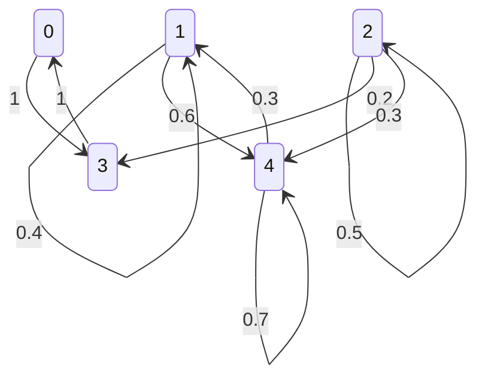

<!-- Pagina 1 -->

Stochastic Processes – AY 2020/2021
written test – June 22, 2021 – part A (90 minutes)

E1 Consider two independent Poisson processes $X_1(t)$ e $X_2(t)$, where $X_i(t)$ is the number of arrivals for process $i$ during $[0, t]$. The average number of arrivals per unit time of the two processes is $\lambda_1 = 1$ and $\lambda_2 = 1$, respectively.

(a) Compute $P[X_1(1) = 1|X_1(2) + X_2(2) = 4]$ and $P[X_1(2) + X_2(2) = 4|X_1(1) = 1]$

(b) Compute $P[X_1(1) + X_2(1) = 2|X_1(2) = 0]$ and $P[X_1(1) + X_2(1) = 2|X_1(2) = 1]$

---
Let $\lambda_1=\lambda_2=1$. Use:

- [[wiki/concepts/poisson-process|Poisson Process]]: disjoint increments independent, $X_i(t)-X_i(s)\sim \mathrm{Pois}(t-s)$.
- [[wiki/theorems/superposition-theorem|Superposition Theorem]] / [[wiki/theorems/poisson-sum|Poisson Sum]]: independent Poisson counts add.
- [[wiki/theorems/binomial-conditional-distribution|Binomial Conditional Distribution]]: given total Poisson arrivals, sub-counts are binomial/multinomial by their mean weights.

**(a1)**  
Compute
$$
P[X_1(1)=1\mid X_1(2)+X_2(2)=4].
$$

Split total into independent cells:

$$
X_1(1),\quad X_1(2)-X_1(1),\quad X_2(1),\quad X_2(2)-X_2(1).
$$

Each cell is $\mathrm{Pois}(1)$. Total mean is $4$. Given total count $4$, count in first cell has

$$
X_1(1)\mid X_1(2)+X_2(2)=4\sim \mathrm{Bin}\left(4,\frac14\right).
$$

Thus

$$
P[X_1(1)=1\mid X_1(2)+X_2(2)=4]
=
\binom41\left(\frac14\right)\left(\frac34\right)^3
=
\frac{27}{64}.
$$

**(a2)**  
Compute
$$
P[X_1(2)+X_2(2)=4\mid X_1(1)=1].
$$

Write

$$
X_1(2)+X_2(2)=X_1(1)+[X_1(2)-X_1(1)]+X_2(2).
$$

Given $X_1(1)=1$, need

$$
[X_1(2)-X_1(1)]+X_2(2)=3.
$$

Now

$$
X_1(2)-X_1(1)\sim \mathrm{Pois}(1),\qquad X_2(2)\sim \mathrm{Pois}(2),
$$

independent, so sum is $\mathrm{Pois}(3)$. Therefore

$$
P=\frac{e^{-3}3^3}{3!}
=
\frac{27}{6}e^{-3}
=
\frac92 e^{-3}.
$$

**(b1)**  
Compute
$$
P[X_1(1)+X_2(1)=2\mid X_1(2)=0].
$$

Since $X_1$ is counting process, $X_1(2)=0$ forces $X_1(1)=0$. So event becomes

$$
X_2(1)=2.
$$

$X_2$ independent from $X_1$, so conditioning on $X_1(2)=0$ changes nothing for $X_2(1)$. Hence

$$
P=P[X_2(1)=2]
=
\frac{e^{-1}1^2}{2!}
=
\frac{e^{-1}}{2}.
$$

**(b2)**  
Compute
$$
P[X_1(1)+X_2(1)=2\mid X_1(2)=1].
$$

Given $X_1(2)=1$, by binomial conditional distribution on subinterval $[0,1]\subset[0,2]$,

$$
X_1(1)\mid X_1(2)=1\sim \mathrm{Bin}\left(1,\frac12\right).
$$

So

$$
P[X_1(1)=0\mid X_1(2)=1]=\frac12,\qquad
P[X_1(1)=1\mid X_1(2)=1]=\frac12.
$$

Need total $2$:

$$
\begin{aligned}
P
&=
P[X_1(1)=0\mid X_1(2)=1]P[X_2(1)=2]\\
&\quad+
P[X_1(1)=1\mid X_1(2)=1]P[X_2(1)=1] \\
&=
\frac12\cdot \frac{e^{-1}}{2}
+
\frac12\cdot e^{-1}\\
&=
\frac{3}{4}e^{-1}.
\end{aligned}
$$

Final answers:

$$
\boxed{\frac{27}{64}},\qquad
\boxed{\frac92 e^{-3}},\qquad
\boxed{\frac12 e^{-1}},\qquad
\boxed{\frac34 e^{-1}}.
$$

---

E2 Consider a two-state Markov channel, where the steady-state probability that the channel is in the bad state is 0.02 and the average number of consecutive good slots is 100. The packet error probability is 1 for a bad slot and 0 for a good slot, respectively. The round-trip time is $m = 2$ slots, i.e., a packet that is erroneous in slot $t$ is retransmitted in slot $t + 2$ (if a retransmission protocol is used).

(a) Compute the throughput that could be obtained if packets were directly transmitted over the channel without using any protocol

(b) compute the throughput of a Go-Back-N protocol that transmits packets over the Markov channel described above, in the presence of an error-free feedback channel

(c) compute the throughput of a Go-Back-N protocol that transmits packets over the Markov channel described above, with a feedback channel subject to iid errors with probability $\delta = 0.1$.

E3 Consider a Markov chain with the following transition matrix (states are numbered from 0 to 4):

$$P = \begin{pmatrix}
0 & 0 & 0 & 1 & 0 \\
0 & 0.4 & 0 & 0 & 0.6 \\
0 & 0 & 0.5 & 0.2 & 0.3 \\
1 & 0 & 0 & 0 & 0 \\
0 & 0.3 & 0 & 0 & 0.7
\end{pmatrix}$$

(a) Draw the transition diagram, identify the classes, classify the states, and compute the probabilities of absorption in all recurrent classes starting from each transient state

(b) compute $\lim_{n \to \infty} P^n$ and $\lim_{n \to \infty} \frac{1}{n} \sum_{k=0}^{n-1} P^k$

(c) compute the average recurrence time for all states, and the average first passage time from any state to state 4.

---

Riferimenti wiki utili: [[wiki/concepts/communicating-classes]], [[wiki/concepts/recurrent-class]], [[wiki/theorems/transient-to-recurrent-limit]], [[wiki/theorems/mean-first-passage-time]].

## (a) Diagramma, classi, assorbimento

Classi comunicanti:

- $\{0,3\}$: chiusa, ricorrente positiva, periodica con periodo $2$.
- $\{1,4\}$: chiusa, ricorrente positiva, aperiodica.
- $\{2\}$: non chiusa, transitoria. Da $2$ si può uscire verso $3$ o $4$, ma non si può più tornare a $2$.

Probabilità di assorbimento partendo dallo stato transitorio $2$:

Sia $a_2$ la probabilità di assorbimento nella classe $A=\{0,3\}$. Allora

$$
a_2 = 0.5a_2 + 0.2.
$$

Quindi

$$
0.5a_2=0.2
\quad\Longrightarrow\quad
a_2=0.4=\frac25.
$$

La probabilità di assorbimento nella classe $C=\{1,4\}$ è

$$
1-a_2=\frac35.
$$

Tabella completa:

| Stato iniziale | Assorbimento in $\{0,3\}$ | Assorbimento in $\{1,4\}$ |
|---|---:|---:|
| $0$ | $1$ | $0$ |
| $1$ | $0$ | $1$ |
| $2$ | $\frac25$ | $\frac35$ |
| $3$ | $1$ | $0$ |
| $4$ | $0$ | $1$ |

## (b) Limiti di $P^n$ e media di Cesaro

La classe $\{0,3\}$ è periodica: $0\to3\to0\to3\cdots$. Quindi il limite ordinario

$$
\lim_{n\to\infty} P^n
$$

**non esiste**.

Esistono però i limiti lungo $n$ pari e $n$ dispari. Con ordine degli stati $(0,1,2,3,4)$:

$$
\lim_{m\to\infty}P^{2m}
=
\begin{pmatrix}
1&0&0&0&0\\
0&\frac13&0&0&\frac23\\
\frac{4}{15}&\frac15&0&\frac{2}{15}&\frac25\\
0&0&0&1&0\\
0&\frac13&0&0&\frac23
\end{pmatrix}.
$$

$$
\lim_{m\to\infty}P^{2m+1}
=
\begin{pmatrix}
0&0&0&1&0\\
0&\frac13&0&0&\frac23\\
\frac{2}{15}&\frac15&0&\frac{4}{15}&\frac25\\
1&0&0&0&0\\
0&\frac13&0&0&\frac23
\end{pmatrix}.
$$

Per la media di Cesaro, invece, la periodicità viene “mediata”. Le distribuzioni stazionarie interne sono:

$$
\pi_{\{0,3\}}=\left(\frac12,\frac12\right),
\qquad
\pi_{\{1,4\}}=\left(\frac13,\frac23\right).
$$

Quindi

$$
\lim_{n\to\infty}\frac1n\sum_{k=0}^{n-1}P^k
=
\begin{pmatrix}
\frac12&0&0&\frac12&0\\
0&\frac13&0&0&\frac23\\
\frac15&\frac15&0&\frac15&\frac25\\
\frac12&0&0&\frac12&0\\
0&\frac13&0&0&\frac23
\end{pmatrix}.
$$

La riga dello stato $2$ viene pesata così:

$$
\frac25\left(\frac12,0,0,\frac12,0\right)
+
\frac35\left(0,\frac13,0,0,\frac23\right)
=
\left(\frac15,\frac15,0,\frac15,\frac25\right).
$$

## (c) Tempi medi di ritorno e primo passaggio verso $4$

Per stati ricorrenti finiti:

$$
m_i=\frac1{\pi_i}.
$$

Nella classe $\{0,3\}$:

$$
\pi_0=\pi_3=\frac12
\quad\Longrightarrow\quad
m_0=m_3=2.
$$

Nella classe $\{1,4\}$:

$$
\pi_1=\frac13,\qquad \pi_4=\frac23,
$$

quindi

$$
m_1=3,
\qquad
m_4=\frac32.
$$

Lo stato $2$ è transitorio, quindi

$$
m_2=\infty.
$$

Tempi medi di primo passaggio a $4$, con

$$
T_4=\inf\{n\ge 0:X_n=4\}.
$$

- Da $4$: $E_4[T_4]=0$.
- Da $1$:

$$
h_1=1+0.4h_1+0.6h_4
=1+0.4h_1.
$$

Quindi

$$
0.6h_1=1
\quad\Longrightarrow\quad
h_1=\frac53.
$$

- Da $0$ e $3$: impossibile raggiungere $4$, perché $\{0,3\}$ è chiusa. Quindi $h_0=h_3=\infty$.
- Da $2$: con probabilità $\frac25$ si entra in $\{0,3\}$ e allora $4$ non viene mai raggiunto. Quindi anche

$$
h_2=\infty.
$$

Riassunto:

| Stato iniziale $i$ | $E_i[T_4]$ |
|---|---:|
| $0$ | $\infty$ |
| $1$ | $\frac53$ |
| $2$ | $\infty$ |
| $3$ | $\infty$ |
| $4$ | $0$ |

Se il docente intende “da $4$ a $4$” come **primo ritorno positivo**, allora il valore è invece

$$
E_4[T_4^+]=m_4=\frac32.
$$

---

E4 Consider a node that contains two identical and independent servers, each able to stream data at 1 Gbps. Each server is subject to attacks according to a Poisson process with rate $\lambda = 10$ attacks/hour, and each attack is effective with probability 1/9, whereas it has no consequences with probability 8/9 (Hint: only consider the process of effective attacks). As a result of each effective attack, the server will remain inoperational (i.e., with zero streaming rate) for an exponential time with average $T = 6$ minutes, during which any arriving attack will have no effect, and then will resume normal operations.

(a) Compute the fraction of time during which the node does not stream any data (i.e., both servers are inoperational), and the average duration of a period of time during which no data is streamed

(b) by considering an appropriate renewal cycle, compute the average duration of the time interval during which the node is able to stream data without interruptions (i.e., there is always at least one server working)

(c) compute the average total streaming rate of the node in Gbps.

---

<!-- Pagina 2 -->

Stochastic Processes – AY 2020/2021
written test – June 22, 2021 – part B (60 minutes)

T1 Prove that if states $i$ and $j$ of a Markov chain communicate and $i$ is recurrent, then $j$ is also recurrent.

T2 For a Poisson process $X(t)$ of rate $\lambda$, state and derive the expression of $P[X(u) = k|X(t) = n]$ for the two cases (i) $0 < u < t$, $0 \leq k \leq n$ and (ii) $0 < t < u$, $0 \leq n \leq k$.

T3 For a renewal process, state precisely (also providing a formal proof) what is the value of

$$\lim_{t \to \infty} \frac{N(t)}{t}$$