# jQuery and Canvas - Web Applications 2023/2024

_Source: `16-webapp-2023-24-jquery-canvas.pdf`_

Web Applications, Master Degree in Computer Engineering, Master Degree in Cybersecurity, Master Degree in ICT for Internet and Multimedia. Academic Year 2023/2024. Nicola Ferro, Intelligent Interactive Information Access (IIIA) Hub.


## Introduction to jQuery


### What jQuery Is

jQuery is a fast, small, and feature-rich JavaScript library: `http://jquery.com/`.

jQuery offers a simple way to achieve a variety of common JavaScript tasks quickly and consistently across all major browsers, without fallback code.

It allows developers to:

- Select elements in a simpler and more powerful way with CSS-style selectors.
- Manipulate the DOM tree.
- Attach event listeners without fallback code.

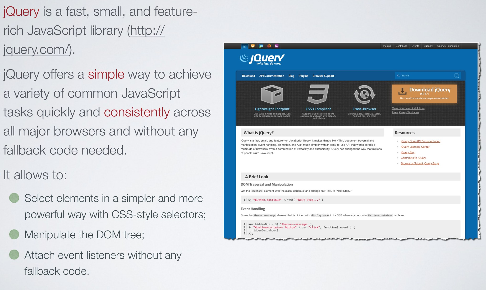

### Why jQuery?

jQuery is a lightweight, "write less, do more" JavaScript library. Its aim is to make JavaScript easier to use on a website.

It allows developers to perform many tasks that would otherwise require many lines of JavaScript code in single lines of code.

There are many other JavaScript libraries available. jQuery is one of the most popular and extendable.

Some jQuery features are:

- HTML and DOM manipulation.
- CSS manipulation.
- HTML event methods.
- Effects and animations.
- AJAX.
- Utilities.

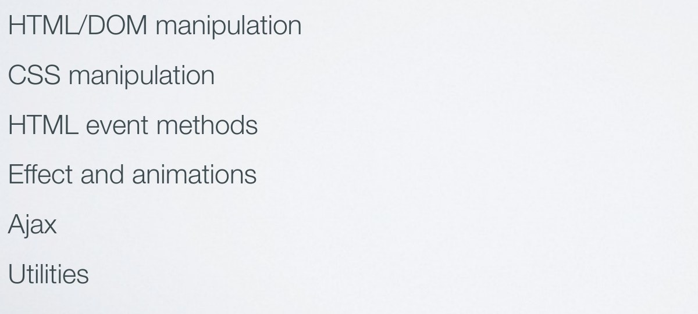

## jQuery Basics

The jQuery library defines a single global function named `jQuery()`, with `$` as a shortcut for it.

```javascript
var divs = $("div");
```

The value returned by this function represents a set of zero or more DOM elements and is known as a **jQuery object**.

jQuery objects define many methods for operating on the sets of elements they represent.

```javascript
$("p.details").css("background-color", "yellow").show("fast");
```

### jQuery Objects

jQuery objects are array-like and have the following properties:

- `length`: the number of matched elements.
- `selector`: the selector string, if any, used when the jQuery object was created.
- `context`: the context object passed as the second argument to `$()`, or the `Document` object otherwise.
- `jquery`: a property whose existence is a simple way to distinguish jQuery objects from other array-like objects.

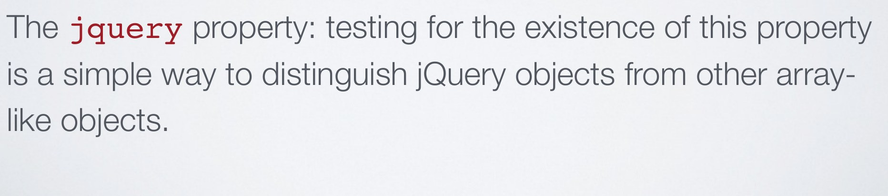

### Queries and Query Results

When you pass a CSS selector string to `$()`, it returns a jQuery object that represents the set of matched elements.

jQuery objects are array-like: they have a `length` property and their contents can be accessed with standard square-bracket array notation.

```javascript
$("body").length;
$("body")[0];
```

If you prefer not to use array notation with jQuery objects:

- Use `size()` instead of the `length` property.
- Use `get()` instead of indexing with square brackets.
- Use `toArray()` to convert a jQuery object to a true array.

### Creating DOM Elements

If a string is passed as the parameter to `$()`, jQuery examines it:

- If it does not look like HTML, the string is interpreted as a selector expression.
- If it looks like an HTML snippet, for example if it starts with `<tag ...>`, jQuery attempts to create new DOM elements and returns them wrapped in a jQuery object.

```javascript
var img = $("", {
  src: url,
  css: { borderWidth: 5 },
  click: handleClick
});
```

### `each()` Method

If you want to loop over all elements in a jQuery object, you can call `each()` instead of writing a `for` loop.

The `each()` method is similar to the array `forEach()` method:

- It expects a callback function as its only argument.
- It invokes that callback once for each element in the jQuery object.

Despite its power, `each()` is not very commonly used because jQuery methods usually iterate implicitly over the set of matched elements and operate on them all.

## jQuery Getters and Setters

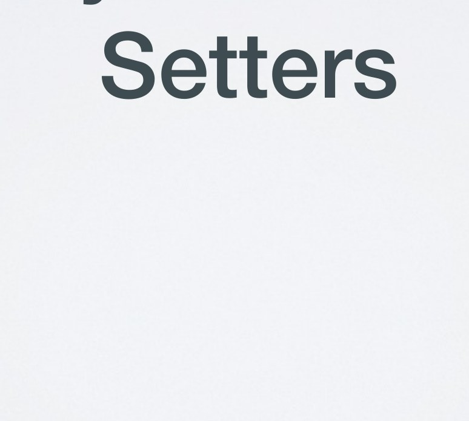

jQuery objects allow you to get or set:

- HTML attribute values.
- CSS style values.
- Element content.

jQuery uses the same method as both getter and setter:

- If you pass a new value to the method, it sets that value.
- If you do not specify a value, it returns the current value.

When used as **setters**, these methods:

- Set values on every element in the jQuery object.
- Return the jQuery object, allowing method chaining.
- Often accept object arguments, where each property specifies a name and value to set.
- Often accept functions as values, where the function is invoked to compute the value to set.

When used as **getters**, these methods:

- Query only the first element of the matched set.
- Return a single value.
- Can only appear at the end of a method chain.

### Getting and Setting HTML Attributes

The `attr()` method acts as both getter and setter.

```javascript
// attr() as setter
$("a").attr("href", "allMyHrefsAreTheSameNow.html");

$("a").attr({
  title: "all titles are the same too!",
  href: "somethingNew.html"
});

// attr() as getter
$("a").attr("href");
```

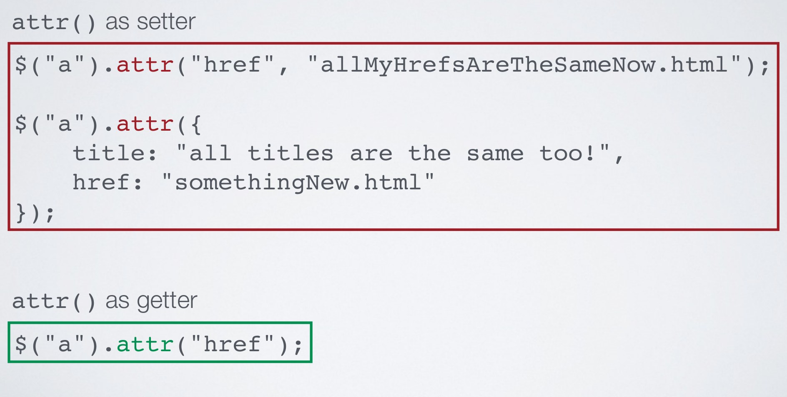

### Getting and Setting CSS Attributes

The `css()` method is similar to `attr()`, but it works with CSS styles.

When querying style values, `css()` returns the current, computed style of the element. The returned value may come from the `style` attribute or from a stylesheet.

```javascript
// Setting CSS properties
$("h1").css("fontSize", "100px");

$("h1").css({
  fontSize: "100px",
  color: "red"
});

// Getting CSS properties
$("h1").css("fontSize");
$("h1").css("font-size");
```

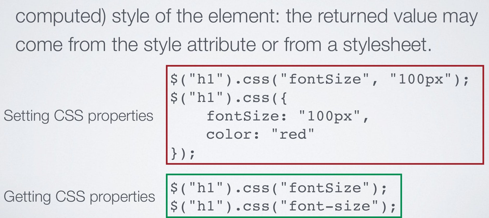

### Getting and Setting CSS Classes

jQuery defines methods for class manipulation:

- `addClass()`: adds classes to the selected elements.
- `removeClass()`: removes classes from the selected elements.
- `toggleClass()`: adds classes to elements that do not already have them and removes classes from those that do.
- `hasClass()`: tests whether a specified class is present.

```javascript
var h1 = $("h1");

h1.addClass("big");
h1.removeClass("big");
h1.toggleClass("big");

if (h1.hasClass("big")) {
  // ...
}
```

### Getting and Setting HTML Form Values

The `val()` method sets and queries:

- The `value` attribute of HTML form elements.
- The selection state of checkboxes, radio buttons, and `<select>` elements.

```javascript
// Setting the input value
$("input[type=text].tags").val(function(index, value) {
  return value.trim();
});

// Getting input values
var singleValues = $("#single").val();
var multipleValues = $("#multiple").val();
```

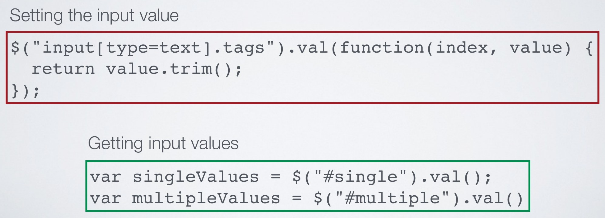

### Getting and Setting Element Content

The `text()` and `html()` methods query and set plain-text or HTML content.

- `text()` with no arguments returns the plain-text content of all descendant text nodes of all matched elements.
- `html()` with no arguments returns the HTML content of only the first matched element.
- Passing a string to `text()` or `html()` replaces all existing content with that plain-text or HTML-formatted text.

## Altering the DOM

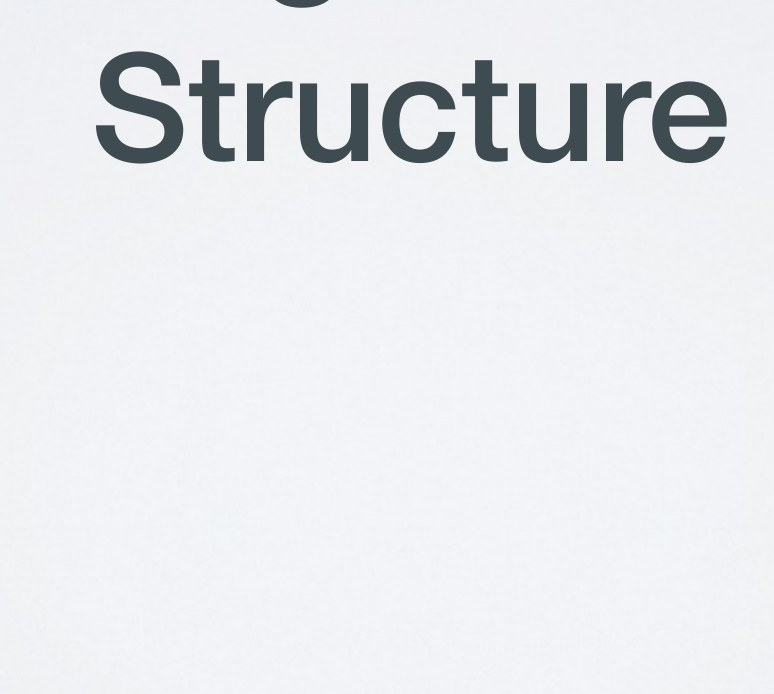

### Inserting and Replacing Elements

The insertion and replacement methods take an argument that specifies the content to insert.

That content can be:

- A string of plain text.
- A string of HTML.
- A jQuery object.
- An `Element` node.
- A text node.

The insertion is made into, before, after, or in place of each selected element, depending on the method.

If the inserted content is an element already present in the document, it is moved from its current location. If it must be inserted more than once, jQuery clones it as necessary.

These methods all return the jQuery object on which they are called.

| Operation | `$(target).method(content)` | `$(content).method(target)` |
|---|---|---|
| Insert content at end of target | `append()` | `appendTo()` |
| Insert content at start of target | `prepend()` | `prependTo()` |
| Insert content after target | `after()` | `insertAfter()` |
| Insert content before target | `before()` | `insertBefore()` |
| Replace target with content | `replaceWith()` | `replaceAll()` |

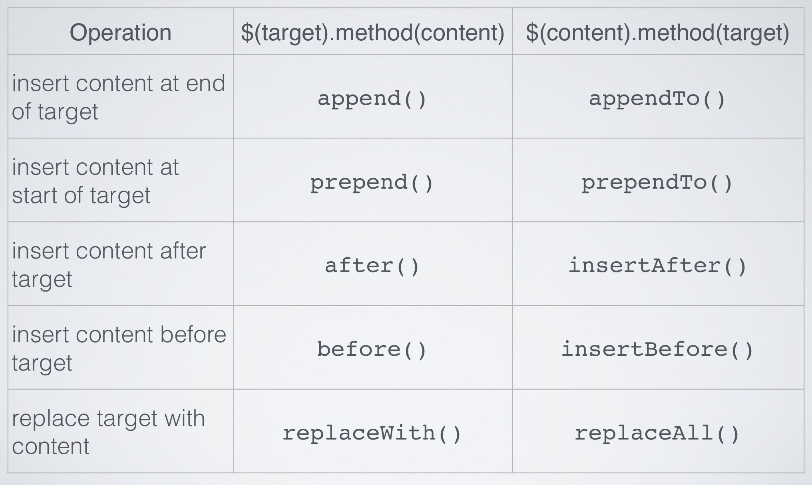

Examples:

```javascript
$("#log").append("<br/>" + message);
$("p").prepend("<b>Hello </b>");
$("h1").before("<hr/>");
$("h1").after("<hr/>");
$("hr").replaceWith("<br/>");

$("<br/>" + message).appendTo("#log");
$(document.createTextNode("<b>Hello </b>")).prependTo("p");
$("<hr/>").insertBefore("h1");
$("<hr/>").insertAfter("h1");
$("<br/>").replaceAll("hr");
```

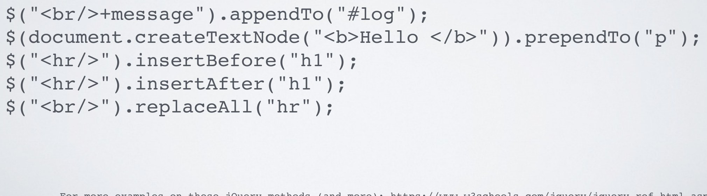

### Copying Elements

If you insert elements that are already part of the document, they are moved, not copied, to their new location.

If you insert elements in more than one place, jQuery makes copies as needed.

To explicitly copy elements to a new location, first use `clone()`.

`clone()` makes and returns a copy, as a jQuery object, of each selected element and all descendants of those elements.

```html
<div class="container">
  <div class="hello">Hello</div>
  <div class="goodbye">Goodbye</div>
</div>
```

```javascript
$(".hello").clone().appendTo(".goodbye");
```

Result:

```html
<div class="container">
  <div class="hello">Hello</div>
  <div class="goodbye">
    Goodbye
    <div class="hello">Hello</div>
  </div>
</div>
```

### Wrapping Elements

jQuery defines three wrapping functions:

- `wrap()`: wraps each selected element.
- `wrapInner()`: wraps the contents of each selected element.
- `wrapAll()`: wraps the selected elements as a group.

These methods are usually passed either a newly created wrapper element or an HTML string used to create a wrapper.

```javascript
$("h1").wrap(document.createElement("i"));
$(".inner").wrapInner("<div class='new'></div>");
$(".inner").wrapAll("<div class='new'></div>");
```

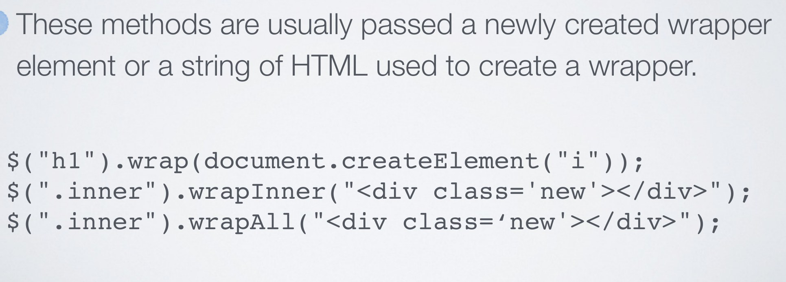

### Deleting Elements

jQuery defines several methods for deleting elements:

- `empty()` removes all children of each selected element.
- `remove()` removes the selected elements, together with their event handlers and data, from the document. If passed an argument, the argument is treated as a selector and only elements in the jQuery object that also match the selector are removed.
- `detach()` works like `remove()`, but does not remove event handlers and data. It is useful when elements are temporarily removed for later reinsertion.
- `unwrap()` performs removal opposite to `wrap()` or `wrapAll()`: it removes the parent element of each selected element without affecting selected elements or their siblings. For each selected element, it replaces the parent with its children.

## Handling Events with jQuery


### Simple Event Handler Registration

jQuery defines simple event-registration methods for commonly used and universally implemented browser events.

To register an event handler for `click` events, call `click()`. In the example, only the paragraph being clicked changes to gray:

```javascript
$("p").click(function() {
  $(this).css("background-color", "gray");
});
```

Calling a jQuery event-registration method registers the handler on all selected elements. This is typically easier than one-at-a-time registration with `addEventListener()`.

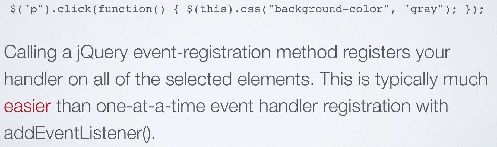

### Event Handler Registration Methods

Common jQuery event-registration methods include:

| Method | Method | Method | Method |
|---|---|---|---|
| `blur()` | `mousedown()` | `change()` | `mouseenter()` |
| `click()` | `mouseleave()` | `dblclick()` | `mousemove()` |
| `focus()` | `mouseout()` | `focusin()` | `mouseover()` |
| `focusout()` | `mouseup()` | `error()` | `resize()` |
| `keydown()` | `scroll()` | `keypress()` | `select()` |
| `keyup()` | `submit()` | `load()` | `unload()` |

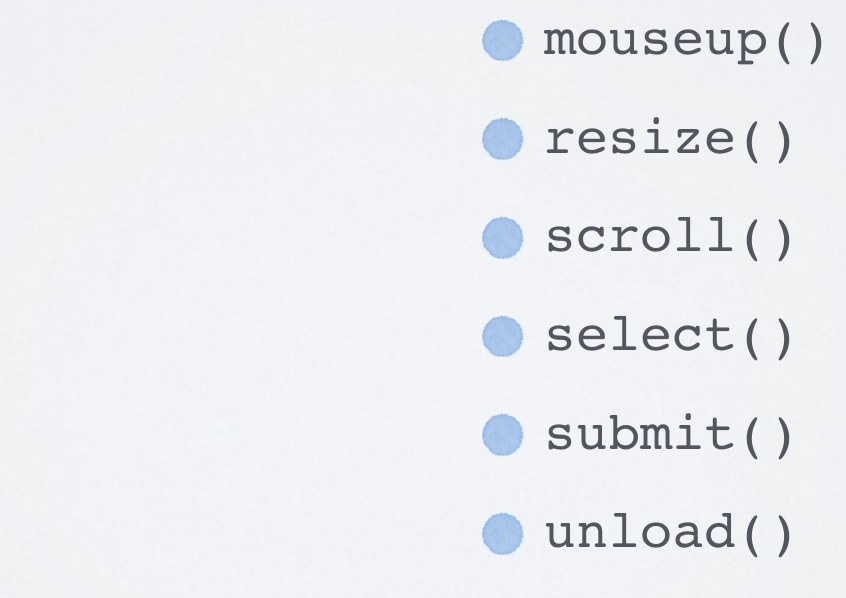

### `bind()` and Multiple Event Types

The `bind()` method binds a handler for a named event type to each element in the jQuery object. Using `bind()` allows more advanced event registration features.

`bind()` expects:

1. An event type string.
2. An event handler function.

```javascript
$("p").click(f);
$("p").bind("click", f);
```

If the first argument is a space-separated list of event types, the handler is registered for each named event type.

```javascript
$("a").hover(f);
$("a").bind("mouseenter mouseleave", f);
```

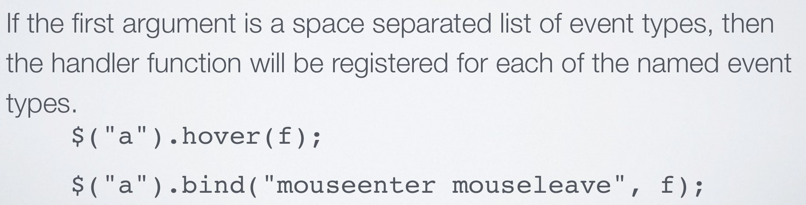

### Deregistering Event Handlers

After registering an event handler with `bind()` or related jQuery event registration methods, you can deregister it with `unbind()`.

`unbind()` deregisters only handlers registered with `bind()` and related jQuery methods. It does not deregister handlers registered with `addEventListener()`.

With no arguments, `unbind()` deregisters all event handlers, for each event on each element:

```javascript
$("*").unbind();
```

With string arguments, all handlers for the named event types are unbound from all elements in the jQuery object:

```javascript
$("a").unbind("mouseover mouseout");
```

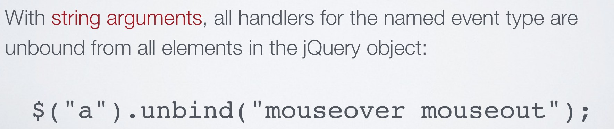

## AJAX with jQuery


### AJAX and jQuery

jQuery provides several methods for AJAX functionality. With these methods, it is possible to request text, HTML, XML, or JSON from remote servers using both HTTP `GET` and `POST`.

Writing regular AJAX code can be tricky because different browsers have different syntax for AJAX implementation. Extra browser-detection code may be necessary. jQuery takes care of this.

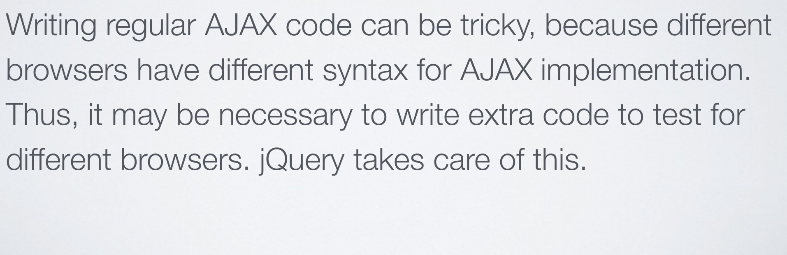

### `$.ajax()`

The `jQuery.ajax()` function performs asynchronous HTTP requests. It underlies all AJAX requests sent by jQuery.

It is often unnecessary to call this function directly because several higher-level alternatives are available.

`ajax()` accepts a single argument: an options object whose properties specify how the AJAX request is to be performed.

By default, data passed to the `data` option as an object is processed and transformed into a query string, fitting the default content type `application/x-www-form-urlencoded`.

```javascript
$.ajax({
  method: "POST",
  url: "some.jsp",
  data: { name: "John", location: "Boston" }
})
  .done(function(msg) {
    alert("Data Saved: " + msg);
  });
```

### `jQuery.get()`

`jQuery.get()` loads data from the server using an HTTP `GET` request.

`GET` is basically used for getting data from a server. It may also return cached data.

```javascript
$.get(URL, callback);
```

- The required `URL` parameter specifies the URL to request.
- The optional `callback` parameter is the function executed if the request succeeds.
- The callback has two parameters: the content of the requested page and the request status.

```javascript
$.get("test.jsp", { name: "John", time: "2pm" })
  .done(function(data, status) {
    alert("Data Loaded: " + data + "\nStatus: " + status);
  });
```

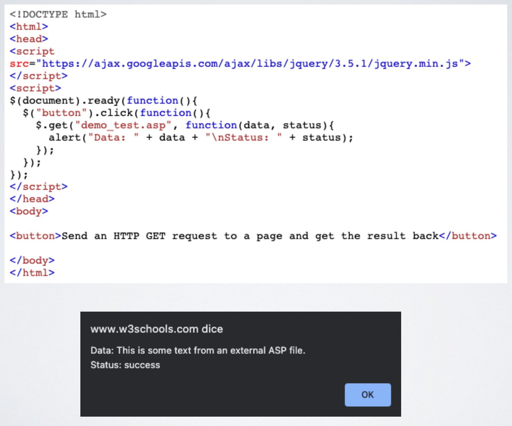

### `jQuery.post()`

`jQuery.post()` loads data from the server using an HTTP `POST` request.

```javascript
$.post(URL, data, callback);
```

- `URL` specifies the URL to request.
- The optional `data` parameter specifies data to send along with the request.
- The optional `callback` parameter is the function executed if the request succeeds.

```javascript
$.post("test.jsp", { name: "John", time: "2pm" })
  .done(function(data) {
    alert("Data Loaded:" + data);
  });
```

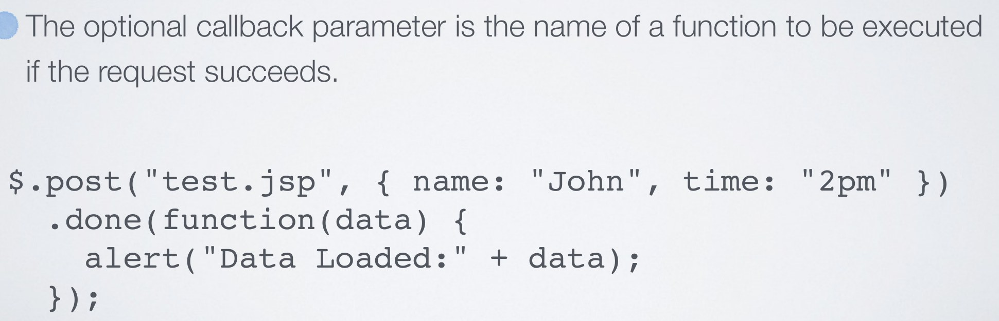

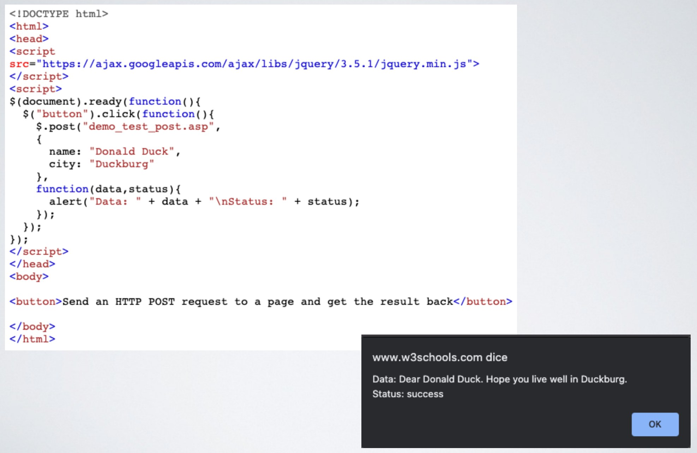

### `jQuery.getScript()`

`jQuery.getScript()` loads a JavaScript file from the server using an HTTP `GET` request and then executes it.

```javascript
$.getScript("ajax/test.js", function(data, textStatus, jqxhr) {
  console.log(data);       // Data returned
  console.log(textStatus); // Success
  console.log(jqxhr.status); // 200
  console.log("Load was performed.");
});
```

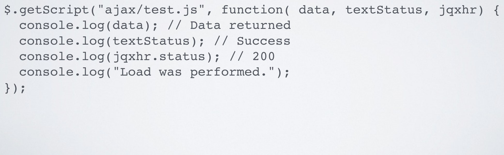

### `jQuery.getJSON()`

`jQuery.getJSON()` loads JSON-encoded data from the server using an HTTP `GET` request.

```javascript
$.getJSON("ajax/test.json", function(data) {
  var items = [];

  $.each(data, function(key, val) {
    items.push("<li id='" + key + "'>" + val + "</li>");
  });

  $("<ul/>", {
    "class": "my-new-list",
    html: items.join("")
  }).appendTo("body");
});
```

### The `load()` Method

`load()` is a simple but powerful AJAX method. It loads data from a server and puts it into a selected element.

Syntax:

```javascript
$(selector).load(URL, data, callback);
```

- `URL` specifies the URL to load.
- The selector specifies the elements where the returned data will be loaded.
- The optional `data` parameter specifies query-string key/value pairs to send with the request.
- The optional `callback` parameter is the function executed after `load()` completes and data is returned.

With a URL as argument, `load()` asynchronously loads the URL content and inserts that content into each selected element, replacing any existing content.

```javascript
$("#result").load("ajax/test.html");
```

The method allows selecting a document fragment to insert:

```javascript
$("#result").load("ajax/test.html #container");
```

`POST` is used if `data` is provided as an object; otherwise, `GET` is assumed.

```javascript
$("#address").load("address.jsp", {
  zipcode: "02134",
  country: "IT"
});
```

An optional callback function is invoked when the AJAX request completes, whether successfully or unsuccessfully.

### Load Text into a `div`

The anonymous function using the jQuery `load()` method is used as the callback of the `click` event on button elements. It loads the content of `demo_test.txt` into the element with id `div1`.

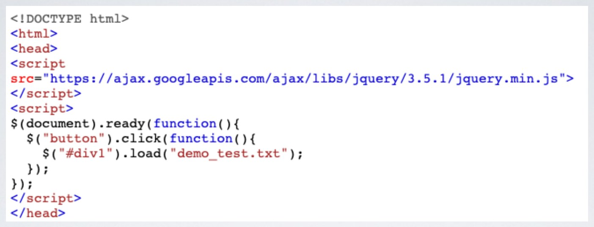

After the click, the content of `div1` is replaced. In this example, HTML is directly injected into the page.

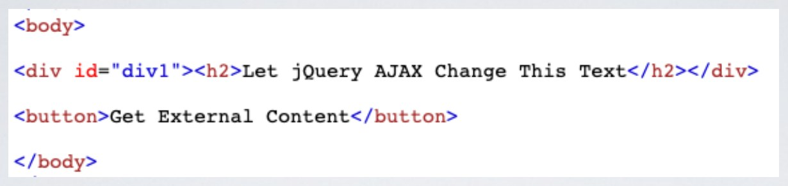

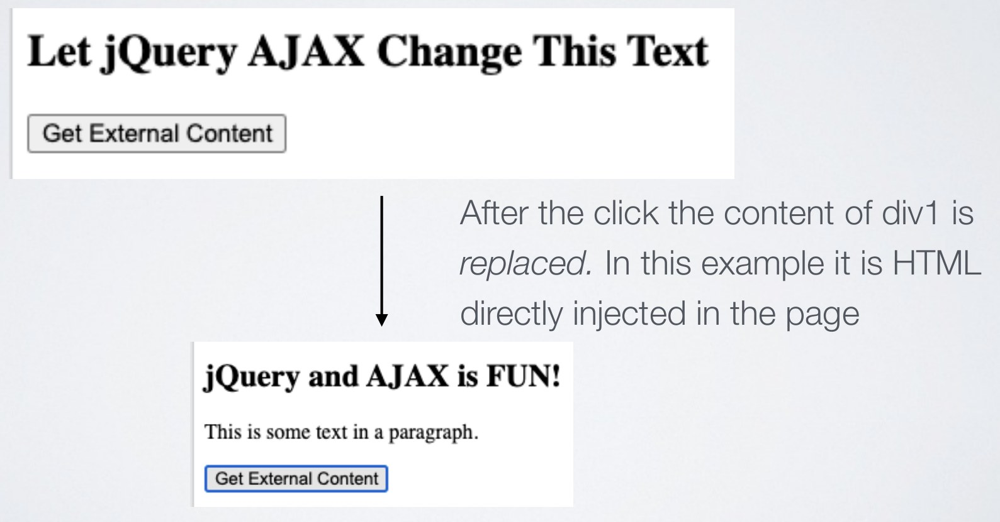

It is possible to add a jQuery selector to the `URL` parameter to specify the part of the document to insert. In this example, only the text contained in the paragraph with id `p1` of `demo_text.txt` is inserted.

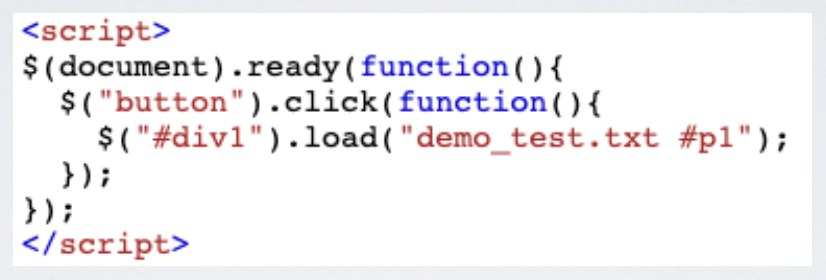

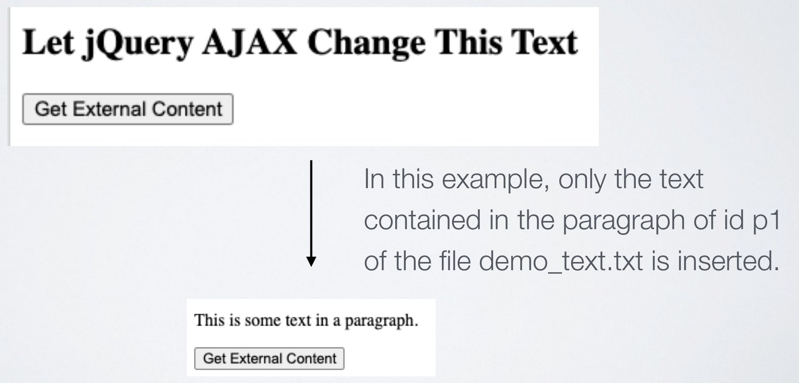

The optional `callback` parameter specifies a callback function to run when the `load()` method is completed.

This function can have different parameters:

- `responseText`: contains the resulting content if the call succeeds.
- `statusTxt`: contains the status of the call.
- `xhr`: contains the `XMLHttpRequest` object.

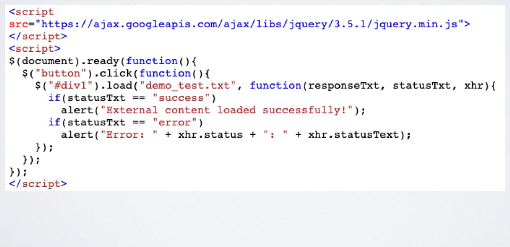

Execution flow:

1. User clicks the button.
2. The callback function is invoked when the data returns.
3. The information is loaded into the page.

These examples were taken from:

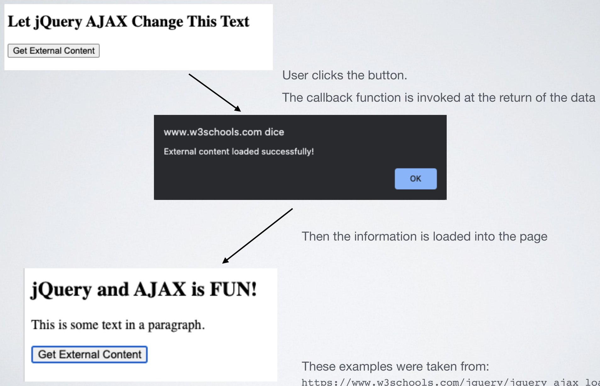

## Canvas


### Introduction to HTML5 Canvas

The HTML5 specification includes the `canvas` element, which provides an easy and powerful way to draw graphics using JavaScript.

It can be used to:

- Draw graphs.
- Make photo compositions.
- Create animations.
- Do real-time video processing or rendering.

For each canvas element, you can use a **context**, similar to a page in a drawing pad, into which JavaScript drawing commands are issued.

Browsers can implement multiple canvas contexts, and the different APIs provide the drawing functionality.

### The Canvas Element

```html
<canvas id="tutorial" width="150" height="150"></canvas>
```

The `<canvas>` element is similar to ``, except that it does not have `src` and `alt` attributes.

The `width` and `height` attributes are optional. If they are not specified, the canvas is initially `300` pixels wide and `150` pixels high.

The element can be sized arbitrarily with CSS, but during rendering the image is scaled to fit its layout size. If the CSS sizing does not respect the ratio of the initial canvas, it appears distorted.

### The Rendering Context

The `<canvas>` element creates a fixed-size drawing surface that exposes one or more rendering contexts, used to create and manipulate the shown content.

The canvas is initially blank. To display something, a script must first access the rendering context and draw on it.

The `<canvas>` element has a `getContext()` method used to obtain the rendering context and its drawing functions.

`getContext()` takes one parameter: the context type. For 2D graphics, specify `"2d"` to get a `CanvasRenderingContext2D`.

### Canvas Setup Example

```html
<!DOCTYPE html>
<html>
  <head>
    <meta charset="utf-8"/>
    <title>Canvas tutorial</title>
    <script type="text/javascript">
      function draw() {
        var canvas = document.getElementById('tutorial');
        if (canvas.getContext) {
          var ctx = canvas.getContext('2d');
        }
      }
    </script>
    <style type="text/css">
      canvas { border: 1px solid black; }
    </style>
  </head>
  <body onload="draw();">
    <canvas id="tutorial" width="150" height="150"></canvas>
  </body>
</html>
```

### The Canvas Grid

Normally, `1` unit in the grid corresponds to `1` pixel on the canvas.

The origin of this grid is positioned in the top-left corner at coordinate `(0, 0)`. All elements are placed relative to this origin. Therefore, the top-left corner of a blue square at coordinate `(x, y)` is `x` pixels from the left and `y` pixels from the top.

The origin can be translated to a different position. The grid can also be rotated and scaled.

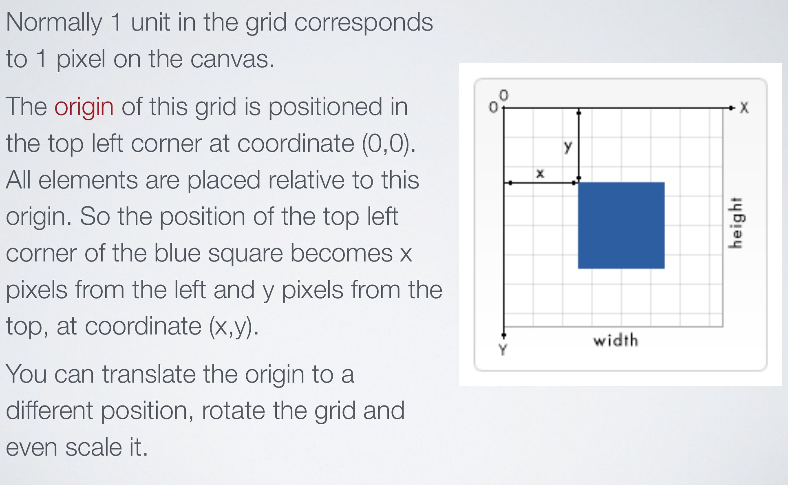

### Drawing Rectangles

`<canvas>` supports only one primitive shape: rectangles. All other shapes must be created by combining one or more paths, which are lists of points connected by lines.

There are three functions that draw rectangles:

- `fillRect(x, y, width, height)`: draws a filled rectangle.
- `strokeRect(x, y, width, height)`: draws a rectangular outline.
- `clearRect(x, y, width, height)`: clears the specified rectangular area, making it fully transparent.

Each function takes the same parameters:

- `x` and `y` specify the position of the top-left corner relative to the origin.
- `width` and `height` provide the rectangle size.

```javascript
ctx.fillRect(25, 25, 100, 100);
ctx.clearRect(45, 45, 60, 60);
ctx.strokeRect(50, 50, 50, 50);
```

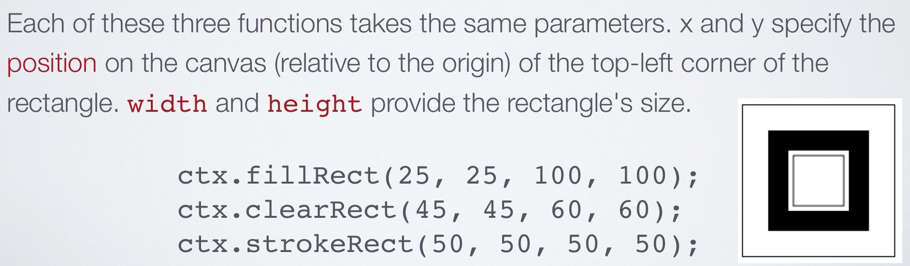

### Drawing Paths

A path is a list of points connected by line segments. Segments may be curved or not, and may have different widths and colors.

A path, or even a subpath, can be closed.

To make shapes using paths:

1. Create the path.
2. Draw into the path.
3. Stroke or fill the path to render it.

Functions used in these steps:

- `beginPath()`: creates a new path. Future drawing commands are directed into the path and build it up.
- `closePath()`: adds a straight line to the path, going to the start of the current subpath.
- `stroke()`: draws the shape by stroking its outline.
- `fill()`: draws a solid shape by filling the path's content area.

### Moving the Pen

The `moveTo()` function does not draw anything, but it is useful for drawing paths.

`moveTo(x, y)` moves the pen to the coordinates specified by `x` and `y`.

It can be used when the canvas is initialized or after `beginPath()` is called to place the starting point or draw unconnected paths.

```javascript
ctx.beginPath();
ctx.moveTo(75, 50);
ctx.lineTo(100, 75);
ctx.lineTo(100, 25);
ctx.fill();
```

### Lines

For drawing straight lines, use `lineTo()`.

`lineTo(x, y)` draws a line from the current drawing position to the position specified by `x` and `y`.

The starting point depends on previously drawn paths: the endpoint of the previous path becomes the starting point for the following one.

The starting point can be changed with `moveTo()`.

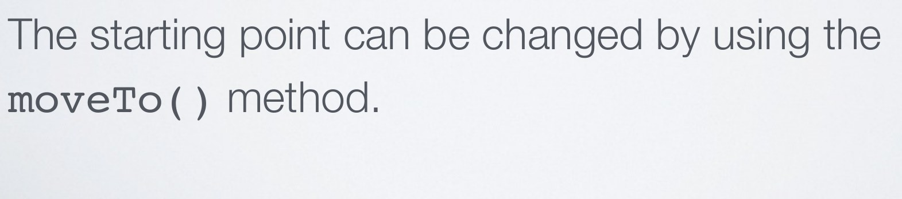

### Arcs

To draw arcs or circles, use `arc()` or `arcTo()`.

```javascript
arc(x, y, radius, startAngle, endAngle, anticlockwise)
```

`arc()` draws an arc:

- Centered at `(x, y)` with radius `r`.
- With start and end points defined by `startAngle` and `endAngle`, in radians.
- With angles measured from the x axis.
- With `anticlockwise` as a Boolean: `true` draws anticlockwise; otherwise, the arc is drawn clockwise, the default.

```javascript
arcTo(x1, y1, x2, y2, radius)
```

`arcTo()` draws an arc with the given control points and radius, connected to the previous point by a straight line.

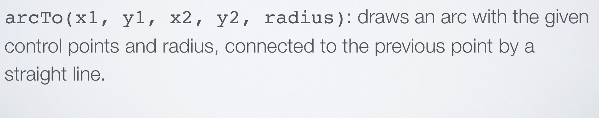

Example:

```javascript
ctx.beginPath();
ctx.arc(75, 75, 50, 0, Math.PI * 2, true);
ctx.moveTo(110, 75);
ctx.arc(75, 75, 35, 0, Math.PI, false);
ctx.moveTo(65, 65);
ctx.arc(60, 65, 5, 0, Math.PI * 2, true);
ctx.moveTo(95, 65);
ctx.arc(90, 65, 5, 0, Math.PI * 2, true);
ctx.stroke();
```

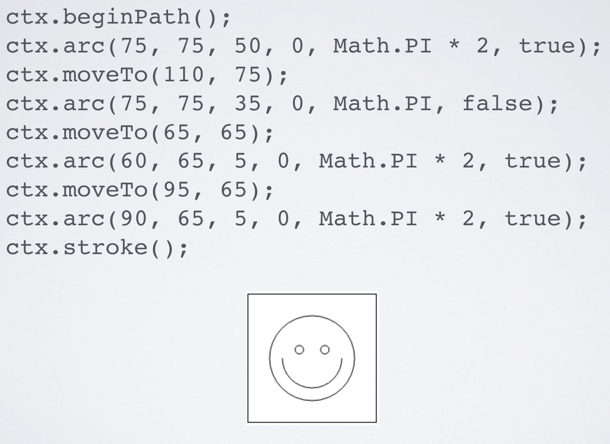

### Using Images

The `<canvas>` element can use images for dynamic photo compositing, graph backdrops, sprites in games, and similar purposes.

External images can be used in any format supported by the browser, such as PNG, GIF, or JPEG.

Importing images into a canvas is a two-step process:

1. Get a reference to an `HTMLImageElement` object or to another canvas element as a source. It is also possible to use images by providing a URL.
2. Draw the image on the canvas with `drawImage()`.

### Drawing an Image

Once you have a reference to a source image object, use `drawImage()` to render it to the canvas.

`drawImage(image, x, y)` draws the `CanvasImageSource` specified by `image` at coordinates `(x, y)`.

```javascript
var img = new Image();

img.onload = function() {
  ctx.drawImage(img, 0, 0);
  ctx.beginPath();
  ctx.moveTo(30, 96);
  ctx.lineTo(70, 66);
  ctx.lineTo(103, 76);
  ctx.lineTo(170, 15);
  ctx.stroke();
};

img.src = 'https://mdn.mozillademos.org/files/5395/backdrop.png';
```

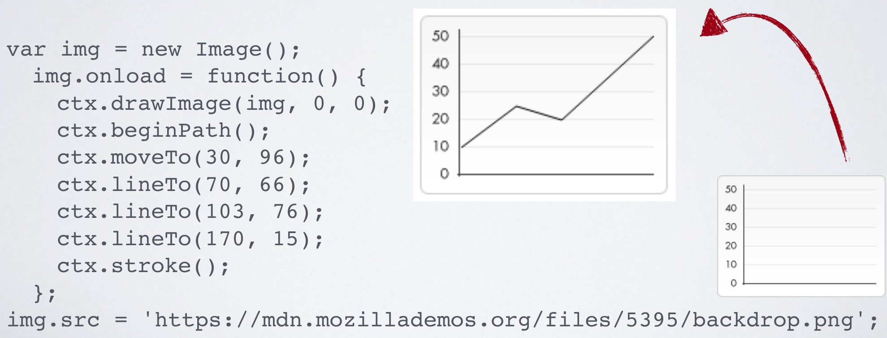

### Saving and Restoring State

`save()` saves the entire canvas state.

`restore()` restores the most recently saved canvas state.

Canvas states are stored on a stack. Each time `save()` is called, the current drawing state is pushed onto the stack.

A drawing state consists of:

- The transformations that have been applied, such as `translate`, `rotate`, and `scale`.
- The current values of some style-related attributes.
- The current clipping path. A clipping path is like a normal canvas shape, but acts as a mask to hide unwanted parts of shapes.

You can call `save()` as many times as needed.

Each time `restore()` is called, the last saved state is popped off the stack and all saved settings are restored.

### Translate

`translate()` is a transformation method used to move the canvas and its origin to a different point in the grid.

`translate(x, y)` moves the canvas and its origin on the grid:

- `x` is the horizontal distance to move.
- `y` is the vertical distance to move.

It is a good idea to save the canvas state before transformations, so you can call `restore()` instead of doing a reverse translation to return to the original state.

### Rotating

`rotate()` is a transformation method used to rotate the canvas around the current origin.

`rotate(angle)` rotates the canvas clockwise around the current origin by `angle` radians.

The rotation center point is always the canvas origin. To change the center point, move the canvas with `translate()`.

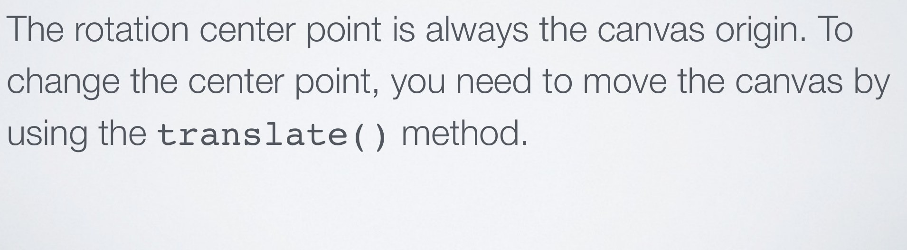

### Basic Animations

To draw a frame:

1. **Clear the canvas**: clear shapes drawn previously. The easiest way is `clearRect()`.
2. **Save the canvas state**: if changing settings such as styles or transformations, save the original state so each frame starts consistently.
3. **Draw animated shapes**: render the actual frame.
4. **Restore the canvas state**: if the state was saved, restore it before drawing a new frame.

### Controlling an Animation

The `window.setInterval()`, `window.setTimeout()`, and `window.requestAnimationFrame()` functions can be used to call a specific function over a set period of time.

- `setInterval(function, delay)`: repeatedly executes `function` every `delay` milliseconds.
- `setTimeout(function, delay)`: executes `function` once after `delay` milliseconds.
- `requestAnimationFrame(callback)`: tells the browser that an animation is needed and requests that the browser call a function to update the animation before the next repaint.

If no user interaction is needed, use `setInterval()`, which repeatedly executes the supplied code.

Keyboard or mouse events can be used to control the animation together with `setTimeout()`.

### Animation Examples

- `https://developer.mozilla.org/en-US/docs/Web/API/Canvas_API/Tutorial/Basic_animations`
- `https://developer.mozilla.org/en-US/docs/Games/Tutorials/2D_Breakout_game_pure_JavaScript`
- `https://www.kongregate.com/games/Infernet89/have-you-missed-the-tutorial-for-life`


