# 17-webapp-2023-24-semantic-Web

_Source: `17-webapp-2023-24-semantic-Web.pdf`_

## Slide 1 - Semantic Web

Semantic Web

Web Applications
Master Degree in Computer Engineering

Master Degree in Cybersecurity
Master Degree in ICT for Internet and Multimedia

Academic Year 2023/2024

Nicola Ferro

Intelligent Interactive Information Access (IIIA) Hub

## Slide 2 - Semantic Web

Semantic Web
and Linked Data

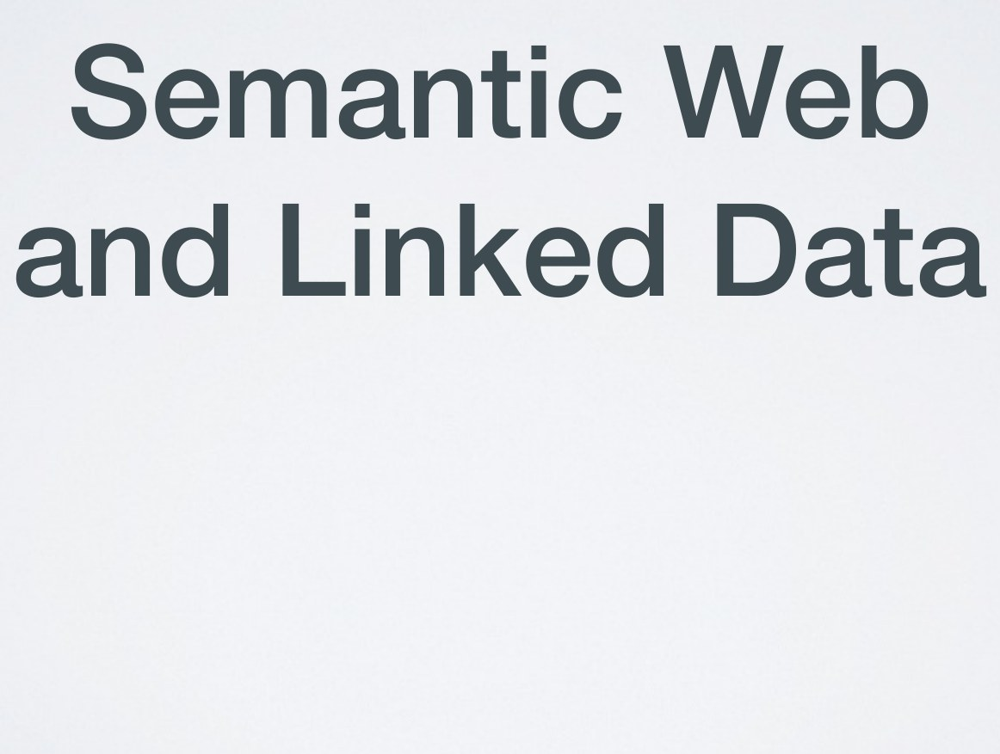

## Slide 3 - Evolution of the Web

Evolution of the Web

Initially, the Web was an hypertext made of resources (HTML documents, images,
...) so that human beings can browse, surf and access them

The current vision of the Web 3.0 encompasses other kinds of resources, namely
the data (genoma and proteins, clinical trials, scientific and statistical data,
Internet-of-Thing streaming data), which need to be connected by means of typed
links so that their structure and semantics is explicit and they can be accessed
by both human beings and machines

Web of

Data
Web of
Documents

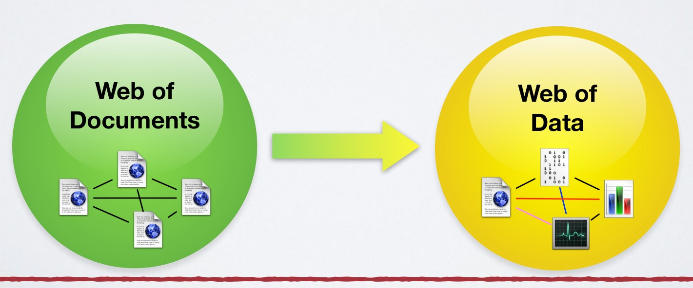

## Slide 4 - Data

Data

123

91

38,5

7

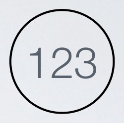

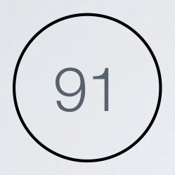

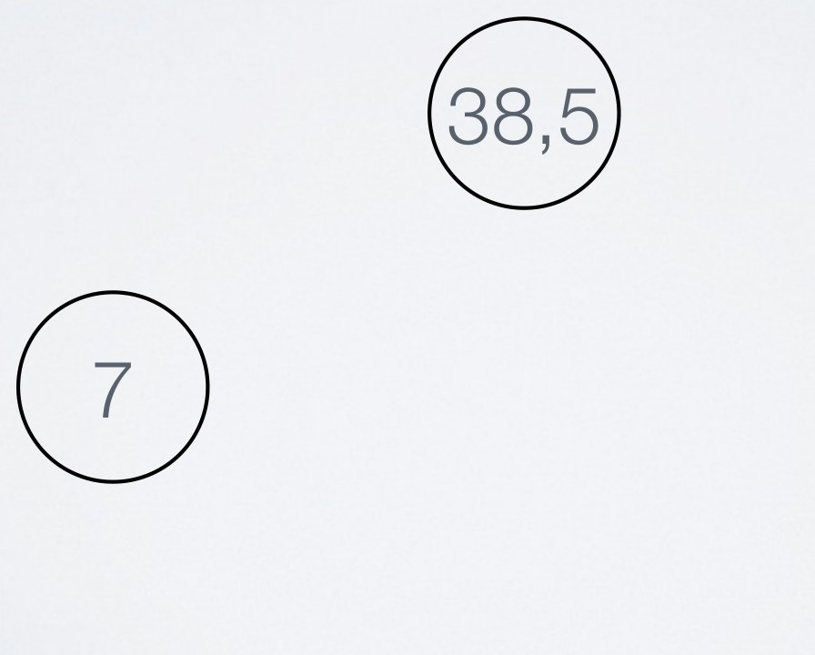

## Slide 5 - Data and Information

Data and Information

Heartbeat

Pressure

123

91

Age

Temperature

7

38,5

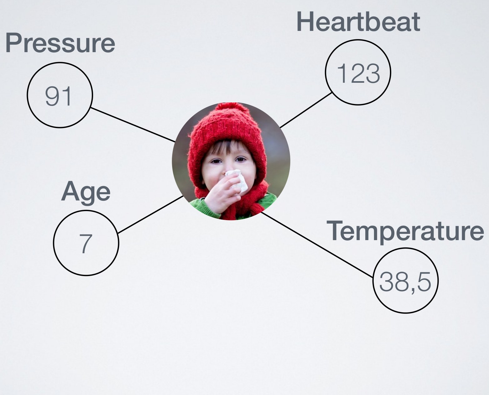

## Slide 6 - Data and Information

Data and Information

Heartbeat

Pressure

123

91

Age

Temperature

7

Schema
(Metadata

38,5

Name
Age
Temperature
Heartbeat
Pressure
Luca
7
38,5
91
123

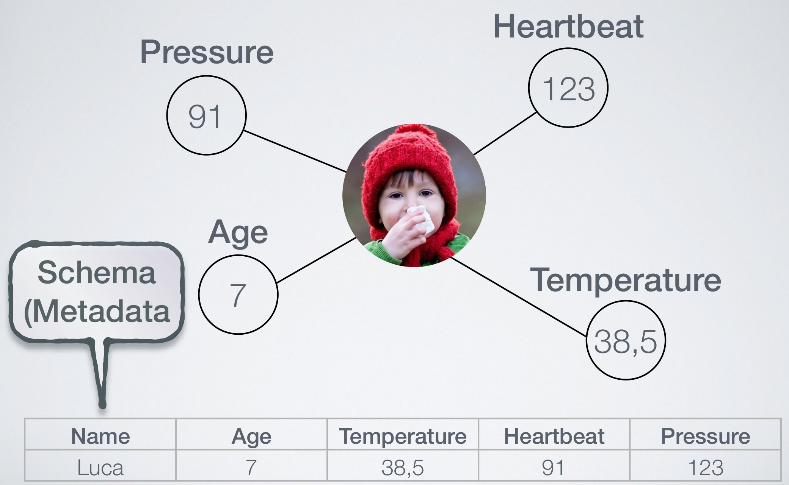

## Slide 7 - How to Make Different Database Interoperate?

How to Make Different Database Interoperate?

## Slide 8 - Semantic Representation of Knowledge

Semantic Representation of Knowledge

Ontology

The concept of dog

(OWL)

Linked Data

My own dog: Linneo

(a specific instance )

(RDF)

fight with

a
a
a

Knowledge
Graph/Base

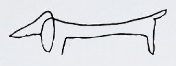

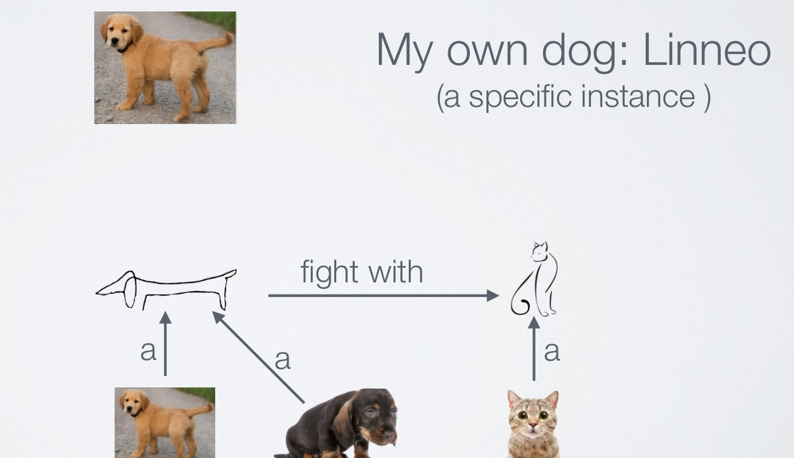

## Slide 9 - Resource Description Framework (RDF)

Resource Description Framework (RDF)

RDF is a framework for representing information in the Web

The core structure of the data model is a set of RDF triples, each consisting of
a subject (URI), a predicate (URI) and an object (URI or literal)

Asserting an RDF triple says that some relationship, indicated by the predicate, holds between
the resources denoted by the subject and object. This statement corresponding to an RDF triple is
known as an RDF statement

A set of such triples is called an RDF graph. An RDF graph can be visualized as a node
and directed-arc diagram, in which each triple is represented as a node-arc-node link

An RDF document is a document that encodes an RDF graph in a concrete RDF
syntax, such as RDF/XML, N-Triples, Turtle, JSON-LD, RDFa, or TriG

Subject
Object
Predicate

W3C (2014). RDF 1.1 Concepts and Abstract Syntax – W3C Recommendation 25 February 2014
https://www.w3.org/TR/rdf11-concepts/

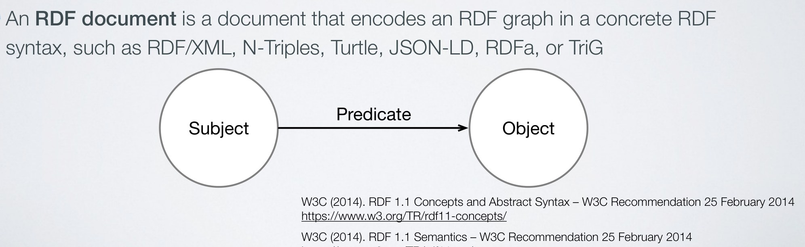

## Slide 10 - Example of RDF

Example of RDF

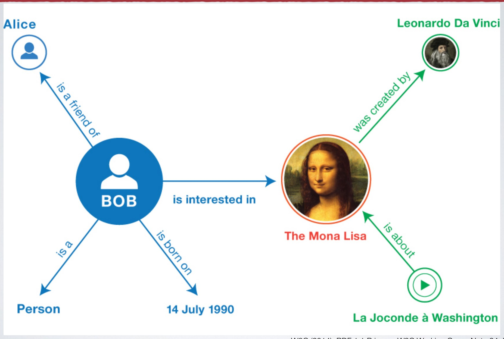

## Slide 11 - Example of RDF

Example of RDF

data type
epressed

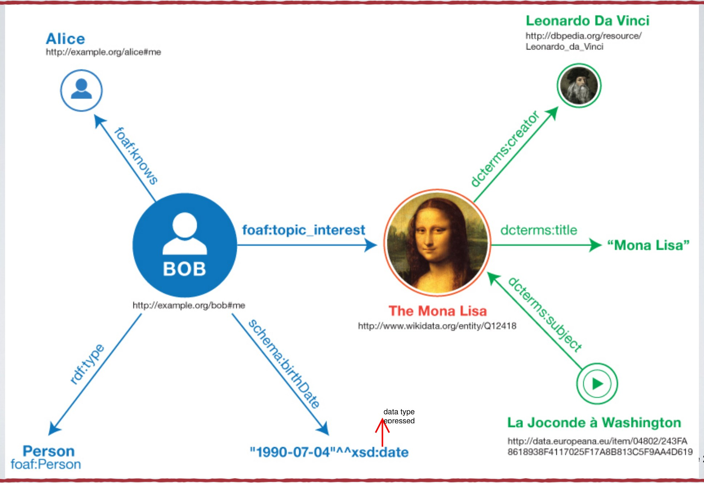

## Slide 12 - Example of RDF

Example of RDF

RDF/XML

<?xml version="1.0" encoding="utf-8"?>
<rdf:RDF
         xmlns:dcterms="http://purl.org/dc/terms/"
         xmlns:foaf="http://xmlns.com/foaf/0.1/"
         xmlns:rdf="http://www.w3.org/1999/02/22-rdf-syntax-ns#"
         xmlns:schema="http://schema.org/">
   <rdf:Description rdf:about="http://example.org/bob#me">
      <rdf:type rdf:resource="http://xmlns.com/foaf/0.1/Person"/>
      <schema:birthDate rdf:datatype="http://www.w3.org/2001/XMLSchema#date">1990-07-04</schema:birthDate>
      <foaf:knows rdf:resource="http://example.org/alice#me"/>
      <foaf:topic_interest rdf:resource="http://www.wikidata.org/entity/Q12418"/>
   </rdf:Description>
   <rdf:Description rdf:about="http://www.wikidata.org/entity/Q12418">
      <dcterms:title>Mona Lisa</dcterms:title>
      <dcterms:creator rdf:resource="http://dbpedia.org/resource/Leonardo_da_Vinci"/>
   </rdf:Description>
   <rdf:Description rdf:about="http://data.europeana.eu/item/04802/243FA8618938F4117025F17A8B813C5F9AA4D619">
      <dcterms:subject rdf:resource="http://www.wikidata.org/entity/Q12418"/>
   </rdf:Description>
</rdf:RDF>

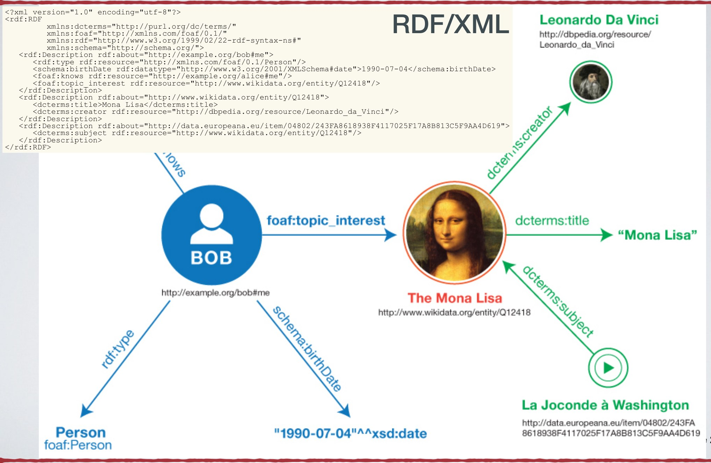

## Slide 13 - Example of RDF

Example of RDF

JSON-LD

{
  "@context": "example-context.json",
  "@id": "http://example.org/bob#me",
  "@type": "Person",
  "birthdate": "1990-07-04",
  "knows": "http://example.org/alice#me",
  "interest": {
    "@id": "http://www.wikidata.org/entity/Q12418",
    "title": "Mona Lisa",
    "subject_of": "http://data.europeana.eu/item/04802/243FA8618938F4117025F17A8B813C5F9AA4D619",
    "creator": "http://dbpedia.org/resource/Leonardo_da_Vinci"
  }
}

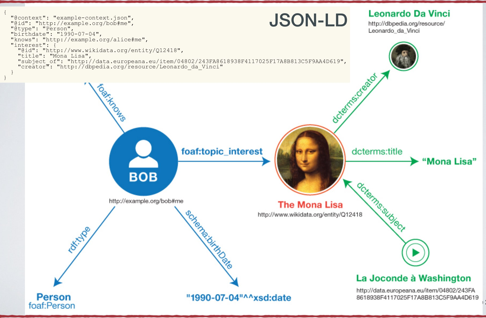

## Slide 14 - Example of RDF

Example of RDF

N-Triples

<http://example.org/bob#me> <http://www.w3.org/1999/02/22-rdf-syntax-ns#type> <http://xmlns.com/foaf/0.1/Person> .
<http://example.org/bob#me> <http://xmlns.com/foaf/0.1/knows> <http://example.org/alice#me> .
<http://example.org/bob#me> <http://schema.org/birthDate> "1990-07-04"^^<http://www.w3.org/2001/XMLSchema#date> .
<http://example.org/bob#me> <http://xmlns.com/foaf/0.1/topic_interest> <http://www.wikidata.org/entity/Q12418> .
<http://www.wikidata.org/entity/Q12418> <http://purl.org/dc/terms/title> "Mona Lisa" .
<http://www.wikidata.org/entity/Q12418> <http://purl.org/dc/terms/creator> <http://dbpedia.org/resource/Leonardo_da_Vinci> .
<http://data.europeana.eu/item/04802/243FA8618938F4117025F17A8B813C5F9AA4D619> <http://purl.org/dc/terms/subject> <http://www.wikidata.org/entity/Q12418> .

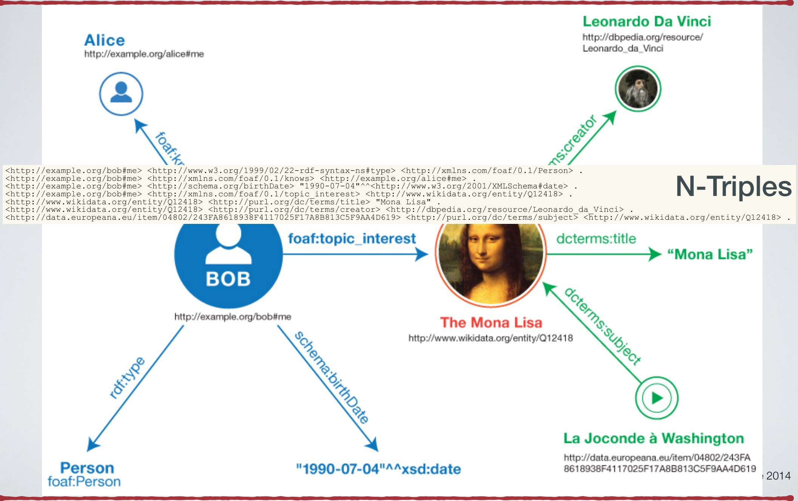

## Slide 15 - Example of RDF

Example of RDF

TURTLE

BASE   <http://example.org/>
PREFIX foaf: <http://xmlns.com/foaf/0.1/>
PREFIX xsd: <http://www.w3.org/2001/XMLSchema#>
PREFIX schema: <http://schema.org/>
PREFIX dcterms: <http://purl.org/dc/terms/>
PREFIX wd: <http://www.wikidata.org/entity/>

GRAPH <http://example.org/bob>
  {
    <bob#me>
        a foaf:Person ;
        foaf:knows <alice#me> ;
        schema:birthDate "1990-07-04"^^xsd:date ;
        foaf:topic_interest wd:Q12418 .
  }

GRAPH <https://www.wikidata.org/wiki/Special:EntityData/Q12418>
  {
    wd:Q12418
        dcterms:title "Mona Lisa" ;
        dcterms:creator <http://dbpedia.org/resource/Leonardo_da_Vinci> .

    <http://data.europeana.eu/item/04802/243FA8618938F4117025F17A8B813C5F9AA4D619>
       dcterms:subject wd:Q12418 .
  }

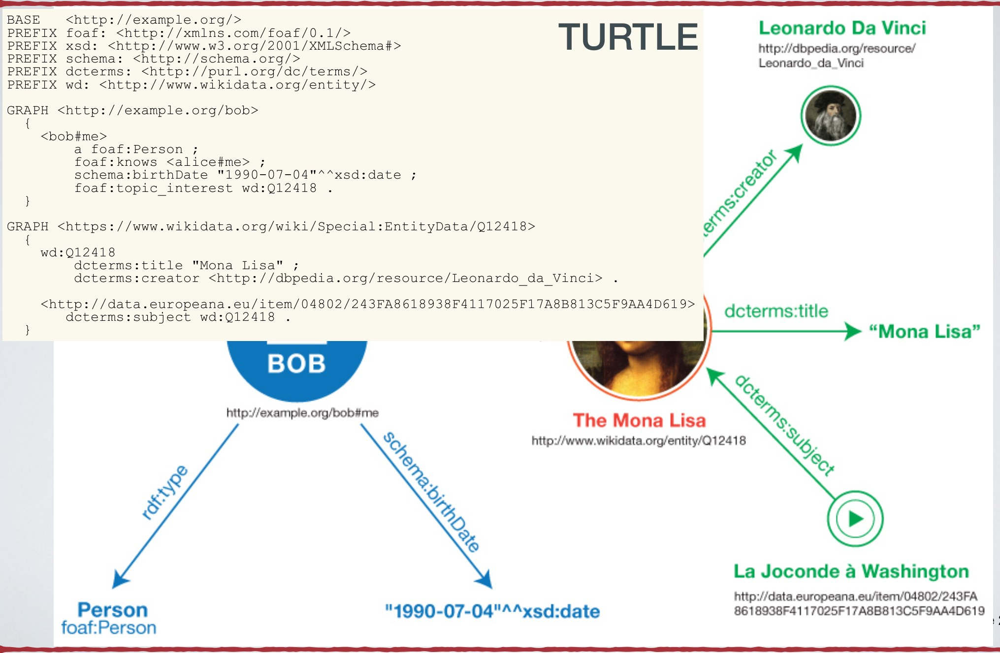

## Slide 16 - Simple Protocol and RDF Query Language (SPARQL)

Simple Protocol and RDF Query Language (SPARQL)

SPARQL is a set of specifications that provide languages
and protocols to query and manipulate RDF graph content
on the Web or in an RDF store

Graph: http://example.org/alice


#prefixfoaf:<http://xmlns.com/foaf/./>.
#prefixrdfs:<http://www.w.org///rdfschema>.

¦<http://example.org/aliceme>afoaf:3erson.
¦<http://example.org/aliceme>foaf:nameAlice.
¦<http://example.org/aliceme>foaf:mbox<mailto:alice#example.org>.
¦<http://example.org/aliceme>foaf:Nnows<http://example.org/bobme>.
¦<http://example.org/bobme>foaf:Nnows<http://example.org/aliceme>.
<http://example.org/bobme>foaf:nameBob.
¦<http://example.org/aliceme>foaf:Nnows<http://example.org/charlieme>.
¦<http://example.org/charlieme>foaf:Nnows<http://example.org/aliceme>.
¦<http://example.org/charlieme>foaf:nameCharlie.
¦<http://example.org/aliceme>foaf:Nnows<http://example.org/snoop\>.
¦<http://example.org/snoop\>foaf:nameSnoop\#en.

<"xmlYersion .">
<sparqlxmlns http://www.w.org//sparqlresXlts>
<head>
<Yariablename name/>
<Yariablename coXnt/>
</head>
<resXlts>
<resXlt>
<bindingname name>
<literal>Alice</literal>
</binding>
<bindingname coXnt>
<literaldatat\pe http://www.w.org//;0/Schemainteger></literal>
</binding>
</resXlt>
<resXlt>
<bindingname name>
<literal>Bob</literal>
</binding>
<bindingname coXnt>
<literaldatat\pe http://www.w.org//;0/Schemainteger></literal>
</binding>
</resXlt>
<resXlt>
<bindingname name>
<literal>Charlie</literal>
</binding>
<bindingname coXnt>
<literaldatat\pe http://www.w.org//;0/Schemainteger></literal>
</binding>
</resXlt>
</resXlts>
</sparql>

3RE)I;foaf:<http://xmlns.com/foaf/./>
SE/ECT¦"name¦
C281T
"friend
¦AS¦"coXnt

WHERE^
¦"personfoaf:name¦"name.
¦"personfoaf:Nnows¦"friend.
`¦*R283¦B<¦"person¦"name

W3C (2013). SPARQL 1.1 Query Language – W3C Recommendation 21 March 2013
https://www.w3.org/TR/sparql11-query/

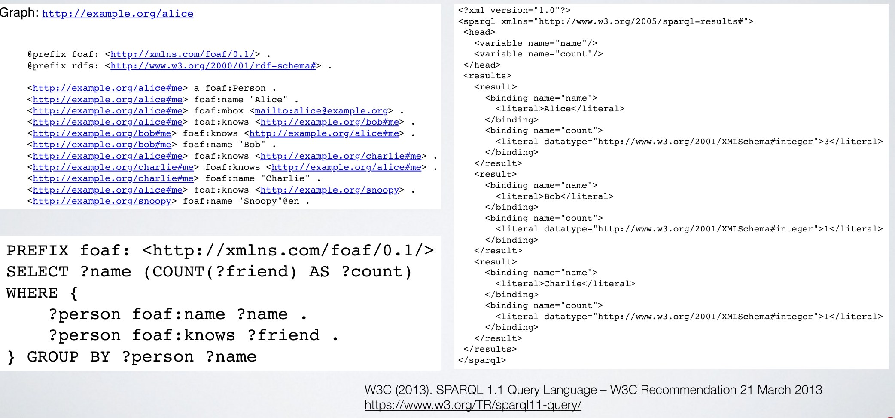

## Slide 17 - Simple Protocol and RDF Query Language (SPARQL)

Simple Protocol and RDF Query Language (SPARQL)

SPARQL is a set of specifications that provide languages
and protocols to query and manipulate RDF graph content
on the Web or in an RDF store

^
head:^
Yars:>namecoXnt@
`
resXlts:^
bindings:>
^
name:^t\pe:literalYalXe:Alice`
coXnt:^datat\pe:http://www.w.org//;0/Schemaintegert\pe:t\pedliteralYalXe:`
`
^
name:^t\pe:literalYalXe:Bob`
coXnt:^datat\pe:http://www.w.org//;0/Schemaintegert\pe:t\pedliteralYalXe:`
`
^
name:^t\pe:literalYalXe:Charlie`
coXnt:^datat\pe:http://www.w.org//;0/Schemaintegert\pe:t\pedliteralYalXe:`
`
@
`
`

W3C (2013). SPARQL 1.1 Query Language – W3C Recommendation 21 March 2013
https://www.w3.org/TR/sparql11-query/

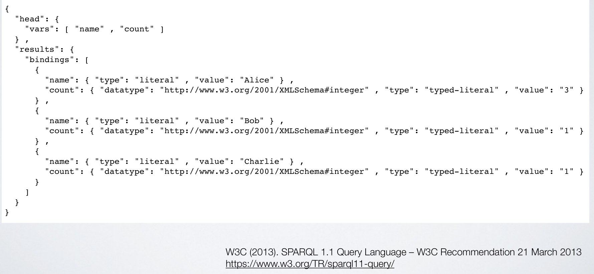

## Slide 18 - Linked (Open) Data

Linked (Open) Data

Linked Data is about using the Web to connect related data that
wasn’t previously linked, or using the Web to lower the barriers to
linking data currently linked using other methods

the basic idea is to apply the general architecture of the World Wide Web to
the task of sharing structured data on global scale

The term Linked Data refers to a set of best practices for
publishing and interlinking structured data on the Web

Linked Open Data is Linked Data that is explicitly published under
an open license

Heath, T. and Bizer, C. (2011). Linked Data: Evolving the Web into a Global Data Space. Morgan & Claypool Publishers, USA.
http://linkeddatabook.com/editions/1.0/

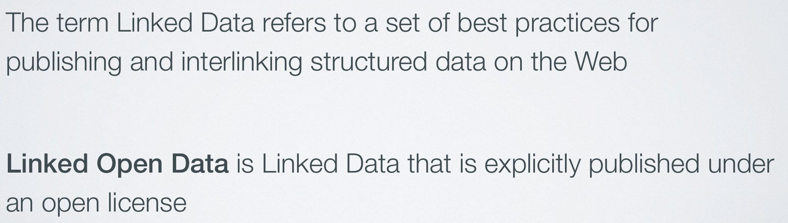

## Slide 19 - Linked Data Principles

Linked Data Principles

Use URIs as names for things

it advocates using URI references to identify, not just Web documents and digital
content, but also real world objects and abstract concepts.

Use HTTP URIs, so that people can look up those names

it advocates the use of HTTP URIs to identify objects and abstract concepts, enabling
these URIs to be dereferenced (i.e., looked up) over the HTTP protocol into a
description of the identified object or concept

When someone looks up a URI, provide useful information, using the
standards (RDF, SPARQL)

it advocates use of a single data model for publishing structured data on the Web – the
Resource Description Framework (RDF)

Include links to other URIs, so that they can discover more things

it advocates the use of typed hyperlinks to connect not only Web documents, but any
type of thing. Hyperlinks in the Linked Data context are called RDF links in order to
distinguish them from hyperlinks between classic Web documents

## Slide 20 - Linked Open Data Cloud

Linked Open Data Cloud

Legend

Chem2B...

status...

status...

status...

PGxLOD

Bio2RD...

Bio2RD...

status...

Orthol...

Bio2RD...

Transc...

status...

Bio2RD...

status...

Bio2RD...

Amster...

status...

status...

Bio2RD...

status...

status...

bio2rd...

status...

status...

status...

status...

status...

status...

Bio2RD...

status...

status...

Bio2RD...

status...

Linked...

status...

GovTra...

Bio2RD...

status...

status...

ChEMBL...

NITP

cablegate

Bio2RD...

status...

status...

status...

Bio2RD...

status...

status...

Bio2RD...

BibSon...

Organi...

status...

EPA-RCRA

Librar...

Bio2RD...

status...

status...

List o...

Bio2RD...

Deutsc...
typepad

status...

status...

status...

status...

Nobel ...

Bio2RD...

status...

Reuter...

Bio2RD...

status...

Transp...

Rådata...

status...

Uberbl...

status...

OLAC M...

status...

Univer...

status...

Gemein...

Inever...

status...

status...

Open D...

Bio2RD...

openda...

School...

Bio2RD...

status...

EU Par...

status...

status...

Publis...

status...

Lexvo

status...

Shoah ...

prefix.cc

Corona...

Linked...

status...

status...

MARC C...

status...

status...

Europe...

Mosele...
NASA S...

Bio2RD...

Wikili...

Semant...

status...

Entrez...

Cross Domain
Geography
Government
Life Sciences
Linguistics
Media
Publications
Social Networking
User Generated

status...

status...

Thesau...

status...
status...

status...

ISIL->...

Telegr...

PanLex

JRC-Na...

status...

status...

Univer...

Bank f...

status...

status...

openda...

Biblio...

bio2rd...

Bio2RD...

Bio2RD...

Eventseer

Linked...

status...

GovWIL...

Covid-...

Bio2RD...

webnma...

ReSIST...

status...

status...

Linked...

status...

status...

dev8d

TCMGen...

Naturo...

status...

crowds...

status...

World ...

status...

semanlink

Mi Guí...

Social...

Schema...

berlios

Taiwan...

Bio2RD...

DBTune...

wordpress

status...

Farmac...

Univer...

status...

EIONET...

status...

Semant...

CLLD-E...

Biogra...

status...

status...

Learni...

openda...

Open D...

status...

EEA Re...

The Eu...

status...

Poképé...

The Ch...

Hellen...

status...

Cooper...

Alpine...

Metoff...

DBpedi...

datos....

status...

Linkin...

openda...

Public...

xxxxx

Bio2RD...

LOD2 P...

Linked...

status...

status...

Norweg...

Framester

Atlant...
LinkLi...

openda...

status...

Linked...

Wordne...

Univer...

Uganda...

status...

CLLD-WOLD

Univer...

RDFLic...

semant...

TWC: L...

Geolog...

openda...

Nation...

EPO pa...

Bio2RD...
Bio2RD...

SORS

Bio2RD...

EPA-FRS

SIDER:...

EnAKTi...

U.S. S...

Bio2RD...

Produc...

myExpe...

openda...

Archiv...

AEGP, ...

EuroVoc

openda...

AgriNe...

openda...
German...

UMBEL ...

EnAKTi...

The Na...

Fishes...

EnAKTi...

openda...

DBpedi...

Active...

Spring...

Bio2RD...

Mathem...

Judaic...

Medici...

status...

ReSIST...

Prince...

Romani...

Emerge...

openda...

DBpedi...

Compre...

status...

Renewa...

UN/LOC...

Prior ...

N-Lex ...

EPA-CDR

openda...

Street...

Commun...

MediCare

openda...

Lista ...

interv...

Univer...

Univer...

IWN

GeoEcu...

Univer...

Traffi...

World ...

EnAKTi...

Deusto...

Univer...

openda...

xLiD-L...

Health...

openda...

Univer...

OntoBe...

Techni...

EURAXE...

Univer...

EnAKTi...

CLLD-G...

New Yo...

UK Pos...

Intern...

Debian...

Linked...

Accomm...

Univer...

UNODC ...

Univer...

Suface...

openda...

DBTune...

gdlc

TCGA R...

Chat G...

openda...

EventKG

openda...

Univer...
data-h...

Aperti...

Greek ...

EnAKTi...

Standa...

status...

Aperti...

datos-...

DBLP i...

Budape...

Last.F...

Planet...

lobid-...

EU Who...

Summer...

Data I...

openda...

fun

Univer...

DBpedi...

ePrint...

openda...

taxonc...

ASN:US

Univer...

The Co...

FOODpe...

openda...

Univer...

Austra...

notube

data.o...

Aperti...

zhishi...

Fundaç...

geodom...

enviro...

VIVO

DBnary

openda...

ESD-To...

aliada...

TDS

Aperti...

ESD St...

Face Link

Semant...

BBC Pr...

Persée...

Aperti...

Klapps...

Univer...

MASC-B...

EARTh

Aperti...

Nomenc...

greek-...

Naturo...

openda...

HeBIS ...

Univer...

Thesau...

Drug D...

ISSA A...

World ...

Univer...

Lexico...

Corona...

openli...

Univer...

Univer...

NTNU s...

Linked...

JITA C...

openda...

Aperti...

Produc...

gemet-...

Aperti...

openda...

Aperti...

The Ti...

Automa...

Aperti...

Univer...

Verrij...

CIPFA

Catala...

Nation...

NHS Ja...

Revyu....

Ordnan...

Univer...

Aperti...

openda...

DrugBank

Bundes...

OpenCo...

OLiA D...

RDFizi...

TEKORD

Univer...

German...

Aperti...

Lichfi...

Polyma...

STW Th...

Univer...

Aperti...

EU Age...

CLLD-WALS

Person...

openda...

Pokede...

openda...

mEduca...

Univer...

Ordnan...

AGRIS

Linked...

UniProt

Univer...

openda...

RSS-50...

Resili...

Deep B...

STITCH...

Galici...

Weathe...

GEnera...

MLSA -...

EPA-TRI

Univer...

Antiqu...

Nation...

CORE -...

Chroni...

Lark

Univer...
Univer...

Univer...

AGROVOC

John G...

B3Kat ...

de-gaa...

EuroSe...

Univer...

CLLD-A...

Whisky...

W3C

FAO ge...

YSA - ...

Aperti...

BabelNet

Inever...

Univer...

Univer...

Source...

ATC gr...

EventM...

Greek ...

Aperti...

DATATU...

Datase...

Proyec...

linked...

1989sh...

Univer...

ZBW Labs

Social...

WarSampo

Univer...

NIT Patna

semant...

Yahoo ...

Univer...

associ...

Linked...

GeoSpe...

statis...

OpenMo...

EEA Vo...

openda...

DBTune...

Englis...

Finnis...

openda...

Linked...

Europe...

Phonet...

status...

openda...

Univer...

SmartL...
iServe...

Greek ...

BibBase

Univer...

Open D...

RAMEAU...

OpenEI...

Linked...

France...

Linked...

Arthro...

CLLD-afbo

ALPINO...

Univer...

openda...

Open D...

digiti...

Resear...

Courts...

Edinbu...

transp...

The Or...

Copyri...

IATI a...

Europe...

DBLP C...

Open D...

Global...

Tradit...

BioSam...

Linked...

Non Ra...

Next W...

openda...

Europe...

tharaw...

Bricklink

openda...

Enviro...

Europe...

Geolog...

Europe...

Divers...

Smart ...

EUMIDA...

EPA-SRS

BBC Music

Univer...

2000 U...

DBTune...

Founda...

eagle-...

DBTune...

taxonc...

Diseasome

Food a...

Prince...

Univer...

School...

eagle-...

LCSubj...

Univer...

Linked...

GeoSpe...

SIMPLE

NAICS ...

Englis...

Public...

Manual...

Global...

Atheli...

Compar...

El Via...

openda...

Langu...

The Vi...

Plant ...

Univer...

Betwee...

Breast...

Parkin...

Aperti...

openda...

Basisr...

Parasi...

Muninn...

Univer...

VIVO I...

Logger...

eagle-...

Hungar...

SwetoDblp

apache

SweFN-RDF

Mis Mu...

Zhishi.me

Amphib...

Twarql

OLiA

Aperti...

IxnO

Univer...

Répert...

Biolog...

lingvo...

Univer...

OSM Se...

Mental...

theses.fr

Univer...

NorPark

Studen...

openda...

Accomm...

The Eu...

Solana...

NPM

Univer...

Yovist...

Cell type

Google...

IATE RDF

Univer...

TAXREF...

DM2E

sloWNe...

Databa...

Reacto...

Cognit...

Garnic...

Spatia...

Educat...

ietflang

thesaurus

Plant ...

CTIC P...

Shivan...

Commun...

Cereal...

TaxonC...

DBpedia

Nomism...

Multil...

Univer...

Intern...

Vytaut...

SPARQL...

openda...

Pediat...

Geogra...

Univer...

Surge ...

Lotico

ESO

Gene E...

openda...

Ontolo...

openda...

Univer...

AI/RHEUM

ISTAT ...

openda...

Univer...

Mouse ...

LIBRIS

EMN

ICD10CM
Intern...

MIxS C...

Edublogs

WHO Ad...

The Li...

Ontolo...

Mouse ...

Open M...

Super ...

CPV 2008

Units ...

Plant ...

Pleiades

Fly ta...

Univer...

Parole...

Ontolo...

Cultur...

Open A...

Chines...

Univer...

PHARE

Biblio...

Intera...

lexinfo

CAO

IEEE V...

Univer...

DBkWik

OBOE SBC

YSO - ...

Nation...

Mosqui...

System...

Deusto...

Vaccin...

Eniped...

Ocean ...

Ontolo...

Orphan...

Univer...

Infect...

Salzbu...

Swedis...

Europe...

eagle-...

Cognit...

Salzbu...

Instit...

AEMET ...

Romani...

ICANE

My Fam...

CRISP ...

Basque...

UniProt

MedDRA

Aperti...

NUTS (...

MusicB...

verteb...

Univer...

Linked...

Linked...

Ontolo...

FiESTA

Thesau...

Protei...

ICPS N...

IEEE P...

CE4R K...

VANDF

ISOcat...

Anatom...

Cine F...

PMA 2010

patent...

NIF Cell

World ...

RxNORM

Climb ...

Cancer...

Syndro...

Temple...

sandra...

Malari...

Bilate...

Museos...

Hebrew...

C. ele...

Brown ...

Intera...

DBTune...

Multex...

Univer...

Croati...

Cardia...

Dewey ...

Aperti...

Britis...

yso-fi...

Aperti...

openda...

Genera...

Datos ...

Databa...

ciard-...

eagle-...

Comput...

oreilly

unipro...

Medlin...

ICD10

Univer...

DBpedi...

Basic ...

Influe...

Linked...

VIVO C...

SysMO-...

"Raini...

Univer...

Multip...

TheSoz...

RadLex

Univer...

R&D Pr...

Instan...

ICD-10...

Online...

Univer...

DailyMed

Albane...

MESH T...

Univer...

Open B...

OpenWN...

ISPRA ...

ThIST

Aperti...

ECCO-T...

NCBI o...

Associ...

Ontos ...

Linked...

Freeyork

Ontolo...

PreLex

epsrc

Logica...

Web Sc...

DBTune...

Emotio...

eVOC (...

CLLD-S...

neXtProt

NIF Dy...

Medaka...

Univer...

State ...

TOK_On...

medline

YAGO

Intern...

Univer...

HEALTH...

openda...
Green ...

NIFSTD

Englis...

Slovak...

Taiwan...

DisGeNET

Linked...

Cornet...

dbpedi...

Gene R...

Swedis...

Swift ...

PDEV-L...

Physic...

Cell L...

SNIK

Genera...

List o...

Brucel...

VIAF: ...

Japane...

DIKB-E...

Wordne...

Sugges...

ISOcat

Gene R...

Geolog...

SNOMED...

Web ND...

Xenopu...

DBTropes

Sudoc ...

Cancer...

Fungal...

KORE 5...

Glottolog

Gene O...

plWord...

Univer...

ERA - ...

NCI Th...

WordLi...

lobid-...

FinnWo...

Human ...

Transl...

IPTC N...

Ontolo...

DanNet...

MExiCo

Human ...

Bio2RD...

Aperti...

DBpedi...

Hymeno...

Chemic...

Aperti...

LODAC ...

Experi...

SALDO-RDF

Advers...

Scotti...

FDA Me...

Ontolo...

Brazil...

DEPLOY...
Instit...

zarago...

Sleep ...

Allie ...

openda...

BIRNLex

photos

Lipid ...

openda...

WOLF W...

Health...

Proteo...

OpenCa...

Mosqui...

Chemic...

Host P...

Linked...

WordNe...

Evalua...

Job ap...

Family...

Japane...

Number...

Diavgeia

NanoPa...

Wikidata

SLI Ga...

Teleos...

BioMod...

DBpedi...

Dendri...

ICPC-2...

lemonUby

EUR-Le...

BRENDA...
COSTART

Event ...

Univer...

Period...

openda...

Read C...

DBLP B...

Neomar...

Biblio...

PRotei...

EU: fi...

DBTune...

Ontolo...

Cell C...

Chines...

Eurost...

Amphib...

All In...

BulTre...

myopen...

Time E...

Termin...

Datos....

SALDOM...

Human ...

yso-fi...

Organi...

IceWor...

ThinkP...

Uber a...

Plant ...

Databa...

flickr...

Calames

ExO

Nation...

proven...

Code l...

Bleedi...

AragoD...

WebIsALOD

Tick g...

Inform...

Art & ...

MORElab

20th C...

Africa...

DBpedi...

Genera...

Struct...

Smokin...

Japane...

openda...

Phenot...

datahub

tags2c...

Semant...

Human ...

LAAS-C...

Subcel...

Ontolo...
Ontolo...

VIVO W...

Social...

Greek ...

Neomar...

oceand...

Instit...

Inspec...

Chemic...

USPTO ...

Data a...

DataGo...

Bone D...

Kidney...

Ontolo...

Ruben ...

IBM Re...

Nation...

Italia...

Univer...

Rat St...

eagle-...

ChEMBL...

Cell l...

Rechts...

UniProtKB

Medica...

Electr...

Deaths...

FrameB...

openda...

Zebraf...

System...

IdRef:...

Neural...

bio2rd...

VIVO W...

Drosop...

Farm A...

PreMOn

MultiW...

Ontolo...
RNA on...

ProductDB

Open W...

Regist...

BioAss...

Interc...

Integr...

Public...

Natura...

WordNe...

Projec...

Result...

Deutsc...

Cell l...

Linked...

Summar...

Minima...

Master...

Facete...

Organi...

Spider...

Mammal...

Open L...

Units ...

Projec...

Sequen...

Hellen...

Intern...

BPR ? ...

NMR-in...

Biblio...

SNP-On...

Arabic...

GeoWor...

Taxons

Regist...

Regist...

Basic ...

Linked...

Univer...

The Di...

Breast...

Lingui...

Agenda...

Geospa...

C. ele...

Cooper...

resear...

Molecu...

The Ge...

Fissio...

Unempl...

Experi...

MeGO

Neural...

School...

Englis...

BioTop

Linked...

Projet...

Human ...

CLLD-P...

Gene O...

QBOAir...

Requir...

Thai W...

ABA Ad...

VIVO S...

Near

UK JIS...

Verteb...

ePrint...

ItalWo...

data.g...

refere...

FlyBas...

vivo2doi

BBC Wi...

Common...

ReSIST...

ichoose

MGED O...

Muziekweb

Random...

eagle-...

Cadast...

BioPAX

The Lo...

Influe...

openda...

PKO_Re

Openly...

OBOE

Yeast ...

RISM A...

Persia...

Linked...

Softwa...

Data a...

Job ap...

Norweg...

GNOSS....

dotAC ...

Animal...

URIBurner

Ocean ...

Mass s...

Open L...

CrossR...

Amino ...

SoyOnt...

Physic...

Cinéma...

eagle-...

RDF Bo...

eagle-...

Epilepsy

UNESCO...

GeoNam...

Protei...

IMGT-O...

busine...

LemonW...

Role O...

Entorn...

Bans o...

Verteb...

Audite...

Focus ...

Korean...

Italia...

eagle-...

CiteSe...

Schola...

Enviro...

RDFohloh

Didact...

VIVO

Regist...

Lexvo.org

eagle-...

Ruben ...

Confis...

Nation...

OpenCyc

Reposi...

WordNe...

Red Un...

openda...

Metath...

GeoLin...

Linked...

Images...

C. ele...

Eurost...

Dictyo...

LinkedCT

Czech ...

Europe...

Situat...

Linked...

DBLP R...

Semant...

Measur...

News-1...

R&D Pr...

Resear...

WordLi...

Sentim...

NERC V...

eagle-...

Sancti...

Archiv...

PubChe...

Federa...

southa...

Linked...

Plant ...

Ascomy...

ECS So...

WordNe...

Curren...

Linked...

HCPCS

data.dcs

eagle-...
Countr...

MaHCO ...

openda...

Inspec...

chemdb...

Aragon...

Sample...

Corpor...

data.b...

Addgene

chemdb...

2011 U...

Cerebr...

eagle-...

Airpor...

Biomed...

Norsk ...

Italia...

TIP

DWS-Group

CareLex
Clinic...

twc-op...

Gemeen...

wiktio...

UK Leg...

eagle-...

Reprod...

sears.com

eagle-...

MetaSh...

DBpedi...

Open D...

ENTICE...

RISKS ...

eagle-...

Tradit...

Kallik...

Prospe...

Taxono...

Catalo...

chemdb...

educat...

VIVO U...

Merite...

eagle-...

Instit...

Teleos...

Diagno...

Serend...

vulner...

Pathwa...
Physic...

Averag...

eagle-...

Discog...

Salzbu...

Englis...

webconf

Ocean ...

World ...

eagle-...

Wheat ...

data-s...

Select...

Drosop...

chemdb...

eagle-...

eagle-...

WASABI...

Polyth...

Hedatuz

eagle-...

Tender...

Open E...

eagle-...

HUGO

eagle-...

http://lod-cloud.net/

## Slide 21 - Linked Open Data Cloud

Linked Open Data Cloud

Legend

Chem2B...

status...

status...

status...

PGxLOD

Bio2RD...

Bio2RD...

status...

Orthol...

Bio2RD...

Transc...

status...

Bio2RD...

status...

Bio2RD...

Amster...

status...

status...

Bio2RD...

status...

status...

bio2rd...

status...

status...

status...

status...

status...

status...

Bio2RD...

status...

status...

Bio2RD...

status...

Linked...

status...

GovTra...

Bio2RD...

status...

status...

ChEMBL...

NITP

cablegate

Bio2RD...

status...

status...

status...

Bio2RD...

status...

status...

Bio2RD...

BibSon...

Organi...

status...

EPA-RCRA

Librar...

Bio2RD...

status...

status...

List o...

Bio2RD...

Deutsc...
typepad

status...

status...

status...

status...

Nobel ...

Bio2RD...

status...

Reuter...

Bio2RD...

status...

Transp...

Rådata...

status...

Uberbl...

status...

OLAC M...

status...

Univer...

status...

Gemein...

Inever...

status...

status...

Open D...

Bio2RD...

openda...

School...

Bio2RD...

status...

EU Par...

status...

status...

Publis...

status...

Lexvo

status...

Shoah ...

prefix.cc

Corona...

Linked...

status...

status...

MARC C...

status...

status...

Europe...

Mosele...
NASA S...

Bio2RD...

Wikili...

Semant...

status...

Entrez...

Cross Domain
Geography
Government
Life Sciences
Linguistics
Media
Publications
Social Networking
User Generated

status...

status...

Thesau...

status...
status...

status...

ISIL->...

Telegr...

PanLex

JRC-Na...

status...

status...

Univer...

Bank f...

status...

status...

openda...

Biblio...

bio2rd...

Bio2RD...

Bio2RD...

Eventseer

Linked...

status...

GovWIL...

Covid-...

Bio2RD...

webnma...

ReSIST...

status...

status...

Linked...

status...

status...

dev8d

TCMGen...

Naturo...

status...

crowds...

status...

World ...

status...

semanlink

Mi Guí...

Social...

Schema...

berlios

Taiwan...

Bio2RD...

DBTune...

wordpress

status...

Farmac...

Univer...

status...

EIONET...

status...

Semant...

CLLD-E...

Biogra...

status...

status...

Learni...

openda...

Open D...

status...

EEA Re...

The Eu...

status...

Poképé...

The Ch...

Hellen...

status...

Cooper...

Alpine...

Metoff...

DBpedi...

datos....

status...

Linkin...

openda...

Public...

xxxxx

Bio2RD...

LOD2 P...

Linked...

status...

status...

Norweg...

Framester

Atlant...
LinkLi...

openda...

status...

Linked...

Wordne...

Univer...

Uganda...

status...

CLLD-WOLD

Univer...

RDFLic...

semant...

TWC: L...

Geolog...

openda...

Nation...

EPO pa...

Bio2RD...
Bio2RD...

SORS

Bio2RD...

EPA-FRS

SIDER:...

EnAKTi...

U.S. S...

Bio2RD...

Produc...

myExpe...

openda...

Archiv...

AEGP, ...

EuroVoc

openda...

AgriNe...

openda...
German...

UMBEL ...

EnAKTi...

The Na...

Fishes...

EnAKTi...

openda...

DBpedi...

Active...

Spring...

Bio2RD...

Mathem...

Judaic...

Medici...

status...

ReSIST...

Prince...

Romani...

Emerge...

openda...

DBpedi...

Compre...

status...

Renewa...

UN/LOC...

Prior ...

N-Lex ...

EPA-CDR

openda...

Street...

Commun...

MediCare

openda...

Lista ...

interv...

Univer...

Univer...

IWN

GeoEcu...

Univer...

Traffi...

World ...

EnAKTi...

Deusto...

Univer...

openda...

xLiD-L...

Health...

openda...

Univer...

OntoBe...

Techni...

EURAXE...

Univer...

EnAKTi...

CLLD-G...

New Yo...

UK Pos...

Intern...

Debian...

Linked...

Accomm...

Univer...

UNODC ...

Univer...

Suface...

openda...

DBTune...

gdlc

TCGA R...

Chat G...

openda...

EventKG

openda...

Univer...
data-h...

Aperti...

Greek ...

EnAKTi...

Standa...

status...

Aperti...

datos-...

DBLP i...

Budape...

Last.F...

Planet...

lobid-...

EU Who...

Summer...

Data I...

openda...

fun

Univer...

DBpedi...

ePrint...

openda...

taxonc...

ASN:US

Univer...

The Co...

FOODpe...

openda...

Univer...

Austra...

notube

data.o...

Aperti...

zhishi...

Fundaç...

geodom...

enviro...

VIVO

DBnary

openda...

ESD-To...

aliada...

TDS

Aperti...

ESD St...

Face Link

Semant...

BBC Pr...

Persée...

Aperti...

Klapps...

Univer...

MASC-B...

EARTh

Aperti...

Nomenc...

greek-...

Naturo...

openda...

HeBIS ...

Univer...

Thesau...

Drug D...

ISSA A...

World ...

Univer...

Lexico...

Corona...

openli...

Univer...

Univer...

NTNU s...

Linked...

JITA C...

openda...

Aperti...

Produc...

gemet-...

Aperti...

openda...

Aperti...

The Ti...

Automa...

Aperti...

Univer...

Verrij...

CIPFA

Catala...

Nation...

NHS Ja...

Revyu....

Ordnan...

Univer...

Aperti...

openda...

DrugBank

Bundes...

OpenCo...

OLiA D...

RDFizi...

TEKORD

Univer...

German...

Aperti...

Lichfi...

Polyma...

STW Th...

Univer...

Aperti...

EU Age...

CLLD-WALS

Person...

openda...

Pokede...

openda...

mEduca...

Univer...

Ordnan...

AGRIS

Linked...

UniProt

Univer...

openda...

RSS-50...

Resili...

Deep B...

STITCH...

Galici...

Weathe...

GEnera...

MLSA -...

EPA-TRI

Univer...

Antiqu...

Nation...

CORE -...

Chroni...

Lark

Univer...
Univer...

Univer...

AGROVOC

John G...

B3Kat ...

de-gaa...

EuroSe...

Univer...

CLLD-A...

Whisky...

W3C

FAO ge...

YSA - ...

Aperti...

BabelNet

Inever...

Univer...

Univer...

Source...

ATC gr...

EventM...

Greek ...

Aperti...

DATATU...

Datase...

Proyec...

linked...

1989sh...

Univer...

ZBW Labs

Social...

WarSampo

Univer...

NIT Patna

semant...

Yahoo ...

Univer...

associ...

Linked...

GeoSpe...

statis...

OpenMo...

EEA Vo...

openda...

DBTune...

Englis...

Finnis...

openda...

Linked...

Europe...

Phonet...

status...

openda...

Univer...

SmartL...
iServe...

Greek ...

BibBase

Univer...

Open D...

RAMEAU...

OpenEI...

Linked...

France...

Linked...

Arthro...

CLLD-afbo

ALPINO...

Univer...

openda...

Open D...

digiti...

Resear...

Courts...

Edinbu...

transp...

The Or...

Copyri...

IATI a...

Europe...

DBLP C...

Open D...

Global...

Tradit...

BioSam...

Linked...

Non Ra...

Next W...

openda...

Europe...

tharaw...

Bricklink

openda...

Enviro...

Europe...

Geolog...

Europe...

Divers...

Smart ...

EUMIDA...

EPA-SRS

BBC Music

Univer...

2000 U...

DBTune...

Founda...

eagle-...

DBTune...

taxonc...

Diseasome

Food a...

Prince...

Univer...

School...

eagle-...

LCSubj...

Univer...

Linked...

GeoSpe...

SIMPLE

NAICS ...

Englis...

Public...

Manual...

Global...

Atheli...

Compar...

El Via...

openda...

Langu...

The Vi...

Plant ...

Univer...

Betwee...

Breast...

Parkin...

Aperti...

openda...

Basisr...

Parasi...

Muninn...

Univer...

VIVO I...

Logger...

eagle-...

Hungar...

SwetoDblp

apache

SweFN-RDF

Mis Mu...

Zhishi.me

Amphib...

Twarql

OLiA

Aperti...

IxnO

Univer...

Répert...

Biolog...

lingvo...

Univer...

OSM Se...

Mental...

theses.fr

Univer...

NorPark

Studen...

openda...

Accomm...

The Eu...

Solana...

NPM

Univer...

Yovist...

Cell type

Google...

IATE RDF

Univer...

TAXREF...

DM2E

sloWNe...

Databa...

Reacto...

Cognit...

Garnic...

Spatia...

Educat...

ietflang

thesaurus

Plant ...

CTIC P...

Shivan...

Commun...

Cereal...

TaxonC...

DBpedia

Nomism...

Multil...

Univer...

Intern...

Vytaut...

SPARQL...

openda...

Pediat...

Geogra...

Univer...

Surge ...

Lotico

ESO

Gene E...

openda...

Ontolo...

openda...

Univer...

AI/RHEUM

ISTAT ...

openda...

Univer...

Mouse ...

LIBRIS

EMN

ICD10CM
Intern...

MIxS C...

Edublogs

WHO Ad...

The Li...

Ontolo...

Mouse ...

Open M...

Super ...

CPV 2008

Units ...

Plant ...

Pleiades

Fly ta...

Univer...

Parole...

Ontolo...

Cultur...

Open A...

Chines...

Univer...

PHARE

Biblio...

Intera...

lexinfo

CAO

IEEE V...

Univer...

DBkWik

OBOE SBC

YSO - ...

Nation...

Mosqui...

System...

Deusto...

Vaccin...

Eniped...

Ocean ...

Ontolo...

Orphan...

Univer...

Infect...

Salzbu...

Swedis...

Europe...

eagle-...

Cognit...

Salzbu...

Instit...

AEMET ...

Romani...

ICANE

My Fam...

CRISP ...

Basque...

UniProt

MedDRA

Aperti...

NUTS (...

MusicB...

verteb...

Univer...

Linked...

Linked...

Ontolo...

FiESTA

Thesau...

Protei...

ICPS N...

IEEE P...

CE4R K...

VANDF

ISOcat...

Anatom...

Cine F...

PMA 2010

patent...

NIF Cell

World ...

RxNORM

Climb ...

Cancer...

Syndro...

Temple...

sandra...

Malari...

Bilate...

Museos...

Hebrew...

C. ele...

Brown ...

Intera...

DBTune...

Multex...

Univer...

Croati...

Cardia...

Dewey ...

Aperti...

Britis...

yso-fi...

Aperti...

openda...

Genera...

Datos ...

Databa...

ciard-...

eagle-...

Comput...

oreilly

unipro...

Medlin...

ICD10

Univer...

DBpedi...

Basic ...

Influe...

Linked...

VIVO C...

SysMO-...

"Raini...

Univer...

Multip...

TheSoz...

RadLex

Univer...

R&D Pr...

Instan...

ICD-10...

Online...

Univer...

DailyMed

Albane...

MESH T...

Univer...

Open B...

OpenWN...

ISPRA ...

ThIST

Aperti...

ECCO-T...

NCBI o...

Associ...

Ontos ...

Linked...

Freeyork

Ontolo...

PreLex

epsrc

Logica...

Web Sc...

DBTune...

Emotio...

eVOC (...

CLLD-S...

neXtProt

NIF Dy...

Medaka...

Univer...

State ...

TOK_On...

medline

YAGO

Intern...

Univer...

HEALTH...

openda...
Green ...

NIFSTD

Englis...

Slovak...

Taiwan...

DisGeNET

Linked...

Cornet...

dbpedi...

Gene R...

Swedis...

Swift ...

PDEV-L...

Physic...

Cell L...

SNIK

Genera...

List o...

Brucel...

VIAF: ...

Japane...

DIKB-E...

Wordne...

Sugges...

ISOcat

Gene R...

Geolog...

SNOMED...

Web ND...

Xenopu...

DBTropes

Sudoc ...

Cancer...

Fungal...

KORE 5...

Glottolog

Gene O...

plWord...

Univer...

ERA - ...

NCI Th...

WordLi...

lobid-...

FinnWo...

Human ...

Transl...

IPTC N...

Ontolo...

DanNet...

MExiCo

Human ...

Bio2RD...

Aperti...

DBpedi...

Hymeno...

Chemic...

Aperti...

LODAC ...

Experi...

SALDO-RDF

Advers...

Scotti...

FDA Me...

Ontolo...

Brazil...

DEPLOY...
Instit...

zarago...

Sleep ...

Allie ...

openda...

BIRNLex

photos

Lipid ...

openda...

WOLF W...

Health...

Proteo...

OpenCa...

Mosqui...

Chemic...

Host P...

Linked...

WordNe...

Evalua...

Job ap...

Family...

Japane...

Number...

Diavgeia

NanoPa...

Wikidata

SLI Ga...

Teleos...

BioMod...

DBpedi...

Dendri...

ICPC-2...

lemonUby

EUR-Le...

BRENDA...
COSTART

Event ...

Univer...

Period...

openda...

Read C...

DBLP B...

Neomar...

Biblio...

PRotei...

EU: fi...

DBTune...

Ontolo...

Cell C...

Chines...

Eurost...

Amphib...

All In...

BulTre...

myopen...

Time E...

Termin...

Datos....

SALDOM...

Human ...

yso-fi...

Organi...

IceWor...

ThinkP...

Uber a...

Plant ...

Databa...

flickr...

Calames

ExO

Nation...

proven...

Code l...

Bleedi...

AragoD...

WebIsALOD

Tick g...

Inform...

Art & ...

MORElab

20th C...

Africa...

DBpedi...

Genera...

Struct...

Smokin...

Japane...

openda...

Phenot...

datahub

tags2c...

Semant...

Human ...

LAAS-C...

Subcel...

Ontolo...
Ontolo...

VIVO W...

Social...

Greek ...

Neomar...

oceand...

Instit...

Inspec...

Chemic...

USPTO ...

Data a...

DataGo...

Bone D...

Kidney...

Ontolo...

Ruben ...

IBM Re...

Nation...

Italia...

Univer...

Rat St...

eagle-...

ChEMBL...

Cell l...

Rechts...

UniProtKB

Medica...

Electr...

Deaths...

FrameB...

openda...

Zebraf...

System...

IdRef:...

Neural...

bio2rd...

VIVO W...

Drosop...

Farm A...

PreMOn

MultiW...

Ontolo...
RNA on...

ProductDB

Open W...

Regist...

BioAss...

Interc...

Integr...

Public...

Natura...

WordNe...

Projec...

Result...

Deutsc...

Cell l...

Linked...

Summar...

Minima...

Master...

Facete...

Organi...

Spider...

Mammal...

Open L...

Units ...

Projec...

Sequen...

Hellen...

Intern...

BPR ? ...

NMR-in...

Biblio...

SNP-On...

Arabic...

GeoWor...

Taxons

Regist...

Regist...

Basic ...

Linked...

Univer...

The Di...

Breast...

Lingui...

Agenda...

Geospa...

C. ele...

Cooper...

resear...

Molecu...

The Ge...

Fissio...

Unempl...

Experi...

MeGO

Neural...

School...

Englis...

BioTop

Linked...

Projet...

Human ...

CLLD-P...

Gene O...

QBOAir...

Requir...

Thai W...

ABA Ad...

VIVO S...

Near

UK JIS...

Verteb...

ePrint...

ItalWo...

data.g...

refere...

FlyBas...

vivo2doi

BBC Wi...

Common...

ReSIST...

ichoose

MGED O...

Muziekweb

Random...

eagle-...

Cadast...

BioPAX

The Lo...

Influe...

openda...

PKO_Re

Openly...

OBOE

Yeast ...

RISM A...

Persia...

Linked...

Softwa...

Data a...

Job ap...

Norweg...

GNOSS....

dotAC ...

Animal...

URIBurner

Ocean ...

Mass s...

Open L...

How to fi

CrossR...

Amino ...

SoyOnt...

Physic...

Cinéma...

eagle-...

RDF Bo...

eagle-...

Epilepsy

UNESCO...

GeoNam...

Protei...

IMGT-O...

busine...

LemonW...

Role O...

Entorn...

Bans o...

Verteb...

Audite...

Focus ...

Korean...

Italia...

eagle-...

CiteSe...

Schola...

Enviro...

RDFohloh

Didact...

VIVO

Regist...

Lexvo.org

eagle-...

Ruben ...

Confis...

Nation...

OpenCyc

Reposi...

WordNe...

Red Un...

openda...

Metath...

GeoLin...

Linked...

Images...

C. ele...

Eurost...

Dictyo...

LinkedCT

Czech ...

Europe...

Situat...

Linked...

DBLP R...

Semant...

Measur...

News-1...

R&D Pr...

Resear...

WordLi...

Sentim...

NERC V...

eagle-...

Sancti...

Archiv...

PubChe...

Federa...

southa...

Linked...

Plant ...

Ascomy...

ECS So...

WordNe...

Curren...

Linked...

HCPCS

data.dcs

eagle-...
Countr...

MaHCO ...

openda...

Inspec...

chemdb...

Aragon...

Sample...

Corpor...

data.b...

Addgene

chemdb...

2011 U...

Cerebr...

eagle-...

Airpor...

Biomed...

Norsk ...

Italia...

TIP

DWS-Group

CareLex
Clinic...

twc-op...

Gemeen...

wiktio...

UK Leg...

eagle-...

Reprod...

sears.com

eagle-...

MetaSh...

DBpedi...

Open D...

ENTICE...

RISKS ...

eagle-...

Tradit...

Kallik...

Prospe...

Taxono...

Catalo...

chemdb...

educat...

VIVO U...

Merite...

eagle-...

Instit...

Teleos...

Diagno...

Serend...

vulner...

Pathwa...
Physic...

Averag...

eagle-...

Discog...

Salzbu...

Englis...

webconf

Ocean ...

World ...

eagle-...

Wheat ...

data-s...

Select...

Drosop...

chemdb...

eagle-...

eagle-...

WASABI...

Polyth...

Hedatuz

eagle-...

Tender...

Open E...

eagle-...

HUGO

eagle-...

http://lod-cloud.net/

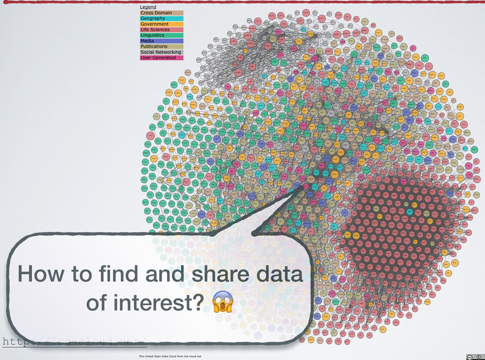

## Slide 22 - FAIR Principles

FAIR Principles

Findable

Interoperable

(Meta)data are assigned a globally unique and
persistent identifier

(Meta)data use a formal, accessible, shared, and
broadly applicable language for knowledge
representation.

Data are described with rich metadata

(Meta)data use vocabularies that follow FAIR
principles

Metadata clearly and explicitly include the
identifier of the data they describe

(Meta)data include qualified references to other
(meta)data

(Meta)data are registered or indexed in a
searchable resource

Reusable

Accessible

(Meta)data are richly described with a plurality of
accurate and relevant attributes

(Meta)data are retrievable by their identifier using
a standardised communications protocol

(Meta)data are released with a clear and
accessible data usage license

The protocol is open, free, and universally
implementable

(Meta)data are associated with detailed
provenance

The protocol allows for an authentication and
authorisation procedure, where necessary

(Meta)data meet domain-relevant community
standards

Metadata are accessible, even when the data
are no longer available

Wilkinson, M. D., Dumontier, M., Aalbersberg, I. J., Appleton, G., Axton, M., Baak, A., Blomberg, N., Boiten, J.-W., da Silva Santos, L. B., Bourne, P. E., Bouwman, J., Brookes, A. J., Clark, T., Crosas, M., Dillo, I., Dumon, O., Edmunds, S., Evelo, C. T., Finkers,
R., Gonzalez-Beltran, A., Gray, A. J., Groth, P., Goble, C., Grethe, J. S., Heringa, J., ’t Hoen, P., Hooft, R., Kuhn, T., Kok, R., Kok, J., Lusher, S. J., Martone, M. E., Mons, A., Packer, A. L., Persson, B., Rocca-Serra, P., Roos, M., van Schaik, R., Sansone, S.-A.,
Schultes, E., Sengstag, T., Slater, T., Strawn, G., Swertz, M. A., Thompson, M., van der Lei, J., van Mulligen, E., Velterop, J., Waagmeester, A., Wittenburg, P., Wolstencroft, K., Zhao, J., and Mons, B. (2016). The FAIR Guiding Principles for scientific data
management and stewardship. Nature Scientific Data, 3(160018).

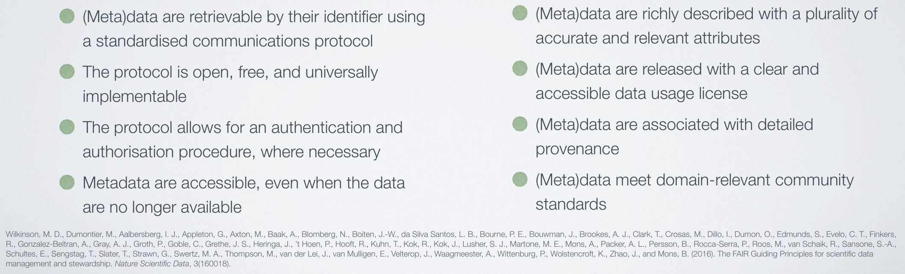

## Slide 23 - DBPedia

DBPedia

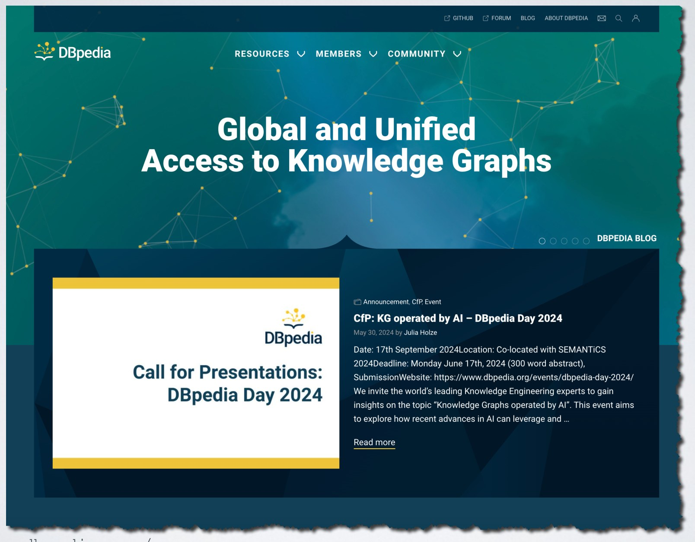

## Slide 24 - DBPedia

DBPedia

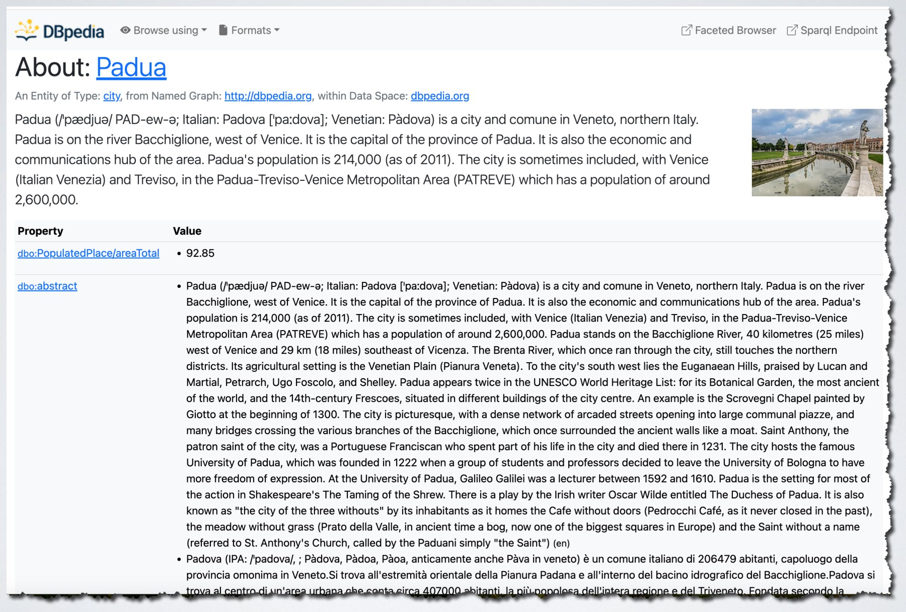

## Slide 25 - DBPedia

DBPedia

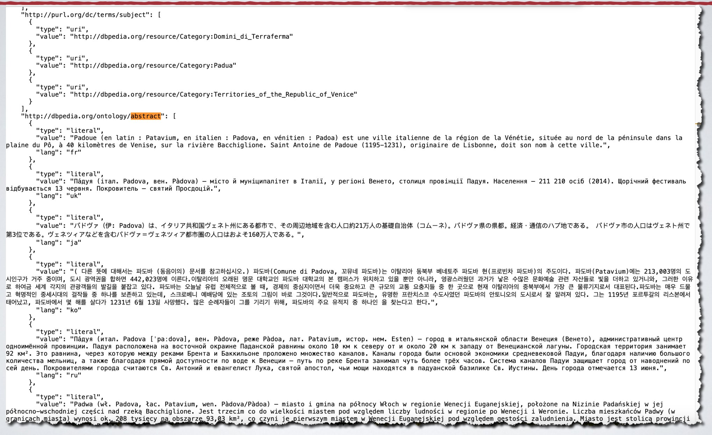

## Slide 26 - Wikidata

Wikidata

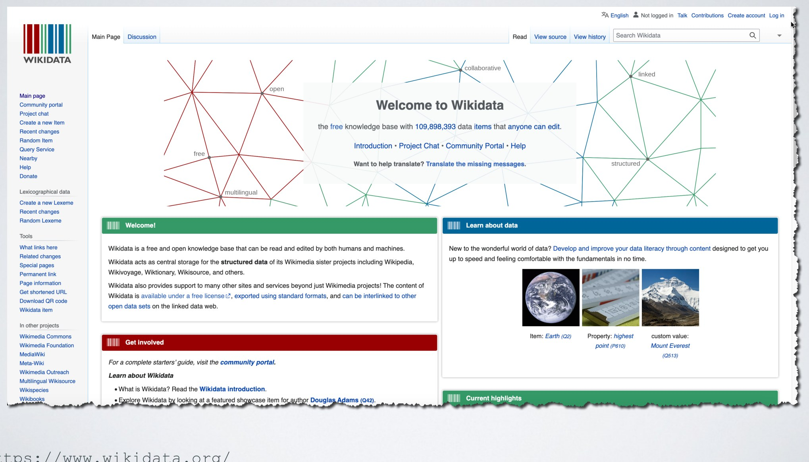

## Slide 27 - Wikidata

Wikidata

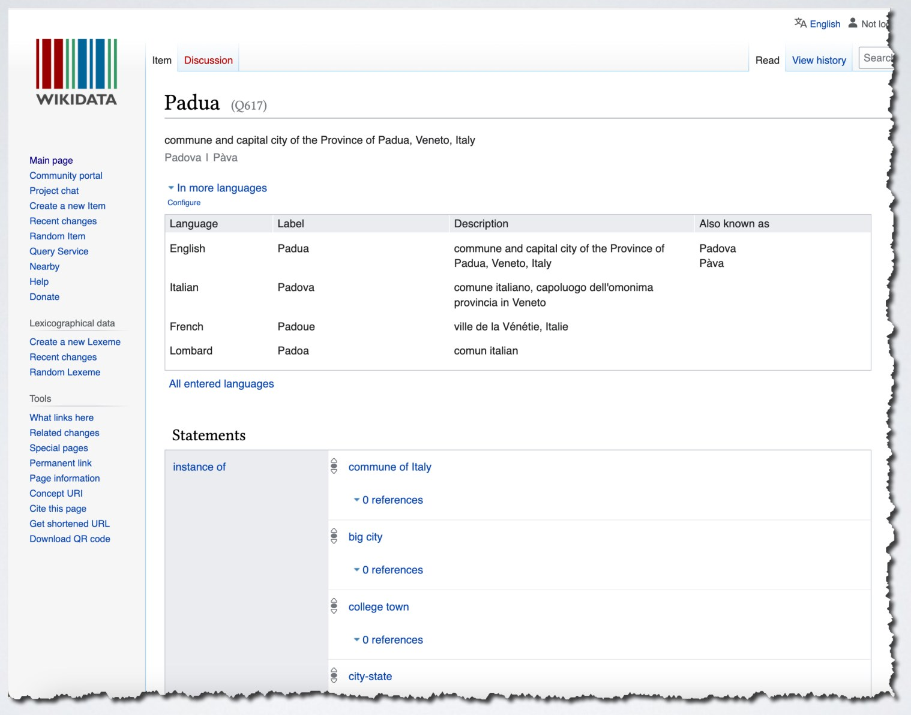

## Slide 28 - Overall Web Vision

Overall Web Vision

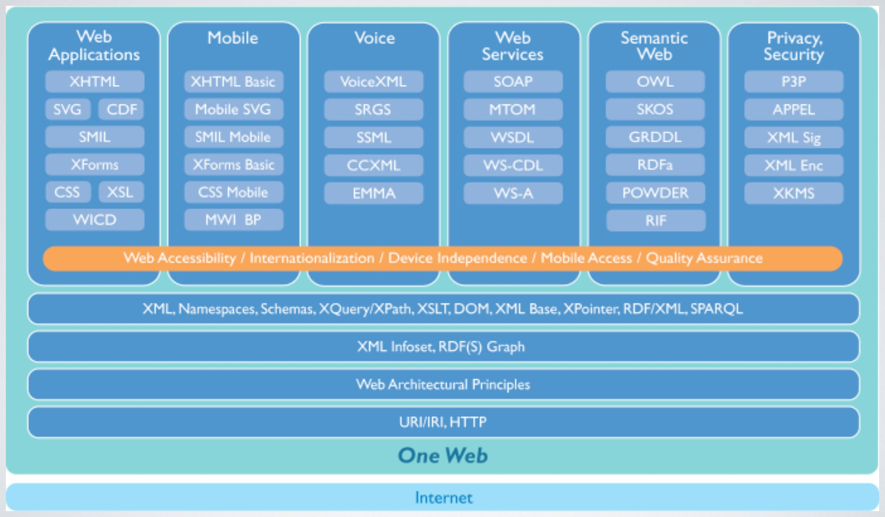

## Slide 29 - Slide 29
