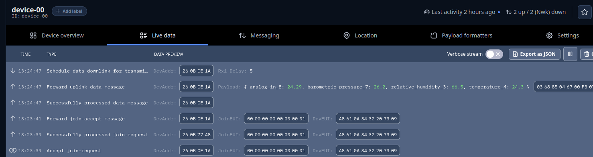
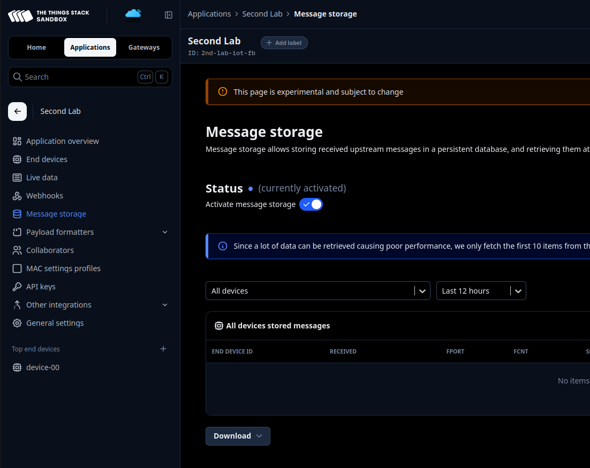
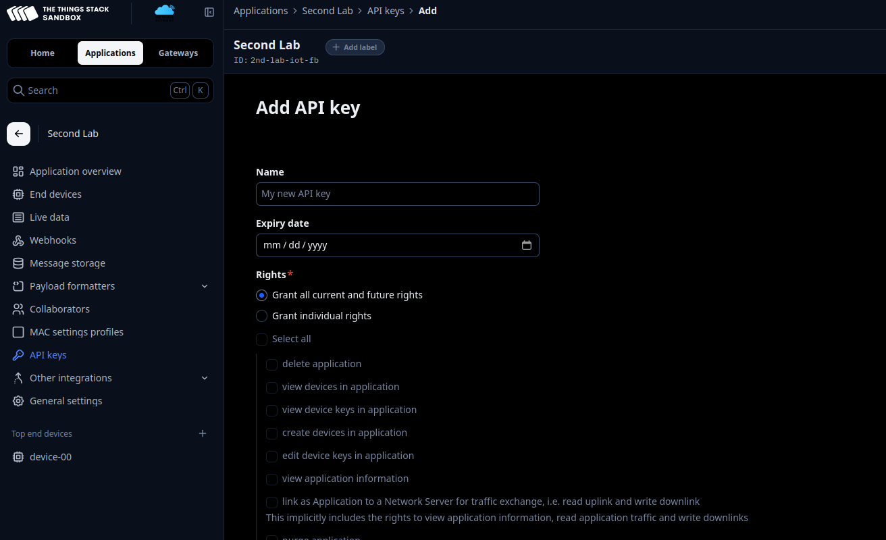
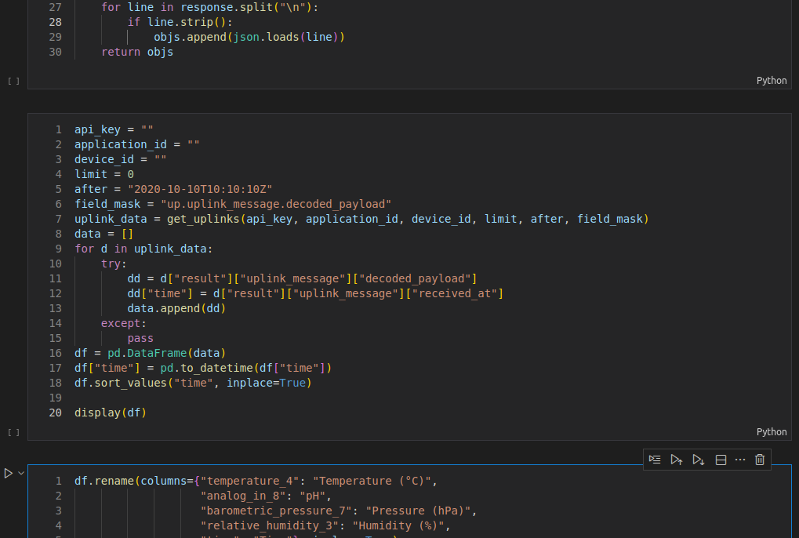

# Riassunto Laboratorio 2: Cayenne LPP e API

Questo documento riassume i concetti teorici e i passaggi pratici del Laboratorio 2, basandosi sui documenti `Cayenne LPP and API.pdf` e `Guide.pdf`.

---

## Parte 1: Teoria - Cayenne LPP e API
*(Riferimento: `Cayenne LPP and API.pdf`)*

### Cos'è Cayenne LPP?
**Cayenne Low Power Payload (LPP)** è un formato dati progettato da myDevices per inviare dati dai sensori in modo efficiente su reti a bassa potenza come LoRaWAN.
*   Definisce una codifica binaria compatta.
*   Permette ai microcontrollori con banda limitata di inviare dati facilmente.
*   È supportato nativamente da piattaforme come The Things Network (TTN).

### Struttura del Payload
Il payload è strutturato in una sequenza di pacchetti, dove ogni misura è composta da:
1.  **Channel** (1 Byte): Identifica il sensore (es. 1, 2, 3...).
2.  **Type** (1 Byte): Identifica il tipo di dato (es. Temperatura, Umidità).
3.  **Data** (N Bytes): Il valore della misura, codificato secondo uno standard fisso.
![[Pasted image 20251216092211.png]]
### Tipi di Dati Predefiniti
Ogni tipo di sensore ha un codice esadecimale associato e una risoluzione specifica.
*   **Digital Input/Output**: 1 Byte (0 o 1).
*   **Analog Input/Output**: 2 Byte (risoluzione 0.01).
*   **Temperature**: 2 Byte (risoluzione 0.1°C).
*   **Humidity**: 1 Byte (risoluzione 0.5%).
*   **GPS**: 9 Byte.
![[Pasted image 20251216092237.png]]

### Implementazione Arduino
La libreria `CayenneLPP` per Arduino semplifica la creazione del payload. La classe offre metodi come:
*   `addDigitalInput(channel, value)`
*   `addTemperature(channel, celsius)`
*   `addAnalogInput(channel, value)`
*   `getBuffer()`: Restituisce il buffer binario da inviare.

Il codice completo:
```c
class CayenneLPP {
public:
CayenneLPP(uint8_t size);
~CayenneLPP();
void reset(void);
uint8_t getSize(void);
uint8_t* getBuffer(void);
uint8_t copy(uint8_t* buffer);
uint8_t addDigitalInput(uint8_t channel, uint8_t
value);
uint8_t addDigitalOutput(uint8_t channel, uint8_t
value);
uint8_t addAnalogInput(uint8_t channel, float value);
uint8_t addAnalogOutput(uint8_t channel, float value);
uint8_t addLuminosity(uint8_t channel, uint16_t lux);
uint8_t addPresence(uint8_t channel, uint8_t value);
uint8_t addTemperature(uint8_t channel, float celsius);
uint8_t addRelativeHumidity(uint8_t channel, float rh);
uint8_t addAccelerometer(uint8_t channel, float x,
float y, float z);
uint8_t addBarometricPressure(uint8_t channel, float
hpa);
uint8_t addGyrometer(uint8_t channel, float x, float y,
float z);
uint8_t addGPS(uint8_t channel, float latitude, float
longitude, float meters);
private:
uint8_t *buffer;
uint8_t maxsize;
uint8_t cursor;
};
```

### API e API Keys
Un'**API (Application Programming Interface)** è un set di regole che permette a due applicazioni di comunicare. Nel contesto di TTN, le API permettono di recuperare i dati salvati.
*   **API Key**: È come una password che autentica la richiesta e definisce i permessi (es. solo lettura dei dati). Senza di essa, i dati sarebbero vulnerabili.
* In TTN, ogni applicazione o utente riceve una **chiave unica** che fornisce l'accesso a:
	* Lettura dati uplink dal device
	* Invio messaggi downlink
	* Gestione di dispositivi o applicazioni
	* ...

![[Pasted image 20251216092601.png]]

---

## Parte 2: Guida al Laboratorio
*(Riferimento: `Guide.pdf`)*

### 1. Setup Iniziale
*   Installare la libreria **CayenneLPP** nell'Arduino IDE.
*   Scaricare e aprire il file `cayenne.ino` presente nella cartella del laboratorio.

### 2. Task 1: Configurazione TTN
Creare una nuova applicazione su TTN e registrare il dispositivo (se non fatto nel Lab 1).
*   Copiare **AppEUI** e **AppKey** da TTN e incollarle nello sketch `cayenne.ino`.

### 3. Task 2: Modifica del Codice Arduino
Modificare la funzione `printVariables()` in `cayenne.ino` per inviare i seguenti dati simulati:
*   **Umidità** (Ch 3): Range [40, 50], precisione 0.05.
*   **Temperatura** (Ch 4): Range [15, 35], precisione 0.01.
*   **Pressione** (Ch 7): Range [1013, 1033], precisione 0.01.
*   **pH** (Ch 8): Range [6.99, 7.01], precisione 0.001.

*Esempio di codice richiesto:*
```cpp
lpp.addRelativeHumidity(3, random(4000, 5001) / 100.0);
lpp.addTemperature(4, random(1500, 3501) / 100.0);
lpp.addBarometricPressure(7, random(101300, 103301) / 100.0);
lpp.addAnalogInput(8, random(6990, 7011) / 1000.0);
```


### 4. Setup TTN: Payload Formatter
Configurare il decoder su TTN per interpretare i dati Cayenne LPP.
*   Andare su **Payload Formatters** -> **Uplink**.
*   Selezionare **CayenneLPP** dal repository.



### 5. Setup TTN: Storage Integration
Attivare l'integrazione per salvare i messaggi ricevuti.
*   Menu **Integrations** -> **Storage Integration**.
*   Attivare "Store uplink messages".



### 6. Setup TTN: Creazione API Key
Generare una chiave per accedere ai dati salvati.
*   Menu **API keys** -> **Add API key**.
*   Assegnare un nome e i permessi necessari (View application info, Read uplink traffic).
*   **Copiare la chiave immediatamente**.



### 7. Recupero Dati con Python
Utilizzare lo script `data-retreival.ipynb` (o `.py`) per scaricare e visualizzare i dati.
*   Inserire la **API Key**, **Application ID** e **Device ID** nello script.
*   Eseguire lo script per generare i grafici.



![[Pasted image 20251216093029.png]]

### 8. Task 3: Il Problema della Precisione del pH
Osservando i grafici, si nota che il pH ha una risoluzione di **0.01** invece di **0.001**.
*   **Causa**: Il tipo `AnalogInput` di Cayenne LPP (usato per il pH) supporta solo 2 decimali.
*   **Soluzione**: Per ottenere maggiore precisione, è necessario inviare il dato moltiplicato (es. x10 o x100) lato Arduino e dividerlo lato Python, oppure utilizzare un tipo di dato diverso se disponibile.


