# 01-webappTutorship-2025-26-SQL

_Source: `01-webappTutorship-2025-26-SQL.pdf`_

## Slide 1 - Tutoring 01

Tutoring 01
SQL & Introduction to the

WebApp Project

Francesco L. De Faveri

Web Applications Tutoring

Academic Year: 2025-2026

## Slide 2 - ~$ whoami

~$ whoami

Contact:
     francescoluigi.defaveri@phd.unipd.it

2018 - 2021

2021 - 2023

2023 - 20…

Bachelor Degree in
Mathematics
@ University of Trieste

Master Degree in
Cybersecurity
@ University of Padova

PhD in Information Engineering
@ University of Padova
Visiting PhD
@ Max Planck Institute for Security and Privacy

Thesis:
“A possibilistic Approach to
Fuzzy Arithmetic.”

Thesis:
“A Feasibility Study and Privacy
Analysis of a Data Management
Infrastructure in the Oncology
Research Domain.”

Research Areas:
Privacy Preserving Information Retrieval
Anonymization & Differential Privacy for structured and unstructured
data in Oncological Domains
Evaluation in Information Retrieval, Large Language Models

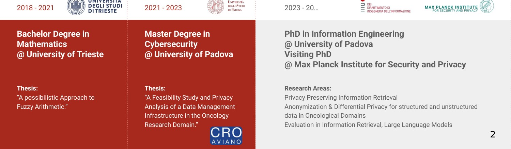

## Slide 3 - Outline

Outline

●
General Tutorship Information

●
Tutorship Project Description

●
Data Layer

●
Homework 1 - Overview

## Slide 4 - Tutorship General Information

Tutorship General Information

## Slide 5 - Tutorship?

Tutorship?

Main Goals:

●
Apply the concepts explained by the professor during lectures

●
Show you the development of a web application step-by-step
(what you should do with your team)

●
Discuss your doubts/problems/questions for the project

Feel free to ask questions related to your homeworks.

## Slide 6 - Lectures

Lectures

●
Lectures will be on Monday, 12:30-13:30, Room Ie
●
March

○
09, 16*, 23, 30 (* next time will be in Room Me)
●
April

○
06, 20, 27
●
May

○
04, 11, 18

## Slide 7 - Tutorship Roadmap

Tutorship Roadmap

~5 lectures on Backend

~5 lectures on Frontend

-
09.03 -> Data Layer

-
20.04 -> REST / AJAX

HW1 Deadline on 24.04

-
16.03 -> Git & Maven etc.

-
27.04 -> HTML

-
23.03 -> Servlets

-
04.05 -> CSS

-
30.03 -> JSPs

-
11.05 -> JS 1

-
06.04 -> MIME

-
18.05 -> JS 2

HW2 Deadline on 05.06

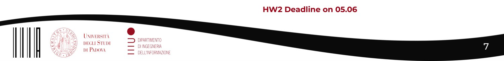

## Slide 8 - Useful links

Useful links

Code examples:

https://bitbucket.org/frrncl/webapp-unipd/src/master/

Past Year Tutorship:

A.Y. 2021/2022: https://bitbucket.org/frrncl/tutor-2022/src/master/

A.Y. 2022/2023: https://bitbucket.org/frrncl/tutor-2023/src/master/

A.Y. 2023/2024: https://bitbucket.org/frrncl/tutor-wa-2024/src/master/

A.Y. 2024/2025: https://bitbucket.org/frrncl/tutor-wa-2025/src/master/

(A. Y. 2024/2025 also for this year)

## Slide 9 - Deadlines

Deadlines

Close deadlines:

●
CRANE: HW Groups Deadline: Friday 13 March 2026!
●
HW1 Deadline: Thursday 24 April 2026

Suggestion: do not limit yourself in finding colleagues to form a
group, discuss also about the web app that you will develop
(and talk with the professor about your group idea)

## Slide 10 - Homework 1

Homework 1

Deadline: Thursday 24 April 2026
LaTeX Template: https://bitbucket.org/frrncl/wa-homework-template/src/master/

We suggest to use LaTeX there exist many plug-ins for your preferred IDEs:

IntelliJ: https://plugins.jetbrains.com/plugin/9473-texify-idea

VS-code:
https://marketplace.visualstudio.com/items?itemName=James-Yu.latex-works
hop

You can also install a LaTeX distribution locally: https://www.latex-project.org/get/

## Slide 11 - Overleaf? Probably not a good idea…

Overleaf? Probably not a good idea…

Deadline: April
LaTeX Template: https://bitbucket.org/frrncl/wa-homework-template/src/master/

We suggest to use LaTeX there exist many plug-ins for your preferred IDEs:

IntelliJ: https://plugins.jetbrains.com/plugin/9473-texify-idea

VS-code:
https://marketplace.visualstudio.com/items?itemName=James-Yu.latex-works
hop

You can also install a LaTeX distribution locally: https://www.latex-project.org/get/

## Slide 12 - What your Bitbucket Project Repo need

What your Bitbucket Project Repo need

Remember, you need to equally contribute to every part of the web
application including:

●
Back-end code (server-side)
●
Front-end code (client-side)
●
Report (HW1)
●
Slides & presentation

Your contribution are also checked through the commit history of your
bitbucket repository, thus:

●
Commit regularly the code that you produce
●
Also for the LaTeX project commit regularly

## Slide 13 - Tutorship Project

Tutorship Project

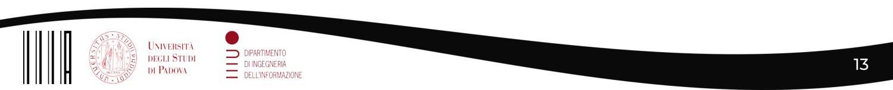

## Slide 14 - Tutorship Project - SIGIR WebApp (ACM SIGIR 25)

Tutorship Project - SIGIR WebApp (ACM SIGIR 25)

SIGIR is A* international conference for
Information Retrieval.

Those papers are categorized based on
the track to which they are submitted:

●
Full
●
Short
●
Resource & Reproducibility
●
Perspectives
●
Workshops
●
Tutorials

The submitted papers are then reviewed
and accepted/rejected.
The accepted papers must be presented
during the SIGIR conference.

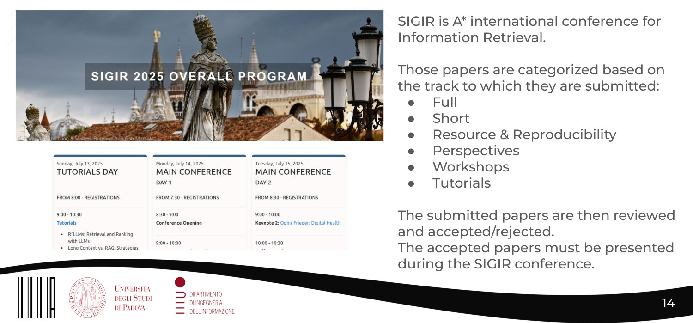

## Slide 15 - Tutorship Project - SIGIR WebApp

Tutorship Project - SIGIR WebApp

The main functions of the Web App should help us to:

●
Collect the presentations (slides) related to the papers.

●
Present the data associated to the papers and of the
related authors in a suitable and clear way.

●
Allows to keep track of the conference “program”, that is
the time, location of the various presentations and events.

## Slide 16 - Tutorship Project - SIGIR WebApp

Tutorship Project - SIGIR WebApp

Structure:

●
Data Layer (PostgreSQL)

●
Business Logic Layer (Java Servlets)

●
Presentation Layer (HTML5, CSS3, JS)

## Slide 17 - Data Layer

Data Layer

## Slide 18 - Data Layer

Data Layer

The database represents the foundations of your web application:

●
It is important to carefully design the database to have full
control over the data, independently of the other layers.
●
Note that if the database is NOT well designed, a change in the
database may lead to major changes to the other layers (or the
other way around) and security problems.
●
It is important to know how to interact with the database. This
allows to better understand the behaviour of your web app.

## Slide 19 - Data Layer

Data Layer

Therefore, the database that you design for your homeworks
should be:

●
Reasonably complex (but not too much): The DB should
allow you to solve all the real problems for the situation you
are designing the web app.

●
Consistent: Inconsistencies may lead to challenges in the
development.

## Slide 20 - SIGIR WebApp - ER schema

SIGIR WebApp - ER schema

## Slide 21 - SIGIR WebApp - ER schema

SIGIR WebApp - ER schema

A Paper belongs to a Track

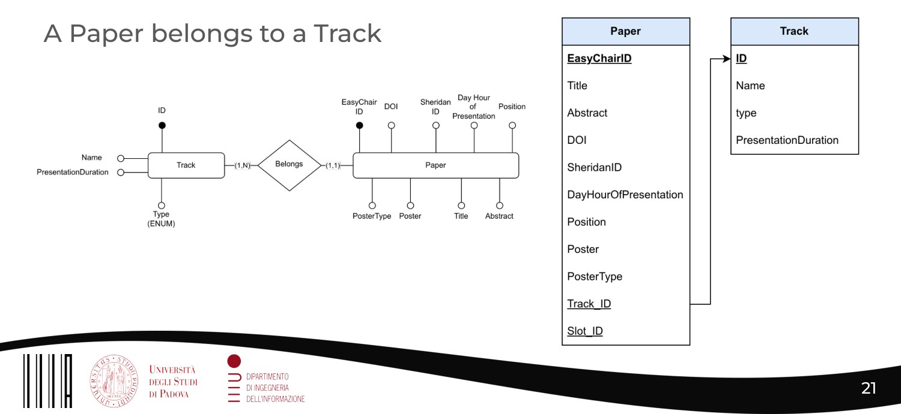

## Slide 22 - SIGIR WebApp - ER schema

SIGIR WebApp - ER schema

A Paper is
written by a
Person (Author)

Remark: The
cardinality of the
Authors is (0,N)
because there
are some special
cases.

## Slide 23 - SIGIR WebApp - ER schema

SIGIR WebApp - ER schema

 A Paper is presented by a
Person in a certain time slot.

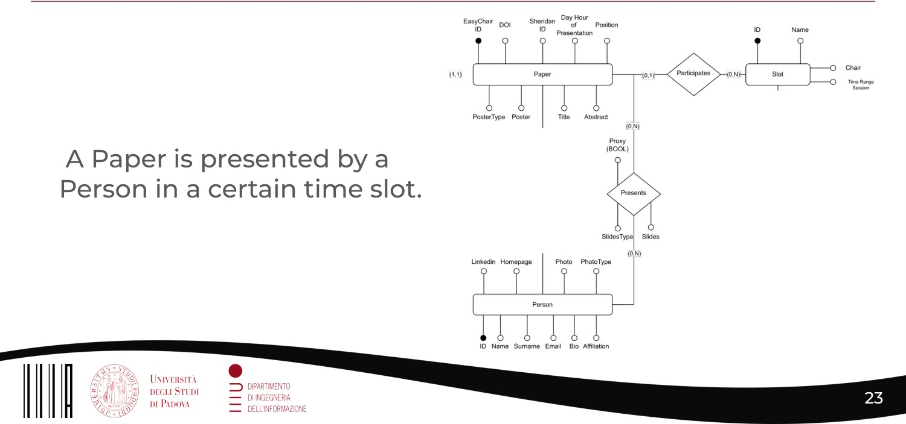

## Slide 24 - SIGIR WebApp - ER schema

SIGIR WebApp - ER schema

A Slot is associated to both a Track and a Location. The “Loop” Track->Paper->Slot->Track is
needed because there may be slots in which no paper is presented (e.g., Social Events).

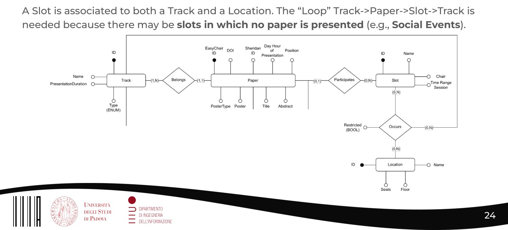

## Slide 25 - SIGIR WebApp - Logical Model

SIGIR WebApp - Logical Model

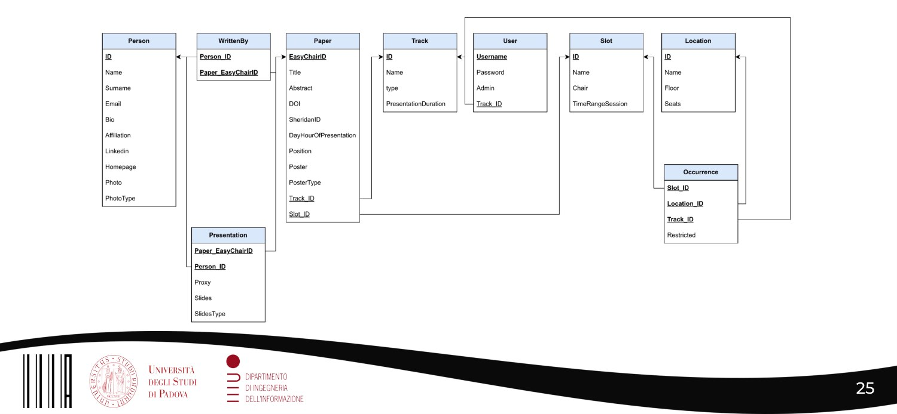

## Slide 26 - SIGIR WebApp - Physical Model

SIGIR WebApp - Physical Model

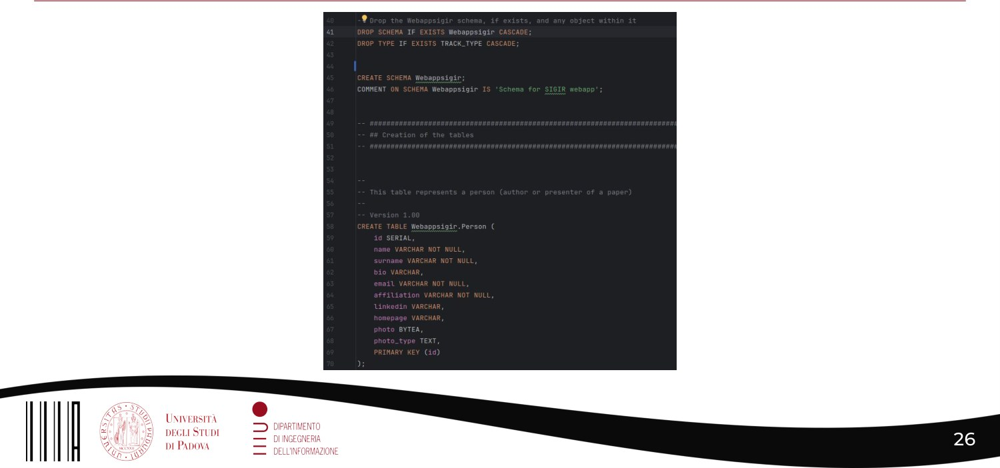

## Slide 27 - PostgreSQL - Installation

PostgreSQL - Installation

PostgreSQL represents the database server which allows to
create databases, perform queries and much more.

Download link:
https://www.enterprisedb.com/downloads/postgres-postgresql-
downloads

During the installation you will be asked to select some
components, make sure they are ALL selected.

## Slide 28 - PostgreSQL - Installation

PostgreSQL - Installation

After the installation:

●
windows→make sure that PostgreSQL bin folder has been
added to the past system variable
●
MacOS/Linux→after the installation, open a terminal and run:
export PATH=/Library/PostgreSQL/VERSION/bin:$PATH

To verify your installation and be sure that postgres has been
added to your paths run the command:
psql --version
It should return the installed version of PostgreSQL.

## Slide 29 - PostgreSQL - Managing DBs

PostgreSQL - Managing DBs

To manage our databases we have 2 options:

psql: CLI, very useful when using (remote) servers

PgAdmin: GUI, allows interaction with your DB.

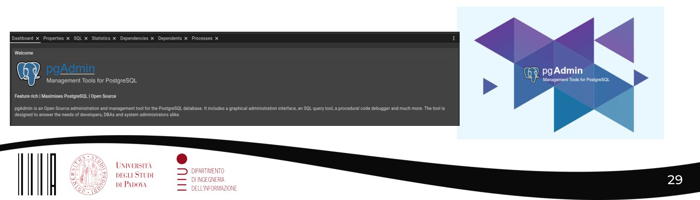

## Slide 30 - PostgreSQL - Managing DBs (psql)

PostgreSQL - Managing DBs (psql)

default: postgres

Meaning

Main psql commands

●
Connect to PostgreSQL server

●
psql -U <username>

●
\l \list

●
List the databases

●
\c <database_name>

●
Connect to database

●
\dn

●
List the schemas

●
\dt schema_name>.*

●
List the tables of a schema

●
\d <schema_name>.<table_name>

●
Get table of a schema

●
\q

●
Quit

## Slide 31 - PostgreSQL - Managing DBs (psql)

PostgreSQL - Managing DBs (psql)

●
sigir25 is the DB

●
webappsigir is the
schema

●
* is used to display all
tables

## Slide 32 - PostgreSQL - Managing DBs (psql)

PostgreSQL - Managing DBs (psql)

Dump the database:

●
.sql files → pg_dump -U postgres <db_name> <path_to_save .sql>
●
.tar files → pg_dump -U postgres <db_name> <path_to_save .sql>

Restore a database:

●
.tar files → pg_restore -d <db_name> -U postgres --verbose <path_to_tar>
●
.sql files → psql -U postgres -d <db_name> -f <path_to_sql>

Run a .sql script:

●
psql -U postgres -d <database_name> -f <path_to_sql>

## Slide 33 - PostgreSQL - Managing DBs (psql)

PostgreSQL - Managing DBs (psql)

To query the database you just need to connect to it. Then you
can type the desired query.

Login to db sigir25,
server localhost

Run a simple query to see
the available locations.

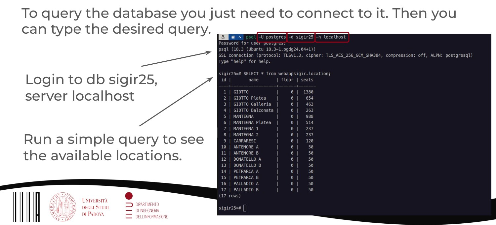

## Slide 34 - PostgreSQL - Managing DBs (PgAdmin)

PostgreSQL - Managing DBs (PgAdmin)

Connect to server

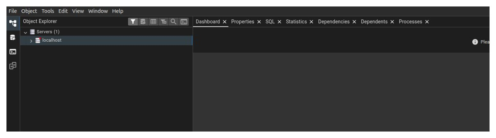

## Slide 35 - PostgreSQL - Managing DBs (PgAdmin)

PostgreSQL - Managing DBs (PgAdmin)

Create Database

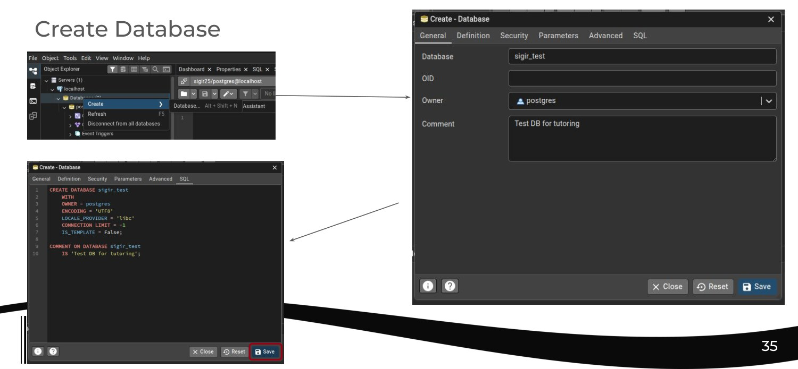

## Slide 36 - PostgreSQL - Managing DBs (PgAdmin)

PostgreSQL - Managing DBs (PgAdmin)

It is possible that you are not able to see the DB immediately. If
you do not see the database that you created: refresh

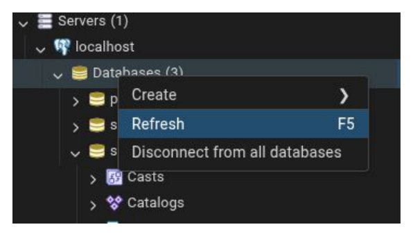

## Slide 37 - PostgreSQL - Managing DBs (PgAdmin)

PostgreSQL - Managing DBs (PgAdmin)

Create a schema
Create a table

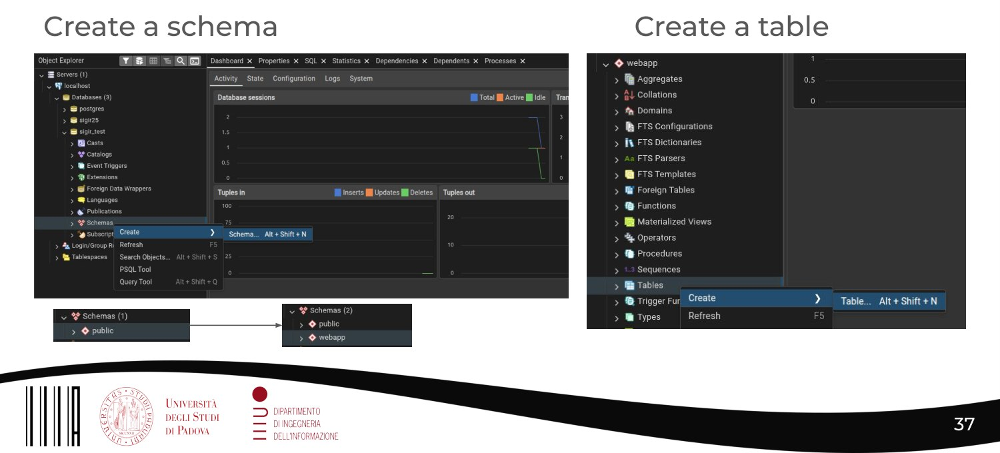

## Slide 38 - PostgreSQL - Managing DBs (PgAdmin)

PostgreSQL - Managing DBs (PgAdmin)

In the interactive mode of
creating a table you can
set:

-
name of the attribute
(id, name, aff…)
-
data type
-
if NULL
-
if Primary Key (PK)

To create table you can
also use the query tool

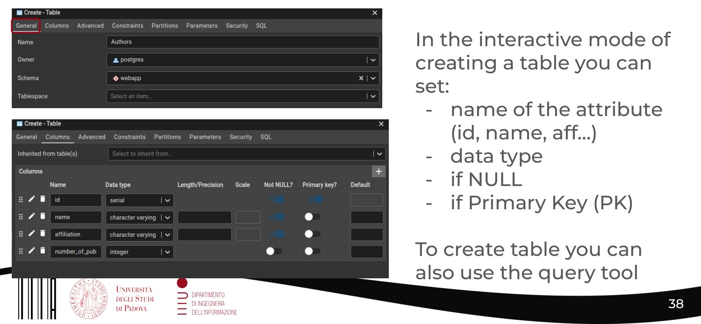

## Slide 39 - PostgreSQL - Managing DBs (PgAdmin)

PostgreSQL - Managing DBs (PgAdmin)

constraints: PK and FK

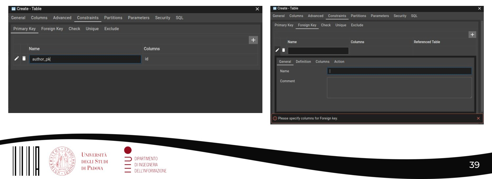

## Slide 40 - PostgreSQL - Managing DBs (PgAdmin)

PostgreSQL - Managing DBs (PgAdmin)

querying

log messages
are displayed
below the shell

(remember to
refresh in case)

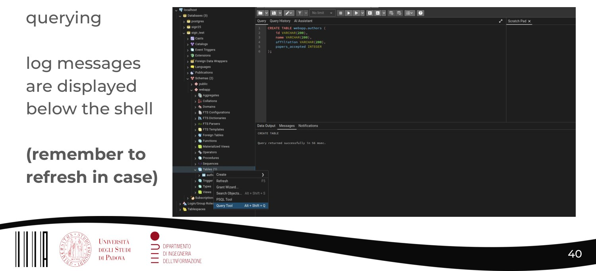

## Slide 41 - Homework 1 - Overview

Homework 1 - Overview

## Slide 42 - HW1 - Overview

HW1 - Overview

Objectives:

Briefly describe the objectives of your web application. Why is it useful/important? Who are
the users? Do not be too detailed in this section, be concise and effective at the same time.

Example:

SIGIR’s webapp is a web application whose main goal is to ease the collection and
management of the presentations (slides and posters) related to the papers accepted for
publication in the context of the SIGIR conference. This project aims at providing authors
with a platform suitable for uploading their data, including personal data and slides or
posters; on the other hand it should allow to manage the presentations by keeping track of
the presenters, the time and the location of conference events.

## Slide 43 - HW1 - Overview

HW1 - Overview

Main Functionalities

Describe in details what your web application is supposed to do,
and what their users will be able to do. Try to be detailed in this
section when you describe all the functionalities.

Example: The authors of a paper are allowed to upload their
slides or posters that they use to present their paper. Moreover,
they can upload their photo, bio and homepage/LinkedIn links
whichallow to provide more detailed information about an
author. [...]

## Slide 44 - HW1 - Overview

HW1 - Overview

Data Logic Layer

Describe the database of your web application. Describe the
entities of your schema, providing, when needed, information
about identifiers,attributes’ data type.

Business Logic Layer

Report and describe the class diagram and the sequence
diagram (you will see them in details in the next lessons)

## Slide 45 - HW1 - Overview

HW1 - Overview

Presentation Logic Layer

Describe the pages of your web applications (e.g., login page,authors’ upload page, etc.).
Describe each page in detail, providing information about the content of the web page, the
information displayed, and what actions can be performed (e.g., insert new data about a
paper). For each web page you plan to introduce, provide also an interface mockup, which
is an image representing how you plan to implement the web page.

Suggestion: Balsamiq (https://balsamiq.com/)

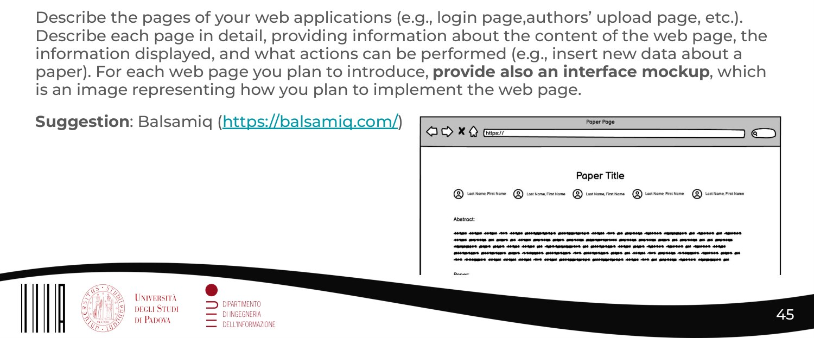

## Slide 46 - HW1 - Overview

HW1 - Overview

Group Members Contribution Section

Log everything you do as you do it. The professor looks at your commits and
reads this section to evaluate the individual contribution of each one of you.

You are expected to code, write and commit everything in you personal
repository along the project.

NOT TO DO:

●
Commit everything at the end (One “Big” commit before the HW deadline)

●
Separation of labour in writing & coding teams
(all of you needs to code and write for participating to the project)

