# Git and Maven

_Source: `03-webapp-2025-26-git-maven.pdf`_

## Slide 1 - Git and Maven

**Git and Maven**

- Course: **Web Applications**
- Master Degree in Computer Engineering
- Master Degree in Cybersecurity
- Master Degree in ICT for Internet and Multimedia
- Academic Year: 2025/2026
- Lecturer: Nicola Ferro
- Affiliation: Intelligent Interactive Information Access (IIIA) Hub

## Slide 2 - Outline

- Introduction to Git
- Introduction to Maven
- Use of Maven to compile, package, and document applications

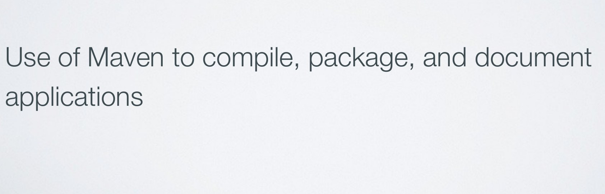

## Slide 3 - Git


## Slide 4 - Git

Git homepage: https://git-scm.com/

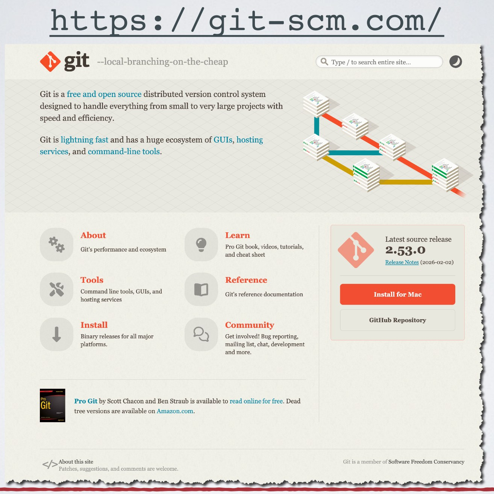

## Slide 5 - Source Code Management

A version control system manages the versions, called **revisions**, of files and
directories.

It also manages conflicts, for example when the same file is edited concurrently, and
their resolution through merge.

**Centralized approach** (`cvs`, `svn`):

- A single central repository manages all the versions of files and directories, allowing
  us to keep track of all the changes over time.
- The client uses a local copy of the files and keeps synchronization with the central
  repository.

**Distributed approach** (`git`):

- The local copy of every client is a complete repository.
- Synchronization happens by exchanging patches among peers.

Code development is modeled as a directed graph where, from the main development line
(`master`), alternative development lines (`branch`) and/or stable versions (`tag`) can
depart and join.

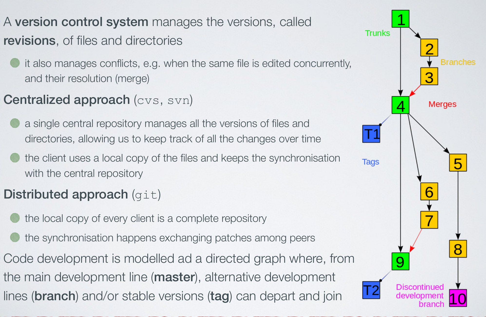

## Slide 6 - Git: Creation of a New Repository

To create a new repository, create a new folder on your disk and, within that folder, run:

```bash
git init
```

To create a local copy of an existing repository, called checkout:

```bash
git clone username@host:/path/to/repos
```

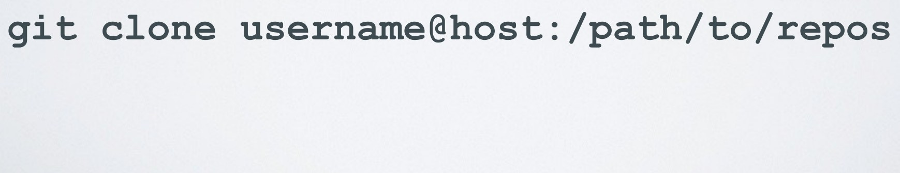

## Slide 7 - Cloning an Empty Bitbucket Repository

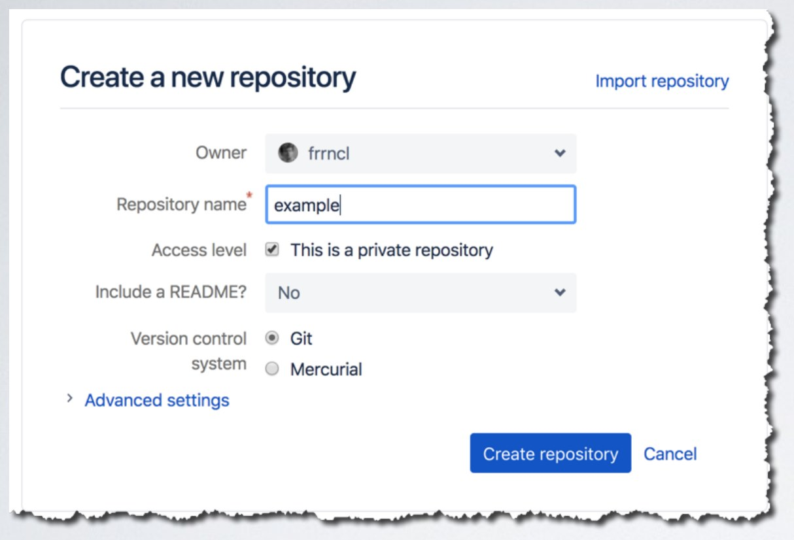

## Slide 8 - Cloning an Empty Bitbucket Repository

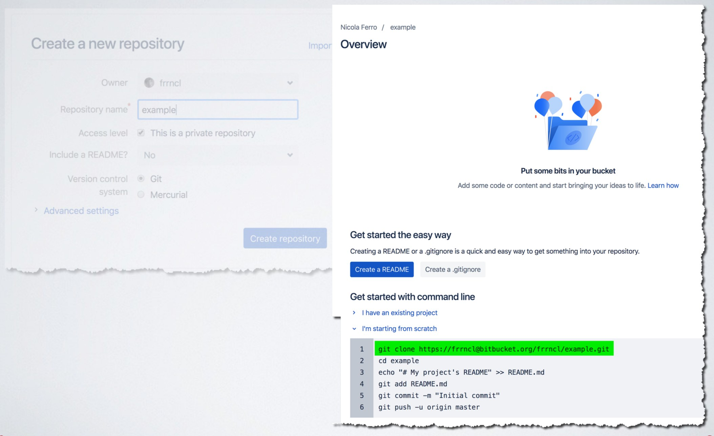

## Slide 9 - Cloning an Empty Bitbucket Repository

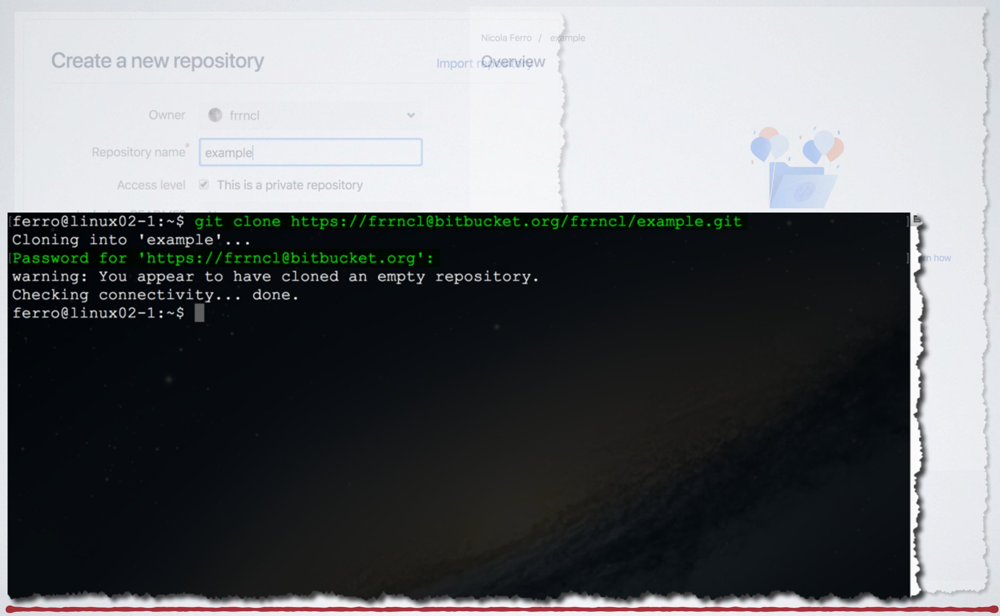

## Slide 10 - Workflow

The local copy of a repository consists of three trees:

- **Working directory:** keeps the actual files and directories, which may or may not be
  unversioned.
- **Index:** a staging area.
- **HEAD:** represents the last commit made.

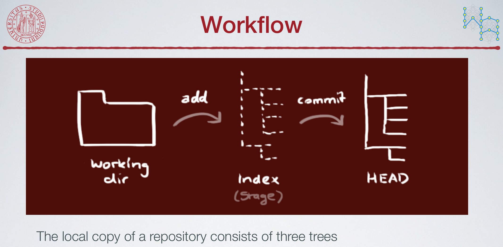

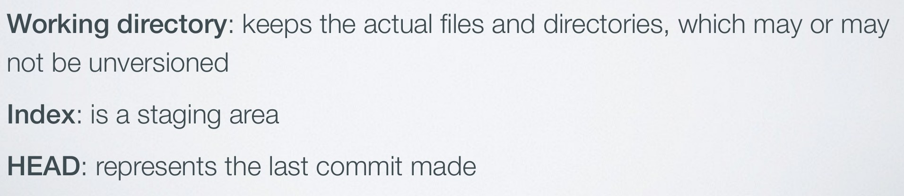

## Slide 11 - Add and Commit

You can add files/directories to the Index by running:

```bash
git add <filename>
```

You can confirm updates and add them to the HEAD by running:

```bash
git commit -m "Description"
```

You can send committed updates to a remote server by running:

```bash
git push origin master
```

Where:

- `master`, or any other name, is the repository branch to send to the remote server.
- `origin` indicates the default remote repository, for example the one from which we
  cloned the repository.

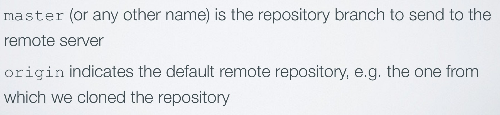

## Slide 12 - Branch

Branches are used to develop independent features, for example new versions of a
software.

The `master` branch is the default one when you create a new repository.

The other branches may be merged into the `master` branch when appropriate.

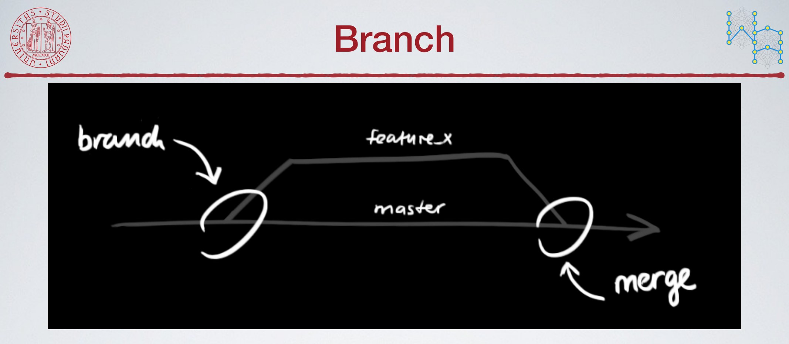


## Slide 13 - Branch Management

To create a new branch:

```bash
git checkout -b <branch-name>
```

To get back to the `master` branch, or any other branch name:

```bash
git checkout master
```

To send a branch to the remote repository:

```bash
git push origin <branch-name>
```

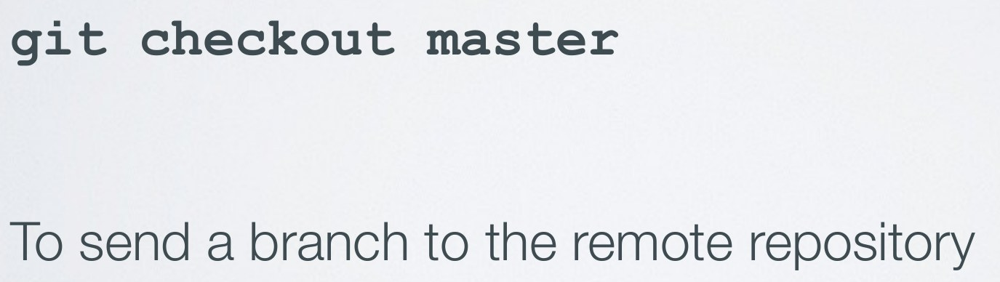

## Slide 14 - Update and Merge

To update a local repository from a remote one:

```bash
git pull origin <branch-name>
```

To merge a branch into the currently selected one:

```bash
git merge <branch-name>
```

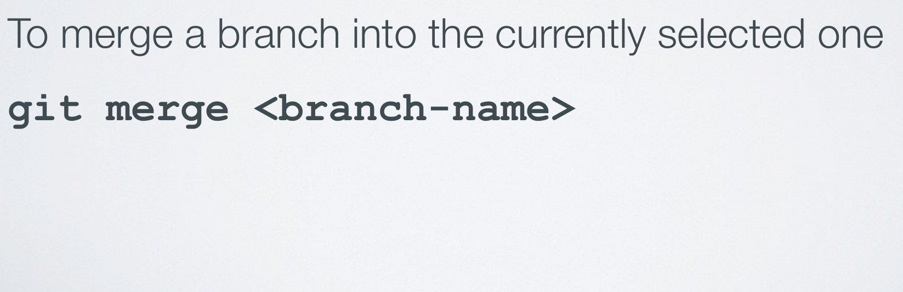

## Slide 15 - Pull Requests

Development platforms, such as GitHub and Bitbucket, provide pull requests as a
mechanism to foster collaboration among developers.

Pull requests are a mechanism for a developer to notify team members that they have
completed a feature.

Once their feature branch is ready, the developer files a pull request. This lets
everybody involved know that they need to review and discuss the code and, eventually,
merge it into the `master` branch.

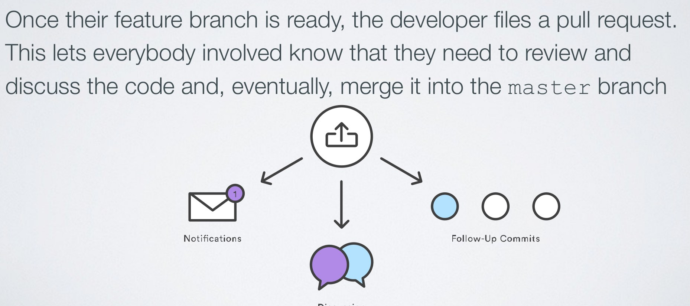

## Slide 16 - The .gitignore File

The `.gitignore` file has to be put in the root folder of your development tree.

It specifies intentionally untracked files that Git should ignore.

Each line in a `.gitignore` file specifies a pattern to be matched to decide whether to
exclude files and/or directories.

Reference: https://git-scm.com/docs/gitignore

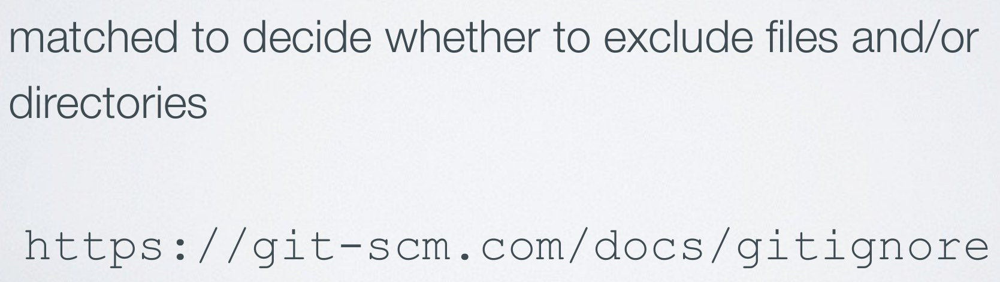

## Slide 17 - Example of .gitignore File

Example of a `.gitignore` file:

```gitignore
# IntelliJ Idea
*.iml
.idea/

# Package Files
*.jar
*.war
*.ear
*.zip
*.tar.gz
*.rar

# Java
*.class
target/
javadoc/

### OSX ###
log/
.DS_Store
```

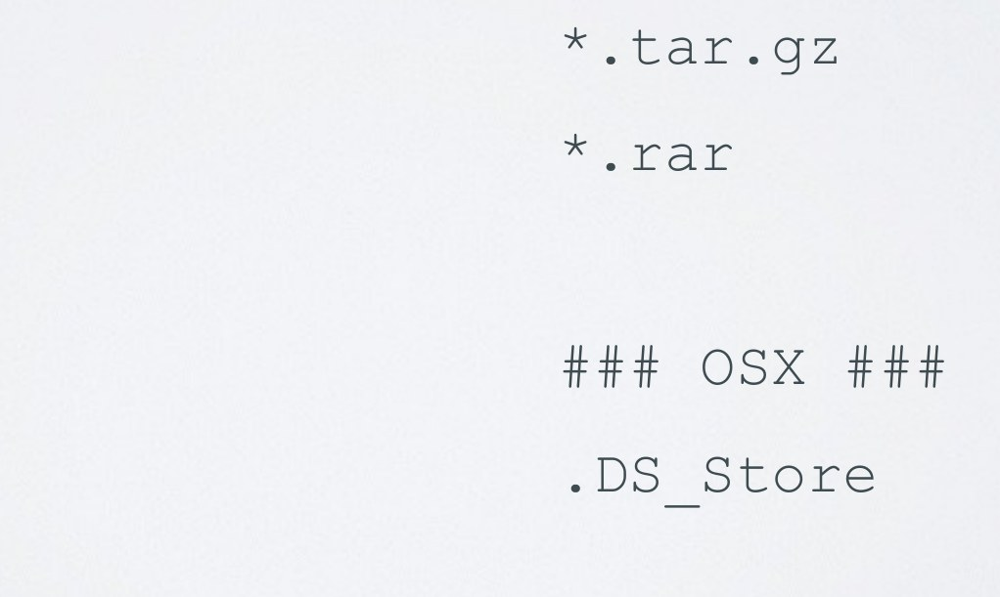

## Slide 18 - The README File

The `README` file has to be put in the root folder of your development tree.

It provides overall information about your project, which is displayed on its web page.

You can use Markdown syntax to format it:
https://bitbucket.org/tutorials/markdowndemo

Example of `README.md` file:

```markdown
# Web Applications (webapp)

This directory contains the source code distribution complementing the lectures.

Web Applications lectures are held at:

* Master Degree in Computer Engineering
* Master Degree in ICT for Internet and Multimedia
* Master Degree in Cybersecurity

of the Department of Information Engineering, University of Padua, Italy

Copyright and license information can be found in the file LICENSE.
Additional information can be found in the file NOTICE.
```

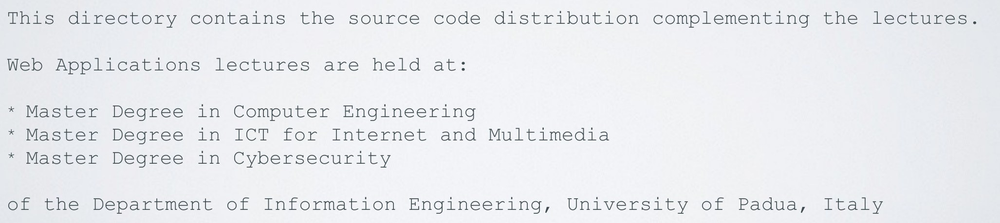

## Slide 19 - Examples of Code

All the code examples are available in the following Bitbucket repository:

https://bitbucket.org/frrncl/webapp-unipd

You can clone it and pull from it as it gets updated.


## Slide 20 - Maven


## Slide 21 - Maven

Maven, a Yiddish word meaning "accumulator of knowledge", was originally started as an
attempt to simplify the build processes in the Jakarta Turbine project, a servlet-based
framework to build secure web applications.

Maven is a tool for managing Java software projects and supporting developers in keeping
track of the status of a project:

- build;
- dependency management;
- deployment and packaging;
- collaboration and documentation.

Advantages:

- **Coherence:** standardization of the management of Java projects, increased
  transparency, and reduced time to get an understanding of the different projects of an
  organization.
- **Reuse:** similar projects can reuse and extend the setup of previous projects.
- **Simplicity:** simplification of the creation and integration of new components as
  well as of the sharing of packages and executables. Moreover, the learning curve for
  each project is reduced.
- **Maintenance:** reduced effort and resources to keep building scripts as well as
  development and deployment environments.

## Slide 22 - Maven Homepage

Maven homepage: http://maven.apache.org/

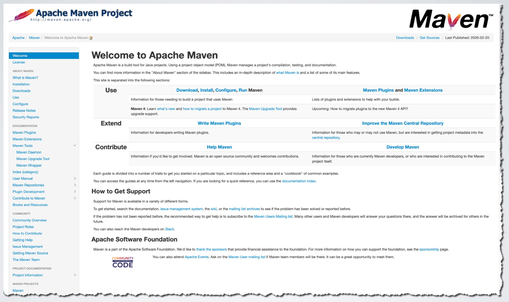

## Slide 23 - Maven: Main Concepts

Software development happens according to a life cycle made up of phases.

Zero or more goals are associated with each phase, and they are the operations actually
carried out in that phase.

Goals are implemented by means of plugins, and each plugin may implement one or more
goals.

The **Project Object Model (POM)** is a single XML file that puts together, in a
declarative way, phases, goals, and plugins for a project.

Diagram elements:

- Phase 1, Phase 2, Phase 3, ..., Phase N
- Plugin 1, Plugin 2, Plugin 3, Plugin 4
- Goal A, Goal B, Goal C, Goal D, Goal E, Goal F
- POM

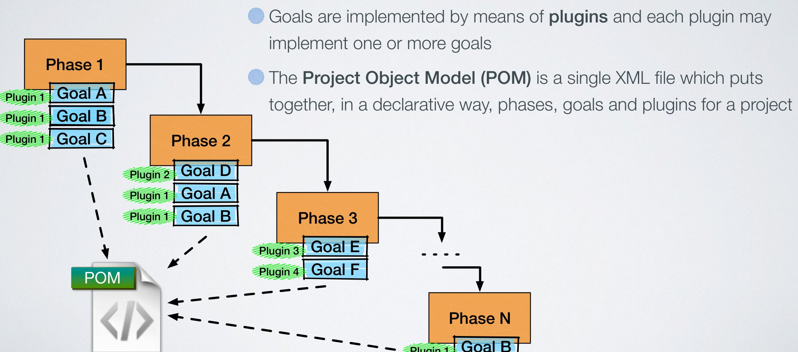

## Slide 24 - Build Lifecycle

A build lifecycle is needed to create, compile, integrate, test, and distribute a
software project.

The phases of a lifecycle are executed in sequence to complete that lifecycle:

- If you invoke an intermediate phase of a lifecycle, all the phases up to that phase
  will be executed.
- If you invoke the last phase, all the phases will be executed.

There are three predefined build lifecycles:

- **clean:** manages the cleaning of the project, that is, it deletes all the files
  generated by a build.
- **default:** manages the whole development of the project.
- **site:** manages the creation of a project site and of the documentation.

## Slide 25 - The Default Build Lifecycle

The default build lifecycle is organized into the following groups and phases.

**Setup of the project**

- `validate`: validates the project is correct and all necessary information is
  available.
- `initialize`: initializes build state, for example sets properties or creates
  directories.

**Source processing**

- `generate-sources`: generates any source code for inclusion in compilation.
- `process-sources`: processes the source code, for example to filter any values.
- `generate-resources`: generates resources for inclusion in the package.
- `process-resources`: copies and processes the resources into the destination
  directory, ready for packaging.
- `compile`: compiles the source code of the project.
- `process-classes`: post-processes the generated files from compilation, for example to
  do bytecode enhancement on Java classes.

**Testing**

- `generate-test-sources`: generates any test source code for inclusion in compilation.
- `process-test-sources`: processes the test source code, for example to filter any
  values.
- `generate-test-resources`: creates resources for testing.
- `process-test-resources`: copies and processes the resources into the test destination
  directory.
- `test-compile`: compiles the test source code into the test destination directory.
- `process-test-classes`: post-processes the generated files from test compilation, for
  example to do bytecode enhancement on Java classes.
- `test`: runs tests using a suitable unit testing framework. These tests should not
  require the code to be packaged or deployed.

**Packaging**

- `prepare-package`: performs any operations necessary to prepare a package before the
  actual packaging.
- `package`: takes the compiled code and packages it in its distributable format, such
  as a JAR.

**Integration**

- `pre-integration-test`: performs actions required before integration tests are
  executed. This may involve things such as setting up the required environment.
- `integration-test`: processes and deploys the package, if necessary, into an
  environment where integration tests can be run.
- `post-integration-test`: performs actions required after integration tests have been
  executed. This may include cleaning up the environment.

**Deployment**

- `verify`: runs any checks to verify the package is valid and meets quality criteria.
- `install`: installs the package into the local repository, for use as a dependency in
  other projects locally.
- `deploy`: done in an integration or release environment; copies the final package to
  the remote repository for sharing with other developers and projects.

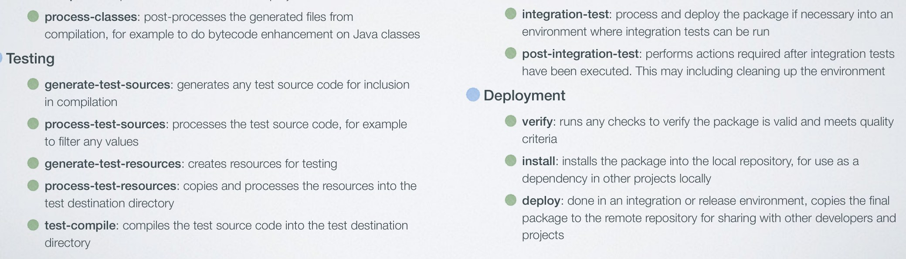

## Slide 26 - Default Build Lifecycle for JAR Packages

Default build lifecycle for JAR packages:

| Phase | Goal | Plugin |
|---|---|---|
| `process-resources` | `resources` | `resources` |
| `compile` | `compile` | `compiler` |
| `process-test-resources` | `testResources` | `resources` |
| `test-compile` | `testCompile` | `compile` |
| `test` | `test` | `surefire` |
| `package` | `jar` | `jar` |
| `install` | `install` | `install` |
| `deploy` | `deploy` | `deploy` |

The POM configures this lifecycle.

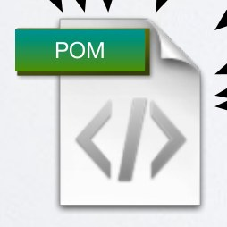

## Slide 27 - Project Object Model (POM)

The **Project Object Model (POM)** contains several groups of information.

**Relationships**

- Defines the structure of the project through coordinates and modules.
- Defines relationships with other projects through inheritance.
- Defines dependencies on other projects and libraries.
- Includes:
  - Coordinates: `groupId`, `artifactId`, `version`
  - Multi-Module
  - Inheritance
  - Dependencies

**General project information**

- Maintains general information about the project, such as:
  - project name;
  - project website;
  - organization developing the project;
  - developers;
  - licenses;
  - contributors.

**Build settings**

- Customizes the default build lifecycle by adding goals and plugins to the different
  phases.
- Stores information about source, test, and resources.
- Includes:
  - Build;
  - Directories;
  - Extensions;
  - Resources;
  - Plugins;
  - Reporting.

**Build environment**

- Defines profiles corresponding to different environments and/or operating systems.
- Includes:
  - Environment Information;
  - Maven Environment;
  - Profiles.

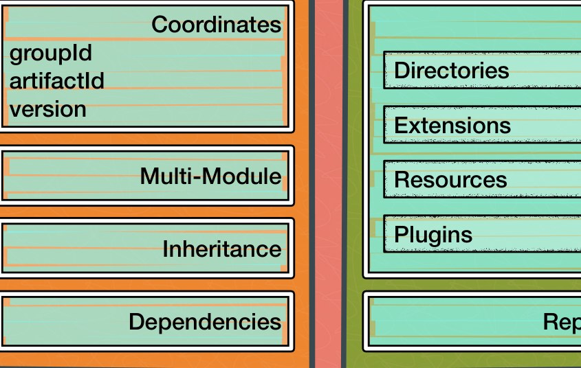

## Slide 28 - Maven Repositories

Maven repositories and local caches:

- Maven Central Repository
- Sonatype Repository
- Other repositories
- Local cache

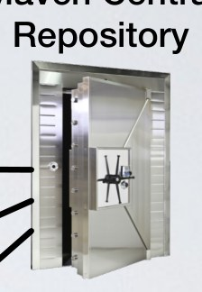

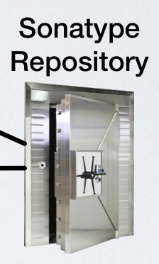

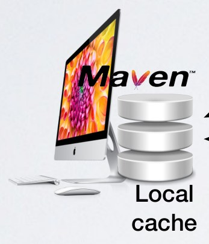

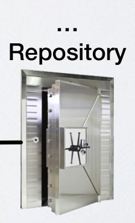

## Slide 29 - Setting up Maven: the settings.xml File

The `settings.xml` file contains the overall configuration for Maven:

- where to store the local cache for libraries and plugins;
- the configuration about a local repository, if any, and credentials to access it.

The `settings.xml` file has to be saved in the `.m2` folder in each user's home
directory. If it does not already exist, you need to create it.


## Slide 30 - Example of settings.xml

Example of `settings.xml`:

```xml
<settings xmlns="http://maven.apache.org/SETTINGS/1.0.0"
          xmlns:xsi="http://www.w3.org/2001/XMLSchema-instance"
          xsi:schemaLocation="http://maven.apache.org/SETTINGS/1.0.0
                              http://maven.apache.org/xsd/settings-1.0.0.xsd">

  <localRepository>/Users/ferro/.m2/repository</localRepository>

</settings>
```

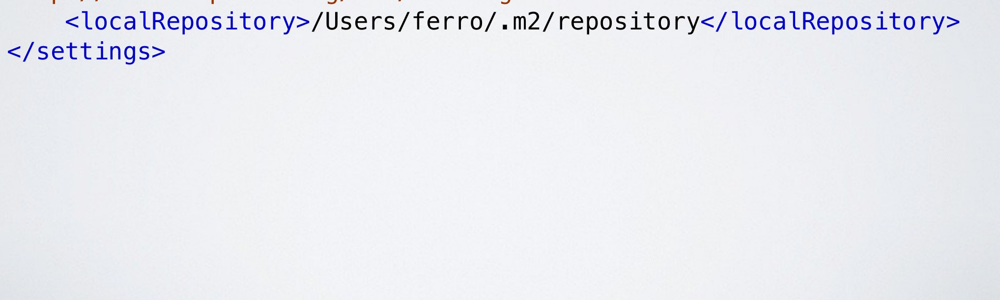

## Slide 31 - Running Maven

General syntax:

```bash
mvn [options] [<goal(s)>] [<phase(s)>]
```

- **Phase:** one or more phase names according to the available build lifecycles.
- Remember that all the phases up to the selected one(s) will be executed.
- **Goal:** one or more goal names to be executed.
- Goal names have the following format:

```text
<plugin-name>:<goal-name>
```

For example, the following command:

```bash
mvn clean deploy checkstyle:check
```

Does the following:

- invokes the `clean` phase of the `clean` build lifecycle;
- invokes the `deploy` phase, and all the phases before it, of the `default` build
  lifecycle;
- invokes the `check` goal of the `checkstyle` plugin.

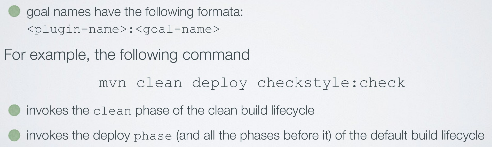

## Slide 32 - First Application without Dependencies Using Maven


## Slide 33 - Main Steps

Main steps:

1. Only once: configure the `settings.xml` file in the `.m2` folder.
2. Create a repository in Bitbucket for your application.
3. Clone that repository on your local machine.
4. Add appropriate `.gitignore` and `README`/`README.md` files.
5. Create the directory structure and POM file, add source files, etc.
6. Build and package with Maven.
7. Generate Javadoc.
8. Push to the repository.

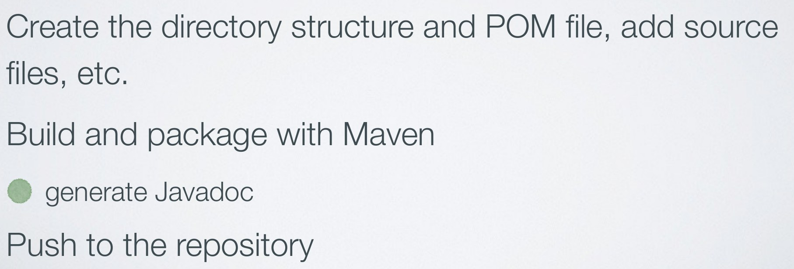

## Slide 34 - Setup the Project Directory Structure

Project directory structure:

```text
src/
  main/
    database/
    java/
    resources/
    webapp/
  test/
javadoc/
target/
```

Meaning of the directories:

- `src`: development version.
- `main`: sources for the main application.
- `database`: sources for the database, for example schema creation SQL.
- `java`: sources for the Java application.
- `resources`: any additional application resource, for example property files.
- `webapp`: sources for the web application, for example HTML, CSS, JS.
- `test`: sources for the test, for example JUnit.
- `javadoc`: documentation.
- `target`: folder for compiled code and packages.

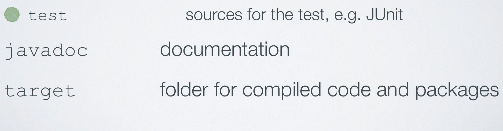

## Slide 35 - Project Object Model (POM)

POM fragment:

```xml
<?xml version="1.0"?>

<project xmlns="http://maven.apache.org/POM/4.0.0"
         xmlns:xsi="http://www.w3.org/2001/XMLSchema-instance"
         xsi:schemaLocation="http://maven.apache.org/POM/4.0.0
                             http://maven.apache.org/xsd/maven-4.0.0.xsd">
  <modelVersion>4.0.0</modelVersion>

  <groupId>it.unipd.dei.webapp</groupId>
  <artifactId>hello-world</artifactId>
  <version>1.00</version>
  <packaging>jar</packaging>

  <!-- Project description elements -->
  <name>Hello World</name>
  <description>Writes "Hello, world!" on the console</description>

  <url>http://www.dei.unipd.it/en/</url>
  <inceptionYear>2018</inceptionYear>

  <developers>
    <developer>
      <id>nf</id>
      <name>Nicola Ferro</name>
      <email>ferro@dei.unipd.it</email>
      <url>http://www.dei.unipd.it/~ferro/</url>
    </developer>
  </developers>

  <licenses>
    <license>
      <name>The Apache Software License, Version 2.0</name>
      <url>http://www.apache.org/licenses/LICENSE-2.0.txt</url>
      <distribution>repo</distribution>
    </license>
  </licenses>

  <organization>
    <name>Department of Information Engineering (DEI), University of Padua, Italy</name>
    <url>http://www.dei.unipd.it/en/</url>
  </organization>
```

Coordinates of the project:

- `groupId`: a unique id of the producer of the project, for example the domain name of
  the company.
- `artifactId`: the name of the project.
- `version`: the version of the project.
- `packaging`: how to package the project; `jar` for desktop applications, `war` for
  web applications.

Various optional description elements about the project:

- the year the project started;
- the developers involved;
- the type of license;
- the organization running the project.

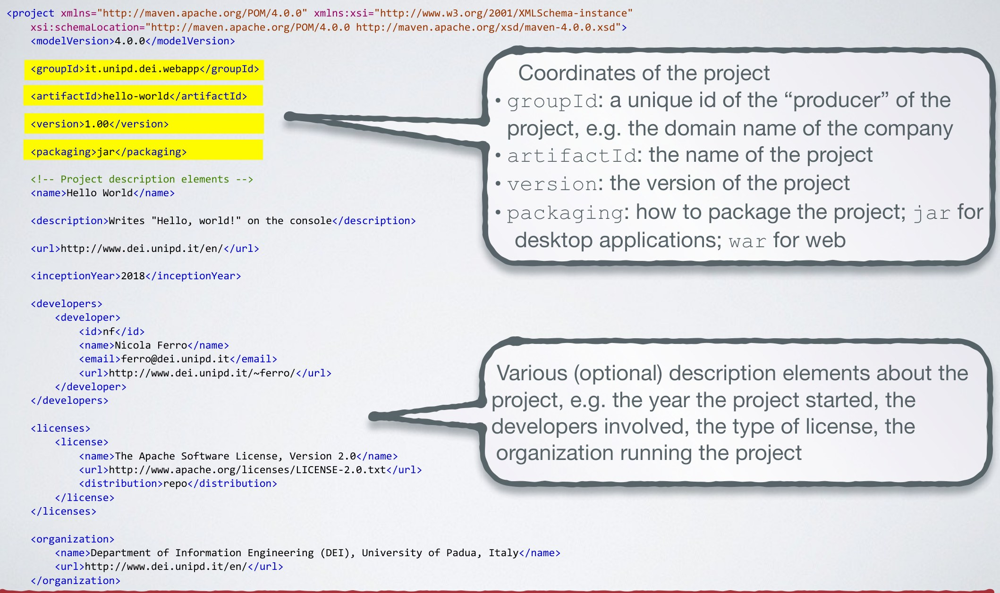

## Slide 36 - Project Object Model (POM)

Continuation of the project file:

```xml
  <!-- Specifies the encoding to be used for project source files -->
  <properties>
    <project.build.sourceEncoding>UTF-8</project.build.sourceEncoding>
  </properties>

  <!-- Configuration of the default build lifecycle -->
  <build>
    <defaultGoal>compile</defaultGoal>

    <!-- source code folder -->
    <sourceDirectory>${basedir}/src/main/java</sourceDirectory>

    <!-- compiled code folder -->
    <directory>${basedir}/target</directory>

    <!-- name of the generated package -->
    <finalName>${project.artifactId}-${project.version}</finalName>

    <!-- configuration of the plugins for the different goals -->
    <plugins>
      <!-- compiler plugin: source and target code is for Java 1.8 -->
      <plugin>
        <groupId>org.apache.maven.plugins</groupId>
        <artifactId>maven-compiler-plugin</artifactId>
        <version>3.7.0</version>
        <configuration>
          <source>1.8</source>
          <target>1.8</target>
        </configuration>
      </plugin>

      <!-- javadoc plugin: output in the javadoc folder -->
      <plugin>
        <groupId>org.apache.maven.plugins</groupId>
        <artifactId>maven-javadoc-plugin</artifactId>
        <version>3.0.0</version>
        <configuration>
          <reportOutputDirectory>${basedir}/javadoc</reportOutputDirectory>
          <author>true</author>
          <nosince>false</nosince>
          <show>protected</show>
        </configuration>
      </plugin>
    </plugins>
  </build>
</project>
```

Notes from the slide:

- Source input and compiled output folders can be omitted if the default directory
  structure is used: convention over configuration.
- `<finalName>` defines the name of the generated JAR/WAR package file.
- `<sourceDirectory>` and `<directory>` define source code and generated class files.
- Javadoc plugin configuration:
  - `reportOutputDirectory`: where to write the generated Javadoc.
  - `author`: whether to print the `@author` tag.
  - `nosince`: whether to print the `@since` tag.
  - `show`: the scope of methods/variables that has to be reported.

## Slide 37 - The HelloWorld Class

```java
package it.unipd.dei.webapp;

/**
 * Sample class to say "Hello, world".
 *
 * @author Nicola Ferro (ferro@dei.unipd.it)
 * @version 1.0
 * @since 1.0
 */
public class HelloWorld {

  /**
   * Main method of the class.
   *
   * Just prints "Hello, world!".
   *
   * @param args input arguments from the command line, if any.
   */
  public static void main(String[] args) {
    System.out.printf("Hello, world!%n");
  }
}
```

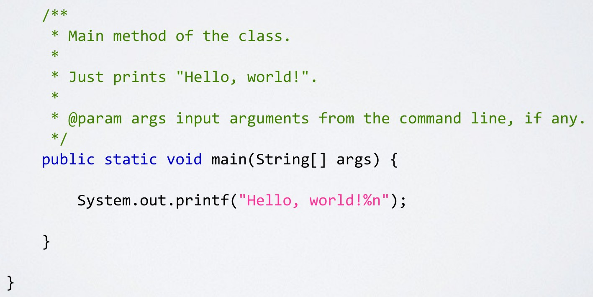

## Slide 38 - Cleaning, Compiling, Packaging, Documenting, and Running

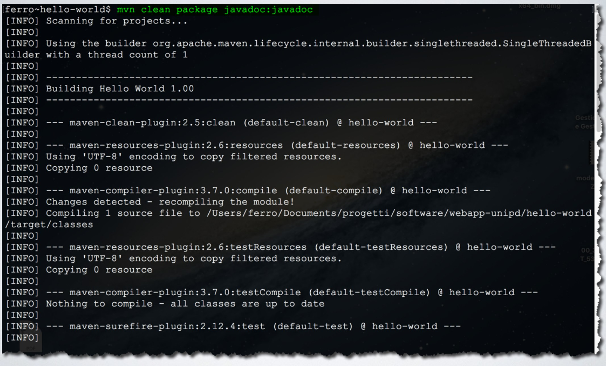

## Slide 39 - Cleaning, Compiling, Packaging, Documenting, and Running

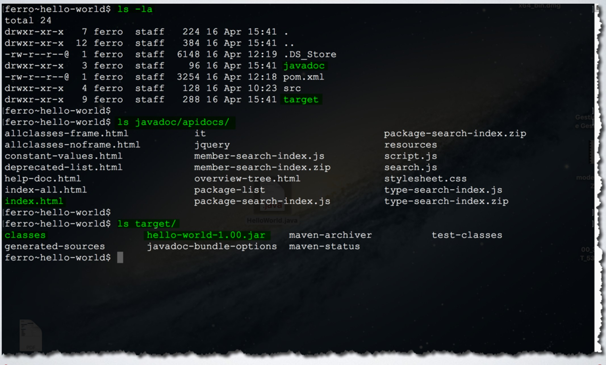

## Slide 40 - Cleaning, Compiling, Packaging, Documenting, and Running

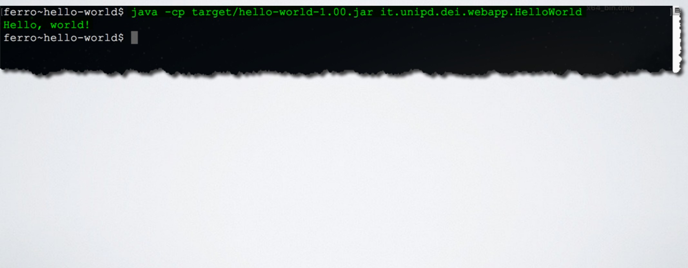

## Slide 41 - Cleaning, Compiling, Packaging, Documenting, and Running

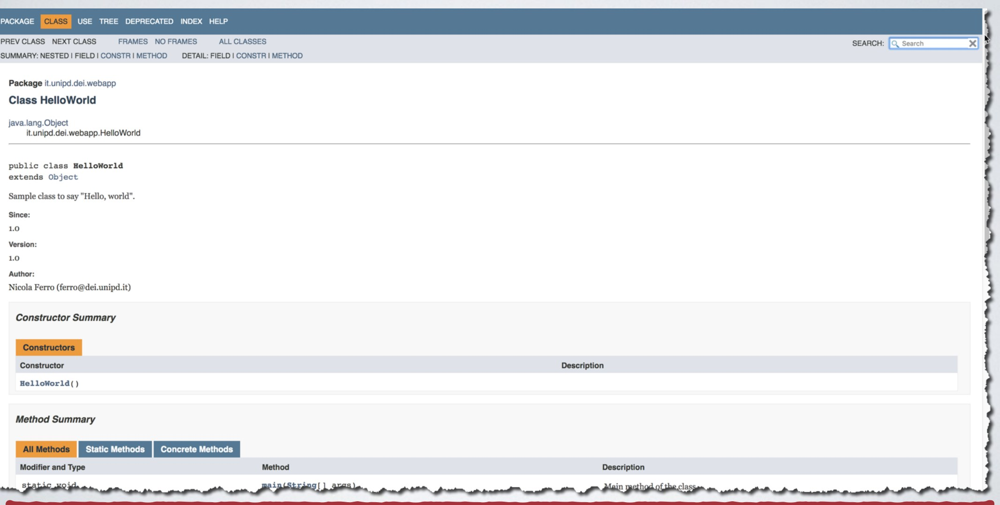

## Slide 42 - First Application with Dependencies Using Maven

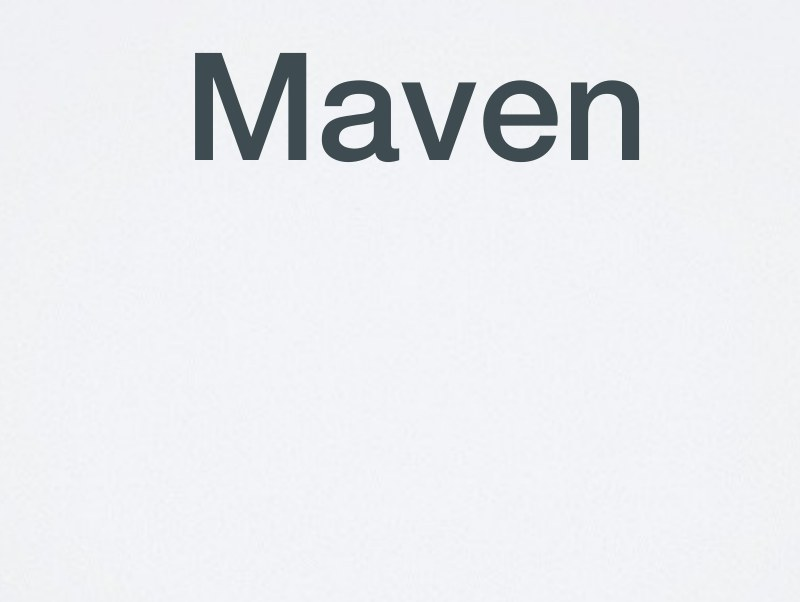

## Slide 43 - JFigLet

JFigLet repository: https://github.com/dtmo/jfiglet

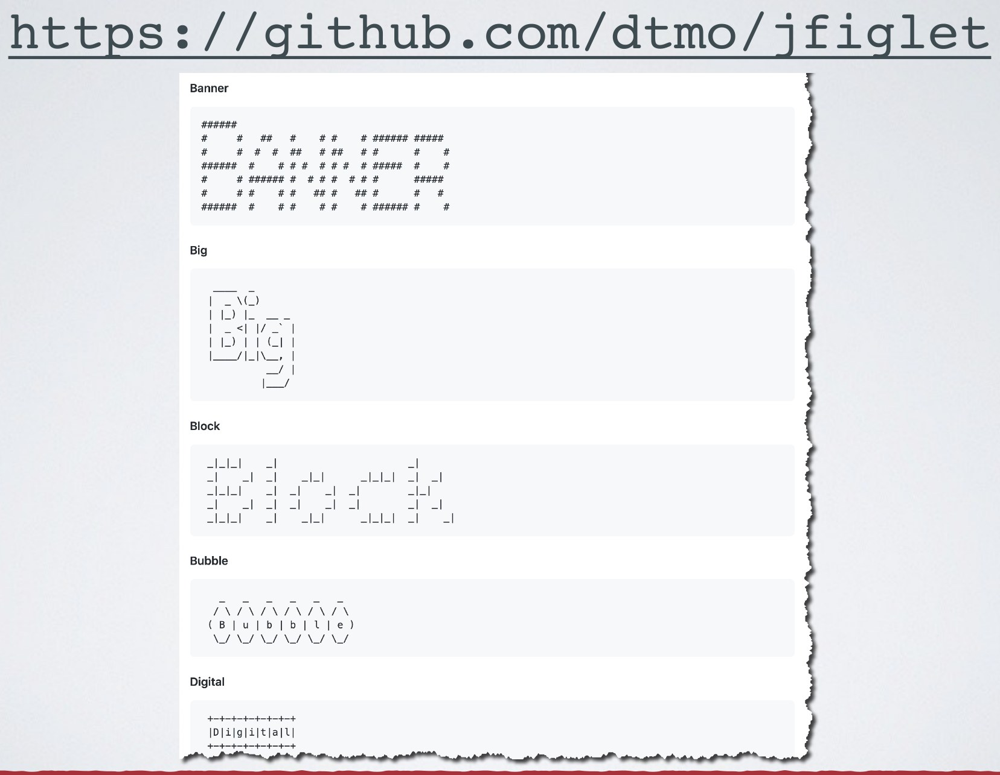

## Slide 44 - The HelloWorldFigLet Class

Notes from the slide:

- Print help and exit if there are no arguments.
- Store the name of the Figlet font to be used.
- Parse the command line to select the proper Figlet font name or throw an error.
- Create a new Figlet renderer, render the `"Hello, world!"` string, and print it to
  the terminal.

```java
package it.unipd.dei.webapp;

import com.github.dtmo.jfiglet.FigFontResources;
import com.github.dtmo.jfiglet.FigletRenderer;

import java.io.IOException;

public class HelloWorldFiglet {

  public static void main(String[] args) throws IOException {

    // name of the font to be used
    final String font;

    if (args.length == 0) {
      System.out.printf("Please, pick one of the following Figlet fonts:%n");
      System.out.printf("- Banner%n");
      System.out.printf("- Big%n");
      System.out.printf("- Block%n");
      System.out.printf("- Bubble%n");
      System.out.printf("- Digital%n");
      System.out.printf("- Ivrit%n");
      System.out.printf("- Lean%n");
      System.out.printf("- Mini%n");
      System.out.printf("- Mnemonic%n");
      System.out.printf("- Script%n");
      System.out.printf("- Shadow%n");
      System.out.printf("- Slant%n");
      System.out.printf("- Small%n");
      System.out.printf("- SmScript%n");
      System.out.printf("- SmShadow%n");
      System.out.printf("- SmSlant%n");
      System.out.printf("- Standard%n");
      System.out.printf("- Terminal%n");

      System.exit(0);
    }

    // "parse" the command line and set the proper Figlet font name or throw an error
    switch (args[0].trim().toLowerCase()) {
      case "banner":
        font = FigFontResources.BANNER_FLF;
        break;
      case "big":
        font = FigFontResources.BIG_FLF;
        break;
      case "block":
        font = FigFontResources.BLOCK_FLF;
        break;
      case "bubble":
        font = FigFontResources.BUBBLE_FLF;
        break;
      case "digital":
        font = FigFontResources.DIGITAL_FLF;
        break;
      case "ivrit":
        font = FigFontResources.IVRIT_FLF;
        break;
      case "lean":
        font = FigFontResources.LEAN_FLF;
        break;
      case "mini":
        font = FigFontResources.MINI_FLF;
        break;
      case "mnemonic":
        font = FigFontResources.MNEMONIC_FLF;
        break;
      case "script":
        font = FigFontResources.SCRIPT_FLF;
        break;
      case "shadow":
        font = FigFontResources.SHADOW_FLF;
        break;
      case "slant":
        font = FigFontResources.SLANT_FLF;
        break;
      case "small":
        font = FigFontResources.SMALL_FLF;
        break;
      case "smscript":
        font = FigFontResources.SMSCRIPT_FLF;
        break;
      case "smshadow":
        font = FigFontResources.SMSHADOW_FLF;
        break;
      case "smslant":
        font = FigFontResources.SMSLANT_FLF;
        break;
      case "standard":
        font = FigFontResources.STANDARD_FLF;
        break;
      case "terminal":
        font = FigFontResources.TERM_FLF;
        break;
      default:
        throw new IllegalArgumentException("Invalid Figfont: " + args[0]);
    }

    // render to write ASCII-art with the given font
    final FigletRenderer figletRenderer =
        new FigletRenderer(FigFontResources.loadFigFontResource(font));

    // ASCII-art
    final String output = figletRenderer.renderText("Hello, world!");

    // write to the console
    System.out.printf("%s%n", output);
  }
}
```

## Slide 45 - Looking for the JFiglet Library Dependency

Maven Central Search: http://search.maven.org/

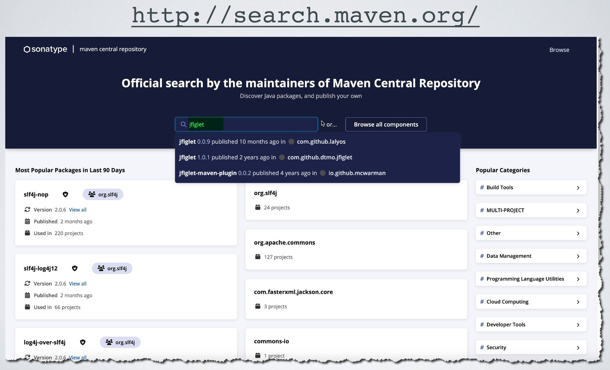

## Slide 46 - Looking for the JFiglet Library Dependency

Maven Central Search: http://search.maven.org/

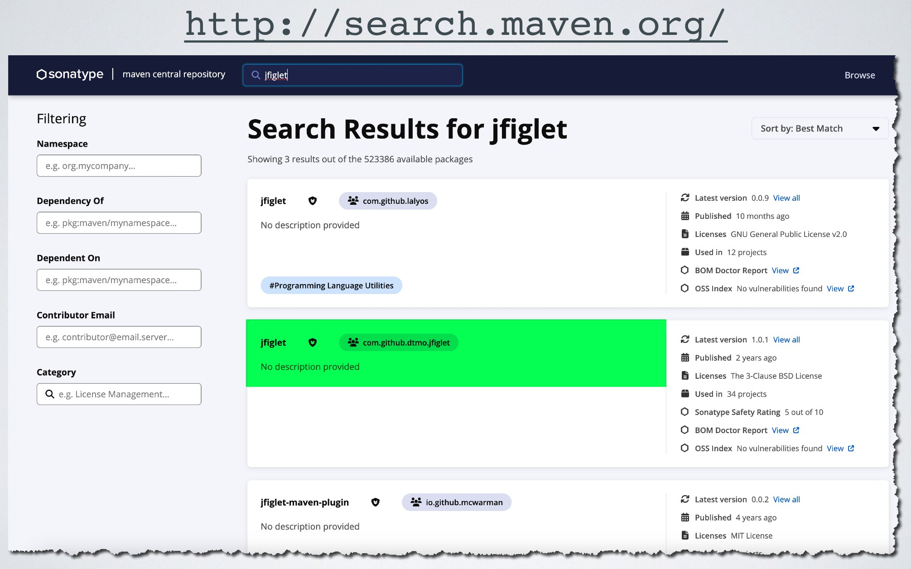

## Slide 47 - Looking for the JFiglet Library Dependency

Maven Central Search: http://search.maven.org/

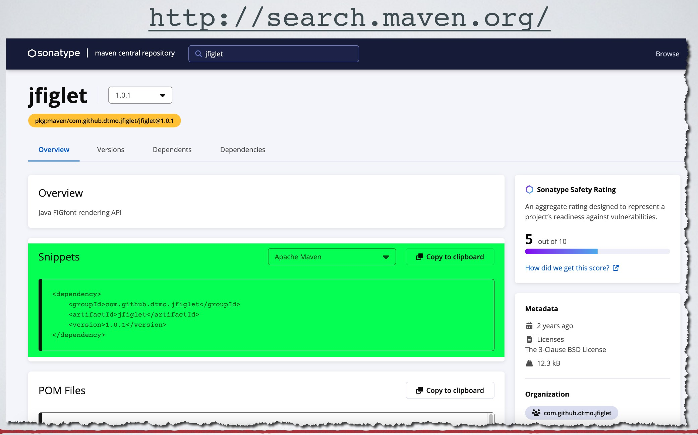

## Slide 48 - The Updated POM File

Updated POM fragment:

```xml
<!-- generates jar files including any dependencies -->
<plugin>
  <artifactId>maven-assembly-plugin</artifactId>
  <version>3.3.0</version>
  <configuration>
    <descriptorRefs>
      <descriptorRef>jar-with-dependencies</descriptorRef>
    </descriptorRefs>
  </configuration>
  <executions>
    <execution>
      <id>make-assembly</id> <!-- this is used for inheritance merges -->
      <phase>package</phase> <!-- bind to the packaging phase -->
      <goals>
        <goal>single</goal> <!-- the only goal of the assembly plugin -->
      </goals>
    </execution>
  </executions>
</plugin>

</plugins>
</build>

<!-- Dependencies -->
<dependencies>
  <dependency>
    <groupId>com.github.dtmo.jfiglet</groupId>
    <artifactId>jfiglet</artifactId>
    <version>1.0.1</version>
  </dependency>
</dependencies>
</project>
```

Notes from the slide:

- The assembly plugin defines the name of the JAR file with dependencies through
  `jar-with-dependencies`.
- The `single` goal of the `maven-assembly-plugin` is bound to the `package` phase of
  the default build lifecycle.
- The dependency on the JFiglet library is added through `groupId`, `artifactId`, and
  `version`.

## Slide 49 - Cleaning, Compiling, Packaging, Documenting, and Running

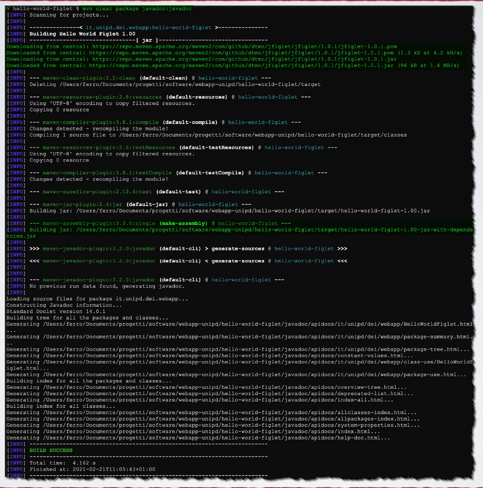

## Slide 50 - Cleaning, Compiling, Packaging, Documenting, and Running

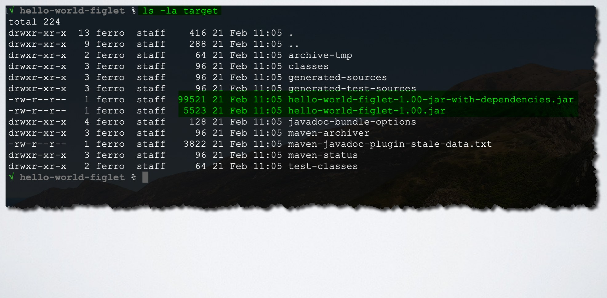

## Slide 51 - Cleaning, Compiling, Packaging, Documenting, and Running

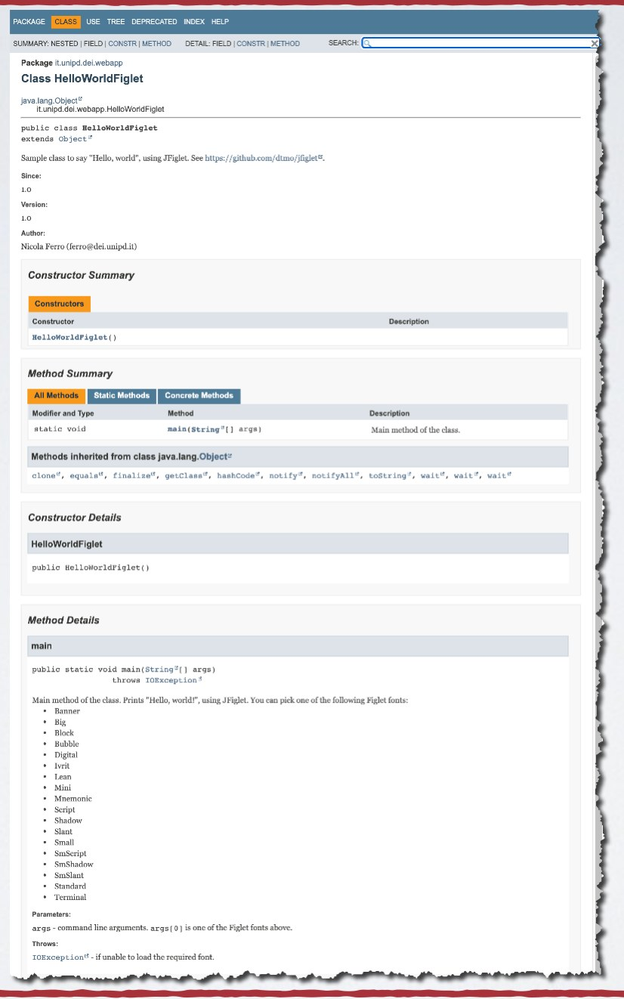

## Slide 52 - Cleaning, Compiling, Packaging, Documenting, and Running

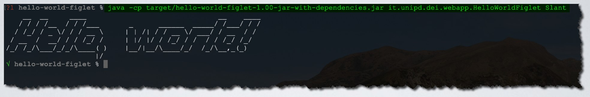

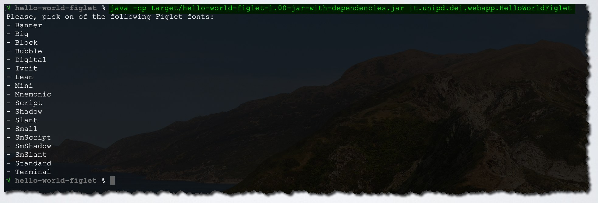

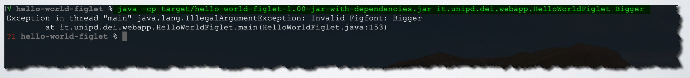
