# 07-webappTutorship-2025-26-HTML

_Source: `07-webappTutorship-2025-26-HTML.pdf`_

## Slide 1 - Tutoring 07

Tutoring 07

HTML

Francesco L. De Faveri

Web Applications Tutoring

Academic Year: 2025-2026

## Slide 2 - Outline

Outline

●
General Information

●
DOM & DOM manipulation

●
HTML

## Slide 3 - General Information

General Information

## Slide 4 - Frontend for HW2

Frontend for HW2

Three main components:

●
HTML

●
CSS

●
JavaScript

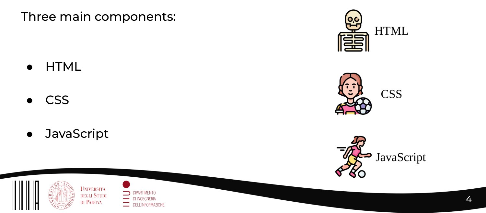

## Slide 5 - HTML

HTML

Three main components:

●
HTML (The Structure)

It is used to structure the web content.
- Markup Language.
- Tags that defines a Structure.
- Additional information on Web Content.

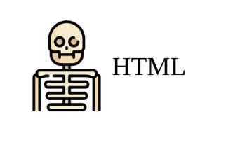

## Slide 6 - CSS

CSS

Three main components:

●
CSS (The Style)

It is used to add the style.
- Define appearance of the web page, layout, font, color…
- Cascading Language.
- Rules to define how HTML elements should look like and
displayed.

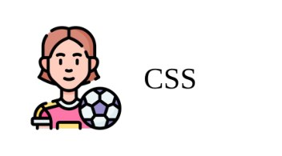

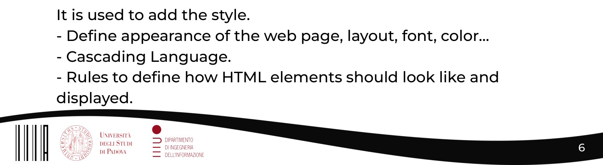

## Slide 7 - JavaScript

JavaScript

Three main components:

●
JavaScript (The Behaviour)

It is used to add:
- Dynamics and interactive elements to a web page.
- Manipulate HTML and CSS elements to create dynamic web
contents.

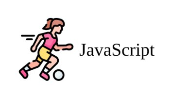

## Slide 8 - Deadlines

Deadlines

●
Last Tutoring Lecture: Monday 25 May 2026

●
Intermediate Exam: Tuesday 26 May 2026 at 16:30 (Lecture day)

●
HW 2 Deadline: Friday 5 June 2026 (Code + Presentation)

●
Group Presentation: 8, 9 June 2026 (Schedule TBD)

## Slide 9 - DOM

DOM

## Slide 10 - What is the DOM?

What is the DOM?

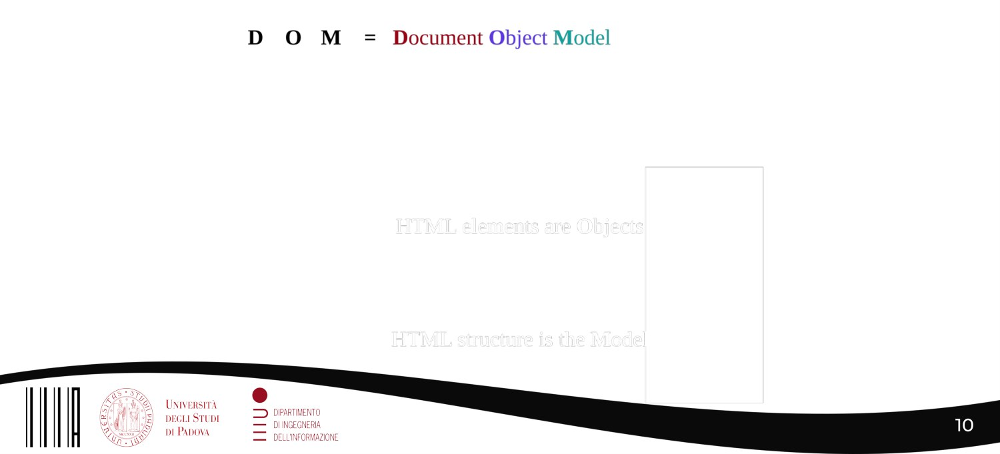

## Slide 11 - What is the DOM?

What is the DOM?

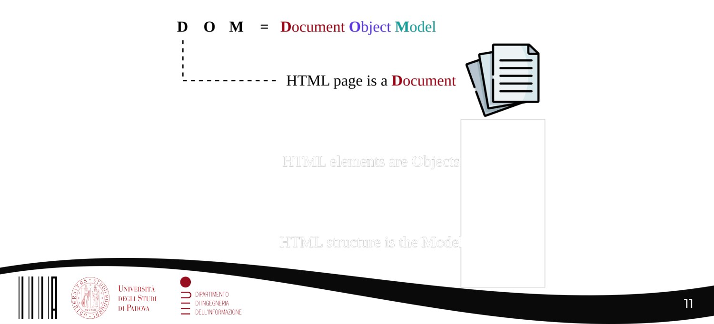

## Slide 12 - What is the DOM?

What is the DOM?

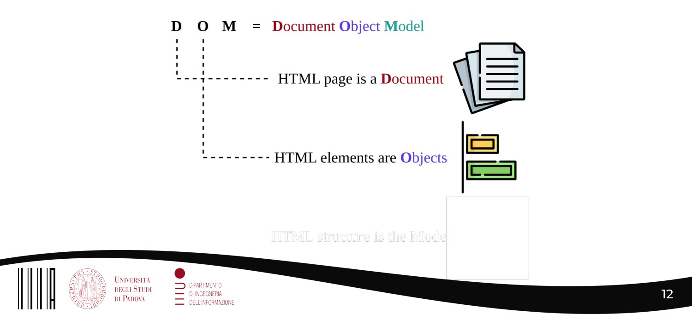

## Slide 13 - What is the DOM?

What is the DOM?

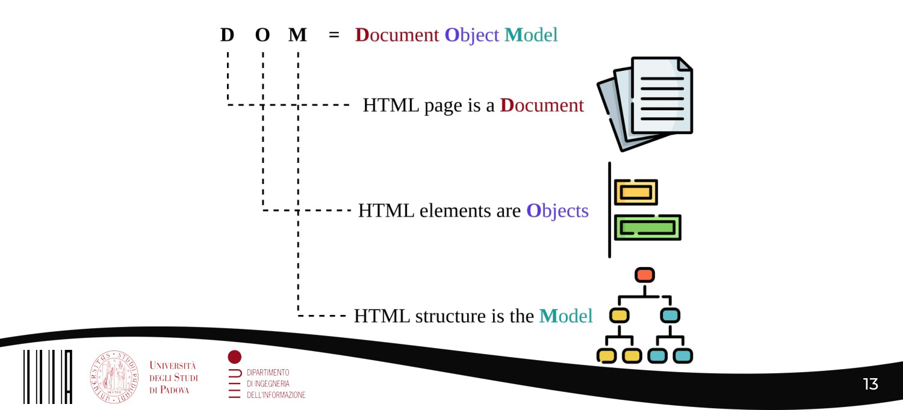

## Slide 14 - What is the DOM? Formalization

What is the DOM? Formalization

“The DOM is an API that represents a modelization of a document
(web Page) describing how different objects are connected to each other.”

●
The DOM is an interface to interact to webpages.

●
The DOM is independent from the Platform (universally defined by the
W3C)
-> Independent from browser, version and OS. (However…)

●
The DOM is NOT part of JavaScript!
-> JavaScript is a programming language that helps developers to
access and modify it. (Think at Lesson 6 - AJAX)

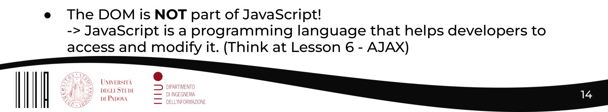

## Slide 15 - DOM look alike…

DOM look alike…

## Slide 16 - DOM look alike…

DOM look alike…

Root Element

Elements of the DOM

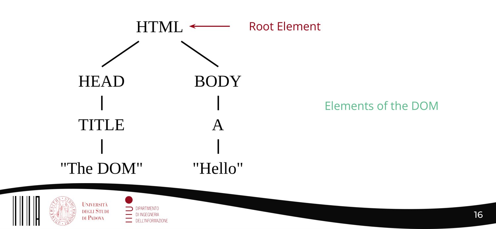

## Slide 17 - DOM look alike…

DOM look alike…

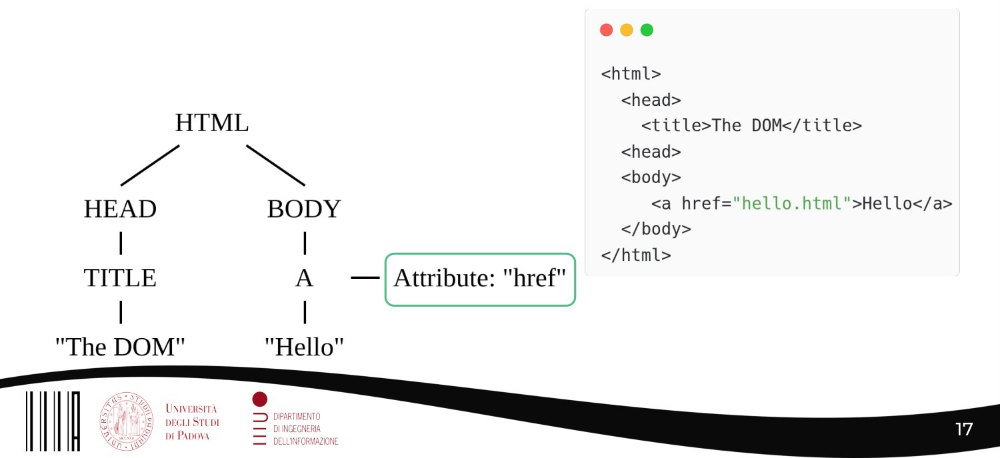

## Slide 18 - Some JS on the DOM (see now, recap on Lecture 9)

Some JS on the DOM (see now, recap on Lecture 9)

Let you retrieve the elements uniquely
defined by the attribute ID - Emenet_ID

Let you retrieve the set of elements
defined by the tag name - TAG_Name

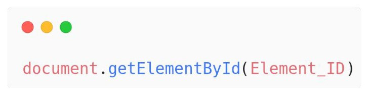

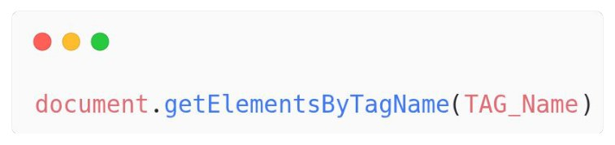

## Slide 19 - Some JS on the DOM (see now, recap on Lecture 9)

Some JS on the DOM (see now, recap on Lecture 9)

Let you create any new elements with
the specified tag TAG_name and
stored into the variable new_element

Let you create any new text with the
specified tag TAG_name and stored
into the variable new_element

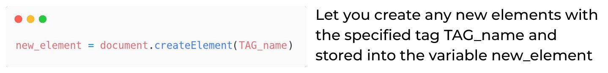

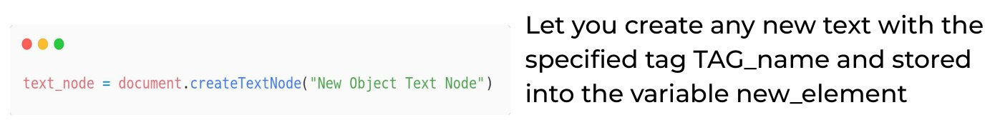

## Slide 20 - Some JS on the DOM (see now, recap on Lecture 9)

Some JS on the DOM (see now, recap on Lecture 9)

Let you create any new elements with
the specified tag TAG_name and
stored into the variable new_element

Let you create any new text with the
specified tag TAG_name and stored
into the variable new_element

Text is created but not showed!

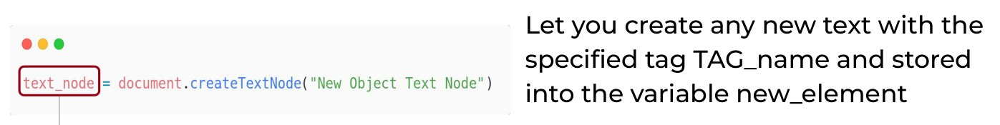

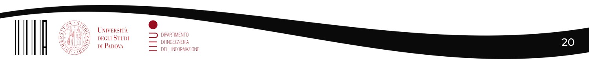

## Slide 21 - Some JS on the DOM (see now, recap on Lecture 9)

Some JS on the DOM (see now, recap on Lecture 9)

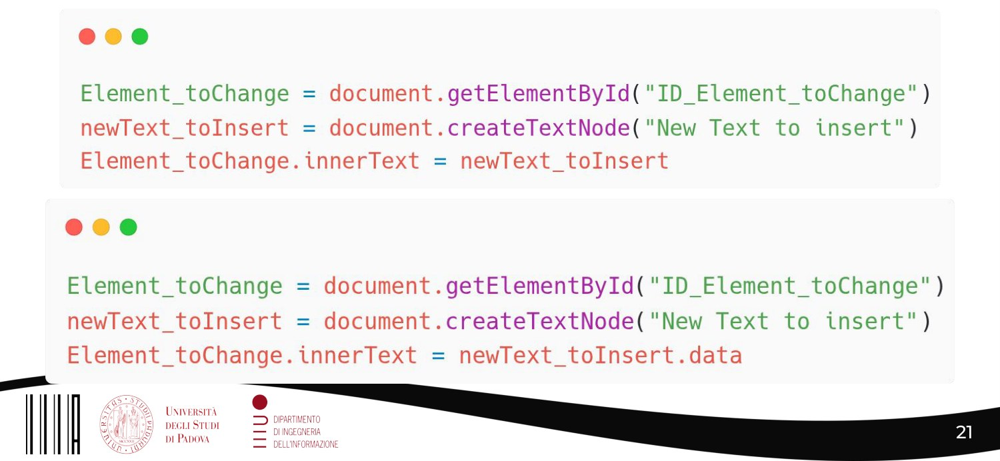

## Slide 22 - Be Aware on the Data Type!

Be Aware on the Data Type!

OBJ

str

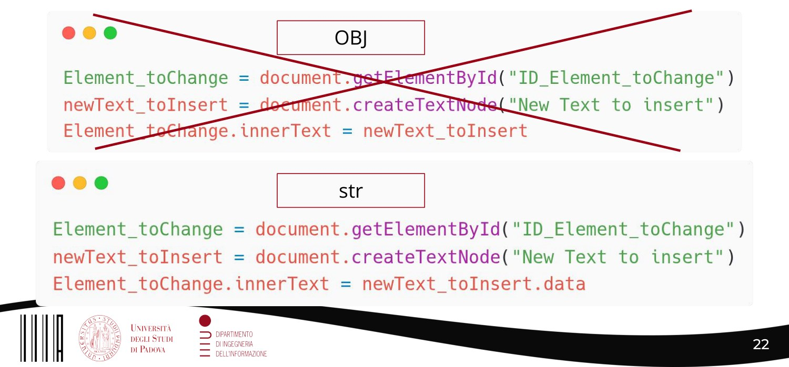

## Slide 23 - HTML

HTML

## Slide 24 - HTML - Recap theory

HTML - Recap theory

HTML (HyperText Markup Language) is a markup language used to create and
structure content for the web. HTML defines the structure of a document.

HTML uses a series of tags to define the structure of a web page. These tags are
enclosed in angle brackets (<tag>) and usually come in pairs (<tag></tag>), with an
opening and closing tag.

HTML tags are used to define different types of content, such as headings,
paragraphs, links… and also allows you other web technologies (e.g. CSS, JS) in it.

## Slide 25 - HTML Base Elements

HTML Base Elements

●
<! DOCTYPE html> declaration
of the HTML version

●
<html></html> root element of
the DOM

●
<head></head> metadata of
the web page

●
<body></body> corpus of the
doc

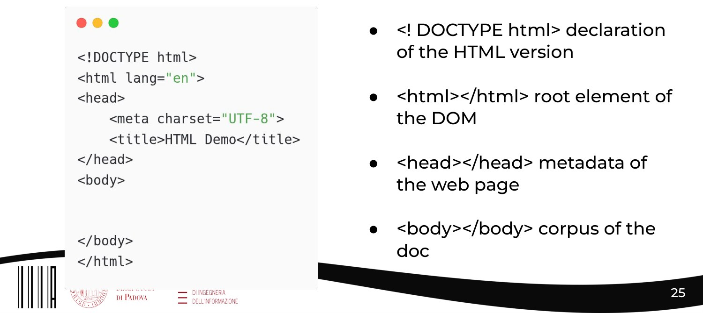

## Slide 26 - Meta Elements <meta>

Meta Elements <meta>

●
The <meta> elements gives information about the document, any sort of
info
●
Not displayed in the browser
●
Does not have a closing tag

For example it can specify the character encoding used or the initial scale.

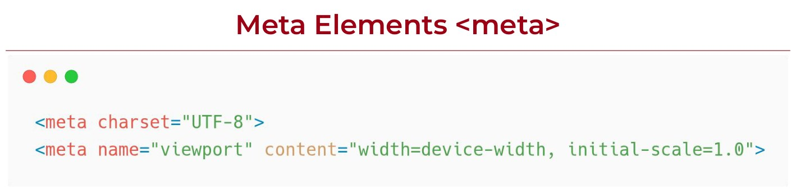

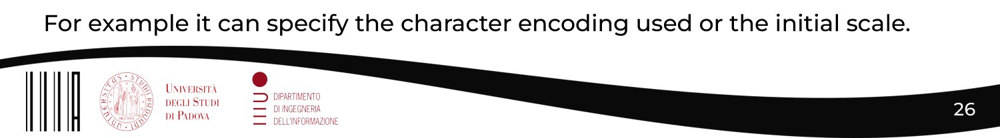

## Slide 27 - HTML main Tags

HTML main Tags

<hi></hi> with i=1, ..., 6 define the
headings on different levels

Give structure and hierarchy of the
page.

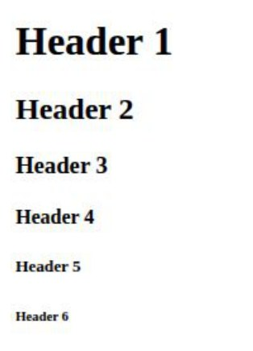

## Slide 28 - Texts

Texts

Where you usually put your text:

Where you usually put your text:

Where you usually put your text
(NOT always): 

Div is a section of text on a new line, span is an inline section of
text. P defines a paragraph of text.

## Slide 29 - Navigation Bar <nav></nav>

Navigation Bar <nav></nav>

<nav></nav>

Navigate among the
elements in the Web
Page.

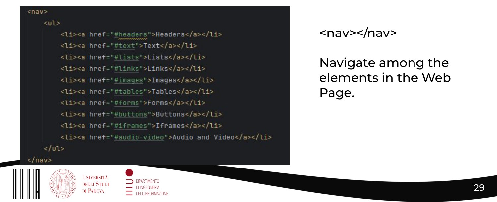

## Slide 30 - Buttons <button></button>

Buttons <button></button>

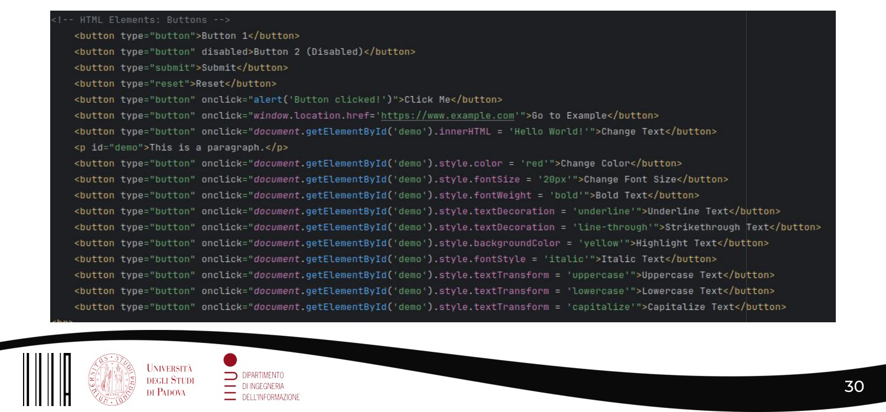

## Slide 31 - iframes <iframe></iframe>

iframes <iframe></iframe>

Incorporate an
html file inside
another html
file

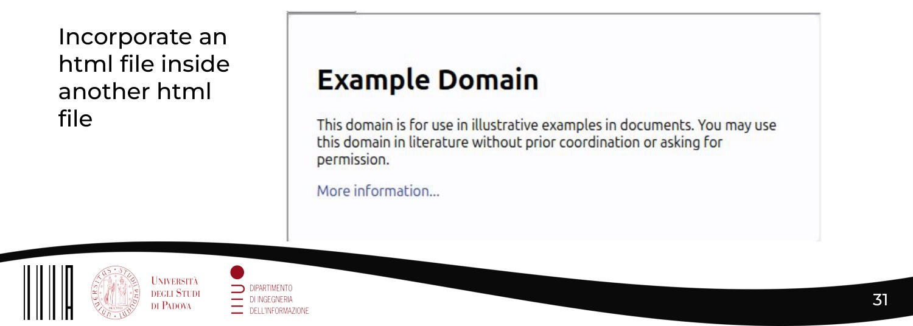

## Slide 32 - Video & Audio

Video & Audio

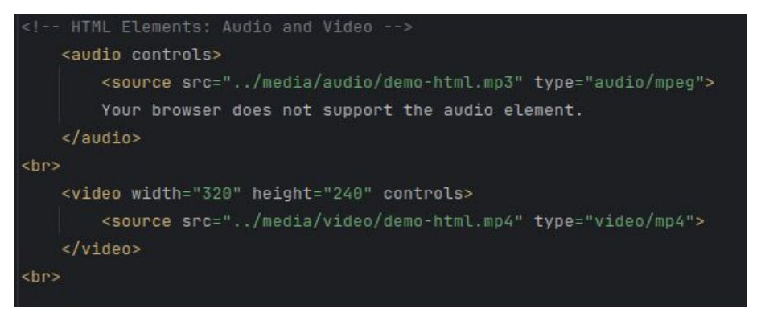

## Slide 33 - The Input tag

The Input tag

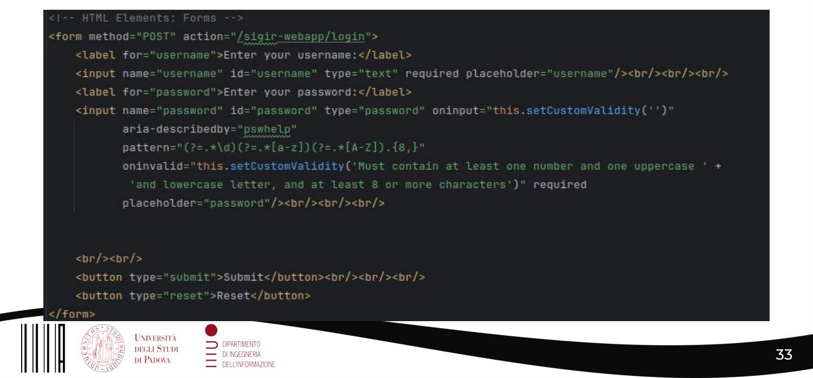

## Slide 34 - Wrap Up

Wrap Up

●
DOM: What it is and why it is important.

●
Hands on DOM manipulation via JS snippets.

●
HTML recap.

●
Live examples creating HTML Objects.

## Slide 35 - Acknowledgments

Acknowledgments

-
Online Repo

-
Doc:
https://developer.mozilla.org/en-US/docs/Web/API/XMLHttpReques
t_API

-
Main: https://www.w3schools.com/

-
Slides Main Course (Prof. Nicola Ferro)

-
Online Open Source Resources!

