# 09-Webapp-2025-26-HTTP

_Source: `09-Webapp-2025-26-HTTP.pdf`_

## Slide 1 - HTTP

HTTP
(and surroundings)

Web Applications
Master Degree in Computer Engineering

Master Degree in Cybersecurity
Master Degree in ICT for Internet and Multimedia

Academic Year 2025/2026

Nicola Ferro

Intelligent Interactive Information Access (IIIA) Hub

## Slide 2 - Outline

Outline

URL

Resource Media Type (MIME)

HTTP/1.1

Authentication

## Slide 3 - Basic Web Technology

Basic Web Technology

HTML     HTTP     MIME     URL

HyperText Markup Language (HTML): the markup
language to write Web pages

HyperText Transfer Protocol (HTTP): the application layer
protocol which rules the communication between Web
clients and Web servers

Multipurpose Internet Mail Extensions (MIME): the
media type and the encoding of the exchanged information

Uniform Resource Locator (URL): the way to identify and
locate resources on the Web

## Slide 4 - URL

URL

## Slide 5 - Resource Identification

Resource Identification

A Uniform Resource Identifier (URI) is a compact sequence
of characters that identifies an abstract or physical resource.

Uniform: it allows different types of resource identifiers to be used in the same
context, even when the mechanisms used to access those resources may differ

uniform semantic interpretation of common syntactic conventions

consistent introduction of new types of resource identifiers

Resource: is used in a general sense for whatever might be identified, e.g. an
electronic document, an image

a resource is not necessarily accessible via the Internet; e.g., human beings or books in a library

abstract concepts can be resources

Identifier: embodies the information required to distinguish what is being identified
from all other things within its scope of identification

Berners-Lee, T., Fielding, R., and Masinter, L. (2005). Uniform Resource Identifier (URI): Generic Syntax. RFC 3986.
https://www.rfc-editor.org/rfc/rfc3986.txt

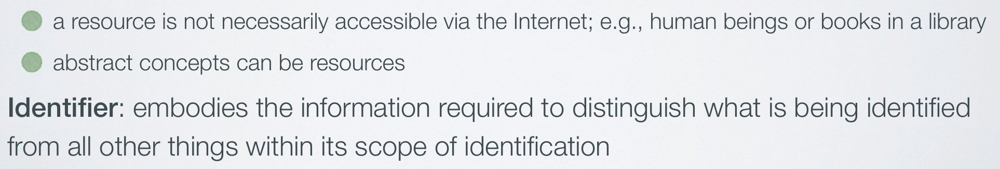

## Slide 6 - URI, URL, URN, IRI

URI, URL, URN, IRI

URI are a generic and abstract identification mechanism

Uniform Resource Locator (URL) refer to the subset of URI that, in addition to identifying a resource,
provide a means of locating the resource by describing its primary access mechanism (e.g., its
network “location”)

example: https://www.rfc-editor.org/rfc/rfc1738.txt

Uniform Resource Name (URN) refer to the subset of using the “urn” scheme (see later on) and with
the properties of a “name”

the syntactical correctness of a name starting with “urn:” is not sufficient to make it a URN.  In order for the name to

be a valid URN, the namespace identifier needs to be registered in accordance with the well-defined rules and the

remaining parts of the assigned-name portion of the URN need to be generated in accordance with the rules for the

registered URN namespace

example: urn:isbn:978-951-0-18435-6

Internationalized Resource Identifier (IRI) is an extension of the URI syntax to allow for Unicode
characters

example: https://en.wiktionary.org/wiki/Ῥόδος

Berners-Lee, T. (1994). Uniform Resource Locators (URL). RFC 1738.
https://www.rfc-editor.org/rfc/rfc1738.txt

Saint-Andre, P. and Klensin, J. (2017). Uniform Resource Names (URNs). RFC 8141.
https://www.rfc-editor.org/rfc/rfc8141.txt

Duerst, M. and Suignard, M. (2005). Internationalized Resource Identifiers (IRIs). RFC 3987.
https://www.rfc-editor.org/rfc/rfc3987.txt

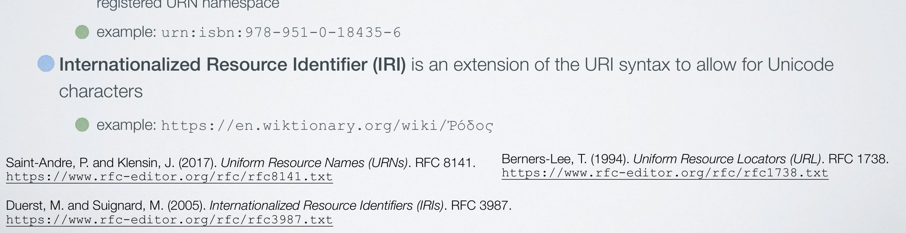

## Slide 7 - URI Syntax

URI Syntax

scheme:[//[user[:password]@]host[:port]][/path][?query][#fragment]

scheme: a name that refers to a specification for assigning identifiers within that scheme; examples
include http(s), ftp, mailto, and file

two slashes (//): required by some schemes and not required by some others

an authority part, comprising:

an optional authentication section of a user name and password, separated by a colon, followed by an at symbol (@)

a "host", consisting of either a registered domain name or an IP address

an optional port number, separated from the hostname by a colon

a path, which contains data, usually organized in hierarchical form, that appears as a sequence of segments
separated by slashes

an optional query, separated from the preceding part by a question mark (?), typically consisting of a sequence

of attribute=value pairs separated by a delimiter (&)

an optional fragment, separated from the preceding part by a hash (#). The fragment contains a fragment

identifier providing direction to a secondary resource, such as a section heading in an article identified by the
remainder of the URI

Percent-Encoding: an octet encoded as a character triplet, consisting of the percent character "%" followed by

the two hexadecimal digits representing that octet's numeric value. It is used for escaping both reserved
characters and non-ASCII characters

e.g. %20 is the percent-encoding for space, %3F for ?, %26 for &, %23 for #, %2F for /, %E0 for à

## Slide 8 - Example of URI

Example of URI

ftp://ftp.is.co.za/rfc/rfc1808.txt

http://www.ietf.org/rfc/rfc2396.txt

https://www.google.it/search?
q=universit%C3%A0+di+padova&oq=universit%C3%A0+di+p
adova&aqs=chrome..69i57j0l2j69i60j69i61j69i60.4937j
0j8&sourceid=chrome&ie=UTF-8

mailto:John.Doe@example.com

news:comp.infosystems.www.servers.unix

tel:+1-816-555-1212

telnet://192.0.2.16:80/

urn:oasis:names:specification:docbook:dtd:xml:4.1.2

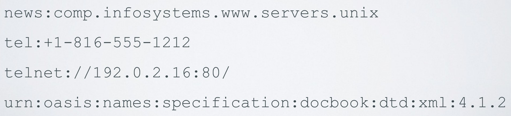

## Slide 9 - Character Encoding

Character Encoding

## Slide 10 - The ASCII Character Encoding

The ASCII Character Encoding

ASCII (American Standard Code for Information Interchange) is a
character encoding scheme introduced in 1963 by the American
Standards Association

It uses 7 bits to represents 128 characters — control characters,
latin alphabet letters (lower and upper cases), numbers,
punctuation, some symbols

It has been then standardised by ISO in 1972. Since ASCII did not
provide a number of characters needed in languages other than
English, a number of national variants were made that substituted
a few less-used characters with needed ones, leading to
incompatibilities

ASA (1963). American Standard Code for Information Interchange – X3.4- 1963. American Standards Association (ASA), USA.

## Slide 11 - X.3.4-1963: Cover and Code Table

X.3.4-1963: Cover and Code Table

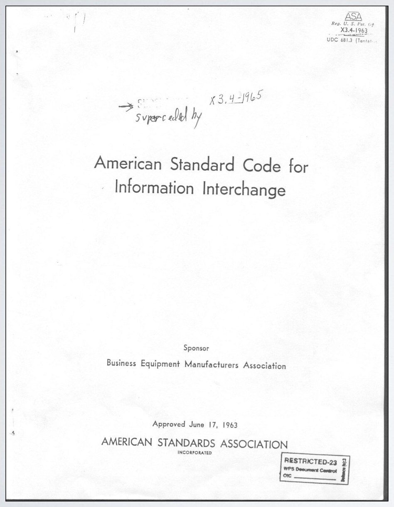

## Slide 12 - Extended ASCII

Extended ASCII

The ASCII encoding has been extended to include also non-
English symbols to, e.g., have a better coverage of
European languages

The so-called “extended ASCII” uses 8 bits to encode 256
characters.

the first 128 characters are the same as in ASCII at 7 bits

the additional (upper) 128 characters are used to define a set of
alternative code tables, e.g. for different European and non-European
languages, leading to several compatibility issues

Extended ASCII is standardised in the ISO 8859 sets of
recommendations since 1987

## Slide 13 - The Unicode Standard

The Unicode Standard

In 1991 the Unicode Consortium (https://home.unicode.org/) developed

a new standard to address the compatibility issues among the different ASCII
encodings and to develop a single set of characters suitable for all the different
alphabets and symbols

The first versions of Unicode used 16 bits to represent 65,536 characters while
the more recent versions use 32 bits to represent up to 4,294,967,296 possible
characters

the first 256 characters are in common with the ISO 8859-1 standard

To save memory, alternative encoding schemes have developed for “packing”
Unicode symbols, called Unicode Transformation Format (UTF)

UTF-8 is among the most adopted: it uses 8 bits for the characters which are in common
with extended ASCII, 16 bits for the new characters added by the first Unicode versions, and
32 bits only when needed to represents the newest characters

It has been standardised by ISO in 1993 as Universal Character Set (UCS)

## Slide 14 - Example of Extended ASCII and Unicode

Example of Extended ASCII and Unicode

Unicode Text
ASCII/8859-1 Text

A

A

0100 0001
0101 0011

0100 0011

0000 0000 0100 0001
0000 0000 0101 0011
0000 0000 0100 0011

S
C

S
C

0100 1001

0100 1001

I
I

I
I

0010 1111

0011 1000

0011 1000

0011 0101

0011 1001

/
8
8
5
9

0010 1101

0011 0001

-
1

0010 0000

0111 0100

0110 0101

t
e
x

0111 1000

t

0111 0100

0000 0000 0100 1001
0000 0000 0100 1001
0000 0000 0010 0000
0101 1001 0010 1001
0101 0111 0011 0000
0000 0000 0010 0000
0000 0110 0011 0011
0000 0110 0100 0100
0000 0110 0010 0111
0000 0110 0100 0101
0000 0000 0010 0000
0000 0011 1011 0001
0010 0010 0111 0000
0000 0011 1011 0011

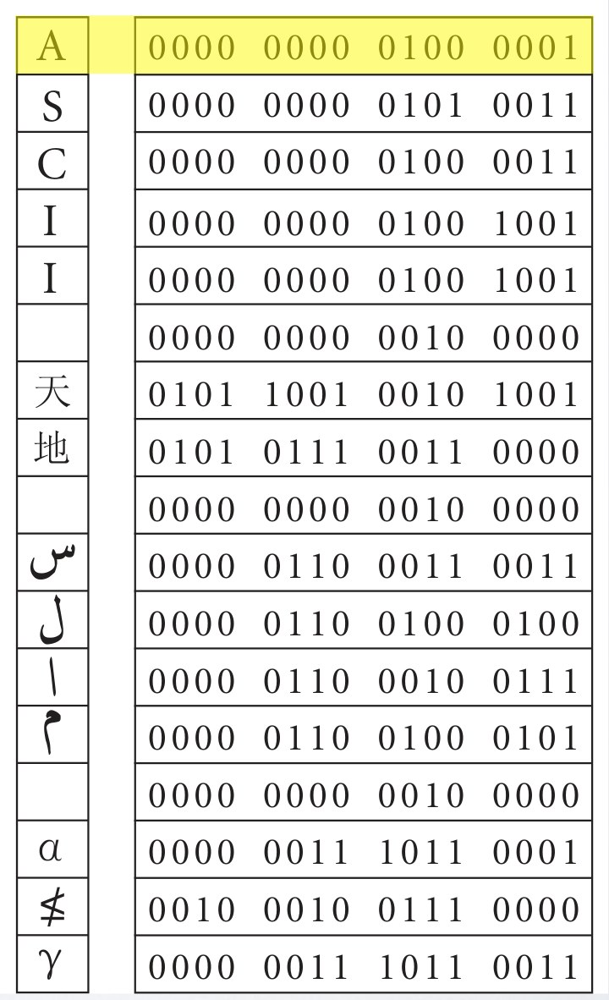

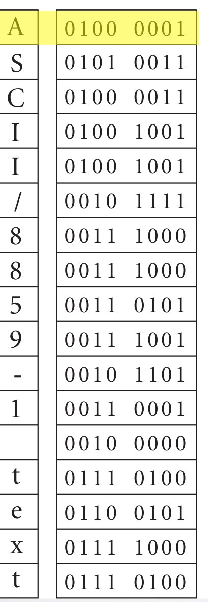

## Slide 15 - Example of Unicode Tables

Example of Unicode Tables

04FF
Cyrillic
0400

C0 Controls and Basic Latin

Greek and Coptic

0

0

Ѱ

Ѡ

Ӑ

ѐ

Ӏ

р

Ұ

а

Ҡ

Р

Ӱ

Ґ

А

Ӡ

Ҁ

040
041
042
043
044
045
046
047
048
049
04A
04B
04C
04D
04E
04F
Ѐ

0





000
001
002
003
004
005
006
007


p

`

P

@

0

Ϡ

ϐ

π

ΰ

Π

ΐ

ϰ

037
038
039
03A
03B
03C
03D
03E
03F
Ͱ

0400

0410

0420

0430

0440

0450

0460

0470

0480

0490

04A0

04B0

04C0

04D0

04E0

04F0

0000

0010

0020

0030

0040

0050

0060

0070

0370

0390

03A0

03B0

03C0

03D0

03E0

03F0

1

1

ѱ

ѡ

ӑ

ё

Ӂ

с

ұ

б

ҡ

С

ӱ

ґ

Б

ӡ

ҁ

Ё

1





q

a

Q

A

1

!

ϡ

ϑ

ρ

α

Ρ

Α

ϱ

ͱ

0401

0411

0421

0431

0441

0451

0461

0471

0481

0491

04A1

04B1

04C1

04D1

04E1

04F1

0001

0011

0021

0031

0041

0051

0061

0071

0371

0391

03A1

03B1

03C1

03D1

03E1

03F1

2

2

Ѳ

Ѣ

ђ

ӂ

т

Ҳ

в

Ң

Т

Ӳ

Ғ

В

Ӣ

҂

Ђ

Ӓ

2





r

b

R

B

2

"

Ϣ

ϒ

ς

β

Β

ϲ

Ͳ

0402

0412

0422

0432

0442

0452

0462

0472

0482

0492

04A2

04B2

04C2

04D2

04E2

04F2

0002

0012

0022

0032

0042

0052

0062

0072

0372

0392

03B2

03C2

03D2

03E2

03F2

3

3

ѳ

ѣ

ѓ

Ӄ

у

ҳ

г

ң

У

ӳ

ғ

Г

ӣ

$҃

Ѓ

ӓ

3





s

c

S

C

3

#

ϣ

ϓ

σ

γ

Σ

Γ

ϳ

ͳ

0403

0413

0423

0433

0443

0453

0463

0473

0483

0493

04A3

04B3

04C3

04D3

04E3

04F3

0003

0013

0023

0033

0043

0053

0063

0073

0373

0393

03A3

03B3

03C3

03D3

03E3

03F3

4

4

4

Ѥ

є

ӄ

ф

Ҵ

д

Ҥ

Ф

Ӵ

Ҕ

Д

Ӥ

$҄

Є

Ӕ

Ѵ





t

d

T

D

4

$

Ϥ

ϔ

τ

δ

Τ

Δ

΄

ϴ

ʹ

0404

0414

0424

0434

0444

0454

0464

0474

0484

0494

04A4

04B4

04C4

04D4

04E4

04F4

0004

0014

0024

0034

0044

0054

0064

0074

0374

0384

0394

03A4

03B4

03C4

03D4

03E4

03F4

5

5

5

ѥ

ѕ

Ӆ

х

ҵ

е

ҥ

Х

ӵ

ҕ

Е

ӥ

$҅

Ѕ

ӕ

ѵ





u

e

U

E

5

%

ϥ

ϕ

υ

ε

Υ

Ε

΅

ϵ

͵

0405

0415

0425

0435

0445

0455

0465

0475

0485

0495

04A5

04B5

04C5

04D5

04E5

04F5

0005

0015

0025

0035

0045

0055

0065

0075

0375

0385

0395

03A5

03B5

03C5

03D5

03E5

03F5

6

6

6

Ѧ

і

ӆ

ц

Ҷ

ж

Ҧ

Ц

Ӷ

Җ

Ж

Ӧ

$҆

І

Ӗ

Ѷ





v

f

V

F

6

&

Ϧ

ϖ

φ

ζ

Φ

Ζ

Ά

϶

Ͷ

0406

0416

0426

0436

0446

0456

0466

0476

0486

0496

04A6

04B6

04C6

04D6

04E6

04F6

0006

0016

0026

0036

0046

0056

0066

0076

0376

0386

0396

03A6

03B6

03C6

03D6

03E6

03F6

7

7

7

ѧ

ї

Ӈ

ч

ҷ

з

ҧ

Ч

ӷ

җ

З

ӧ

$҇

Ї

ӗ

ѷ





ϧ

ϗ

χ

η

Χ

Η

·

Ϸ

ͷ

w

g

W

G

7

'

0407

0417

0427

0437

0447

0457

0467

0477

0487

0497

04A7

04B7

04C7

04D7

04E7

04F7

0007

0017

0027

0037

0047

0057

0067

0077

0377

0387

0397

03A7

03B7

03C7

03D7

03E7

03F7

8

8

8

Ѩ

ј

ӈ

ш

Ҹ

и

Ҩ

Ш

Ӹ

Ҙ

И

Ө

$҈

Ј

Ә

Ѹ





Ϩ

Ϙ

ψ

θ

Ψ

Θ

Έ

ϸ

x

h

X

H

8

(

0408

0418

0428

0438

0448

0458

0468

0478

0488

0498

04A8

04B8

04C8

04D8

04E8

04F8

0008

0018

0028

0038

0048

0058

0068

0078

0388

0398

03A8

03B8

03C8

03D8

03E8

03F8

9

9

9

ѩ

љ

Ӊ

щ

ҹ

й

ҩ

Щ

ӹ

ҙ

Й

ө

$҉

Љ

ә

ѹ





ϙ

ω

ι

Ω

Ι

Ή

Ϲ

ϩ

y

i

Y

I

9

)

0409

0419

0429

0439

0449

0459

0469

0479

0489

0499

04A9

04B9

04C9

04D9

04E9

04F9

0389

0399

03A9

03B9

03C9

03D9

03E9

03F9

0009

0019

0029

0039

0049

0059

0069

0079

A

A

A

Ѫ

њ

ӊ

ъ

Һ

к

Ҫ

Ъ

Ӻ

Қ

К

Ӫ

Ҋ

Њ

Ӛ

Ѻ





Ϛ

ϊ

κ

Ϊ

Κ

Ί

Ϻ

ͺ

Ϫ

z

j

Z

J

:

*

040A

041A

042A

043A

044A

045A

046A

047A

048A

049A

04AA

04BA

04CA

04DA

04EA

04FA

037A

038A

039A

03AA

03BA

03CA

03DA

03EA

03FA

000A

001A

002A

003A

004A

005A

006A

007A

B

B

B

ѫ

ћ

Ӌ

ы

һ

л

ҫ

Ы

ӻ

қ

Л

ӫ

ҋ

Ћ

ӛ

ѻ

ϛ

ϋ

λ

Ϋ

Λ

ϻ

ͻ

ϫ





{

k

[

K

;

+

040B

041B

042B

043B

044B

045B

046B

047B

048B

049B

04AB

04BB

04CB

04DB

04EB

04FB

037B

039B

03AB

03BB

03CB

03DB

03EB

03FB

000B

001B

002B

003B

004B

005B

006B

007B

C

C

C

Ѭ

ќ

ӌ

ь

Ҽ

м

Ҭ

Ь

Ӽ

Ҝ

М

Ӭ

Ҍ

Ќ

Ӝ

Ѽ

Ϝ

ό

μ

ά

Μ

Ό

ϼ

ͼ

Ϭ





|

l

\

L

<

,

040C

041C

042C

043C

044C

045C

046C

047C

048C

049C

04AC

04BC

04CC

04DC

04EC

04FC

037C

038C

039C

03AC

03BC

03CC

03DC

03EC

03FC

000C

001C

002C

003C

004C

005C

006C

007C

D

D

D

ѭ

ѝ

Ӎ

э

ҽ

н

ҭ

Э

ӽ

ҝ

Н

ӭ

ҍ

Ѝ

ӝ

ѽ

ϝ

ύ

ν

έ

Ν

Ͻ

ͽ

ϭ





}

m

]

M

=

-

040D

041D

042D

043D

044D

045D

046D

047D

048D

049D

04AD

04BD

04CD

04DD

04ED

04FD

037D

039D

03AD

03BD

03CD

03DD

03ED

03FD

000D

001D

002D

003D

004D

005D

006D

007D

E

E

E

Ѯ

Ϟ

ў

ӎ

ώ

ю

Ҿ

ξ

о

Ү

ή

Ю

Ӿ

Ҟ

Ξ

О

Ӯ

Ҏ

Ύ

Ͼ

Ў

Ӟ

;

Ѿ

Ϯ





~

n

^

N

>

.

037E

038E

039E

03AE

03BE

03CE

03DE

03EE

03FE

040E

041E

042E

043E

044E

045E

046E

047E

048E

049E

04AE

04BE

04CE

04DE

04EE

04FE

000E

001E

002E

003E

004E

005E

006E

007E

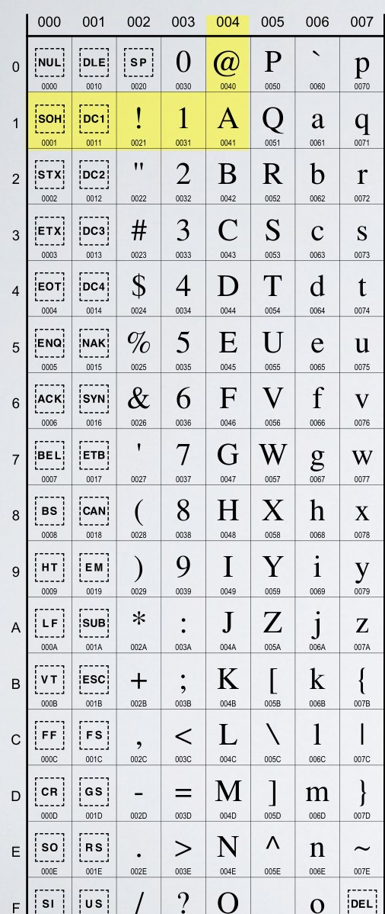

## Slide 16 - Number of Unicode Symbols

Number of Unicode Symbols

1.0
(1991)

1.1
(1993)

2.0
(1996)

3.0
(2000)

3.1
(2001)

4.0
(2003)

5.0
(2006)

6.0
(2010)

6.1
(2012)

7.0
(2014)

8.0
(2015)

9.0
(2016)

10.0
(2017)

11.0
(2018)

12.0
(2019)

13.0
(2020)

14.0
(2021)

15.0
(2022)

16.0
(2024)

17.0
(2025)

18.0
(2026)

Chars
28,359
34,233
38,950
49,259
94,205
96,447
99,089
109,449 110,181 113,015 120,731 128,172 136,690 137,374 137,929 143,859 144,697 149,186 155,000 159,801 172,849

https://www.unicode.org/versions/Unicode18.0.0/

16 bits limits (216 = 65.536)

180000

144000

108000

72000

36000

0

1991

1993

1996

2000

2001

2003

2006

2010

2012

2014

2015

2016

2017

2018

2019

2020

2021

2022

2024

2025

2026

## Slide 17 - Number of Unicode Symbols

Number of Unicode Symbols

1.0
(1991)

1.1
(1993)

2.0
(1996)

3.0
(2000)

3.1
(2001)

4.0
(2003)

5.0
(2006)

6.0
(2010)

6.1
(2012)

7.0
(2014)

8.0
(2015)

9.0
(2016)

10.0
(2017)

11.0
(2018)

12.0
(2019)

13.0
(2020)

14.0
(2021)

15.0
(2022)

16.0
(2024)

17.0
(2025)

18.0
(2026)

Chars
28,359
34,233
38,950
49,259
94,205
96,447
99,089
109,449 110,181 113,015 120,731 128,172 136,690 137,374 137,929 143,859 144,697 149,186 155,000 159,801 172,849

https://www.unicode.org/versions/Unicode18.0.0/

16 bits limits (216 = 65.536)

180000

144000

108000

72000

36000

0

1991

1993

1996

2000

2001

2003

2006

2010

2012

2014

2015

2016

2017

2018

2019

2020

2021

2022

2024

2025

2026

## Slide 18 - MIME

MIME

## Slide 19 - Content Media Type

Content Media Type

Multipurpose Internet Mail Extensions (MIME) is a standard
supporting the encoding of information for e-mail and the Web

MIME defines several media types — e.g. text, image, audio — and subtypes

— e.g. plain, html, xml for text

MIME media types are registered by IANA (Internet Assigned Numbers Authority)

https://www.iana.org/assignments/media-types/media-types.xhtml

For each type and subtype it is possible to specify additional information, when
needed, such as the charset of a text type

MIME defines a set of headers which are used by protocols like SMTP for email
and HTTP for the Web to specify the media type, format and encoding of the
exchanged content

Freed, N. and Borenstein, N. (1996). Multipurpose Internet Mail Extensions (MIME) Part One: Format of Internet Message Bodies. RFC 2045.
https://www.rfc-editor.org/rfc/rfc2045.txt

## Slide 20 - (Some) MIME Headers

(Some) MIME Headers

MIME-Version: defines the version of MIME used

example, MIME-Version: 1.0

Content-Type: specifies the nature of the data in the body of an entity by giving media type and subtype
identifiers, and by providing auxiliary information that may be required for certain media types

example, Content-Type: text/plain; charset=ISO-8859-1

Content-Transfer-Encoding: defines a set of methods for representing binary data in formats other than ASCII
text format. Some possible values are 7bit, 8bit, base64

example
Content-Type: application/octet-stream
Content-Transfer-Encoding: base64

Content-Disposition: defines how the content body has to be represented/displayed on the client side. A
body part should be marked “inline” if it is intended to be  displayed automatically upon display of the

message; it can be designated “attachment” to indicate that it is separate from the main body of the mail

message, and that their display should not be automatic, but contingent upon some further action of the user.
Additional fields like, filename, modification-date, size and so on are available to provide further

information

example
Content-Type: image/jpeg
Content-Disposition: attachment; filename=genome.jpeg; modification-date="Wed, 12 Feb 2020
16:29:51 -0500”; size=9028

## Slide 21 - The MIME multipart Media Type

The MIME multipart Media Type

The multipart media type represents one or more different sets of data combined in a single body. The body must

then contain one or more body parts, each preceded by a boundary delimiter line, and the last one followed by a
closing boundary delimiter line.

The mixed subtype is intended for use when the body parts are independent and need to be bundled in a particular

order, e.g. content of an email and attachments

The alternative subtype is syntactically identical to multipart/mixed but the semantics is different.  In

particular, each of the body parts is an "alternative" version of the same information, e.g. content of an email in plain
text and html version

MIME-Version: 1.0
Content-Type: multipart/mixed; boundary=frontier

This is a message with multiple parts in MIME format.
--frontier
Content-Type: text/plain

This is the body of the message.
--frontier
Content-Type: application/octet-stream
Content-Transfer-Encoding: base64

PGh0bWw+CiAgPGhlYWQ+CiAgPC9oZWFkPgogIDxib2R5PgogICAgPHA+VGhpcyBpcyB0aGUg
Ym9keSBvZiB0aGUgbWVzc2FnZS48L3A+CiAgPC9ib2R5Pgo8L2h0bWw+Cg==
--frontier--

Freed, N. and Borenstein, N. (1996). Multipurpose Internet Mail Extensions (MIME) Part Two: Media Types. RFC 2046.
https://www.rfc-editor.org/rfc/rfc2046.txt

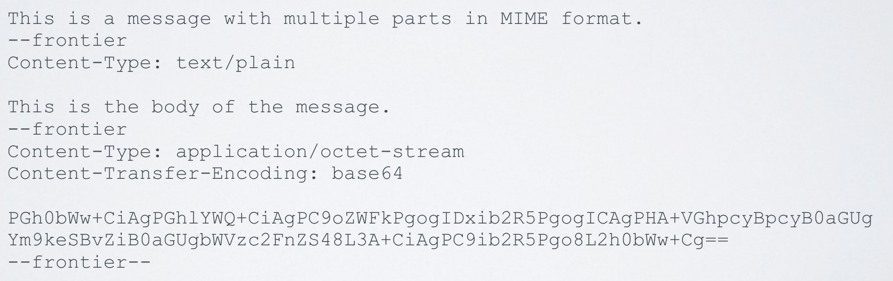

## Slide 22 - Up to Servlet 4.0: Apache Commons Email

Up to Servlet 4.0: Apache Commons Email

https://commons.apache.org/proper/commons-email/

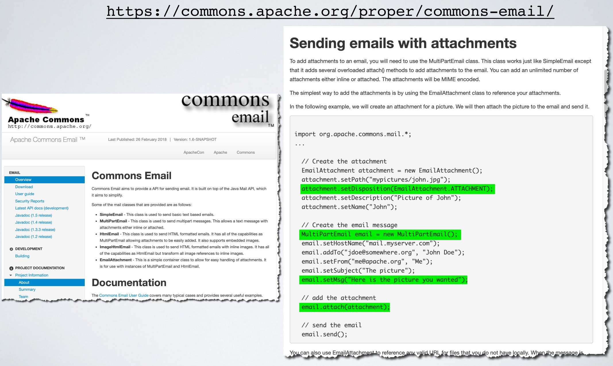

## Slide 23 - Since Servlet 5.0: Jakarta Mail 2.1

Since Servlet 5.0: Jakarta Mail 2.1

https://jakarta.ee/specifications/mail/2.1/
https://github.com/eclipse-ee4j/angus-mail/releases/tag/1.0.0

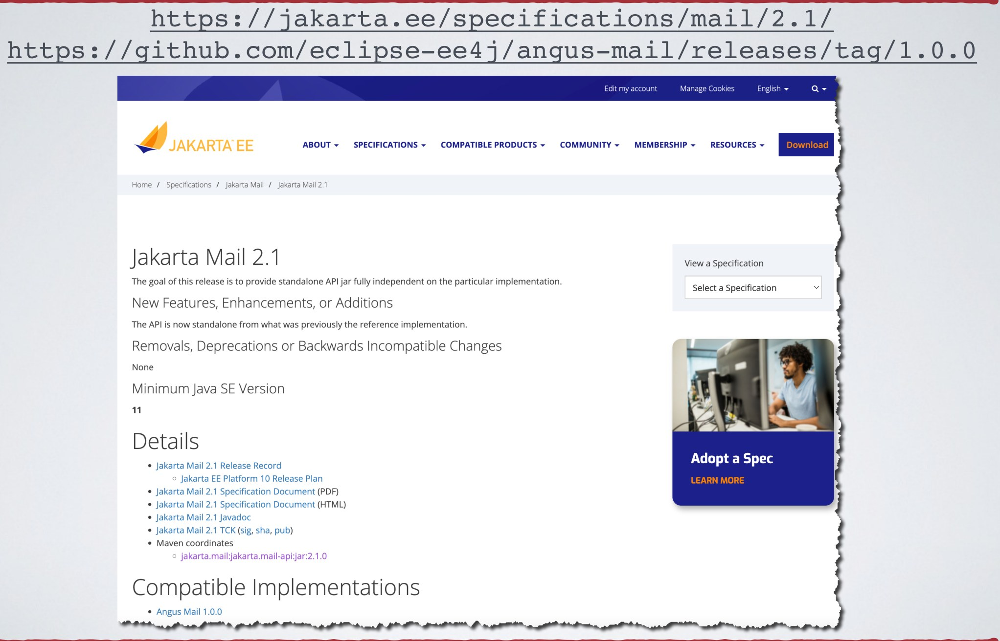

## Slide 24 - Sending Web forms and Uploading Files

Sending Web forms and Uploading Files

The multipart/form-data media type allows for uploading files

and sending fields from Web forms

more effective encoding of (large) binary files, with the same mechanisms as the
multipart type in general, but too much header overhead to just send a few

form fields

The application/x-www-form-urlencoded media types allows

for sending field from Web forms

all the name=value pairs are concatenated into a single string, separated by &,

and the string is then percent-encoded. They can also be appended as a query

part in a URI, instead of being sent as content body

not suitable for sending (large) binary files, due to huge encoding overhead, but
effective for a few form fields

Masinter, L. (2015). Returning Values from Forms: multipart/form-data. RFC 7578.
https://www.rfc-editor.org/rfc/rfc7578.txt

W3C (1999). HTML 4.01 Specification – W3C Recommendation 24 December 1999.
https://www.w3.org/TR/html4/

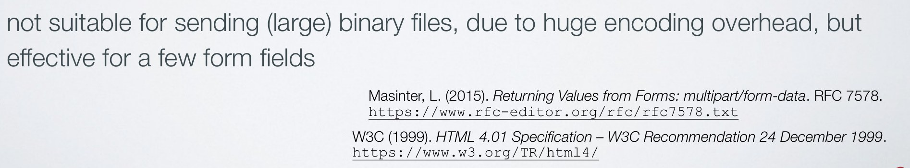

## Slide 25 - multipart/form-data Example

multipart/form-data Example

<html>

<body>

<form action="http://www.xyz.com/" enctype="multipart/form-data" method="post">

What is your name? <input type="text" name="submit-name"/>  

What file are you sending? <input type="file" name="files"/>  

<input type="submit" value="Send"/>
<input type="reset" value="Clear"/>
</form>
</body>
</html>

Content-Type: multipart/form-data; boundary=AaB03x

--AaB03x
Content-Disposition: form-data; name="submit-name"

Nicola
--AaB03x
Content-Disposition: form-data; name="files"; filename="06823700.pdf"
Content-Type: application/pdf

  ... contents of 06823700.pdf ...
—AaB03x--

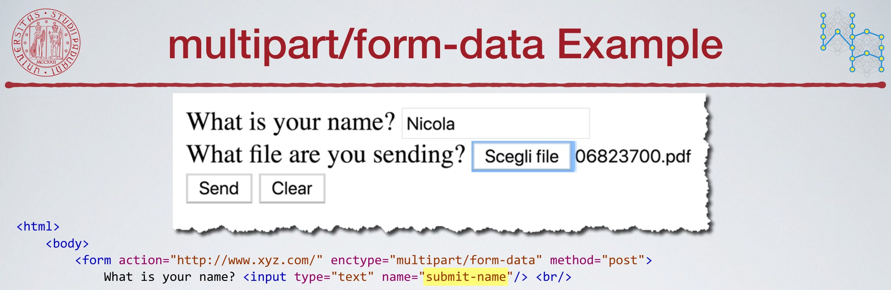

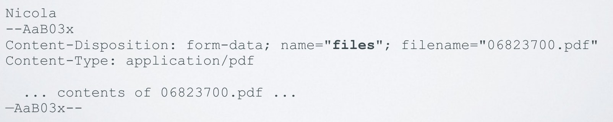

## Slide 26 - application/x-www-form-urlencoded Example

application/x-www-form-urlencoded Example

<html>
 <body>
  <form action="http://www.xyz.com/"
     enctype="application/x-www-form-urlencoded" method="post">
   What is your name? <input type="text" name="submit-name"/>  
      What is your surname? <input type="text" name="submit-surname"/>  
      <input type="submit" value="Send"/>
   <input type="reset" value="Clear"/>
  </form>
 </body>
</html>

Content-Type: application/x-www-form-urlencoded

submit-name=Nicola&submit-surname=Ferro

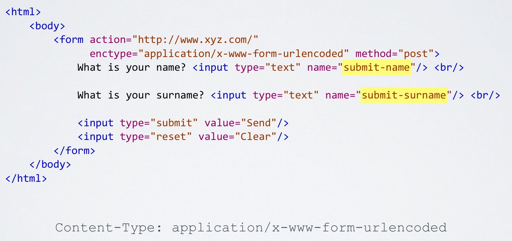

## Slide 27 - Up to Servlet 4.0: Apache Commons FileUpload

Up to Servlet 4.0: Apache Commons FileUpload

http://commons.apache.org/proper/commons-fileupload/

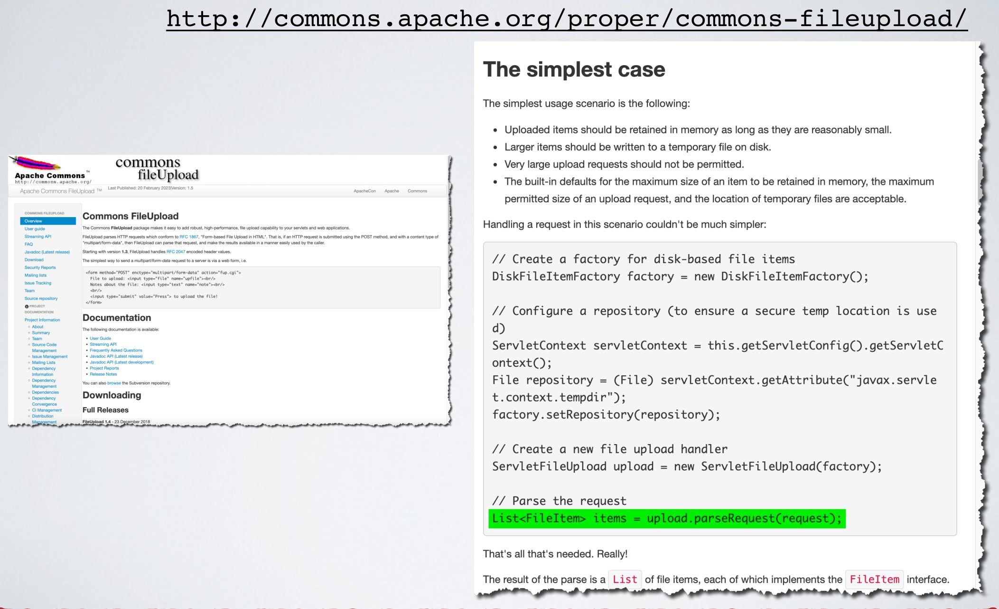

## Slide 28 - Up to Servlet 4.0: Apache Commons FileUpload

Up to Servlet 4.0: Apache Commons FileUpload

http://commons.apache.org/proper/commons-fileupload/

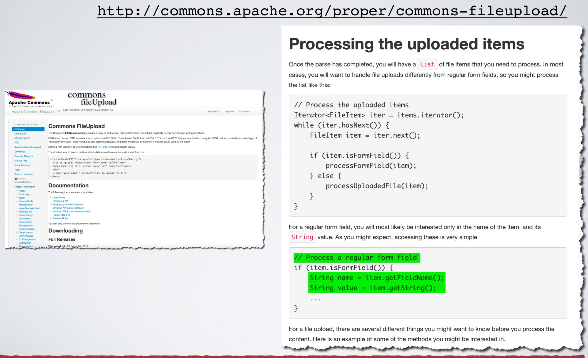

## Slide 29 - Up to Servlet 4.0: Apache Commons FileUpload

Up to Servlet 4.0: Apache Commons FileUpload

http://commons.apache.org/proper/commons-fileupload/

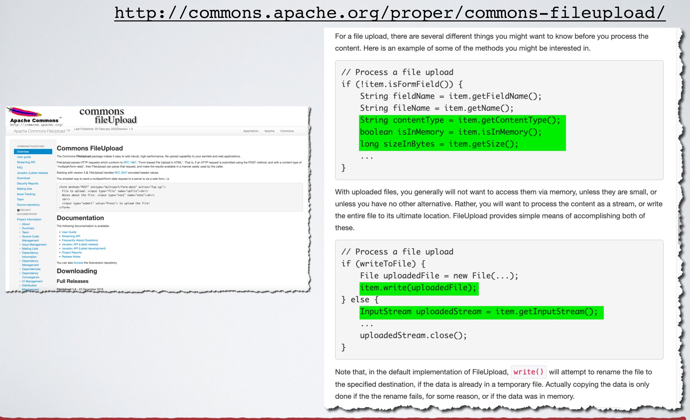

## Slide 30 - Since Servlet 5.0: Part Object

Since Servlet 5.0: Part Object

Since Servlet 5.0, the HttpServletRequest has the new

method getParts() which returns a collection of Part

objects

Each Part object represents

either a field of a form

or a file uploaded

You iterate over Part objects in a way very similar to

Apache Commons FileUpload

You need to configure maximum file size, request size, etc.
in the web.xml file (or via annotations)

## Slide 31 - Accessing a database via JSP,

Accessing a database via JSP,

servlets and JDBC, uploading

photos and sending emails

## Slide 32 - The Employee Database Revisited

The Employee Database Revisited

Employee
Manager
7309
5698

5998
5698

9553
4076

5698
4076

4076
8123
Manage

Employee

Badge Surname Age Salary
Email
Photo
PhotoMediaType
7309
Rossi
34
45
rossi@unipd.it
…
image/png

5998
Bianchi
37
38
bianchi@unipd.
…
image/png

9553
Neri
42
35
neri@unipd.it
…
image/jpeg

5698
Bruni
43
42
bruni@unipd.it
…
image/png

4076
Mori
45
50
mori@unipd.it
…
image/jpeg

8123
Lupi
46
60
lupi@unipd.it
…
image/jpeg

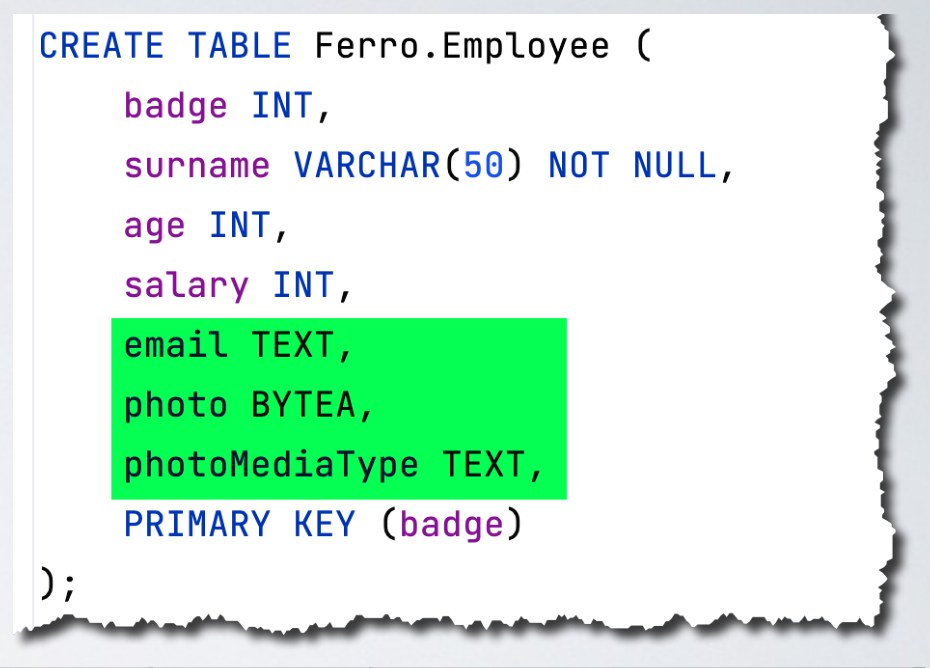

## Slide 33 - Create Employee: Multipart & Mail

Create Employee: Multipart & Mail

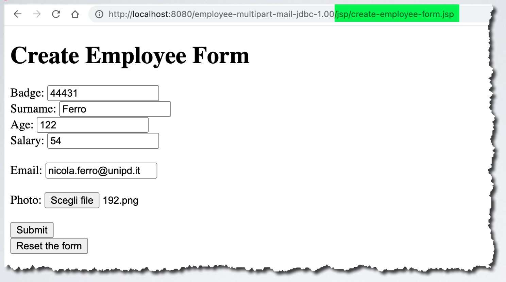

## Slide 34 - Create Employee: Multipart & Mail

Create Employee: Multipart & Mail

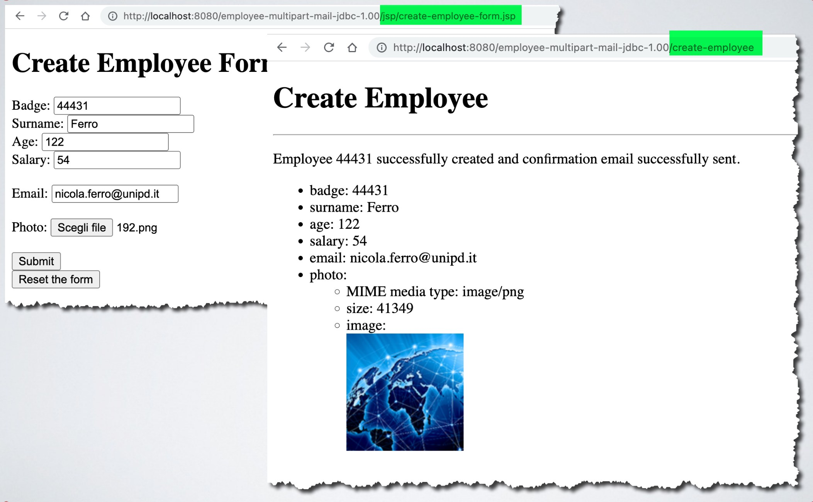

## Slide 35 - Create Employee: Multipart & Mail

Create Employee: Multipart & Mail

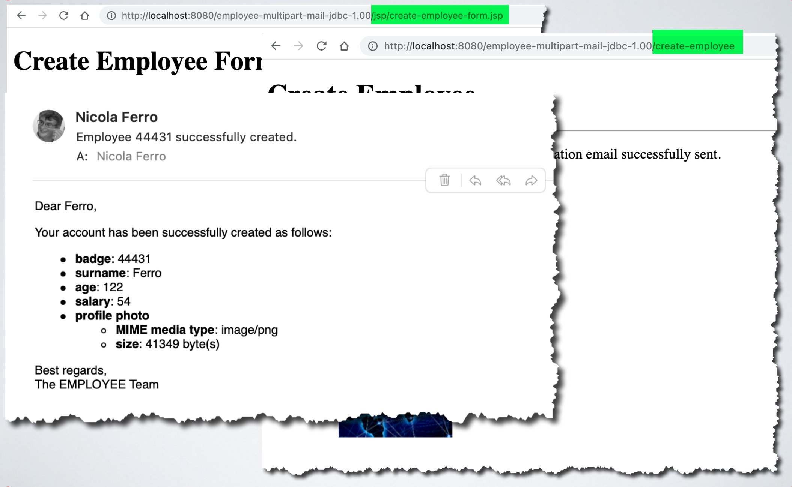

## Slide 36 - Employee Multipart & Mail

Employee Multipart & Mail

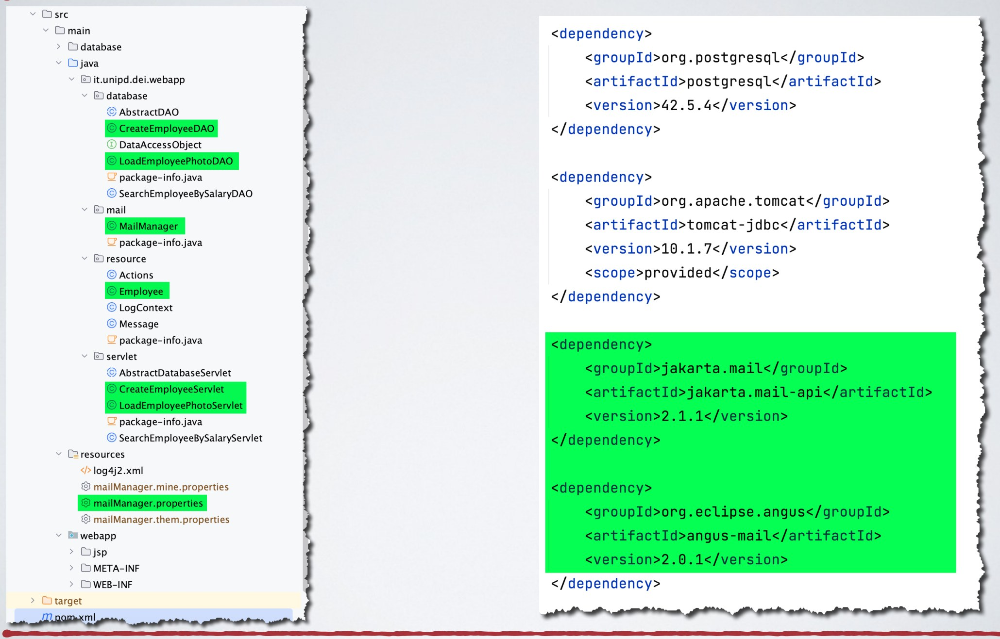

## Slide 37 - The Create Employee JSP Form

The Create Employee JSP Form

The enctype must be multipart/form-
data and the method must be POST

The fi

fi

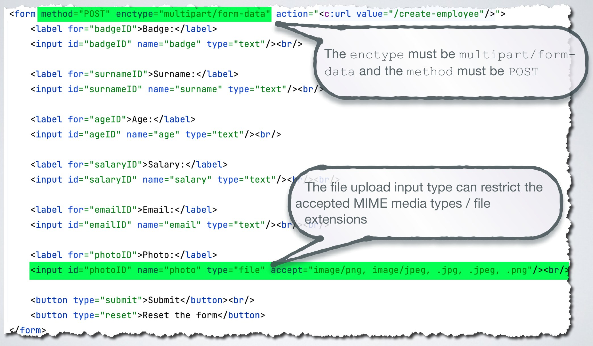

## Slide 38 - The Create Employee Result JSP Page

The Create Employee Result JSP Page

Check whether the Employee has a photo.

Note that (latest versions of) EL allows for invoking also

methods not using the JavaBeans conversion

The HTML  tag has to
be used to display the image of

the photo

The LoadEmployeePhotoServlet actually
loads the photo and sends it.

We can use c:param within c:url to set the

<%@ page contentType="text/html;charset=utf-8" %>¬
<%@ taglib prefix="c" uri="http://java.sun.com/jsp/jstl/core" %>¬
¬
<!DOCTYPE html>¬
<html lang="en">¬
<head>¬
    <title>Create Employee</title>¬
</head>¬
¬
<body>¬
<h1>Create Employee</h1>¬

¬
¬
<!-- display the message -->¬
<c:import url="/jsp/include/show-message.jsp"/>¬
¬
<!-- display the just created employee, if any and no errors -->¬
<c:if test="${not empty employee && !message.error}">¬
    <ul>¬
        <li>badge: <c:out value="${employee.badge}"/></li>¬
        <li>surname: <c:out value="${employee.surname}"/></li>¬
        <li>age: <c:out value="${employee.age}"/></li>¬
        <li>salary: <c:out value="${employee.salary}"/></li>¬
        <li>email: <c:out value="${employee.email}"/></li>¬
¬
        <c:choose>¬
            <c:when test="${employee.hasPhoto()}">¬
¬
                <li>photo:¬
                    <ul>¬
                        <li>MIME media type: <c:out value="${employee.photoMediaType}"/> </li>¬
                        <li>size: <c:out value="${employee.photoSize}"/> </li>¬
                        <li>image:  ¬
                            <c:param name="badge" value="${employee.badge}"/></c:url>"/>¬
                        </li>¬
                    </ul>¬
                </li>¬
¬
            </c:when>¬
¬
            <c:otherwise>¬
                <li>photo: not available</li>¬
            </c:otherwise>¬
        </c:choose>¬
    </ul>¬
</c:if>¬
</body>¬
</html>¬

## Slide 39 - The Employee Resource

The Employee Resource

We need the email to send the confi

The photo byte array holds the actual photo as raw bytes but we need

the photoMediaType to know the MIME media type (limited to image/

png or image/jpeg in our case) to properly interpret the raw bytes

Convenience methods to know
whether the Employee has a
photo and its size, avoiding several

corner cases

public class Employee {¬
¬
    private final int badge;¬
¬
    private final String surname;¬
¬
    private final int age;¬
¬
    private final int salary;¬
¬
    private final String email;¬
¬
    private final byte[] photo;¬
¬
    private final String photoMediaType;¬
¬
    public Employee(final int badge, final String surname, final int age, final int salary, final String email, final byte[] photo, final String photoMediaType) {¬
        this.badge = badge;¬
        this.surname = surname;¬
        this.age = age;¬
        this.salary = salary;¬
        this.email = email;¬
        this.photo = photo;¬
        this.photoMediaType = photoMediaType;¬
    }¬
¬
    public final int getBadge() {¬
        return badge;¬
    }¬
¬
    public final String getSurname() {¬
        return surname;¬
    }¬
¬
    public final int getAge() {¬
        return age;¬
    }¬
¬
    public final int getSalary() {¬
        return salary;¬
    }¬
¬
    public final String getEmail() {¬
        return email;¬
    }¬
¬
    public final byte[] getPhoto() {¬
        return photo;¬
    }¬
¬
    public final String getPhotoMediaType() {¬
        return photoMediaType;¬
    }¬
¬
    public final boolean hasPhoto() {¬
        return photo != null && photo.length > 0 && photoMediaType != null && !photoMediaType.isBlank();¬
    }¬
¬
    public final int getPhotoSize() {¬
        return photo != null ? photo.length : Integer.MIN_VALUE;¬
    }¬
¬
}¬

## Slide 40 - Create Employee DAO

Create Employee DAO

Very similar to the previous
version, just setting the new fi

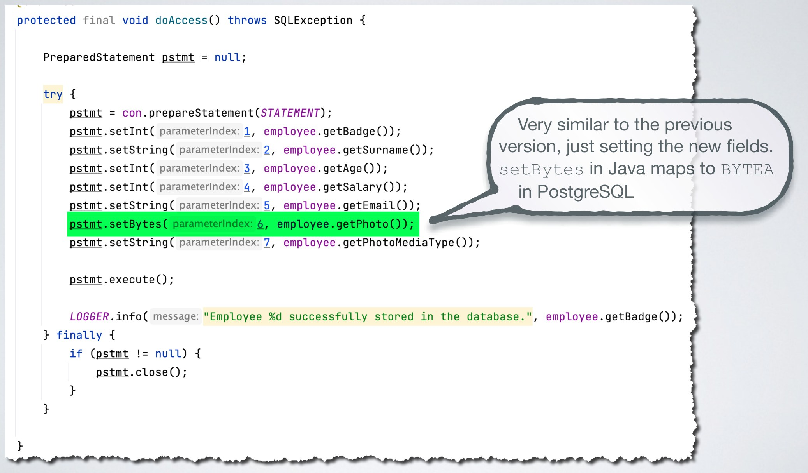

## Slide 41 - Load Employee Photo DAO

Load Employee Photo DAO

We use Employee as a convenience object for
holding the raw bytes of the photo and its MIME
media type but we do not fi
fi

fi

public final class LoadEmployeePhotoDAO extends AbstractDAO<Employee> {¬
¬
    private static final String STATEMENT = "SELECT photo, photoMediaType FROM Ferro.Employee WHERE badge = ?";¬
¬
    private final int badge;¬
¬
    public LoadEmployeePhotoDAO(final Connection con, final int badge) {¬
        super(con);¬
        this.badge = badge;¬
    }¬
¬
    @Override¬
    public final void doAccess() throws SQLException {¬
¬
        PreparedStatement pstmt = null;¬
        ResultSet rs = null;¬
¬
        // the results of the search¬
        Employee e = null;¬
¬
        try {¬
            pstmt = con.prepareStatement(STATEMENT);¬
            pstmt.setInt(1, badge);¬
¬
            rs = pstmt.executeQuery();¬
¬
            if (rs.next()) {¬
                e = new Employee(Integer.MIN_VALUE, null, Integer.MIN_VALUE, Integer.MIN_VALUE, null,¬
                        rs.getBytes("photo"), rs.getString("photoMediaType"));¬
¬
                LOGGER.info("Photo for employee %d successfully loaded.", badge);¬
            } else {¬
                LOGGER.warn("Employee %d not found.", badge);¬
                throw new SQLException(String.format("Employee %d not found.", badge), "NOT_FOUND");¬
            }¬
¬
¬
        } finally {¬
            if (rs != null) {¬
                rs.close();¬
            }¬
¬
            if (pstmt != null) {¬
                pstmt.close();¬
            }¬
¬
        }¬
¬
        this.outputParam = e;¬
    }¬
}¬

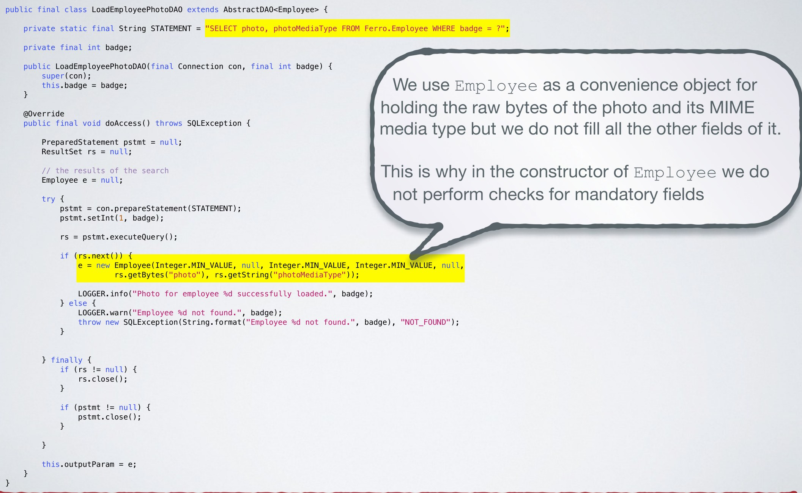

## Slide 42 - Create Employee Servlet

Create Employee Servlet

Parses the multipart/form-
data and creates an Employee object,

if possible

Sends a confi

Manages various
error conditions

Forwards to the JSP page
for the generation of the view

    public void doPost(HttpServletRequest req, HttpServletResponse res) throws ServletException, IOException {¬
¬
        LogContext.setIPAddress(req.getRemoteAddr());¬
        LogContext.setAction(Actions.CREATE_EMPLOYEE);¬
¬
        // model¬
        Employee e = null;¬
        Message m = null;¬
¬
        try {¬
            e = parseRequest(req);¬
¬
            LogContext.setResource(Integer.toString(e.getBadge()));¬
¬
            // creates a new object for accessing the database and stores the employee¬
            new CreateEmployeeDAO(getConnection(), e).access();¬
¬
            LOGGER.info("Employee %d successfully created in the database.", e.getBadge());¬
¬
            sendCreationConfirmationEmail(e);¬
¬
            LOGGER.info("Creation confirmation email for employee %d successfully sent.", e.getBadge());¬
¬
            m = new Message(String.format("Employee %d successfully created and confirmation email successfully sent.",¬
                    e.getBadge()));¬
¬
        } catch (NumberFormatException ex) {¬
            m = new Message(¬
                    "Cannot create the employee. Invalid input parameters: badge, age, and salary must be integer.",¬
                    "E100", ex.getMessage());¬
¬
            LOGGER.error(¬
                    "Cannot create the employee. Invalid input parameters: badge, age, and salary must be integer.",¬
                    ex);¬
        } catch (SQLException ex) {¬
            if ("23505".equals(ex.getSQLState())) {¬
                m = new Message(String.format("Cannot create the employee: employee %d already exists.", e.getBadge()),¬
                        "E300", ex.getMessage());¬
¬
                LOGGER.error(new StringFormattedMessage("Cannot create the employee: employee %d already exists.",¬
                        e.getBadge()), ex);¬
            } else {¬
                m = new Message("Cannot create the employee: unexpected error while accessing the database.", "E200",¬
                        ex.getMessage());¬
¬
                LOGGER.error("Cannot create the employee: unexpected error while accessing the database.", ex);¬
            }¬
        } catch (MimeTypeParseException ex) {¬
            m = new Message(¬
                    String.format("Unsupported MIME media type for employee photo. Expected: image/png or image/jpeg."),¬
                    "E400", ex.getMessage());¬
        } catch (MessagingException ex) {¬
            m = new Message(String.format("Employee %d successfully created but unable to send confirmation email.",¬
                    e.getBadge()));¬
¬
            LOGGER.warn(new StringFormattedMessage(¬
                    "Employee %d successfully created but unable to send confirmation email.", e.getBadge()), ex);¬
        }¬
¬
        try {¬
            // stores the employee and the message as a request attribute¬
            req.setAttribute("employee", e);¬
            req.setAttribute("message", m);¬
¬
            // forwards the control to the create-employee-result JSP¬
            req.getRequestDispatcher("/jsp/create-employee-result.jsp").forward(req, res);¬
        } catch (Exception ex) {¬
            LOGGER.error(¬
                    new StringFormattedMessage("Unable to send response after successfuly creation of employee %d.",¬
                            e.getBadge()), ex);¬
            throw ex;¬
        } finally {¬
            LogContext.removeIPAddress();¬
            LogContext.removeAction();¬
            LogContext.removeResource();¬
        }¬
¬
    }¬
¬

## Slide 43 - Create Employee Servlet

Create Employee Servlet

For each Part in the request, decide
how to process it based on its name

To process a Part, you need to obtain an
InputStream to read its bytes and then
transform them as appropriate.

Note the use of try-with-resources to

ensure the stream is always closed

The MIME media type of the uploaded fi

Always validate the MIME media type, even if
the upload form already restricts it.

Copy the raw bytes of the fi

    private Employee parseRequest(HttpServletRequest req) throws ServletException, IOException, MimeTypeParseException {¬
¬
        // request parameters¬
        int badge = -1;¬
        String surname = null;¬
        int age = -1;¬
        int salary = -1;¬
        String email = null;¬
        byte[] photo = null;¬
        String photoMediaType = null;¬
¬
        // retrieves the request parameters¬
        for (Part p : req.getParts()) {¬
¬
            switch (p.getName()) {¬
                case "badge":¬
¬
                    try (InputStream is = p.getInputStream()) {¬
                        badge = Integer.parseInt(new String(is.readAllBytes(), StandardCharsets.UTF_8).trim());¬
                    }¬
                    break;¬
¬
                case "surname":¬
                    try (InputStream is = p.getInputStream()) {¬
                        surname = new String(is.readAllBytes(), StandardCharsets.UTF_8).trim();¬
                    }¬
                    break;¬
¬
                case "age":¬
                    try (InputStream is = p.getInputStream()) {¬
                        age = Integer.parseInt(new String(is.readAllBytes(), StandardCharsets.UTF_8).trim());¬
                    }¬
                    break;¬
¬
                case "salary":¬
                    try (InputStream is = p.getInputStream()) {¬
                        salary = Integer.parseInt(new String(is.readAllBytes(), StandardCharsets.UTF_8).trim());¬
                    }¬
                    break;¬
¬
                case "email":¬
                    try (InputStream is = p.getInputStream()) {¬
                        email = new String(is.readAllBytes(), StandardCharsets.UTF_8).trim();¬
                    }¬
                    break;¬
¬
                case "photo":¬
                    photoMediaType = p.getContentType();¬
¬
                    switch (photoMediaType.toLowerCase().trim()) {¬
¬
                        case "image/png":¬
                        case "image/jpeg":¬
                        case "image/jpg":¬
                            // nothing to do¬
                            break;¬
¬
                        default:¬
                            LOGGER.error("Unsupported MIME media type %s for employee photo.", photoMediaType);¬
¬
                            throw new MimeTypeParseException(¬
                                    String.format("Unsupported MIME media type %s for employee photo.",¬
                                            photoMediaType));¬
                    }¬
¬
                    try (InputStream is = p.getInputStream()) {¬
                        photo = is.readAllBytes();¬
                    }¬
¬
                    break;¬
            }¬
¬
        }¬
¬
        // creates a new employee from the request parameters¬
        return new Employee(badge, surname, age, salary, email, photo, photoMediaType);¬
    }¬
¬

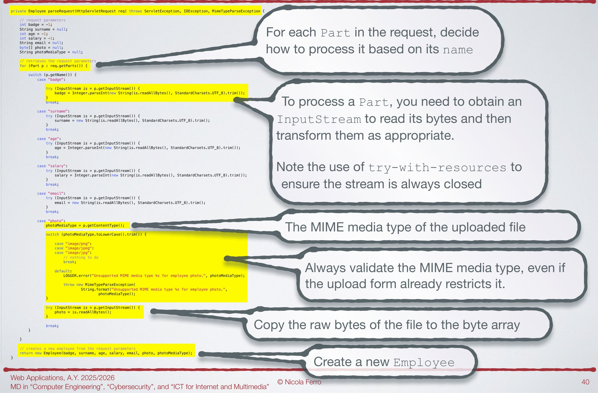

## Slide 44 - Create Employee Servlet

Create Employee Servlet

Write the body of the email, line-by-line

¬
    private void sendCreationConfirmationEmail(Employee e) throws MessagingException {¬
¬
        final StringBuilder sb = new StringBuilder();¬
¬
        sb.append(String.format("
Dear %s,
%n", e.getSurname()));¬
        sb.append(String.format("
Your account has been successfully created as follows:
%n"));¬
        sb.append(String.format("<ul>%n"));¬
        sb.append(String.format("<li><b>badge</b>: %d</li>%n", e.getBadge()));¬
        sb.append(String.format("<li><b>surname</b>: %s</li>%n", e.getSurname()));¬
        sb.append(String.format("<li><b>age</b>: %d</li>%n", e.getAge()));¬
        sb.append(String.format("<li><b>salary</b>: %d</li>%n", e.getSalary()));¬
¬
        if(e.hasPhoto()) {¬
            sb.append(String.format("<li><b>profile photo</b></li>%n"));¬
            sb.append(String.format("<ul>%n"));¬
            sb.append(String.format("<li><b>MIME media type</b>: %s</li>%n", e.getPhotoMediaType()));¬
            sb.append(String.format("<li><b>size</b>: %d byte(s)</li>%n", e.getPhotoSize()));¬
            sb.append(String.format("</ul>%n"));¬
        }¬
¬
        sb.append(String.format("</ul>%n"));¬
        sb.append(String.format("
Best regards, The EMPLOYEE Team
%n"));¬
¬
        MailManager.sendMail(e.getEmail(), String.format("Employee %s successfully created.", e.getBadge()),¬
                sb.toString(), "text/html;charset=UTF-8");¬
¬
    }¬
¬
}¬

Use the MailManager helper class to actually
send the email.

The sendMail method excepts to receive: the
recipient of the email; the subject of the email; the
body of the email; and, the MIME media type of the
body of the mail

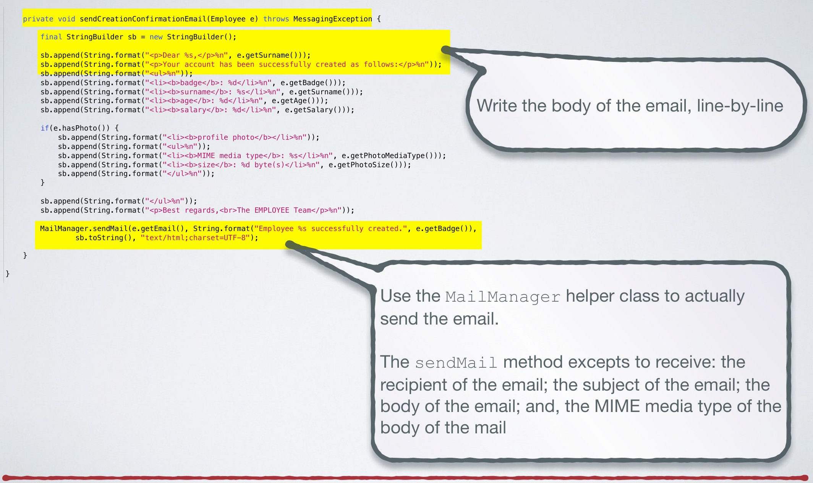

## Slide 45 - Load Employee Photo Servlet

Load Employee Photo Servlet

Loads the Employee photo from the
database, if any

If there is a photo, set the content-type
header with its MIME media type and directly

write the raw bytes to the response

If the Employee exists but has no
photo, write an NO_CONTENT response.

public final class LoadEmployeePhotoServlet extends AbstractDatabaseServlet {¬
¬
    public void doGet(HttpServletRequest req, HttpServletResponse res) throws ServletException, IOException {¬
¬
        LogContext.setIPAddress(req.getRemoteAddr());¬
        LogContext.setAction(Actions.LOAD_EMPLOYEE_PHOTO);¬
¬
        // request parameter¬
        int badge = -1;¬
¬
        // model¬
        Employee e = null;¬
¬
        try {¬
¬
            // retrieves the request parameter¬
            badge = Integer.parseInt(req.getParameter("badge"));¬
¬
            LogContext.setResource(req.getParameter("badge"));¬
¬
            // creates a new object for accessing the database and loading the photo of an employee¬
            e = new LoadEmployeePhotoDAO(getConnection(), badge).access().getOutputParam();¬
¬
            if (e.hasPhoto()) {¬
                res.setContentType(e.getPhotoMediaType());¬
                res.getOutputStream().write(e.getPhoto());¬
                res.getOutputStream().flush();¬
¬
                LOGGER.info("Photo for employee %d successfully sent.", badge);¬
            } else {¬
                LOGGER.info("Employee %d has no profile photo and/or valid MIME media type specified.", badge);¬
¬
                res.setStatus(HttpServletResponse.SC_NO_CONTENT);¬
            }¬
¬
        } catch (Exception ex) {¬
            LOGGER.error("Unable to load the photo of the employee.", ex);¬
¬
            res.setStatus(HttpServletResponse.SC_INTERNAL_SERVER_ERROR);¬
        } finally {¬
            LogContext.removeIPAddress();¬
            LogContext.removeAction();¬
            LogContext.removeUser();¬
        }¬
¬
    }¬
¬
}¬

If the Employee does not exist or
any other error happens, write an

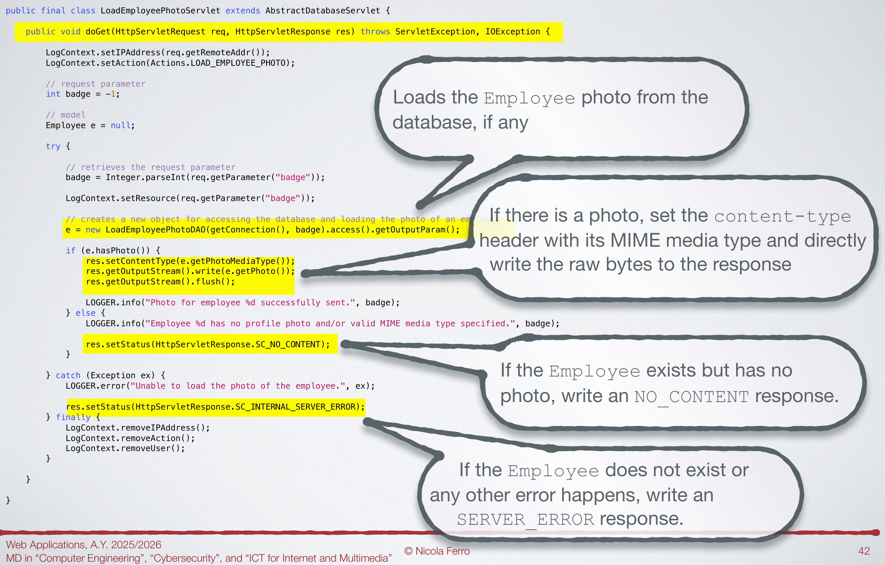

## Slide 46 - The web.xml File

The web.xml File

Confi

fi

fi

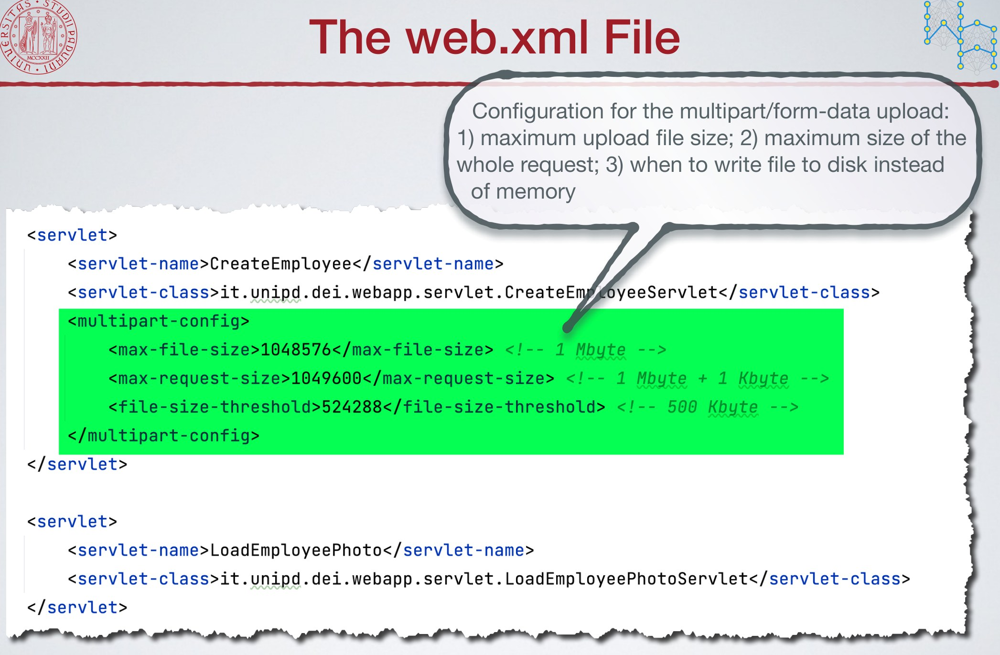

## Slide 47 - The MailManager Class

The MailManager Class

The mailManager.properties fi

fi

 private static Properties loadConfiguration() {¬

     // Get the class loader¬
     ClassLoader cl = MailManager.class.getClassLoader();¬
     if (cl == null) {¬
         cl = ClassLoader.getSystemClassLoader();¬
         LOGGER.debug("Using system class loader.");¬
     }¬

     // The properties holding the configuration of the MailManager¬
     final Properties cfg = new Properties();¬

     try (InputStream is = cl.getResourceAsStream(CONFIG_FILE)) {¬

The resources folder is on
the default class path of the
ClassLoader used to load the
MailManager class.

         if (is == null) {¬
             LOGGER.error("Configuration file %s cannot be opened.", CONFIG_FILE);¬
             throw new IllegalStateException(String.format("Configuration file %s cannot be opened.", CONFIG_FILE));¬
         }¬

         cfg.load(is);¬

Try to load the fi

     } catch (IOException ioe) {¬
         LOGGER.error(new StringFormattedMessage("Configuration file %s cannot be loaded.", CONFIG_FILE), ioe);¬
         throw new IllegalStateException(String.format("Configuration file %s cannot be loaded.", CONFIG_FILE), ioe);¬
     }¬

     return cfg;¬

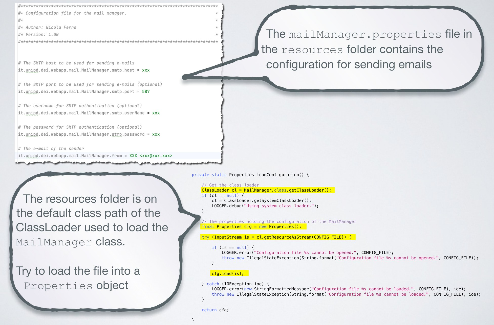

## Slide 48 - The MailManager Class

The MailManager Class

MailManager is an helper class
consisting just of static method to send
email. Therefore, we use a static
initialization block to load the
confi

The Session object will be used to

create a session with SMTP server and

send the email.

public final class MailManager {¬
¬
    private static final Logger LOGGER = LogManager.getLogger(MailManager.class,¬
            StringFormatterMessageFactory.INSTANCE);¬
¬
    private static final String CONFIG_FILE = "mailManager.properties";¬
¬
    private static final String from;¬
¬
    private static final Session session;¬
¬
    static {¬
        Properties cfg = loadConfiguration();¬
¬
        // set up the configuration for JavaMail¬
        final Properties p = new Properties();¬
¬
        String tmp = cfg.getProperty(MailManager.class.getName() + ".from");¬
        if (tmp == null || tmp.isBlank()) {¬
            LOGGER.error("Property %s missing or empty.", MailManager.class.getName() + ".from");¬
            throw new IllegalStateException(¬
                    String.format("Property %s missing or empty.", MailManager.class.getName() + ".from"));¬
        }¬
        from = tmp;¬
        p.put("mail.from", from);¬
¬
¬
        tmp = cfg.getProperty(MailManager.class.getName() + ".smtp.host");¬
        if (tmp == null || tmp.isBlank()) {¬
            LOGGER.error("Property %s missing or empty.", MailManager.class.getName() + ".smtp.host");¬
            throw new IllegalStateException(¬
                    String.format("Property %s missing or empty.", MailManager.class.getName() + ".smtp.host"));¬
        }¬
        p.put("mail.smtp.host", tmp);¬
¬
        tmp = cfg.getProperty(MailManager.class.getName() + ".smtp.port");¬
        if (tmp != null && !tmp.isBlank()) {¬
            p.put("mail.smtp.port", tmp);¬
        }¬
¬
        tmp = cfg.getProperty(MailManager.class.getName() + ".smtp.userName");¬
        if (tmp == null || tmp.isBlank()) { // ensure that null and blank are the same¬
            tmp = null;¬
        }¬
        final String username = tmp;¬
¬
        tmp = cfg.getProperty(MailManager.class.getName() + ".stmp.password");¬
        if (tmp == null || tmp.isBlank()) { // ensure that null and blank are the same¬
            tmp = null;¬
        }¬
        final String password = tmp;¬
¬
        p.put("mail.transport.protocol", "smtp");¬
        p.put("mail.smtp.starttls.enable", "true");¬
        p.put("mail.debug", "false");¬
¬
        if (username != null && password != null) {¬
            p.put("mail.smtp.auth", "true");¬
            session = Session.getInstance(p, new Authenticator() {¬
                protected PasswordAuthentication getPasswordAuthentication() {¬
                    return new PasswordAuthentication(username, password);¬
                }¬
            });¬
        } else {¬
            session = Session.getInstance(p);¬
        }¬
    }¬
¬

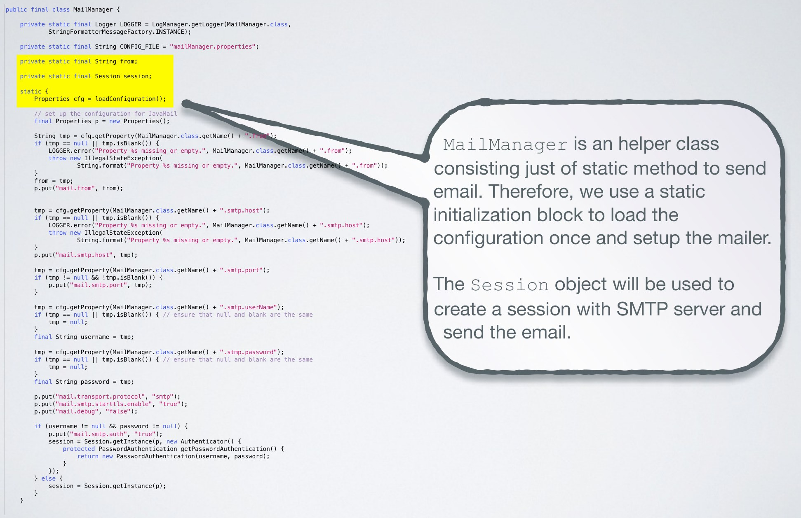

## Slide 49 - The MailManager Class

The MailManager Class

Sends a message
without attachments

Create a new MimeMessage which
represents the email to be sent

setFrom() gets the sender information from
the Session previously confi

Set the recipients of the message.

The sender is put in BCC

Set the subject and the
body of the message

Actually send the message

¬
    public static void sendMail(final String to, final String subject, final String message, final String messageMIME) throws¬
            MessagingException {¬
¬
        if (to == null || to.isBlank()) {¬
            LOGGER.error("Recipient of the email missing or empty.");¬
            throw new MessagingException("Recipient of the email missing or empty.");¬
        }¬
¬
        if (subject == null || subject.isBlank()) {¬
            LOGGER.error("Subject of the email missing or empty.");¬
            throw new MessagingException("Subject of the email missing or empty.");¬
        }¬
¬
        if (message == null || message.isBlank()) {¬
            LOGGER.error("Body of the email missing or empty.");¬
            throw new MessagingException("Body of the email missing or empty.");¬
        }¬
¬
        if (messageMIME == null) {¬
            LOGGER.error("MIME media type of the email message missing.");¬
            throw new MessagingException("MIME media type of the email message missing.");¬
        }¬
¬
        final MimeMessage mm = new MimeMessage(session); // the message¬
        InternetAddress ia = null; // to and bcc addresses¬
¬
        try {¬
¬
            mm.setFrom();¬
¬
            ia = new InternetAddress(to);¬
            mm.addRecipient(Message.RecipientType.TO, ia);¬
¬
            ia = new InternetAddress(from);¬
            mm.addRecipient(Message.RecipientType.BCC, ia);¬
¬
            mm.setSubject(subject);¬
¬
            // create the message part¬
            mm.setContent(message, messageMIME);¬
¬
            // Send the message¬
            Transport.send(mm);¬
¬
        } catch (AddressException e) {¬
            LOGGER.error(¬
                    new StringFormattedMessage("Invalid e-mail address %s for e-mail with subject %s.", to, subject),¬
                    e);¬
            throw e;¬
        } catch (final MessagingException e) {¬
            LOGGER.error(new StringFormattedMessage("Error while sending e-mail with subject %s to %s.", subject, to),¬
                    e);¬
            throw e;¬
        }¬
¬
        LOGGER.debug("E-mail with subject %s successfully sent to %s.", subject, to);¬
    }¬
¬

## Slide 50 - The MailManager Class

The MailManager Class

Sends a message
with attachments

The MimeMessage consists of multiple
parts, according to the multipart/mixed

MIME media type

One part is the body of
the email

Another part is the fi

The parts are set as
content of the message

¬
    public static void sendAttachmentMail(final String to, final String subject, final String message, final String messageMIME, final byte[] attachment, final String attachmentMIME, final String attachmentFileName) throws¬
            MessagingException {¬
¬
        if (to == null || to.isBlank()) {¬
            LOGGER.error("Recipient of the email missing or empty.");¬
            throw new MessagingException("Recipient of the email missing or empty.");¬
        }¬
¬
        if (subject == null || subject.isBlank()) {¬
            LOGGER.error("Subject of the email missing or empty.");¬
            throw new MessagingException("Subject of the email missing or empty.");¬
        }¬
¬
        if (message == null || message.isBlank()) {¬
            LOGGER.error("Body of the email missing or empty.");¬
            throw new MessagingException("Body of the email missing or empty.");¬
        }¬
¬
        if (messageMIME == null) {¬
            LOGGER.error("MIME media type of the email message missing.");¬
            throw new MessagingException("MIME media type of the email message missing.");¬
        }¬
¬
        if (attachment == null) {¬
            LOGGER.error("Attachment to the email missing.");¬
            throw new MessagingException("Attachment to the email missing.");¬
        }¬
¬
        if (attachmentMIME == null) {¬
            LOGGER.error("MIME media type of the email attachment missing.");¬
            throw new MessagingException("MIME media type of the email attachment missing.");¬
        }¬
¬
        if (attachmentFileName == null || attachmentFileName.isBlank()) {¬
            LOGGER.error("File name of the attachment missing or empty.");¬
            throw new MessagingException("File name of the attachment missing or empty.");¬
        }¬
¬
        final MimeMessage mm = new MimeMessage(session); // the message¬
        final Multipart multipart = new MimeMultipart(); // the body of the message¬
        MimeBodyPart messageBodyPart = null; // part of the body¬
        InternetAddress ia = null; // to and bcc addresses¬
¬
        try {¬
¬
            mm.setFrom();¬
¬
            ia = new InternetAddress(to);¬
            mm.addRecipient(Message.RecipientType.TO, ia);¬
¬
            ia = new InternetAddress(from);¬
            mm.addRecipient(Message.RecipientType.BCC, ia);¬
¬
            mm.setSubject(subject);¬
¬
            // create the message part¬
            messageBodyPart = new MimeBodyPart();¬
            messageBodyPart.setContent(message, messageMIME);¬
            multipart.addBodyPart(messageBodyPart);¬
¬
            // create the attachment part¬
            messageBodyPart = new MimeBodyPart();¬
            messageBodyPart.setDataHandler(new DataHandler(new ByteArrayDataSource(attachment, attachmentMIME)));¬
            messageBodyPart.setFileName(attachmentFileName);¬
            multipart.addBodyPart(messageBodyPart);¬
¬
            // Put parts in message¬
            mm.setContent(multipart);¬
¬
            // Send the message¬
            Transport.send(mm);¬
¬
        } catch (AddressException e) {¬
            LOGGER.error(¬
                    new StringFormattedMessage("Invalid e-mail address %s for e-mail with subject %s.", to, subject),¬
                    e);¬
            throw e;¬
        } catch (final MessagingException e) {¬
            LOGGER.error(new StringFormattedMessage("Error while sending e-mail with subject %s to %s.", subject, to),¬
                    e);¬
            throw e;¬
        }¬
¬
        LOGGER.debug("E-mail with subject %s and attachment %s successfully sent to %s.", subject, attachmentFileName,¬
                to);¬
    }¬
¬

## Slide 51 - HTTP 1.1

HTTP 1.1

## Slide 52 - Overview of HTTP

Overview of HTTP

Hypertext Transfer Protocol (HTTP) is a textual request-response protocol where clients
and servers exchange messages constituted by an header and an optional body

HTTP is a stateless protocol, i.e. each request-response is independent and neither the
client nor the server has to keep trace of the exchanged messages

this simplifies the implementation of the protocol and makes it more scalable

HTTP is designed to favour the use of intermediaries or proxies, typically for caching or
security purposes

request

request
request
request

response
response

response

Browser

Proxy
(gateway.myisp.net)

Web server
(www.neurozen.com)

Proxy
(firewall.neurozen.com)

response

Fielding, R., Gettys, Y., Mogul, J., Frystyk, H., and Berners-Lee, T. (1997). Hypertext Transfer Protocol – HTTP/1.1. RFC 2068.
https://www.rfc-editor.org/rfc/rfc2068.txt

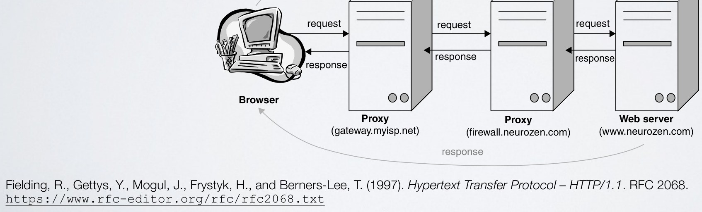

## Slide 53 - HTTP Request Methods

HTTP Request Methods

GET: means retrieve whatever information is identified by the request URI

POST: is used to request that the destination server accept the entity enclosed in the
request as a new subordinate of the resource identified by the request URI

PUT: requests that the enclosed entity be stored under the supplied request URI. If the
request URI refers to an already existing resource, the enclosed entity should be
considered as a modified version of the one residing on the origin server. If the request
URI does not point to an existing resource, and that URI is capable of being defined as a
new resource by the requesting user agent, the origin server can create the resource with
that URI

DELETE: requests that the origin server deletes the resource identified by the request
URI

HEAD: is identical to GET except that the server must not return a message-body in the
response. The meta-information contained in the HTTP headers in response to a HEAD
request should be identical to the information sent in response to a GET request

OPTIONS: represents a request for information about the communication options
available on the request/response chain identified by the Request-URI

## Slide 54 - Properties of HTTP Methods

Properties of HTTP Methods

Safe methods: if their defined semantics is essentially read-only; i.e., the client
does not request, and does not expect, any state change on the origin server as a
result of applying a safe method to a target resource; in other words, they should
not have side effects

The purpose of distinguishing between safe and unsafe methods is to allow automated retrieval
processes (spiders) and cache performance optimization (pre-fetching) to work without fear of
causing harm.

safe: GET, HEAD, OPTIONS; not safe: DELETE, POST, PUT

Idempotent methods: if the intended effect on the server of multiple identical
requests with that method is the same as the effect for a single such request

Idempotent methods are distinguished because the request can be repeated automatically if a
communication failure occurs before the client is able to read the server's response

idempotent: GET, HEAD, OPTION (safe methods), DELETE, PUT;  not idempotent: POST

Cacheable methods: indicate that responses to them are allowed to be stored for
future reuse; in general, safe methods are defined as cacheable

## Slide 55 - Summary on HTTP Methods

Summary on HTTP Methods

Response

Cacheabl

HTTP
Method

Request
Has Body

Has Body
Safe
Idempote

nt

e

GET
Optional
Yes
Yes
Yes
Yes

HEAD
No
No
Yes
Yes
Yes

POST
Yes
Yes
No
No
Yes

PUT
Yes
Yes
No
Yes
No

DELETE
No
Yes
No
Yes
No

OPTIONS
Optional
Yes
Yes
Yes
No

## Slide 56 - HTTP Response Status Codes

HTTP Response Status Codes

The first digit of the Status-Code defines the class of response.

1xx: Informational - Request received, continuing process

HTTP/1.1 101 Switching Protocols

2xx: Success - The action was successfully received, understood, and accepted

HTTP/1.1 200 OK

3xx: Redirection - Further action must be taken in order to complete the request

HTTP/1.1 301 Moved Permanently
Location: http://www.dei.unipd.it/

4xx: Client Error - The request contains bad syntax or cannot be fulfilled

HTTP/1.1 404 Not Found

5xx: Server Error - The server failed to fulfill an apparently valid request

HTTP/1.1 500 Internal Server Error

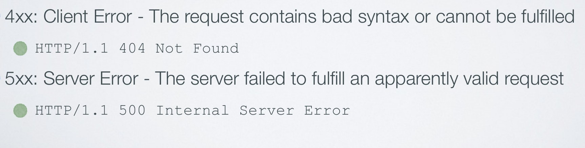

## Slide 57 - (Some) HTTP Request Headers

(Some) HTTP Request Headers

Accept: specifies response media types that are acceptable

example, Accept: text/plain, text/plain, image/*

Accept-Charset: indicates what charsets are acceptable in textual response content

example, Accept-Charset: iso-8859-5, UTF-8

Accept-Encoding: indicates what response content-codings are acceptable in the response.  An “identity”

token is used as a synonym for “no encoding” in order to communicate when no encoding is preferred

example, Accept-Encoding: compress, gzip

Accept-Language: indicates the set of natural languages that are preferred in the response

example,  Accept-Language: it, da, en-gb

for language codes see, e.g., ISO 639-1 (2002). Codes for the representation of names of languages – Part 1: Alpha-2 code.
Recommendation ISO 639-1:2002.

Referer: allows the user agent to specify a URI reference for the resource from which the target URI was obtained,
i.e. the "referrer", though the field name is misspelled. The referer header field allows servers to generate back-

links to  other resources for simple analytics, logging, optimized caching,  etc.

example, Referer: http://www.example.org/hypertext/Overview.html

User-Agent: contains information about the user  agent originating the request, which is often used by servers to
help identify the scope of reported interoperability problems, to work around or tailor responses to avoid particular
user agent limitations, and for analytics regarding browser or operating system use

example, User-Agent: CERN-LineMode/2.15 libwww/2.17b3

## Slide 58 - (Some) HTTP Response Headers

(Some) HTTP Response Headers

Content-Type: indicates the MIME media type of the associated representation

example, Content-Type: text/html; charset=ISO-8859-4

Content-Encoding: indicates what content codings have been applied to the representation, typically compression

example, Content-Encoding: gzip

Content-Language: describes the natural language(s) of the intended audience for the representation

example, Content-Language: it, en

Content-Length:  provides the anticipated size, as a decimal number of octets, for a potential payload body

example, Content-Length: 8092

Allow: lists the set of methods advertised as supported by the target resource

example, Allow: GET, HEAD, PUT

Server: contains information about the software used by the origin server to handle the request, which is often used
by clients to help identify the scope of reported interoperability problems, to work around or tailor requests to avoid
particular server limitations, and for analytics regarding server or operating system use

example, Server: CERN/3.0 libwww/2.17

Date: represents the date and time at which the message was originated

example, Date: Tue, 15 Nov 1994 08:12:31 GMT

Last-Modified: provides a timestamp indicating the date and time at which the origin server believes the selected
representation was last modified

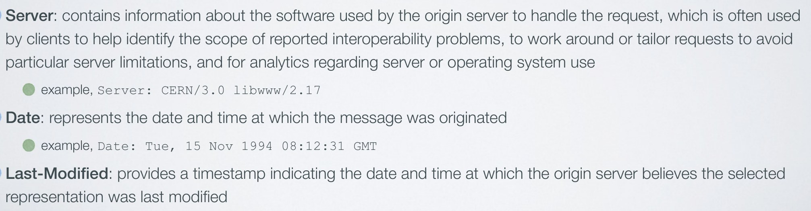

## Slide 59 - Authentication and Authorization

Authentication and Authorization

To access secured resources, the client has to send authentication information by using the Authorization header,

which supports various authentication mechanisms

The simplest authentication mechanism is the Basic  one where user name and password are concatenated with a

colon (:) and encoded base64

example for a user with user name nicola and password ferro — the authentication string nicola:ferro becomes
bmljb2xhOmZlcnJv in base64
GET /secured-resource/pippo.jpg
Authorization: Basic bmljb2xhOmZlcnJv

not that with basic authentication, user credentials are just encoded but not encrypted. So, this mechanism does not guarantee
confidentiality, if not used together with some other technique such as https

If the client tries to access secured resources without providing authentication credentials (or providing the wrong
ones), the server replies with an authentication challenge returning the status code 401 Unauthorized and

setting the WWW-Authenticate header to specify the expected authentication mechanism

example of authentication challenge
HTTP/1.1 401 Unauthorized
WWW-Authenticate: Basic realm=“Webapp"

the realm allows the protected resources on a server to be partitioned into a set of protection spaces, each with its own authentication
scheme and/or authorization database

Web browsers reply to an authentication challenge by showing a username/password windows to enter user credentials. Authentication
is required only the first time a real is accessed because, after the first successful authentication, Web browser automatically add the
Authorization header to all subsequent request under the same realm

Fielding, R. and Reschke, J. (2014). Hypertext Transfer Protocol (HTTP/1.1): Authentication. RFC 7235.
https://www.rfc-editor.org/rfc/rfc7235.txt

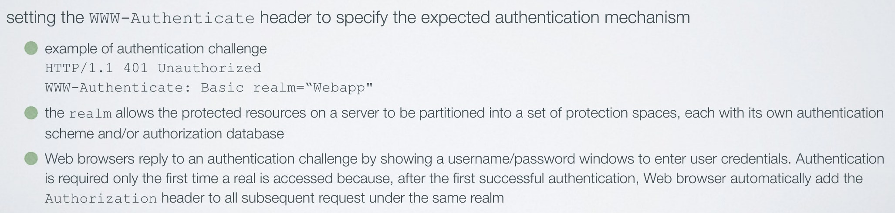

## Slide 60 - Accessing a database via

Accessing a database via

JSP, servlets, JDBC, and

Session

## Slide 61 - Employee Session JDBC

Employee Session JDBC

web.xml

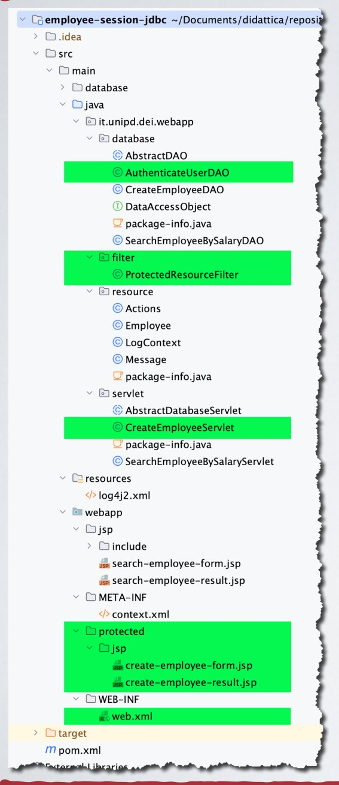

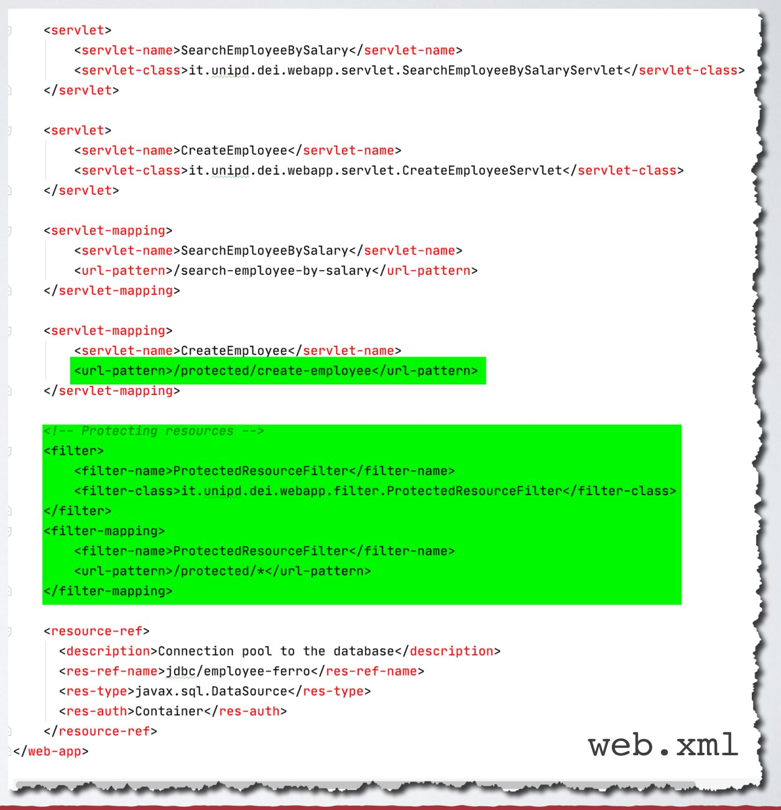

## Slide 62 - Employee Session JDBC: ProtectedResourceFilter

Employee Session JDBC: ProtectedResourceFilter

The Filter interface defi

fi

To be used for decoding the
HTTP basic authentication

header

An HTTPSession is basically an
hash map. This is the key for the user,

once authenticated, in the session

Confi

The pool for the connection to be passed
to AuthenticateUserDAO to perform the

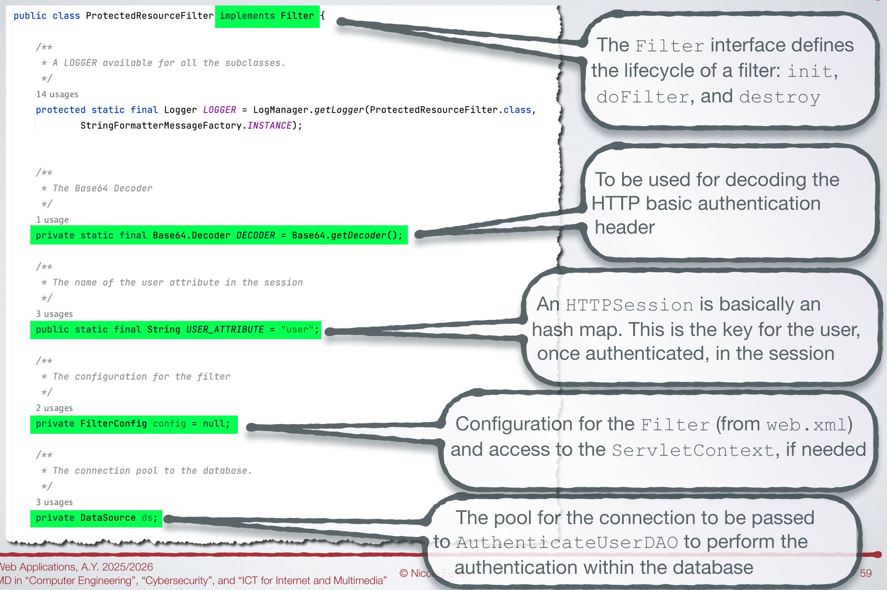

## Slide 63 - Employee Session JDBC: AuthenticateUserDAO

Employee Session JDBC: AuthenticateUserDAO

It receives the username and
password in the constructor and
(it is supposed to) performs a
query to the database to
authenticate the user.

The boolean outputParam will
be true if authentication is

successful; false otherwise.

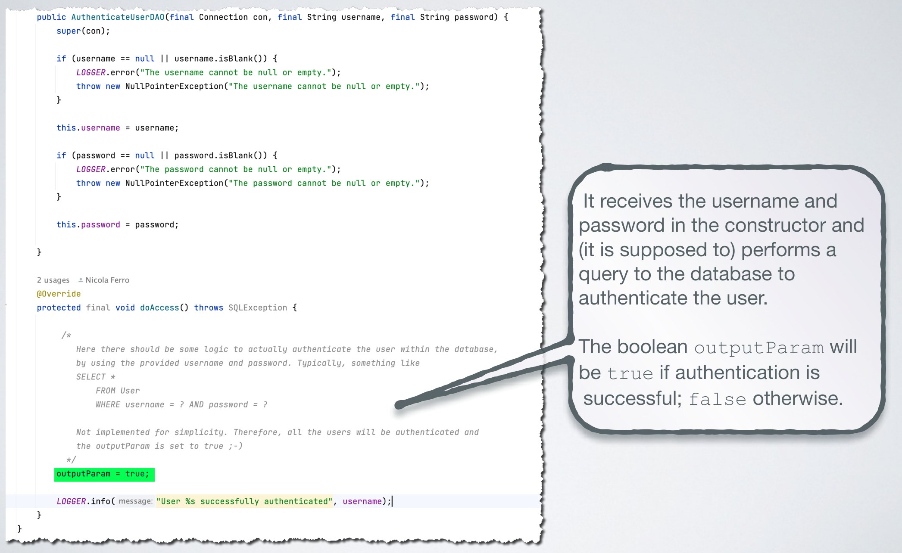

## Slide 64 - Employee Session JDBC: ProtectedResourceFilter

Employee Session JDBC: ProtectedResourceFilter

Retrieves the
connection pool from the

JNDI context

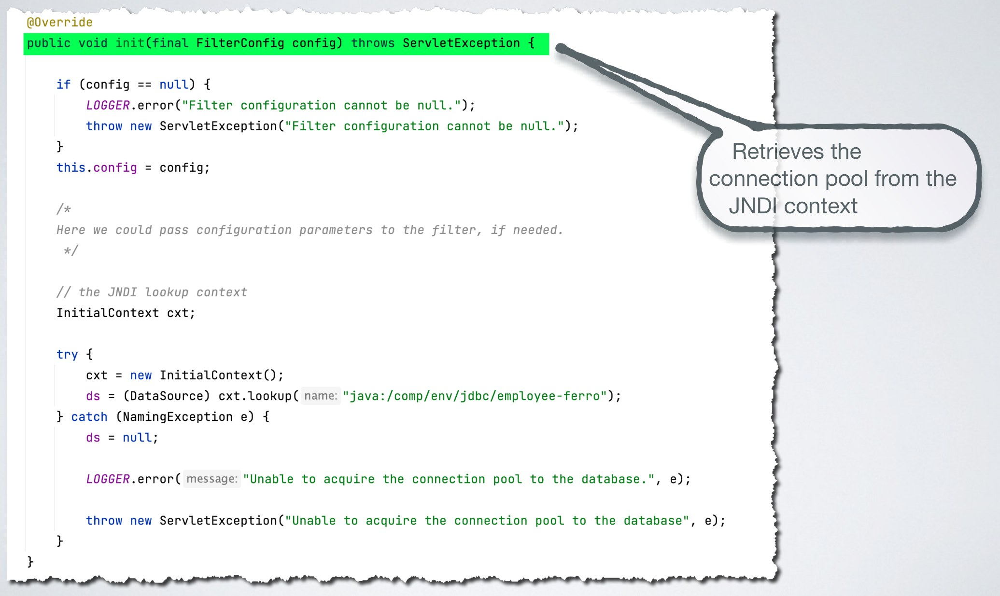

## Slide 65 - Employee Session JDBC: ProtectedResourceFilter

Employee Session JDBC: ProtectedResourceFilter

Overall, if a session
containing a user exists or if it is
possible to authenticate a user, it
will pass the control to the next
elements in the fi

If there is no session, try to
authenticate the user

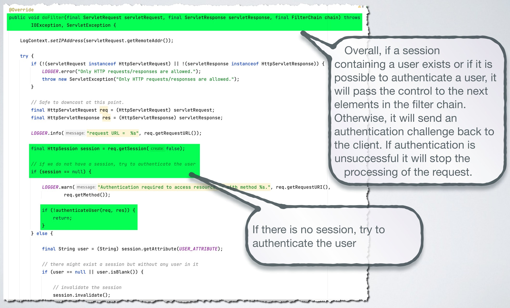

## Slide 66 - Employee Session JDBC: ProtectedResourceFilter

Employee Session JDBC: ProtectedResourceFilter

If there is a session but not valid
user in it, invalidate the session

and try to authenticate the user

If we arrive here, it means that there is
a session and a successfully
authenticated user. Pass control to the

next element in the fi

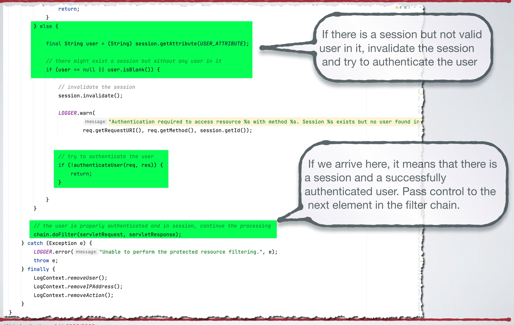

## Slide 67 - Employee Session JDBC: ProtectedResourceFilter

Employee Session JDBC: ProtectedResourceFilter

Performs the actual
authentication of the user

Looks for an Authorization
header in the request. If it is not
present or it is not a HTTP Basic
authentication, then it sends back an

authentication challenge

If there is an HTTP Basic
Authorization header, it decodes
it Base64 and splits the string at : to

obtain the username and password

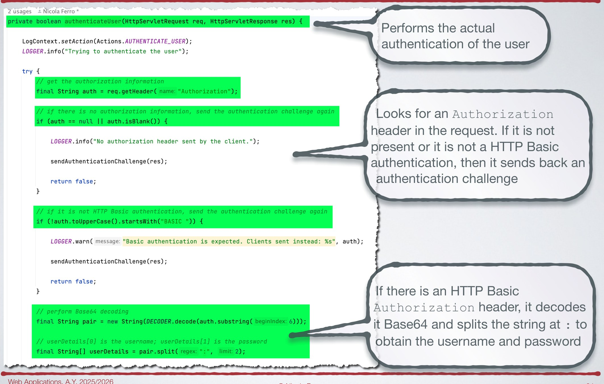

## Slide 68 - Employee Session JDBC: ProtectedResourceFilter

Employee Session JDBC: ProtectedResourceFilter

Use AuthenticateUserDAO to perform the
authentication form the database; if successful, create an

HttpSession and put the just authenticated user in it.

If authentication is not
successful, send an authentication

challenge and return false.

## Slide 69 - Employee Session JDBC: ProtectedResourceFilter

Employee Session JDBC: ProtectedResourceFilter

Set the header for the HTTP Basic
authentication challenge and set the

correct HTTP status code

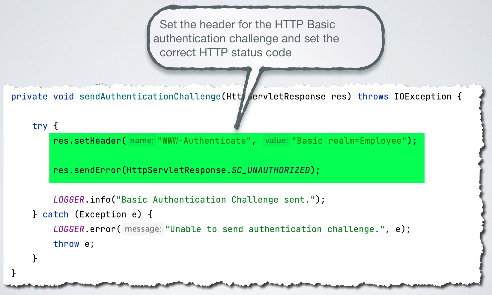

## Slide 70 - Employee Session JDBC: JSP pages

Employee Session JDBC: JSP pages

It works as before but we can leverage the
existence of an HTTP session to get the user in

the session and say hello to her/him

## Slide 71 - Employee Session JDBC: CreateEmployeeServlet

Employee Session JDBC: CreateEmployeeServlet

It works as before but we can leverage the
existence of an HTTP session to get the user in

the session and put it in the log context

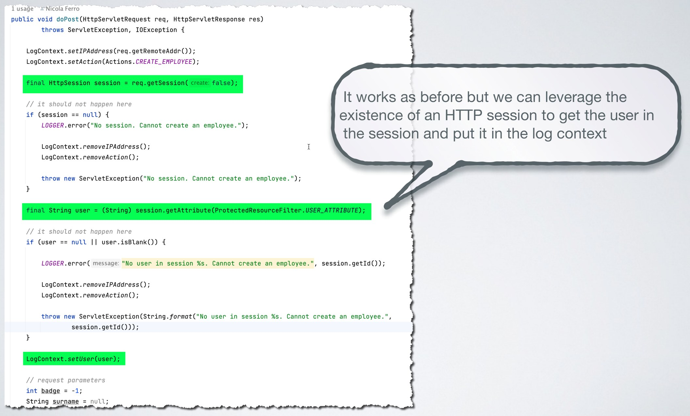

## Slide 72 - Slide 72
