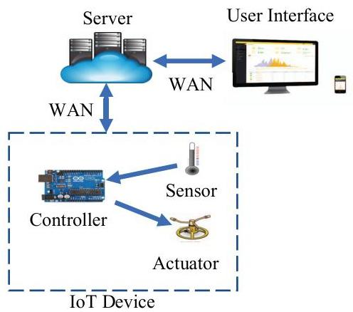
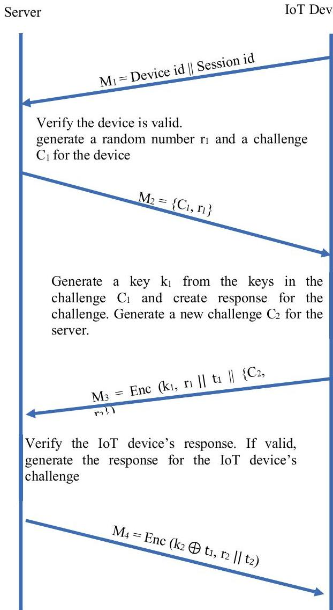
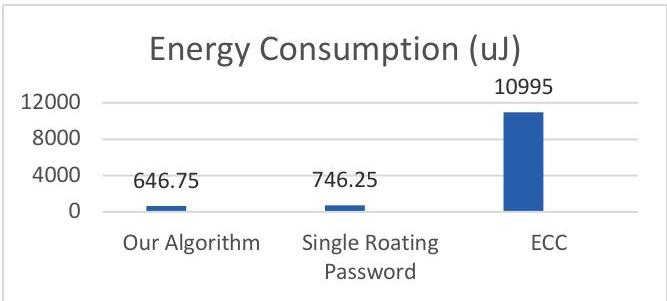

2018 17th IEEE International Conference On Trust, Security And Privacy In Computing And Communications/ 12th IEEE International Conference On Big Data Science And Engineering

# Authentication of IoT Device and IoT Server Using Secure Vaults

Trusit Shah
Department of Computer Science
University of Texas at Dallas
Richardson, TX 75080
trusit.shah@utdallas.edu

S. Venkatesan
Department of Computer Science
University of Texas at Dallas
Richardson, TX 75080
venky@utdallas.edu

Abstract—Internet of Things is a topic of much interest and, in last few years, security of the IoT systems is a field of tremendous research activities. Mutual authentication between IoT devices and IoT servers is an important part of secure IoT systems. Single password-based authentication mechanisms, which are widely used, are vulnerable to side-channel and dictionary attacks. In this paper, we present a multi-key (or multi-password) based mutual authentication mechanism. In our approach, the shared secret between the IoT server and the IoT device is called secure vault, which is a collection of equal sized keys. Initial contents of the secure vault are shared between the server and the IoT device and contents of the secure vault change after every successful communication session. We have implemented this mechanism on an Arduino device to prove our algorithm is feasible on IoT devices with memory and computational power constraints.

Keywords—IoT Security, IoT Device Authentication, Secure Vault

# I. INTRODUCTION

In the world of the Internet of Things (IoT), billions of devices are connected to the Internet, which provides an intruder an opportunity to manipulate the IoT system on a large scale. Authentication, authorization, privacy and data confidentiality are some of the major security issues of IoT [9]. Attacks on IoT devices can happen at one or more layers from the following: 1) Hardware layer, 2) Network layer and 3) Cloud layer [10].

At the hardware layer, an attacker gets access to the IoT hardware and retrieves the keys or security parameters stored inside the IoT device. The attacker can recreate a duplicate or virtual IoT device using the stolen security parameters. The duplicate IoT device can upload false data to the server and retrieve secure information about the user from the server or the network to which the IoT device is connected. There are some side channel attacks available using which an attacker can get access to security parameters of the IoT device without having a physical access to the device. Researchers have exhibited electromagnetic based side channel attacks to steal keys of RSA and ECC based encryption [11,12]. Using side channel attacks AES encryption keys can be stolen from IoT devices [13,21]. Since the IoT devices are connected to the internet, such devices are vulnerable to attacks through the

network. MIRAI malware is an example of such attacks, where many IoT devices have been attacked outside of the network and used as network zombies to attack other websites and internet services [22]. Peraković, et al. [16] have discussed the increased amount of DDoS attacks using IoT devices. DDoS attacks based on protocols like SSDP (a universal plug and play protocol), which is widely used in IoT devices, have increased significantly after 2013. There have been other cases of network attacks where the attacker attacked IoT devices from outside and used IoT devices to gather personal details of the owners¹. An IoT device with a proper authentication mechanism can avoid many such situations. Researchers have been working on creating such secure authentication mechanisms. These authentication mechanisms securely identify the server and the IoT device using either a public key or a shared key infrastructure.

In this paper, we propose a secure authentication protocol to authenticate the IoT device and the server. Some of the current authentication mechanisms, which are mostly based on single password-based mechanism, are vulnerable to side-channel and dictionary attacks. We have designed a multi key authentication mechanism, such that, even if the secret key (or a combination of keys) used for ongoing authentication is retrieved successfully by the attacker, the attacker cannot gain access to the unused authentication keys and the authentication system is secure from the side channel attack or similar attacks. The key values keep changing over the time, which prevents dictionary attacks.

This paper is organized as follows. We discuss previous work in Section 2. Section 3 describes system architecture and threat model. Our authentication mechanism is explained in Section 4. Section 5 describes implementation details followed by Section 6, which provides performance analysis.

# II. PREVIOUS WORK

Many devices that are part of IoT system have constraints (such as computational, memory, energy, etc). IETF's RFC 7228[24] has proposed an application layer protocol, CoAP for low end IoT devices to connect to the internet. IETF has also introduced low power security mechanism, DTLS (Datagram Transport Layer Security) [25] for secure communication over the CoAP protocol. Kothmayr et. al. [1] have proposed a two-way authentication system over the DTLS. The authentication

2324-9013/18/31.00 ©2018 IEEE

DOI 10.1109/TrustCom/BigDataSE.2018.00117

IEEE computer society

Authorized licensed use limited to: POLO BIBLIOTECARIO DI INGEGNERIA. Downloaded on March 02,2026 at 09:41:27 UTC from IEEE Xplore. Restrictions apply.

system is based on the well-known RSA scheme, which is hard to deploy in severely constrained devices. Raza, et. al. [2] also present an approach based on the DTLS. They have adopted a shared key approach rather than RSA, which makes it more feasible for resource-constrained devices.

One approach suggested by researchers for IoT authentication is the use of ECC public key encryption [3]. Even though ECC requires less memory and computational power than other public key encryption methods, it requires more memory and computational power than shared key encryption. Also, some side channel attacks are possible for ECC [4]. Barreto et al. [5] present an SSO based authentication system for authenticating the IoT device, the IoT cloud and the user. They create an authentication mechanism where the server authenticates the user using a user credential and then the server communicates with the IoT device (they mutually authenticate each other). After both end points (IoT device and the server) successfully authenticate each other, the server grants access. Porambage, et al. [15] introduced an ECC based two phase authentication algorithm. The scheme of Porambage, et al. is a pervasive authentication scheme based on the ECC certificate. Butun, et al. [19] present an end to end cloud centric authentication mechanism for the IoT devices. They use ECC for authentication of the user to the IoT device. All the above authentication mechanisms use ECC based public certificate or ECC based Diffie and Heilman mechanism for authentication, which makes the authentication mechanism secure.

Jan et al. [6] introduce a robust authentication mechanism using which the server and the IoT device can mutually authenticate each other. They use shared key approach to authenticate the server and the IoT device and a secret is shared between them. Their algorithm uses AES encryption for mutual authentication. If this single key is lost (or compromised), the two end points must replace their shared keys.

## III. SYSTEM ARCHITECTURE

Figure 1 illustrates a typical IoT system. The system consists of 3 major components: An IoT device, an IoT server and a user interface. The IoT device is responsible for collecting the data generated by the sensors connected to it and uploading them to the server. In many cases, it also processes the data before uploading to the server. The IoT device communicates with the IoT server through a wide area network. This IoT system is accessible to the user using a web and/or a mobile interface.

Keep your text and graphic files separate until after the text has been formatted and styled. Do not use hard tabs, and limit use of hard returns to only one return at the end of a paragraph. Do not add any kind of pagination anywhere in the paper. Do not number text heads—the template will do that for you.

## Assumptions

- We use an initial vault consisting of $n$ keys of $m$ bits each. Parameters $m$ and $n$ can be chosen by the developer based on security requirements and memory constraints.

- IoT devices are constrained devices and have low memory, computational capabilities and low energy availability.
- Each IoT device has a unique identification number assigned.
- An initial secure vault is stored in the IoT device and this initial vault is shared with the server.
- The server has a well-protected database.
- Side-channel attacks can be performed by an adversary.
- All the data exchanged between the server and the IoT device is over a reliable channel, so there is no data loss and every message is delivered exactly once.

Figure 1 IoT System Architecture

## A. Threat Model

The IoT server is deployed in the cloud and communicates with the client (or IoT device) over WAN. Single key based authentication mechanisms are not sufficient to authenticate the IoT device to the server. There are some side-channel attacks possible to retrieve the shared key during the communication between the IoT server and the IoT device. If the password does not change over the time, it is vulnerable to the dictionary attack. Once the adversary has the shared key, a fake device can be created using that shared key.

In our protocol, we use a set of keys, called a secure vault, to authenticate both the server and the IoT device. This secure vault is initially shared between the server and the IoT device and it changes its values based on data exchanged between the IoT server and the IoT device. Thus, contents of the vault change constantly. No additional message is exchanged between the IoT server and the IoT device to change the value of the secure vault.

We use the standard 3-way mutual authentication for authenticating the IoT server and the IoT device. The communication is initiated by IoT device by sending a connection request to the server. When this request is received by the IoT server, it sends back a challenge to the IoT device; the IoT device responds to the IoT server's challenge and sends an authentication challenge to the IoT server. The IoT

Authorized licensed use limited to: POLO BIBLIOTECARIO DI INGEGNERIA. Downloaded on March 02,2026 at 09:41:27 UTC from IEEE Xplore. Restrictions apply.

server verifies the response and, if it is valid, the server responds back to the IoT device's challenge.

During the authentication phase, the IoT server and the IoT device establish a shared secret, called a session key. This session key is used for two purposes. First, it is used to encrypt the messages exchanged between the server and the IoT device. It is also used as an encryption key for the message authentication code, which is used for message authentication. All the messages exchanged between two authentications considered as a session. The session key remains unchanged throughout a single session, but different sessions use different session keys.

## IV. AUTHENTICATION MECHANISM

### A. Secure Vault

The secure vault contains n keys each key being m bits long. The value of m is the key size. We denote all the keys as K[0], K[1], K[2], ..., K[n-1]. During the time of deployment of the IoT device, the secure vault is shared between the IoT device and the server. On the IoT device, the secure vault should be stored in an encrypted format. On the server, secure vaults are stored in a secure database.

### B. Challenge-Response Mechanism

Our protocol uses a variant of the well-known three-way authentication mechanism to mutually authenticate the IoT server and the IoT device. Figure 2 represents the messages exchanged between the server and the IoT device. The IoT device initiates the process by sending the request message M₁ to the server. The request message contains the unique id of the IoT device and a session id to maintain the authentication session. This message doesn't contain any sensitive information and, the message is not encrypted. The server verifies the unique id of requesting IoT device and, if the message contains the valid unique id, the server sends back a challenge message M₂ to the IoT device. The challenge message contains a challenge C₁ and a random number r₁. C₁ is a set of p distinct numbers, and each number represents an index of a key, stored in the secure vault. C₁ is denoted as {c₁₁, c₁₂, c₁₃..., c₁ₚ}. The value of p should be less than n.

M₂ = {C₁, r₁}

The values contained in C₁ are between 0 and n-1. Again, each element in C₁ represents an index of a key stored in the secure vault.

The IoT device generates the response as follows: First, it generates a temporary key k₁ of size m bits by performing XOR operation on all the keys whose indices are in C₁. Thus, k₁ = K[c₁₁] ⊕ K[c₁₂] ⊕ ... ⊕ K[c₁ₚ]. The IoT device creates the response for the challenge by performing shared key encryption on r₁ || t₁ using k₁ as the encryption key. Note that || is the concatenation operation and ⊕ is the bitwise xor (exclusive OR) operation. Here, t₁ is a random number generated by the IoT device, which is further used to generate a session key t. This session key t will be used for subsequent communication (and subsequent communication is beyond the scope of this paper).

The IoT device also generates a separate challenge for the server using the same mechanism. The IoT device generates a challenge C₂, another set of p distinct random numbers, each number being between 0 and n-1 and random number r₂. Set C₁ and C₂ are different. If C₁ and C₂ are same, an attacker can get the key used for the C₁ challenge, and he can reuse that key for C₂. The IoT device concatenates both the response and the challenge for the server and sends it back to the server.

Message from the IoT device to the Server:

M₃ = Enc (k₁, r₁ || t₁ || {C₂, r₂})

Where,

Enc: shared key encryption

k₁ = P[c₁₁] ⊕ P[c₁₂] ⊕ ... ⊕ P[c₁ₚ] is the key for the encryption

C₂ = {c₂₁, c₂₂, ..., c₂ₚ}

r₂ = random number for the C₂ challenge

t₁ = random number for session key generation.

Once the server receives the message M₃, the server decrypts the message sent by the IoT device by generating the key k₁ from its secure vault. If the server retrieves r₁ from the received message, it generates a response to the challenge C₂.

The message sent by the server back to the IoT device is:

M₄ = Enc (k₂ ⊕ t₁, r₂ || t₂)

Where, k₂ = P[c₂₁] ⊕ P[c₂₂] ⊕ ... ⊕ P[c₂ₚ] and k₂ ⊕ t₁ is the key for the encryption

t₂ = random number for session key generation

The IoT device receives the message M₄ and it verifies the identity of the server by getting back the value of r₂ by decrypting the message M₄ using k₂ ⊕ t₁. Once the server and the IoT device authenticate each other, they decide on a session key t = t₁ ⊕ t₂ and all the further communication for this session is securely encrypted using this session key.

### C. Changing the secure vault

The duration of the session is determined by the user: shorter duration gives high security, while resulting in frequent invocation of the 3-way authentication message exchange.

After every session, the value of secure vault is changed based on the data exchanged between the server and the IoT device. The new value of secure vault is generated by performing HMAC on the contents of the current secure vault value. HMAC [23] is a key based hashing algorithm. Following are the steps to change the secure vault:

- We take the HMAC of the current secure vault and the key for the HMAC is data exchanged between the server and the IoT device. The hash function used here provides the output of k bits. This HMAC value is denoted as h.

h = HMAC (current secure vault, data exchanged)

Authorized licensed use limited to: POLO BIBLIOTECARIO DI INGEGNERIA. Downloaded on March 02,2026 at 09:41:27 UTC from IEEE Xplore. Restrictions apply.

- The current value of secure vault is divided into j equal partitions of k bits, called vault partitions. All these partitions are xored with the (h⊕i) to generate the new secure vault (here i is the index of the vault partition). If the size of the secure vault is not divisible by k bits, 0 is padded at the end to create j equal partitions.

Figure 2 3-Way authentication message exchange

# V. SECURITY OF THE PROTOCOL

There are multiple ways to breach the security of an authentication protocol. Depending upon the nature of the authentication protocol, different types of attacks are possible. The most common attacks on an authentication protocol are man-in-the-middle, next password prediction, side channel attack and DoS attack. In this section, we show that our authentication mechanism is safe from all these attacks.

# 1) Man in the middle attack

The man-in-the-middle can capture all the messages exchanged between the server and the IoT device using network spoofing. After spoofing all the messages exchanged for the authentication, it can identify itself as the server to the IoT device and as the IoT device to the server. In our protocol, we are using a session key t to authenticate all the messages exchanged after authentication. This session key t is generated using two separate random numbers t1 and t2, which are exchanged between the server and the IoT device in encrypted messages. The key for those encrypted messages is a part of the secure vault, which is secretly shared between the server and the IoT device. Hence, the man-in-the-middle can't retrieve session key t from the messages exchanged between the server and the IoT device, so the man-in-the-middle can't retrieve or modify any messages exchanged between the server and the IoT device after the authentication.

# 2) Next password prediction

After every successful session, the IoT device and the server change the values of the secure vault based on the data exchanged between them. The new value of the secure vault must be random from the previous vault value. If some passwords from a secure vault are predicted/retrieved by the adversary, the adversary should not be able to predict any other password of the next secure vault. We will prove that the next password prediction is not possible using random oracle model.

In the random oracle model, hash functions are assumed as random oracles. A random oracle has following properties:

- it takes an input x and generates a random output y.
- For every different value of  $x$ , it generates a different value  $y$ .
- Every time input  $x$  is provided to the random oracle, it generates the same output  $y$ .

Thus, all the outputs provided by the random oracle are random and from the output provided by the random oracle, it is not feasible to predict the input.

When creating a new secure vault, first we take the keyed hash(HMAC) of previous secure vault with the data exchanged between them as the key. The random oracle generates a new random value, every time a secure vault value is provided to it. This newly generated random value is xored with the previous vault values. According to the one-time pad theorem, if we xor any value with a random value, the generated output value will be random. Thus, the newly generated secure vault values are random from previous values and the attacker can't predict any value of next oracle even if attacker knows a part of previous secure vault.

# 3) Side Channel Attack

Some side channel attacks exist in well-known shared key encryption. For example, side channel attacks based on power analysis, temperature analysis and memory analysis can break AES [13,21]. For the single password based authentication system, the attacker can retrieve the AES encryption key involved in the challenge-response using the side channel

Authorized licensed use limited to: POLO BIBLIOTECARIO DI INGEGNERIA. Downloaded on March 02,2026 at 09:41:27 UTC from IEEE Xplore. Restrictions apply.

attack. In our protocol, the AES encryption key is the combination of multiple keys xored with each other and it is not possible to retrieve back those keys from the encryption key. There is no way an attacker can know values of the keys involved in the authentication by just knowing the encryption key. Hence, it is not possible to retrieve the whole secure vault from the side channel attack and create a duplicate IoT device or inject a false message to the channel.

# 4) DoS Attack

An attacker can either flood the server or the IoT device with a large number of fake requests and crash it due to resource constraint. In our architecture, we are not assigning any resource before the authentication, so DoS attack is not possible.

# VI. PERFORMANCE ANALYSIS

We did power and security analysis for our algorithm. We compared our algorithm with ECC (Elliptic Curve Cryptography) based public key encryption mechanism and a simple 3-way authentication mechanism with changing keys after every successful data exchange using energy consumption as the comparison measure. ECC is a light weight public key encryption scheme often used for IoT devices.

# A. Power Analysis

We used the method described by Prasithsangaree, et. al. [20] to measure the power consumption. Their method stipulates that the total energy consumed is the product of average current drawn by the hardware, voltage provided to the hardware and the average time taken by the algorithm to execute. Arduino uses  $19.9\mathrm{mA}$  of average current when supplied with 5V voltage. We have tested the average time for different algorithms to measure the energy consumed by them. The following table shows the results.

|  Algorithm | Average time to execute | Energy consumed  |
| --- | --- | --- |
|  AES – 128 bits | 2.5 ms | 248.75 uJ  |
|  SHA 512 | 1 ms | 99.5 uJ  |
|  SHA 512 with HMAC | 1.5 ms | 149.25 uJ  |
|  ECC | 1105 ms | 109.95 mJ  |
|  AES – 256 bits | 4 ms | 398 uJ  |

Our algorithm requires one AES encryption and one AES decryption at the IoT device side. For changing the secure vault value, one HMAC operation is required. So, the total energy consumed by our protocol is  $646.75\mathrm{uJ}$ . If we compare our algorithm with ECC based authentication, the energy consumption is fairly low. The simplest version of authentication with one password and AES-128 encryption requires 2 AES operations and it consumes  $497.5\mathrm{uJ}$  of energy. Single rotating password-based scheme requires 3 AES operations, first two AES operation for authentication and the last one for the exchanging new password using previous password as encryption key. The total energy consumed by

single rotating passwords is 746.25 uJ. Figure 3 shows the comparison between different authentication mechanisms.

Figure 3 Energy Consumption Comparison

# B. Security Analysis

In this security analysis we assume that an attacker can retrieve the password being used during the authentication mechanism using a side-channel attack. We compare password prediction complexity for different values of m and n, where  $\mathrm{m} =$  number of keys in the vault and  $\mathrm{n} =$  size of each key. Single rotating and non-rotating based password methods can be considered as  $\mathrm{m} = 1$ . For the authentication system with  $\mathrm{m} = 1$ , the attacker can get the actual password used for the authentication using a side channel attack. For  $\mathrm{m} = 2$ , the attacker has to perform brute force  $2^{\mathrm{n}}$  hash operations to retrieve both the passwords. In general, for a secure vault with m keys  $(\mathrm{m} &gt; 1)$  each having n bits requires  $(\mathrm{m} - 1) * 2^{\mathrm{n}}$  brute force hash operations to predict the whole secure vault. Table 4 shows the comparison of data memory required and password prediction complexity for different values of m and n.

From the Table 2, it is clear that use of high n value will provide a high security. It requires high processing and more energy consumption. From the Table 1, we can observe that the energy required for 256 bits AES is 1.5 times more than the energy required for the 128 bits.

Table 1 Energy consumption of different protocols

|  m | n | Data memory (bits) | Password Prediction Complexity  |
| --- | --- | --- | --- |
|  1 | 128 | 128 | 1  |
|  2 | 128 | 256 | 2128  |
|  2 | 256 | 512 | 2256  |
|  4 | 128 | 512 | 3 * 2128  |
|  4 | 256 | 1024 | 3 * 2256  |
|  8 | 128 | 1024 | 7 * 2128  |
|  8 | 256 | 2048 | 7 * 2256  |

Table 2 Password prediction complexity for different values of  $m$  and  $n$

# VII. CONCLUSION

In this paper, we presented a scheme to provide a secure authentication mechanism between the server and the IoT device. Our algorithm is secure against side channel attacks used to breach the security of the IoT devices. The set of passwords is changed after every successful session between the server and the IoT device. We use the fact that the IoT

Authorized licensed use limited to: POLO BIBLIOTECARIO DI INGEGNERIA. Downloaded on March 02,2026 at 09:41:27 UTC from IEEE Xplore. Restrictions apply.

session involves many data exchanges and this exchanged data is used to change the vault contents.

## ACKNOWLEDGEMENT

This research was conducted in the Distributed Systems Lab of the University of Texas at Dallas. We would like to thank Rahul Haryan and Daniel Gracia for their help in implementing basic AES and SHA algorithms for Arduino.

## REFERENCES

[1] Kothmayr, T., Schmitt, C., Hu, W., Brünig, M., &amp; Carle, G. (2012, October). A DTLS based end-to-end security architecture for the Internet of Things with two-way authentication. In Local Computer Networks Workshops (LCN Workshops), 2012 IEEE 37th Conference on (pp. 956-963). IEEE.
[2] Raza, S., Shafagh, H., Hewage, K., Hummen, R., &amp; Voigt, T. (2013). Lithe: Lightweight secure CoAP for the internet of things. IEEE Sensors Journal, 13(10), 3711-3720.
[3] Kalra, S., &amp; Sood, S. K. (2015). Secure authentication scheme for IoT and cloud servers. Pervasive and Mobile Computing, 24, 210-223.
[4] Danger, J. L., Guilley, S., Hoogvorst, P., Murdica, C., &amp; Naccache, D. (2013). A synthesis of side-channel attacks on elliptic curve cryptography in smart-cards. Journal of Cryptographic Engineering, 3(4), 241-265.
[5] Barreto, L., Celesti, A., Villari, M., Fazio, M., &amp; Puliafito, A. (2015, August). An authentication model for IoT clouds. In Proceedings of the 2015 IEEE/ACM International Conference on Advances in Social Networks Analysis and Mining 2015 (pp. 1032-1035). ACM.
[6] Jan, M. A., Nanda, P., He, X., Tan, Z., &amp; Liu, R. P. (2014, September). A robust authentication scheme for observing resources in the internet of things environment. In Trust, Security and Privacy in Computing and Communications (TrustCom), 2014 IEEE 13th International Conference on (pp. 205-211). IEEE.
[7] Gai, K., Qiu, M., Xiong, Z. and Liu, M., 2018. Privacy-preserving multi-channel communication in Edge-of-Things. Future Generation Computer Systems, 85, pp.190-200
[8] Gai, K. and Qiu, M., 2017. Blend arithmetic operations on tensor-based fully homomorphic encryption over real numbers. IEEE Transactions on Industrial Informatics
[9] Riahi, A., Challal, Y., Natalizio, E., Chtourou, Z., &amp; Bouabdallah, A. (2013, May). A systemic approach for IoT security. In Distributed Computing in Sensor Systems (DCOSS), 2013 IEEE International Conference on (pp. 351-355). IEEE.
[10] Jing, Q., Vasilakos, A. V., Wan, J., Lu, J., &amp; Qiu, D. (2014). Security of the internet of things: Perspectives and challenges. Wireless Networks, 20(8), 2481-2501.
[11] Genkin, D., Pachmanov, L., Pipman, I., and Tromer, E. Stealing keys from PCs using a radio: Cheap electromagnetic attacks on windowed exponentiation. In Proceedings of the Workshop on Cryptographic Hardware and Embedded Systems (CHES 2015). Springer, 2015, 207-228.

[12] Genkin, D., Pachmanov, L., Pipman, I., and Tromer, E. ECDH key-extraction via low-bandwidth electromagnetic attacks on PCs. In Proceedings of the Cryptographers' Track of the RSA Conference (CT-RSA 2016). Springer, 2016, 219-235
[13] Craig Ramsay &amp; Jasper Lohuis, TEMPEST attacks against AES. October 2015.
[14] Porambage, P., Schmitt, C., Kumar, P., Gurtov, A., &amp; Ylianttila, M. (2014, April). Two-phase authentication protocol for wireless sensor networks in distributed IoT applications. In Wireless Communications and Networking Conference (WCNC), 2014 IEEE (pp. 2728-2733). IEEE.
[15] Porambage, P., Schmitt, C., Kumar, P., Gurtov, A., &amp; Ylianttila, M. (2014). PAuthKey: A pervasive authentication protocol and key establishment scheme for wireless sensor networks in distributed IoT applications. International Journal of Distributed Sensor Networks, 10(7), 357430.
[16] Dragan Peraković, Marko Periša, Ivan Cvitić "Analysis of the IoT impact on volume of DDoS attacks" XXXIII Simpozijum o novim tehnologijama u poštanskom i telekomunikacionom saobraćaju – PosTel 2015, Beograd, 1. i 2. December 2015.
[17] Khemissa, Hamza, and Djamel Tandjaoui. "A lightweight authentication scheme for e-health applications in the context of internet of things." Next Generation Mobile Applications, Services and Technologies, 2015 9th International Conference on. IEEE, 2015.
[18] Cheikhrouhou, O., Koubaa, A., Boujelben, M., &amp; Abid, M. (2010, May). A lightweight user authentication scheme for wireless sensor networks. In Computer Systems and Applications (AICCSA), 2010 IEEE/ACS International Conference on (pp. 1-7). IEEE.
[19] Butun, I., Erol-Kantarci, M., Kantarci, B., &amp; Song, H. (2016). Cloud-centric multi-level authentication as a service for secure public safety device networks. IEEE Communications Magazine, 54(4), 47-53.
[20] Prasithsangaree, Phongsak, and Prashant Krishnamurthy. "Analysis of energy consumption of RC4 and AES algorithms in wireless LANs." Global Telecommunications Conference, 2003. GLOBECOM'03. IEEE. Vol. 3. IEEE, 2003.
[21] Pammu, A. A., Chong, K. S., Ho, W. G., &amp; Gwee, B. H. (2016, October). Interceptive side channel attack on AES-128 wireless communications for IoT applications. In Circuits and Systems (APCCAS), 2016 IEEE Asia Pacific Conference on (pp. 650-653). IEEE.
[22] Kolias, C., Kambourakis, G., Stavrou, A., &amp; Voas, J. (2017). DDoS in the IoT: Mirai and Other Botnets. Computer, 50(7), 80-84.
[23] Krawczyk, Hugo, Ran Canetti, and Mihir Bellare. "HMAC: Keyed hashing for message authentication." (1997).
[24] Bormann, Carsten, Mehmet Ersue, and Ari Keranen. Terminology for constrained-node networks. No. RFC 7228. 2014.
[25] Rescorla, Eric, and Nagendra Modadugu. "Datagram transport layer security version 1.2." (2012)

Authorized licensed use limited to: POLO BIBLIOTECARIO DI INGEGNERIA. Downloaded on March 02,2026 at 09:41:27 UTC from IEEE Xplore. Restrictions apply.

